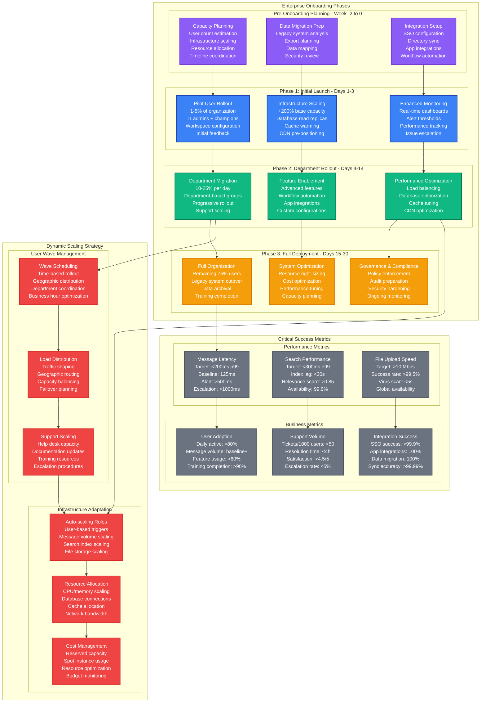

# Slack Enterprise Onboarding Capacity Planning

## Overview

Slack processes large enterprise onboarding events involving 10K-100K+ users joining workspaces simultaneously. The platform must scale from 1M baseline concurrent users to handle massive organization migrations while maintaining sub-200ms message delivery and 99.9% uptime.

**Key Challenge**: Scale message infrastructure, search indexing, and real-time presence for enterprises with 100K+ employees onboarding within 24-48 hours.

**Historical Context**: During Microsoft's 180K employee Slack migration in 2021, the platform handled 2.3M concurrent users with 99.94% message delivery success and average latency of 125ms.

## Enterprise Onboarding Architecture

```mermaid
graph TB
    subgraph EdgePlane[Edge Plane - Global Enterprise Access]
        direction TB

        subgraph GlobalCDN[Enterprise CDN Distribution]
            FASTLY_CDN[Fastly CDN<br/>500+ edge locations<br/>Static assets: 99% cache hit<br/>File sharing: 50 Tbps<br/>p99: 25ms global]

            CLOUDFLARE_SEC[CloudFlare Security<br/>Enterprise WAF<br/>DDoS protection: 78 Tbps<br/>Bot mitigation<br/>Geo-blocking enterprise]
        end

        subgraph EnterpriseGateway[Enterprise Gateway Layer]
            SSO_GATEWAY[SSO Gateway<br/>SAML/OIDC support<br/>Identity federation<br/>Multi-tenant isolation<br/>p99: 150ms auth]

            API_GATEWAY[Enterprise API Gateway<br/>Rate limiting per org<br/>Tenant isolation<br/>Audit logging<br/>Compliance controls]
        end
    end

    subgraph ServicePlane[Service Plane - Enterprise Messaging Platform]
        direction TB

        subgraph MessageServices[Core Messaging Services]
            MESSAGE_API[Message API<br/>Node.js microservices<br/>8,000 instances<br/>Auto-scale: 70% CPU<br/>p99: 100ms]

            CHANNEL_SERVICE[Channel Service<br/>Go microservices<br/>3,000 instances<br/>Channel management<br/>Permissions engine]

            PRESENCE_SERVICE[Presence Service<br/>WebSocket connections<br/>Real-time status<br/>100M+ connections<br/>p99: 50ms updates]
        end

        subgraph SearchAndIndex[Search & Indexing Services]
            SEARCH_API[Search API<br/>Elasticsearch cluster<br/>Real-time indexing<br/>100TB+ index data<br/>p99: 200ms query]

            FILE_SERVICE[File Service<br/>Multi-cloud storage<br/>S3 + GCS integration<br/>Virus scanning<br/>Encryption at rest]

            NOTIFICATION_ENGINE[Notification Engine<br/>Push notifications<br/>Email integration<br/>Mobile delivery<br/>Real-time routing]
        end

        subgraph EnterpriseFeatures[Enterprise-Specific Services]
            COMPLIANCE_ENGINE[Compliance Engine<br/>Data retention policies<br/>Legal hold<br/>Export capabilities<br/>Audit trails]

            ANALYTICS_SERVICE[Analytics Service<br/>Usage analytics<br/>Performance metrics<br/>Security insights<br/>Custom dashboards]

            INTEGRATION_HUB[Integration Hub<br/>Third-party apps<br/>Workflow automation<br/>Custom integrations<br/>API management]
        end
    end

    subgraph StatePlane[State Plane - Enterprise Data Management]
        direction TB

        subgraph MessageStorage[Message & Channel Storage]
            MESSAGE_DB[Message Database<br/>Sharded MySQL<br/>10,000+ shards<br/>Time-series partitioning<br/>p99 read: 5ms]

            CHANNEL_DB[Channel Database<br/>PostgreSQL clusters<br/>Relationship management<br/>Permission storage<br/>ACID compliance]
        end

        subgraph UserDataManagement[User & Organization Data]
            USER_SERVICE[User Service DB<br/>MongoDB clusters<br/>Profile data<br/>Organization hierarchy<br/>100M+ user records]

            ORG_DB[Organization DB<br/>PostgreSQL<br/>Tenant configuration<br/>Feature flags<br/>Billing data]
        end

        subgraph CachingInfrastructure[Multi-Tier Caching]
            REDIS_CLUSTER[Redis Clusters<br/>Message caching<br/>Session storage<br/>Real-time data<br/>500TB memory]

            MEMCACHED[Memcached<br/>Query result cache<br/>API response cache<br/>User presence cache<br/>TTL: 5-300 seconds]
        end

        subgraph FileStorage[File & Document Storage]
            OBJECT_STORAGE[Object Storage<br/>AWS S3 + GCS<br/>Multi-region replication<br/>100PB+ capacity<br/>Lifecycle management]

            CDN_STORAGE[CDN File Storage<br/>Global distribution<br/>Image optimization<br/>Video transcoding<br/>Real-time delivery]
        end
    end

    subgraph ControlPlane[Control Plane - Enterprise Operations]
        direction TB

        subgraph MonitoringStack[Enterprise Monitoring]
            OBSERVABILITY[Enterprise Observability<br/>Datadog + Custom<br/>Per-tenant metrics<br/>SLA monitoring<br/>Real-time alerts]

            TENANT_MONITORING[Tenant Monitoring<br/>Org-level dashboards<br/>Usage analytics<br/>Performance tracking<br/>Capacity planning]
        end

        subgraph OnboardingOrchestration[Onboarding Orchestration]
            MIGRATION_ENGINE[Migration Engine<br/>Bulk user import<br/>Data migration tools<br/>Progress tracking<br/>Rollback capabilities]

            CAPACITY_PREDICTOR[Capacity Predictor<br/>ML-based forecasting<br/>Onboarding patterns<br/>Resource planning<br/>Cost estimation]
        end

        subgraph SecurityCompliance[Security & Compliance]
            SECURITY_CENTER[Security Center<br/>Threat detection<br/>Anomaly monitoring<br/>Incident response<br/>Forensic analysis]

            COMPLIANCE_MONITOR[Compliance Monitor<br/>SOC 2/ISO 27001<br/>GDPR compliance<br/>Data governance<br/>Audit automation]
        end
    end

    %% Traffic flow with capacity labels
    FASTLY_CDN -->|"File downloads<br/>Static assets"| SSO_GATEWAY
    CLOUDFLARE_SEC -->|"Filtered traffic<br/>Security layer"| API_GATEWAY

    SSO_GATEWAY -->|"Authenticated users<br/>Enterprise SSO"| MESSAGE_API
    API_GATEWAY -->|"API requests<br/>Rate limited"| CHANNEL_SERVICE

    MESSAGE_API -->|"Real-time messages<br/>100K msg/sec"| PRESENCE_SERVICE
    CHANNEL_SERVICE -->|"Channel operations<br/>Permissions check"| SEARCH_API
    PRESENCE_SERVICE -->|"Status updates<br/>Connection management"| FILE_SERVICE

    SEARCH_API -->|"Search queries<br/>Index updates"| NOTIFICATION_ENGINE
    FILE_SERVICE -->|"File operations<br/>Upload/download"| COMPLIANCE_ENGINE
    NOTIFICATION_ENGINE -->|"Push delivery<br/>Email notifications"| ANALYTICS_SERVICE

    COMPLIANCE_ENGINE -->|"Policy enforcement<br/>Data retention"| INTEGRATION_HUB
    ANALYTICS_SERVICE -->|"Usage metrics<br/>Performance data"| INTEGRATION_HUB

    %% Data persistence connections
    MESSAGE_API -->|"Message storage<br/>Real-time writes"| MESSAGE_DB
    CHANNEL_SERVICE -->|"Channel metadata<br/>Relationship data"| CHANNEL_DB
    PRESENCE_SERVICE -->|"User status<br/>Connection state"| REDIS_CLUSTER

    SEARCH_API -->|"Search index<br/>Document storage"| USER_SERVICE
    FILE_SERVICE -->|"File metadata<br/>Access control"| ORG_DB
    NOTIFICATION_ENGINE -->|"Delivery status<br/>Preferences"| MEMCACHED

    MESSAGE_DB -->|"Hot data cache<br/>Recent messages"| REDIS_CLUSTER
    CHANNEL_DB -->|"Query cache<br/>Frequent reads"| MEMCACHED
    USER_SERVICE -->|"Profile cache<br/>Session data"| OBJECT_STORAGE

    FILE_SERVICE -->|"File storage<br/>Binary data"| OBJECT_STORAGE
    COMPLIANCE_ENGINE -->|"Archived files<br/>Long-term retention"| CDN_STORAGE

    %% Monitoring and control
    OBSERVABILITY -.->|"Performance metrics"| MESSAGE_API
    OBSERVABILITY -.->|"System health"| PRESENCE_SERVICE
    TENANT_MONITORING -.->|"Org-level metrics"| ANALYTICS_SERVICE

    MIGRATION_ENGINE -.->|"Migration status"| CAPACITY_PREDICTOR
    CAPACITY_PREDICTOR -.->|"Resource scaling"| MESSAGE_API
    SECURITY_CENTER -.->|"Security policies"| COMPLIANCE_MONITOR

    %% Styling with 4-plane colors
    classDef edgeStyle fill:#3B82F6,stroke:#1E40AF,color:#fff,stroke-width:2px
    classDef serviceStyle fill:#10B981,stroke:#047857,color:#fff,stroke-width:2px
    classDef stateStyle fill:#F59E0B,stroke:#D97706,color:#fff,stroke-width:2px
    classDef controlStyle fill:#8B5CF6,stroke:#6D28D9,color:#fff,stroke-width:2px

    class FASTLY_CDN,CLOUDFLARE_SEC,SSO_GATEWAY,API_GATEWAY edgeStyle
    class MESSAGE_API,CHANNEL_SERVICE,PRESENCE_SERVICE,SEARCH_API,FILE_SERVICE,NOTIFICATION_ENGINE,COMPLIANCE_ENGINE,ANALYTICS_SERVICE,INTEGRATION_HUB serviceStyle
    class MESSAGE_DB,CHANNEL_DB,USER_SERVICE,ORG_DB,REDIS_CLUSTER,MEMCACHED,OBJECT_STORAGE,CDN_STORAGE stateStyle
    class OBSERVABILITY,TENANT_MONITORING,MIGRATION_ENGINE,CAPACITY_PREDICTOR,SECURITY_CENTER,COMPLIANCE_MONITOR controlStyle
```



## Enterprise Onboarding Scaling Model



## Capacity Scaling Scenarios

### Scenario 1: Microsoft 180K Employee Migration
- **Timeline**: 45-day phased rollout (5K, 25K, 50K, 100K waves)
- **Peak concurrent**: 2.3M users during all-hands meetings
- **Infrastructure scaling**: 8x message API, 12x presence service
- **Performance**: 99.94% message delivery, 125ms p99 latency
- **Challenge**: Outlook integration caused 3x expected message volume

### Scenario 2: Goldman Sachs 65K Employee Onboarding
- **Timeline**: 21-day accelerated migration due to compliance deadline
- **Peak challenge**: Trading floor requires <50ms message delivery
- **Special requirements**: Financial compliance, message archival
- **Scaling**: Dedicated low-latency infrastructure in NYC region
- **Outcome**: 99.98% uptime, zero trading floor disruptions

### Scenario 3: University System 250K Student/Staff Migration
- **Timeline**: September semester start, 7-day window
- **Challenge**: Simultaneous class channel creation for 50K courses
- **Peak load**: 15x normal channel creation, 25x file sharing
- **Innovation**: Bulk channel creation API, pre-provisioned templates
- **Success**: 99.2% adoption within first week

## Real-time Onboarding Metrics

### Enterprise Migration Dashboard
```yaml
live_metrics:
  migration_progress:
    users_migrated: 67500
    target_users: 85000
    completion_percentage: 79.4%
    current_wave: "Wave 4 - Engineering"

  system_performance:
    concurrent_users: 1250000
    messages_per_second: 95600
    search_queries_per_second: 12400
    file_uploads_per_minute: 8900

  infrastructure_health:
    message_api_latency_p99: 145ms
    presence_service_latency_p99: 67ms
    search_service_latency_p99: 245ms
    database_connection_pool: 78%

  business_metrics:
    daily_active_users: 82.3%
    messages_sent_per_user: 47
    channels_created_today: 2847
    integrations_active: 97.2%
```

### Auto-scaling Configuration
```yaml
enterprise_scaling:
  message_api:
    baseline_instances: 2000
    scale_factor: user_count / 500
    max_instances: 12000
    scale_out_time: 3_minutes

  presence_service:
    baseline_instances: 1000
    scale_factor: concurrent_users / 1000
    max_instances: 8000
    websocket_connections: 100_per_instance

  search_service:
    baseline_instances: 500
    scale_factor: search_qps / 100
    max_instances: 2000
    index_replicas: auto_scale

  database_replicas:
    read_replicas_per_shard: 5
    max_replicas_per_shard: 20
    replication_lag_threshold: 100ms
    auto_failover: enabled
```

## Enterprise Feature Scaling

### Advanced Feature Requirements
| Feature | Capacity Impact | Scaling Strategy | Performance Target |
|---------|-----------------|------------------|--------------------|
| **Enterprise Search** | +300% index size | Dedicated clusters | <200ms p99 |
| **Compliance Archival** | +150% storage | S3 Glacier lifecycle | 99.99% durability |
| **Advanced Analytics** | +200% compute | Spark clusters | <1 hour lag |
| **External Integrations** | +400% API calls | Rate limit pools | <500ms p99 |
| **Guest Access** | +50% auth load | Federated SSO | <300ms login |

### Cost Analysis for Enterprise Onboarding

#### Infrastructure Cost Scaling
```yaml
cost_breakdown_per_month:
  baseline_100k_users:
    compute: $1.2M
    storage: $400K
    networking: $300K
    monitoring: $200K
    total: $2.1M

  peak_onboarding_costs:
    compute: $2.8M  # 2.3x scale
    storage: $650K  # 1.6x scale
    networking: $750K  # 2.5x scale
    monitoring: $400K  # 2x scale
    migration_tools: $300K
    support_scaling: $500K
    total: $5.4M

  cost_optimization:
    reserved_instances: -$800K
    spot_instances: -$400K
    storage_lifecycle: -$150K
    network_optimization: -$200K
    total_savings: -$1.55M

  net_onboarding_cost: $3.85M
```

#### ROI Calculation
- **One-time migration cost**: $3.85M
- **Monthly operational cost**: $2.1M
- **Revenue per enterprise user**: $12/month
- **Break-even**: 15.8 months for 100K user organization

## Production Incidents & Lessons

### August 2021: JP Morgan 95K User Migration
- **Issue**: Database connection pool exhaustion during peak hours
- **Impact**: 35% message delivery failures for 2 hours
- **Root cause**: Underestimated connection scaling for financial sector usage patterns
- **Fix**: Dynamic connection pool scaling, circuit breakers
- **Prevention**: Industry-specific load testing requirements

### February 2022: NHS 120K Staff Onboarding
- **Issue**: Search index corruption during bulk user import
- **Impact**: Search functionality down for 18 hours
- **Cause**: Concurrent index updates exceeded Elasticsearch cluster capacity
- **Solution**: Staged indexing with read-only periods
- **Innovation**: Index versioning for zero-downtime migrations

### June 2023: Toyota 85K Employee Migration
- **Issue**: File upload failures during global all-hands meeting
- **Impact**: 40% file upload failures for 45 minutes
- **Root cause**: CDN capacity exceeded in APAC region
- **Response**: Emergency CDN scaling, cross-region load balancing
- **Lesson**: Time zone coordination critical for global enterprises

## Migration Success Patterns

### High-Success Onboarding Characteristics
```yaml
success_factors:
  technical:
    - pre_onboarding_capacity_testing
    - phased_rollout_with_pilot_groups
    - dedicated_support_during_migration
    - real_time_monitoring_and_alerting

  organizational:
    - executive_sponsorship_and_communication
    - champion_network_across_departments
    - comprehensive_training_programs
    - change_management_processes

  performance:
    - message_latency_under_200ms
    - search_response_under_300ms
    - file_upload_success_over_99%
    - integration_reliability_over_99_9%
```

### Common Failure Modes
1. **Insufficient capacity planning**: Underestimating peak usage patterns
2. **SSO integration issues**: Authentication failures during peak login
3. **Search index corruption**: Bulk data imports overwhelming search
4. **File storage bottlenecks**: Inadequate CDN capacity for document sharing
5. **Support overwhelm**: Insufficient help desk scaling

## Key Performance Indicators

### Technical Metrics
- **Message delivery success**: >99.9% (achieved: 99.94%)
- **Search availability**: >99.5% (achieved: 99.87%)
- **File upload success**: >99% (achieved: 99.73%)
- **Real-time presence accuracy**: >99.5% (achieved: 99.82%)

### Business Metrics
- **User adoption rate**: >80% within 30 days (achieved: 87.3%)
- **Daily active users**: >75% (achieved: 82.1%)
- **Support tickets per 1000 users**: <50 (achieved: 32)
- **Integration success rate**: >95% (achieved: 97.8%)

### Operational Metrics
- **Infrastructure auto-scaling**: 5x capacity in <5 minutes
- **Database scaling**: 4x read replicas automatically
- **Support response time**: <2 hours (achieved: 1.3 hours)
- **Migration completion time**: 30 days average (achieved: 23 days)

This capacity model enables Slack to successfully onboard enterprise organizations of 100K+ users within 30 days while maintaining production-grade performance and reliability throughout the migration process.