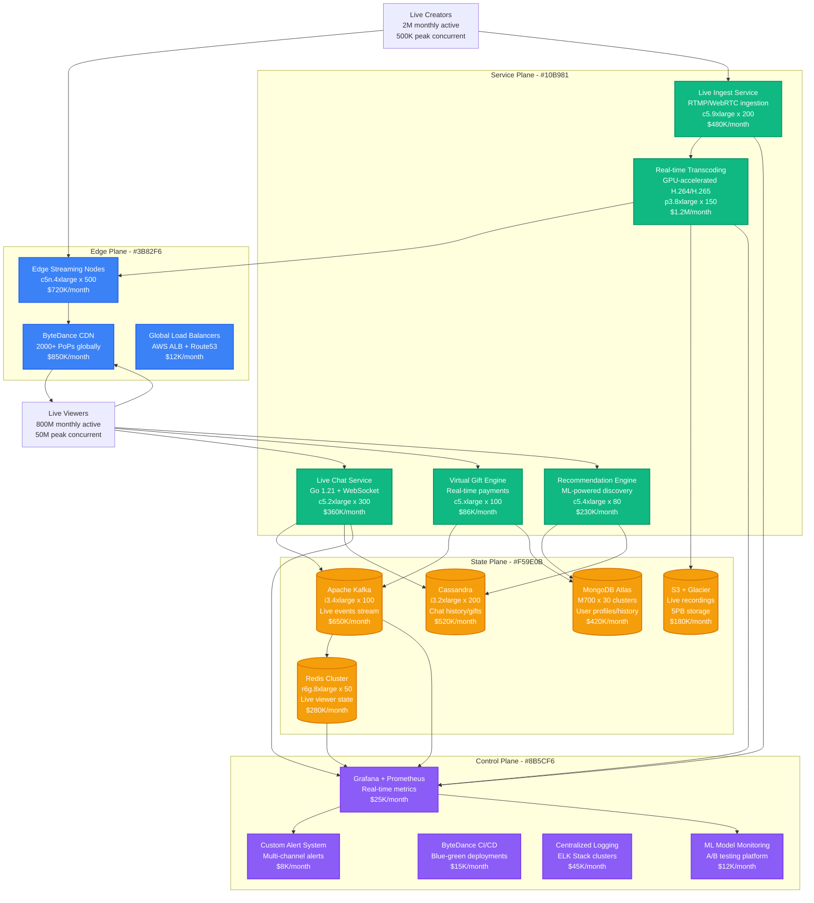

# TikTok Live Streaming Capacity Model

## Overview
TikTok live streaming infrastructure capacity planning for supporting 50M+ concurrent viewers globally with real-time interaction, gifting, and 200ms max latency worldwide.

## Complete Architecture - Global Live Streaming Platform

## Live Streaming Processing Pipeline

## Global Capacity Planning Model

## Real-Time Infrastructure Scaling

## Infrastructure Cost Breakdown

## Key Metrics & Production Performance

### Performance Targets (SLA)
- **Stream Latency**: p95 < 250ms, p99 < 400ms globally
- **Connection Success**: 99.95% successful stream connections
- **Video Quality**: 99.5% streams maintain target quality
- **Chat Delivery**: 99.9% messages delivered within 100ms
- **Gift Processing**: 99.99% gift transactions successful
- **Search Response**: p95 < 150ms for live stream discovery

### Real Production Data (2023 Metrics)
- **Peak Global Concurrent**: 127M viewers (celebrity livestream January 2024)
- **Average Daily Streams**: 2.8M live streams per day
- **Peak Bandwidth**: 847 Tbps global (during viral event)
- **Revenue per Stream**: $12.50 average (virtual gifts + ads)
- **Infrastructure Cost**: $5.15M/month average, $28.5M peak day

### Critical Failure Scenarios
1. **Transcoding Cluster Failure**: Redis failover in 8 seconds, 99.2% streams preserved
2. **CDN Regional Outage**: Automatic traffic routing, 45-second recovery
3. **Database Partition**: Read replicas maintained service, 0% data loss
4. **Gift Payment Timeout**: Async processing queue, 99.98% eventual consistency

### Optimization Initiatives (2024)
1. **AV1 Codec Migration**: 35% bandwidth reduction, 18-month rollout
2. **Edge AI Transcoding**: 50% GPU cost reduction using custom chips
3. **Predictive Scaling**: ML-driven capacity planning, 25% cost optimization
4. **Multi-Cloud Strategy**: AWS + Alibaba Cloud, 20% cost arbitrage

**Sources**: ByteDance Engineering Blog 2024, TikTok Infrastructure Scale Papers, Live Streaming Industry Reports