# Twitch Esports Tournament Capacity Planning

## Overview

Twitch handles massive viewer surges during major esports tournaments, with concurrent viewers spiking from 2.5M baseline to 15M+ during events like The International, League of Legends Worlds, or Fortnite World Cup. These events create 6-8x normal load with chat message rates reaching 2M messages/minute.

**Key Challenge**: Scale video streaming infrastructure, real-time chat systems, and interactive features for 15M+ simultaneous viewers while maintaining sub-200ms chat latency and 1080p60 video quality globally.

**Historical Context**: During the 2023 League of Legends World Championship finals, Twitch handled 14.7M concurrent viewers with 8.3M chat messages in the final hour, maintaining 99.8% uptime and 142ms average chat latency.

## Twitch Esports Infrastructure Architecture

```mermaid
graph TB
    subgraph EdgePlane[Edge Plane - Global Video Delivery]
        direction TB

        subgraph VideoStreaming[Video Streaming CDN]
            TWITCH_CDN[Twitch CDN<br/>1000+ edge servers<br/>Global video distribution<br/>Adaptive bitrate<br/>99.9% availability]

            VIDEO_INGEST[Video Ingest Servers<br/>RTMP/WebRTC ingestion<br/>Live transcoding<br/>Multiple qualities<br/>Sub-second latency]
        end

        subgraph GlobalEdgeNetwork[Global Edge Network]
            EDGE_SERVERS[Edge Video Servers<br/>Regional distribution<br/>Video caching<br/>Quality adaptation<br/>Viewer proximity routing]

            CHAT_EDGE[Chat Edge Servers<br/>Regional chat relay<br/>Message distribution<br/>Low latency delivery<br/>Geographic clustering]
        end
    end

    subgraph ServicePlane[Service Plane - Live Streaming Platform]
        direction TB

        subgraph VideoServices[Video Processing Services]
            STREAM_API[Streaming API<br/>WebRTC + HLS<br/>Quality selection<br/>Bitrate adaptation<br/>p99: 100ms]

            TRANSCODING[Live Transcoding<br/>Multiple quality streams<br/>Real-time processing<br/>1080p60, 720p60, 480p<br/>GPU-accelerated]

            VIDEO_STORAGE[Video Storage<br/>Live DVR buffering<br/>Clip generation<br/>VOD creation<br/>Highlights extraction]
        end

        subgraph ChatServices[Real-time Chat Services]
            CHAT_API[Chat API<br/>WebSocket + IRC<br/>Message validation<br/>Rate limiting<br/>p99: 50ms]

            CHAT_MODERATION[Chat Moderation<br/>Real-time filtering<br/>Spam detection<br/>Emote processing<br/>Auto-timeout systems]

            EMOTE_SERVICE[Emote Service<br/>Custom emotes<br/>Global emotes<br/>Subscriber emotes<br/>Animated emotes]
        end

        subgraph InteractiveFeatures[Interactive Features]
            BITS_CHEERING[Bits & Cheering<br/>Virtual currency<br/>Animated cheers<br/>Revenue tracking<br/>Leaderboards]

            PREDICTIONS[Predictions System<br/>Tournament brackets<br/>Match predictions<br/>Community voting<br/>Real-time results]

            EXTENSIONS[Extensions Platform<br/>Tournament overlays<br/>Statistics widgets<br/>Interactive polls<br/>Third-party integrations]
        end
    end

    subgraph StatePlane[State Plane - Streaming Data Management]
        direction TB

        subgraph StreamingData[Video & Stream Data]
            STREAM_DB[Stream Database<br/>PostgreSQL clusters<br/>Stream metadata<br/>Viewer analytics<br/>Performance metrics]

            VIDEO_METADATA[Video Metadata<br/>MongoDB<br/>Stream information<br/>Quality metrics<br/>Engagement data]
        end

        subgraph ChatData[Chat & User Data]
            CHAT_STORAGE[Chat Storage<br/>Cassandra<br/>Message history<br/>Chat logs<br/>Moderation records]

            USER_SERVICE[User Service<br/>PostgreSQL<br/>User profiles<br/>Subscriptions<br/>Following relationships]
        end

        subgraph AnalyticsData[Analytics & Revenue Data]
            ANALYTICS_DB[Analytics Database<br/>ClickHouse<br/>Viewer metrics<br/>Engagement analytics<br/>Revenue tracking]

            REVENUE_DB[Revenue Database<br/>PostgreSQL<br/>Bits purchases<br/>Subscription data<br/>Ad revenue]
        end

        subgraph CachingLayers[Multi-Tier Caching]
            REDIS_STREAMING[Redis Streaming Cache<br/>Stream status<br/>Viewer counts<br/>Chat state<br/>Real-time data]

            REDIS_CHAT[Redis Chat Cache<br/>Recent messages<br/>User permissions<br/>Emote cache<br/>Rate limit data]
        end
    end

    subgraph ControlPlane[Control Plane - Tournament Operations]
        direction TB

        subgraph TournamentMonitoring[Tournament-Specific Monitoring]
            ESPORTS_MONITORING[Esports Monitoring<br/>Viewer analytics<br/>Stream health<br/>Chat velocity<br/>Engagement tracking]

            TOURNAMENT_DASHBOARD[Tournament Dashboard<br/>Real-time metrics<br/>Multi-stream overview<br/>Performance alerts<br/>Revenue tracking]
        end

        subgraph CapacityManagement[Tournament Capacity Management]
            EVENT_PREDICTOR[Event Predictor<br/>Tournament schedules<br/>Historical viewership<br/>Team popularity<br/>Viral potential]

            SCALING_ENGINE[Scaling Engine<br/>Auto-scaling policies<br/>Predictive scaling<br/>Regional balancing<br/>Performance optimization]
        end

        subgraph EsportsOperations[Esports Operations]
            TOURNAMENT_SUPPORT[Tournament Support<br/>Producer liaison<br/>Technical support<br/>Broadcast coordination<br/>Issue escalation]

            COMMUNITY_MANAGEMENT[Community Management<br/>Chat moderation<br/>Creator relations<br/>Tournament promotion<br/>Viewer engagement]
        end
    end

    %% Traffic flow with esports-specific metrics
    TWITCH_CDN -->|"Video delivery<br/>15M+ concurrent viewers"| EDGE_SERVERS
    VIDEO_INGEST -->|"Live stream input<br/>1080p60 + multiple qualities"| CHAT_EDGE

    EDGE_SERVERS -->|"Video streaming<br/>Adaptive bitrate"| STREAM_API
    CHAT_EDGE -->|"Chat distribution<br/>2M messages/minute"| TRANSCODING

    STREAM_API -->|"Video processing<br/>Quality selection"| VIDEO_STORAGE
    TRANSCODING -->|"Multi-quality streams<br/>Real-time encoding"| CHAT_API
    VIDEO_STORAGE -->|"DVR buffer<br/>Clip generation"| CHAT_MODERATION

    CHAT_API -->|"Chat messages<br/>Real-time delivery"| EMOTE_SERVICE
    CHAT_MODERATION -->|"Filtered chat<br/>Spam protection"| BITS_CHEERING
    EMOTE_SERVICE -->|"Emote processing<br/>Custom emotes"| PREDICTIONS

    BITS_CHEERING -->|"Virtual currency<br/>Animated cheers"| EXTENSIONS
    PREDICTIONS -->|"Tournament predictions<br/>Community voting"| EXTENSIONS

    %% Data persistence connections
    STREAM_API -->|"Stream metadata<br/>Viewer analytics"| STREAM_DB
    TRANSCODING -->|"Video metadata<br/>Quality metrics"| VIDEO_METADATA
    VIDEO_STORAGE -->|"Chat history<br/>Message logs"| CHAT_STORAGE

    CHAT_API -->|"User data<br/>Profile updates"| USER_SERVICE
    CHAT_MODERATION -->|"Analytics events<br/>Viewer behavior"| ANALYTICS_DB
    BITS_CHEERING -->|"Revenue data<br/>Purchase tracking"| REVENUE_DB

    %% Caching connections
    STREAM_DB -->|"Stream status<br/>Live data"| REDIS_STREAMING
    VIDEO_METADATA -->|"Viewer counts<br/>Real-time metrics"| REDIS_STREAMING
    CHAT_STORAGE -->|"Recent chat<br/>Message cache"| REDIS_CHAT

    USER_SERVICE -->|"User permissions<br/>Chat state"| REDIS_CHAT
    ANALYTICS_DB -->|"Analytics cache<br/>Performance data"| REDIS_STREAMING

    %% Monitoring and control
    ESPORTS_MONITORING -.->|"Stream analytics"| STREAM_API
    ESPORTS_MONITORING -.->|"Chat metrics"| CHAT_API
    TOURNAMENT_DASHBOARD -.->|"Tournament metrics"| BITS_CHEERING

    EVENT_PREDICTOR -.->|"Scaling predictions"| SCALING_ENGINE
    SCALING_ENGINE -.->|"Resource scaling"| TRANSCODING
    SCALING_ENGINE -.->|"Capacity adjustments"| CHAT_API

    TOURNAMENT_SUPPORT -.->|"Technical coordination"| COMMUNITY_MANAGEMENT
    COMMUNITY_MANAGEMENT -.->|"Community insights"| ESPORTS_MONITORING

    %% Styling with 4-plane colors
    classDef edgeStyle fill:#3B82F6,stroke:#1E40AF,color:#fff,stroke-width:2px
    classDef serviceStyle fill:#10B981,stroke:#047857,color:#fff,stroke-width:2px
    classDef stateStyle fill:#F59E0B,stroke:#D97706,color:#fff,stroke-width:2px
    classDef controlStyle fill:#8B5CF6,stroke:#6D28D9,color:#fff,stroke-width:2px

    class TWITCH_CDN,VIDEO_INGEST,EDGE_SERVERS,CHAT_EDGE edgeStyle
    class STREAM_API,TRANSCODING,VIDEO_STORAGE,CHAT_API,CHAT_MODERATION,EMOTE_SERVICE,BITS_CHEERING,PREDICTIONS,EXTENSIONS serviceStyle
    class STREAM_DB,VIDEO_METADATA,CHAT_STORAGE,USER_SERVICE,ANALYTICS_DB,REVENUE_DB,REDIS_STREAMING,REDIS_CHAT stateStyle
    class ESPORTS_MONITORING,TOURNAMENT_DASHBOARD,EVENT_PREDICTOR,SCALING_ENGINE,TOURNAMENT_SUPPORT,COMMUNITY_MANAGEMENT controlStyle
```



## Tournament Event Management

```mermaid
graph TB
    subgraph TournamentCategories[Esports Tournament Categories & Viewership Patterns]
        direction TB

        subgraph PremierEvents[Premier Global Championships]
            LOL_WORLDS[LoL World Championship<br/>Peak: 14.7M viewers<br/>Duration: 6 hours finals<br/>Chat: 8.3M messages/hour<br/>Global audience spread]

            TI_DOTA[The International (Dota 2)<br/>Peak: 12.2M viewers<br/>Duration: 8 hours finals<br/>Chat: 6.8M messages/hour<br/>Prize pool hype]

            VALORANT_CHAMPS[Valorant Champions<br/>Peak: 9.8M viewers<br/>Duration: 5 hours finals<br/>Chat: 5.2M messages/hour<br/>Multi-language streams]
        end

        subgraph RegionalMajors[Regional Major Events]
            LCS_FINALS[LCS/LEC Finals<br/>Peak: 4.2M viewers<br/>Duration: 4 hours<br/>Chat: 2.8M messages/hour<br/>Regional fan loyalty]

            OWL_PLAYOFFS[Overwatch League<br/>Peak: 3.1M viewers<br/>Duration: 6 hours<br/>Chat: 1.9M messages/hour<br/>Team-based viewing]

            CSGO_MAJOR[CS:GO Major<br/>Peak: 5.8M viewers<br/>Duration: 5 hours<br/>Chat: 3.4M messages/hour<br/>European dominance]
        end

        subgraph BattleRoyaleEvents[Battle Royale Competitions]
            FORTNITE_WC[Fortnite World Cup<br/>Peak: 11.3M viewers<br/>Duration: 3 hours<br/>Chat: 7.1M messages/hour<br/>Younger demographic]

            APEX_ALGS[Apex Legends ALGS<br/>Peak: 2.8M viewers<br/>Duration: 4 hours<br/>Chat: 1.6M messages/hour<br/>Growing audience]

            PUBG_GLOBAL[PUBG Global<br/>Peak: 1.9M viewers<br/>Duration: 6 hours<br/>Chat: 1.1M messages/hour<br/>Asian markets]
        end
    end

    subgraph ViewershipDynamics[Tournament Viewership Dynamics]
        direction TB

        subgraph ViewerGrowthPattern[Viewer Growth Patterns]
            PRE_SHOW[Pre-show Build-up<br/>2 hours before finals<br/>20% peak viewership<br/>Hype building<br/>Predictions activity]

            MATCH_START[Match Start Surge<br/>First 15 minutes<br/>60% peak viewership<br/>Initial excitement<br/>Chat flood]

            CLIMAX_MOMENTS[Climax Moments<br/>Game-deciding plays<br/>100% peak viewership<br/>Maximum engagement<br/>Viral clip potential]

            POST_MATCH[Post-match Discussion<br/>30 minutes after<br/>40% peak viewership<br/>Analysis phase<br/>Community reaction]
        end

        subgraph ChatBehavior[Chat Engagement Behavior]
            SPAM_WAVES[Spam Wave Patterns<br/>Big plays: +500% chat<br/>Controversial calls: +800%<br/>Meme moments: +1200%<br/>Victory celebrations: +600%]

            EMOTE_USAGE[Emote Usage Spikes<br/>Team-specific emotes<br/>Celebration emotes<br/>Reaction emotes<br/>Subscriber-only mode]

            MODERATION_LOAD[Moderation Load<br/>+400% during controversial moments<br/>Real-time toxicity filtering<br/>Spam detection<br/>Language moderation]
        end

        subgraph TechnicalChallenges[Technical Scaling Challenges]
            BANDWIDTH_SURGE[Bandwidth Surges<br/>1080p60 preference: 85%<br/>Mobile viewing: 35%<br/>International routing<br/>Peak hour coordination]

            CHAT_SCALING[Chat System Scaling<br/>Message rate spikes<br/>Connection management<br/>Regional relay<br/>Lag prevention]

            INTERACTIVE_LOAD[Interactive Feature Load<br/>Predictions participation<br/>Bits cheering surges<br/>Extension usage<br/>Poll participation]
        end
    end

    subgraph RegionalConsiderations[Global Regional Considerations]
        direction TB

        subgraph TimezoneOptimization[Timezone Optimization]
            ASIA_PRIME[Asia Prime Time<br/>Midnight ET finals<br/>High mobile usage<br/>Chat in multiple languages<br/>Regional server load]

            EU_PRIME[Europe Prime Time<br/>Afternoon ET start<br/>Desktop dominance<br/>English/local language mix<br/>Strong chat engagement]

            NA_PRIME[North America Prime<br/>Evening ET finals<br/>High interaction rates<br/>Bits/subscriptions peak<br/>Creator co-streams]
        end

        subgraph LanguageAndCulture[Language & Cultural Factors]
            MULTI_LANGUAGE[Multi-language Streams<br/>Native commentary<br/>Cultural references<br/>Regional emotes<br/>Local sponsorships]

            CULTURAL_MOMENTS[Cultural Moments<br/>Regional rivalries<br/>Historical context<br/>Player storylines<br/>Community traditions]
        end
    end

    %% Tournament category connections
    LOL_WORLDS --> PRE_SHOW
    TI_DOTA --> MATCH_START
    VALORANT_CHAMPS --> CLIMAX_MOMENTS

    LCS_FINALS --> POST_MATCH
    OWL_PLAYOFFS --> SPAM_WAVES
    CSGO_MAJOR --> EMOTE_USAGE

    FORTNITE_WC --> MODERATION_LOAD
    APEX_ALGS --> BANDWIDTH_SURGE
    PUBG_GLOBAL --> CHAT_SCALING

    %% Viewership dynamics flow
    PRE_SHOW --> MATCH_START
    MATCH_START --> CLIMAX_MOMENTS
    CLIMAX_MOMENTS --> POST_MATCH

    SPAM_WAVES --> EMOTE_USAGE
    EMOTE_USAGE --> MODERATION_LOAD

    BANDWIDTH_SURGE --> CHAT_SCALING
    CHAT_SCALING --> INTERACTIVE_LOAD

    %% Regional connections
    ASIA_PRIME --> MULTI_LANGUAGE
    EU_PRIME --> CULTURAL_MOMENTS
    NA_PRIME --> MULTI_LANGUAGE

    %% Cross-connections
    LOL_WORLDS --> ASIA_PRIME
    VALORANT_CHAMPS --> EU_PRIME
    FORTNITE_WC --> NA_PRIME

    CLIMAX_MOMENTS --> SPAM_WAVES
    POST_MATCH --> BANDWIDTH_SURGE

    %% Styling
    classDef premierStyle fill:#EF4444,stroke:#DC2626,color:#fff,stroke-width:2px
    classDef regionalStyle fill:#F59E0B,stroke:#D97706,color:#fff,stroke-width:2px
    classDef battleRoyaleStyle fill:#8B5CF6,stroke:#6D28D9,color:#fff,stroke-width:2px
    classDef viewerStyle fill:#10B981,stroke:#047857,color:#fff,stroke-width:2px
    classDef chatStyle fill:#EC4899,stroke:#DB2777,color:#fff,stroke-width:2px
    classDef technicalStyle fill:#6B7280,stroke:#4B5563,color:#fff,stroke-width:2px
    classDef timezoneStyle fill:#3B82F6,stroke:#1E40AF,color:#fff,stroke-width:2px

    class LOL_WORLDS,TI_DOTA,VALORANT_CHAMPS premierStyle
    class LCS_FINALS,OWL_PLAYOFFS,CSGO_MAJOR regionalStyle
    class FORTNITE_WC,APEX_ALGS,PUBG_GLOBAL battleRoyaleStyle
    class PRE_SHOW,MATCH_START,CLIMAX_MOMENTS,POST_MATCH viewerStyle
    class SPAM_WAVES,EMOTE_USAGE,MODERATION_LOAD chatStyle
    class BANDWIDTH_SURGE,CHAT_SCALING,INTERACTIVE_LOAD technicalStyle
    class ASIA_PRIME,EU_PRIME,NA_PRIME,MULTI_LANGUAGE,CULTURAL_MOMENTS timezoneStyle
```

## Capacity Scaling Scenarios

### Scenario 1: League of Legends World Championship 2023 Finals
- **Global coordination**: 6-hour broadcast with 14.7M peak concurrent viewers
- **Infrastructure scaling**: 8x video transcoding capacity, 12x chat servers
- **Chat volume**: 8.3M messages in final hour, 142ms average latency
- **Regional distribution**: 45% Asia, 30% Europe, 25% Americas
- **Performance**: 99.8% uptime, sub-200ms chat delivery globally

### Scenario 2: Fortnite World Cup Creative Peak
- **Unexpected surge**: Creative showcase went viral mid-tournament
- **Viewer spike**: 3.2M to 11.3M in 8 minutes
- **Demographics**: 65% mobile viewers, 78% under age 25
- **Chat challenge**: Emote spam reached 3.5M messages/minute
- **Innovation**: Dynamic emote rate limiting preserved chat readability

### Scenario 3: The International 2023 Cinderella Story
- **Narrative impact**: Underdog team reaching finals created emotional surge
- **Sustained viewership**: 12.2M viewers for 4+ hours
- **International audience**: Stream in 15 languages simultaneously
- **Revenue impact**: Bits usage +450%, subscriptions +280%
- **Technical challenge**: Coordinated global infrastructure scaling

## Real-time Tournament Metrics

### Live Tournament Dashboard
```yaml
tournament_live_metrics:
  viewership_metrics:
    concurrent_viewers: 14700000
    peak_viewer_growth_rate: 450000_per_minute
    mobile_percentage: 35%
    international_percentage: 78%

  chat_performance:
    messages_per_minute: 2100000
    chat_latency_p99: 142ms
    moderation_actions_per_minute: 8500
    emote_usage_rate: 67%

  video_delivery:
    1080p60_adoption: 85%
    stream_reliability: 99.8%
    global_cdn_hit_rate: 96.2%
    adaptive_bitrate_switches: 15%

  interactive_engagement:
    predictions_participation: 45%
    bits_cheered_per_minute: 125000
    extension_interactions: 890000_per_hour
    clip_creation_rate: 12_per_minute
```

### Auto-scaling Configuration
```yaml
tournament_autoscaling:
  video_transcoding:
    baseline_capacity: 500_streams
    peak_multiplier: 8x
    quality_tiers: [1080p60, 720p60, 480p30]
    scale_trigger: viewer_threshold

  chat_infrastructure:
    baseline_servers: 1000
    message_rate_threshold: 500000_per_minute
    scale_factor: 2x
    max_servers: 8000

  cdn_bandwidth:
    baseline_capacity: 50_tbps
    peak_capacity: 400_tbps
    edge_server_scaling: automatic
    traffic_prediction: ml_based

  database_scaling:
    read_replicas: auto_scale_enabled
    connection_pools: dynamic_expansion
    query_optimization: tournament_mode
    cache_warming: predictive
```

## Tournament-Specific Optimizations

### Video Quality Optimization for Esports
| Quality Setting | Bitrate | CPU Usage | Bandwidth | Viewer Adoption |
|----------------|---------|-----------|-----------|-----------------|
| **1080p60** | 6000 kbps | High | 6 Mbps | 85% |
| **720p60** | 3500 kbps | Medium | 3.5 Mbps | 12% |
| **480p30** | 1200 kbps | Low | 1.2 Mbps | 3% |
| **Audio Only** | 128 kbps | Minimal | 0.1 Mbps | <1% |

### Chat Optimization Strategies
```yaml
chat_optimization:
  message_filtering:
    spam_detection: ml_based_real_time
    toxic_language: auto_timeout
    excessive_caps: message_rejection
    repeated_messages: rate_limiting

  emote_management:
    custom_tournament_emotes: enabled
    animated_emotes: high_engagement
    subscriber_only_mode: during_breaks
    emote_rate_limiting: dynamic

  moderation_scaling:
    auto_mod_sensitivity: high_during_tournaments
    human_moderator_count: 5x_normal
    volunteer_moderator_training: specialized
    escalation_procedures: rapid_response

  performance_optimization:
    message_batching: 100ms_windows
    connection_pooling: geographic
    load_balancing: latency_based
    cache_strategy: recent_messages
```

## Cost Analysis for Tournament Infrastructure

### Infrastructure Cost During Major Tournaments
```yaml
tournament_cost_breakdown:
  video_infrastructure:
    baseline_monthly: $12M
    tournament_surge_6h: $4.2M
    scaling_factor: 8x_transcoding

  chat_infrastructure:
    baseline_monthly: $3.8M
    tournament_surge_6h: $1.8M
    scaling_factor: 12x_servers

  cdn_bandwidth:
    baseline_monthly: $8.5M
    tournament_surge_6h: $3.9M
    scaling_factor: 8x_traffic

  analytics_processing:
    baseline_monthly: $2.1M
    tournament_surge_6h: $900K
    scaling_factor: 6x_data_volume

  total_tournament_cost: $10.8M_per_6h_major
  annual_tournament_budget: $85M_for_major_events
  roi_calculation: 340%_revenue_increase
```

### Revenue Impact Analysis
- **Subscriptions during tournaments**: +280% new subscriptions
- **Bits usage surge**: +450% during major moments
- **Ad revenue premium**: +180% CPM during tournaments
- **Creator program growth**: +35% new streamers post-tournament

## Production Incidents & Lessons

### August 2022: League of Legends Worlds Technical Pause
- **Issue**: 45-minute technical pause caused chat spam storm
- **Impact**: Chat message rate hit 4.2M/minute, overwhelming moderation
- **Root cause**: Insufficient spam protection during extended pauses
- **Fix**: Implemented pause-specific chat modes with enhanced filtering
- **Prevention**: Automated chat mode switching based on broadcast status

### October 2022: The International Prize Pool Tracking
- **Issue**: Real-time prize pool updates caused API rate limiting
- **Impact**: Extension widgets failed for 12% of viewers for 30 minutes
- **Cause**: Underestimated third-party API integration load
- **Solution**: Local caching with background synchronization
- **Innovation**: Tournament-specific API rate limiting profiles

### December 2023: Valorant Champions Mobile Surge
- **Issue**: Unexpected 400% mobile viewership growth overwhelmed mobile CDN
- **Impact**: Mobile stream quality degraded to 480p for 25 minutes
- **Response**: Emergency mobile CDN scaling and traffic redistribution
- **Learning**: Mobile-first capacity planning for younger demographics

## Community Engagement Optimization

### Tournament Community Features
```yaml
community_engagement:
  predictions_system:
    bracket_predictions: full_tournament
    match_predictions: real_time
    play_predictions: moment_to_moment
    reward_system: channel_points

  interactive_features:
    watch_parties: synchronized_viewing
    co_streaming: creator_participation
    live_polls: audience_voting
    team_specific_emotes: fan_engagement

  social_integration:
    twitter_integration: real_time_highlights
    reddit_discussions: cross_platform
    discord_coordination: team_communities
    youtube_highlights: post_match

  creator_ecosystem:
    watch_party_hosts: 500+_creators
    co_stream_participants: 200+_top_streamers
    post_match_analysis: expert_creators
    highlight_compilation: community_creators
```

### Tournament Success Metrics
- **Peak concurrent viewers**: >10M for Tier 1 events
- **Chat engagement rate**: >60% active participants
- **Predictions participation**: >40% of viewers
- **Creator co-stream adoption**: >200 simultaneous streams

## Key Performance Indicators

### Technical Performance
- **Stream reliability**: >99.8% (achieved: 99.8%)
- **Chat latency p99**: <200ms (achieved: 142ms)
- **Video quality delivery**: 1080p60 for >80% (achieved: 85%)
- **Global CDN performance**: <100ms p99 (achieved: 78ms)

### Business Metrics
- **Revenue per tournament**: $2.8M average major event
- **Subscription conversion**: +280% during tournaments
- **Creator ecosystem growth**: +35% new streamers
- **Brand partnership value**: +150% premium for tournament placement

### Community Impact
- **Peak concurrent viewers**: 14.7M record
- **Chat messages**: 8.3M/hour peak
- **Clip creation**: +400% during tournaments
- **Community retention**: +45% post-tournament engagement

This capacity model enables Twitch to deliver world-class esports tournament experiences with sub-200ms chat latency and 1080p60 video quality for 15M+ concurrent viewers while fostering vibrant community engagement.