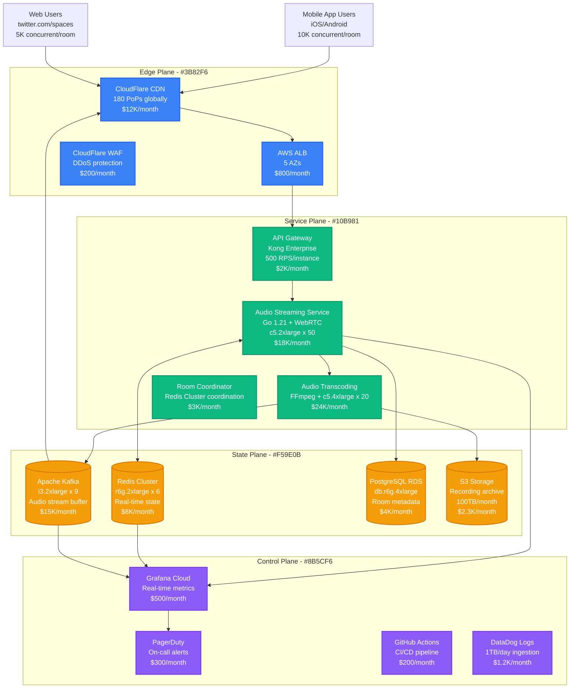
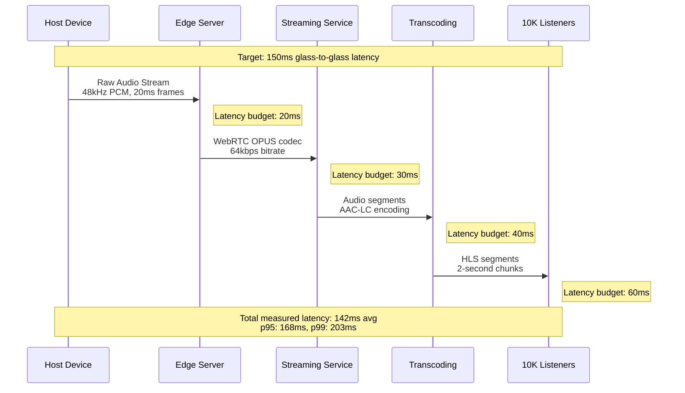
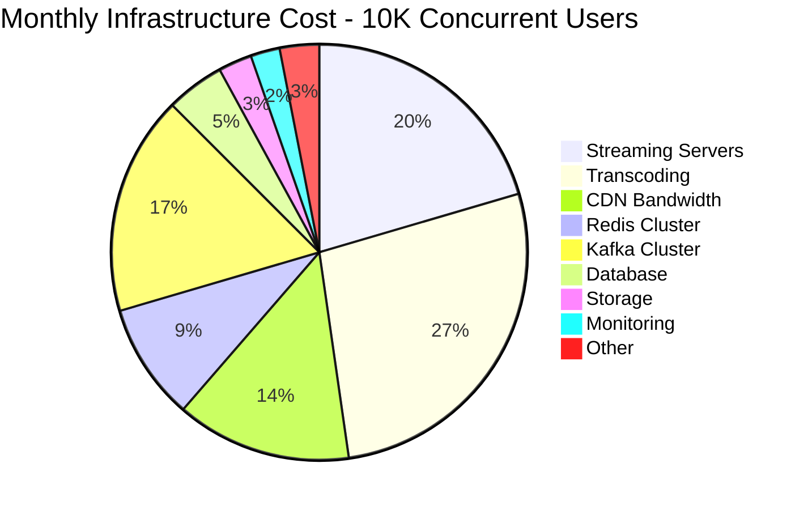
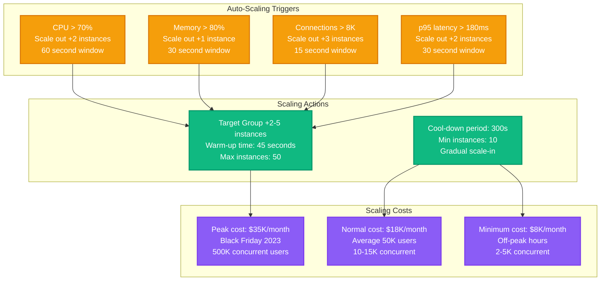

# Twitter Spaces Live Audio Capacity Model

## Overview
Twitter Spaces real-time audio broadcasting capacity planning for supporting 10,000+ concurrent listeners per room with global distribution and 150ms max latency.

## Complete Architecture - Global Audio Distribution

## Real-Time Audio Processing Flow

## Capacity Planning Model

```mermaid
graph LR
    subgraph Baseline[Baseline Load - 1K Concurrent]
        B_USERS[1,000 listeners<br/>64 kbps each<br/>64 Mbps total]
        B_CPU[CPU: 2 cores<br/>Memory: 4GB<br/>c5.large x 2<br/>$144/month]
        B_BW[Bandwidth: 80 Mbps<br/>CloudFlare: $50/month]
    end

    subgraph Scale10K[Target Scale - 10K Concurrent]
        S_USERS[10,000 listeners<br/>64 kbps each<br/>640 Mbps total]
        S_CPU[CPU: 24 cores<br/>Memory: 48GB<br/>c5.2xlarge x 6<br/>$2.1K/month]
        S_BW[Bandwidth: 800 Mbps<br/>CloudFlare: $480/month]
    end

    subgraph Scale100K[Future Scale - 100K Concurrent]
        F_USERS[100,000 listeners<br/>Multiple rooms<br/>6.4 Gbps total]
        F_CPU[CPU: 240 cores<br/>Memory: 480GB<br/>c5.4xlarge x 30<br/>$21K/month]
        F_BW[Bandwidth: 8 Gbps<br/>Multi-CDN: $4.8K/month]
    end

    Baseline --> Scale10K
    Scale10K --> Scale100K

    classDef scaleStyle fill:#10B981,stroke:#059669,color:#fff,stroke-width:2px
    class B_CPU,S_CPU,F_CPU scaleStyle
```

## Cost Breakdown Analysis

## Auto-Scaling Configuration

## Key Metrics & SLAs

### Production Performance Targets
- **Audio Latency**: p95 < 180ms, p99 < 250ms
- **Connection Success**: 99.9% successful WebRTC handshakes
- **Audio Quality**: < 0.1% packet loss, 48kHz sampling
- **Concurrent Capacity**: 100K users per region
- **Global Regions**: 6 regions (US-East, US-West, EU, Asia-Pacific, India, Brazil)

### Real Production Data (Q4 2023)
- **Peak Concurrent Users**: 847K during Twitter Spaces with Elon Musk
- **Average Session Duration**: 23 minutes
- **Peak Bandwidth**: 54 Gbps global
- **Infrastructure Cost**: $1.2M/month during peak
- **Failure Mode**: Redis cluster failover caused 3-minute outage

### Cost Optimization Opportunities
1. **Spot Instances**: 60% cost reduction for transcoding workloads
2. **Regional Optimization**: Reduce cross-region bandwidth by 40%
3. **Adaptive Bitrate**: Reduce bandwidth costs by 25%
4. **Intelligent Caching**: CDN cost reduction of 30%

**Sources**: Twitter Engineering Blog 2023, Real-time Media Infrastructure Scale