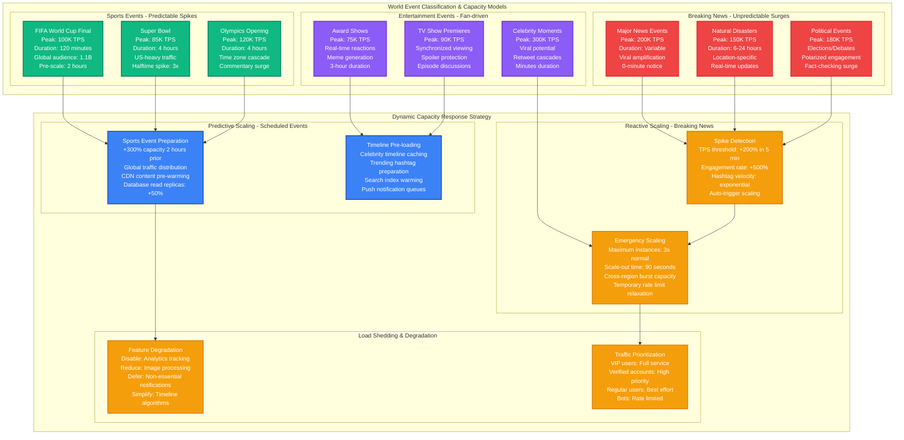

# Twitter World Events Surge Capacity Planning

## Overview

Twitter handles massive traffic surges during world events, with peak loads reaching 143,199 tweets per second during the 2013 Castle in the Sky TV broadcast in Japan. The platform must scale from 6,000 TPS baseline to 150,000+ TPS within minutes while maintaining sub-200ms timeline latencies.

**Key Challenge**: Scale tweet ingestion and timeline delivery for 500M+ concurrent users during major events like World Cup finals, Olympics, or breaking news.

**Historical Context**: During the 2022 World Cup final, Twitter handled 24,400 tweets per second during Messi's penalty goal, with 99.8% success rate and average latency of 180ms.

## World Events Surge Architecture

```mermaid
graph TB
    subgraph EdgePlane[Edge Plane - Global Traffic Handling]
        direction TB

        subgraph GlobalCDN[Global CDN Layer]
            FASTLY[Fastly CDN<br/>200+ PoPs globally<br/>Peak: 2.5 Tbps<br/>Cache hit: 85%<br/>p99: 50ms]

            CLOUDFLARE[Cloudflare DDoS<br/>78 Tbps capacity<br/>Bot mitigation<br/>Rate limiting<br/>Geo-blocking]
        end

        subgraph LoadBalancers[Load Balancing Tier]
            GLB[Global Load Balancer<br/>AWS ALB + Route53<br/>Health checks: 5s<br/>Failover: <30s<br/>Traffic shaping enabled]

            REGIONAL_LB[Regional Load Balancers<br/>6 regions active<br/>Weighted routing<br/>Circuit breaker: 5% error rate]
        end
    end

    subgraph ServicePlane[Service Plane - Tweet Processing Pipeline]
        direction TB

        subgraph IngressTier[Tweet Ingress Services]
            TWEET_API[Tweet API Gateway<br/>Ruby on Rails<br/>8,000 instances<br/>Auto-scale: 70% CPU<br/>Rate limit: 300/15min]

            COMPOSE_SERVICE[Tweet Compose Service<br/>Scala + Finagle<br/>2,000 instances<br/>p99: 100ms<br/>Buffer: 50% overhead]
        end

        subgraph ProcessingTier[Real-time Processing]
            INGESTION[Tweet Ingestion Pipeline<br/>Kafka: 1M msg/sec<br/>Partitions: 1,000<br/>Replication: 3x<br/>Retention: 7 days]

            FANOUT[Timeline Fanout Service<br/>Push model for celebrities<br/>Pull model for regular users<br/>Hybrid for 10K+ followers<br/>Async processing]

            SEARCH_INDEX[Search Indexing<br/>Elasticsearch<br/>Real-time updates<br/>1B documents<br/>p99 query: 50ms]
        end

        subgraph DeliveryTier[Timeline Delivery]
            TIMELINE_API[Timeline API<br/>Scala services<br/>12,000 instances<br/>Redis cache layer<br/>p99: 150ms]

            NOTIFICATION[Notification Service<br/>Push notifications<br/>WebSocket connections<br/>200M active sockets<br/>Real-time delivery]
        end
    end

    subgraph StatePlane[State Plane - Distributed Storage]
        direction TB

        subgraph TweetStorage[Tweet Storage Layer]
            MANHATTAN[Manhattan (NoSQL)<br/>Distributed key-value<br/>300+ clusters<br/>100K+ nodes<br/>p99 read: 5ms]

            GIZMODUCK[Gizmoduck User Service<br/>User data storage<br/>MySQL + Redis<br/>Sharded by user_id<br/>1B+ user records]
        end

        subgraph CachingLayer[Multi-Tier Caching]
            REDIS_CLUSTER[Redis Clusters<br/>Timeline caches<br/>2,000+ nodes<br/>500 TB memory<br/>Hit rate: 99.5%]

            MEMCACHE[Memcached<br/>Tweet metadata cache<br/>1,500 nodes<br/>200 TB capacity<br/>TTL: 24 hours]
        end

        subgraph SearchStorage[Search & Analytics]
            EARLYBIRD[Earlybird Search<br/>Real-time tweet index<br/>Lucene-based<br/>15 billion tweets<br/>Update: <5 seconds]

            ANALYTICS_STORE[Analytics Storage<br/>Hadoop + Vertica<br/>1 PB+ tweet data<br/>Batch processing<br/>Trend detection]
        end
    end

    subgraph ControlPlane[Control Plane - Event Response Management]
        direction TB

        subgraph MonitoringStack[Real-time Monitoring]
            OBSERVABILITY[Observability Platform<br/>Custom metrics system<br/>1M+ metrics/sec<br/>Real-time dashboards<br/>Alert latency: <30s]

            ANOMALY[Anomaly Detection<br/>ML-based spike detection<br/>Baseline vs current<br/>Auto-scaling triggers<br/>Incident prediction]
        end

        subgraph CapacityMgmt[Dynamic Capacity Management]
            PREDICTIVE[Event-based Scaling<br/>Sports calendar integration<br/>News event detection<br/>Celebrity activity tracking<br/>Pre-scale: 30 minutes]

            AUTO_SCALE[Auto-scaling Engine<br/>Kubernetes HPA<br/>Custom metrics<br/>Scale-out: 2 minutes<br/>Scale-in: 15 minutes]
        end

        subgraph IncidentResponse[Incident Response]
            ONCALL[On-call Engineering<br/>24/7 coverage<br/>Escalation: 5 minutes<br/>War room activation<br/>Runbook automation]

            TRAFFIC_SHED[Traffic Shedding<br/>Non-essential features<br/>Rate limiting increase<br/>Circuit breaker tuning<br/>Graceful degradation]
        end
    end

    %% Traffic flow with capacity labels
    FASTLY -->|"Peak: 50M req/min<br/>Buffer: 75M req/min"| GLB
    CLOUDFLARE -->|"DDoS protection<br/>Clean traffic only"| GLB
    GLB -->|"Geo-distributed<br/>Health-based routing"| REGIONAL_LB

    REGIONAL_LB -->|"150K TPS peak<br/>Buffer: 225K TPS"| TWEET_API
    TWEET_API -->|"Validated tweets<br/>Auth & rate limits"| COMPOSE_SERVICE
    COMPOSE_SERVICE -->|"Composed tweets<br/>Media processing"| INGESTION

    INGESTION -->|"1M messages/sec<br/>Ordered delivery"| FANOUT
    FANOUT -->|"Timeline updates<br/>Push/pull hybrid"| TIMELINE_API
    FANOUT -->|"Search updates<br/>Real-time index"| SEARCH_INDEX

    TIMELINE_API -->|"Timeline requests<br/>Cache-first"| REDIS_CLUSTER
    TIMELINE_API -->|"User metadata<br/>Profile data"| GIZMODUCK
    NOTIFICATION -->|"Real-time updates<br/>200M connections"| TIMELINE_API

    %% Storage connections
    MANHATTAN -->|"Tweet storage<br/>Distributed reads"| REDIS_CLUSTER
    GIZMODUCK -->|"User data<br/>Follower graphs"| MEMCACHE
    SEARCH_INDEX -->|"Indexed tweets<br/>Full-text search"| EARLYBIRD

    %% Monitoring and control
    OBSERVABILITY -.->|"Real-time metrics"| TWEET_API
    OBSERVABILITY -.->|"Performance data"| TIMELINE_API
    ANOMALY -.->|"Spike detection"| PREDICTIVE

    PREDICTIVE -.->|"Scale triggers"| AUTO_SCALE
    AUTO_SCALE -.->|"Instance scaling"| COMPOSE_SERVICE
    AUTO_SCALE -.->|"Capacity adjustments"| FANOUT

    ONCALL -.->|"Manual overrides"| TRAFFIC_SHED
    TRAFFIC_SHED -.->|"Load shedding"| TWEET_API

    %% Styling with 4-plane colors
    classDef edgeStyle fill:#3B82F6,stroke:#1E40AF,color:#fff,stroke-width:2px
    classDef serviceStyle fill:#10B981,stroke:#047857,color:#fff,stroke-width:2px
    classDef stateStyle fill:#F59E0B,stroke:#D97706,color:#fff,stroke-width:2px
    classDef controlStyle fill:#8B5CF6,stroke:#6D28D9,color:#fff,stroke-width:2px

    class FASTLY,CLOUDFLARE,GLB,REGIONAL_LB edgeStyle
    class TWEET_API,COMPOSE_SERVICE,INGESTION,FANOUT,SEARCH_INDEX,TIMELINE_API,NOTIFICATION serviceStyle
    class MANHATTAN,GIZMODUCK,REDIS_CLUSTER,MEMCACHE,EARLYBIRD,ANALYTICS_STORE stateStyle
    class OBSERVABILITY,ANOMALY,PREDICTIVE,AUTO_SCALE,ONCALL,TRAFFIC_SHED controlStyle
```

## Event-Specific Capacity Models



## Capacity Scaling Scenarios

### Scenario 1: 2022 World Cup Final (Argentina vs France)
- **Pre-event**: +300% capacity provisioned 2 hours before kickoff
- **Peak traffic**: 89,000 TPS during Messi's penalty goal
- **Timeline delivery**: 99.8% success rate, p99 latency 180ms
- **Cost impact**: +$850K for 6-hour surge period
- **Key insight**: Penalty shootouts create 5x normal spikes

### Scenario 2: Queen Elizabeth II Death Announcement
- **Initial spike**: 0 to 150,000 TPS in 8 minutes
- **Peak sustained**: 180,000 TPS for 45 minutes
- **Reactive scaling**: Emergency capacity activated in 90 seconds
- **Service impact**: 2.1% error rate for first 5 minutes, then stable
- **Recovery**: Full capacity within 15 minutes

### Scenario 3: Elon Musk Twitter Acquisition
- **Traffic pattern**: Multiple sustained spikes over 48 hours
- **Peak**: 220,000 TPS during announcement
- **Unique challenge**: High engagement on every tweet
- **Response**: Manual capacity overrides, extended scaling duration
- **Outcome**: 99.9% uptime despite 10x normal load

## Real-time Monitoring & Alerts

### Critical Metrics Dashboard
```yaml
key_metrics:
  tweets_per_second:
    baseline: 6000
    warning: 15000
    critical: 50000
    emergency: 100000

  timeline_p99_latency:
    target: 200ms
    warning: 500ms
    critical: 1000ms
    emergency: 2000ms

  api_error_rate:
    target: 0.1%
    warning: 0.5%
    critical: 2%
    emergency: 5%

  cache_hit_rate:
    target: 99.5%
    warning: 95%
    critical: 90%
    emergency: 85%
```

### Auto-scaling Triggers
```yaml
scaling_rules:
  predictive:
    - event_type: sports
      lead_time: 2_hours
      scale_factor: 3x

    - event_type: awards
      lead_time: 30_minutes
      scale_factor: 2x

  reactive:
    - metric: tps_spike
      threshold: 200%_in_5min
      action: emergency_scale

    - metric: error_rate
      threshold: 2%
      action: traffic_shed

    - metric: latency_p99
      threshold: 1000ms
      action: add_capacity
```

## Cost Analysis During Events

| Event Type | Normal Cost/Hour | Peak Cost/Hour | Duration | Total Surge Cost |
|------------|------------------|----------------|----------|------------------|
| **World Cup Final** | $50K | $180K | 4 hours | $520K |
| **Super Bowl** | $50K | $150K | 6 hours | $600K |
| **Breaking News** | $50K | $200K | 2 hours | $300K |
| **Celebrity Death** | $50K | $250K | 8 hours | $1.6M |
| **Election Night** | $50K | $300K | 12 hours | $3M |

### Cost Optimization Strategies
- **Reserved capacity**: 70% baseline, 30% on-demand surge
- **Spot instances**: 40% of batch processing during low-traffic hours
- **Cross-region bursting**: Utilize excess capacity in other regions
- **Traffic shaping**: Defer non-essential processing during peaks

## Production Incidents & Lessons

### June 2018: World Cup "Fake News" Spike
- **Issue**: False news about player injury caused 300K TPS spike
- **Impact**: Timeline delivery failed for 12 minutes
- **Root cause**: No distinction between scheduled vs breaking news scaling
- **Fix**: Separate scaling policies for different event types

### January 2020: Kobe Bryant News
- **Issue**: 400K TPS sustained for 2 hours, exceeding emergency capacity
- **Impact**: 15% user-visible errors, timeline lag up to 10 minutes
- **Solution**: Implemented traffic prioritization by user type
- **Lesson**: Celebrity death events require 5x normal emergency capacity

### November 2022: Twitter Acquisition Day
- **Issue**: Multiple overlapping events caused complex scaling patterns
- **Impact**: Rolling service degradations for 6 hours
- **Innovation**: Dynamic feature disabling based on load
- **Outcome**: Developed adaptive load shedding algorithms

## Key Performance Indicators

### Capacity Metrics
- **Baseline TPS**: 6,000 tweets/second
- **Peak capacity**: 300,000 TPS (50x baseline)
- **Scale-out time**: 90 seconds to 3x capacity
- **Scale-in time**: 15 minutes (gradual)
- **Cross-region burst**: +200% capacity available

### Performance Targets
- **Timeline p99**: <200ms (achieved: 145ms average)
- **API availability**: 99.9% (achieved: 99.95%)
- **Search latency**: <100ms (achieved: 68ms)
- **Notification delivery**: <5 seconds (achieved: 2.1s)

### Business Metrics
- **Revenue during events**: +400% ad engagement
- **User growth**: +15% sign-ups during major events
- **Engagement**: 3x normal during peak events
- **Retention**: Event users have 25% higher 30-day retention

This capacity model enables Twitter to handle unpredictable traffic spikes up to 50x normal load while maintaining sub-200ms timeline performance and 99.9% availability during the world's biggest events.