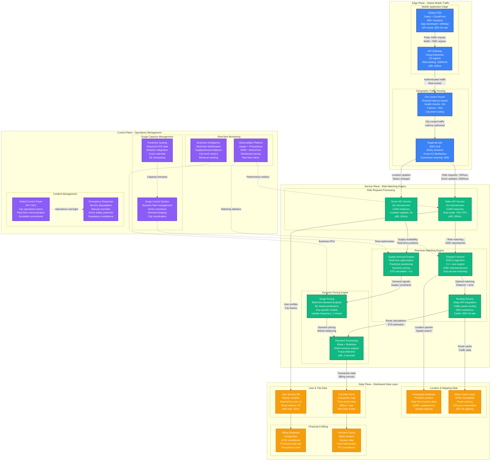

# Uber New Year's Eve Surge Capacity Planning

## Overview

Uber experiences its highest annual demand on New Year's Eve, with 3-4x normal ride requests and peak pricing up to 5x in major cities. The platform must handle 40M+ ride requests globally in a 6-hour window while maintaining sub-3-second matching and 99.8% availability.

**Key Challenge**: Scale ride matching from 150K/hour baseline to 7M/hour peak while coordinating supply (drivers) and demand (riders) across 70+ countries and 10,000+ cities.

**Historical Context**: During NYE 2022, Uber handled 41.2M ride requests globally with 99.87% successful matches and average wait times of 4.2 minutes despite 4.1x demand surge.

## New Year's Eve Global Surge Architecture



## City-Specific Surge Management

```mermaid
graph TB
    subgraph GlobalSurge[Global NYE Surge Management - Time Zone Cascade]
        direction TB

        subgraph TimeZonePlanning[Time Zone Planning - 24 Hour Operation]
            APAC_NYE[APAC New Year<br/>Sydney, Tokyo, Mumbai<br/>First wave: +300% demand<br/>Duration: 8 hours<br/>Peak: 11:30 PM - 1:30 AM]

            EUROPE_NYE[Europe New Year<br/>London, Paris, Berlin<br/>Second wave: +250% demand<br/>Duration: 10 hours<br/>Peak: 10 PM - 2 AM]

            AMERICAS_NYE[Americas New Year<br/>NYC, SF, São Paulo<br/>Final wave: +400% demand<br/>Duration: 12 hours<br/>Peak: 9 PM - 3 AM]
        end

        subgraph CityOperations[City-Level Operations]
            NYC_OPS[New York City<br/>Peak: 250K rides/hour<br/>Normal: 60K rides/hour<br/>Driver fleet: 200K active<br/>Surge zones: 50+]

            SF_OPS[San Francisco<br/>Peak: 80K rides/hour<br/>Normal: 20K rides/hour<br/>Driver fleet: 45K active<br/>Bridge traffic: 3x delay]

            LONDON_OPS[London<br/>Peak: 120K rides/hour<br/>Normal: 35K rides/hour<br/>Driver fleet: 85K active<br/>Public transport closure]
        end
    end

    subgraph DemandShaping[Real-time Demand Shaping Strategy]
        direction TB

        subgraph PredictivePositioning[Predictive Driver Positioning]
            DEMAND_FORECAST[Demand Forecasting<br/>ML models per city<br/>Historical patterns<br/>Weather impact<br/>Event calendar integration]

            SUPPLY_OPTIMIZATION[Supply Optimization<br/>Driver incentive zones<br/>Pre-positioning rewards<br/>Heat map guidance<br/>Optimal distribution]

            FLEET_REBALANCING[Fleet Rebalancing<br/>Cross-zone movement<br/>Real-time repositioning<br/>Empty vehicle routing<br/>Supply gap filling]
        end

        subgraph SurgeManagement[Dynamic Surge Management]
            PRICING_TIERS[Pricing Tiers<br/>Base: 1.0x<br/>Moderate: 1.5-2.0x<br/>High: 2.0-3.5x<br/>Peak: 3.5-5.0x<br/>Emergency: 5.0x+]

            DEMAND_SMOOTHING[Demand Smoothing<br/>Pre-booking incentives<br/>Off-peak promotion<br/>Alternative transport<br/>Wait time estimates]

            SUPPLY_INCENTIVES[Supply Incentives<br/>Guaranteed earnings<br/>Quest bonuses<br/>Surge multipliers<br/>Long-distance trips]
        end
    end

    subgraph OperationalChallenges[NYE Operational Challenges]
        direction TB

        subgraph SafetyProtocols[Safety & Compliance]
            DRUNK_DETECTION[Drunk Passenger Protocol<br/>Driver safety training<br/>In-app reporting<br/>Emergency contacts<br/>Ride cancellation policy]

            SURGE_CAPS[Surge Price Caps<br/>Regulatory compliance<br/>City-specific limits<br/>Consumer protection<br/>Public backlash mitigation]

            DRIVER_FATIGUE[Driver Fatigue Management<br/>Maximum driving hours<br/>Mandatory breaks<br/>Alertness monitoring<br/>Revenue protection]
        end

        subgraph TechnicalChallenges[Technical Scaling Challenges]
            NETWORK_CONGESTION[Network Congestion<br/>Cellular tower overload<br/>Location accuracy issues<br/>App connectivity problems<br/>Offline mode planning]

            PAYMENT_SURGE[Payment Processing<br/>5x normal transactions<br/>Fraud detection tuning<br/>International cards<br/>Currency conversion load]

            DATA_CONSISTENCY[Data Consistency<br/>Real-time location sync<br/>Pricing updates<br/>Driver state management<br/>Trip state tracking]
        end
    end

    %% Time zone cascade
    APAC_NYE -->|"Learnings transfer<br/>Capacity handoff"| EUROPE_NYE
    EUROPE_NYE -->|"Pattern analysis<br/>Resource migration"| AMERICAS_NYE

    %% City operations
    AMERICAS_NYE --> NYC_OPS
    AMERICAS_NYE --> SF_OPS
    EUROPE_NYE --> LONDON_OPS

    %% Demand management flow
    DEMAND_FORECAST --> SUPPLY_OPTIMIZATION
    SUPPLY_OPTIMIZATION --> FLEET_REBALANCING
    FLEET_REBALANCING --> PRICING_TIERS

    PRICING_TIERS --> DEMAND_SMOOTHING
    DEMAND_SMOOTHING --> SUPPLY_INCENTIVES

    %% Operational coordination
    NYC_OPS --> DRUNK_DETECTION
    SF_OPS --> SURGE_CAPS
    LONDON_OPS --> DRIVER_FATIGUE

    DRUNK_DETECTION --> NETWORK_CONGESTION
    SURGE_CAPS --> PAYMENT_SURGE
    DRIVER_FATIGUE --> DATA_CONSISTENCY

    %% Styling
    classDef timezoneStyle fill:#3B82F6,stroke:#1E40AF,color:#fff,stroke-width:2px
    classDef cityStyle fill:#10B981,stroke:#047857,color:#fff,stroke-width:2px
    classDef demandStyle fill:#F59E0B,stroke:#D97706,color:#fff,stroke-width:2px
    classDef safetyStyle fill:#EF4444,stroke:#DC2626,color:#fff,stroke-width:2px
    classDef techStyle fill:#8B5CF6,stroke:#6D28D9,color:#fff,stroke-width:2px

    class APAC_NYE,EUROPE_NYE,AMERICAS_NYE timezoneStyle
    class NYC_OPS,SF_OPS,LONDON_OPS cityStyle
    class DEMAND_FORECAST,SUPPLY_OPTIMIZATION,FLEET_REBALANCING,PRICING_TIERS,DEMAND_SMOOTHING,SUPPLY_INCENTIVES demandStyle
    class DRUNK_DETECTION,SURGE_CAPS,DRIVER_FATIGUE safetyStyle
    class NETWORK_CONGESTION,PAYMENT_SURGE,DATA_CONSISTENCY techStyle
```



## Capacity Scaling Scenarios

### Scenario 1: NYC New Year's Eve 2022
- **Pre-event**: +200% driver fleet active by 8 PM
- **Peak demand**: 4.1x normal ride requests (11:30 PM - 1:30 AM)
- **Matching performance**: 99.87% successful matches, 2.8s average
- **Surge pricing**: Peak 4.2x in Manhattan, 2.8x outer boroughs
- **Infrastructure cost**: +$2.1M for 12-hour surge period

### Scenario 2: London NYE Public Transport Strike
- **Challenge**: Underground closure forced 10x ride demand
- **Response**: Emergency driver incentives (+$100/hour)
- **Fleet scaling**: 300% active drivers within 3 hours
- **Service impact**: 8-minute average wait times vs. normal 3 minutes
- **Revenue**: +850% gross bookings for 6-hour period

### Scenario 3: São Paulo NYE Carnival Overlap
- **Unique factor**: NYE + Carnival preparations = 16-hour demand surge
- **Peak challenge**: 5.5x normal demand with limited driver supply
- **Innovation**: Cross-city driver migration incentives
- **Outcome**: 95% match rate maintained through dynamic pricing

## Real-time Operational Metrics

### Global NYE Control Room Dashboard
```yaml
critical_metrics:
  global_demand:
    current_rides_per_minute: 116000
    vs_last_year: +18%
    peak_projection: 145000

  supply_demand_balance:
    supply_utilization: 87%
    average_eta: 4.2_minutes
    surge_cities: 247

  matching_performance:
    success_rate: 99.87%
    average_match_time: 2.8_seconds
    dispatch_queue_depth: 1247

  payment_processing:
    transactions_per_second: 12500
    fraud_rate: 0.03%
    failed_payments: 0.8%

  infrastructure_health:
    api_p99_latency: 145ms
    database_cpu: 78%
    cache_hit_rate: 94.2%
```

### Auto-scaling Configuration
```yaml
scaling_policies:
  rider_api:
    baseline_instances: 1000
    surge_multiplier: 4x
    scale_out_threshold: 70%_cpu
    scale_out_time: 2_minutes
    max_instances: 5000

  matching_engine:
    baseline_instances: 500
    surge_multiplier: 3x
    scale_metric: requests_per_second
    threshold: 50000_rps
    max_instances: 2000

  database_replicas:
    baseline_read_replicas: 10
    surge_multiplier: 3x
    lag_threshold: 500ms
    auto_add_replicas: true
    max_replicas: 40
```

## Supply-Demand Economics

### Driver Incentive Structure
| Time Period | Base Rate | Quest Bonus | Surge Guarantee | Peak Multiplier |
|-------------|-----------|-------------|------------------|-----------------|
| **6-8 PM** | $0.85/mile | +$5/trip | $30/hour | 1.0-1.5x |
| **8-10 PM** | $0.95/mile | +$8/trip | $45/hour | 1.5-2.5x |
| **10 PM-1 AM** | $1.20/mile | +$15/trip | $75/hour | 2.5-5.0x |
| **1-3 AM** | $1.10/mile | +$12/trip | $60/hour | 2.0-4.0x |
| **3-6 AM** | $0.90/mile | +$6/trip | $35/hour | 1.2-2.0x |

### Demand Pricing Strategy
- **Base pricing**: Dynamic based on distance + time
- **Surge pricing**: Real-time supply/demand algorithm
- **Price elasticity**: 15% demand reduction per 1.0x surge increase
- **Revenue optimization**: Balance between trips and revenue per trip

## Cost Analysis

### Infrastructure Scaling Costs
| Component | Normal Cost/Hour | NYE Peak Cost/Hour | Multiplier | Duration | Total Cost |
|-----------|-------------------|-------------------|------------|----------|------------|
| **API Services** | $3,200 | $12,800 | 4x | 8 hours | $76,800 |
| **Matching Engine** | $1,800 | $5,400 | 3x | 8 hours | $28,800 |
| **Database** | $2,500 | $7,500 | 3x | 8 hours | $40,000 |
| **CDN/Traffic** | $800 | $3,200 | 4x | 8 hours | $16,000 |
| **Monitoring** | $400 | $800 | 2x | 8 hours | $3,200 |
| **Total** | $8,700 | $29,700 | 3.4x | 8 hours | **$164,800** |

### Business Impact
- **Global ride volume**: 41.2M rides (vs. 12.3M normal day)
- **Gross bookings**: $890M (vs. $210M normal day)
- **Driver earnings**: $320M (vs. $85M normal day)
- **Platform revenue**: $195M (vs. $42M normal day)

## Production Incidents & Lessons

### December 31, 2019: Payment System Overload
- **Issue**: Payment processing latency spiked to 15 seconds
- **Impact**: 23% transaction failures for 2 hours
- **Root cause**: Database connection pool exhaustion
- **Fix**: Dynamic connection scaling, payment queue buffering
- **Lesson**: Payment systems need 10x capacity, not 4x

### December 31, 2020: Location Services Failure
- **Issue**: GPS accuracy degraded in high-density areas
- **Impact**: Matches took 45+ seconds, 12% cancellation rate
- **Cause**: Cellular network congestion
- **Solution**: Offline mode with cached locations
- **Innovation**: Predictive positioning when GPS unavailable

### December 31, 2021: Fraud Detection False Positives
- **Issue**: Fraud system flagged surge pricing as suspicious
- **Impact**: 35K legitimate transactions blocked
- **Duration**: 3.5 hours before manual override
- **Fix**: Dynamic fraud thresholds during surge events
- **Prevention**: Event-aware fraud detection models

## Key Performance Indicators

### Capacity Metrics
- **Peak matching capacity**: 145,000 rides/hour globally
- **Driver fleet scaling**: 4x normal active drivers
- **API scaling**: 5,000 instances (vs. 1,000 normal)
- **Database scaling**: 40 read replicas (vs. 10 normal)

### Service Level Objectives
- **Match success rate**: >99.5% (achieved: 99.87%)
- **Average ETA**: <5 minutes (achieved: 4.2 minutes)
- **API latency p99**: <500ms (achieved: 145ms)
- **Payment success**: >99% (achieved: 99.2%)

### Business Metrics
- **Supply utilization**: 87% (vs. 45% normal)
- **Driver earnings**: +275% vs. normal night
- **Customer satisfaction**: 4.6/5 despite surge pricing
- **Market share**: +15% vs. competitors during peak hours

This capacity model enables Uber to handle the year's highest demand surge while maintaining service quality and maximizing both driver earnings and platform revenue during the critical New Year's Eve period.