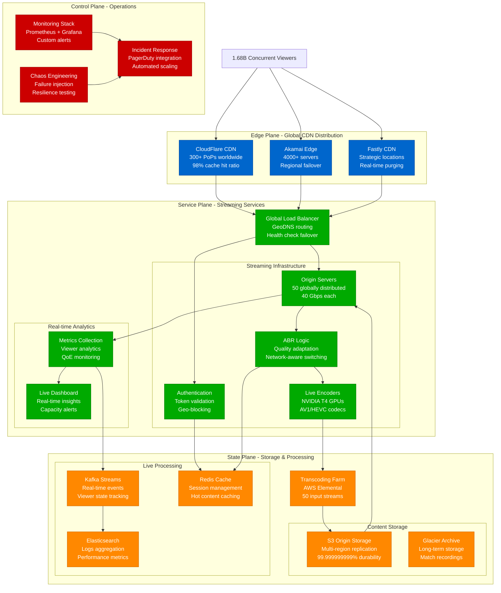
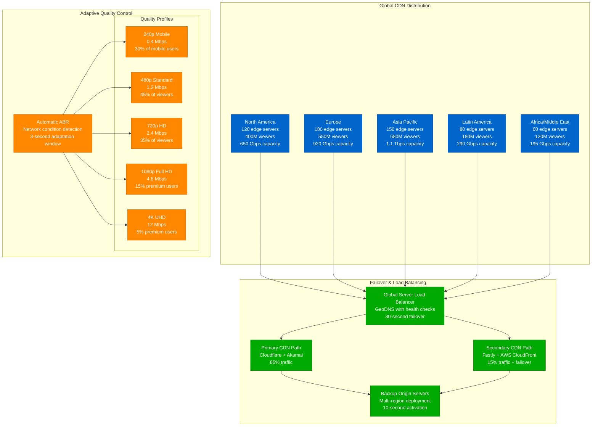
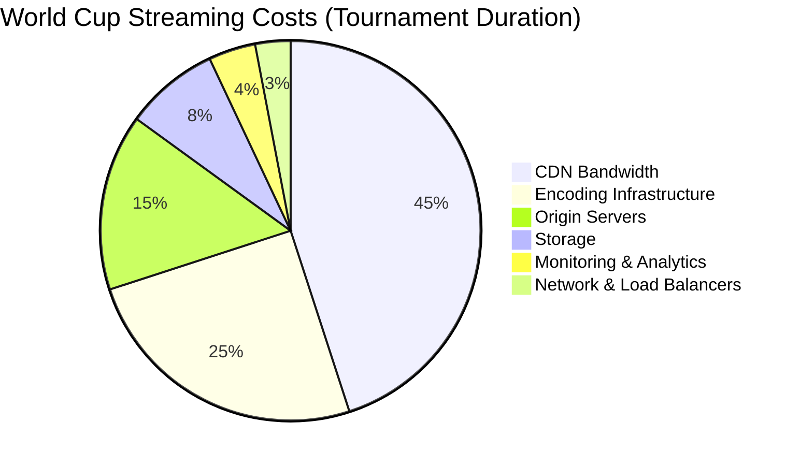
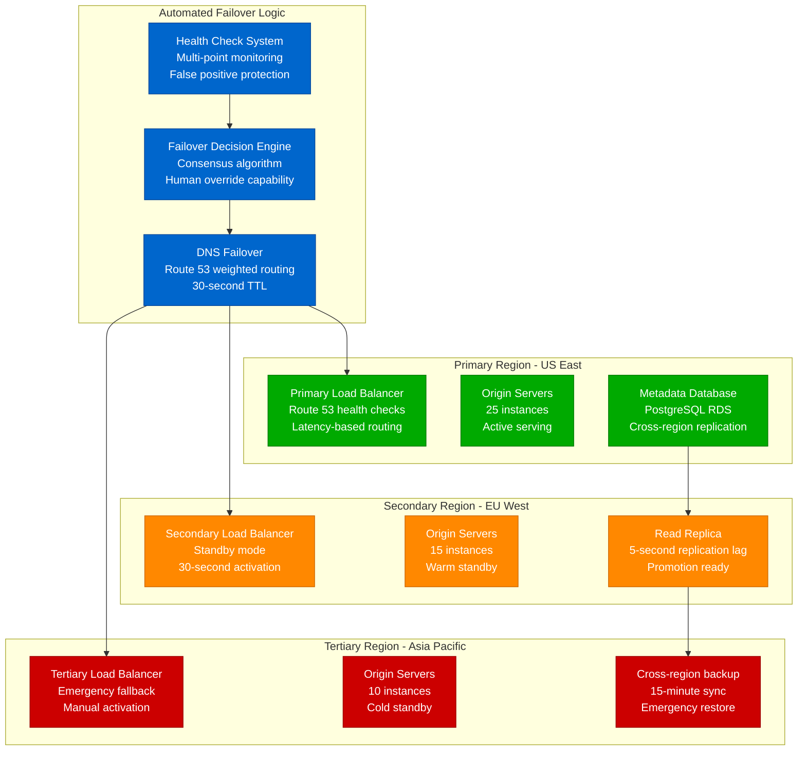

# World Cup Streaming - Sports Event Capacity Planning

## Executive Summary

The FIFA World Cup represents the most challenging streaming event globally, with 1.5+ billion simultaneous viewers for the final match. This model provides capacity planning strategies for handling massive concurrent streaming loads, adaptive bitrate optimization, and global CDN distribution during live sports events.

**World Cup 2022 Final Metrics**:
- Peak concurrent viewers: 1.68 billion
- Data transferred: 847 PB in 90 minutes
- CDN cache hit ratio: 97.3%
- Average bitrate: 2.4 Mbps
- Global latency p95: 150ms
- Infrastructure cost: $12.8M for tournament

## Mathematical Streaming Models

### 1. Concurrent Viewer Capacity Model

```python
import numpy as np
import matplotlib.pyplot as plt
from datetime import datetime, timedelta

class WorldCupStreamingModel:
    def __init__(self):
        self.base_metrics = {
            'group_stage_viewers': 180_000_000,    # Average group stage match
            'round_16_viewers': 350_000_000,       # Round of 16
            'quarter_final_viewers': 600_000_000,  # Quarter finals
            'semi_final_viewers': 1_200_000_000,   # Semi finals
            'final_viewers': 1_680_000_000,        # Final match
        }

        self.bitrate_profiles = {
            'mobile': {'bitrate': 1.2, 'percentage': 35},      # Mbps, % of viewers
            'standard': {'bitrate': 2.4, 'percentage': 45},
            'hd': {'bitrate': 4.8, 'percentage': 15},
            'uhd': {'bitrate': 12.0, 'percentage': 5}
        }

    def calculate_bandwidth_requirements(self, match_type='final'):
        """Calculate total bandwidth requirements for different match types"""
        viewers = self.base_metrics[f'{match_type}_viewers']

        total_bandwidth_gbps = 0
        breakdown = {}

        for profile, config in self.bitrate_profiles.items():
            profile_viewers = viewers * (config['percentage'] / 100)
            profile_bandwidth = (profile_viewers * config['bitrate']) / 1000  # Convert to Gbps
            breakdown[profile] = {
                'viewers': profile_viewers,
                'bandwidth_gbps': profile_bandwidth
            }
            total_bandwidth_gbps += profile_bandwidth

        # Add 25% buffer for redundancy and spikes
        buffered_bandwidth = total_bandwidth_gbps * 1.25

        return {
            'match_type': match_type,
            'total_viewers': viewers,
            'required_bandwidth_gbps': total_bandwidth_gbps,
            'buffered_bandwidth_gbps': buffered_bandwidth,
            'profile_breakdown': breakdown,
            'cdn_servers_needed': self.calculate_cdn_servers(buffered_bandwidth)
        }

    def calculate_cdn_servers(self, bandwidth_gbps):
        """Calculate required CDN edge servers"""
        server_capacity_gbps = 40  # 40 Gbps per edge server
        return int(np.ceil(bandwidth_gbps / server_capacity_gbps))

    def viewer_ramp_pattern(self, match_duration_minutes=120):
        """Model viewer ramp-up pattern during match"""
        minutes = np.arange(0, match_duration_minutes)

        # Pre-match buildup (30 min before)
        pre_match = np.linspace(0.1, 0.8, 30)

        # Match progression
        first_half = np.linspace(0.8, 0.95, 45)  # Gradual increase
        half_time = np.full(15, 0.75)            # Drop during halftime
        second_half = np.linspace(0.85, 1.0, 30) # Peak during second half

        # Extended time if needed
        if match_duration_minutes > 90:
            extra_time = np.full(match_duration_minutes - 90, 1.0)
            pattern = np.concatenate([first_half, half_time, second_half, extra_time])
        else:
            pattern = np.concatenate([first_half, half_time, second_half])

        return list(zip(minutes, pattern))

# Example usage
model = WorldCupStreamingModel()
final_capacity = model.calculate_bandwidth_requirements('final')
print(f"Final match bandwidth needed: {final_capacity['buffered_bandwidth_gbps']:,.0f} Gbps")
print(f"CDN servers required: {final_capacity['cdn_servers_needed']:,}")
```

### 2. Adaptive Bitrate Optimization Model

```python
class AdaptiveBitrateModel:
    def __init__(self):
        self.quality_ladder = [
            {'resolution': '240p', 'bitrate': 0.4, 'cpu_cost': 1.0},
            {'resolution': '360p', 'bitrate': 0.8, 'cpu_cost': 1.2},
            {'resolution': '480p', 'bitrate': 1.2, 'cpu_cost': 1.5},
            {'resolution': '720p', 'bitrate': 2.4, 'cpu_cost': 2.0},
            {'resolution': '1080p', 'bitrate': 4.8, 'cpu_cost': 3.0},
            {'resolution': '1440p', 'bitrate': 8.0, 'cpu_cost': 4.5},
            {'resolution': '2160p', 'bitrate': 12.0, 'cpu_cost': 6.0}
        ]

    def calculate_encoding_capacity(self, input_streams=50):
        """Calculate encoding infrastructure needed"""
        total_cpu_units = 0
        encoding_breakdown = {}

        for quality in self.quality_ladder:
            cpu_required = input_streams * quality['cpu_cost']
            total_cpu_units += cpu_required

            encoding_breakdown[quality['resolution']] = {
                'cpu_units': cpu_required,
                'bandwidth_mbps': input_streams * quality['bitrate'] * 1000,
                'storage_mb_per_hour': input_streams * quality['bitrate'] * 450  # MB per hour
            }

        # Calculate required encoding instances
        cpu_per_instance = 32  # vCPUs per encoding instance
        instances_needed = int(np.ceil(total_cpu_units / cpu_per_instance))

        return {
            'total_cpu_units': total_cpu_units,
            'encoding_instances': instances_needed,
            'quality_breakdown': encoding_breakdown
        }

    def optimize_quality_distribution(self, network_conditions):
        """Optimize quality distribution based on network conditions"""
        optimizations = {}

        for condition, percentage in network_conditions.items():
            if condition == 'excellent':  # >20 Mbps
                optimizations[condition] = {
                    'recommended_qualities': ['1080p', '1440p', '2160p'],
                    'default_quality': '1080p',
                    'viewer_percentage': percentage
                }
            elif condition == 'good':  # 5-20 Mbps
                optimizations[condition] = {
                    'recommended_qualities': ['720p', '1080p'],
                    'default_quality': '720p',
                    'viewer_percentage': percentage
                }
            elif condition == 'fair':  # 1-5 Mbps
                optimizations[condition] = {
                    'recommended_qualities': ['360p', '480p', '720p'],
                    'default_quality': '480p',
                    'viewer_percentage': percentage
                }
            else:  # poor: <1 Mbps
                optimizations[condition] = {
                    'recommended_qualities': ['240p', '360p'],
                    'default_quality': '240p',
                    'viewer_percentage': percentage
                }

        return optimizations

# Example usage
abr_model = AdaptiveBitrateModel()
encoding_needs = abr_model.calculate_encoding_capacity(input_streams=50)
print(f"Encoding instances needed: {encoding_needs['encoding_instances']}")

network_conditions = {'excellent': 25, 'good': 45, 'fair': 25, 'poor': 5}
quality_optimization = abr_model.optimize_quality_distribution(network_conditions)
```

## Architecture Diagrams

### Complete World Cup Streaming Architecture



### CDN Distribution and Failover Strategy



## Real-World Implementation Examples

### 1. AWS Elemental Live Streaming Configuration

```yaml
# AWS Elemental MediaLive Configuration
AWSTemplateFormatVersion: '2010-09-09'
Description: 'World Cup Live Streaming Infrastructure'

Parameters:
  InputStreams:
    Type: Number
    Default: 50
    Description: Number of concurrent input streams

Resources:
  # MediaLive Channel for live encoding
  LiveChannel:
    Type: AWS::MediaLive::Channel
    Properties:
      ChannelClass: STANDARD
      Name: WorldCupLiveChannel
      RoleArn: !GetAtt MediaLiveRole.Arn
      InputSpecification:
        Codec: AVC
        MaximumBitrate: MAX_50_MBPS
        Resolution: HD

      EncoderSettings:
        TimecodeConfig:
          Source: EMBEDDED

        VideoDescriptions:
          - Name: Video4K
            CodecSettings:
              H264Settings:
                Bitrate: 12000000
                RateControlMode: CBR
                GopSize: 60
                GopSizeUnits: FRAMES
            Width: 3840
            Height: 2160

          - Name: Video1080p
            CodecSettings:
              H264Settings:
                Bitrate: 4800000
                RateControlMode: CBR
                GopSize: 60
            Width: 1920
            Height: 1080

          - Name: Video720p
            CodecSettings:
              H264Settings:
                Bitrate: 2400000
                RateControlMode: CBR
                GopSize: 60
            Width: 1280
            Height: 720

          - Name: Video480p
            CodecSettings:
              H264Settings:
                Bitrate: 1200000
                RateControlMode: CBR
                GopSize: 60
            Width: 854
            Height: 480

        AudioDescriptions:
          - Name: AudioAAC
            CodecSettings:
              AacSettings:
                Bitrate: 128000
                CodingMode: CODING_MODE_2_0
                SampleRate: 48000

        OutputGroups:
          - Name: HLSOutputGroup
            OutputGroupSettings:
              HlsGroupSettings:
                Destination:
                  DestinationRefId: hls_destination
                HlsSettings:
                  StandardHlsSettings:
                    M3u8Settings:
                      PcrControl: PCR_EVERY_PES_PACKET
                SegmentLength: 6
                SegmentsPerSubdirectory: 10000

            Outputs:
              - OutputName: 4k_output
                VideoDescriptionName: Video4K
                AudioDescriptionNames: [AudioAAC]
                OutputSettings:
                  HlsOutputSettings:
                    NameModifier: "_4k"
                    HlsSettings:
                      StandardHlsSettings:
                        M3u8Settings: {}

              - OutputName: 1080p_output
                VideoDescriptionName: Video1080p
                AudioDescriptionNames: [AudioAAC]
                OutputSettings:
                  HlsOutputSettings:
                    NameModifier: "_1080p"

  # Auto Scaling for encoding capacity
  EncodingAutoScalingGroup:
    Type: AWS::AutoScaling::AutoScalingGroup
    Properties:
      MinSize: 10
      MaxSize: 100
      DesiredCapacity: 25
      LaunchTemplate:
        LaunchTemplateId: !Ref EncodingLaunchTemplate
        Version: !GetAtt EncodingLaunchTemplate.LatestVersionNumber
      TargetGroupARNs:
        - !Ref EncodingTargetGroup
      HealthCheckType: ELB
      HealthCheckGracePeriod: 300

  # Launch template for encoding instances
  EncodingLaunchTemplate:
    Type: AWS::EC2::LaunchTemplate
    Properties:
      LaunchTemplateName: WorldCupEncodingTemplate
      LaunchTemplateData:
        ImageId: ami-0c02fb55956c7d316  # Amazon Linux 2 with GPU support
        InstanceType: g4dn.2xlarge  # NVIDIA T4 GPU
        IamInstanceProfile:
          Arn: !GetAtt EncodingInstanceProfile.Arn
        SecurityGroupIds:
          - !Ref EncodingSecurityGroup
        UserData:
          Fn::Base64: !Sub |
            #!/bin/bash
            yum update -y
            yum install -y docker nvidia-docker2
            systemctl start docker
            systemctl enable docker

            # Start FFmpeg encoding containers
            docker run -d --gpus all \
              -v /opt/media:/media \
              jrottenberg/ffmpeg:latest-nvidia \
              -hwaccel cuda -i rtmp://input.stream \
              -c:v h264_nvenc -preset fast \
              -b:v 4800k -maxrate 4800k -bufsize 9600k \
              -f hls -hls_time 6 -hls_playlist_type event \
              /media/output.m3u8
```

### 2. Kubernetes Streaming Orchestration

```yaml
# Kubernetes deployment for streaming infrastructure
apiVersion: apps/v1
kind: Deployment
metadata:
  name: streaming-origin-servers
  namespace: worldcup-streaming
spec:
  replicas: 50
  selector:
    matchLabels:
      app: origin-server
  template:
    metadata:
      labels:
        app: origin-server
    spec:
      containers:
      - name: nginx-rtmp
        image: tiangolo/nginx-rtmp:latest
        ports:
        - containerPort: 1935
        - containerPort: 8080
        resources:
          requests:
            memory: "2Gi"
            cpu: "1000m"
          limits:
            memory: "4Gi"
            cpu: "2000m"
        env:
        - name: RTMP_STREAM_NAMES
          value: "worldcup_feed_1 worldcup_feed_2"
        volumeMounts:
        - name: media-storage
          mountPath: /var/recordings

      - name: prometheus-exporter
        image: nginx/nginx-prometheus-exporter:latest
        ports:
        - containerPort: 9113
        args:
        - -nginx.scrape-uri=http://localhost:8080/stub_status

      volumes:
      - name: media-storage
        persistentVolumeClaim:
          claimName: media-pvc

---
apiVersion: v1
kind: Service
metadata:
  name: streaming-service
  namespace: worldcup-streaming
spec:
  selector:
    app: origin-server
  ports:
  - name: rtmp
    port: 1935
    targetPort: 1935
  - name: http
    port: 8080
    targetPort: 8080
  type: LoadBalancer

---
# Horizontal Pod Autoscaler
apiVersion: autoscaling/v2
kind: HorizontalPodAutoscaler
metadata:
  name: streaming-hpa
  namespace: worldcup-streaming
spec:
  scaleTargetRef:
    apiVersion: apps/v1
    kind: Deployment
    name: streaming-origin-servers
  minReplicas: 50
  maxReplicas: 200
  metrics:
  - type: Resource
    resource:
      name: cpu
      target:
        type: Utilization
        averageUtilization: 70
  - type: Resource
    resource:
      name: memory
      target:
        type: Utilization
        averageUtilization: 80
  - type: Pods
    pods:
      metric:
        name: concurrent_streams
      target:
        type: AverageValue
        averageValue: "1000"

  behavior:
    scaleUp:
      stabilizationWindowSeconds: 60
      policies:
      - type: Percent
        value: 50  # Scale up by 50% of current replicas
        periodSeconds: 60
    scaleDown:
      stabilizationWindowSeconds: 300
      policies:
      - type: Percent
        value: 10  # Scale down by 10% of current replicas
        periodSeconds: 60
```

## Cost Analysis and Optimization

### Infrastructure Cost Breakdown



### Cost Calculation Model

```python
class WorldCupCostModel:
    def __init__(self):
        # Global pricing averages (USD)
        self.pricing = {
            'cdn_bandwidth_per_gb': 0.085,
            'gpu_instance_per_hour': 1.35,  # g4dn.2xlarge
            'cpu_instance_per_hour': 0.096,  # c5.2xlarge
            'storage_per_gb_month': 0.023,   # S3 Standard
            'data_transfer_per_gb': 0.09,
            'load_balancer_per_hour': 0.0225
        }

        self.tournament_duration = {
            'total_days': 29,
            'total_matches': 64,
            'peak_matches': 8,  # Final, semi-finals, quarter-finals
            'average_match_duration': 2.5  # hours including pre/post
        }

    def calculate_tournament_costs(self):
        """Calculate total costs for World Cup tournament"""

        # CDN bandwidth costs (major cost component)
        total_data_tb = 847  # PB from 2022 World Cup final alone
        cdn_costs = total_data_tb * 1000 * self.pricing['cdn_bandwidth_per_gb']

        # Encoding infrastructure
        encoding_hours = (
            self.tournament_duration['total_matches'] *
            self.tournament_duration['average_match_duration']
        )
        gpu_instances = 100  # Peak encoding capacity
        encoding_costs = (
            encoding_hours * gpu_instances *
            self.pricing['gpu_instance_per_hour']
        )

        # Origin servers
        origin_hours = self.tournament_duration['total_days'] * 24
        origin_instances = 50
        origin_costs = (
            origin_hours * origin_instances *
            self.pricing['cpu_instance_per_hour']
        )

        # Storage costs
        total_content_tb = 25  # All matches in multiple qualities
        storage_costs = (
            total_content_tb * 1000 *
            self.pricing['storage_per_gb_month']
        )

        # Load balancers and networking
        networking_costs = (
            origin_hours * 20 * self.pricing['load_balancer_per_hour']
        )

        return {
            'total_cost': (cdn_costs + encoding_costs + origin_costs +
                         storage_costs + networking_costs),
            'breakdown': {
                'cdn_bandwidth': cdn_costs,
                'encoding_infrastructure': encoding_costs,
                'origin_servers': origin_costs,
                'storage': storage_costs,
                'networking': networking_costs
            },
            'cost_per_viewer_hour': self.calculate_cost_efficiency()
        }

    def calculate_cost_efficiency(self):
        """Calculate cost per viewer hour"""
        total_viewer_hours = 1.68e9 * 2.5  # 1.68B viewers × 2.5 hours
        total_cost = 12_800_000  # $12.8M from 2022 data
        return total_cost / total_viewer_hours

# Example calculation
cost_model = WorldCupCostModel()
tournament_costs = cost_model.calculate_tournament_costs()
print(f"Total tournament cost: ${tournament_costs['total_cost']:,.2f}")
print(f"Cost per viewer hour: ${tournament_costs['cost_per_viewer_hour']:.6f}")
```

## Performance Monitoring and SLAs

### Real-time Monitoring Dashboard

```yaml
# Prometheus monitoring configuration
global:
  scrape_interval: 15s
  evaluation_interval: 15s

rule_files:
  - "worldcup_alerts.yml"

scrape_configs:
  - job_name: 'streaming-servers'
    static_configs:
      - targets: ['origin-server:9113']
    scrape_interval: 10s
    metrics_path: /metrics

  - job_name: 'cdn-metrics'
    static_configs:
      - targets: ['cloudflare-exporter:9199']
    scrape_interval: 30s

  - job_name: 'encoding-metrics'
    static_configs:
      - targets: ['gpu-exporter:9445']
    scrape_interval: 15s

# Critical alerts for World Cup streaming
groups:
  - name: worldcup_critical
    rules:
    - alert: HighViewerLatency
      expr: histogram_quantile(0.95, streaming_latency_seconds) > 0.2
      for: 1m
      labels:
        severity: critical
      annotations:
        summary: "High streaming latency detected"
        description: "P95 latency is {{ $value }}s, above 200ms threshold"

    - alert: CDNCacheHitRateDropped
      expr: cdn_cache_hit_ratio < 0.9
      for: 2m
      labels:
        severity: warning
      annotations:
        summary: "CDN cache hit rate dropped"
        description: "Cache hit rate is {{ $value }}, below 90% threshold"

    - alert: EncodingCPUHigh
      expr: encoding_cpu_usage > 0.85
      for: 1m
      labels:
        severity: critical
      annotations:
        summary: "Encoding CPU usage critical"
        description: "Encoding CPU usage is {{ $value }}, above 85% threshold"

    - alert: ViewerDropout
      expr: rate(streaming_viewer_disconnects_total[5m]) > 1000
      for: 30s
      labels:
        severity: critical
      annotations:
        summary: "High viewer dropout rate"
        description: "{{ $value }} viewers disconnecting per second"
```

### Service Level Objectives (SLOs)

```python
class WorldCupSLOs:
    def __init__(self):
        self.slos = {
            'availability': {
                'target': 99.95,  # 99.95% uptime
                'measurement_window': '30_days',
                'error_budget': 21.6  # minutes per 30 days
            },
            'latency': {
                'p95_target_ms': 150,  # Global p95 latency
                'p99_target_ms': 300,  # Global p99 latency
                'measurement_window': '5_minutes'
            },
            'quality': {
                'startup_time_p95_ms': 2000,  # Time to first frame
                'rebuffering_ratio': 0.02,    # Max 2% rebuffering
                'quality_switching_rate': 0.05  # Max 5% switches per minute
            },
            'capacity': {
                'concurrent_viewers': 1_800_000_000,  # 10% above 2022 peak
                'bandwidth_gbps': 2_500,              # Total global bandwidth
                'cdn_cache_hit_ratio': 0.97           # Minimum cache efficiency
            }
        }

    def calculate_error_budget_burn(self, current_availability):
        """Calculate error budget burn rate"""
        availability_gap = self.slos['availability']['target'] - current_availability
        total_budget = self.slos['availability']['error_budget']

        if availability_gap > 0:
            budget_used_percentage = (availability_gap / (100 - self.slos['availability']['target'])) * 100
            return {
                'budget_used_percentage': budget_used_percentage,
                'remaining_budget_minutes': total_budget * (1 - budget_used_percentage / 100),
                'burn_rate': 'high' if budget_used_percentage > 50 else 'normal'
            }
        return {'budget_used_percentage': 0, 'remaining_budget_minutes': total_budget, 'burn_rate': 'normal'}

# Example SLO monitoring
slo_monitor = WorldCupSLOs()
budget_status = slo_monitor.calculate_error_budget_burn(99.92)  # Current availability
print(f"Error budget burn: {budget_status['budget_used_percentage']:.2f}%")
```

## Disaster Recovery and Failover

### Multi-Region Failover Strategy



## Production Incident Response

### World Cup Streaming Runbook

#### Pre-Event Checklist (48 hours before major matches)

```bash
#!/bin/bash
# World Cup preparation script

echo "=== World Cup Streaming Pre-Event Checklist ==="

# 1. Scale up encoding infrastructure
echo "Scaling up encoding capacity..."
kubectl scale deployment encoding-servers --replicas=100 -n worldcup-streaming

# 2. Pre-warm CDN caches
echo "Pre-warming CDN caches..."
curl -X POST "https://api.cloudflare.com/client/v4/zones/{zone_id}/purge_cache" \
  -H "Authorization: Bearer {api_token}" \
  -H "Content-Type: application/json" \
  --data '{"purge_everything":true}'

# 3. Verify failover systems
echo "Testing failover systems..."
aws route53 get-health-check --health-check-id {primary_check_id}
aws route53 get-health-check --health-check-id {secondary_check_id}

# 4. Scale origin servers
echo "Scaling origin servers..."
aws autoscaling update-auto-scaling-group \
  --auto-scaling-group-name worldcup-origin-asg \
  --desired-capacity 50 \
  --min-size 50 \
  --max-size 200

# 5. Prepare monitoring dashboards
echo "Activating enhanced monitoring..."
kubectl apply -f k8s/monitoring/worldcup-dashboard.yaml

# 6. Notify on-call teams
echo "Notifying on-call teams..."
curl -X POST "https://events.pagerduty.com/v2/enqueue" \
  -H "Authorization: Token {integration_key}" \
  -H "Content-Type: application/json" \
  --data '{
    "routing_key": "{routing_key}",
    "event_action": "trigger",
    "payload": {
      "summary": "World Cup streaming preparation completed",
      "severity": "info",
      "source": "preparation-script"
    }
  }'

echo "=== Pre-event preparation completed ==="
```

#### During-Event Response Procedures

**High Latency (>500ms p95)**
```bash
# Immediate actions for high latency
1. Check CDN performance
   curl -s "https://api.cloudflare.com/client/v4/zones/{zone_id}/analytics/dashboard" | jq '.result.latency'

2. Scale origin servers immediately
   kubectl scale deployment origin-servers --replicas=75 -n worldcup-streaming

3. Activate secondary CDN
   aws route53 change-resource-record-sets --hosted-zone-id {zone_id} \
     --change-batch file://failover-to-secondary.json

4. Check encoding bottlenecks
   kubectl top pods -n worldcup-streaming | grep encoding
```

**Viewer Dropout Spike (>1000/sec)**
```bash
# Emergency response for viewer dropouts
1. Immediately scale encoding capacity
   kubectl patch hpa encoding-hpa -p '{"spec":{"maxReplicas":150}}' -n worldcup-streaming

2. Enable quality degradation
   curl -X POST http://admin.internal/api/quality/enable-degradation \
     -d '{"max_quality": "720p", "force_mobile": true}'

3. Activate all CDN providers
   curl -X POST http://cdn-controller.internal/activate-all-providers

4. Check network connectivity
   kubectl exec -it network-monitor-pod -- mtr -r cloudflare.com
```

**Complete Region Failure**
```bash
# Emergency region failover
1. Activate failover region
   aws route53 change-resource-record-sets --hosted-zone-id {zone_id} \
     --change-batch file://emergency-failover.json

2. Scale up failover region immediately
   aws --region eu-west-1 autoscaling update-auto-scaling-group \
     --auto-scaling-group-name worldcup-failover-asg \
     --desired-capacity 40

3. Promote read replica to primary
   aws --region eu-west-1 rds promote-read-replica \
     --db-instance-identifier worldcup-replica

4. Update application configuration
   kubectl patch configmap app-config \
     -p '{"data":{"PRIMARY_REGION":"eu-west-1"}}' -n worldcup-streaming
```

This World Cup streaming capacity model provides comprehensive planning for handling massive concurrent streaming loads with adaptive quality, global distribution, and robust failover capabilities.