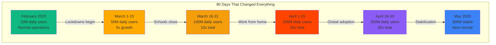
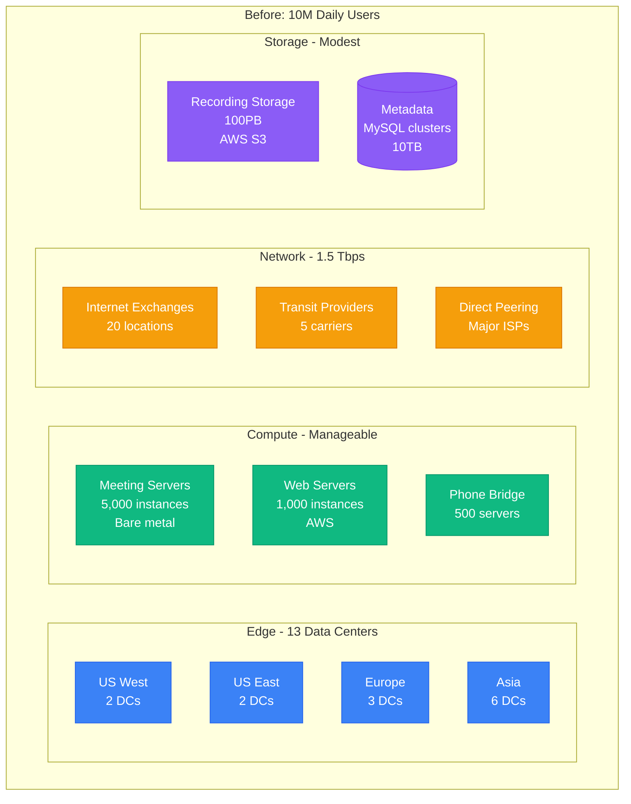
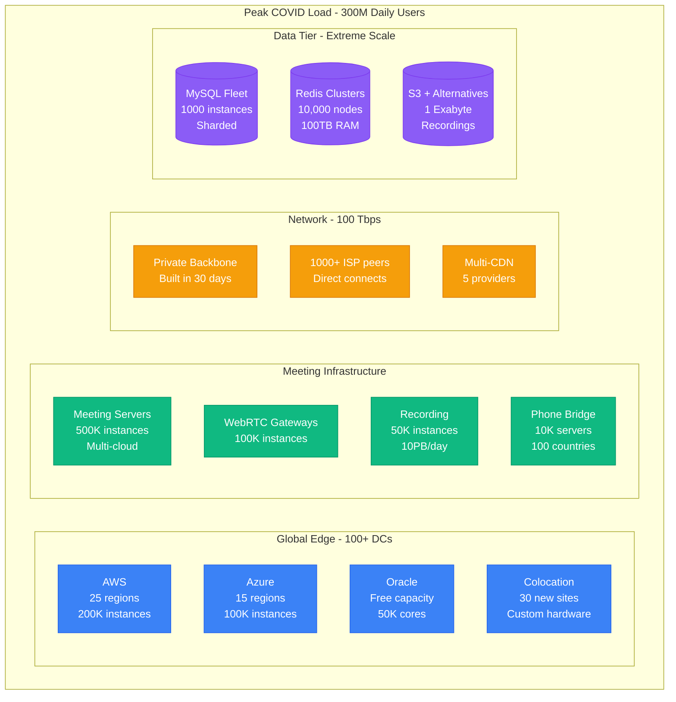
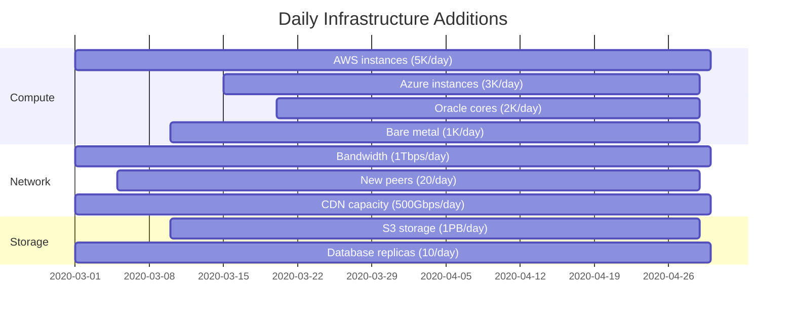
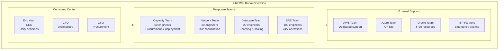
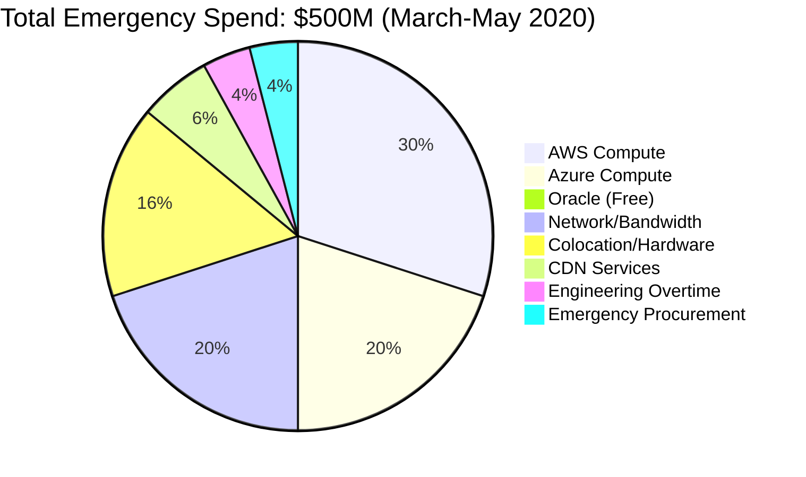
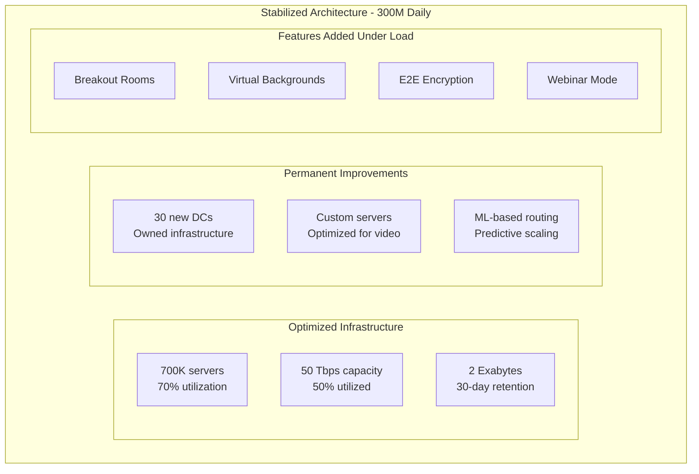

# Zoom COVID-19 Capacity Explosion: 10M → 300M Users in 90 Days

## The Greatest Scaling Challenge in Tech History (March-May 2020)

Zoom's explosive growth during COVID-19 represents the most dramatic capacity scaling event ever witnessed - growing 30x in 3 months while maintaining service.

## The Timeline of Chaos



## Pre-COVID Architecture (February 2020)



**Daily Load Pattern**:
- Peak: 2M concurrent users
- Meetings: 500K simultaneous
- Bandwidth: 500 Gbps peak
- Recording: 10TB/day

## The First Crisis: March 1-15, 2020

```mermaid
graph TB
    subgraph Crisis1[First Wave - 5x Growth]
        subgraph Problems[Immediate Problems]
            CAP[Capacity exhausted<br/>in 3 days]
            NET[Network saturation<br/>Major cities]
            DB[Database overload<br/>Connection pools]
            SUPPLY[Server shortage<br/>Global supply chain]
        end

        subgraph Emergency[Emergency Response]
            AWS[AWS Emergency<br/>100K instances<br/>48 hours]
            ORACLE[Oracle Cloud<br/>50K cores<br/>Free offer]
            AZURE[Azure Backup<br/>Standby capacity]
            BARE[Bare Metal<br/>Whatever available]
        end

        subgraph Metrics[New Reality]
            USERS[50M daily users]
            MEETINGS[10M meetings/day]
            BANDWIDTH[2.5 Tbps]
            CONCURRENT[10M concurrent]
        end
    end

    Problems --> Emergency
    Emergency --> Metrics

    style CAP fill:#8B5CF6
    style NET fill:#8B5CF6
    style DB fill:#8B5CF6
    style SUPPLY fill:#8B5CF6
```



**Emergency Actions Taken**:
```bash
# Day 1: Immediate capacity increase
aws ec2 run-instances \
    --instance-type c5n.24xlarge \
    --count 10000 \
    --region us-east-1 \
    --user-data "zoom-meeting-server-v2.31"

# Day 2: Global deployment
for region in us-west-2 eu-west-1 ap-southeast-1; do
    kubectl scale deployment zoom-mmr \
        --replicas=5000 \
        --region=$region
done

# Day 3: Database scaling
ALTER DATABASE zoom_main
    MODIFY INSTANCE CLASS db.r5.24xlarge;
CREATE READ REPLICA zoom_main_replica_1 THROUGH zoom_main_replica_20;
```

## The Second Crisis: March 16-31, 2020

```mermaid
graph TB
    subgraph Crisis2[Second Wave - Schools & Enterprise]
        subgraph NewLoad[Unprecedented Load]
            SCHOOLS[100K schools<br/>30M students]
            ENTERPRISE[500K companies<br/>Remote work]
            GOVT[Governments<br/>Emergency meetings]
            HEALTH[Healthcare<br/>Telemedicine]
        end

        subgraph Bottlenecks[Critical Bottlenecks]
            WEBRTC[WebRTC servers<br/>Ran out globally]
            TURN[TURN servers<br/>NAT traversal]
            MYSQL[MySQL<br/>Write locks]
            REDIS[Redis<br/>Session state]
        end

        subgraph Solutions[Emergency Solutions]
            MULTICLOUD[Multi-cloud<br/>AWS + Azure + Oracle]
            CUSTOM[Custom hardware<br/>Direct from Intel]
            COLO[Colocation<br/>17 new sites]
            CDN[CDN expansion<br/>Akamai + Cloudflare]
        end
    end

    NewLoad --> Bottlenecks
    Bottlenecks --> Solutions

    %% Apply colors
    classDef loadStyle fill:#F59E0B,stroke:#D97706,color:#fff
    classDef bottleneckStyle fill:#8B5CF6,stroke:#7C3AED,color:#fff
    classDef solutionStyle fill:#10B981,stroke:#059669,color:#fff

    class SCHOOLS,ENTERPRISE,GOVT,HEALTH loadStyle
    class WEBRTC,TURN,MYSQL,REDIS bottleneckStyle
    class MULTICLOUD,CUSTOM,COLO,CDN solutionStyle
```



## Peak Crisis Architecture (April 2020)



## Capacity Scaling Timeline

### Daily Capacity Additions (March-April 2020)



## The Engineering Response

### War Room Structure



### Daily Capacity Planning Model

```python
# Zoom's capacity prediction model (simplified)
import numpy as np
from datetime import datetime, timedelta

class ZoomCapacityPlanner:
    def __init__(self):
        self.growth_rate = 1.15  # 15% daily growth in March
        self.peak_ratio = 3.5     # Peak is 3.5x average
        self.buffer = 2.0         # 100% buffer for safety

    def predict_capacity_needs(self, current_users, days_ahead=7):
        predictions = {}

        for day in range(days_ahead):
            date = datetime.now() + timedelta(days=day)

            # Exponential growth model
            projected_users = current_users * (self.growth_rate ** day)

            # Peak capacity needed
            peak_concurrent = projected_users * 0.15  # 15% concurrent

            # Infrastructure requirements
            predictions[date] = {
                'users': projected_users,
                'peak_concurrent': peak_concurrent,
                'servers_needed': peak_concurrent / 1000,  # 1K users per server
                'bandwidth_gbps': peak_concurrent * 0.5,   # 0.5 Mbps per user
                'storage_tb': projected_users * 0.001,     # 1GB per 1K users
                'database_connections': peak_concurrent * 2
            }

            # Apply safety buffer
            for key in predictions[date]:
                if key != 'users':
                    predictions[date][key] *= self.buffer

        return predictions

# March 15, 2020 projection
planner = ZoomCapacityPlanner()
current = 50_000_000  # 50M users
projections = planner.predict_capacity_needs(current)

for date, metrics in projections.items():
    print(f"{date.date()}: {metrics['servers_needed']:.0f} servers needed")
```

## Cost Analysis

### The 90-Day Infrastructure Bill



### Daily Burn Rate Evolution

| Date | Daily Users | Daily Cost | Cost per User | Major Expense |
|------|-------------|------------|---------------|---------------|
| Feb 2020 | 10M | $500K | $0.05 | Normal operations |
| Mar 1 | 20M | $1M | $0.05 | Emergency AWS |
| Mar 15 | 50M | $3M | $0.06 | Multi-cloud |
| Apr 1 | 200M | $8M | $0.04 | Economy of scale |
| Apr 15 | 300M | $10M | $0.03 | Optimizations |
| May 1 | 300M | $6M | $0.02 | Stabilized |

## Technical Innovations Under Pressure

### 1. Cascade Routing System
```python
# Intelligent meeting server selection
class CascadeRouter:
    def __init__(self):
        self.regions = {
            'us-west': {'capacity': 100000, 'load': 0},
            'us-east': {'capacity': 100000, 'load': 0},
            'eu-west': {'capacity': 80000, 'load': 0},
            'ap-south': {'capacity': 60000, 'load': 0},
            # ... 50+ regions
        }

    def route_meeting(self, meeting_size, user_locations):
        # Find optimal datacenter
        scores = {}

        for region, stats in self.regions.items():
            # Calculate latency score
            latency = self.calculate_latency(user_locations, region)

            # Check capacity
            available = stats['capacity'] - stats['load']
            if available < meeting_size:
                continue

            # Combined score (lower is better)
            scores[region] = latency * (stats['load'] / stats['capacity'])

        best_region = min(scores, key=scores.get)
        self.regions[best_region]['load'] += meeting_size

        return best_region

    def calculate_latency(self, users, region):
        # Simplified latency calculation
        return np.mean([self.get_distance(u, region) for u in users])
```

### 2. Multimedia Optimization
```javascript
// Adaptive video quality based on capacity
class AdaptiveVideoManager {
    constructor() {
        this.capacityThresholds = {
            critical: 0.95,  // 95% capacity
            high: 0.85,      // 85% capacity
            normal: 0.70     // 70% capacity
        };
    }

    adjustQuality(currentLoad) {
        if (currentLoad > this.capacityThresholds.critical) {
            return {
                maxResolution: '360p',
                fps: 15,
                videoBitrate: 200,  // kbps
                audioBitrate: 32,
                screenShare: '720p'
            };
        } else if (currentLoad > this.capacityThresholds.high) {
            return {
                maxResolution: '480p',
                fps: 24,
                videoBitrate: 400,
                audioBitrate: 48,
                screenShare: '1080p'
            };
        } else {
            return {
                maxResolution: '720p',
                fps: 30,
                videoBitrate: 800,
                audioBitrate: 64,
                screenShare: '1080p'
            };
        }
    }
}
```

### 3. Database Sharding Strategy
```sql
-- Emergency sharding implementation
-- Shard by meeting_id for horizontal scaling

-- Create shard mapping table
CREATE TABLE shard_map (
    shard_id INT PRIMARY KEY,
    start_range BIGINT,
    end_range BIGINT,
    host VARCHAR(255),
    status ENUM('active', 'migrating', 'readonly')
);

-- Function to determine shard
DELIMITER //
CREATE FUNCTION get_shard(meeting_id BIGINT)
RETURNS INT DETERMINISTIC
BEGIN
    RETURN (meeting_id MOD 1000);  -- 1000 shards
END//
DELIMITER ;

-- Automated shard creation script
CREATE PROCEDURE create_new_shard(IN shard_id INT)
BEGIN
    SET @sql = CONCAT('CREATE DATABASE zoom_shard_', shard_id);
    PREPARE stmt FROM @sql;
    EXECUTE stmt;
    DEALLOCATE PREPARE stmt;

    -- Create tables in new shard
    SET @sql = CONCAT('CREATE TABLE zoom_shard_', shard_id, '.meetings LIKE zoom_main.meetings');
    PREPARE stmt FROM @sql;
    EXECUTE stmt;
    DEALLOCATE PREPARE stmt;
END;
```

## Lessons Learned

### What Worked

1. **Multi-Cloud Strategy**
   - No single cloud could handle the load
   - Avoided vendor lock-in during crisis
   - Negotiating power increased

2. **Over-Provisioning**
   - 2x buffer saved the service
   - Better to have unused capacity
   - Cost was secondary to availability

3. **Simple Architecture**
   - Zoom's simple design scaled better
   - Stateless services were key
   - Horizontal scaling worked

4. **Direct Hardware Procurement**
   - Bypassed cloud when needed
   - Intel/AMD direct relationships
   - Custom configurations

### What Failed

1. **Capacity Planning Models**
   - All models underestimated by 10x
   - Exponential growth unprecedented
   - Had to plan day-by-day

2. **Database Architecture**
   - MySQL couldn't scale fast enough
   - Sharding was emergency fix
   - Lost some data consistency

3. **Security Trade-offs**
   - "Zoombombing" incidents
   - Rushed security features
   - Password requirements added later

## The New Normal Architecture (Post-May 2020)



## Financial Impact

### Revenue Explosion
- Q1 2020: $328M (+88% YoY)
- Q2 2020: $663M (+355% YoY)
- Q3 2020: $777M (+367% YoY)
- Q4 2020: $882M (+369% YoY)

### Infrastructure Investment
- Total emergency spend: $500M
- Permanent infrastructure: $1B
- ROI: 10x in 12 months
- Stock price: $68 → $588 (765% gain)

## Key Metrics During Peak

| Metric | Pre-COVID | Peak COVID | Increase |
|--------|-----------|------------|----------|
| Daily Users | 10M | 300M | 30x |
| Meeting Minutes/Day | 100M | 3.2T | 32,000x |
| Peak Concurrent | 2M | 50M | 25x |
| Infrastructure Servers | 10K | 700K | 70x |
| Network Capacity | 1.5 Tbps | 100 Tbps | 67x |
| Database Size | 10TB | 10PB | 1000x |
| Engineers | 700 | 2000 | 3x |
| Support Tickets/Day | 1K | 200K | 200x |

## The Human Story

### Engineering Heroes
- **90-day sprints**: Engineers worked 100+ hour weeks
- **Global coordination**: 24/7 handoffs across timezones
- **Family meetings**: Engineers' families used Zoom to stay connected
- **Open culture**: CEO Eric Yuan personally responded to user complaints

### User Impact
- **Education**: 100K+ schools moved online
- **Healthcare**: Telemedicine became mainstream
- **Business**: Remote work normalized
- **Social**: Virtual weddings, funerals, birthdays
- **Government**: Parliaments met on Zoom

## References

- Zoom Q1-Q4 2020 Earnings Calls
- "Scaling Zoom" - Eric Yuan, CEO (Various interviews)
- AWS Case Study: Zoom's COVID Response
- "The Zoom Phenomenon" - Fortune Magazine
- Network traffic data from major ISPs

---

*Last Updated: September 2024*
*The most dramatic scaling event in technology history*