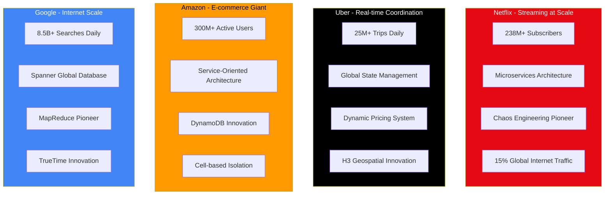

# Real-World Case Studies

## Overview

Learn from production systems that serve billions of users and handle massive scale. These case studies showcase how leading technology companies apply distributed systems patterns in practice, with detailed analysis of their architectural evolution, technical decisions, and lessons learned.

Our comprehensive framework ensures consistent, deep documentation of each case study with:
- **Verified Scale Metrics**: Quantified performance indicators from primary sources
- **Architecture Evolution**: Timeline of major architectural changes and decisions
- **Technical Deep Dives**: Detailed analysis of critical systems and patterns
- **Innovation Contributions**: Open source projects and industry influence
- **Lessons Learned**: What worked, what didn't, and advice for others

## Featured Case Studies

## Key Learnings by Category

### Scale Challenges

| Company | Scale Metric | Solution |
|---------|-------------|----------|
| Netflix | 200M+ subscribers, 1B+ hours/month | Microservices, Regional failover |
| Uber | 15M+ rides/day, 100+ cities | Geospatial sharding, Real-time matching |
| Amazon | 300M+ active users | Service mesh, Cell-based architecture |
| Google | 8.5B+ searches/day | Distributed indexing, Edge caching |

### Architecture Patterns

#### Netflix
- **Pattern**: Microservices with Circuit Breakers
- **Key Tech**: Hystrix, Zuul, Eureka
- **Innovation**: Chaos Monkey for resilience testing

#### Uber
- **Pattern**: Event-driven with CQRS
- **Key Tech**: Ringpop, H3 Geospatial
- **Innovation**: Consistent hashing for dispatch

#### Amazon
- **Pattern**: Service-Oriented Architecture
- **Key Tech**: DynamoDB, SQS, Lambda
- **Innovation**: Cell-based isolation

#### Google
- **Pattern**: Globally distributed systems
- **Key Tech**: Spanner, Bigtable, Borg
- **Innovation**: TrueTime for global consistency

## Common Themes

1. **Microservices**: All companies moved from monoliths to microservices
2. **Event-Driven**: Asynchronous communication for loose coupling
3. **Regional Deployment**: Multi-region for availability and latency
4. **Chaos Engineering**: Proactive failure testing
5. **Custom Solutions**: Building specialized databases and tools

## Lessons Learned

### Do's
- ✅ Start with simple solutions, evolve as needed
- ✅ Invest in observability from day one
- ✅ Design for failure at every level
- ✅ Use caching aggressively
- ✅ Implement circuit breakers early

### Don'ts
- ❌ Over-engineer before understanding the problem
- ❌ Ignore operational complexity
- ❌ Assume network is reliable
- ❌ Neglect data consistency requirements
- ❌ Underestimate human factors

## Case Study Documentation

### Detailed Case Studies
- [Netflix Architecture](./netflix.md) - Global video streaming platform (238M+ subscribers)
- [Uber Systems](./uber.md) - Real-time marketplace platform (25M+ trips/day)

*Additional case studies in development:*
- **Amazon Services** - E-commerce and cloud infrastructure analysis
- **Google Infrastructure** - Search and global databases deep dive

### Framework & Analysis
- [Documentation Framework](./framework.md) - Comprehensive template for case study analysis
- [Data Collection Framework](./data-collection-framework.md) - Systematic approach to gathering verified information
- [Comparison Matrices](./comparison-matrices.md) - Scale, technology, and architecture pattern comparisons

### Company Categories

#### **Social & Messaging**
- **Meta/Facebook**: Social graph at 3.96B+ users
- **Discord**: Real-time messaging with 200M+ users
- **LinkedIn**: Professional network with 950M+ users
- **WhatsApp**: Global messaging with 2B+ users

#### **Media & Entertainment**
- **Netflix**: Video streaming pioneer (covered above)
- **Spotify**: Music streaming with 500M+ users
- **YouTube**: Video platform with 2.7B+ users
- **TikTok**: Short-form video with 1B+ users

#### **Commerce & Marketplaces**
- **Amazon**: E-commerce leader (covered above)
- **Shopify**: E-commerce platform with 2M+ merchants
- **Airbnb**: Home sharing with 150M+ users
- **Stripe**: Payment processing for 3M+ websites

#### **Transportation & Logistics**
- **Uber**: Ride-hailing leader (covered above)
- **Lyft**: Ride-sharing with 20M+ riders
- **DoorDash**: Food delivery with 25M+ users
- **Instacart**: Grocery delivery with 10M+ users

#### **Cloud & Infrastructure**
- **Google Cloud**: Global cloud platform (covered above)
- **Cloudflare**: Edge computing with 20% of web traffic
- **Fastly**: Edge cloud platform
- **Vercel**: Edge computing for developers

## Framework Methodology

Our case study framework follows these principles:

### 1. **Verified Information Only**
- Primary sources: Official engineering blogs, conference presentations
- Confidence levels: A (definitive), B (strong inference), C (partial)
- Cross-referenced claims with multiple independent sources

### 2. **Comprehensive Coverage**
Each case study includes:
- **Company Profile**: Scale, industry, engineering team size
- **Architecture Evolution**: Timeline of major changes
- **Current Architecture**: Detailed system analysis
- **Scale Metrics**: Quantified performance characteristics
- **Innovation Contributions**: Open source and industry influence
- **Lessons Learned**: What worked, what didn't, and recommendations

### 3. **Continuous Updates**
- Quarterly reviews of scale metrics and architecture changes
- Automated monitoring of company engineering blogs
- Annual comprehensive reviews of each case study

### 4. **Legal Compliance**
- Fair use analysis and commentary only
- Proper attribution to all sources
- No copying of proprietary materials
- Clear takedown procedures for any concerns