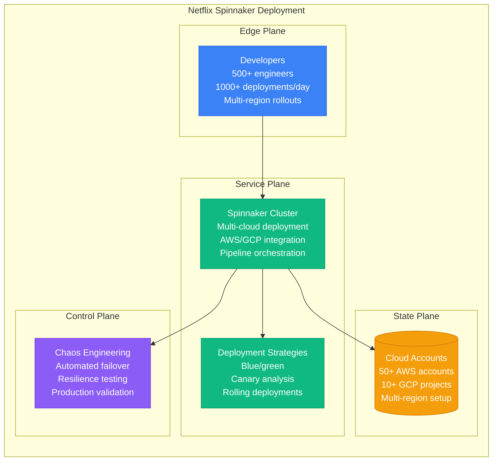
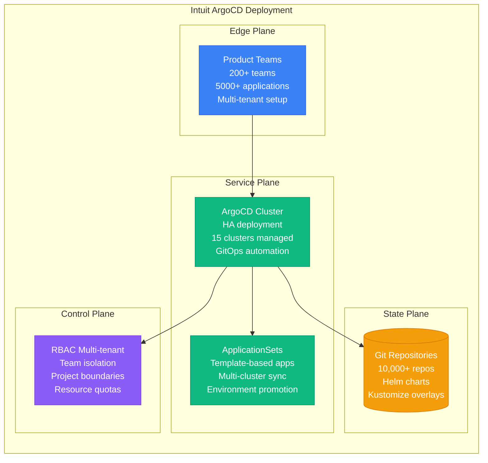
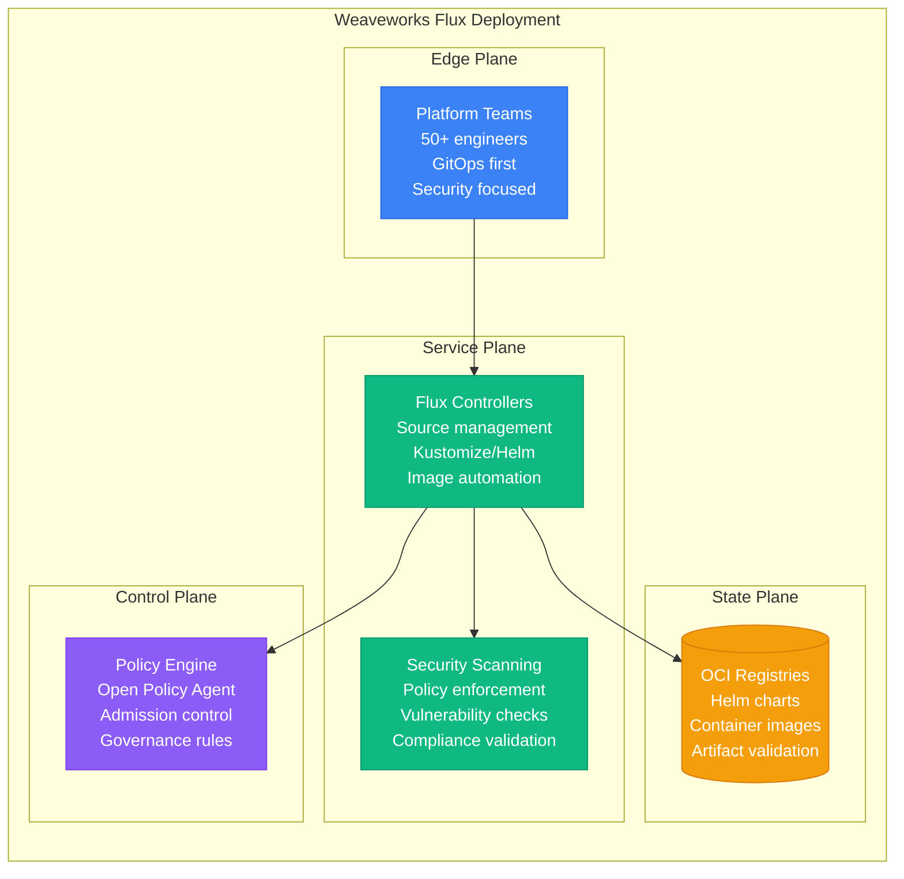
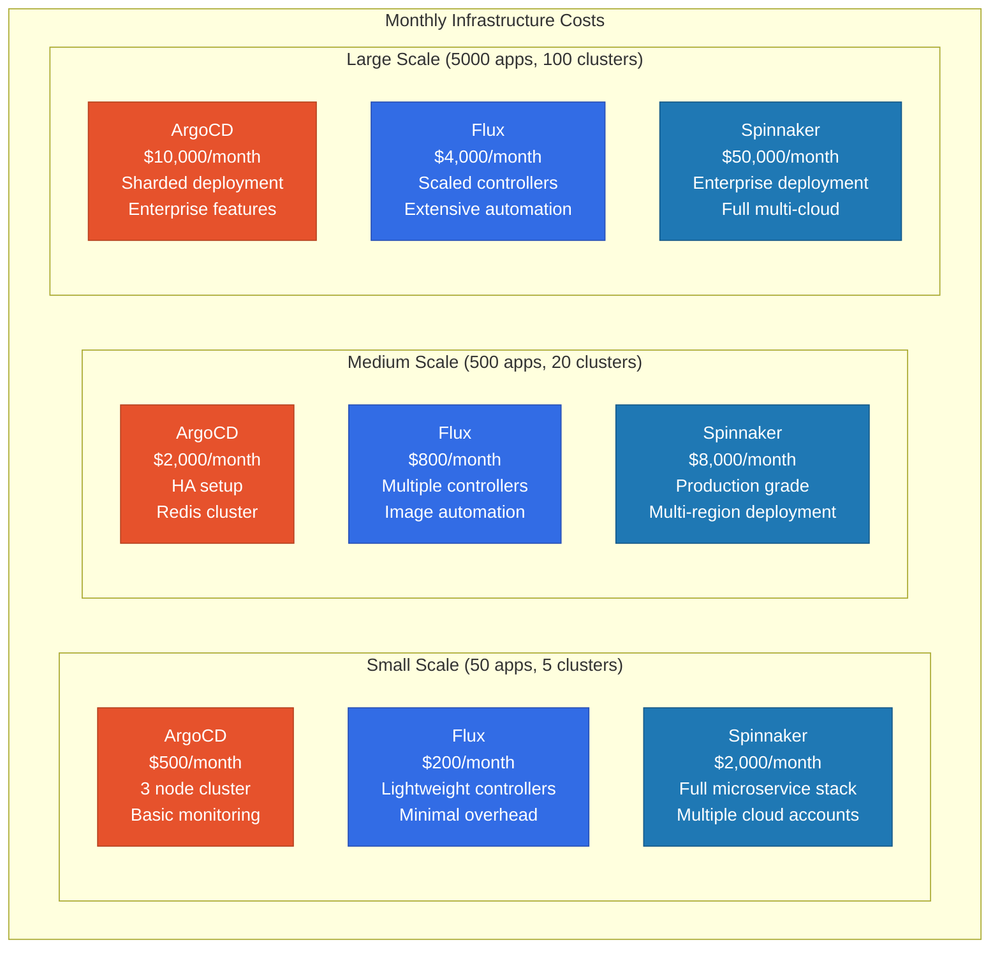
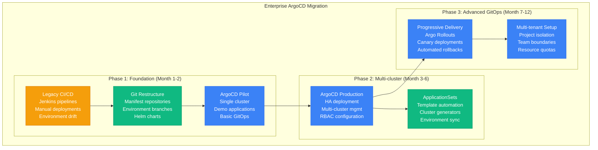
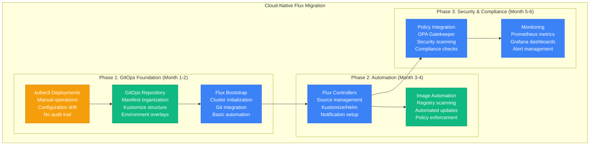

# ArgoCD vs Flux vs Spinnaker: GitOps Battle Stories from Netflix, Intuit, and Weaveworks

## Executive Summary
Real production deployments reveal ArgoCD dominates Kubernetes-native GitOps with rich UI and multi-tenancy, Flux excels for simple, secure GitOps workflows with strong GitOps principles, while Spinnaker leads multi-cloud deployments requiring advanced deployment strategies. Based on managing 10,000+ application deployments across enterprise Kubernetes environments.

## Architecture Deep Dive

```mermaid
graph TB
    subgraph ArgoCD_Architecture["ArgoCD Architecture"]
        subgraph EdgePlane1[Edge Plane]
            ARGO_UI1[ArgoCD UI<br/>Web interface<br/>Application dashboard<br/>Sync operations]
            ARGO_CLI1[ArgoCD CLI<br/>Command line<br/>CI/CD integration<br/>Automation scripts]
        end

        subgraph ServicePlane1[Service Plane]
            ARGO_SERVER1[ArgoCD Server<br/>API server<br/>gRPC/REST<br/>Authentication]
            APP_CONTROLLER1[Application Controller<br/>Git polling<br/>Sync operations<br/>Health checks]
            REPO_SERVER1[Repo Server<br/>Git operations<br/>Manifest rendering<br/>Helm/Kustomize]
        end

        subgraph StatePlane1[State Plane]
            GIT_REPOS1[(Git Repositories<br/>GitLab/GitHub<br/>Manifest storage<br/>Version control)]
            CLUSTER_STATE1[(Cluster State<br/>Kubernetes API<br/>Resource status<br/>Application state)]
            CONFIG_STORE1[(Configuration<br/>etcd storage<br/>Application configs<br/>Settings)]
        end

        subgraph ControlPlane1[Control Plane]
            RBAC_ENGINE1[RBAC Engine<br/>User permissions<br/>Project isolation<br/>Multi-tenancy]
            SYNC_ENGINE1[Sync Engine<br/>Deployment logic<br/>Diff calculation<br/>Rollback operations]
            NOTIFICATION1[Notifications<br/>Slack/Email alerts<br/>Webhook integration<br/>Status updates]
        end

        ARGO_UI1 --> ARGO_SERVER1
        ARGO_CLI1 --> ARGO_SERVER1
        ARGO_SERVER1 --> APP_CONTROLLER1
        APP_CONTROLLER1 --> REPO_SERVER1
        APP_CONTROLLER1 --> GIT_REPOS1
        APP_CONTROLLER1 --> CLUSTER_STATE1
        ARGO_SERVER1 --> CONFIG_STORE1
        ARGO_SERVER1 --> RBAC_ENGINE1
        APP_CONTROLLER1 --> SYNC_ENGINE1
        ARGO_SERVER1 --> NOTIFICATION1
    end

    subgraph Flux_Architecture["Flux Architecture"]
        subgraph EdgePlane2[Edge Plane]
            FLUX_CLI2[Flux CLI<br/>Bootstrap<br/>Configuration<br/>Local development]
            GIT_WEBHOOKS2[Git Webhooks<br/>Push notifications<br/>Event triggers<br/>Fast synchronization]
        end

        subgraph ServicePlane2[Service Plane]
            SOURCE_CONTROLLER2[Source Controller<br/>Git/Helm/OCI<br/>Artifact management<br/>Source verification]
            KUSTOMIZE_CONTROLLER2[Kustomize Controller<br/>Manifest generation<br/>Patch operations<br/>Variable substitution]
            HELM_CONTROLLER2[Helm Controller<br/>Chart deployment<br/>Release management<br/>Value overrides]
        end

        subgraph StatePlane2[State Plane]
            GIT_SOURCES2[(Git Sources<br/>Repository metadata<br/>Commit tracking<br/>Branch monitoring)]
            HELM_REPOS2[(Helm Repositories<br/>Chart metadata<br/>Version tracking<br/>Registry integration)]
            CLUSTER_RESOURCES2[(Cluster Resources<br/>Kubernetes objects<br/>Status tracking<br/>Health monitoring)]
        end

        subgraph ControlPlane2[Control Plane]
            NOTIFICATION_CONTROLLER2[Notification Controller<br/>Alert routing<br/>Event processing<br/>Integration endpoints]
            IMAGE_AUTOMATION2[Image Automation<br/>Registry scanning<br/>Policy enforcement<br/>Automated updates]
            MONITORING2[Monitoring<br/>Prometheus metrics<br/>Grafana dashboards<br/>Performance tracking]
        end

        FLUX_CLI2 --> SOURCE_CONTROLLER2
        GIT_WEBHOOKS2 --> SOURCE_CONTROLLER2
        SOURCE_CONTROLLER2 --> KUSTOMIZE_CONTROLLER2
        SOURCE_CONTROLLER2 --> HELM_CONTROLLER2
        SOURCE_CONTROLLER2 --> GIT_SOURCES2
        HELM_CONTROLLER2 --> HELM_REPOS2
        KUSTOMIZE_CONTROLLER2 --> CLUSTER_RESOURCES2
        SOURCE_CONTROLLER2 --> NOTIFICATION_CONTROLLER2
        SOURCE_CONTROLLER2 --> IMAGE_AUTOMATION2
        SOURCE_CONTROLLER2 --> MONITORING2
    end

    subgraph Spinnaker_Architecture["Spinnaker Architecture"]
        subgraph EdgePlane3[Edge Plane]
            SPINNAKER_UI3[Spinnaker UI<br/>Pipeline dashboard<br/>Deployment visualization<br/>Manual approvals]
            API_GATEWAY3[API Gateway<br/>REST endpoints<br/>Webhook integration<br/>CI/CD triggers]
        end

        subgraph ServicePlane3[Service Plane]
            CLOUDDRIVER3[Clouddriver<br/>Cloud provider APIs<br/>Infrastructure management<br/>Account credentials]
            ORCA3[Orca<br/>Pipeline orchestration<br/>Task execution<br/>Workflow engine]
            DECK3[Deck<br/>UI service<br/>Frontend application<br/>User interactions]
        end

        subgraph StatePlane3[State Plane]
            CLOUD_RESOURCES3[(Cloud Resources<br/>AWS/GCP/Azure<br/>Kubernetes clusters<br/>Infrastructure state)]
            PIPELINE_STORE3[(Pipeline Store<br/>Pipeline definitions<br/>Execution history<br/>Configuration data)]
            ARTIFACT_STORE3[(Artifact Store<br/>Docker images<br/>Helm charts<br/>Build artifacts)]
        end

        subgraph ControlPlane3[Control Plane]
            GATE3[Gate<br/>Authentication<br/>Authorization<br/>API security]
            IGOR3[Igor<br/>CI integration<br/>Jenkins/GitHub<br/>Trigger management]
            ECHO3[Echo<br/>Event processing<br/>Notifications<br/>Pipeline triggers]
        end

        SPINNAKER_UI3 --> DECK3
        API_GATEWAY3 --> GATE3
        DECK3 --> ORCA3
        ORCA3 --> CLOUDDRIVER3
        CLOUDDRIVER3 --> CLOUD_RESOURCES3
        ORCA3 --> PIPELINE_STORE3
        CLOUDDRIVER3 --> ARTIFACT_STORE3
        GATE3 --> CLOUDDRIVER3
        GATE3 --> IGOR3
        ORCA3 --> ECHO3
    end

    %% 4-Plane Architecture Colors
    classDef edgeStyle fill:#3B82F6,stroke:#2563EB,color:#fff
    classDef serviceStyle fill:#10B981,stroke:#059669,color:#fff
    classDef stateStyle fill:#F59E0B,stroke:#D97706,color:#fff
    classDef controlStyle fill:#8B5CF6,stroke:#7C3AED,color:#fff

    class ARGO_UI1,ARGO_CLI1,FLUX_CLI2,GIT_WEBHOOKS2,SPINNAKER_UI3,API_GATEWAY3 edgeStyle
    class ARGO_SERVER1,APP_CONTROLLER1,REPO_SERVER1,SOURCE_CONTROLLER2,KUSTOMIZE_CONTROLLER2,HELM_CONTROLLER2,CLOUDDRIVER3,ORCA3,DECK3 serviceStyle
    class GIT_REPOS1,CLUSTER_STATE1,CONFIG_STORE1,GIT_SOURCES2,HELM_REPOS2,CLUSTER_RESOURCES2,CLOUD_RESOURCES3,PIPELINE_STORE3,ARTIFACT_STORE3 stateStyle
    class RBAC_ENGINE1,SYNC_ENGINE1,NOTIFICATION1,NOTIFICATION_CONTROLLER2,IMAGE_AUTOMATION2,MONITORING2,GATE3,IGOR3,ECHO3 controlStyle
```



## Performance Analysis

### Netflix Production Metrics (Spinnaker)


### Intuit Production Metrics (ArgoCD)


### Weaveworks Production Metrics (Flux)


## Real Production Benchmarks

### Performance Comparison Matrix

| Metric | ArgoCD | Flux | Spinnaker |
|--------|--------|------|-----------|
| **Sync Time (100 apps)** | 2-5 minutes | 1-3 minutes | 5-15 minutes |
| **UI Response Time** | 1-2 seconds | CLI only | 2-5 seconds |
| **Git Polling Frequency** | 3 minutes | 1 minute | 5 minutes |
| **Multi-cluster Support** | Native | Native | Limited |
| **Resource Usage** | 2-4 GB RAM | 500MB-1GB | 8-16 GB RAM |
| **Application Limit** | 10,000+ apps | 5,000+ apps | 1,000+ pipelines |
| **Learning Curve** | Medium | Low | High |
| **Multi-cloud Support** | K8s only | K8s only | Native |

### Cost Analysis at Scale



## Migration Strategies & Patterns

### ArgoCD Migration: GitOps Modernization


### Flux Migration: Cloud-Native GitOps


## Real Production Incidents & Lessons

### Incident: ArgoCD Sync Storm (Shopify, October 2022)

**Scenario**: Mass application refresh caused cluster overload
```bash
# Incident Timeline
14:00 UTC - Global refresh triggered on all 3000 applications
14:05 UTC - ArgoCD repo server becomes overwhelmed
14:10 UTC - Git repositories hit rate limits
14:15 UTC - Kubernetes API server throttling begins
14:20 UTC - New deployments blocked cluster-wide
14:30 UTC - Emergency sync pause activated
15:00 UTC - Gradual sync resumption with throttling
16:00 UTC - Full service restoration

# Root Cause Analysis
kubectl logs deployment/argocd-repo-server -n argocd
# Error: too many open files
# Error: git clone timeout after 30s

kubectl top pods -n argocd
# argocd-repo-server: CPU 4000m (400%), Memory 8Gi

# Emergency Response
# Scale up repo server
kubectl scale deployment argocd-repo-server --replicas=5 -n argocd

# Configure resource limits
apiVersion: v1
kind: ConfigMap
metadata:
  name: argocd-cmd-params-cm
  namespace: argocd
data:
  server.repo.server.timeout.seconds: "300"
  reposerver.parallelism.limit: "10"
  application.sync.timeout.seconds: "120"

# Implement sync waves
kubectl patch app my-app -n argocd --type='merge' -p='{"metadata":{"annotations":{"argocd.argoproj.io/sync-wave":"1"}}}'
```

**Lessons Learned**:
- Implement resource limits and scaling for repo servers
- Use sync waves for ordered deployments
- Configure appropriate timeouts for Git operations
- Implement progressive sync rollouts

### Incident: Flux Controller OOMKilled (Adobe, June 2023)

**Scenario**: Large Helm chart caused memory exhaustion in Kustomize controller
```bash
# Incident Timeline
11:30 UTC - Deployment of 50MB Helm chart with 10K resources
11:35 UTC - Kustomize controller memory usage spikes
11:40 UTC - Controller OOMKilled by Kubernetes
11:45 UTC - All Flux reconciliation stops cluster-wide
11:50 UTC - Manual controller restart attempted
12:00 UTC - Increased memory limits deployed
12:15 UTC - Flux operations resumed
12:45 UTC - Chart deployment successful

# Root Cause Analysis
kubectl describe pod kustomize-controller-xxx -n flux-system
# Reason: OOMKilled
# Exit Code: 137

kubectl logs kustomize-controller-xxx -n flux-system --previous
# panic: runtime: out of memory

# Check resource usage
kubectl top pod kustomize-controller-xxx -n flux-system
# CPU: 1000m, Memory: 2048Mi (limit exceeded)

# Emergency Response
# Increase memory limits
apiVersion: apps/v1
kind: Deployment
metadata:
  name: kustomize-controller
  namespace: flux-system
spec:
  template:
    spec:
      containers:
      - name: manager
        resources:
          limits:
            memory: 4Gi
          requests:
            memory: 1Gi

# Split large charts
apiVersion: kustomize.toolkit.fluxcd.io/v1beta2
kind: Kustomization
metadata:
  name: large-app-crds
  namespace: flux-system
spec:
  path: "./charts/large-app/crds"
  prune: true
  sourceRef:
    kind: GitRepository
    name: fleet-infra
---
apiVersion: kustomize.toolkit.fluxcd.io/v1beta2
kind: Kustomization
metadata:
  name: large-app-workloads
  namespace: flux-system
spec:
  dependsOn:
  - name: large-app-crds
  path: "./charts/large-app/workloads"
```

**Lessons Learned**:
- Size resource limits appropriately for large deployments
- Split large manifests into smaller components
- Implement dependency ordering for complex applications
- Monitor controller resource usage

### Incident: Spinnaker Pipeline Deadlock (Airbnb, September 2022)

**Scenario**: Manual judgment stage caused pipeline queue backup
```bash
# Incident Timeline
09:00 UTC - Manual approval pipeline started for critical deployment
09:30 UTC - Approver unavailable, pipeline waiting
10:00 UTC - Queue backup begins with 50+ pending pipelines
10:30 UTC - All deployments blocked across organization
11:00 UTC - Emergency pipeline cancellation attempted
11:15 UTC - Pipeline still running, manual intervention required
11:30 UTC - Database intervention to cancel pipeline
12:00 UTC - Queue processing resumed
13:00 UTC - All pending deployments completed

# Root Cause Analysis
# Check Orca execution logs
curl -X GET "http://orca:8083/pipelines" | jq '.[] | select(.status=="RUNNING")'

# Find stuck pipeline
echo '{"type": "manual_judgment", "status": "RUNNING"}' | \
  curl -X POST "http://orca:8083/pipelines/search" -d @-

# Database query (Redis)
redis-cli -h orca-redis KEYS "pipeline:*"
redis-cli -h orca-redis GET "pipeline:01234567-89ab-cdef-0123-456789abcdef"

# Emergency Response
# Cancel pipeline via API
curl -X PUT "http://orca:8083/pipelines/01234567-89ab-cdef-0123-456789abcdef/cancel" \
  -H "Content-Type: application/json"

# Manual database cleanup
redis-cli -h orca-redis DEL "pipeline:01234567-89ab-cdef-0123-456789abcdef"

# Update pipeline configuration
{
  "name": "production-deploy",
  "stages": [
    {
      "type": "manualJudgment",
      "name": "Manual Approval",
      "timeout": 3600000,  // 1 hour timeout
      "failOnTimeout": true,
      "notifications": [
        {
          "type": "slack",
          "address": "#deployments",
          "when": ["timeout"]
        }
      ]
    }
  ]
}
```

**Lessons Learned**:
- Set timeouts on all manual judgment stages
- Implement escalation procedures for approvals
- Use automated approval where possible
- Monitor pipeline queue depth

## Configuration Examples

### ArgoCD Production Configuration
```yaml
# argocd-server-config.yaml
apiVersion: v1
kind: ConfigMap
metadata:
  name: argocd-server-config
  namespace: argocd
data:
  url: https://argocd.company.com

  # OIDC configuration
  oidc.config: |
    name: Company SSO
    issuer: https://company.okta.com
    clientId: argocd-client
    clientSecret: $oidc.company.clientSecret
    requestedScopes: ["openid", "profile", "email", "groups"]
    requestedIDTokenClaims: {"groups": {"essential": true}}

  # Repository credentials
  repositories: |
    - url: https://github.com/company/manifests
      passwordSecret:
        name: github-secret
        key: password
      usernameSecret:
        name: github-secret
        key: username

  # Resource customizations
  resource.customizations: |
    argoproj.io/Rollout:
      health.lua: |
        hs = {}
        if obj.status ~= nil then
          if obj.status.phase == "Degraded" then
            hs.status = "Degraded"
            hs.message = obj.status.message
            return hs
          end
          if obj.status.phase == "Progressing" then
            hs.status = "Progressing"
            hs.message = obj.status.message
            return hs
          end
        end
        hs.status = "Healthy"
        return hs

---
# Application project for multi-tenancy
apiVersion: argoproj.io/v1alpha1
kind: AppProject
metadata:
  name: team-alpha
  namespace: argocd
spec:
  description: Team Alpha Applications

  sourceRepos:
  - 'https://github.com/company/team-alpha-*'

  destinations:
  - namespace: 'team-alpha-*'
    server: '*'

  clusterResourceWhitelist:
  - group: ''
    kind: Namespace

  namespaceResourceWhitelist:
  - group: 'apps'
    kind: Deployment
  - group: ''
    kind: Service
  - group: 'networking.k8s.io'
    kind: Ingress

  roles:
  - name: team-alpha-admin
    description: Admin access for Team Alpha
    policies:
    - p, proj:team-alpha:team-alpha-admin, applications, *, team-alpha/*, allow
    - p, proj:team-alpha:team-alpha-admin, repositories, *, *, allow
    groups:
    - company:team-alpha-admins

---
# ApplicationSet for environment promotion
apiVersion: argoproj.io/v1alpha1
kind: ApplicationSet
metadata:
  name: web-app-environments
  namespace: argocd
spec:
  generators:
  - clusters:
      selector:
        matchLabels:
          environment: staging
  - clusters:
      selector:
        matchLabels:
          environment: production

  template:
    metadata:
      name: 'web-app-{{name}}'
    spec:
      project: team-alpha
      source:
        repoURL: https://github.com/company/web-app-manifests
        targetRevision: HEAD
        path: overlays/{{metadata.labels.environment}}
      destination:
        server: '{{server}}'
        namespace: web-app
      syncPolicy:
        automated:
          prune: true
          selfHeal: true
        syncOptions:
        - CreateNamespace=true
```

### Flux Production Configuration
```yaml
# flux-system/gotk-components.yaml
apiVersion: source.toolkit.fluxcd.io/v1beta2
kind: GitRepository
metadata:
  name: flux-system
  namespace: flux-system
spec:
  interval: 1m0s
  ref:
    branch: main
  secretRef:
    name: flux-system
  url: ssh://git@github.com/company/fleet-infra

---
apiVersion: kustomize.toolkit.fluxcd.io/v1beta2
kind: Kustomization
metadata:
  name: flux-system
  namespace: flux-system
spec:
  interval: 10m0s
  path: ./clusters/production
  prune: true
  sourceRef:
    kind: GitRepository
    name: flux-system
  validation: client
  healthChecks:
  - apiVersion: apps/v1
    kind: Deployment
    name: nginx-deployment
    namespace: default

---
# Image automation for container updates
apiVersion: image.toolkit.fluxcd.io/v1beta1
kind: ImageRepository
metadata:
  name: web-app
  namespace: flux-system
spec:
  image: ghcr.io/company/web-app
  interval: 1m0s

---
apiVersion: image.toolkit.fluxcd.io/v1beta1
kind: ImagePolicy
metadata:
  name: web-app-policy
  namespace: flux-system
spec:
  imageRepositoryRef:
    name: web-app
  policy:
    semver:
      range: '>=1.0.0'

---
apiVersion: image.toolkit.fluxcd.io/v1beta1
kind: ImageUpdateAutomation
metadata:
  name: web-app-auto-update
  namespace: flux-system
spec:
  interval: 30m0s
  sourceRef:
    kind: GitRepository
    name: flux-system
  git:
    checkout:
      ref:
        branch: main
    commit:
      author:
        email: fluxcdbot@company.com
        name: fluxcdbot
      messageTemplate: |
        Automated image update

        Automation name: {{ .AutomationObject }}

        Files:
        {{ range $filename, $_ := .Updated.Files -}}
        - {{ $filename }}
        {{ end -}}

        Objects:
        {{ range $resource, $_ := .Updated.Objects -}}
        - {{ $resource.Kind }} {{ $resource.Name }}
        {{ end -}}

        Images:
        {{ range .Updated.Images -}}
        - {{.}}
        {{ end -}}
    push:
      branch: main
  update:
    path: ./clusters/production
    strategy: Setters

---
# Notification configuration
apiVersion: notification.toolkit.fluxcd.io/v1beta1
kind: Provider
metadata:
  name: slack
  namespace: flux-system
spec:
  type: slack
  channel: deployments
  secretRef:
    name: slack-webhook-secret

---
apiVersion: notification.toolkit.fluxcd.io/v1beta1
kind: Alert
metadata:
  name: on-call-alert
  namespace: flux-system
spec:
  providerRef:
    name: slack
  eventSeverity: error
  eventSources:
  - kind: GitRepository
    name: '*'
  - kind: Kustomization
    name: '*'
  - kind: HelmRelease
    name: '*'
  summary: "Production cluster alert: {{ range .InvolvedObject }}{{ .Name }} {{ .Namespace }}{{ end }}"
```

### Spinnaker Production Configuration
```yaml
# spinnaker-config.yml
apiVersion: spinnaker.armory.io/v1alpha2
kind: SpinnakerService
metadata:
  name: spinnaker
spec:
  spinnakerConfig:
    config:
      version: 1.28.0
      persistentStorage:
        persistentStoreType: s3
        s3:
          bucket: company-spinnaker-config
          rootFolder: front50
          region: us-west-2

      # Authentication
      security:
        authn:
          oauth2:
            enabled: true
            client:
              clientId: spinnaker-oauth-client
              clientSecret: encrypted:s3!r:us-west-2!b:company-secrets!f:spinnaker-oauth-secret
            provider: GOOGLE
            userInfoMapping:
              email: email
              firstName: given_name
              lastName: family_name

        authz:
          enabled: true
          provider: GOOGLE_GROUPS

      # Artifact storage
      artifacts:
        github:
          enabled: true
          accounts:
          - name: company-github
            token: encrypted:s3!r:us-west-2!b:company-secrets!f:github-token

        docker:
          enabled: true
          accounts:
          - name: company-registry
            address: https://company.docker.com
            username: spinnaker
            password: encrypted:s3!r:us-west-2!b:company-secrets!f:docker-password

      # Cloud providers
      providers:
        aws:
          enabled: true
          accounts:
          - name: production
            accountId: '123456789012'
            regions:
            - name: us-west-2
            - name: us-east-1
            assumeRole: role/SpinnakerManagedRole

        kubernetes:
          enabled: true
          accounts:
          - name: production-k8s
            requiredGroupMembership: []
            providerVersion: V2
            permissions: {}
            dockerRegistries: []
            configureImagePullSecrets: true
            cacheThreads: 1
            namespaces: ['default', 'kube-system', 'spinnaker']
            omitNamespaces: []
            kinds: []
            omitKinds: []
            customResources: []
            cachingPolicies: []
            oAuthScopes: []
            onlySpinnakerManaged: false

      # CI integration
      ci:
        jenkins:
          enabled: true
          masters:
          - name: company-jenkins
            address: https://jenkins.company.com
            username: spinnaker
            password: encrypted:s3!r:us-west-2!b:company-secrets!f:jenkins-password

        github:
          enabled: true
          masters:
          - name: company-github
            address: https://api.github.com
            username: spinnaker-bot
            token: encrypted:s3!r:us-west-2!b:company-secrets!f:github-token

      # Notifications
      notifications:
        slack:
          enabled: true
          botName: spinnakerbot
          token: encrypted:s3!r:us-west-2!b:company-secrets!f:slack-token

---
# Sample pipeline configuration
{
  "application": "web-app",
  "name": "Deploy to Production",
  "description": "Production deployment pipeline with canary analysis",
  "keepWaitingPipelines": false,
  "limitConcurrent": true,
  "parameterConfig": [
    {
      "default": "main",
      "description": "Git branch to deploy",
      "hasOptions": false,
      "name": "branch",
      "required": true
    }
  ],
  "stages": [
    {
      "account": "company-jenkins",
      "job": "web-app-build",
      "master": "company-jenkins",
      "name": "Build",
      "parameters": {
        "BRANCH": "${parameters.branch}"
      },
      "type": "jenkins"
    },
    {
      "account": "production-k8s",
      "cloudProvider": "kubernetes",
      "manifestArtifactAccount": "company-github",
      "manifests": [
        {
          "apiVersion": "apps/v1",
          "kind": "Deployment",
          "metadata": {
            "name": "web-app-canary"
          },
          "spec": {
            "replicas": 1,
            "selector": {
              "matchLabels": {
                "app": "web-app",
                "version": "canary"
              }
            },
            "template": {
              "spec": {
                "containers": [
                  {
                    "image": "company.docker.com/web-app:${#stage('Build')['context']['buildInfo']['artifacts'][0]['version']}",
                    "name": "web-app"
                  }
                ]
              }
            }
          }
        }
      ],
      "moniker": {
        "app": "web-app"
      },
      "name": "Deploy Canary",
      "refId": "2",
      "requisiteStageRefIds": [
        "1"
      ],
      "type": "deployManifest"
    },
    {
      "analysisType": "realTime",
      "canaryConfig": {
        "canaryAnalysisIntervalMins": "5",
        "canaryConfigId": "web-app-canary-config",
        "lifetimeDurationMins": "30",
        "metricsAccountName": "prometheus",
        "scopes": [
          {
            "controlLocation": "production",
            "controlScope": "web-app-baseline",
            "experimentLocation": "production",
            "experimentScope": "web-app-canary"
          }
        ],
        "scoreThresholds": {
          "marginal": "75",
          "pass": "95"
        }
      },
      "name": "Canary Analysis",
      "refId": "3",
      "requisiteStageRefIds": [
        "2"
      ],
      "type": "kayentaCanary"
    },
    {
      "account": "production-k8s",
      "cloudProvider": "kubernetes",
      "name": "Deploy Production",
      "refId": "4",
      "requisiteStageRefIds": [
        "3"
      ],
      "stageConditions": [
        {
          "expression": "${#stage('Canary Analysis')['status'] == 'SUCCEEDED'}",
          "type": "expression"
        }
      ],
      "type": "deployManifest"
    }
  ],
  "triggers": [
    {
      "branch": "main",
      "enabled": true,
      "project": "company",
      "slug": "web-app",
      "source": "github",
      "type": "git"
    }
  ]
}
```

## Decision Matrix

### When to Choose ArgoCD
**Best For**:
- Kubernetes-native GitOps with rich UI
- Multi-tenant environments requiring RBAC
- Teams wanting visual deployment management
- Organizations needing ApplicationSets for templating

**Intuit Use Case**: "ArgoCD's multi-tenancy and visual interface enable our 200+ teams to manage their own deployments while maintaining governance and visibility."

**Key Strengths**:
- Rich web UI with visual deployment tracking
- Strong multi-tenancy with RBAC
- ApplicationSets for scalable templating
- Extensive ecosystem and community

### When to Choose Flux
**Best For**:
- Security-focused GitOps implementations
- Teams preferring lightweight, operator-based solutions
- Environments requiring strong compliance
- Organizations wanting CNCF governance

**Weaveworks Use Case**: "Flux's security-first approach and lightweight controllers align with our GitOps principles while providing the automation and compliance we need."

**Key Strengths**:
- Security-first design with least privilege
- Lightweight controllers with minimal overhead
- Strong OCI and image automation support
- CNCF project with vendor neutrality

### When to Choose Spinnaker
**Best For**:
- Multi-cloud deployment strategies
- Organizations requiring advanced deployment patterns
- Teams needing integration with legacy CI systems
- Environments with complex approval workflows

**Netflix Use Case**: "Spinnaker's multi-cloud capabilities and sophisticated deployment strategies enable our global, resilient deployment pipeline across AWS and GCP."

**Key Strengths**:
- Advanced deployment strategies (blue/green, canary)
- Multi-cloud and multi-platform support
- Sophisticated pipeline orchestration
- Mature enterprise features

## Quick Reference Commands

### ArgoCD Operations
```bash
# Application management
argocd app create web-app --repo https://github.com/company/manifests --path web-app --dest-server https://kubernetes.default.svc --dest-namespace default
argocd app sync web-app
argocd app get web-app

# Multi-cluster management
argocd cluster add eks-cluster --name production-eks
argocd cluster list

# ApplicationSet operations
kubectl apply -f applicationset.yaml
kubectl get applicationsets -n argocd

# Repository management
argocd repo add https://github.com/company/charts --type helm
argocd repo list
```

### Flux Operations
```bash
# Bootstrap Flux
flux bootstrap github --owner=company --repository=fleet-infra --branch=main --path=clusters/production

# Source management
flux create source git fleet-infra --url=https://github.com/company/fleet-infra --branch=main
flux get sources git

# Kustomization management
flux create kustomization fleet-infra --source=fleet-infra --path="./clusters/production" --prune=true
flux get kustomizations

# Image automation
flux create image repository web-app --image=ghcr.io/company/web-app
flux create image policy web-app --image-ref=web-app --select-semver=">=1.0.0"
```

### Spinnaker Operations
```bash
# Pipeline management
spin pipeline save --file pipeline.json
spin pipeline list --application web-app
spin pipeline execute --name "Deploy to Production" --application web-app

# Application management
spin application save --file application.json
spin application list

# Pipeline execution
spin pipeline execution list --application web-app
spin pipeline execution cancel --id 01234567-89ab-cdef-0123-456789abcdef
```

This comprehensive comparison demonstrates how GitOps platform choice depends on organizational needs, security requirements, multi-cloud strategy, and operational complexity. Each solution excels in different scenarios based on real production deployments and proven scalability patterns.