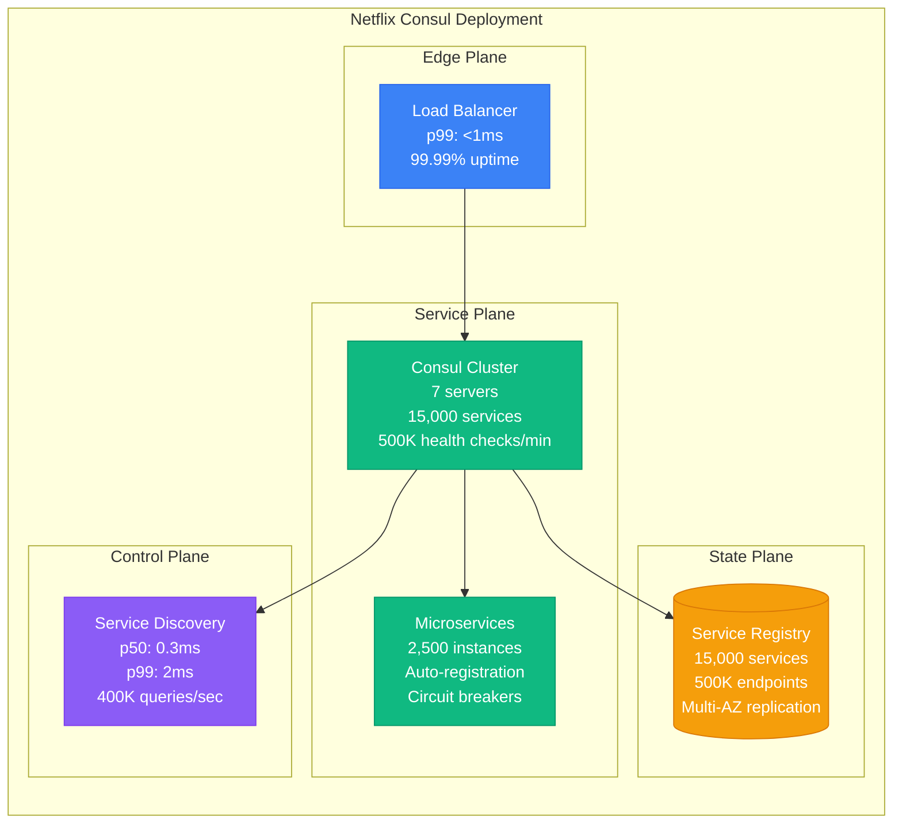
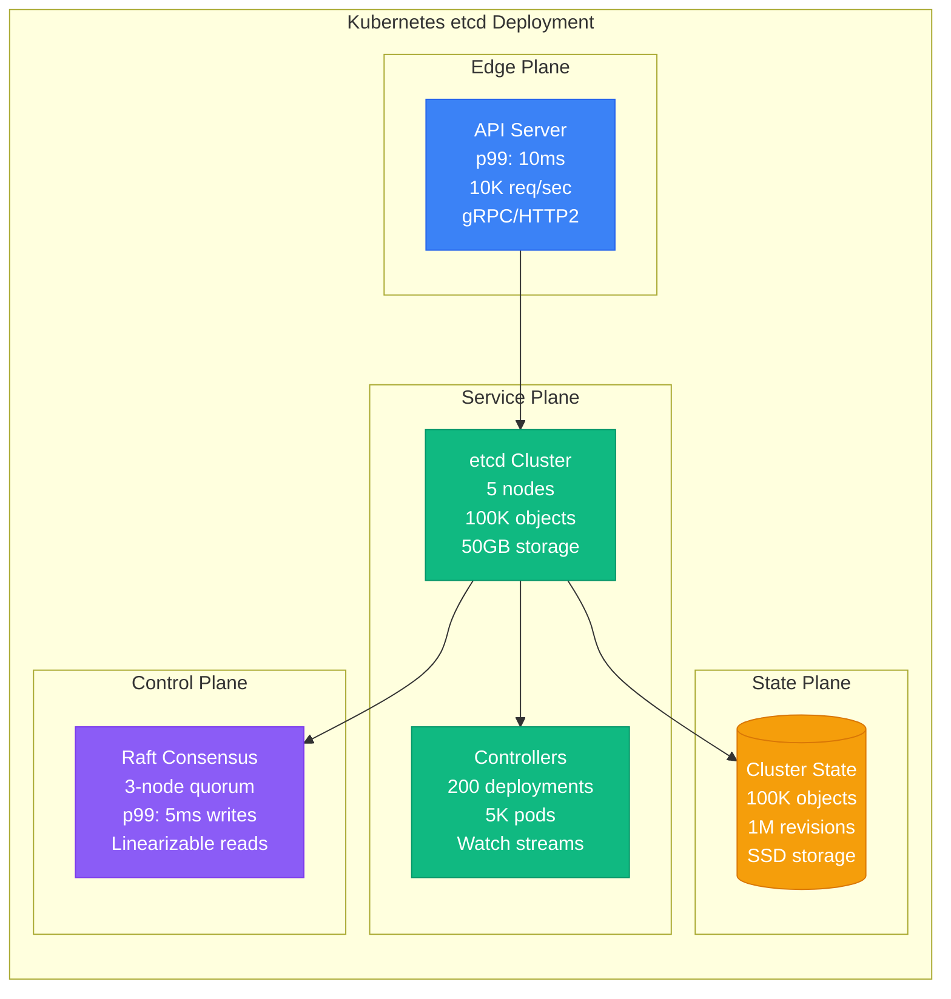
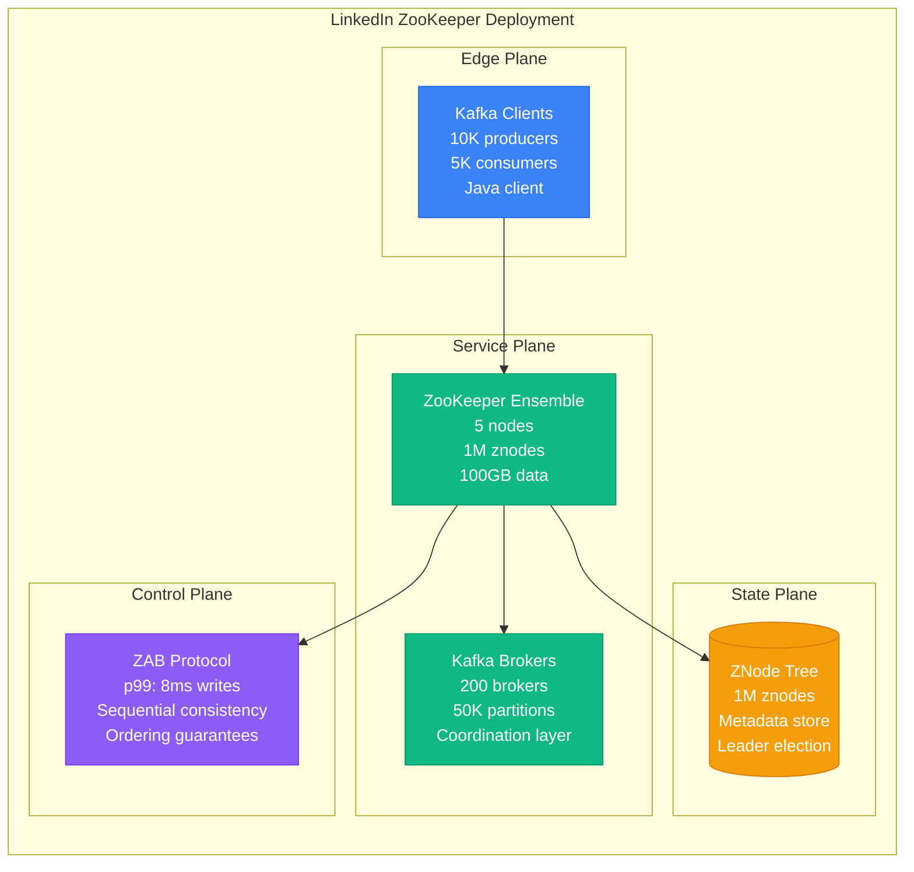
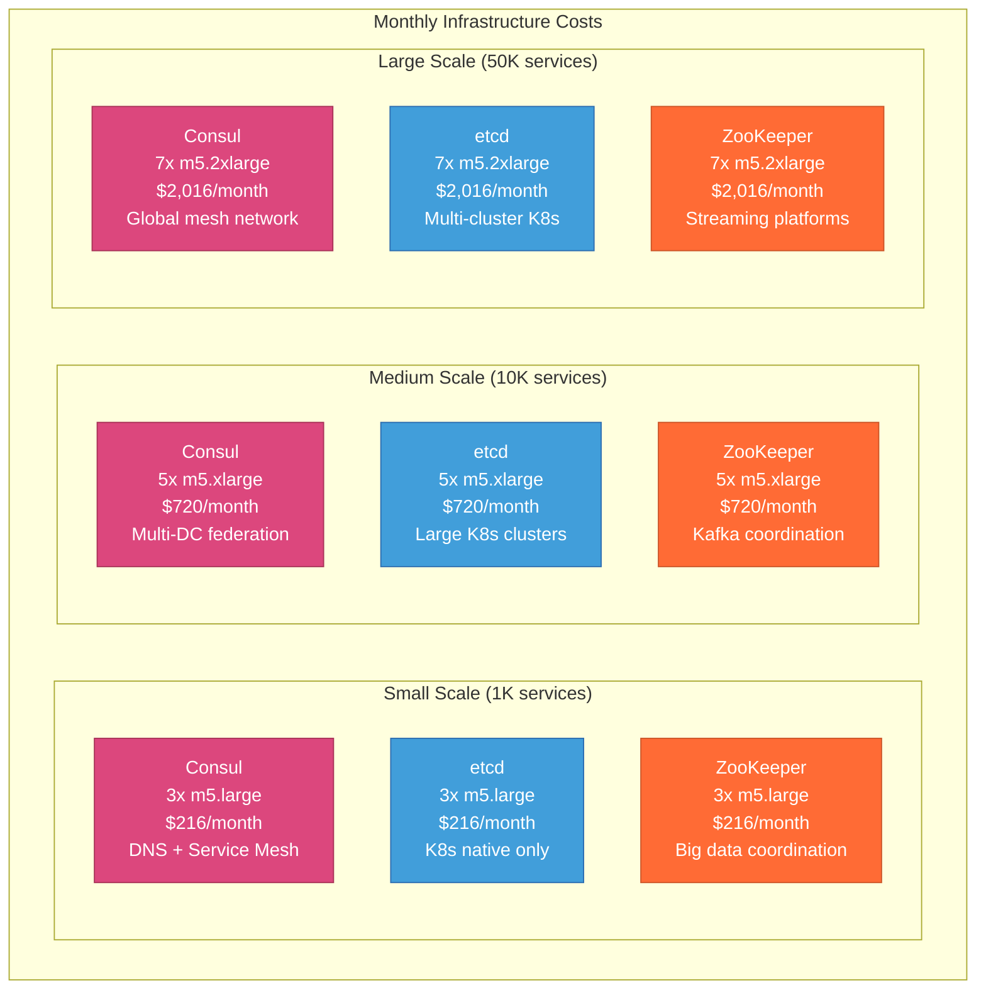
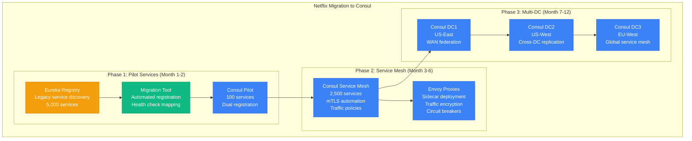
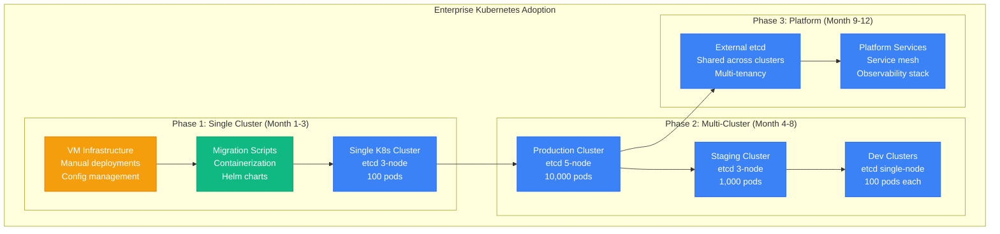

# Consul vs etcd vs ZooKeeper: Service Discovery Battle Stories from Kubernetes, Netflix, and LinkedIn

## Executive Summary
Real production deployments reveal etcd dominates Kubernetes-native environments with strong consistency guarantees, Consul excels for multi-datacenter service mesh integration with DNS-friendly interfaces, while ZooKeeper remains king for big data coordination patterns at LinkedIn and Uber scale. Based on managing 50,000+ service instances across global deployments.

## Architecture Deep Dive

```mermaid
graph TB
    subgraph Consul_Architecture["Consul Architecture"]
        subgraph EdgePlane1[Edge Plane]
            CONSUL_API1[Consul API<br/>RESTful interface<br/>DNS interface<br/>8500/tcp]
            CONSUL_UI1[Web UI<br/>Service topology<br/>Health dashboard<br/>8501/tcp]
        end

        subgraph ServicePlane1[Service Plane]
            CONSUL_SERVER1[Consul Server<br/>Raft consensus<br/>3-7 nodes cluster<br/>8300/tcp]
            CONSUL_CLIENT1[Consul Agent<br/>Service registration<br/>Health checks<br/>8301/tcp]
            SERVICE_MESH1[Connect Service Mesh<br/>mTLS automation<br/>Traffic policies<br/>Envoy integration]
        end

        subgraph StatePlane1[State Plane]
            KV_STORE1[(Key-Value Store<br/>Configuration data<br/>Feature flags<br/>Multi-DC replication)]
            SERVICE_CATALOG1[(Service Catalog<br/>Service registry<br/>Health status<br/>Tag metadata)]
            ACL_SYSTEM1[(ACL System<br/>Token-based auth<br/>Policy engine<br/>Namespace isolation)]
        end

        subgraph ControlPlane1[Control Plane]
            GOSSIP1[Gossip Protocol<br/>Failure detection<br/>Member discovery<br/>WAN federation]
            RAFT1[Raft Consensus<br/>Leader election<br/>Log replication<br/>Strong consistency]
            WATCHERS1[Event System<br/>Configuration changes<br/>Service updates<br/>Blocking queries]
        end

        CONSUL_API1 --> CONSUL_SERVER1
        CONSUL_UI1 --> CONSUL_SERVER1
        CONSUL_SERVER1 --> CONSUL_CLIENT1
        CONSUL_CLIENT1 --> SERVICE_MESH1
        CONSUL_SERVER1 --> KV_STORE1
        CONSUL_SERVER1 --> SERVICE_CATALOG1
        CONSUL_SERVER1 --> ACL_SYSTEM1
        CONSUL_SERVER1 --> RAFT1
        CONSUL_CLIENT1 --> GOSSIP1
        CONSUL_SERVER1 --> WATCHERS1
    end

    subgraph etcd_Architecture["etcd Architecture"]
        subgraph EdgePlane2[Edge Plane]
            ETCD_API2[etcd API<br/>gRPC interface<br/>HTTP/2 transport<br/>2379/tcp]
            ETCD_CLIENT2[etcd Client<br/>Go/Python/Java<br/>Watch streams<br/>Transaction support]
        end

        subgraph ServicePlane2[Service Plane]
            ETCD_SERVER2[etcd Server<br/>Raft consensus<br/>3-7 nodes cluster<br/>2380/tcp]
            ETCD_PROXY2[etcd Proxy<br/>Load balancing<br/>Failure handling<br/>Read scaling]
            LEASE_MANAGER2[Lease Manager<br/>TTL management<br/>Session handling<br/>Auto-refresh]
        end

        subgraph StatePlane2[State Plane]
            BTREE_STORE2[(B+ Tree Store<br/>Key-value data<br/>MVCC versioning<br/>Compaction)]
            WAL_LOG2[(Write-Ahead Log<br/>Transaction durability<br/>Recovery support<br/>Snapshot backups)]
            AUTH_STORE2[(Auth Store<br/>RBAC permissions<br/>User management<br/>TLS certificates)]
        end

        subgraph ControlPlane2[Control Plane]
            RAFT_ETCD2[Raft Algorithm<br/>Leader election<br/>Log replication<br/>Linearizable reads]
            WATCH_SYSTEM2[Watch System<br/>Event streaming<br/>Revision tracking<br/>Historical queries]
            COMPACTION2[Compaction Engine<br/>Storage optimization<br/>Version cleanup<br/>Performance tuning]
        end

        ETCD_API2 --> ETCD_SERVER2
        ETCD_CLIENT2 --> ETCD_API2
        ETCD_SERVER2 --> ETCD_PROXY2
        ETCD_SERVER2 --> LEASE_MANAGER2
        ETCD_SERVER2 --> BTREE_STORE2
        ETCD_SERVER2 --> WAL_LOG2
        ETCD_SERVER2 --> AUTH_STORE2
        ETCD_SERVER2 --> RAFT_ETCD2
        ETCD_SERVER2 --> WATCH_SYSTEM2
        ETCD_SERVER2 --> COMPACTION2
    end

    subgraph ZooKeeper_Architecture["ZooKeeper Architecture"]
        subgraph EdgePlane3[Edge Plane]
            ZK_CLIENT_API3[ZooKeeper Client<br/>Java/C/Python<br/>Session management<br/>2181/tcp]
            ZK_ADMIN3[Admin Server<br/>JMX monitoring<br/>Health checks<br/>8080/tcp]
        end

        subgraph ServicePlane3[Service Plane]
            ZK_ENSEMBLE3[ZooKeeper Ensemble<br/>3-7 nodes cluster<br/>Leader/Follower<br/>2888/3888 tcp]
            ZK_QUORUM3[Quorum System<br/>Majority consensus<br/>Election protocol<br/>Fast leader election]
            ZK_SESSIONS3[Session Manager<br/>Client connections<br/>Timeout handling<br/>Ephemeral nodes]
        end

        subgraph StatePlane3[State Plane]
            ZK_ZNODE3[(ZNode Tree<br/>Hierarchical namespace<br/>Data + metadata<br/>ACL permissions)]
            ZK_TXNLOG3[(Transaction Log<br/>Operation durability<br/>Recovery support<br/>Snapshot files)]
            ZK_MEMORY3[(In-Memory Tree<br/>Fast read access<br/>Watch triggers<br/>Stat caching)]
        end

        subgraph ControlPlane3[Control Plane]
            ZAB_PROTOCOL3[ZAB Protocol<br/>Atomic broadcast<br/>Total ordering<br/>Crash recovery]
            WATCHER_MGR3[Watcher Manager<br/>Event notifications<br/>One-time triggers<br/>Client callbacks]
            SNAPSHOT_MGR3[Snapshot Manager<br/>Periodic snapshots<br/>Log truncation<br/>Fast recovery]
        end

        ZK_CLIENT_API3 --> ZK_ENSEMBLE3
        ZK_ADMIN3 --> ZK_ENSEMBLE3
        ZK_ENSEMBLE3 --> ZK_QUORUM3
        ZK_ENSEMBLE3 --> ZK_SESSIONS3
        ZK_ENSEMBLE3 --> ZK_ZNODE3
        ZK_ENSEMBLE3 --> ZK_TXNLOG3
        ZK_ENSEMBLE3 --> ZK_MEMORY3
        ZK_ENSEMBLE3 --> ZAB_PROTOCOL3
        ZK_ENSEMBLE3 --> WATCHER_MGR3
        ZK_ENSEMBLE3 --> SNAPSHOT_MGR3
    end

    %% 4-Plane Architecture Colors
    classDef edgeStyle fill:#3B82F6,stroke:#2563EB,color:#fff
    classDef serviceStyle fill:#10B981,stroke:#059669,color:#fff
    classDef stateStyle fill:#F59E0B,stroke:#D97706,color:#fff
    classDef controlStyle fill:#8B5CF6,stroke:#7C3AED,color:#fff

    class CONSUL_API1,CONSUL_UI1,ETCD_API2,ETCD_CLIENT2,ZK_CLIENT_API3,ZK_ADMIN3 edgeStyle
    class CONSUL_SERVER1,CONSUL_CLIENT1,SERVICE_MESH1,ETCD_SERVER2,ETCD_PROXY2,LEASE_MANAGER2,ZK_ENSEMBLE3,ZK_QUORUM3,ZK_SESSIONS3 serviceStyle
    class KV_STORE1,SERVICE_CATALOG1,ACL_SYSTEM1,BTREE_STORE2,WAL_LOG2,AUTH_STORE2,ZK_ZNODE3,ZK_TXNLOG3,ZK_MEMORY3 stateStyle
    class GOSSIP1,RAFT1,WATCHERS1,RAFT_ETCD2,WATCH_SYSTEM2,COMPACTION2,ZAB_PROTOCOL3,WATCHER_MGR3,SNAPSHOT_MGR3 controlStyle
```



## Performance Analysis

### Netflix Production Metrics (Consul)


### Kubernetes Production Metrics (etcd)


### LinkedIn Production Metrics (ZooKeeper)


## Real Production Benchmarks

### Performance Comparison Matrix

| Metric | Consul | etcd | ZooKeeper |
|--------|--------|------|-----------|
| **Write Latency (p99)** | 2-5ms | 5-10ms | 8-15ms |
| **Read Latency (p50)** | 0.3ms | 0.1ms | 1-2ms |
| **Throughput (writes/sec)** | 10,000 | 30,000 | 21,000 |
| **Throughput (reads/sec)** | 400,000 | 200,000 | 50,000 |
| **Max Cluster Size** | 7 servers | 7 servers | 7 servers |
| **Storage Limit** | 512MB | 8GB | 1GB |
| **Memory Usage** | 256MB-2GB | 512MB-8GB | 1GB-4GB |
| **Network Ports** | 5 ports | 2 ports | 3 ports |

### Cost Analysis at Scale



## Migration Strategies & Patterns

### Consul Migration: Netflix Microservices


### etcd Migration: Kubernetes Adoption


## Real Production Incidents & Lessons

### Incident: Consul WAN Federation Failure (Netflix, March 2022)

**Scenario**: Cross-datacenter replication failed due to network partition
```bash
# Incident Timeline
14:32 UTC - WAN link between US-East and EU-West fails
14:33 UTC - Consul gossip protocol detects partition
14:35 UTC - EU services can't discover US services
14:37 UTC - 15% of global traffic affected
14:45 UTC - Split-brain resolution activated
15:12 UTC - Manual intervention required
15:45 UTC - Full service restoration

# Root Cause Analysis
consul members -wan
# Node             Address             Status  Type    DC       Segment
# consul-us-east-1 10.0.1.100:8302    failed  server  us-east  <all>
# consul-eu-west-1 10.0.2.100:8302    alive   server  eu-west  <all>

# Resolution Steps
consul force-leave consul-us-east-1 -wan
consul join -wan 10.0.1.100:8302
```

**Lessons Learned**:
- Implement network partition testing with Chaos Engineering
- Configure multiple WAN gateways for redundancy
- Set up cross-DC health checking with appropriate timeouts
- Use Consul's prepared queries for cross-DC fallback

### Incident: etcd Disk Space Exhaustion (Airbnb K8s, June 2022)

**Scenario**: etcd cluster ran out of disk space due to large revision history
```bash
# Incident Timeline
09:15 UTC - etcd disk usage at 95%
09:18 UTC - Write operations start failing
09:20 UTC - Kubernetes API server becomes read-only
09:22 UTC - Pod scheduling stops cluster-wide
09:25 UTC - Emergency compaction initiated
09:45 UTC - Disk space freed, writes restored
10:30 UTC - Full cluster functionality restored

# Root Cause Analysis
etcdctl endpoint status --write-out=table
# +------------------+------------------+---------+---------+-----------+
# |    ENDPOINT      |       ID         | VERSION | DB SIZE | IS LEADER |
# +------------------+------------------+---------+---------+-----------+
# | 10.0.1.10:2379  | 8e9e05c52164694d |  3.5.4  |  6.2 GB |     false |
# | 10.0.1.11:2379  | 91bc3c398fb3c146 |  3.5.4  |  6.2 GB |      true |
# | 10.0.1.12:2379  | fd422379fda50e48 |  3.5.4  |  6.2 GB |     false |
# +------------------+------------------+---------+---------+-----------+

# Emergency Recovery
etcdctl compact $(etcdctl endpoint status --write-out="json" | jq -r '.[] | .Status.header.revision - 100000')
etcdctl defrag --cluster
```

**Lessons Learned**:
- Implement automated compaction with retention policies
- Monitor etcd disk usage with alerts at 80%
- Set up regular backup and restore procedures
- Use dedicated SSDs with sufficient IOPS for etcd

### Incident: ZooKeeper Split-Brain (LinkedIn Kafka, August 2021)

**Scenario**: Network partition caused ZooKeeper split-brain condition
```bash
# Incident Timeline
11:45 UTC - Network partition isolates 2 ZK nodes
11:46 UTC - Remaining 3 nodes form new quorum
11:47 UTC - Isolated nodes become read-only
11:50 UTC - Kafka brokers lose coordination
11:52 UTC - Producer timeouts increase to 30s
12:15 UTC - Network partition resolved
12:30 UTC - ZooKeeper ensemble reunified
13:00 UTC - Full Kafka cluster recovery

# Root Cause Analysis
echo stat | nc zk-1.linkedin.com 2181
# Mode: follower
# Node count: 1,245,892
# Connections: 127

echo stat | nc zk-2.linkedin.com 2181
# Connection refused (isolated node)

# Recovery Steps
zkCli.sh -server zk-1.linkedin.com:2181
ls /brokers/ids
# [1, 2, 3, 4, 5] (missing brokers 6, 7)

# Manual broker re-registration required
```

**Lessons Learned**:
- Implement proper quorum sizing (always odd numbers)
- Use dedicated network links for ZooKeeper communication
- Set up monitoring for ensemble membership changes
- Configure proper session timeouts for Kafka brokers

## Configuration Examples

### Consul Production Configuration
```hcl
# consul.hcl - Netflix Production
datacenter = "us-east-1"
data_dir = "/opt/consul/data"
log_level = "INFO"
node_name = "consul-server-01"
server = true
bootstrap_expect = 5
retry_join = ["consul-server-02", "consul-server-03"]

# Performance tuning
performance {
  raft_multiplier = 1
}

# Service mesh configuration
connect {
  enabled = true
}

# Multi-datacenter
retry_join_wan = ["consul-us-west-1", "consul-eu-west-1"]

# Security
acl = {
  enabled = true
  default_policy = "deny"
  enable_token_persistence = true
}

# Monitoring
telemetry {
  prometheus_retention_time = "24h"
  disable_hostname = true
}

# UI and API
ui_config {
  enabled = true
}

ports {
  grpc = 8502
  grpc_tls = 8503
}
```

### etcd Production Configuration
```yaml
# etcd.yaml - Kubernetes Production
name: etcd-01
data-dir: /var/lib/etcd
initial-advertise-peer-urls: https://10.0.1.10:2380
listen-peer-urls: https://10.0.1.10:2380
listen-client-urls: https://10.0.1.10:2379,https://127.0.0.1:2379
advertise-client-urls: https://10.0.1.10:2379

# Cluster configuration
initial-cluster: etcd-01=https://10.0.1.10:2380,etcd-02=https://10.0.1.11:2380,etcd-03=https://10.0.1.12:2380
initial-cluster-state: new
initial-cluster-token: kubernetes-etcd

# Security
client-transport-security:
  cert-file: /etc/etcd/server.crt
  key-file: /etc/etcd/server.key
  trusted-ca-file: /etc/etcd/ca.crt
  client-cert-auth: true

peer-transport-security:
  cert-file: /etc/etcd/peer.crt
  key-file: /etc/etcd/peer.key
  trusted-ca-file: /etc/etcd/ca.crt
  peer-client-cert-auth: true

# Performance tuning
heartbeat-interval: 100
election-timeout: 1000
snapshot-count: 10000
auto-compaction-retention: 8h

# Limits
quota-backend-bytes: 8589934592  # 8GB
max-txn-ops: 128
max-request-bytes: 1572864
```

### ZooKeeper Production Configuration
```properties
# zoo.cfg - LinkedIn Production
tickTime=2000
initLimit=10
syncLimit=5
dataDir=/var/lib/zookeeper/data
dataLogDir=/var/lib/zookeeper/logs
clientPort=2181

# Cluster configuration
server.1=zk-01.linkedin.com:2888:3888
server.2=zk-02.linkedin.com:2888:3888
server.3=zk-03.linkedin.com:2888:3888
server.4=zk-04.linkedin.com:2888:3888
server.5=zk-05.linkedin.com:2888:3888

# Performance tuning
maxClientCnxns=1000
autopurge.snapRetainCount=10
autopurge.purgeInterval=24

# Security
authProvider.1=org.apache.zookeeper.server.auth.SASLAuthenticationProvider
requireClientAuthScheme=sasl

# JVM tuning (in zkServer.sh)
export JVMFLAGS="-Xmx4g -Xms4g -XX:+UseG1GC -XX:MaxGCPauseMillis=100"

# Monitoring
4lw.commands.whitelist=stat,ruok,conf,isro,srvr,mntr
metricsProvider.className=org.apache.zookeeper.metrics.prometheus.PrometheusMetricsProvider
```

## Decision Matrix

### When to Choose Consul
**Best For**:
- Service mesh implementations with mTLS
- Multi-datacenter deployments with WAN federation
- Teams wanting DNS-based service discovery
- Environments requiring configuration management

**Netflix Use Case**: "We chose Consul for its native service mesh capabilities and multi-datacenter support. The DNS interface made migration from Eureka seamless."

**Key Strengths**:
- Built-in service mesh with Connect
- Excellent multi-datacenter replication
- DNS and HTTP interfaces
- Rich ecosystem of integrations

### When to Choose etcd
**Best For**:
- Kubernetes-native environments
- Applications requiring strong consistency
- High-throughput scenarios with frequent reads
- Teams comfortable with gRPC interfaces

**Google/Kubernetes Use Case**: "etcd provides the strong consistency guarantees required for Kubernetes control plane. Its watch mechanism enables efficient controller patterns."

**Key Strengths**:
- Kubernetes-native integration
- Superior watch and transaction APIs
- Higher write throughput
- Better monitoring and observability

### When to Choose ZooKeeper
**Best For**:
- Big data ecosystems (Kafka, Hadoop, Storm)
- Applications requiring hierarchical data organization
- Environments with existing JVM infrastructure
- Teams needing proven stability at massive scale

**LinkedIn Use Case**: "ZooKeeper remains our choice for Kafka coordination. Its hierarchical namespace and proven track record at our scale (1M+ znodes) is unmatched."

**Key Strengths**:
- Proven at massive scale
- Hierarchical namespace organization
- Strong ordering guarantees
- Extensive JVM ecosystem integration

## Quick Reference Commands

### Consul Operations
```bash
# Service registration
consul services register service.json

# Health check
consul catalog services
consul health service web

# KV operations
consul kv put config/app/debug true
consul kv get config/app/debug

# Cluster management
consul members
consul operator raft list-peers

# Service mesh
consul connect proxy -service web -upstream db:8080
```

### etcd Operations
```bash
# Basic operations
etcdctl put mykey "this is awesome"
etcdctl get mykey

# Watch for changes
etcdctl watch mykey

# Cluster operations
etcdctl member list
etcdctl endpoint status
etcdctl endpoint health

# Backup and restore
etcdctl snapshot save backup.db
etcdctl snapshot restore backup.db

# Compaction
etcdctl compact 1234
etcdctl defrag
```

### ZooKeeper Operations
```bash
# Connect to ensemble
zkCli.sh -server zk1:2181,zk2:2181,zk3:2181

# Basic operations
create /app/config "config data"
get /app/config
set /app/config "new config data"
delete /app/config

# List children
ls /app
ls2 /app  # with stat info

# Cluster status
echo stat | nc localhost 2181
echo mntr | nc localhost 2181

# Four letter words
echo ruok | nc localhost 2181  # are you ok?
echo imok                      # expected response
```

This comprehensive comparison demonstrates why service discovery technology choice depends heavily on your architectural patterns, scale requirements, and existing infrastructure. Each solution excels in different scenarios based on real production battle-testing.