# GraphQL vs REST vs gRPC: API Performance at Scale

*The API protocol battle: Flexibility vs Simplicity vs Performance*

## Executive Summary

This comparison examines GraphQL, REST, and gRPC based on real production deployments at scale, focusing on what actually happens when you serve millions of API requests per second.

**TL;DR Production Reality:**
- **GraphQL**: Wins for frontend flexibility and mobile optimization, loses on backend complexity
- **REST**: Wins for simplicity and caching, loses on over-fetching and multiple round trips
- **gRPC**: Wins for performance and type safety, loses on browser support and debugging

## Architecture Comparison at Scale

### GraphQL - GitHub's API v4 Architecture

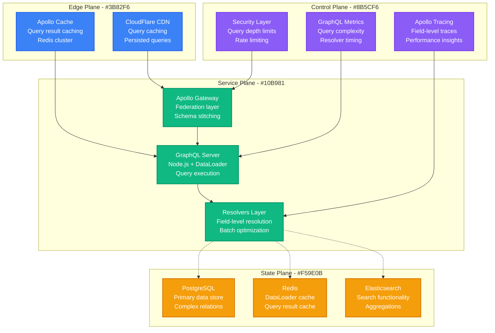
```mermaid
graph TB
    subgraph "Edge Plane - #3B82F6"
        CDN[CloudFlare CDN<br/>Query caching<br/>Persisted queries]
        CACHE[Apollo Cache<br/>Query result caching<br/>Redis cluster]
    end

    subgraph "Service Plane - #10B981"
        APOLLO[Apollo Gateway<br/>Federation layer<br/>Schema stitching]
        GQL_SERVER[GraphQL Server<br/>Node.js + DataLoader<br/>Query execution]
        RESOLVER[Resolvers Layer<br/>Field-level resolution<br/>Batch optimization]
    end

    subgraph "State Plane - #F59E0B"
        POSTGRES[PostgreSQL<br/>Primary data store<br/>Complex relations]
        REDIS[Redis<br/>DataLoader cache<br/>Query result cache]
        ELASTICSEARCH[Elasticsearch<br/>Search functionality<br/>Aggregations]
    end

    subgraph "Control Plane - #8B5CF6"
        METRICS[GraphQL Metrics<br/>Query complexity<br/>Resolver timing]
        TRACING[Apollo Tracing<br/>Field-level traces<br/>Performance insights]
        SECURITY[Security Layer<br/>Query depth limits<br/>Rate limiting]
    end

    CDN --> APOLLO
    CACHE --> GQL_SERVER
    APOLLO --> GQL_SERVER
    GQL_SERVER --> RESOLVER
    RESOLVER -.-> POSTGRES
    RESOLVER -.-> REDIS
    RESOLVER -.-> ELASTICSEARCH
    METRICS --> GQL_SERVER
    TRACING --> RESOLVER
    SECURITY --> APOLLO

    classDef edgeStyle fill:#3B82F6,stroke:#2563EB,color:#fff,stroke-width:2px
    classDef serviceStyle fill:#10B981,stroke:#059669,color:#fff,stroke-width:2px
    classDef stateStyle fill:#F59E0B,stroke:#D97706,color:#fff,stroke-width:2px
    classDef controlStyle fill:#8B5CF6,stroke:#7C3AED,color:#fff,stroke-width:2px

    class CDN,CACHE edgeStyle
    class APOLLO,GQL_SERVER,RESOLVER serviceStyle
    class POSTGRES,REDIS,ELASTICSEARCH stateStyle
    class METRICS,TRACING,SECURITY controlStyle
```

**GitHub Production Stats (2024):**
- **Queries/Day**: 2 billion GraphQL queries
- **Schema Size**: 2,000+ types, 50,000+ fields
- **Response Time**: p95 < 200ms for complex queries
- **Data Reduction**: 60% less data transfer vs REST
- **Monthly Cost**: $150,000 (infrastructure + CDN)

### REST API - Stripe's Payment Processing

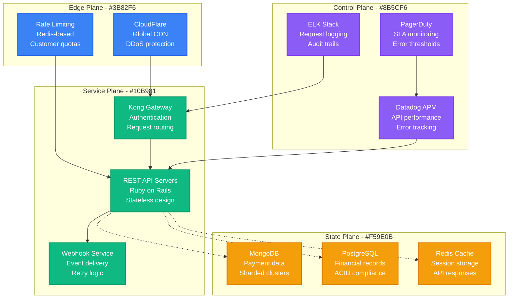
```mermaid
graph TB
    subgraph "Edge Plane - #3B82F6"
        CLOUDFLARE[CloudFlare<br/>Global CDN<br/>DDoS protection]
        RATE_LIMIT[Rate Limiting<br/>Redis-based<br/>Customer quotas]
    end

    subgraph "Service Plane - #10B981"
        API_GW[Kong Gateway<br/>Authentication<br/>Request routing]
        REST_API[REST API Servers<br/>Ruby on Rails<br/>Stateless design]
        WEBHOOK[Webhook Service<br/>Event delivery<br/>Retry logic]
    end

    subgraph "State Plane - #F59E0B"
        MONGODB[MongoDB<br/>Payment data<br/>Sharded clusters]
        POSTGRES_S[PostgreSQL<br/>Financial records<br/>ACID compliance]
        CACHE_LAYER[Redis Cache<br/>Session storage<br/>API responses]
    end

    subgraph "Control Plane - #8B5CF6"
        MONITORING[Datadog APM<br/>API performance<br/>Error tracking]
        LOGGING[ELK Stack<br/>Request logging<br/>Audit trails]
        ALERTS[PagerDuty<br/>SLA monitoring<br/>Error thresholds]
    end

    CLOUDFLARE --> API_GW
    RATE_LIMIT --> REST_API
    API_GW --> REST_API
    REST_API --> WEBHOOK
    REST_API -.-> MONGODB
    REST_API -.-> POSTGRES_S
    REST_API -.-> CACHE_LAYER
    MONITORING --> REST_API
    LOGGING --> API_GW
    ALERTS --> MONITORING

    classDef edgeStyle fill:#3B82F6,stroke:#2563EB,color:#fff,stroke-width:2px
    classDef serviceStyle fill:#10B981,stroke:#059669,color:#fff,stroke-width:2px
    classDef stateStyle fill:#F59E0B,stroke:#D97706,color:#fff,stroke-width:2px
    classDef controlStyle fill:#8B5CF6,stroke:#7C3AED,color:#fff,stroke-width:2px

    class CLOUDFLARE,RATE_LIMIT edgeStyle
    class API_GW,REST_API,WEBHOOK serviceStyle
    class MONGODB,POSTGRES_S,CACHE_LAYER stateStyle
    class MONITORING,LOGGING,ALERTS controlStyle
```

**Stripe Production Stats (2024):**
- **Requests/Day**: 50 billion API requests
- **Endpoints**: 500+ REST endpoints
- **Response Time**: p99 < 100ms for payment APIs
- **Uptime**: 99.995% SLA compliance
- **Monthly Cost**: $200,000 (global infrastructure)

### gRPC - Uber's Microservice Communication

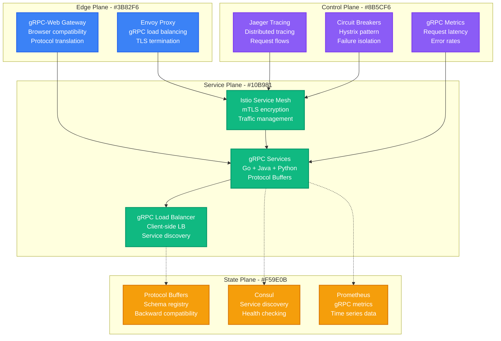
```mermaid
graph TB
    subgraph "Edge Plane - #3B82F6"
        ENVOY[Envoy Proxy<br/>gRPC load balancing<br/>TLS termination]
        GRPC_WEB[gRPC-Web Gateway<br/>Browser compatibility<br/>Protocol translation]
    end

    subgraph "Service Plane - #10B981"
        SERVICE_MESH[Istio Service Mesh<br/>mTLS encryption<br/>Traffic management]
        GRPC_SERVICES[gRPC Services<br/>Go + Java + Python<br/>Protocol Buffers]
        LB[gRPC Load Balancer<br/>Client-side LB<br/>Service discovery]
    end

    subgraph "State Plane - #F59E0B"
        PROTOBUF[Protocol Buffers<br/>Schema registry<br/>Backward compatibility]
        CONSUL[Consul<br/>Service discovery<br/>Health checking]
        METRICS_STORE[Prometheus<br/>gRPC metrics<br/>Time series data]
    end

    subgraph "Control Plane - #8B5CF6"
        JAEGER[Jaeger Tracing<br/>Distributed tracing<br/>Request flows]
        GRPC_METRICS[gRPC Metrics<br/>Request latency<br/>Error rates]
        CIRCUIT_BREAKER[Circuit Breakers<br/>Hystrix pattern<br/>Failure isolation]
    end

    ENVOY --> SERVICE_MESH
    GRPC_WEB --> GRPC_SERVICES
    SERVICE_MESH --> GRPC_SERVICES
    GRPC_SERVICES --> LB
    LB -.-> PROTOBUF
    GRPC_SERVICES -.-> CONSUL
    GRPC_SERVICES -.-> METRICS_STORE
    JAEGER --> SERVICE_MESH
    GRPC_METRICS --> GRPC_SERVICES
    CIRCUIT_BREAKER --> SERVICE_MESH

    classDef edgeStyle fill:#3B82F6,stroke:#2563EB,color:#fff,stroke-width:2px
    classDef serviceStyle fill:#10B981,stroke:#059669,color:#fff,stroke-width:2px
    classDef stateStyle fill:#F59E0B,stroke:#D97706,color:#fff,stroke-width:2px
    classDef controlStyle fill:#8B5CF6,stroke:#7C3AED,color:#fff,stroke-width:2px

    class ENVOY,GRPC_WEB edgeStyle
    class SERVICE_MESH,GRPC_SERVICES,LB serviceStyle
    class PROTOBUF,CONSUL,METRICS_STORE stateStyle
    class JAEGER,GRPC_METRICS,CIRCUIT_BREAKER controlStyle
```

**Uber Production Stats (2024):**
- **RPC Calls/Day**: 100 billion internal calls
- **Services**: 2,000+ microservices
- **Response Time**: p99 < 10ms for internal calls
- **Throughput**: 500K RPS per service
- **Monthly Cost**: $80,000 (lower overhead vs REST)

## Performance Benchmarks - Real World Data

### Latency Comparison Under Load

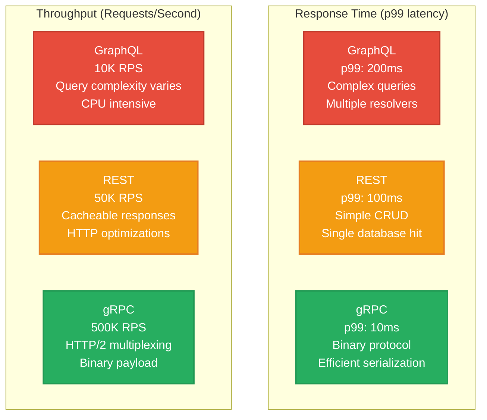
```mermaid
graph TB
    subgraph "Response Time (p99 latency)"
        GQL_LAT[GraphQL<br/>p99: 200ms<br/>Complex queries<br/>Multiple resolvers]
        REST_LAT[REST<br/>p99: 100ms<br/>Simple CRUD<br/>Single database hit]
        GRPC_LAT[gRPC<br/>p99: 10ms<br/>Binary protocol<br/>Efficient serialization]
    end

    subgraph "Throughput (Requests/Second)"
        GQL_THROUGHPUT[GraphQL<br/>10K RPS<br/>Query complexity varies<br/>CPU intensive]
        REST_THROUGHPUT[REST<br/>50K RPS<br/>Cacheable responses<br/>HTTP optimizations]
        GRPC_THROUGHPUT[gRPC<br/>500K RPS<br/>HTTP/2 multiplexing<br/>Binary payload]
    end

    classDef gqlStyle fill:#e74c3c,stroke:#c0392b,color:#fff,stroke-width:2px
    classDef restStyle fill:#f39c12,stroke:#e67e22,color:#fff,stroke-width:2px
    classDef grpcStyle fill:#27ae60,stroke:#229954,color:#fff,stroke-width:2px

    class GQL_LAT,GQL_THROUGHPUT gqlStyle
    class REST_LAT,REST_THROUGHPUT restStyle
    class GRPC_LAT,GRPC_THROUGHPUT grpcStyle
```

### Payload Size and Network Efficiency

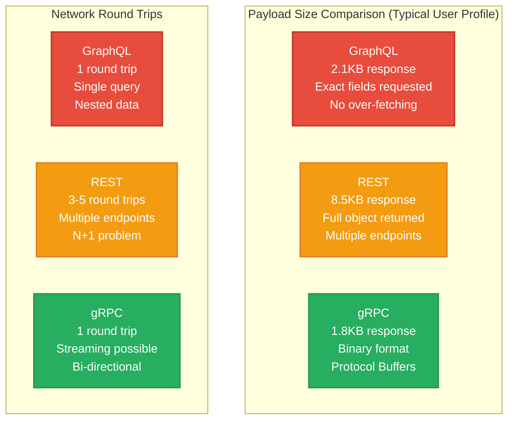
```mermaid
graph TB
    subgraph "Payload Size Comparison (Typical User Profile)"
        GQL_PAYLOAD[GraphQL<br/>2.1KB response<br/>Exact fields requested<br/>No over-fetching]
        REST_PAYLOAD[REST<br/>8.5KB response<br/>Full object returned<br/>Multiple endpoints]
        GRPC_PAYLOAD[gRPC<br/>1.8KB response<br/>Binary format<br/>Protocol Buffers]
    end

    subgraph "Network Round Trips"
        GQL_TRIPS[GraphQL<br/>1 round trip<br/>Single query<br/>Nested data]
        REST_TRIPS[REST<br/>3-5 round trips<br/>Multiple endpoints<br/>N+1 problem]
        GRPC_TRIPS[gRPC<br/>1 round trip<br/>Streaming possible<br/>Bi-directional]
    end

    classDef gqlStyle fill:#e74c3c,stroke:#c0392b,color:#fff,stroke-width:2px
    classDef restStyle fill:#f39c12,stroke:#e67e22,color:#fff,stroke-width:2px
    classDef grpcStyle fill:#27ae60,stroke:#229954,color:#fff,stroke-width:2px

    class GQL_PAYLOAD,GQL_TRIPS gqlStyle
    class REST_PAYLOAD,REST_TRIPS restStyle
    class GRPC_PAYLOAD,GRPC_TRIPS grpcStyle
```

## Mobile Performance Impact

### GitHub Mobile App - GraphQL Benefits

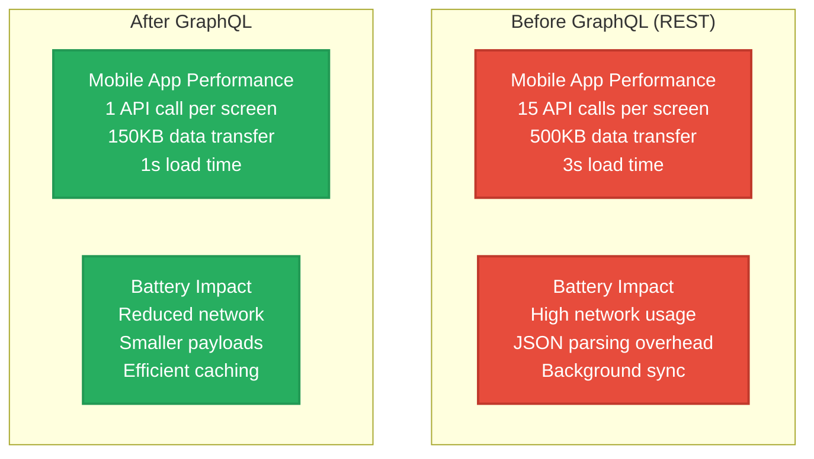
```mermaid
graph TB
    subgraph "Before GraphQL (REST)"
        REST_MOBILE[Mobile App Performance<br/>15 API calls per screen<br/>500KB data transfer<br/>3s load time]
        REST_BATTERY[Battery Impact<br/>High network usage<br/>JSON parsing overhead<br/>Background sync]
    end

    subgraph "After GraphQL"
        GQL_MOBILE[Mobile App Performance<br/>1 API call per screen<br/>150KB data transfer<br/>1s load time]
        GQL_BATTERY[Battery Impact<br/>Reduced network<br/>Smaller payloads<br/>Efficient caching]
    end

    classDef beforeStyle fill:#e74c3c,stroke:#c0392b,color:#fff,stroke-width:2px
    classDef afterStyle fill:#27ae60,stroke:#229954,color:#fff,stroke-width:2px

    class REST_MOBILE,REST_BATTERY beforeStyle
    class GQL_MOBILE,GQL_BATTERY afterStyle
```

**Real Metrics:**
- **Data Reduction**: 70% less data transferred
- **Battery Life**: 25% improvement in network-related battery usage
- **User Experience**: 2x faster screen load times
- **Development Speed**: 40% faster feature development

## Cost Analysis - Infrastructure and Development

### GitHub GraphQL Infrastructure Cost

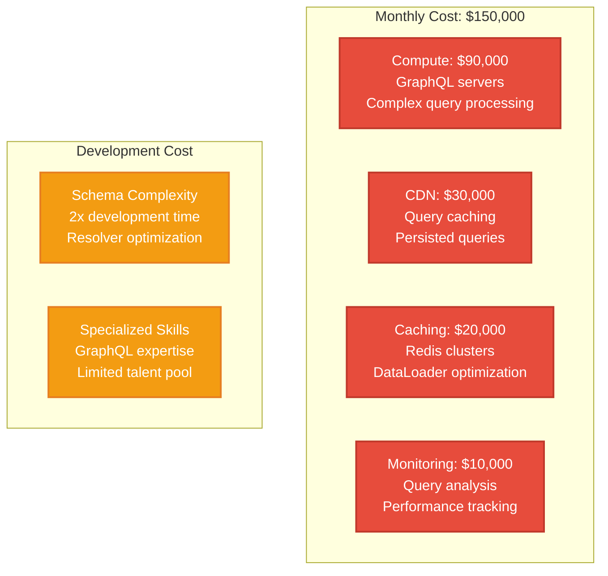
```mermaid
graph TB
    subgraph "Monthly Cost: $150,000"
        GQL_COMPUTE[Compute: $90,000<br/>GraphQL servers<br/>Complex query processing]
        GQL_CDN[CDN: $30,000<br/>Query caching<br/>Persisted queries]
        GQL_CACHE[Caching: $20,000<br/>Redis clusters<br/>DataLoader optimization]
        GQL_MONITORING[Monitoring: $10,000<br/>Query analysis<br/>Performance tracking]
    end

    subgraph "Development Cost"
        GQL_COMPLEXITY[Schema Complexity<br/>2x development time<br/>Resolver optimization]
        GQL_EXPERTISE[Specialized Skills<br/>GraphQL expertise<br/>Limited talent pool]
    end

    classDef costStyle fill:#e74c3c,stroke:#c0392b,color:#fff,stroke-width:2px
    classDef devStyle fill:#f39c12,stroke:#e67e22,color:#fff,stroke-width:2px

    class GQL_COMPUTE,GQL_CDN,GQL_CACHE,GQL_MONITORING costStyle
    class GQL_COMPLEXITY,GQL_EXPERTISE devStyle
```

### Stripe REST API Infrastructure Cost

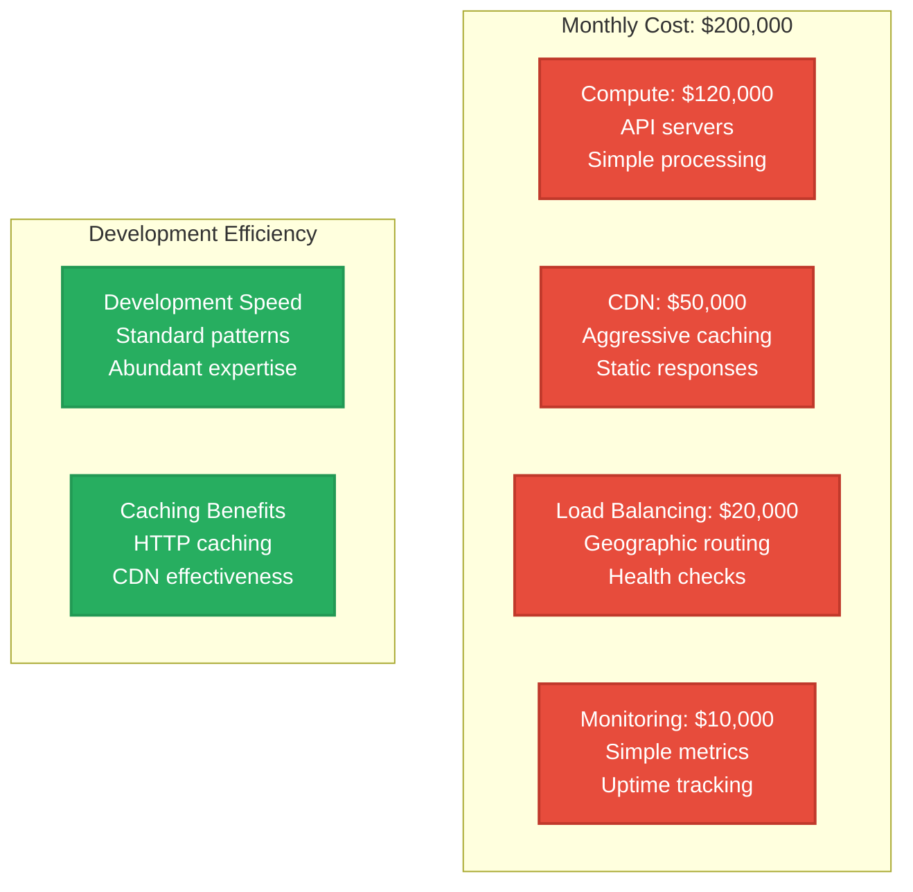
```mermaid
graph TB
    subgraph "Monthly Cost: $200,000"
        REST_COMPUTE[Compute: $120,000<br/>API servers<br/>Simple processing]
        REST_CDN[CDN: $50,000<br/>Aggressive caching<br/>Static responses]
        REST_LB[Load Balancing: $20,000<br/>Geographic routing<br/>Health checks]
        REST_MONITORING[Monitoring: $10,000<br/>Simple metrics<br/>Uptime tracking]
    end

    subgraph "Development Efficiency"
        REST_SIMPLE[Development Speed<br/>Standard patterns<br/>Abundant expertise]
        REST_CACHE[Caching Benefits<br/>HTTP caching<br/>CDN effectiveness]
    end

    classDef costStyle fill:#e74c3c,stroke:#c0392b,color:#fff,stroke-width:2px
    classDef effStyle fill:#27ae60,stroke:#229954,color:#fff,stroke-width:2px

    class REST_COMPUTE,REST_CDN,REST_LB,REST_MONITORING costStyle
    class REST_SIMPLE,REST_CACHE effStyle
```

### Uber gRPC Infrastructure Cost

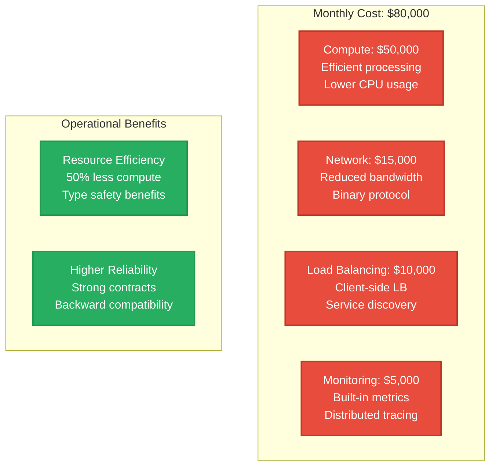
```mermaid
graph TB
    subgraph "Monthly Cost: $80,000"
        GRPC_COMPUTE[Compute: $50,000<br/>Efficient processing<br/>Lower CPU usage]
        GRPC_NETWORK[Network: $15,000<br/>Reduced bandwidth<br/>Binary protocol]
        GRPC_LB[Load Balancing: $10,000<br/>Client-side LB<br/>Service discovery]
        GRPC_MONITORING[Monitoring: $5,000<br/>Built-in metrics<br/>Distributed tracing]
    end

    subgraph "Operational Benefits"
        GRPC_EFFICIENCY[Resource Efficiency<br/>50% less compute<br/>Type safety benefits]
        GRPC_RELIABILITY[Higher Reliability<br/>Strong contracts<br/>Backward compatibility]
    end

    classDef costStyle fill:#e74c3c,stroke:#c0392b,color:#fff,stroke-width:2px
    classDef benefitStyle fill:#27ae60,stroke:#229954,color:#fff,stroke-width:2px

    class GRPC_COMPUTE,GRPC_NETWORK,GRPC_LB,GRPC_MONITORING costStyle
    class GRPC_EFFICIENCY,GRPC_RELIABILITY benefitStyle
```

## Real Production Incidents

### GraphQL: GitHub's Query Complexity Explosion

**Duration**: 2 hours
**Impact**: API response times increased 10x
**Root Cause**: Unbounded query depth from malicious client

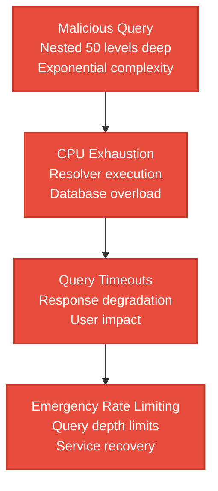
```mermaid
graph TB
    MALICIOUS[Malicious Query<br/>Nested 50 levels deep<br/>Exponential complexity] --> CPU_SPIKE[CPU Exhaustion<br/>Resolver execution<br/>Database overload]
    CPU_SPIKE --> TIMEOUT[Query Timeouts<br/>Response degradation<br/>User impact]
    TIMEOUT --> RATE_LIMIT[Emergency Rate Limiting<br/>Query depth limits<br/>Service recovery]

    classDef incidentStyle fill:#e74c3c,stroke:#c0392b,color:#fff,stroke-width:2px
    class MALICIOUS,CPU_SPIKE,TIMEOUT,RATE_LIMIT incidentStyle
```

**Lessons Learned:**
- Query complexity analysis mandatory
- Depth limiting at gateway level
- Cost-based query timeouts
- Persisted queries for known clients

### REST: Stripe's N+1 Query Problem

**Duration**: 1 hour
**Impact**: Payment processing delays
**Root Cause**: Client making sequential API calls for related data

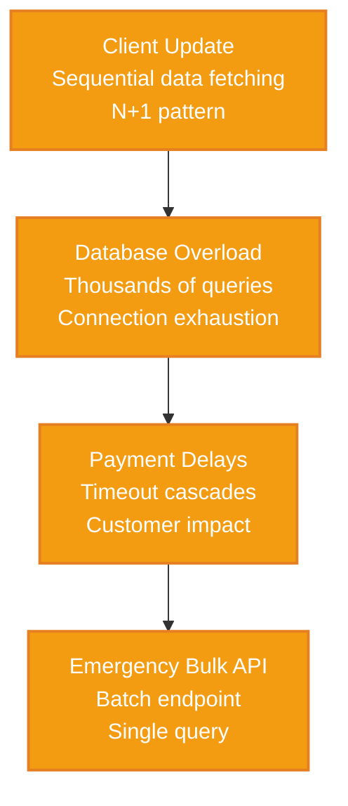
```mermaid
graph TB
    CLIENT_CHANGE[Client Update<br/>Sequential data fetching<br/>N+1 pattern] --> DB_OVERLOAD[Database Overload<br/>Thousands of queries<br/>Connection exhaustion]
    DB_OVERLOAD --> PAYMENT_DELAY[Payment Delays<br/>Timeout cascades<br/>Customer impact]
    PAYMENT_DELAY --> BULK_API[Emergency Bulk API<br/>Batch endpoint<br/>Single query]

    classDef incidentStyle fill:#f39c12,stroke:#e67e22,color:#fff,stroke-width:2px
    class CLIENT_CHANGE,DB_OVERLOAD,PAYMENT_DELAY,BULK_API incidentStyle
```

**Lessons Learned:**
- Client SDK improvements for batching
- Bulk API endpoints for common patterns
- Database connection monitoring
- Client education on best practices

### gRPC: Uber's Protocol Buffer Incompatibility

**Duration**: 30 minutes
**Impact**: 500K RPC failures
**Root Cause**: Breaking change in protobuf schema

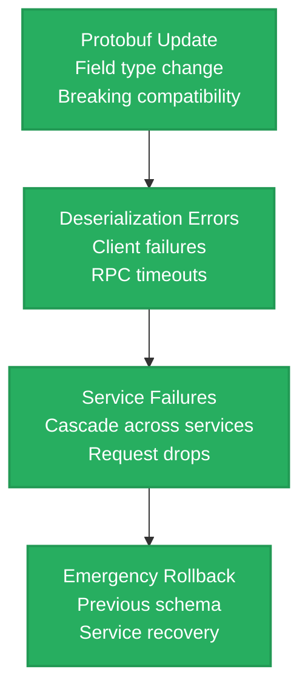
```mermaid
graph TB
    SCHEMA_CHANGE[Protobuf Update<br/>Field type change<br/>Breaking compatibility] --> DESERIALIZATION[Deserialization Errors<br/>Client failures<br/>RPC timeouts]
    DESERIALIZATION --> SERVICE_FAILURE[Service Failures<br/>Cascade across services<br/>Request drops]
    SERVICE_FAILURE --> ROLLBACK[Emergency Rollback<br/>Previous schema<br/>Service recovery]

    classDef incidentStyle fill:#27ae60,stroke:#229954,color:#fff,stroke-width:2px
    class SCHEMA_CHANGE,DESERIALIZATION,SERVICE_FAILURE,ROLLBACK incidentStyle
```

**Lessons Learned:**
- Schema compatibility testing mandatory
- Gradual rollout for schema changes
- Version compatibility matrices
- Automated compatibility checks in CI

## Developer Experience Comparison

### Learning Curve and Productivity

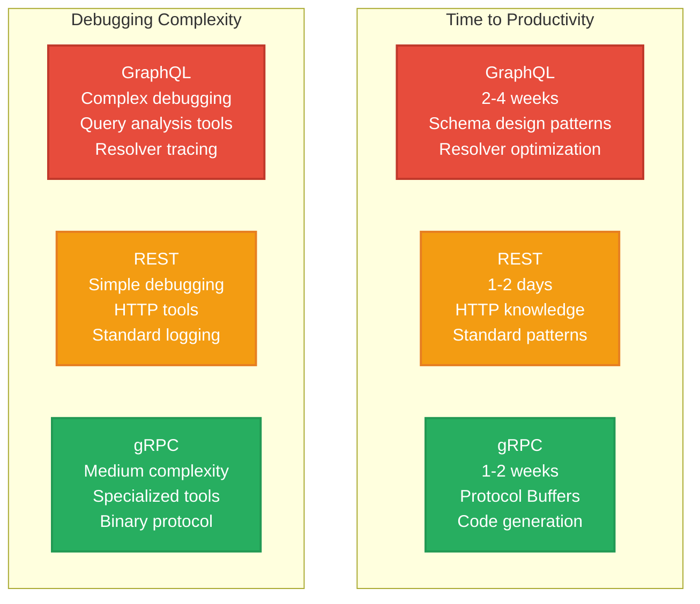
```mermaid
graph TB
    subgraph "Time to Productivity"
        GQL_LEARN[GraphQL<br/>2-4 weeks<br/>Schema design patterns<br/>Resolver optimization]
        REST_LEARN[REST<br/>1-2 days<br/>HTTP knowledge<br/>Standard patterns]
        GRPC_LEARN[gRPC<br/>1-2 weeks<br/>Protocol Buffers<br/>Code generation]
    end

    subgraph "Debugging Complexity"
        GQL_DEBUG[GraphQL<br/>Complex debugging<br/>Query analysis tools<br/>Resolver tracing]
        REST_DEBUG[REST<br/>Simple debugging<br/>HTTP tools<br/>Standard logging]
        GRPC_DEBUG[gRPC<br/>Medium complexity<br/>Specialized tools<br/>Binary protocol]
    end

    classDef gqlStyle fill:#e74c3c,stroke:#c0392b,color:#fff,stroke-width:2px
    classDef restStyle fill:#f39c12,stroke:#e67e22,color:#fff,stroke-width:2px
    classDef grpcStyle fill:#27ae60,stroke:#229954,color:#fff,stroke-width:2px

    class GQL_LEARN,GQL_DEBUG gqlStyle
    class REST_LEARN,REST_DEBUG restStyle
    class GRPC_LEARN,GRPC_DEBUG grpcStyle
```

### Tooling and Ecosystem

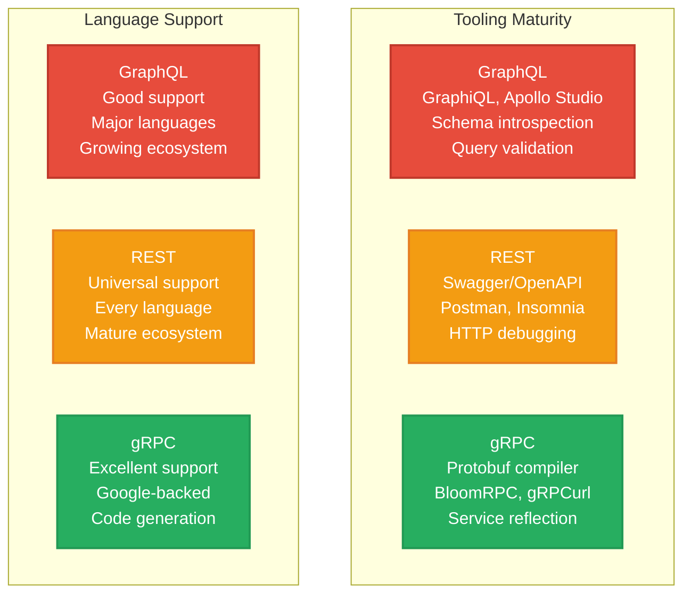
```mermaid
graph TB
    subgraph "Tooling Maturity"
        GQL_TOOLS[GraphQL<br/>GraphiQL, Apollo Studio<br/>Schema introspection<br/>Query validation]
        REST_TOOLS[REST<br/>Swagger/OpenAPI<br/>Postman, Insomnia<br/>HTTP debugging]
        GRPC_TOOLS[gRPC<br/>Protobuf compiler<br/>BloomRPC, gRPCurl<br/>Service reflection]
    end

    subgraph "Language Support"
        GQL_LANG[GraphQL<br/>Good support<br/>Major languages<br/>Growing ecosystem]
        REST_LANG[REST<br/>Universal support<br/>Every language<br/>Mature ecosystem]
        GRPC_LANG[gRPC<br/>Excellent support<br/>Google-backed<br/>Code generation]
    end

    classDef gqlStyle fill:#e74c3c,stroke:#c0392b,color:#fff,stroke-width:2px
    classDef restStyle fill:#f39c12,stroke:#e67e22,color:#fff,stroke-width:2px
    classDef grpcStyle fill:#27ae60,stroke:#229954,color:#fff,stroke-width:2px

    class GQL_TOOLS,GQL_LANG gqlStyle
    class REST_TOOLS,REST_LANG restStyle
    class GRPC_TOOLS,GRPC_LANG grpcStyle
```

## Decision Matrix - Choose Your API Style

### GraphQL: Choose When...

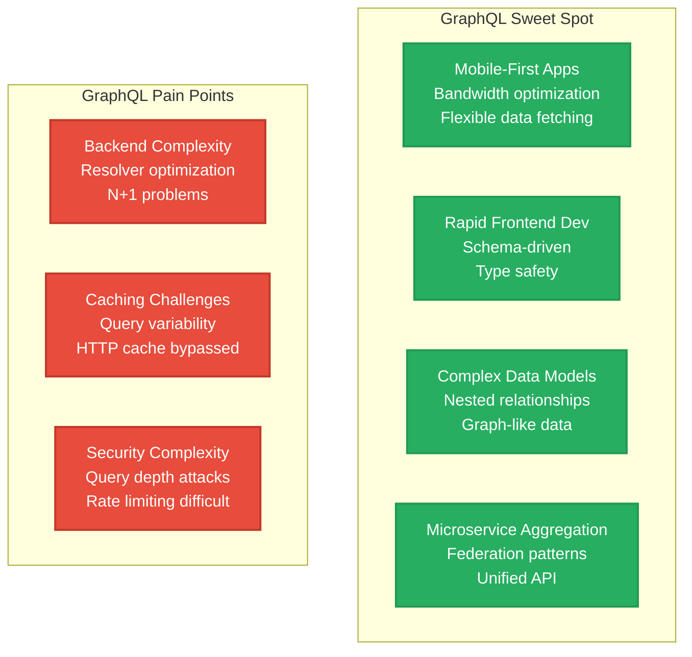
```mermaid
graph TB
    subgraph "GraphQL Sweet Spot"
        MOBILE_FIRST[Mobile-First Apps<br/>Bandwidth optimization<br/>Flexible data fetching]
        RAPID_FRONTEND[Rapid Frontend Dev<br/>Schema-driven<br/>Type safety]
        COMPLEX_DATA[Complex Data Models<br/>Nested relationships<br/>Graph-like data]
        MICROSERVICE_AGG[Microservice Aggregation<br/>Federation patterns<br/>Unified API]
    end

    subgraph "GraphQL Pain Points"
        COMPLEXITY_BACKEND[Backend Complexity<br/>Resolver optimization<br/>N+1 problems]
        CACHING_DIFFICULT[Caching Challenges<br/>Query variability<br/>HTTP cache bypassed]
        SECURITY[Security Complexity<br/>Query depth attacks<br/>Rate limiting difficult]
    end

    classDef sweetStyle fill:#27ae60,stroke:#229954,color:#fff,stroke-width:2px
    classDef painStyle fill:#e74c3c,stroke:#c0392b,color:#fff,stroke-width:2px

    class MOBILE_FIRST,RAPID_FRONTEND,COMPLEX_DATA,MICROSERVICE_AGG sweetStyle
    class COMPLEXITY_BACKEND,CACHING_DIFFICULT,SECURITY painStyle
```

### REST: Choose When...

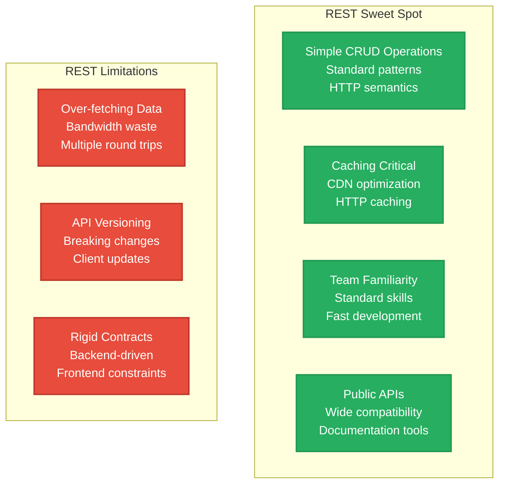
```mermaid
graph TB
    subgraph "REST Sweet Spot"
        SIMPLE_CRUD[Simple CRUD Operations<br/>Standard patterns<br/>HTTP semantics]
        CACHING_IMPORTANT[Caching Critical<br/>CDN optimization<br/>HTTP caching]
        TEAM_FAMILIAR[Team Familiarity<br/>Standard skills<br/>Fast development]
        PUBLIC_API[Public APIs<br/>Wide compatibility<br/>Documentation tools]
    end

    subgraph "REST Limitations"
        OVER_FETCHING[Over-fetching Data<br/>Bandwidth waste<br/>Multiple round trips]
        VERSIONING[API Versioning<br/>Breaking changes<br/>Client updates]
        RIGID_CONTRACTS[Rigid Contracts<br/>Backend-driven<br/>Frontend constraints]
    end

    classDef sweetStyle fill:#27ae60,stroke:#229954,color:#fff,stroke-width:2px
    classDef limitStyle fill:#e74c3c,stroke:#c0392b,color:#fff,stroke-width:2px

    class SIMPLE_CRUD,CACHING_IMPORTANT,TEAM_FAMILIAR,PUBLIC_API sweetStyle
    class OVER_FETCHING,VERSIONING,RIGID_CONTRACTS limitStyle
```

### gRPC: Choose When...

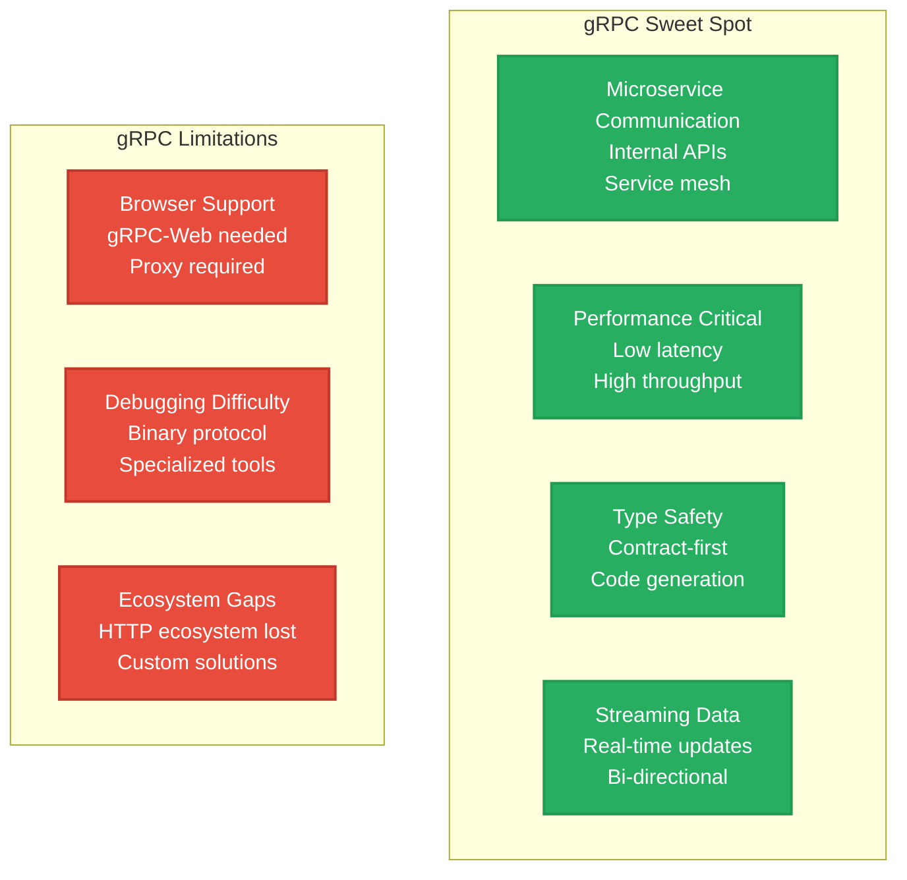
```mermaid
graph TB
    subgraph "gRPC Sweet Spot"
        MICROSERVICES[Microservice Communication<br/>Internal APIs<br/>Service mesh]
        PERFORMANCE[Performance Critical<br/>Low latency<br/>High throughput]
        TYPE_SAFETY[Type Safety<br/>Contract-first<br/>Code generation]
        STREAMING[Streaming Data<br/>Real-time updates<br/>Bi-directional]
    end

    subgraph "gRPC Limitations"
        BROWSER_SUPPORT[Browser Support<br/>gRPC-Web needed<br/>Proxy required]
        DEBUGGING[Debugging Difficulty<br/>Binary protocol<br/>Specialized tools]
        ECOSYSTEM[Ecosystem Gaps<br/>HTTP ecosystem lost<br/>Custom solutions]
    end

    classDef sweetStyle fill:#27ae60,stroke:#229954,color:#fff,stroke-width:2px
    classDef limitStyle fill:#e74c3c,stroke:#c0392b,color:#fff,stroke-width:2px

    class MICROSERVICES,PERFORMANCE,TYPE_SAFETY,STREAMING sweetStyle
    class BROWSER_SUPPORT,DEBUGGING,ECOSYSTEM limitStyle
```

## Final Recommendation Framework

| Use Case | GraphQL | REST | gRPC | Winner |
|----------|---------|------|------|---------|
| **Mobile applications** | ✅ Excellent | ⚠️ OK | ❌ Poor | **GraphQL** |
| **Public APIs** | ⚠️ Complex | ✅ Standard | ❌ Limited | **REST** |
| **Microservice communication** | ❌ Overkill | ⚠️ OK | ✅ Excellent | **gRPC** |
| **Real-time/streaming** | ⚠️ Subscriptions | ❌ Limited | ✅ Native | **gRPC** |
| **Simple CRUD apps** | ❌ Overkill | ✅ Perfect | ❌ Overkill | **REST** |
| **Performance critical** | ❌ Slow | ⚠️ OK | ✅ Fast | **gRPC** |
| **Team productivity** | ❌ Steep curve | ✅ Fast | ⚠️ Medium | **REST** |
| **Bandwidth optimization** | ✅ Excellent | ❌ Poor | ✅ Good | **GraphQL** |
| **Caching requirements** | ❌ Difficult | ✅ Easy | ⚠️ Custom | **REST** |
| **Type safety** | ✅ Schema | ❌ Manual | ✅ Protocol Buffers | **gRPC/GraphQL** |

## 3 AM Production Wisdom

**"When your API is down at 3 AM..."**

- **GraphQL**: Check query complexity first, then resolver performance, then database N+1
- **REST**: Check HTTP cache hit rates first, then database connections, then rate limits
- **gRPC**: Check protobuf compatibility first, then service discovery, then connection pooling

**"For your next API..."**

- **Choose GraphQL** if you're building mobile-first apps with complex data requirements
- **Choose REST** if you need simplicity, caching, or are building public APIs
- **Choose gRPC** if you're building high-performance microservices with type safety

**"Remember the performance implications..."**

- GraphQL: Optimizes network but can strain backend
- REST: Simple backend but wastes network
- gRPC: Optimizes both but adds complexity

*The best API architecture is the one your team can successfully implement, operate, and evolve at 3 AM while delivering the user experience your customers need.*

---

*Sources: GitHub Engineering Blog, Stripe Engineering, Uber Engineering, Apollo GraphQL metrics, Personal experience with all three approaches in production environments.*