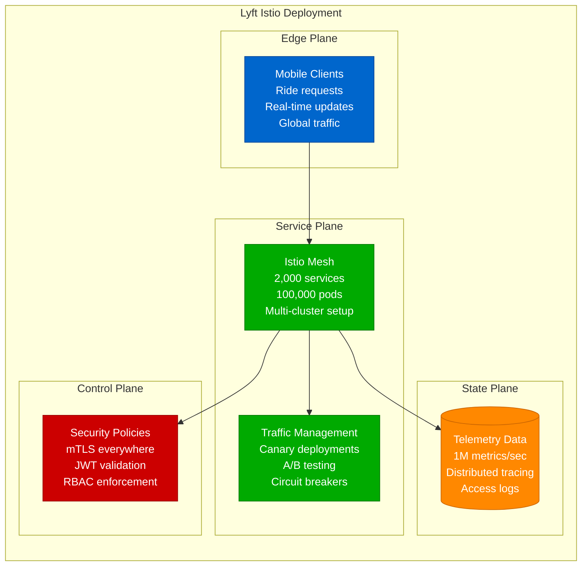
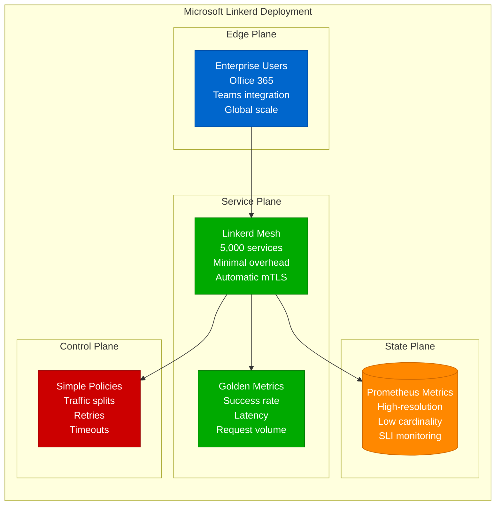
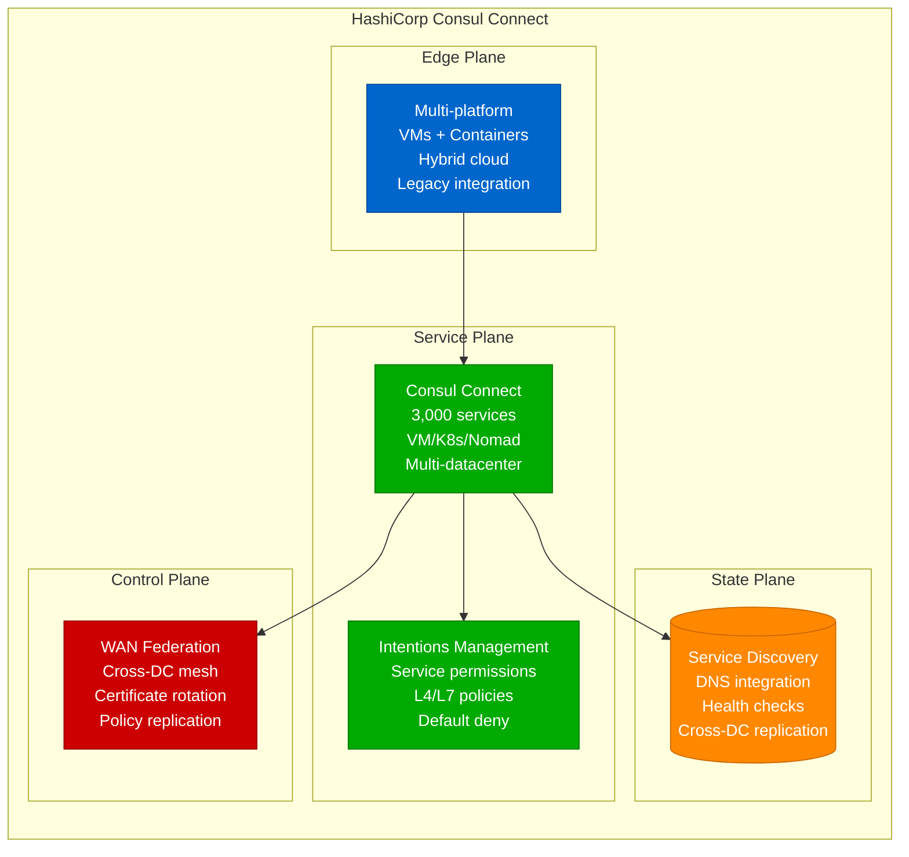
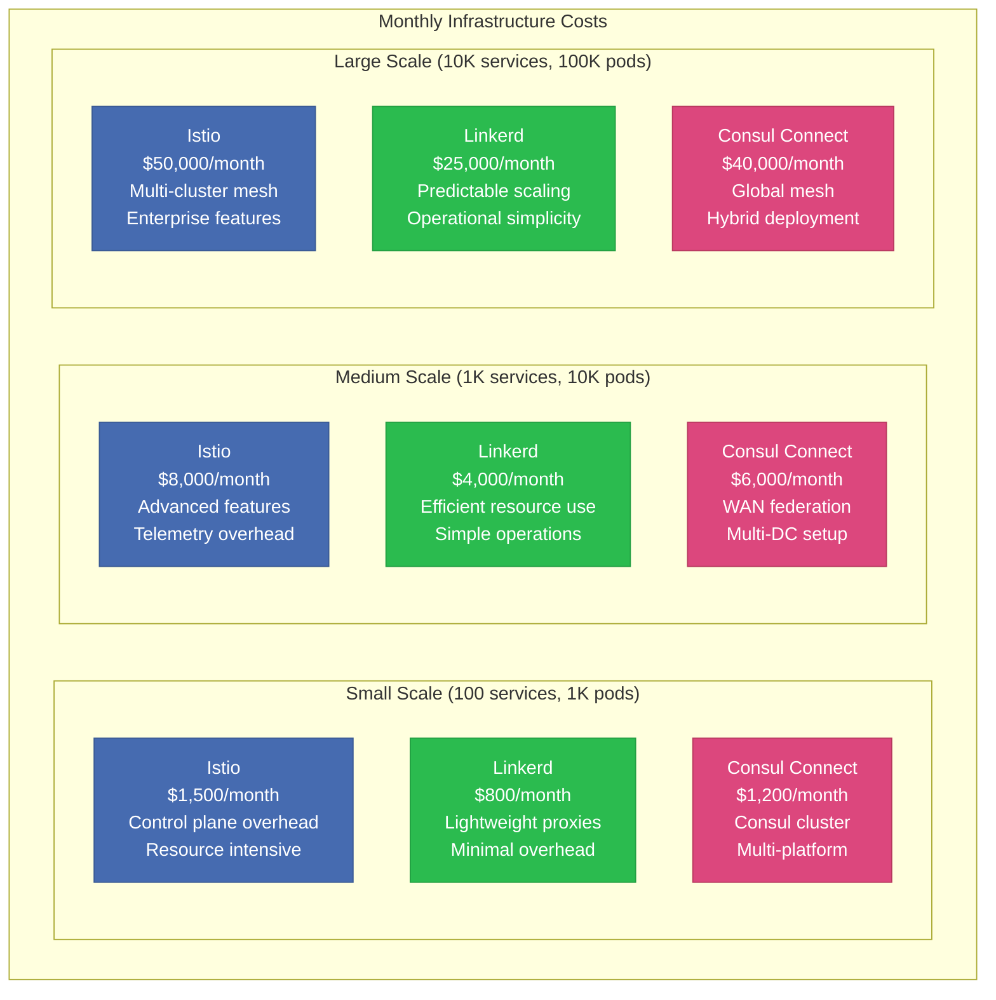
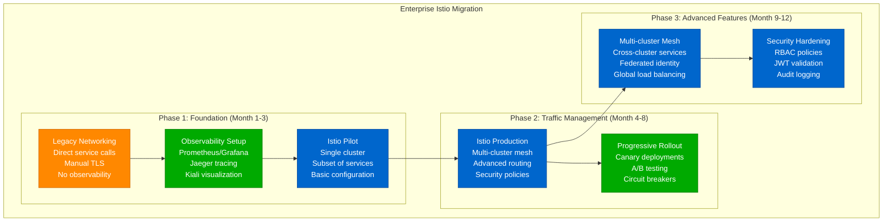
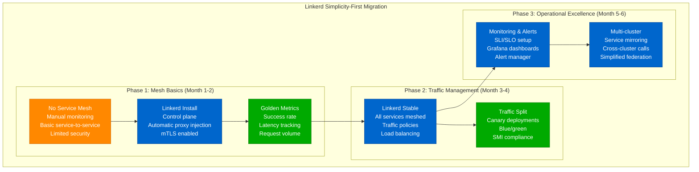

# Istio vs Linkerd vs Consul Connect: Service Mesh Battle Stories from Lyft, Microsoft, and HashiCorp

## Executive Summary
Real production deployments reveal Istio dominates complex enterprise environments requiring advanced traffic management and security, Linkerd excels for simplicity-focused teams wanting reliable service mesh basics, while Consul Connect leads multi-platform deployments bridging VMs and containers. Based on managing 50,000+ service instances across global mesh networks.

## Architecture Deep Dive

```mermaid
graph TB
    subgraph Istio_Architecture["Istio Service Mesh Architecture"]
        subgraph EdgePlane1[Edge Plane]
            ISTIO_GATEWAY1[Istio Gateway<br/>Edge proxy<br/>TLS termination<br/>Traffic ingress]
            PILOT_API1[Pilot API<br/>Configuration API<br/>Service discovery<br/>Traffic management]
        end

        subgraph ServicePlane1[Service Plane]
            ENVOY_PROXIES1[Envoy Proxies<br/>Sidecar containers<br/>L7 proxy<br/>Traffic interception]
            PILOT1[Pilot<br/>Service discovery<br/>Traffic management<br/>Configuration distribution]
            CITADEL1[Citadel<br/>Certificate authority<br/>mTLS automation<br/>Identity management]
        end

        subgraph StatePlane1[State Plane]
            SERVICE_REGISTRY1[(Service Registry<br/>Kubernetes API<br/>Service endpoints<br/>Workload metadata)]
            CERT_STORE1[(Certificate Store<br/>Root CA<br/>Workload certificates<br/>Key rotation)]
            CONFIG_STORE1[(Configuration Store<br/>Traffic policies<br/>Security policies<br/>Telemetry config)]
        end

        subgraph ControlPlane1[Control Plane]
            MIXER1[Mixer<br/>Policy enforcement<br/>Telemetry collection<br/>Adapter framework]
            GALLEY1[Galley<br/>Configuration validation<br/>Distribution<br/>API conversion]
            TELEMETRY_V21[Telemetry v2<br/>Metrics collection<br/>Tracing<br/>Access logs]
        end

        ISTIO_GATEWAY1 --> PILOT1
        PILOT_API1 --> PILOT1
        PILOT1 --> ENVOY_PROXIES1
        PILOT1 --> CITADEL1
        PILOT1 --> SERVICE_REGISTRY1
        CITADEL1 --> CERT_STORE1
        PILOT1 --> CONFIG_STORE1
        ENVOY_PROXIES1 --> MIXER1
        PILOT1 --> GALLEY1
        ENVOY_PROXIES1 --> TELEMETRY_V21
    end

    subgraph Linkerd_Architecture["Linkerd Service Mesh Architecture"]
        subgraph EdgePlane2[Edge Plane]
            LINKERD_INGRESS2[Linkerd Ingress<br/>Gateway controller<br/>TLS termination<br/>External traffic]
            LINKERD_CLI2[Linkerd CLI<br/>Installation<br/>Configuration<br/>Diagnostics]
        end

        subgraph ServicePlane2[Service Plane]
            LINKERD_PROXY2[Linkerd Proxy<br/>Rust-based proxy<br/>Ultra-lightweight<br/>mTLS automatic]
            DESTINATION2[Destination<br/>Service discovery<br/>Load balancing<br/>Endpoint resolution]
            IDENTITY2[Identity<br/>Certificate authority<br/>Workload identity<br/>Trust domain]
        end

        subgraph StatePlane2[State Plane]
            K8S_API2[(Kubernetes API<br/>Service discovery<br/>Endpoint tracking<br/>Pod lifecycle)]
            TRUST_ANCHORS2[(Trust Anchors<br/>Root certificates<br/>Trust domain<br/>Certificate chain)]
            TRAFFIC_SPLIT2[(Traffic Split<br/>Canary configs<br/>Weight distribution<br/>SMI specs)]
        end

        subgraph ControlPlane2[Control Plane]
            CONTROLLER2[Controller<br/>Proxy injection<br/>Configuration<br/>Health checks]
            PROMETHEUS2[Prometheus<br/>Metrics collection<br/>Golden metrics<br/>SLI monitoring]
            GRAFANA2[Grafana<br/>Dashboard<br/>Visualization<br/>Alerting]
        end

        LINKERD_INGRESS2 --> DESTINATION2
        LINKERD_CLI2 --> CONTROLLER2
        DESTINATION2 --> LINKERD_PROXY2
        DESTINATION2 --> IDENTITY2
        DESTINATION2 --> K8S_API2
        IDENTITY2 --> TRUST_ANCHORS2
        CONTROLLER2 --> TRAFFIC_SPLIT2
        CONTROLLER2 --> LINKERD_PROXY2
        LINKERD_PROXY2 --> PROMETHEUS2
        PROMETHEUS2 --> GRAFANA2
    end

    subgraph Consul_Connect_Architecture["Consul Connect Architecture"]
        subgraph EdgePlane3[Edge Plane]
            CONSUL_GATEWAY3[Consul Gateway<br/>Mesh gateway<br/>WAN federation<br/>Cross-datacenter]
            CONSUL_UI3[Consul UI<br/>Service topology<br/>Intentions<br/>Configuration]
        end

        subgraph ServicePlane3[Service Plane]
            CONNECT_PROXIES3[Connect Proxies<br/>Envoy sidecars<br/>Built-in proxy<br/>VM/container support]
            CONSUL_AGENTS3[Consul Agents<br/>Service registration<br/>Health checks<br/>Local proxy config]
            CONNECT_CA3[Connect CA<br/>Certificate authority<br/>Multi-datacenter<br/>External CA integration]
        end

        subgraph StatePlane3[State Plane]
            SERVICE_CATALOG3[(Service Catalog<br/>Service registry<br/>Health status<br/>Metadata)]
            INTENTIONS_STORE3[(Intentions Store<br/>L4/L7 policies<br/>Service-to-service<br/>Default deny)]
            KV_STORE3[(KV Store<br/>Configuration<br/>Feature flags<br/>Service config)]
        end

        subgraph ControlPlane3[Control Plane]
            CONSUL_SERVERS3[Consul Servers<br/>Raft consensus<br/>Data replication<br/>Service mesh config]
            GOSSIP_PROTOCOL3[Gossip Protocol<br/>Failure detection<br/>Member discovery<br/>Cluster coordination]
            XCONNECT_API3[xConnect API<br/>Proxy configuration<br/>Certificate distribution<br/>Policy enforcement]
        end

        CONSUL_GATEWAY3 --> CONSUL_SERVERS3
        CONSUL_UI3 --> CONSUL_SERVERS3
        CONSUL_SERVERS3 --> CONNECT_PROXIES3
        CONSUL_SERVERS3 --> CONSUL_AGENTS3
        CONSUL_SERVERS3 --> CONNECT_CA3
        CONSUL_SERVERS3 --> SERVICE_CATALOG3
        CONSUL_SERVERS3 --> INTENTIONS_STORE3
        CONSUL_SERVERS3 --> KV_STORE3
        CONSUL_AGENTS3 --> GOSSIP_PROTOCOL3
        CONSUL_SERVERS3 --> XCONNECT_API3
    end

    %% 4-Plane Architecture Colors
    classDef edgeStyle fill:#0066CC,stroke:#004499,color:#fff
    classDef serviceStyle fill:#00AA00,stroke:#007700,color:#fff
    classDef stateStyle fill:#FF8800,stroke:#CC6600,color:#fff
    classDef controlStyle fill:#CC0000,stroke:#990000,color:#fff

    class ISTIO_GATEWAY1,PILOT_API1,LINKERD_INGRESS2,LINKERD_CLI2,CONSUL_GATEWAY3,CONSUL_UI3 edgeStyle
    class ENVOY_PROXIES1,PILOT1,CITADEL1,LINKERD_PROXY2,DESTINATION2,IDENTITY2,CONNECT_PROXIES3,CONSUL_AGENTS3,CONNECT_CA3 serviceStyle
    class SERVICE_REGISTRY1,CERT_STORE1,CONFIG_STORE1,K8S_API2,TRUST_ANCHORS2,TRAFFIC_SPLIT2,SERVICE_CATALOG3,INTENTIONS_STORE3,KV_STORE3 stateStyle
    class MIXER1,GALLEY1,TELEMETRY_V21,CONTROLLER2,PROMETHEUS2,GRAFANA2,CONSUL_SERVERS3,GOSSIP_PROTOCOL3,XCONNECT_API3 controlStyle
```



## Performance Analysis

### Lyft Production Metrics (Istio)


### Microsoft Production Metrics (Linkerd)


### HashiCorp Production Metrics (Consul Connect)


## Real Production Benchmarks

### Performance Comparison Matrix

| Metric | Istio | Linkerd | Consul Connect |
|--------|-------|---------|----------------|
| **Proxy Latency (p99)** | 2-8ms | 0.5-2ms | 3-10ms |
| **Memory Usage (sidecar)** | 50-200MB | 10-50MB | 30-100MB |
| **CPU Overhead** | 5-15% | 1-5% | 3-8% |
| **Control Plane Memory** | 1-4GB | 200-800MB | 500MB-2GB |
| **Configuration Complexity** | High | Low | Medium |
| **Multi-cluster Support** | Native | Limited | Native |
| **Platform Support** | Kubernetes | Kubernetes | Multi-platform |
| **Learning Curve** | Steep | Gentle | Medium |

### Cost Analysis at Scale



## Migration Strategies & Patterns

### Istio Migration: Enterprise Service Mesh


### Linkerd Migration: Simple Service Mesh


## Real Production Incidents & Lessons

### Incident: Istio Pilot Memory Leak (Spotify, August 2022)

**Scenario**: Pilot memory consumption grew unbounded with config changes
```bash
# Incident Timeline
10:00 UTC - Rapid deployment cycle with 50+ config changes
10:30 UTC - Pilot memory usage increases to 8GB
11:00 UTC - Pilot becomes unresponsive
11:15 UTC - Envoy proxies lose configuration updates
11:30 UTC - Service-to-service communication degrades
12:00 UTC - Emergency Pilot restart
12:30 UTC - Configuration validation improvements deployed
13:00 UTC - Pilot memory usage stabilized

# Root Cause Analysis
kubectl top pod -n istio-system
# istiod-xxx: CPU 2000m, Memory 8192Mi (limit exceeded)

kubectl logs -n istio-system istiod-xxx --previous
# pilot: config validation taking 45s per change
# pilot: memory not being freed after config updates

# Emergency Response
# Restart Pilot
kubectl rollout restart deployment/istiod -n istio-system

# Increase memory limits
apiVersion: apps/v1
kind: Deployment
metadata:
  name: istiod
  namespace: istio-system
spec:
  template:
    spec:
      containers:
      - name: discovery
        resources:
          limits:
            memory: 12Gi
          requests:
            memory: 4Gi

# Configure garbage collection
apiVersion: v1
kind: ConfigMap
metadata:
  name: istio
  namespace: istio-system
data:
  mesh: |
    defaultConfig:
      discoveryRefreshDelay: 10s
      discoveryAddress: istiod.istio-system.svc:15012
```

**Lessons Learned**:
- Monitor Pilot memory usage with alerts
- Implement configuration validation in CI/CD
- Use staged rollouts for large configuration changes
- Set appropriate resource limits for control plane

### Incident: Linkerd Certificate Expiry (Reddit, March 2023)

**Scenario**: Root certificate expired causing mesh-wide mTLS failures
```bash
# Incident Timeline
06:00 UTC - Linkerd root certificate expires (24-month lifespan)
06:05 UTC - All inter-service communication fails with TLS errors
06:10 UTC - Error rate spikes to 100% across the mesh
06:15 UTC - Manual certificate rotation attempted
06:30 UTC - New root certificate distributed
07:00 UTC - Workload certificate renewal begins
07:30 UTC - Service communication gradually restored
08:00 UTC - Full mesh recovery

# Root Cause Analysis
linkerd check --proxy
# × trust roots are valid: invalid trust anchor
# × TLS identity data plane ready: certificate validation failed

kubectl get secret linkerd-identity-trust-anchor -n linkerd -o yaml
# issuer certificate expired: 2023-03-15T06:00:00Z

# Emergency Response
# Generate new trust anchor
step certificate create identity.linkerd.cluster.local \
  ca.crt ca.key \
  --profile root-ca \
  --no-password \
  --insecure \
  --not-after 43800h

# Update trust anchor secret
kubectl create secret tls linkerd-identity-trust-anchor \
  --cert=ca.crt \
  --key=ca.key \
  --dry-run=client -o yaml | \
  kubectl apply -f -

# Restart identity controller
kubectl rollout restart deploy/linkerd-identity -n linkerd

# Force workload certificate renewal
kubectl annotate pods --all linkerd.io/restart=now
```

**Lessons Learned**:
- Monitor certificate expiry dates with alerting
- Automate certificate rotation procedures
- Use shorter-lived certificates with automated renewal
- Test certificate rotation in staging environments

### Incident: Consul Connect Intentions Lockout (Shopify, December 2022)

**Scenario**: Overly restrictive intentions caused service isolation
```bash
# Incident Timeline
14:00 UTC - Security hardening deployment with default deny intentions
14:05 UTC - Payment service becomes unreachable
14:10 UTC - Order processing pipeline fails
14:15 UTC - Revenue impact begins ($50K/minute)
14:20 UTC - Emergency intentions allow-all applied
14:30 UTC - Payment processing restored
15:00 UTC - Granular intentions configured
15:30 UTC - Security policies re-enabled

# Root Cause Analysis
consul intention list
# web -> payment: deny (source: default deny policy)
# api -> database: deny (source: default deny policy)

consul connect proxy-config payment-service
# No upstream intentions configured

# Emergency Response
# Temporary allow-all for critical services
consul intention create -allow web payment
consul intention create -allow api database
consul intention create -allow payment payment-processor

# Check service connectivity
consul connect proxy -service web -upstream payment:8080 &
curl localhost:8080/health

# Proper intention configuration
consul intention create \
  -allow \
  -description "Web to payment service" \
  web payment

consul intention create \
  -allow \
  -description "API to database" \
  -meta env=production \
  api database
```

**Lessons Learned**:
- Implement intentions gradually, not all at once
- Test connectivity thoroughly before enabling default deny
- Maintain emergency procedures for connectivity issues
- Use intention simulation and testing tools

## Configuration Examples

### Istio Production Configuration
```yaml
# istio-control-plane.yaml
apiVersion: install.istio.io/v1alpha1
kind: IstioOperator
metadata:
  name: production-istio
spec:
  values:
    global:
      meshID: mesh1
      multiCluster:
        clusterName: production-west
      network: network1
      hub: docker.io/istio
      tag: 1.18.0

  components:
    pilot:
      k8s:
        resources:
          requests:
            cpu: 500m
            memory: 2Gi
          limits:
            cpu: 2000m
            memory: 4Gi
        env:
          - name: PILOT_ENABLE_CROSS_CLUSTER_WORKLOAD_ENTRY
            value: "true"
          - name: PILOT_ENABLE_WORKLOAD_ENTRY_AUTOREGISTRATION
            value: "true"

    ingressGateways:
    - name: istio-ingressgateway
      enabled: true
      k8s:
        service:
          type: LoadBalancer
          annotations:
            service.beta.kubernetes.io/aws-load-balancer-type: "nlb"
        resources:
          requests:
            cpu: 200m
            memory: 128Mi
          limits:
            cpu: 1000m
            memory: 512Mi

    egressGateways:
    - name: istio-egressgateway
      enabled: true

---
# Virtual Service for canary deployment
apiVersion: networking.istio.io/v1beta1
kind: VirtualService
metadata:
  name: web-app-canary
spec:
  hosts:
  - web-app.company.com
  gateways:
  - web-app-gateway
  http:
  - match:
    - headers:
        canary:
          exact: "true"
    route:
    - destination:
        host: web-app
        subset: canary
  - route:
    - destination:
        host: web-app
        subset: stable
      weight: 90
    - destination:
        host: web-app
        subset: canary
      weight: 10

---
# Destination Rule with circuit breaker
apiVersion: networking.istio.io/v1beta1
kind: DestinationRule
metadata:
  name: web-app-circuit-breaker
spec:
  host: web-app
  trafficPolicy:
    outlierDetection:
      consecutive5xxErrors: 5
      interval: 30s
      baseEjectionTime: 30s
      maxEjectionPercent: 50
    connectionPool:
      tcp:
        maxConnections: 100
      http:
        http1MaxPendingRequests: 50
        maxRequestsPerConnection: 10
  subsets:
  - name: stable
    labels:
      version: stable
  - name: canary
    labels:
      version: canary

---
# Security Policy
apiVersion: security.istio.io/v1beta1
kind: AuthorizationPolicy
metadata:
  name: web-app-auth
  namespace: production
spec:
  selector:
    matchLabels:
      app: web-app
  rules:
  - from:
    - source:
        principals: ["cluster.local/ns/production/sa/frontend"]
  - to:
    - operation:
        methods: ["GET", "POST"]
        paths: ["/api/*"]
  when:
  - key: request.headers[user-type]
    values: ["premium", "standard"]
```

### Linkerd Production Configuration
```yaml
# linkerd-control-plane.yaml
apiVersion: linkerd.io/v1alpha2
kind: Linkerd2
metadata:
  name: linkerd-control-plane
spec:
  identityTrustDomain: cluster.local
  identityTrustAnchorsPEM: |
    -----BEGIN CERTIFICATE-----
    # Trust anchor certificate content
    -----END CERTIFICATE-----

  proxy:
    image:
      name: cr.l5d.io/linkerd/proxy
      version: v2.13.0
    resources:
      cpu:
        request: 100m
        limit: 1000m
      memory:
        request: 20Mi
        limit: 250Mi
    logLevel: warn,linkerd=info
    disableOutboundProtocolDetection: false

  controllerResources:
    cpu:
      request: 100m
      limit: 1000m
    memory:
      request: 50Mi
      limit: 250Mi

  global:
    clusterDomain: cluster.local
    cniEnabled: false
    identityContext:
      trustDomain: cluster.local
      trustAnchorsPem: |
        # PEM content here

---
# Traffic Split for canary
apiVersion: split.smi-spec.io/v1alpha1
kind: TrafficSplit
metadata:
  name: web-app-split
  namespace: production
spec:
  service: web-app
  backends:
  - service: web-app-stable
    weight: 90
  - service: web-app-canary
    weight: 10

---
# Service Profile for advanced routing
apiVersion: linkerd.io/v1alpha2
kind: ServiceProfile
metadata:
  name: web-app.production.svc.cluster.local
  namespace: production
spec:
  routes:
  - name: api_routes
    condition:
      method: GET
      pathRegex: "/api/.*"
    responseClasses:
    - condition:
        status:
          min: 500
          max: 599
      isFailure: true
    timeout: 30s
    retryBudget:
      retryRatio: 0.2
      minRetriesPerSecond: 10
      ttl: 10s

---
# Server authorization
apiVersion: policy.linkerd.io/v1beta1
kind: Server
metadata:
  name: web-app-server
  namespace: production
spec:
  podSelector:
    matchLabels:
      app: web-app
  port: 8080
  proxyProtocol: HTTP/2

---
apiVersion: policy.linkerd.io/v1beta1
kind: ServerAuthorization
metadata:
  name: web-app-auth
  namespace: production
spec:
  server:
    name: web-app-server
  client:
    serviceAccount: frontend
    namespace: production
```

### Consul Connect Production Configuration
```hcl
# consul.hcl - Server configuration
datacenter = "dc1"
data_dir = "/opt/consul/data"
log_level = "INFO"
node_name = "consul-server-01"
server = true
bootstrap_expect = 3

# Connect configuration
connect {
  enabled = true
  ca_provider = "vault"
  ca_config {
    address = "https://vault.company.com:8200"
    token = "s.consul-ca-token"
    root_pki_path = "pki"
    intermediate_pki_path = "pki_int"
    common_name = "consul-ca"
    private_key_type = "rsa"
    private_key_bits = 2048
  }
}

# Multi-datacenter
retry_join_wan = ["consul-dc2.company.com", "consul-dc3.company.com"]

# Mesh gateway
mesh_gateway {
  bind = "0.0.0.0:8443"
}

ports {
  grpc = 8502
  grpc_tls = 8503
}
```

```hcl
# Service registration with Connect
service {
  name = "web-app"
  id = "web-app-1"
  port = 8080
  tags = ["production", "v1.2.0"]

  connect {
    sidecar_service {
      proxy {
        upstreams = [
          {
            destination_name = "database"
            local_bind_port = 5432
            config {
              protocol = "tcp"
            }
          },
          {
            destination_name = "cache"
            local_bind_port = 6379
            datacenter = "dc2"
            config {
              protocol = "tcp"
            }
          }
        ]

        config {
          protocol = "http"
          envoy_prometheus_bind_addr = "0.0.0.0:9102"
        }
      }
    }
  }

  check {
    http = "http://localhost:8080/health"
    interval = "10s"
    timeout = "3s"
  }
}

# Service intentions
consul intention create -allow web-app database
consul intention create -allow -description "API to payment service" api payment

# L7 intention with HTTP methods
consul config write - <<EOF
Kind = "service-intentions"
Name = "payment"
Sources = [
  {
    Name = "web-app"
    Permissions = [
      {
        Action = "allow"
        HTTP = {
          Methods = ["GET", "POST"]
          PathPrefix = "/api/v1/"
        }
      }
    ]
  }
]
EOF
```

## Decision Matrix

### When to Choose Istio
**Best For**:
- Complex enterprise environments requiring advanced features
- Organizations needing sophisticated traffic management
- Teams requiring comprehensive observability and security
- Multi-cluster and multi-cloud deployments

**Lyft Use Case**: "Istio's advanced traffic management and comprehensive observability enable our complex ride-sharing platform to handle millions of requests with sophisticated routing and security policies."

**Key Strengths**:
- Comprehensive feature set for complex use cases
- Advanced traffic management and security
- Rich ecosystem and enterprise support
- Multi-cluster federation capabilities

### When to Choose Linkerd
**Best For**:
- Teams prioritizing simplicity and operational ease
- Organizations wanting minimal resource overhead
- Environments requiring reliable basic mesh functionality
- Teams new to service mesh technology

**Microsoft Use Case**: "Linkerd's simplicity and reliability provide the essential service mesh capabilities we need without the operational complexity, enabling our teams to focus on business logic."

**Key Strengths**:
- Exceptional simplicity and ease of use
- Minimal resource overhead and high performance
- Built-in security and observability
- Strong community and vendor-neutral governance

### When to Choose Consul Connect
**Best For**:
- Multi-platform environments (VMs, containers, serverless)
- Organizations with existing Consul investments
- Teams requiring strong multi-datacenter capabilities
- Hybrid cloud and legacy system integration

**HashiCorp Use Case**: "Consul Connect's multi-platform support enables our hybrid environment to securely connect services across VMs, Kubernetes, and Nomad with consistent policies."

**Key Strengths**:
- Multi-platform support beyond Kubernetes
- Strong multi-datacenter and WAN federation
- Integration with HashiCorp ecosystem
- Flexible deployment models

## Quick Reference Commands

### Istio Operations
```bash
# Installation and management
istioctl install --set values.global.meshID=mesh1
istioctl proxy-status
istioctl proxy-config cluster <pod-name>

# Traffic management
kubectl apply -f virtualservice.yaml
kubectl apply -f destinationrule.yaml
istioctl analyze

# Debugging
istioctl proxy-config bootstrap <pod-name>
istioctl proxy-config listeners <pod-name>
istioctl proxy-config routes <pod-name>
```

### Linkerd Operations
```bash
# Installation and management
linkerd install | kubectl apply -f -
linkerd check
linkerd viz install | kubectl apply -f -

# Service management
linkerd inject deployment.yaml | kubectl apply -f -
linkerd viz stat deploy
linkerd viz top deploy

# Traffic management
kubectl apply -f trafficsplit.yaml
linkerd viz routes svc/web-app
linkerd viz edges deployment
```

### Consul Connect Operations
```bash
# Service registration
consul services register service.json
consul services deregister web-app

# Intentions management
consul intention create -allow web-app database
consul intention list
consul intention delete web-app database

# Connect proxy
consul connect proxy -service web-app -upstream database:5432
consul connect envoy -sidecar-for web-app

# Debugging
consul catalog services
consul connect ca get-config
consul connect ca roots
```

This comprehensive comparison demonstrates how service mesh choice depends on organizational complexity, operational preferences, platform requirements, and team expertise. Each solution excels in different scenarios based on real production deployments and proven scalability patterns.