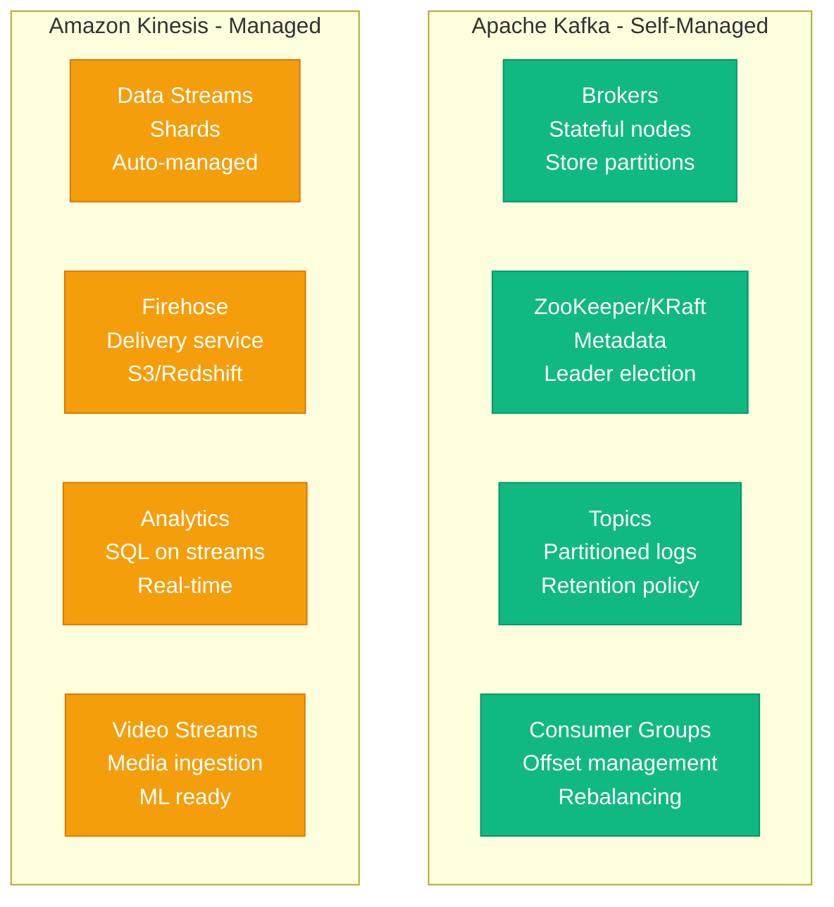
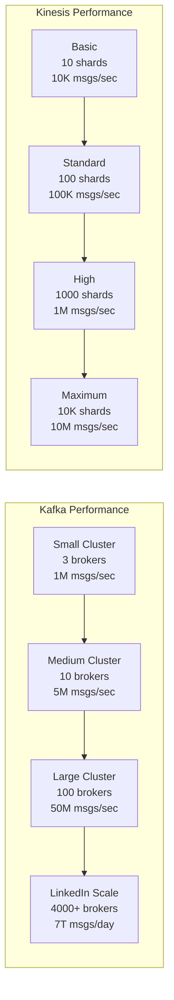
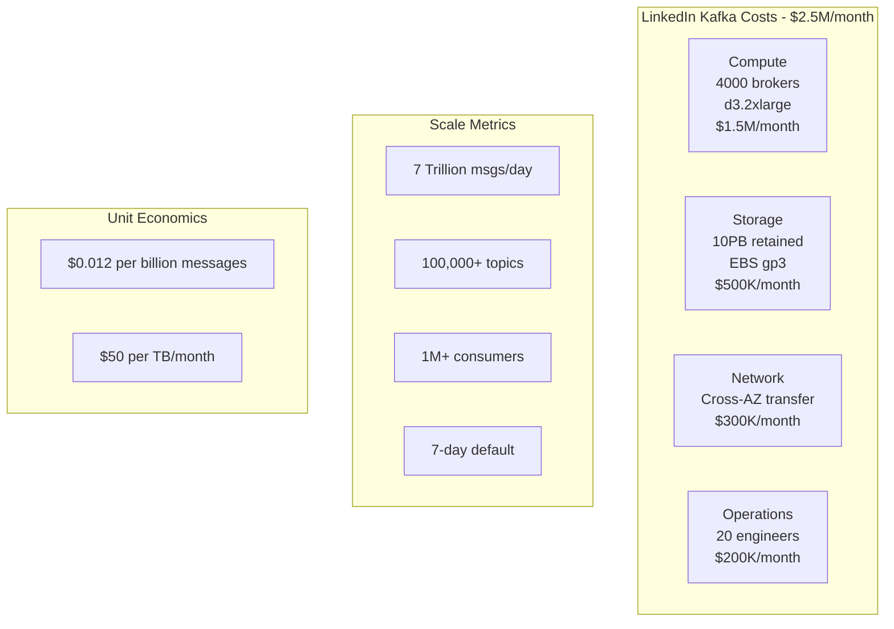
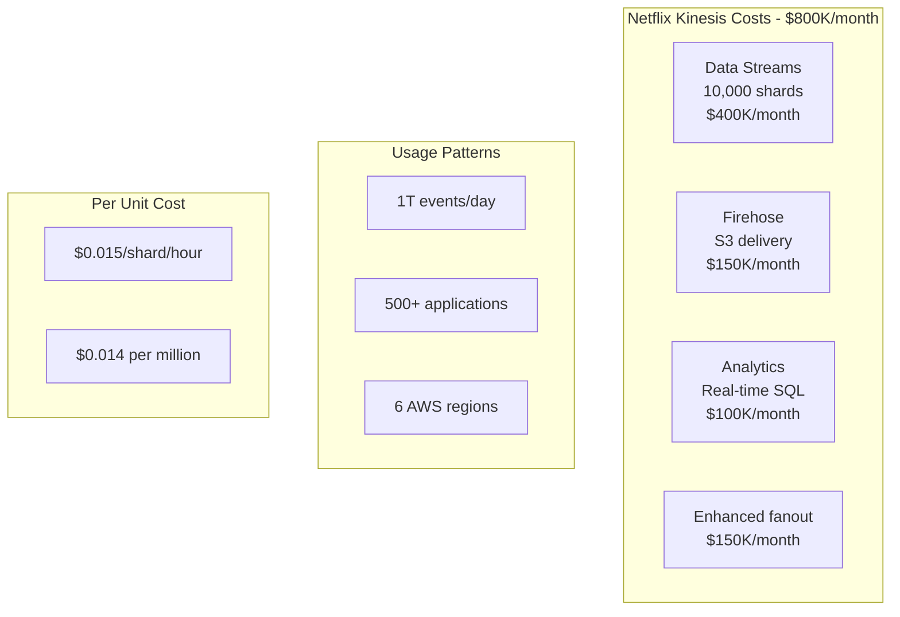
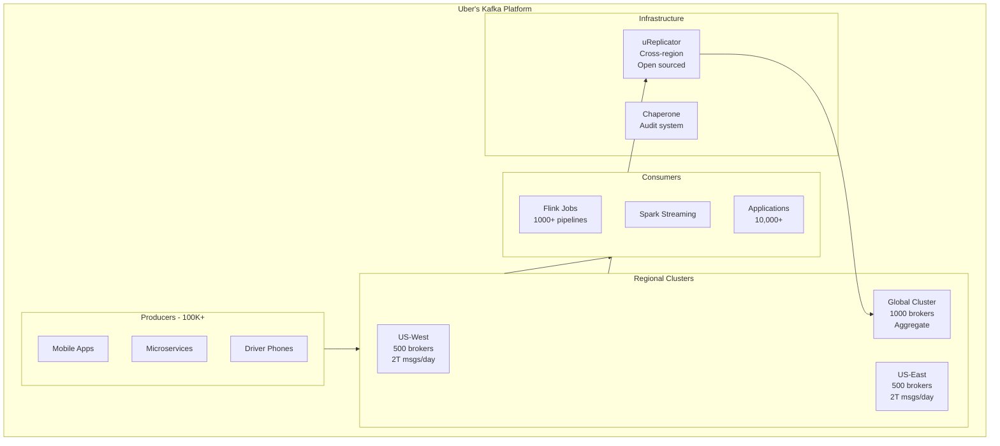
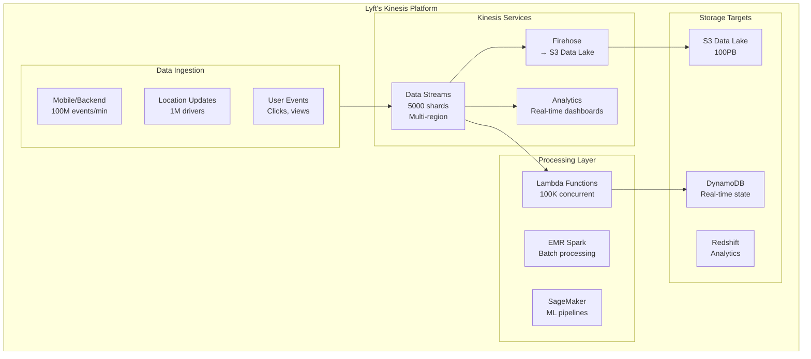
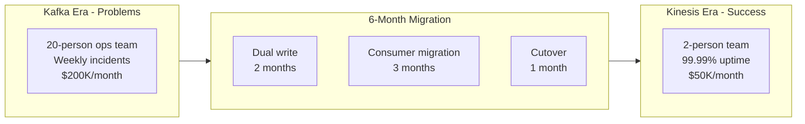
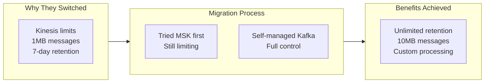

# Kafka vs Kinesis: The Production Reality

## Real-World Trade-offs from LinkedIn, Uber, Netflix, and Airbnb

The choice between Apache Kafka and Amazon Kinesis shapes real-time data architectures. Here's what production deployments reveal about costs, operations, and scale.

## The Fundamental Architecture Difference



## Performance Comparison

### Throughput Benchmarks



**Real Production Numbers**:
| Company | System | Peak Throughput | Latency (p99) | Infrastructure |
|---------|--------|----------------|---------------|----------------|
| **LinkedIn** | Kafka | 7T msgs/day | 10ms | 4000+ brokers |
| **Uber** | Kafka | 4T msgs/day | 15ms | 2000+ brokers |
| **Netflix** | Kafka+Kinesis | 8T events/day | 20ms | Hybrid |
| **Airbnb** | Kafka | 1T msgs/day | 12ms | 800 brokers |
| **Lyft** | Kinesis | 500B msgs/day | 25ms | 5000 shards |
| **Robinhood** | Kafka | 100B msgs/day | 8ms | 200 brokers |

## Cost Analysis: Real Examples

### LinkedIn's Kafka Infrastructure



### Netflix's Kinesis Usage



### Cost Comparison Table

| Aspect | Kafka (Self-Managed) | Kinesis (Managed) | MSK (Managed Kafka) |
|--------|---------------------|-------------------|---------------------|
| **Small (1M msgs/hour)** | $2,000/month | $500/month | $1,500/month |
| **Medium (100M msgs/hour)** | $15,000/month | $5,000/month | $12,000/month |
| **Large (10B msgs/hour)** | $100,000/month | $50,000/month | $80,000/month |
| **Mega (1T msgs/hour)** | $500,000/month | $400,000/month | $450,000/month |
| **Operations Team** | Required (2-20 people) | Not required | Minimal (1-2) |
| **Hidden Costs** | High (incidents, upgrades) | Low | Medium |

## Feature Comparison

### Core Capabilities

| Feature | Kafka | Kinesis | Winner |
|---------|-------|---------|--------|
| **Max Throughput** | Unlimited* | 10M records/sec | Kafka |
| **Max Message Size** | 1MB default (configurable) | 1MB (hard limit) | Kafka |
| **Retention Period** | Unlimited | 7 days (365 with extra cost) | Kafka |
| **Ordering Guarantee** | Per partition | Per shard | Tie |
| **Exactly Once** | Yes (transactions) | No | Kafka |
| **Stream Processing** | Kafka Streams | Kinesis Analytics | Kafka |
| **Auto Scaling** | No (manual) | Yes | Kinesis |
| **Multi-Region** | MirrorMaker 2 | Native | Kinesis |
| **Schema Registry** | Yes (Confluent) | No (use Glue) | Kafka |
| **Time Travel** | Log compaction | No | Kafka |

### Operational Characteristics

| Aspect | Kafka | Kinesis |
|--------|-------|---------|
| **Setup Time** | Days to weeks | Minutes |
| **Maintenance** | High (upgrades, rebalancing) | Zero |
| **Monitoring** | Complex (JMX, custom) | CloudWatch built-in |
| **Security** | DIY (SSL, SASL, ACLs) | IAM integrated |
| **Disaster Recovery** | Manual (MirrorMaker) | Automatic |
| **Scaling** | Manual broker addition | API call |
| **Multi-Tenancy** | Complex (quotas) | Native (IAM) |
| **Backpressure** | Consumer lag | Automatic throttling |

## Real Production Architectures

### Uber's Kafka Architecture



**Why Uber Chose Kafka**:
- Need for infinite retention
- Exactly-once semantics critical
- Custom stream processing (Flink)
- Full control over infrastructure
- Open source contributions back

### Lyft's Kinesis Architecture



**Why Lyft Chose Kinesis**:
- No operations team needed
- Native AWS integration
- Auto-scaling for peak hours
- Pay-per-use model
- Faster time to market

## Migration Stories

### Segment: Kafka → Kinesis (2018)



**Results**:
- 75% cost reduction
- 90% fewer incidents
- 10x reduction in ops team
- Focus on product, not infrastructure

### Pinterest: Kinesis → Kafka (2019)



**Results**:
- Unlimited retention for ML training
- Larger message support for images
- 50% cost increase but worth it
- 5-person Kafka team created

## Decision Framework

### When to Choose Kafka

✅ **Choose Kafka When You Have**:
1. **Scale Requirements**: > 1M messages/second
2. **Retention Needs**: > 7 days or infinite
3. **Complex Processing**: Kafka Streams, KSQL
4. **Exactly Once**: Financial transactions
5. **Large Messages**: > 1MB payloads
6. **Existing Expertise**: Team knows Kafka
7. **Open Source Requirement**: Avoid vendor lock-in

**Examples**: LinkedIn, Uber, Airbnb, Twitter, PayPal

### When to Choose Kinesis

✅ **Choose Kinesis When You Have**:
1. **AWS Native**: Already on AWS
2. **No Ops Team**: Managed service needed
3. **Variable Load**: Auto-scaling required
4. **Fast Start**: Need solution quickly
5. **Integration**: Lambda, S3, Redshift
6. **Cost Sensitive**: Pay-per-use model
7. **Compliance**: AWS compliance certs

**Examples**: Lyft, Zillow, Nextdoor, Roku

### When to Use Both

✅ **Hybrid Architecture When**:
1. Different use cases (Kafka for core, Kinesis for analytics)
2. Multi-cloud strategy
3. Migration path between them
4. Regional differences
5. Team preferences vary

**Example**: Netflix uses both
- Kafka: Core event streaming (7T events/day)
- Kinesis: AWS service integration (1T events/day)

## Performance Tuning

### Kafka Optimization

```yaml
# Producer configuration for throughput
producer_config:
  batch.size: 32768                    # 32KB batches
  linger.ms: 10                        # Wait 10ms for batching
  compression.type: lz4                 # Fast compression
  acks: 1                              # Leader acknowledgment
  buffer.memory: 67108864              # 64MB buffer
  max.in.flight.requests.per.connection: 5

# Broker configuration for performance
broker_config:
  num.network.threads: 16
  num.io.threads: 32
  socket.send.buffer.bytes: 1048576    # 1MB
  socket.receive.buffer.bytes: 1048576
  socket.request.max.bytes: 104857600  # 100MB
  num.replica.fetchers: 8
  replica.fetch.max.bytes: 10485760    # 10MB

# Consumer configuration
consumer_config:
  fetch.min.bytes: 10000               # 10KB minimum
  fetch.max.wait.ms: 500               # 500ms max wait
  max.partition.fetch.bytes: 10485760  # 10MB per partition
  session.timeout.ms: 30000
  max.poll.records: 500
```

### Kinesis Optimization

```python
# Kinesis producer optimization
import boto3
from concurrent.futures import ThreadPoolExecutor
import hashlib

class OptimizedKinesisProducer:
    def __init__(self, stream_name, region='us-east-1'):
        self.client = boto3.client('kinesis', region_name=region)
        self.stream_name = stream_name
        self.executor = ThreadPoolExecutor(max_workers=50)

    def put_records_batch(self, records):
        # Batch up to 500 records (Kinesis limit)
        batches = [records[i:i+500] for i in range(0, len(records), 500)]

        futures = []
        for batch in batches:
            kinesis_records = []
            for record in batch:
                # Distribute across shards
                partition_key = hashlib.md5(
                    record['key'].encode()
                ).hexdigest()

                kinesis_records.append({
                    'Data': record['data'],
                    'PartitionKey': partition_key
                })

            # Async put
            future = self.executor.submit(
                self.client.put_records,
                Records=kinesis_records,
                StreamName=self.stream_name
            )
            futures.append(future)

        # Wait for all
        return [f.result() for f in futures]

# Enhanced fan-out consumer
class EnhancedConsumer:
    def __init__(self, stream_arn):
        self.client = boto3.client('kinesis')
        self.stream_arn = stream_arn

    def subscribe(self, consumer_name):
        # Register for enhanced fan-out (dedicated throughput)
        response = self.client.register_stream_consumer(
            StreamARN=self.stream_arn,
            ConsumerName=consumer_name
        )
        return response['Consumer']['ConsumerARN']

    def consume(self, consumer_arn):
        # Subscribe to shard with 2MB/sec dedicated throughput
        response = self.client.subscribe_to_shard(
            ConsumerARN=consumer_arn,
            ShardId='shardId-000000000000',
            StartingPosition={'Type': 'LATEST'}
        )

        for event in response['EventStream']:
            if 'Records' in event:
                yield event['Records']
```

## Operational Considerations

### Kafka Operations Checklist

```markdown
Daily:
- [ ] Monitor consumer lag
- [ ] Check broker disk usage
- [ ] Review error rates
- [ ] Verify replication status

Weekly:
- [ ] Rebalance partitions if needed
- [ ] Review topic configurations
- [ ] Clean up unused topics
- [ ] Update monitoring dashboards

Monthly:
- [ ] Capacity planning review
- [ ] Security audit (ACLs)
- [ ] Backup verification
- [ ] Performance tuning

Quarterly:
- [ ] Kafka version upgrade
- [ ] Disaster recovery test
- [ ] Cost optimization review
- [ ] Training for team
```

### Kinesis Operations (Mostly Automated)

```markdown
Setup Once:
- [ ] Configure auto-scaling policies
- [ ] Set up CloudWatch alarms
- [ ] Enable enhanced monitoring
- [ ] Configure Firehose delivery

Monitor:
- [ ] Shard-level metrics
- [ ] Iterator age (consumer lag)
- [ ] Throttling errors
- [ ] Cost tracking
```

## Cost Optimization Strategies

### Kafka Cost Reduction

1. **Use Spot Instances**: 70% savings for non-critical brokers
2. **Tiered Storage**: S3 for old segments (Confluent)
3. **Compression**: LZ4 reduces storage 4x
4. **Partition Right**: Avoid over-partitioning
5. **Retention Tuning**: Delete unneeded data

### Kinesis Cost Reduction

1. **Shard Consolidation**: Merge underutilized shards
2. **Reserved Capacity**: 25% discount
3. **Compression**: Gzip before putting
4. **Aggregation**: Combine small records
5. **Firehose Batching**: Reduce PUT costs

## The Verdict: Production Reality

### Use Kafka When:
- Scale is massive (> 1B messages/day)
- Need infinite retention
- Require exactly-once semantics
- Have dedicated ops team
- Need open source/multi-cloud

### Use Kinesis When:
- On AWS ecosystem
- No ops team available
- Need auto-scaling
- Want fastest setup
- Cost predictability important

### Use MSK When:
- Want Kafka on AWS
- Need managed service
- Can accept some limitations
- Want middle ground

## Key Metrics Comparison

| Metric | Kafka | Kinesis | MSK |
|--------|-------|---------|-----|
| **Setup Time** | 1-2 weeks | 10 minutes | 30 minutes |
| **Max Throughput** | 50M+ msg/sec | 10M msg/sec | 30M msg/sec |
| **Latency p99** | 5-10ms | 20-50ms | 10-20ms |
| **Retention** | Unlimited | 365 days max | Unlimited |
| **Message Size** | 1MB+ configurable | 1MB fixed | 1MB+ configurable |
| **Cost at 1B msg/day** | $50K/month | $30K/month | $40K/month |
| **Ops Team Needed** | 2-20 people | 0-1 people | 1-2 people |
| **Open Source** | Yes | No | Yes (Kafka) |

## References

- "Kafka at LinkedIn Scale" - LinkedIn Engineering 2024
- "Choosing Between Kafka and Kinesis" - Uber Engineering
- "Why We Switched from Kafka to Kinesis" - Segment Blog
- "Kinesis at Scale" - AWS re:Invent 2023
- "Running Kafka at Scale" - Confluent Summit 2024

---

*Last Updated: September 2024*
*Based on production data from named companies*