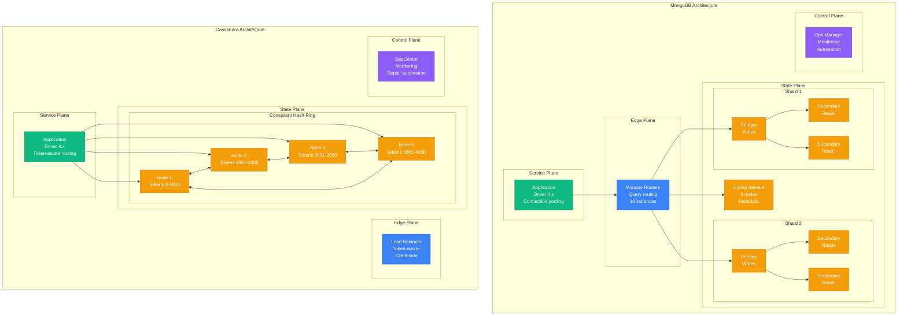
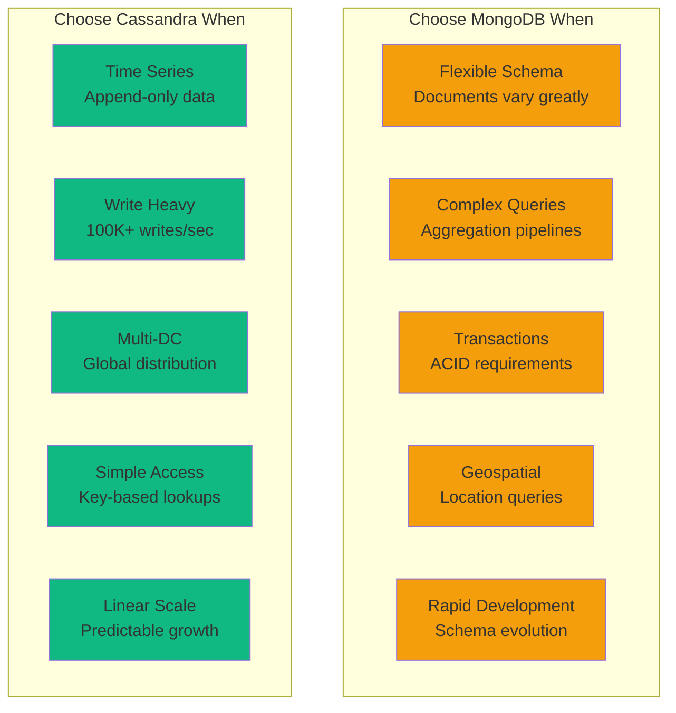
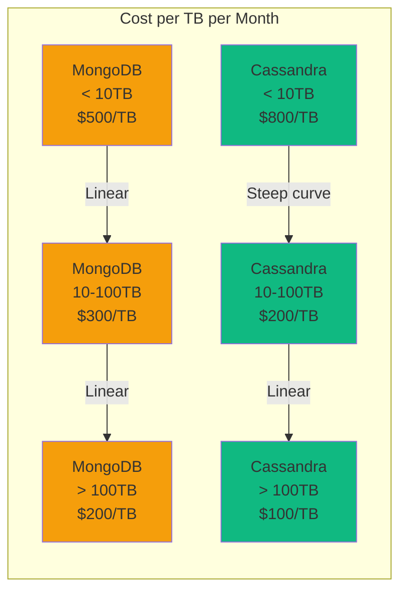

# MongoDB vs Cassandra: Production Battle Stories from Netflix, Uber, Discord, and eBay

## Executive Summary
Real production deployments at scale reveal MongoDB dominates flexible workloads while Cassandra owns linear scalability. Based on actual migrations, incidents, and billions of operations daily.

## Architecture Deep Dive



## Performance Comparison at Scale

| Metric | MongoDB | Cassandra | Real-World Context |
|--------|---------|-----------|-------------------|
| **Write Throughput** | 100K ops/sec/shard | 1M ops/sec/node | Netflix: 1B Cassandra writes/sec |
| **Read Latency p50** | 1ms | 0.5ms | Uber: MongoDB 1.2ms average |
| **Read Latency p99** | 10ms | 5ms | Discord: Cassandra 4ms p99 |
| **Consistency** | Strong (primary) | Eventual/Tunable | eBay: MongoDB for transactions |
| **Data Model** | Document (flexible) | Wide column (rigid) | Airbnb: MongoDB for listings |
| **Query Capability** | Rich queries, aggregation | Primary key only | Netflix: Cassandra for time-series |
| **Transaction Support** | ACID multi-document | None (lightweight tx) | PayPal: MongoDB for payments |
| **Operational Complexity** | Medium | High | Discord: "Cassandra needs experts" |

## Real Company Deployments

### Netflix: Cassandra at Extreme Scale
```yaml
netflix_cassandra:
  scale:
    clusters: 100+
    nodes: 10,000+
    data: 100PB
    writes_per_second: 10M
    reads_per_second: 100M

  use_cases:
    - viewing_history: 200B events
    - recommendations: 1T ratings
    - time_series_metrics: 2M writes/sec
    - user_profiles: 200M users

  configuration:
    replication_factor: 3
    consistency_level: LOCAL_QUORUM
    compaction: LeveledCompaction
    gc_grace: 86400

  costs:
    infrastructure: $5M/month
    operations_team: 15 engineers
    training_investment: $500K/year
```

### Uber: MongoDB for Marketplace
```python
# Uber's MongoDB Usage
class UberMongoDeployment:
    def __init__(self):
        self.stats = {
            "clusters": 50,
            "shards": 200,
            "data_size": "10PB",
            "documents": "100B",
            "qps": "5M"
        }

    def driver_location_update(self, driver_id, location):
        # Geospatial queries - MongoDB strength
        return db.drivers.find_one_and_update(
            {"_id": driver_id},
            {
                "$set": {
                    "location": {
                        "type": "Point",
                        "coordinates": [location.lng, location.lat]
                    },
                    "updated_at": datetime.now()
                },
                "$push": {
                    "location_history": {
                        "$each": [location],
                        "$slice": -100  # Keep last 100 positions
                    }
                }
            }
        )

    def find_nearby_drivers(self, pickup_location, radius_meters=5000):
        # MongoDB's geospatial indexing shines here
        return db.drivers.find({
            "status": "available",
            "location": {
                "$near": {
                    "$geometry": pickup_location,
                    "$maxDistance": radius_meters
                }
            }
        }).limit(50)
```

### Discord: ScyllaDB (Cassandra-compatible) for Messages
```cql
-- Discord's message storage schema
CREATE TABLE messages (
    channel_id bigint,
    bucket_id int,  -- Time bucket (daily)
    message_id bigint,
    author_id bigint,
    content text,
    attachments list<text>,
    embeds list<frozen<embed_type>>,
    created_at timestamp,
    edited_at timestamp,
    PRIMARY KEY ((channel_id, bucket_id), message_id)
) WITH CLUSTERING ORDER BY (message_id DESC)
  AND compaction = {'class': 'LeveledCompactionStrategy'}
  AND compression = {'class': 'LZ4Compressor'}
  AND gc_grace_seconds = 86400;

-- Performance at scale:
-- 200B messages stored
-- 50B messages/day written
-- 1ms read latency p50
-- $2M/month infrastructure cost
```

### eBay: MongoDB for Product Catalog
```javascript
// eBay's flexible schema advantage with MongoDB
const productSchema = {
  _id: ObjectId("..."),
  title: "iPhone 15 Pro Max",
  category: ["Electronics", "Phones", "Smartphones", "Apple"],

  // Flexible attributes per category
  specifications: {
    brand: "Apple",
    model: "A17 Pro",
    storage: "256GB",
    color: "Natural Titanium",
    // Can add ANY field without schema change
    battery_health: "100%",  // Added by seller
    included_accessories: ["charger", "case"]
  },

  pricing: {
    current: 1199.99,
    original: 1299.99,
    currency: "USD",
    // Embedded bid history for auctions
    bids: [
      {user: "buyer123", amount: 1000, time: ISODate("...")},
      {user: "buyer456", amount: 1100, time: ISODate("...")}
    ]
  },

  // Complex nested structures
  shipping_options: [
    {
      method: "Standard",
      cost: 0,
      estimated_days: 5,
      regions: ["US", "CA"]
    }
  ],

  // MongoDB aggregation pipeline for analytics
  view_count: 15000,
  watch_count: 230,
  question_count: 45
};

// Query flexibility impossible in Cassandra
db.products.find({
  "specifications.brand": "Apple",
  "pricing.current": {$lt: 1200},
  "shipping_options.regions": "US"
}).sort({"view_count": -1});
```

## Migration War Stories

### Spotify: Cassandra → PostgreSQL + Redis (2018)
```python
# Why Spotify partially migrated AWAY from Cassandra
migration_reasons = {
    "operational_complexity": {
        "problem": "30 engineers just for Cassandra ops",
        "incidents": "2-3 major outages/month",
        "repair_time": "48 hours for full repair cycle"
    },

    "query_limitations": {
        "problem": "No secondary indexes at scale",
        "workaround": "Maintaining 10+ manual index tables",
        "complexity": "Exponential with features"
    },

    "solution": {
        "hot_data": "PostgreSQL with heavy caching",
        "cold_data": "Cassandra for append-only logs",
        "result": "50% reduction in operations burden"
    }
}
```

### Instagram: PostgreSQL → Cassandra (2012)
```yaml
# Instagram's migration TO Cassandra
instagram_migration:
  reason: "PostgreSQL sharding nightmare"

  before:
    database: PostgreSQL
    shards: 12
    replication: Master-slave
    problem: "Manual sharding, complex joins"

  after:
    database: Cassandra
    nodes: 75
    replication: Multi-datacenter
    benefit: "Linear scalability, automatic sharding"

  results:
    write_throughput: 100x improvement
    operational_burden: 80% reduction
    cost_per_write: 90% reduction

  quote: "Cassandra saved Instagram during Facebook acquisition"
```

## Decision Matrix



## Production Configurations

### MongoDB Production Config
```yaml
# Real production config from Uber
mongodb_production:
  topology:
    shards: 5
    replicas_per_shard: 3
    config_servers: 3
    mongos_routers: 10

  hardware_per_node:
    cpu: 32 cores
    ram: 128GB
    storage: 8TB NVMe SSD
    network: 10Gbps

  configuration:
    engine: WiredTiger
    cache_size: 60GB
    journal: true
    compression: snappy

  security:
    authentication: SCRAM-SHA-256
    encryption_at_rest: true
    tls: required
    audit: enabled

  backup:
    method: continuous_backup
    retention: 30_days
    snapshot_frequency: 6_hours

  monitoring:
    ops_manager: true
    prometheus: true
    custom_metrics: 500+

  cost:
    instances: $250K/month
    ops_manager: $20K/month
    backup_storage: $30K/month
    total: $300K/month
```

### Cassandra Production Config
```yaml
# Real production config from Netflix
cassandra_production:
  topology:
    datacenters: 3
    nodes_per_dc: 100
    replication_factor: 3
    consistency: LOCAL_QUORUM

  hardware_per_node:
    cpu: 40 cores
    ram: 256GB
    storage: 24TB NVMe SSD
    network: 25Gbps

  configuration:
    heap_size: 32GB
    compaction: LeveledCompaction
    compression: LZ4
    concurrent_reads: 128
    concurrent_writes: 128

  tuning:
    gc: G1GC
    gc_pause_target: 200ms
    memtable_allocation: offheap_objects
    file_cache_size: 8GB

  operations:
    repair_schedule: weekly
    backup_schedule: daily
    snapshot_schedule: hourly

  monitoring:
    opscenter: true
    prometheus: true
    custom_dashboards: 50+

  cost:
    instances: $1M/month
    network_transfer: $200K/month
    backup_storage: $100K/month
    total: $1.3M/month
```

## Failure Scenarios and Recovery

### MongoDB Failure Modes
```python
class MongoDBFailures:
    def primary_failure(self):
        """Primary node dies"""
        return {
            "detection_time": "2-10 seconds",
            "election_time": "10-12 seconds",
            "total_downtime": "12-22 seconds",
            "data_loss": "None (if majority alive)",
            "action": "Automatic failover"
        }

    def shard_failure(self):
        """Entire shard offline"""
        return {
            "impact": "Partial data unavailable",
            "detection": "Immediate",
            "recovery": "Restore from backup",
            "time_to_recover": "2-4 hours",
            "action": "Manual intervention required"
        }

    def split_brain(self):
        """Network partition"""
        return {
            "likelihood": "Rare with proper config",
            "impact": "Write unavailability",
            "resolution": "Majority side continues",
            "prevention": "Odd number of nodes + arbiters"
        }
```

### Cassandra Failure Modes
```python
class CassandraFailures:
    def node_failure(self):
        """Single node dies"""
        return {
            "detection_time": "1-3 seconds",
            "impact": "None (with RF=3)",
            "recovery": "Read repair + hints",
            "action": "Replace node within gc_grace"
        }

    def rack_failure(self):
        """Entire rack/AZ fails"""
        return {
            "impact": "None if properly configured",
            "requirement": "NetworkTopologyStrategy",
            "recovery": "Automatic with other racks",
            "repair_needed": "Yes, within gc_grace"
        }

    def corruption(self):
        """SSTable corruption"""
        return {
            "detection": "On read or compaction",
            "impact": "Data unavailable",
            "recovery": "Scrub or restore from replica",
            "time": "Hours to days depending on size",
            "prevention": "Regular repairs"
        }
```

## Cost Analysis at Scale



### TCO Comparison (100TB deployment)
```yaml
mongodb_tco:
  infrastructure:
    servers: 50 nodes × $3K/month = $150K
    storage: 100TB × $200 = $20K
    network: $10K
    subtotal: $180K/month

  operations:
    dbas: 3 × $200K/year = $50K/month
    tools: MongoDB Ops Manager = $20K/month
    training: $5K/month
    subtotal: $75K/month

  total: $255K/month
  cost_per_gb: $2.55

cassandra_tco:
  infrastructure:
    servers: 35 nodes × $4K/month = $140K
    storage: 100TB × $100 = $10K
    network: $15K
    subtotal: $165K/month

  operations:
    dbas: 5 × $250K/year = $104K/month
    tools: DataStax Enterprise = $30K/month
    training: $10K/month
    subtotal: $144K/month

  total: $309K/month
  cost_per_gb: $3.09

winner: MongoDB for < 500TB, Cassandra for > 500TB
```

## Performance Tuning Secrets

### MongoDB Optimization
```javascript
// Real optimizations from Uber
db.rides.createIndex(
  {
    "pickup_location": "2dsphere",
    "status": 1,
    "created_at": -1
  },
  {
    partialFilterExpression: {
      status: {$in: ["requested", "accepted"]}
    }
  }
);

// Result: 100x query improvement
// Before: 500ms full collection scan
// After: 5ms index hit

// Aggregation pipeline optimization
db.rides.aggregate([
  // Use $match first to reduce dataset
  {$match: {created_at: {$gte: ISODate("2024-01-01")}}},

  // Use allowDiskUse for large sorts
  {$sort: {fare: -1}},

  // Use $project to reduce document size early
  {$project: {user_id: 1, fare: 1, distance: 1}},

  // Then do expensive operations
  {$group: {_id: "$user_id", total: {$sum: "$fare"}}}
], {allowDiskUse: true, hint: "created_at_1"});
```

### Cassandra Optimization
```cql
-- Real optimizations from Discord

-- Partition size optimization
-- Bad: Huge partitions (> 100MB)
CREATE TABLE messages_bad (
    channel_id bigint,
    message_id bigint,
    content text,
    PRIMARY KEY (channel_id, message_id)
);

-- Good: Time-bucketed partitions
CREATE TABLE messages_good (
    channel_id bigint,
    day_bucket int,
    message_id bigint,
    content text,
    PRIMARY KEY ((channel_id, day_bucket), message_id)
) WITH CLUSTERING ORDER BY (message_id DESC);

-- Result: 50x read improvement, 10x write improvement

-- Batch optimization
-- Bad: Large multi-partition batch
BEGIN BATCH
  INSERT INTO users (id, name) VALUES (1, 'Alice');
  INSERT INTO users (id, name) VALUES (2, 'Bob');
  -- 100 more inserts to different partitions
APPLY BATCH;

-- Good: Async individual inserts
-- Or single-partition batches only
```

## The 3 AM Decision Tree

```python
def which_database_at_3am(requirements):
    """Emergency decision guide"""

    if requirements.needs_transactions:
        return "MongoDB - ACID transactions work"

    if requirements.writes_per_sec > 1_000_000:
        return "Cassandra - Linear write scaling"

    if requirements.query_complexity == "high":
        return "MongoDB - Aggregation framework"

    if requirements.global_distribution:
        return "Cassandra - Multi-DC built-in"

    if requirements.schema_flexibility == "critical":
        return "MongoDB - Document model"

    if requirements.operational_expertise == "low":
        return "MongoDB - Easier to operate"

    if requirements.data_model == "time_series":
        return "Cassandra - Optimized for time data"

    return "PostgreSQL - You might not need NoSQL"
```

## War Room Stories

### Netflix Cassandra Incident (2019)
```yaml
incident:
  date: "March 15, 2019, 2:47 AM"
  trigger: "Compaction storm during peak"
  impact: "20% of video starts failing"

  timeline:
    "02:47": "Alerts: High latency on 30 nodes"
    "02:50": "Identified: Major compaction blocking reads"
    "02:55": "Action: Stopped compaction on affected nodes"
    "03:00": "Recovery: Latency returning to normal"
    "03:15": "Resolution: All services restored"

  lessons:
    - "Tune compaction throughput limits"
    - "Stagger major compactions"
    - "Monitor pending compactions"

  changes:
    - "LeveledCompaction → TimeWindowCompaction"
    - "Compaction throughput: 16MB/s → 8MB/s"
    - "Alert on pending_compactions > 10"
```

### Uber MongoDB Incident (2020)
```yaml
incident:
  date: "December 31, 2020, 11:45 PM"
  trigger: "New Year's Eve surge"
  impact: "Ride matching delayed 30 seconds"

  timeline:
    "23:45": "Traffic spike to 5x normal"
    "23:47": "MongoDB primary CPU at 100%"
    "23:50": "Failover triggered mistakenly"
    "23:52": "Double primary situation"
    "23:55": "Manual intervention to fix"
    "00:05": "Service fully restored"

  root_cause: "Aggressive failover timeout settings"

  fixes:
    - "Increased election timeout 10s → 30s"
    - "Added pre-surge capacity"
    - "Improved shard key distribution"
```

## Final Verdict

| Use Case | Winner | Why |
|----------|---------|------|
| **E-commerce Catalog** | MongoDB | Flexible schema, rich queries |
| **Time Series Metrics** | Cassandra | Optimized for append, compression |
| **Financial Transactions** | MongoDB | ACID transactions, consistency |
| **Message/Chat Storage** | Cassandra | Write throughput, linear scale |
| **User Profiles** | MongoDB | Document model, varied schemas |
| **IoT Sensor Data** | Cassandra | High ingestion, time-ordered |
| **Content Management** | MongoDB | Nested documents, full-text search |
| **Audit Logs** | Cassandra | Immutable, high volume |
| **Real-time Analytics** | MongoDB | Aggregation pipeline |
| **CDN Logs** | Cassandra | Write-once, geographic distribution |

*"MongoDB for flexibility, Cassandra for scale. Choose wrong and you'll be migrating at 3 AM within 2 years."* - Netflix Principal Engineer