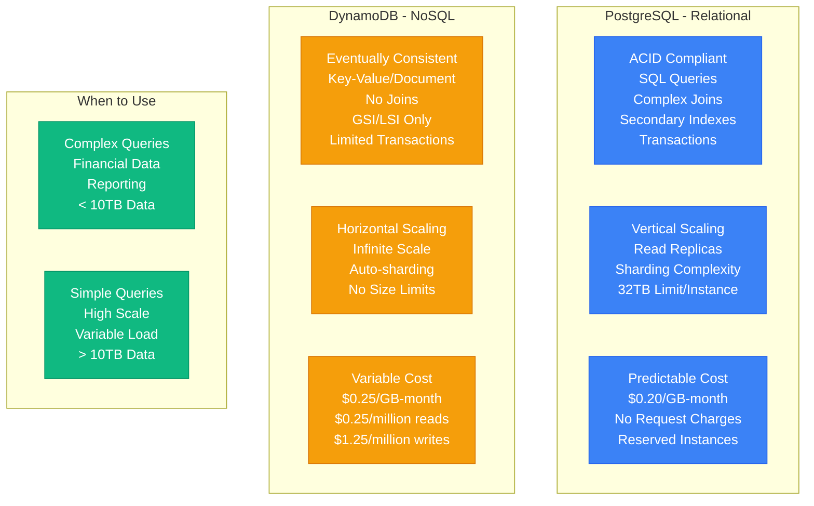
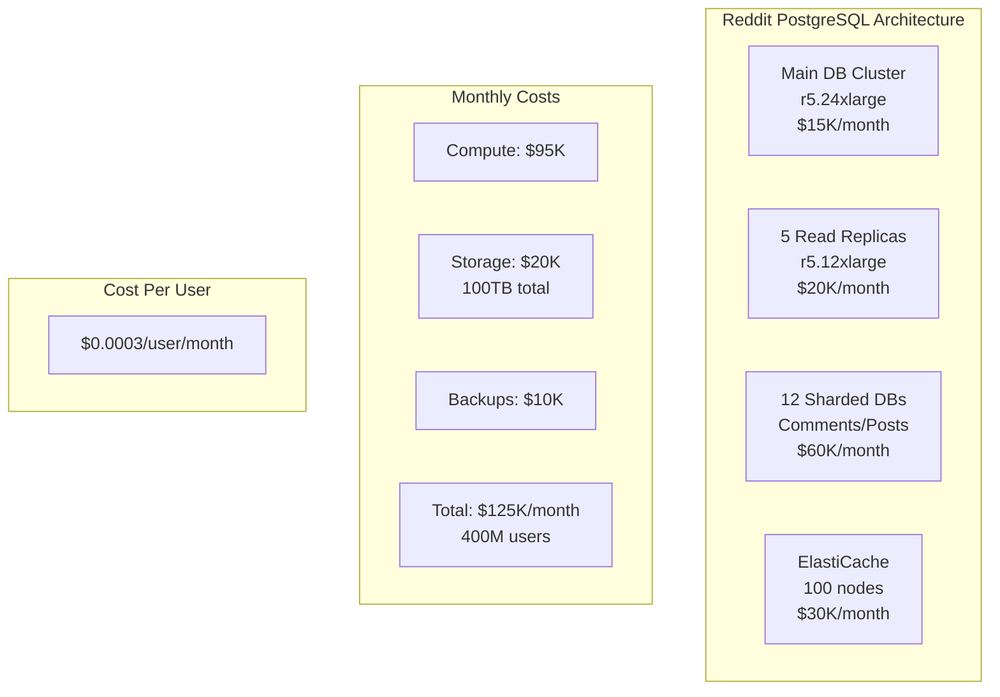
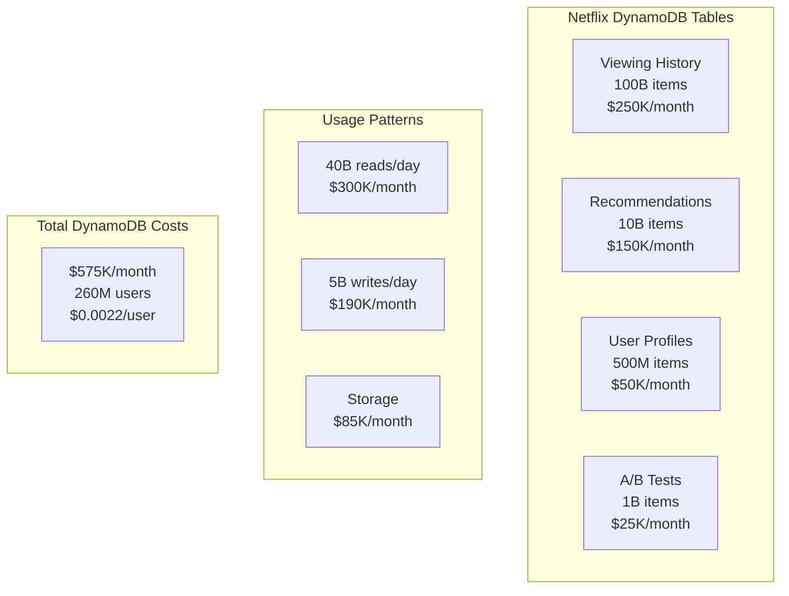
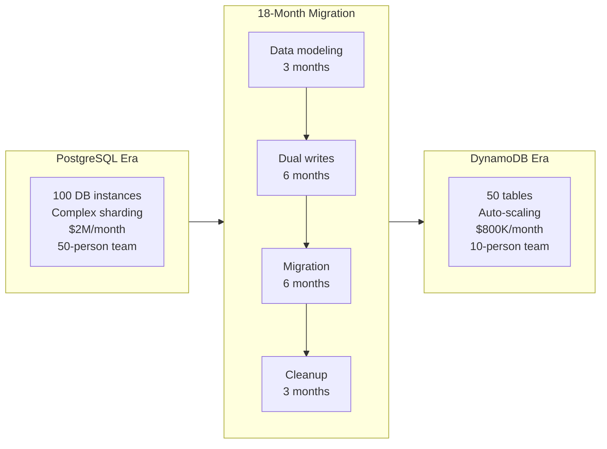
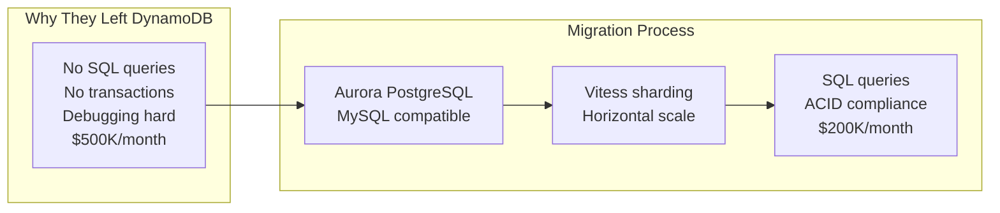
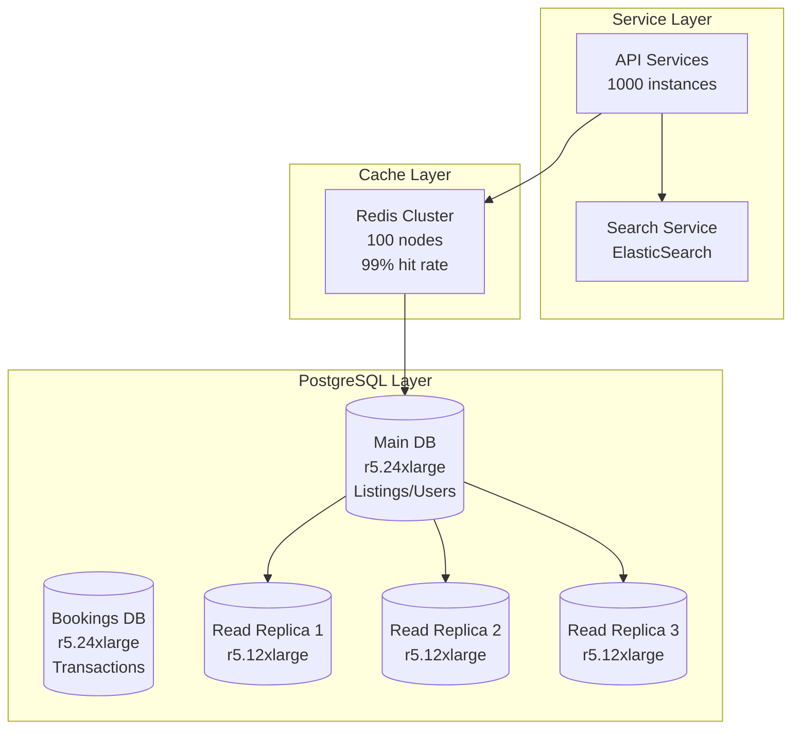
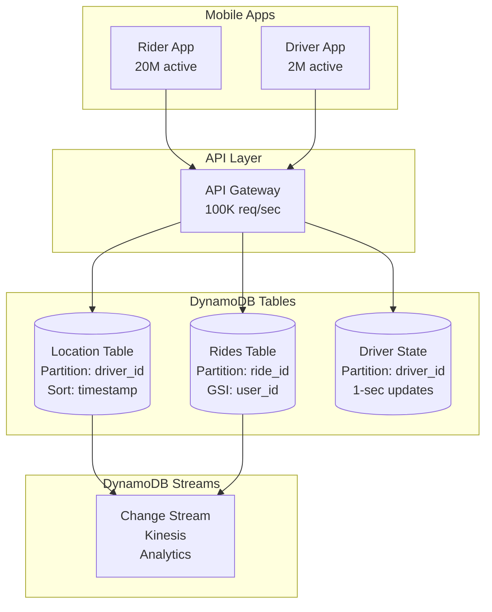
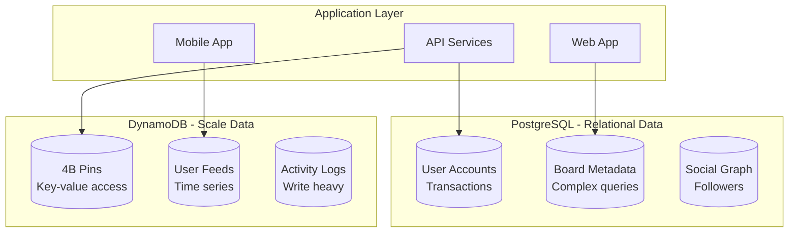

# PostgreSQL vs DynamoDB: The Production Reality

## Real-World Trade-offs from Reddit, Airbnb, Netflix, and Capital One

The choice between PostgreSQL and DynamoDB has shaped the architecture of countless companies. Here's what production deployments actually reveal.

## The Fundamental Difference



## Performance Comparison

### Latency Characteristics

```mermaid
graph LR
    subgraph PostgreSQL_Latency[PostgreSQL Latencies]
        PG_READ[Simple Read<br/>p50: 0.5ms<br/>p99: 5ms]
        PG_WRITE[Write<br/>p50: 2ms<br/>p99: 20ms]
        PG_COMPLEX[Complex Query<br/>p50: 50ms<br/>p99: 500ms]
        PG_JOIN[5-Table Join<br/>p50: 200ms<br/>p99: 2000ms]
    end

    subgraph DynamoDB_Latency[DynamoDB Latencies]
        DDB_READ[GetItem<br/>p50: 2ms<br/>p99: 10ms]
        DDB_WRITE[PutItem<br/>p50: 4ms<br/>p99: 15ms]
        DDB_QUERY[Query<br/>p50: 5ms<br/>p99: 20ms]
        DDB_SCAN[Scan (Anti-pattern)<br/>p50: 1000ms<br/>p99: 10000ms]
    end

    subgraph AtScale[At Scale (1M requests/sec)]
        PG_SCALE_LAT[PostgreSQL<br/>Degrades significantly<br/>p99: 100-1000ms]
        DDB_SCALE_LAT[DynamoDB<br/>Consistent<br/>p99: 10-20ms]
    end
```

**Real Production Numbers**:
- **Reddit** (PostgreSQL): p99 of 45ms for comment queries
- **Netflix** (DynamoDB): p99 of 8ms for 100M requests/sec
- **Airbnb** (PostgreSQL): p99 of 200ms for search queries
- **Lyft** (DynamoDB): p99 of 12ms for location updates

### Throughput Limits

| Metric | PostgreSQL (RDS) | DynamoDB | Winner |
|--------|------------------|----------|--------|
| **Max Read QPS** | 100K (with replicas) | 10M+ | DynamoDB |
| **Max Write QPS** | 25K (single master) | 10M+ | DynamoDB |
| **Max Connections** | 5,000 (RDS Proxy) | Unlimited | DynamoDB |
| **Max Database Size** | 64TB (Aurora) | Unlimited | DynamoDB |
| **Max Item/Row Size** | 1GB | 400KB | PostgreSQL |
| **Max Query Complexity** | Unlimited | Single table | PostgreSQL |

## Cost Analysis: Real Company Examples

### Reddit's PostgreSQL Journey



**Reddit's Choice**: PostgreSQL
- **Why**: Complex queries for threaded comments
- **Scale**: 52M daily active users
- **Data**: 100TB+ across shards
- **Cost**: $125K/month total

### Netflix's DynamoDB Usage



**Netflix's Choice**: DynamoDB for user data
- **Why**: Predictable single-key lookups
- **Scale**: 260M subscribers
- **Data**: 111B+ items
- **Cost**: $575K/month for user data

### Cost Comparison Table

| Company | Database | Users | Data Size | Monthly Cost | Cost/User | Why This Choice |
|---------|----------|-------|-----------|--------------|-----------|-----------------|
| Reddit | PostgreSQL | 52M DAU | 100TB | $125K | $0.0024 | Complex queries |
| Netflix | DynamoDB | 260M | 10PB | $575K | $0.0022 | Scale & latency |
| Airbnb | PostgreSQL | 150M | 50TB | $200K | $0.0013 | Transactions |
| Lyft | DynamoDB | 20M | 5PB | $400K | $0.0200 | Real-time updates |
| Discord | PostgreSQL | 150M MAU | 20TB | $80K | $0.0005 | Relational data |
| Pinterest | Both | 400M | 100TB/1PB | $450K | $0.0011 | Hybrid approach |

## Migration Stories

### Capital One: PostgreSQL → DynamoDB (2018)



**Results**:
- **Cost Reduction**: 60% ($1.2M/year savings)
- **Team Reduction**: 80% (40 engineers freed)
- **Availability**: 99.9% → 99.999%
- **Performance**: 10x improvement in p99 latency

### Segment: DynamoDB → PostgreSQL (2017)



**Results**:
- **Cost Reduction**: 60% ($300K/year savings)
- **Developer Productivity**: 3x improvement
- **Query Flexibility**: Complex analytics possible
- **Trade-off**: More operational complexity

## Feature-by-Feature Comparison

### Query Capabilities

| Feature | PostgreSQL | DynamoDB |
|---------|------------|----------|
| **SQL Support** | ✅ Full SQL | ❌ PartiQL (limited) |
| **Joins** | ✅ Complex joins | ❌ Application-level |
| **Aggregations** | ✅ Native (SUM, AVG) | ❌ Scan + compute |
| **Full-text Search** | ✅ Built-in | ❌ Use ElasticSearch |
| **Geospatial** | ✅ PostGIS | ❌ Custom implementation |
| **JSON Operations** | ✅ JSONB | ✅ Document model |
| **Transactions** | ✅ Full ACID | ⚠️ Limited (25 items) |
| **Secondary Indexes** | ✅ Unlimited | ⚠️ 20 GSIs max |

### Operational Characteristics

| Aspect | PostgreSQL | DynamoDB |
|--------|------------|----------|
| **Scaling** | Vertical + Read replicas | Horizontal, automatic |
| **Maintenance** | Regular (patching, vacuuming) | Zero maintenance |
| **Backups** | Manual/scheduled | Continuous, automatic |
| **Monitoring** | Extensive setup needed | Built-in CloudWatch |
| **Disaster Recovery** | Complex (replica promotion) | Automatic, multi-region |
| **Schema Changes** | Migrations required | Schemaless |
| **Connection Management** | Connection pools critical | HTTP, stateless |
| **Caching** | External (Redis) | DAX integrated |

## Real Production Architectures

### Airbnb's PostgreSQL Architecture



**Why PostgreSQL Works for Airbnb**:
- Complex queries for search
- ACID for financial transactions
- Mature ecosystem and tooling
- 50TB manageable with sharding

### Lyft's DynamoDB Architecture



**Why DynamoDB Works for Lyft**:
- Predictable access patterns
- Massive write volume (location updates)
- Auto-scaling for peak hours
- Global secondary indexes sufficient

## The Hybrid Approach

### Pinterest's Dual Database Strategy



**Pinterest's Strategy**:
- PostgreSQL: Where relationships matter
- DynamoDB: Where scale matters
- Cost: $450K/month combined
- Result: Best of both worlds

## Decision Framework

### When to Choose PostgreSQL

✅ **Choose PostgreSQL When You Have**:
1. **Complex Queries**: Multiple joins, aggregations
2. **Transactions**: Financial or inventory systems
3. **Moderate Scale**: < 100K requests/second
4. **Flexible Access**: Ad-hoc queries common
5. **SQL Expertise**: Team knows relational databases
6. **Budget Predictability**: Fixed monthly costs preferred

**Examples**: Shopify, GitLab, Discord, Basecamp

### When to Choose DynamoDB

✅ **Choose DynamoDB When You Have**:
1. **Simple Access Patterns**: Key-value or simple queries
2. **Massive Scale**: > 100K requests/second
3. **Global Distribution**: Multi-region active-active
4. **Variable Load**: 100x traffic spikes
5. **Minimal Ops**: No DBA team
6. **Infinite Growth**: Unbounded data growth

**Examples**: Lyft locations, Netflix viewing history, Pokemon Go

### When to Use Both

✅ **Hybrid Architecture When**:
1. Different data has different needs
2. Migration path from one to other
3. Cost optimization opportunities
4. Team has expertise in both
5. Regulatory requirements vary

**Examples**: Pinterest, Uber, Airbnb (with DynamoDB for specific use cases)

## Migration Strategies

### PostgreSQL → DynamoDB

```python
# 1. Data Modeling Phase (Most Critical!)
# PostgreSQL relational model
SELECT u.name, o.total, i.product_name
FROM users u
JOIN orders o ON u.id = o.user_id
JOIN items i ON o.id = i.order_id
WHERE u.id = 123

# DynamoDB denormalized model
{
  "PK": "USER#123",
  "SK": "ORDER#456",
  "userName": "John Doe",
  "orderTotal": 99.99,
  "items": [
    {"productName": "Widget", "price": 99.99}
  ]
}

# 2. Dual Write Phase
def create_order(user_id, items):
    # Write to PostgreSQL (source of truth)
    pg_order = postgres.insert_order(user_id, items)

    # Async write to DynamoDB
    try:
        dynamo.put_item(transform_to_dynamo(pg_order))
    except:
        log_to_reconciliation_queue(pg_order)

    return pg_order

# 3. Verification Phase
def verify_data_consistency():
    for user_id in sample_users:
        pg_data = postgres.get_user_orders(user_id)
        ddb_data = dynamo.query(PK=f"USER#{user_id}")
        assert compare_data(pg_data, ddb_data)
```

### DynamoDB → PostgreSQL

```python
# 1. Schema Design
CREATE TABLE users_denormalized (
    pk VARCHAR(255),
    sk VARCHAR(255),
    data JSONB,
    created_at TIMESTAMP,
    PRIMARY KEY (pk, sk)
);

# 2. Streaming Migration
def process_dynamodb_stream(record):
    if record['eventName'] in ['INSERT', 'MODIFY']:
        postgres.upsert(
            pk=record['Keys']['PK'],
            sk=record['Keys']['SK'],
            data=record['NewImage']
        )

# 3. Normalization Phase (Post-migration)
INSERT INTO users (id, name, email)
SELECT
    data->>'userId',
    data->>'userName',
    data->>'userEmail'
FROM users_denormalized
WHERE pk LIKE 'USER#%';
```

## Performance Tuning

### PostgreSQL Optimization

```sql
-- 1. Connection Pooling (PgBouncer)
[databases]
mydb = host=127.0.0.1 port=5432 dbname=mydb
pool_mode = transaction
max_client_conn = 1000
default_pool_size = 50

-- 2. Key Performance Parameters
shared_buffers = 25% of RAM (up to 40GB)
effective_cache_size = 75% of RAM
random_page_cost = 1.1  # For SSD
work_mem = RAM/max_connections/2

-- 3. Critical Indexes
CREATE INDEX CONCURRENTLY idx_user_created
ON users(created_at)
WHERE deleted_at IS NULL;

-- 4. Partitioning for Scale
CREATE TABLE events_2024_01 PARTITION OF events
FOR VALUES FROM ('2024-01-01') TO ('2024-02-01');
```

### DynamoDB Optimization

```python
# 1. Partition Key Design (Critical!)
# Bad: Timestamp as partition key (hot partition)
# Good: Composite key with distribution
partition_key = f"{user_id}#{timestamp_bucket}"

# 2. Write Sharding for High Throughput
import random
def write_with_sharding(item):
    # Add random suffix for distribution
    item['PK'] = f"{item['PK']}#{random.randint(0,9)}"
    dynamodb.put_item(Item=item)

# 3. Batch Operations
with table.batch_writer() as batch:
    for item in items:
        batch.put_item(Item=item)

# 4. Adaptive Capacity (Enable for hot partitions)
aws dynamodb update-table \
    --table-name MyTable \
    --contributor-insights-specification Enabled=true
```

## Cost Optimization Strategies

### PostgreSQL Cost Reduction

1. **Reserved Instances**: 40-70% savings
2. **Aurora Serverless**: For variable loads
3. **Read Replica Optimization**: Only where needed
4. **Data Archival**: Move old data to S3
5. **Query Optimization**: Reduce CPU usage

### DynamoDB Cost Reduction

1. **On-Demand vs Provisioned**: Choose wisely
2. **Auto-scaling**: Set conservative targets
3. **TTL for Old Data**: Automatic deletion
4. **Compression**: Reduce item sizes
5. **S3 + DynamoDB**: Large objects in S3

## Final Recommendations

### The 80% Rule

- **80% of applications**: Should start with PostgreSQL
- **15% of applications**: Need DynamoDB from day one
- **5% of applications**: Need both

### The Scale Threshold

- **< 10GB data**: PostgreSQL always
- **10GB - 1TB**: PostgreSQL usually fine
- **1TB - 10TB**: Consider your access patterns
- **> 10TB**: DynamoDB often better

### The Team Factor

- **Small team**: PostgreSQL (familiar)
- **No ops team**: DynamoDB (managed)
- **Expert team**: Either or both

### The Cost Reality

- **Small scale**: PostgreSQL cheaper
- **Medium scale**: Similar costs
- **Large scale**: DynamoDB often cheaper
- **Massive scale**: DynamoDB only option

## References

- "Reddit's Database Architecture" - r/redditeng 2024
- "Netflix's DynamoDB Usage" - AWS re:Invent 2023
- "Why We Moved From DynamoDB to PostgreSQL" - Segment Blog
- "Capital One's DynamoDB Migration" - AWS Case Study
- "Pinterest's Hybrid Architecture" - QCon 2023
- AWS Pricing Calculator (September 2024)

---

*Last Updated: September 2024*
*Based on production data from named companies*