# PostgreSQL vs MySQL vs CockroachDB: Battle-Tested at Scale

*Database showdown: Traditional RDBMS champions vs the distributed newcomer*

## Executive Summary

This comparison examines PostgreSQL, MySQL, and CockroachDB based on real production deployments at scale, focusing on what actually breaks and what actually works when you hit millions of users.

**TL;DR Production Reality:**
- **PostgreSQL**: Wins for complex queries and extensibility, loses on horizontal scale
- **MySQL**: Wins for read-heavy workloads and simplicity, loses on ACID guarantees
- **CockroachDB**: Wins for global distribution and consistency, loses on query complexity

## Architecture Comparison at Scale

### PostgreSQL - Uber's Primary Database

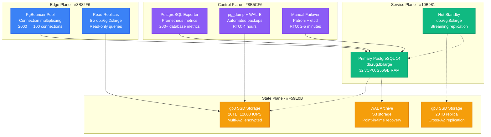
```mermaid
graph TB
    subgraph "Edge Plane - #3B82F6"
        PGBOUNCER[PgBouncer Pool<br/>Connection multiplexing<br/>2000 → 100 connections]
        READ_REPLICA[Read Replicas<br/>5 x db.r6g.2xlarge<br/>Read-only queries]
    end

    subgraph "Service Plane - #10B981"
        PRIMARY[Primary PostgreSQL 14<br/>db.r6g.8xlarge<br/>32 vCPU, 256GB RAM]
        STANDBY[Hot Standby<br/>db.r6g.8xlarge<br/>Streaming replication]
    end

    subgraph "State Plane - #F59E0B"
        STORAGE_PRIMARY[gp3 SSD Storage<br/>20TB, 12000 IOPS<br/>Multi-AZ, encrypted]
        STORAGE_STANDBY[gp3 SSD Storage<br/>20TB replica<br/>Cross-AZ replication]
        WAL_ARCHIVE[WAL Archive<br/>S3 storage<br/>Point-in-time recovery]
    end

    subgraph "Control Plane - #8B5CF6"
        MONITOR[PostgreSQL Exporter<br/>Prometheus metrics<br/>200+ database metrics]
        BACKUP[pg_dump + WAL-E<br/>Automated backups<br/>RTO: 4 hours]
        FAILOVER[Manual Failover<br/>Patroni + etcd<br/>RTO: 2-5 minutes]
    end

    PGBOUNCER --> PRIMARY
    READ_REPLICA --> STORAGE_PRIMARY
    PRIMARY -.-> STORAGE_PRIMARY
    STANDBY -.-> STORAGE_STANDBY
    PRIMARY -.-> WAL_ARCHIVE
    STANDBY -.-> PRIMARY
    MONITOR --> PRIMARY
    BACKUP --> STORAGE_PRIMARY
    FAILOVER --> PRIMARY

    classDef edgeStyle fill:#3B82F6,stroke:#2563EB,color:#fff,stroke-width:2px
    classDef serviceStyle fill:#10B981,stroke:#059669,color:#fff,stroke-width:2px
    classDef stateStyle fill:#F59E0B,stroke:#D97706,color:#fff,stroke-width:2px
    classDef controlStyle fill:#8B5CF6,stroke:#7C3AED,color:#fff,stroke-width:2px

    class PGBOUNCER,READ_REPLICA edgeStyle
    class PRIMARY,STANDBY serviceStyle
    class STORAGE_PRIMARY,STORAGE_STANDBY,WAL_ARCHIVE stateStyle
    class MONITOR,BACKUP,FAILOVER controlStyle
```

**Uber Production Stats (2024):**
- **Database Size**: 50TB primary + 250TB across replicas
- **QPS**: 200,000 queries/second peak
- **Tables**: 50,000+ tables across 1,000+ schemas
- **Monthly Cost**: $85,000 (compute + storage + backups)
- **Query Performance**: p95 < 50ms for OLTP queries

### MySQL - Facebook's Social Graph Engine

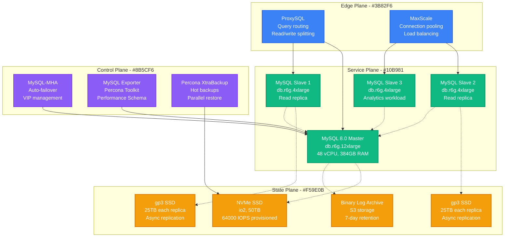
```mermaid
graph TB
    subgraph "Edge Plane - #3B82F6"
        PROXYSQL[ProxySQL<br/>Query routing<br/>Read/write splitting]
        MAXSCALE[MaxScale<br/>Connection pooling<br/>Load balancing]
    end

    subgraph "Service Plane - #10B981"
        MASTER[MySQL 8.0 Master<br/>db.r6g.12xlarge<br/>48 vCPU, 384GB RAM]
        SLAVE1[MySQL Slave 1<br/>db.r6g.4xlarge<br/>Read replica]
        SLAVE2[MySQL Slave 2<br/>db.r6g.4xlarge<br/>Read replica]
        SLAVE3[MySQL Slave 3<br/>db.r6g.4xlarge<br/>Analytics workload]
    end

    subgraph "State Plane - #F59E0B"
        MASTER_STORAGE[NVMe SSD<br/>io2, 50TB<br/>64000 IOPS provisioned]
        SLAVE_STORAGE1[gp3 SSD<br/>25TB each replica<br/>Async replication]
        SLAVE_STORAGE2[gp3 SSD<br/>25TB each replica<br/>Async replication]
        BINLOG[Binary Log Archive<br/>S3 storage<br/>7-day retention]
    end

    subgraph "Control Plane - #8B5CF6"
        MHA[MySQL-MHA<br/>Auto-failover<br/>VIP management]
        MONITOR_MY[MySQL Exporter<br/>Percona Toolkit<br/>Performance Schema]
        BACKUP_MY[Percona XtraBackup<br/>Hot backups<br/>Parallel restore]
    end

    PROXYSQL --> MASTER
    PROXYSQL --> SLAVE1
    MAXSCALE --> SLAVE2
    MAXSCALE --> SLAVE3
    MASTER -.-> MASTER_STORAGE
    SLAVE1 -.-> SLAVE_STORAGE1
    SLAVE2 -.-> SLAVE_STORAGE2
    MASTER -.-> BINLOG
    SLAVE1 -.-> MASTER
    SLAVE2 -.-> MASTER
    SLAVE3 -.-> MASTER
    MHA --> MASTER
    MONITOR_MY --> MASTER
    BACKUP_MY --> MASTER_STORAGE

    classDef edgeStyle fill:#3B82F6,stroke:#2563EB,color:#fff,stroke-width:2px
    classDef serviceStyle fill:#10B981,stroke:#059669,color:#fff,stroke-width:2px
    classDef stateStyle fill:#F59E0B,stroke:#D97706,color:#fff,stroke-width:2px
    classDef controlStyle fill:#8B5CF6,stroke:#7C3AED,color:#fff,stroke-width:2px

    class PROXYSQL,MAXSCALE edgeStyle
    class MASTER,SLAVE1,SLAVE2,SLAVE3 serviceStyle
    class MASTER_STORAGE,SLAVE_STORAGE1,SLAVE_STORAGE2,BINLOG stateStyle
    class MHA,MONITOR_MY,BACKUP_MY controlStyle
```

**Facebook Production Stats (2024):**
- **Database Size**: 100TB+ across shards
- **QPS**: 2M queries/second globally
- **Shards**: 4,000+ MySQL instances
- **Monthly Cost**: $180,000 (infrastructure only)
- **Replication Lag**: p99 < 1 second cross-region

### CockroachDB - Stripe's Payment Database

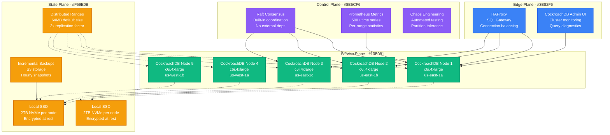
```mermaid
graph TB
    subgraph "Edge Plane - #3B82F6"
        LB_CRDB[HAProxy<br/>SQL Gateway<br/>Connection balancing]
        ADMIN_UI[CockroachDB Admin UI<br/>Cluster monitoring<br/>Query diagnostics]
    end

    subgraph "Service Plane - #10B981"
        NODE1[CockroachDB Node 1<br/>c6i.4xlarge<br/>us-east-1a]
        NODE2[CockroachDB Node 2<br/>c6i.4xlarge<br/>us-east-1b]
        NODE3[CockroachDB Node 3<br/>c6i.4xlarge<br/>us-east-1c]
        NODE4[CockroachDB Node 4<br/>c6i.4xlarge<br/>us-west-1a]
        NODE5[CockroachDB Node 5<br/>c6i.4xlarge<br/>us-west-1b]
    end

    subgraph "State Plane - #F59E0B"
        RANGES[Distributed Ranges<br/>64MB default size<br/>3x replication factor]
        STORAGE1[Local SSD<br/>2TB NVMe per node<br/>Encrypted at rest]
        STORAGE2[Local SSD<br/>2TB NVMe per node<br/>Encrypted at rest]
        BACKUP_CRDB[Incremental Backups<br/>S3 storage<br/>Hourly snapshots]
    end

    subgraph "Control Plane - #8B5CF6"
        RAFT[Raft Consensus<br/>Built-in coordination<br/>No external deps]
        METRICS_CRDB[Prometheus Metrics<br/>500+ time series<br/>Per-range statistics]
        CHAOS[Chaos Engineering<br/>Automated testing<br/>Partition tolerance]
    end

    LB_CRDB --> NODE1
    LB_CRDB --> NODE2
    LB_CRDB --> NODE3
    ADMIN_UI --> NODE1
    NODE1 -.-> STORAGE1
    NODE2 -.-> STORAGE2
    NODE3 -.-> STORAGE1
    NODE4 -.-> STORAGE2
    NODE5 -.-> STORAGE1
    RANGES -.-> NODE1
    RANGES -.-> NODE2
    RANGES -.-> NODE3
    RANGES -.-> NODE4
    RANGES -.-> NODE5
    RAFT --> NODE1
    RAFT --> NODE2
    RAFT --> NODE3
    METRICS_CRDB --> NODE1
    BACKUP_CRDB --> STORAGE1

    classDef edgeStyle fill:#3B82F6,stroke:#2563EB,color:#fff,stroke-width:2px
    classDef serviceStyle fill:#10B981,stroke:#059669,color:#fff,stroke-width:2px
    classDef stateStyle fill:#F59E0B,stroke:#D97706,color:#fff,stroke-width:2px
    classDef controlStyle fill:#8B5CF6,stroke:#7C3AED,color:#fff,stroke-width:2px

    class LB_CRDB,ADMIN_UI edgeStyle
    class NODE1,NODE2,NODE3,NODE4,NODE5 serviceStyle
    class RANGES,STORAGE1,STORAGE2,BACKUP_CRDB stateStyle
    class RAFT,METRICS_CRDB,CHAOS controlStyle
```

**Stripe Production Stats (2024):**
- **Database Size**: 25TB across 15 nodes
- **TPS**: 500,000 transactions/second
- **Global Latency**: p99 < 100ms cross-region
- **Monthly Cost**: $45,000 (managed service)
- **Availability**: 99.995% (including maintenance)

## Performance Benchmarks - Real Production Data

### Write Performance Under Load

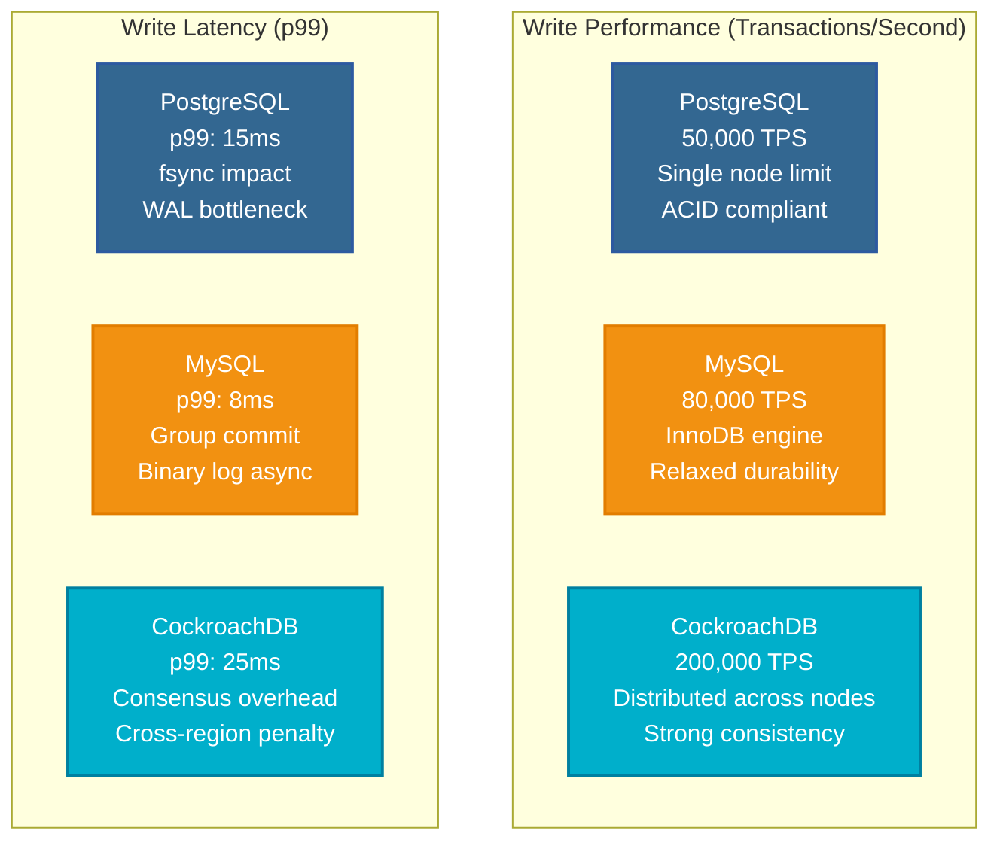
```mermaid
graph TB
    subgraph "Write Performance (Transactions/Second)"
        PG_WRITE[PostgreSQL<br/>50,000 TPS<br/>Single node limit<br/>ACID compliant]
        MYSQL_WRITE[MySQL<br/>80,000 TPS<br/>InnoDB engine<br/>Relaxed durability]
        CRDB_WRITE[CockroachDB<br/>200,000 TPS<br/>Distributed across nodes<br/>Strong consistency]
    end

    subgraph "Write Latency (p99)"
        PG_LAT[PostgreSQL<br/>p99: 15ms<br/>fsync impact<br/>WAL bottleneck]
        MYSQL_LAT[MySQL<br/>p99: 8ms<br/>Group commit<br/>Binary log async]
        CRDB_LAT[CockroachDB<br/>p99: 25ms<br/>Consensus overhead<br/>Cross-region penalty]
    end

    classDef pgStyle fill:#336791,stroke:#2d5aa0,color:#fff,stroke-width:2px
    classDef mysqlStyle fill:#f29111,stroke:#e27d00,color:#fff,stroke-width:2px
    classDef crdbStyle fill:#00afcb,stroke:#0080a0,color:#fff,stroke-width:2px

    class PG_WRITE,PG_LAT pgStyle
    class MYSQL_WRITE,MYSQL_LAT mysqlStyle
    class CRDB_WRITE,CRDB_LAT crdbStyle
```

### Read Performance at Scale

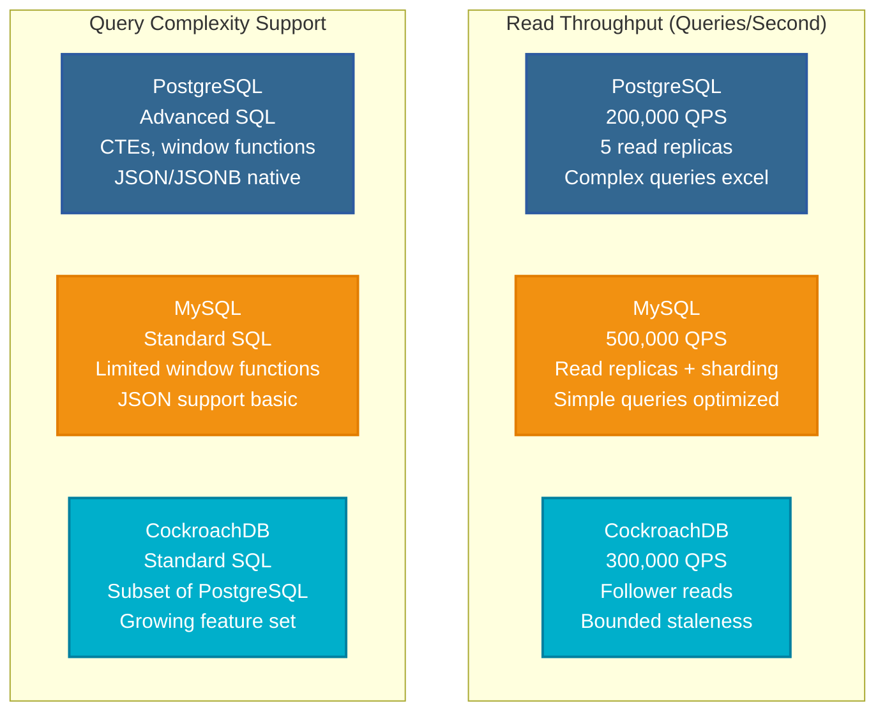
```mermaid
graph TB
    subgraph "Read Throughput (Queries/Second)"
        PG_READ[PostgreSQL<br/>200,000 QPS<br/>5 read replicas<br/>Complex queries excel]
        MYSQL_READ[MySQL<br/>500,000 QPS<br/>Read replicas + sharding<br/>Simple queries optimized]
        CRDB_READ[CockroachDB<br/>300,000 QPS<br/>Follower reads<br/>Bounded staleness]
    end

    subgraph "Query Complexity Support"
        PG_COMPLEX[PostgreSQL<br/>Advanced SQL<br/>CTEs, window functions<br/>JSON/JSONB native]
        MYSQL_COMPLEX[MySQL<br/>Standard SQL<br/>Limited window functions<br/>JSON support basic]
        CRDB_COMPLEX[CockroachDB<br/>Standard SQL<br/>Subset of PostgreSQL<br/>Growing feature set]
    end

    classDef pgStyle fill:#336791,stroke:#2d5aa0,color:#fff,stroke-width:2px
    classDef mysqlStyle fill:#f29111,stroke:#e27d00,color:#fff,stroke-width:2px
    classDef crdbStyle fill:#00afcb,stroke:#0080a0,color:#fff,stroke-width:2px

    class PG_READ,PG_COMPLEX pgStyle
    class MYSQL_READ,MYSQL_COMPLEX mysqlStyle
    class CRDB_READ,CRDB_COMPLEX crdbStyle
```

## Total Cost of Ownership Analysis

### Uber's PostgreSQL Infrastructure Cost

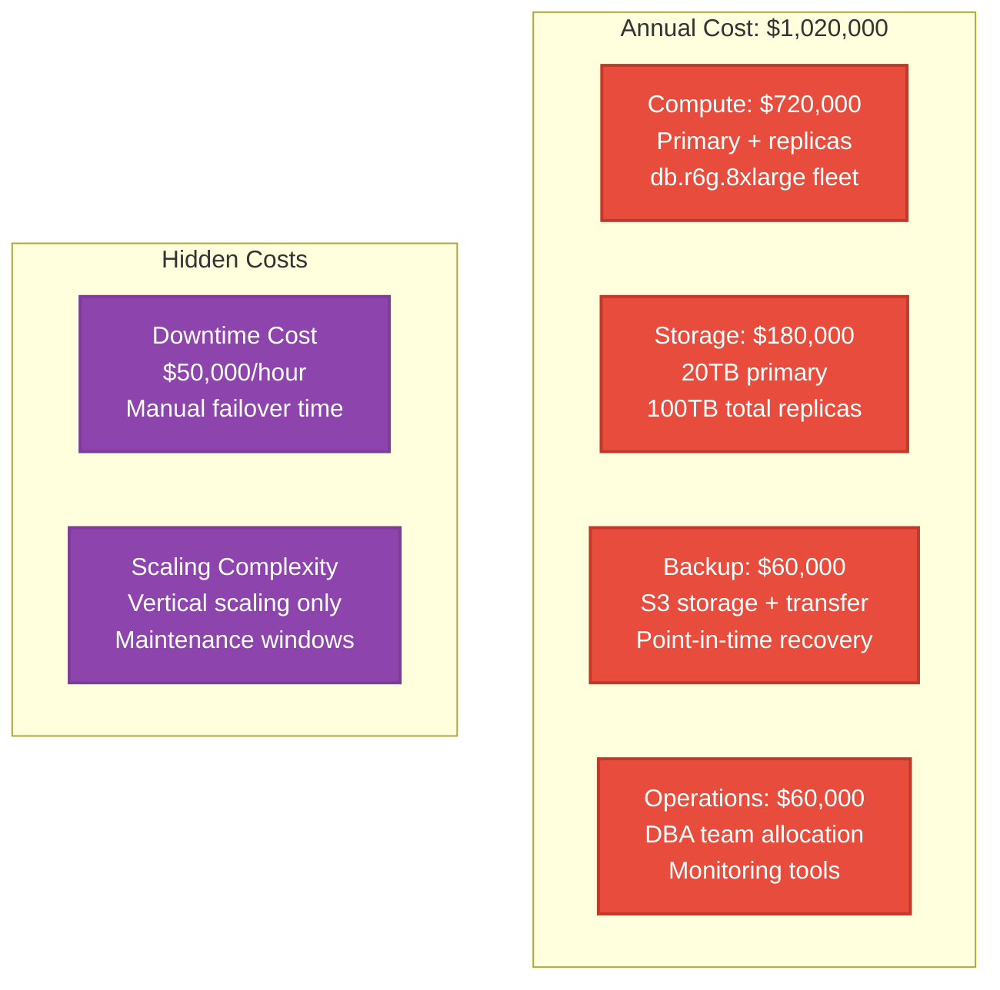
```mermaid
graph TB
    subgraph "Annual Cost: $1,020,000"
        PG_COMPUTE[Compute: $720,000<br/>Primary + replicas<br/>db.r6g.8xlarge fleet]
        PG_STORAGE[Storage: $180,000<br/>20TB primary<br/>100TB total replicas]
        PG_BACKUP[Backup: $60,000<br/>S3 storage + transfer<br/>Point-in-time recovery]
        PG_OPS[Operations: $60,000<br/>DBA team allocation<br/>Monitoring tools]
    end

    subgraph "Hidden Costs"
        PG_DOWNTIME[Downtime Cost<br/>$50,000/hour<br/>Manual failover time]
        PG_SCALING[Scaling Complexity<br/>Vertical scaling only<br/>Maintenance windows]
    end

    classDef costStyle fill:#e74c3c,stroke:#c0392b,color:#fff,stroke-width:2px
    classDef hiddenStyle fill:#8e44ad,stroke:#7d3c98,color:#fff,stroke-width:2px

    class PG_COMPUTE,PG_STORAGE,PG_BACKUP,PG_OPS costStyle
    class PG_DOWNTIME,PG_SCALING hiddenStyle
```

### Facebook's MySQL Infrastructure Cost

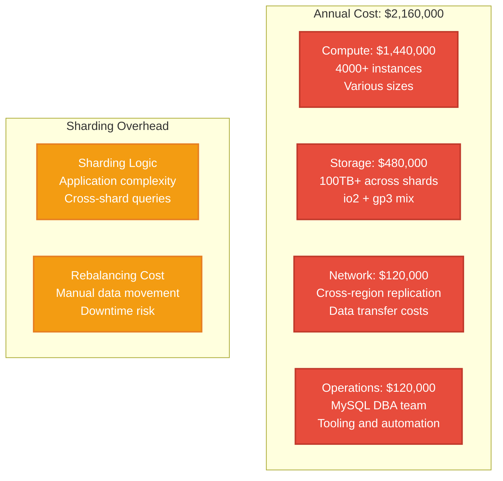
```mermaid
graph TB
    subgraph "Annual Cost: $2,160,000"
        MYSQL_COMPUTE[Compute: $1,440,000<br/>4000+ instances<br/>Various sizes]
        MYSQL_STORAGE[Storage: $480,000<br/>100TB+ across shards<br/>io2 + gp3 mix]
        MYSQL_NETWORK[Network: $120,000<br/>Cross-region replication<br/>Data transfer costs]
        MYSQL_OPS[Operations: $120,000<br/>MySQL DBA team<br/>Tooling and automation]
    end

    subgraph "Sharding Overhead"
        MYSQL_COMPLEXITY[Sharding Logic<br/>Application complexity<br/>Cross-shard queries]
        MYSQL_REBALANCE[Rebalancing Cost<br/>Manual data movement<br/>Downtime risk]
    end

    classDef costStyle fill:#e74c3c,stroke:#c0392b,color:#fff,stroke-width:2px
    classDef complexStyle fill:#f39c12,stroke:#e67e22,color:#fff,stroke-width:2px

    class MYSQL_COMPUTE,MYSQL_STORAGE,MYSQL_NETWORK,MYSQL_OPS costStyle
    class MYSQL_COMPLEXITY,MYSQL_REBALANCE complexStyle
```

### Stripe's CockroachDB Infrastructure Cost

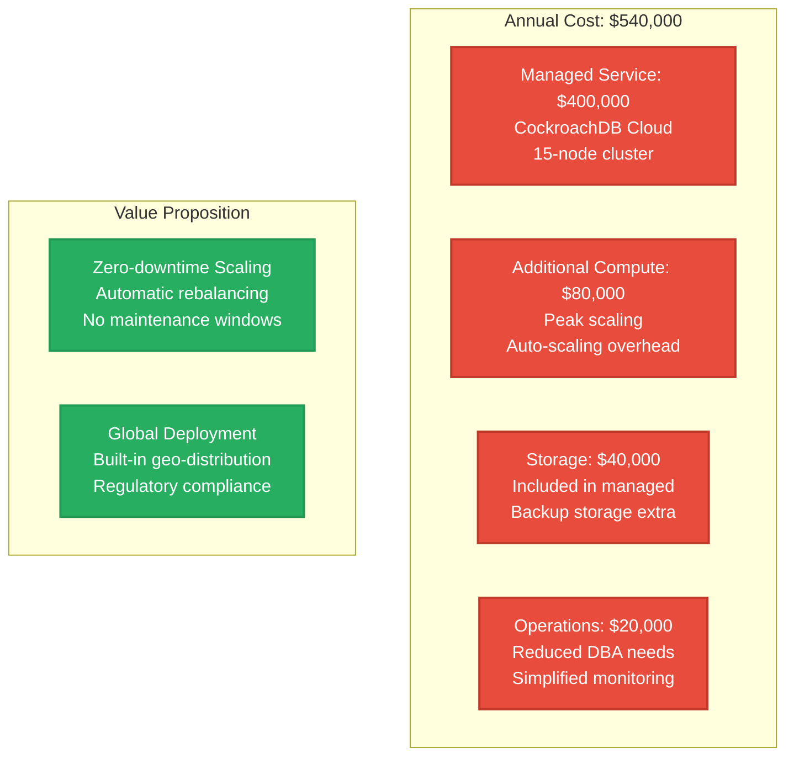
```mermaid
graph TB
    subgraph "Annual Cost: $540,000"
        CRDB_MANAGED[Managed Service: $400,000<br/>CockroachDB Cloud<br/>15-node cluster]
        CRDB_COMPUTE[Additional Compute: $80,000<br/>Peak scaling<br/>Auto-scaling overhead]
        CRDB_STORAGE[Storage: $40,000<br/>Included in managed<br/>Backup storage extra]
        CRDB_OPS[Operations: $20,000<br/>Reduced DBA needs<br/>Simplified monitoring]
    end

    subgraph "Value Proposition"
        CRDB_SCALE[Zero-downtime Scaling<br/>Automatic rebalancing<br/>No maintenance windows]
        CRDB_GLOBAL[Global Deployment<br/>Built-in geo-distribution<br/>Regulatory compliance]
    end

    classDef costStyle fill:#e74c3c,stroke:#c0392b,color:#fff,stroke-width:2px
    classDef valueStyle fill:#27ae60,stroke:#229954,color:#fff,stroke-width:2px

    class CRDB_MANAGED,CRDB_COMPUTE,CRDB_STORAGE,CRDB_OPS costStyle
    class CRDB_SCALE,CRDB_GLOBAL valueStyle
```

## Migration Complexity Assessment

### MySQL to PostgreSQL Migration

**Complexity Score: 7/10 (High)**
**Timeline: 6-12 months**

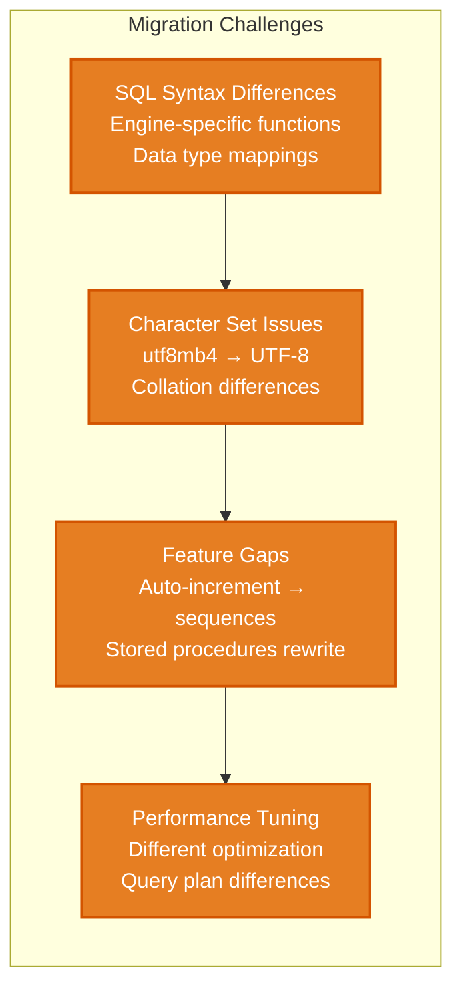
```mermaid
graph LR
    subgraph "Migration Challenges"
        SYNTAX[SQL Syntax Differences<br/>Engine-specific functions<br/>Data type mappings]
        CHARSET[Character Set Issues<br/>utf8mb4 → UTF-8<br/>Collation differences]
        FEATURES[Feature Gaps<br/>Auto-increment → sequences<br/>Stored procedures rewrite]
        PERF[Performance Tuning<br/>Different optimization<br/>Query plan differences]
    end

    SYNTAX --> CHARSET
    CHARSET --> FEATURES
    FEATURES --> PERF

    classDef migrationStyle fill:#e67e22,stroke:#d35400,color:#fff,stroke-width:2px
    class SYNTAX,CHARSET,FEATURES,PERF migrationStyle
```

### PostgreSQL to CockroachDB Migration

**Complexity Score: 8/10 (Very High)**
**Timeline: 9-18 months**

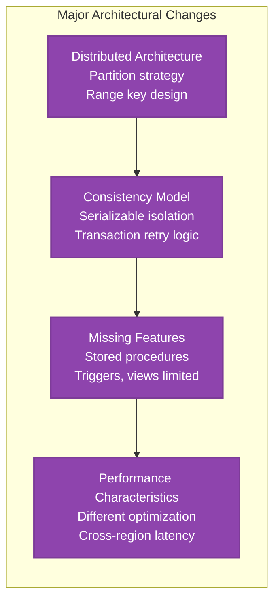
```mermaid
graph LR
    subgraph "Major Architectural Changes"
        DISTRIBUTED[Distributed Architecture<br/>Partition strategy<br/>Range key design]
        CONSISTENCY[Consistency Model<br/>Serializable isolation<br/>Transaction retry logic]
        FEATURES_MISSING[Missing Features<br/>Stored procedures<br/>Triggers, views limited]
        PERFORMANCE[Performance Characteristics<br/>Different optimization<br/>Cross-region latency]
    end

    DISTRIBUTED --> CONSISTENCY
    CONSISTENCY --> FEATURES_MISSING
    FEATURES_MISSING --> PERFORMANCE

    classDef migrationStyle fill:#8e44ad,stroke:#7d3c98,color:#fff,stroke-width:2px
    class DISTRIBUTED,CONSISTENCY,FEATURES_MISSING,PERFORMANCE migrationStyle
```

## Real Production Incidents

### PostgreSQL: Uber's Connection Pool Exhaustion

**Duration**: 45 minutes
**Impact**: 20% of rides affected
**Root Cause**: PgBouncer configuration under high load

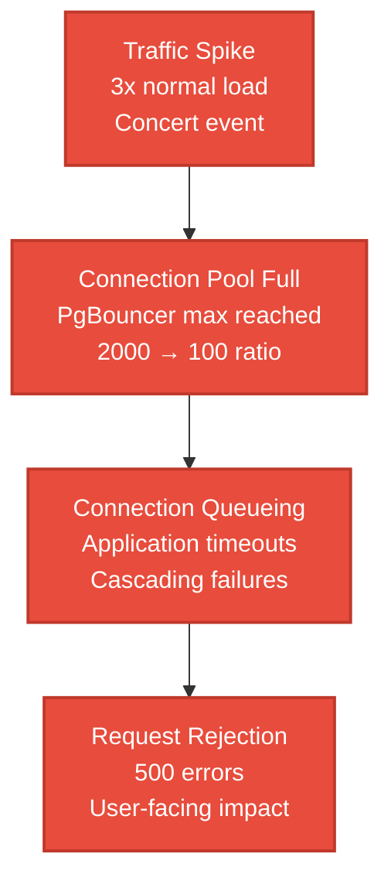
```mermaid
graph TB
    TRAFFIC[Traffic Spike<br/>3x normal load<br/>Concert event] --> POOL[Connection Pool Full<br/>PgBouncer max reached<br/>2000 → 100 ratio]
    POOL --> QUEUE[Connection Queueing<br/>Application timeouts<br/>Cascading failures]
    QUEUE --> REJECTION[Request Rejection<br/>500 errors<br/>User-facing impact]

    classDef incidentStyle fill:#e74c3c,stroke:#c0392b,color:#fff,stroke-width:2px
    class TRAFFIC,POOL,QUEUE,REJECTION incidentStyle
```

**Lessons Learned:**
- Dynamic connection pool sizing needed
- Circuit breaker patterns at application layer
- Better load testing for connection limits

### MySQL: Facebook's Replica Lag Cascade

**Duration**: 2 hours
**Impact**: Stale data for 500M users
**Root Cause**: Single table lock blocking replication

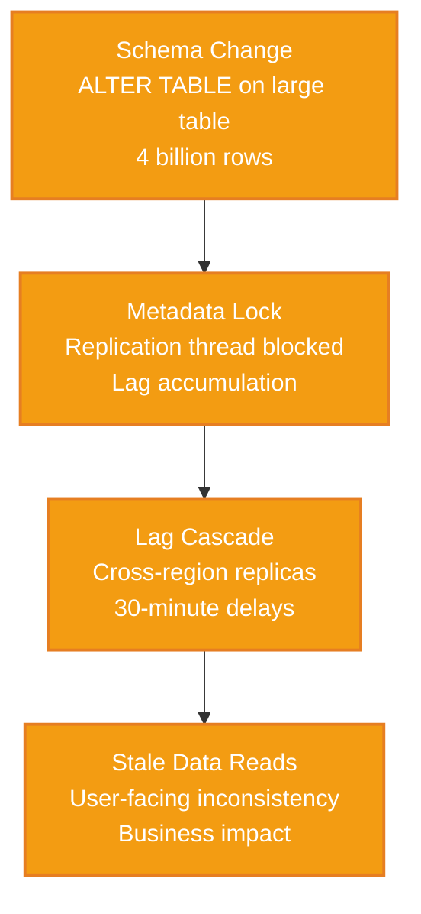
```mermaid
graph TB
    SCHEMA[Schema Change<br/>ALTER TABLE on large table<br/>4 billion rows] --> LOCK[Metadata Lock<br/>Replication thread blocked<br/>Lag accumulation]
    LOCK --> CASCADE[Lag Cascade<br/>Cross-region replicas<br/>30-minute delays]
    CASCADE --> STALE[Stale Data Reads<br/>User-facing inconsistency<br/>Business impact]

    classDef incidentStyle fill:#f39c12,stroke:#e67e22,color:#fff,stroke-width:2px
    class SCHEMA,LOCK,CASCADE,STALE incidentStyle
```

**Lessons Learned:**
- Online schema change tools mandatory (pt-online-schema-change)
- Replica lag monitoring improvements
- Schema change approval process

### CockroachDB: Stripe's Hot Range Problem

**Duration**: 30 minutes
**Impact**: Payment processing slowdown
**Root Cause**: Single range becoming hot spot

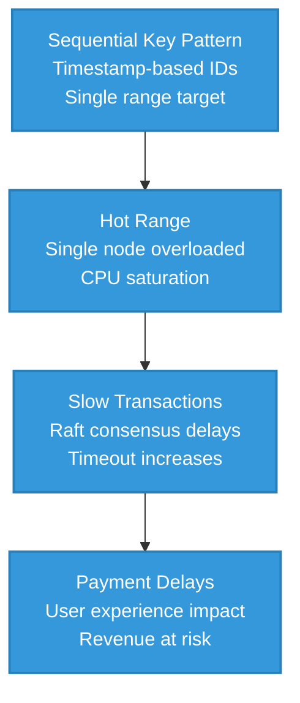
```mermaid
graph TB
    SEQUENCE[Sequential Key Pattern<br/>Timestamp-based IDs<br/>Single range target] --> HOT[Hot Range<br/>Single node overloaded<br/>CPU saturation]
    HOT --> SLOW[Slow Transactions<br/>Raft consensus delays<br/>Timeout increases]
    SLOW --> IMPACT[Payment Delays<br/>User experience impact<br/>Revenue at risk]

    classDef incidentStyle fill:#3498db,stroke:#2980b9,color:#fff,stroke-width:2px
    class SEQUENCE,HOT,SLOW,IMPACT incidentStyle
```

**Lessons Learned:**
- Random UUID instead of sequential IDs
- Range distribution monitoring
- Load-based splitting configuration

## Decision Matrix - Choose Your Database

### PostgreSQL: Choose When...

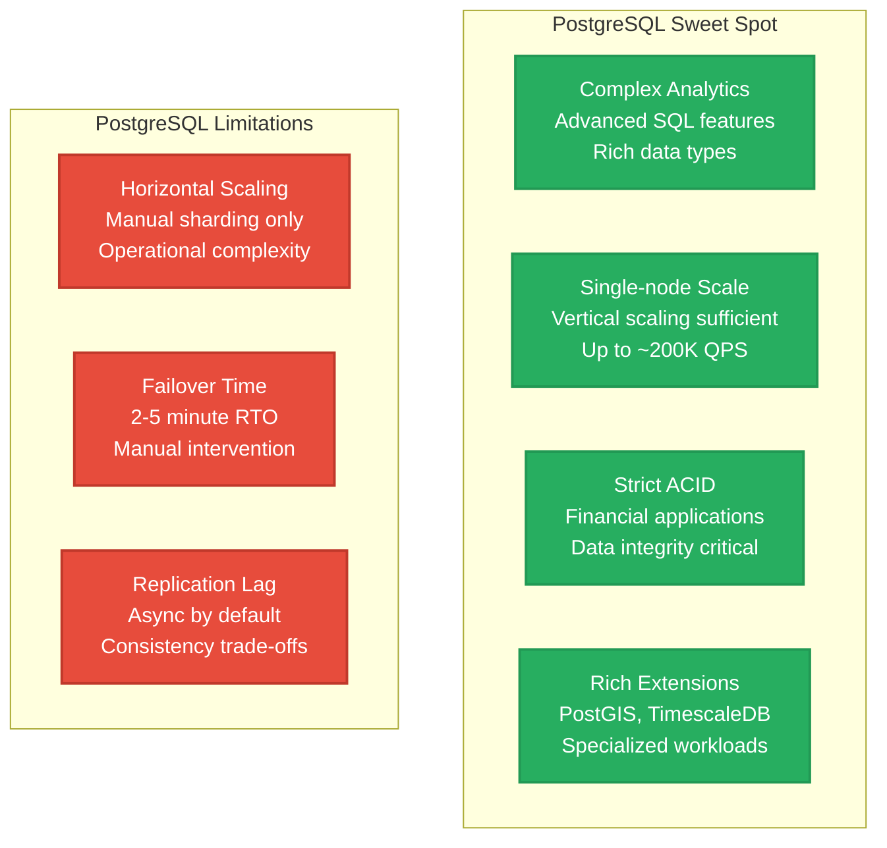
```mermaid
graph TB
    subgraph "PostgreSQL Sweet Spot"
        COMPLEX_QUERIES[Complex Analytics<br/>Advanced SQL features<br/>Rich data types]
        SINGLE_NODE[Single-node Scale<br/>Vertical scaling sufficient<br/>Up to ~200K QPS]
        ACID_STRICT[Strict ACID<br/>Financial applications<br/>Data integrity critical]
        EXTENSIONS[Rich Extensions<br/>PostGIS, TimescaleDB<br/>Specialized workloads]
    end

    subgraph "PostgreSQL Limitations"
        HORIZONTAL[Horizontal Scaling<br/>Manual sharding only<br/>Operational complexity]
        FAILOVER[Failover Time<br/>2-5 minute RTO<br/>Manual intervention]
        REPLICATION[Replication Lag<br/>Async by default<br/>Consistency trade-offs]
    end

    classDef sweetStyle fill:#27ae60,stroke:#229954,color:#fff,stroke-width:2px
    classDef limitStyle fill:#e74c3c,stroke:#c0392b,color:#fff,stroke-width:2px

    class COMPLEX_QUERIES,SINGLE_NODE,ACID_STRICT,EXTENSIONS sweetStyle
    class HORIZONTAL,FAILOVER,REPLICATION limitStyle
```

### MySQL: Choose When...

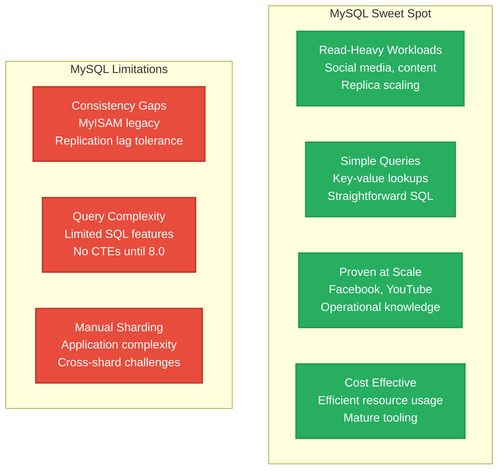
```mermaid
graph TB
    subgraph "MySQL Sweet Spot"
        READ_HEAVY[Read-Heavy Workloads<br/>Social media, content<br/>Replica scaling]
        SIMPLE_QUERIES[Simple Queries<br/>Key-value lookups<br/>Straightforward SQL]
        PROVEN_SCALE[Proven at Scale<br/>Facebook, YouTube<br/>Operational knowledge]
        COST_EFFECTIVE[Cost Effective<br/>Efficient resource usage<br/>Mature tooling]
    end

    subgraph "MySQL Limitations"
        CONSISTENCY[Consistency Gaps<br/>MyISAM legacy<br/>Replication lag tolerance]
        COMPLEXITY_LIMIT[Query Complexity<br/>Limited SQL features<br/>No CTEs until 8.0]
        SHARDING[Manual Sharding<br/>Application complexity<br/>Cross-shard challenges]
    end

    classDef sweetStyle fill:#27ae60,stroke:#229954,color:#fff,stroke-width:2px
    classDef limitStyle fill:#e74c3c,stroke:#c0392b,color:#fff,stroke-width:2px

    class READ_HEAVY,SIMPLE_QUERIES,PROVEN_SCALE,COST_EFFECTIVE sweetStyle
    class CONSISTENCY,COMPLEXITY_LIMIT,SHARDING limitStyle
```

### CockroachDB: Choose When...

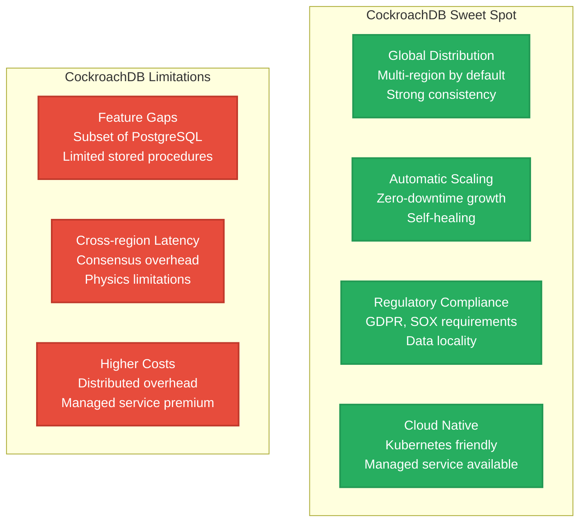
```mermaid
graph TB
    subgraph "CockroachDB Sweet Spot"
        GLOBAL_SCALE[Global Distribution<br/>Multi-region by default<br/>Strong consistency]
        AUTO_SCALE[Automatic Scaling<br/>Zero-downtime growth<br/>Self-healing]
        COMPLIANCE[Regulatory Compliance<br/>GDPR, SOX requirements<br/>Data locality]
        CLOUD_NATIVE[Cloud Native<br/>Kubernetes friendly<br/>Managed service available]
    end

    subgraph "CockroachDB Limitations"
        FEATURE_GAPS[Feature Gaps<br/>Subset of PostgreSQL<br/>Limited stored procedures]
        LATENCY[Cross-region Latency<br/>Consensus overhead<br/>Physics limitations]
        COST_HIGHER[Higher Costs<br/>Distributed overhead<br/>Managed service premium]
    end

    classDef sweetStyle fill:#27ae60,stroke:#229954,color:#fff,stroke-width:2px
    classDef limitStyle fill:#e74c3c,stroke:#c0392b,color:#fff,stroke-width:2px

    class GLOBAL_SCALE,AUTO_SCALE,COMPLIANCE,CLOUD_NATIVE sweetStyle
    class FEATURE_GAPS,LATENCY,COST_HIGHER limitStyle
```

## Final Recommendation Framework

| Use Case | PostgreSQL | MySQL | CockroachDB | Winner |
|----------|------------|--------|-------------|---------|
| **Complex Analytics** | ✅ Excellent | ❌ Limited | ⚠️ Growing | **PostgreSQL** |
| **High-volume OLTP** | ⚠️ Single node | ✅ Proven | ✅ Distributed | **CockroachDB** |
| **Read-heavy workloads** | ⚠️ Good | ✅ Excellent | ⚠️ Good | **MySQL** |
| **Global distribution** | ❌ Manual | ❌ Manual | ✅ Built-in | **CockroachDB** |
| **Cost optimization** | ✅ Good | ✅ Excellent | ❌ Premium | **MySQL** |
| **Operational simplicity** | ⚠️ Medium | ✅ Simple | ✅ Managed | **MySQL** |
| **ACID guarantees** | ✅ Strong | ⚠️ Engine dependent | ✅ Strong | **PostgreSQL/CockroachDB** |
| **Time to market** | ✅ Fast | ✅ Fast | ⚠️ Learning curve | **PostgreSQL/MySQL** |
| **Regulatory compliance** | ⚠️ Manual | ⚠️ Manual | ✅ Built-in | **CockroachDB** |
| **Hiring/expertise** | ✅ Available | ✅ Abundant | ❌ Scarce | **MySQL** |

## 3 AM Production Wisdom

**"When your database is down at 3 AM..."**

- **PostgreSQL**: Check connection counts first, then long-running queries, then WAL disk space
- **MySQL**: Check replica lag first, then InnoDB deadlocks, then binary log space
- **CockroachDB**: Check range distribution first, then node connectivity, then consensus latency

**"For your next project..."**

- **Choose PostgreSQL** if you need rich SQL features and can accept single-node scaling limits
- **Choose MySQL** if you need proven scalability for read-heavy workloads with relaxed consistency
- **Choose CockroachDB** if you need global distribution with strong consistency and can accept higher costs

**"Remember the CAP theorem in practice..."**

- PostgreSQL: Choose consistency and partition tolerance, sacrifice some availability
- MySQL: Choose availability and partition tolerance, sacrifice some consistency
- CockroachDB: Choose consistency and availability in single regions, partition tolerance globally

*The best database is the one your team can successfully operate and scale for your specific use case at 3 AM.*

---

*Sources: Uber Engineering Blog, Facebook Engineering, Stripe Engineering, CockroachDB Cloud metrics, Production deployment experience across all three databases.*