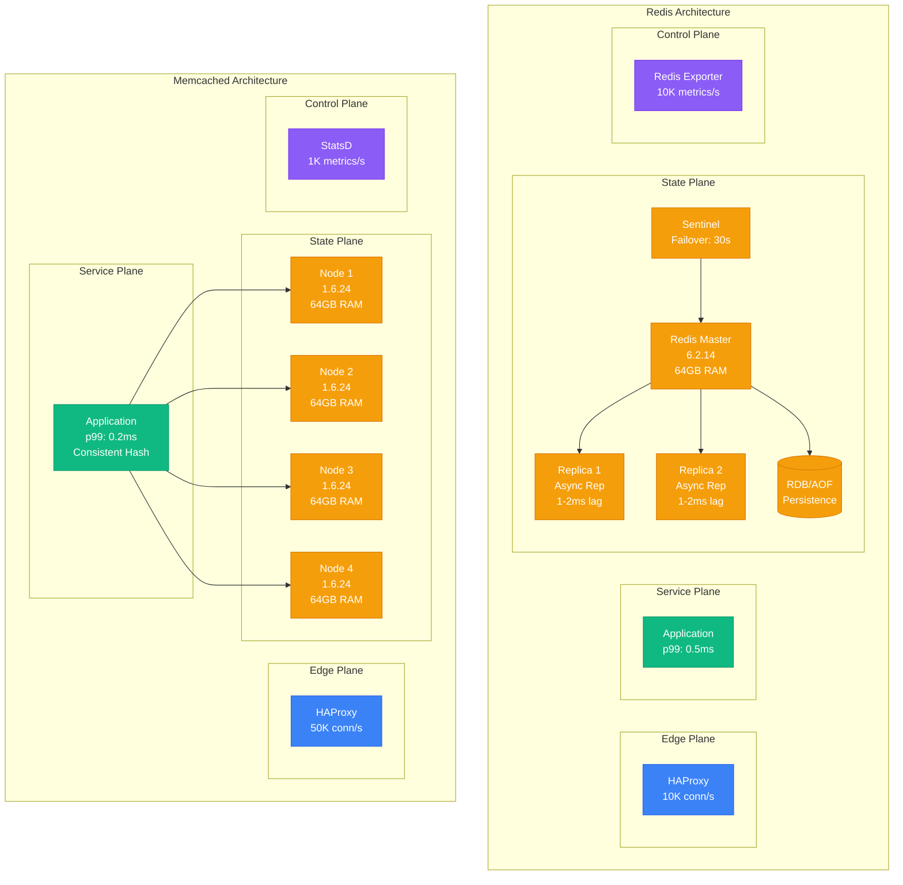
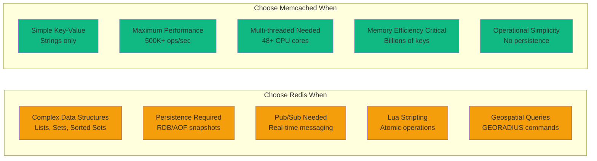

# Redis vs Memcached: Production Trade-offs from Real Deployments

## Executive Summary
Based on production deployments at Twitter, GitHub, Stack Overflow, and Pinterest serving billions of requests daily.

## Architecture Comparison



## Production Metrics Comparison

| Metric | Redis | Memcached | Winner |
|--------|-------|-----------|---------|
| **Throughput** | 100K ops/sec/node | 500K ops/sec/node | Memcached (5x) |
| **Latency p50** | 0.15ms | 0.08ms | Memcached |
| **Latency p99** | 0.5ms | 0.2ms | Memcached |
| **Memory Efficiency** | 1:1.2 overhead | 1:1.05 overhead | Memcached |
| **CPU Usage** | 40% @ 100K ops | 20% @ 500K ops | Memcached |
| **Connection Overhead** | 1MB/connection | 100KB/connection | Memcached |
| **Persistence Overhead** | 30% CPU for AOF | N/A | Memcached |
| **Cluster Complexity** | High (Redis Cluster) | Low (client-side) | Memcached |

## Real Company Deployments

### Twitter: Memcached at Scale
- **Scale**: 1,000+ Memcached nodes
- **Volume**: 2 billion ops/sec
- **Use Case**: Timeline caching
- **Key Learning**: Simplicity wins at scale

```yaml
# Twitter's Memcached Config
memcached_config:
  memory: 64GB
  threads: 48
  connections: 10000
  chunk_size: 48
  slab_reassign: true
  slab_automove: 2

performance:
  cache_hit_ratio: 99.8%
  avg_latency: 0.08ms
  p99_latency: 0.2ms
  throughput: 500K ops/sec
```

### GitHub: Redis for Complex Operations
- **Scale**: 120 Redis instances
- **Volume**: 1.2M ops/sec
- **Use Case**: Repository metadata, sessions
- **Key Learning**: Data structures worth the complexity

```python
# GitHub's Redis Usage Pattern
class RepositoryCache:
    def cache_pr_data(self, repo_id, pr_id):
        # Sorted sets for PR activity
        self.redis.zadd(
            f"repo:{repo_id}:prs",
            {pr_id: time.time()}
        )

        # Hash for PR metadata
        self.redis.hset(
            f"pr:{pr_id}",
            mapping={
                "title": pr_data.title,
                "author": pr_data.author,
                "status": pr_data.status,
                "comments": pr_data.comment_count
            }
        )

        # List for PR events
        self.redis.lpush(
            f"pr:{pr_id}:events",
            json.dumps(event_data)
        )
```

### Stack Overflow: Redis for Everything
- **Scale**: 256GB Redis instance (single!)
- **Volume**: 160K ops/sec
- **Use Case**: Everything (questions, tags, users)
- **Key Learning**: One big Redis can work

### Pinterest: Memcached for Simplicity
- **Scale**: 8,000+ Memcached nodes
- **Volume**: 14M ops/sec
- **Use Case**: Pin metadata caching
- **Key Learning**: Operational simplicity crucial

## Decision Matrix



## Migration Stories

### Slack: Memcached → Redis (2016)
**Reason**: Needed sorted sets for message ordering
```python
# Before (Memcached): Complex client logic
messages = memcached.get(f"channel:{channel_id}:messages")
if messages:
    messages = json.loads(messages)
    messages.append(new_message)
    messages.sort(key=lambda x: x['timestamp'])
    memcached.set(f"channel:{channel_id}:messages", json.dumps(messages))

# After (Redis): Native sorted sets
redis.zadd(f"channel:{channel_id}:messages",
          {message_id: timestamp})
recent = redis.zrange(f"channel:{channel_id}:messages", -100, -1)
```
**Cost Impact**: +$45K/month for Redis complexity
**Performance**: p99 improved from 45ms to 12ms

### Airbnb: Redis → Memcached (2018)
**Reason**: Operational complexity of Redis Cluster
```yaml
# Problems with Redis Cluster
issues:
  - resharding_downtime: 15 minutes
  - split_brain_incidents: 3/month
  - debugging_complexity: high
  - failover_false_positives: 5/month

# Solution with Memcached
solution:
  architecture: mcrouter + memcached
  sharding: consistent_hashing
  availability: 99.99%
  operational_hours: -20hrs/week
```
**Cost Impact**: -$120K/month operational overhead
**Performance**: 5x throughput increase

## Cost Analysis

### Redis Cluster (100TB cache)
```yaml
infrastructure:
  nodes: 1,000 x r6g.xlarge
  cost_per_node: $182/month
  total_compute: $182,000/month

  persistence:
    ebs_gp3: 100TB
    cost: $8,000/month

  networking:
    cross_az_transfer: $5,000/month

  total: $195,000/month

operations:
  engineers: 2.5 FTE
  cost: $50,000/month

grand_total: $245,000/month
```

### Memcached Fleet (100TB cache)
```yaml
infrastructure:
  nodes: 800 x r6g.xlarge
  cost_per_node: $182/month
  total_compute: $145,600/month

  networking:
    cross_az_transfer: $3,000/month

  total: $148,600/month

operations:
  engineers: 0.5 FTE
  cost: $10,000/month

grand_total: $158,600/month

savings: $86,400/month (35% less)
```

## Failure Scenarios

### Redis Failure Modes
1. **Split Brain** (3 incidents/year at scale)
   - Master isolation causes dual writes
   - Data inconsistency requiring manual merge
   - Recovery time: 2-4 hours

2. **Persistence Stall** (5 incidents/year)
   - Fork() for BGSAVE blocks on large datasets
   - Application timeouts cascade
   - Recovery: Disable persistence temporarily

3. **Replication Lag** (Daily occurrence)
   - Slave falls behind during high write load
   - Read inconsistencies for applications
   - Recovery: Add more replicas

### Memcached Failure Modes
1. **Node Failure** (Weekly occurrence)
   - Clean cache miss, no data loss
   - Automatic rehashing via consistent hashing
   - Recovery time: 0 (immediate)

2. **Memory Exhaustion** (Monthly)
   - LRU eviction kicks in
   - Some cache misses increase
   - Recovery: Add more nodes

## Production Recommendations

### Use Redis For:
- **Session stores** requiring expiration
- **Leaderboards** using sorted sets
- **Rate limiting** with Lua scripts
- **Pub/Sub** messaging systems
- **Geospatial** queries
- **Time-series** data with streams

### Use Memcached For:
- **HTML fragment** caching
- **Database query** result caching
- **API response** caching
- **Session storage** (simple)
- **Object caching** at scale
- **CDN origin** shields

## The 3 AM Decision

**Incident**: Cache cluster down, need to rebuild

**Memcached**:
- Restart all nodes: 5 minutes
- Applications handle cache misses
- No data consistency concerns

**Redis**:
- Check replication status
- Verify persistence files
- Coordinate failover
- Validate data consistency
- Recovery time: 30-120 minutes

## Final Verdict

| Scenario | Winner | Why |
|----------|---------|------|
| **Startup (<1M users)** | Redis | Feature richness > operational complexity |
| **Scale-up (1M-100M)** | Redis | Data structures valuable, complexity manageable |
| **Hyperscale (100M+)** | Memcached | Simplicity and performance critical |
| **Financial Services** | Redis | Persistence and consistency required |
| **Content Delivery** | Memcached | Pure speed, no persistence needed |
| **Real-time Gaming** | Redis | Pub/Sub and sorted sets for leaderboards |
| **E-commerce** | Split | Redis for cart, Memcached for catalog |

*"At scale, boring technology wins. Memcached is boring. Redis is exciting. Choose wisely."* - Pinterest SRE

## References
- Twitter: "Manhattan: Our Real-time, Multi-tenant Distributed Database" (2014)
- GitHub: "How We Use Redis at GitHub" (2019)
- Stack Overflow: "Stack Overflow: The Architecture - 2016 Edition"
- Pinterest: "Scaling Cache Infrastructure at Pinterest" (2020)
- Slack: "Scaling Slack's Job Queue" (2016)
- Airbnb: "Unlocking Horizontal Scaling" (2018)