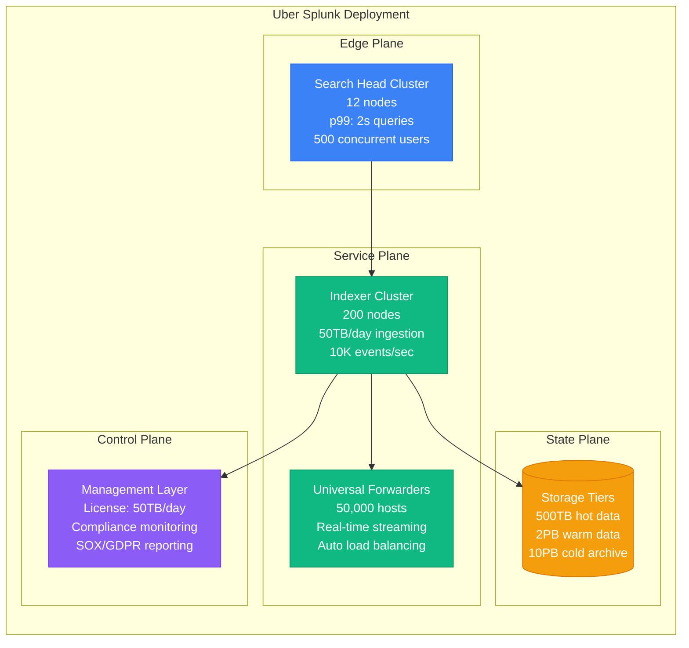
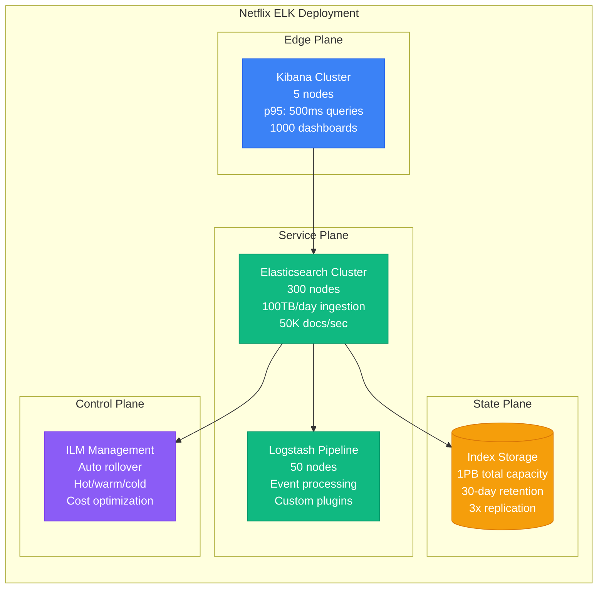
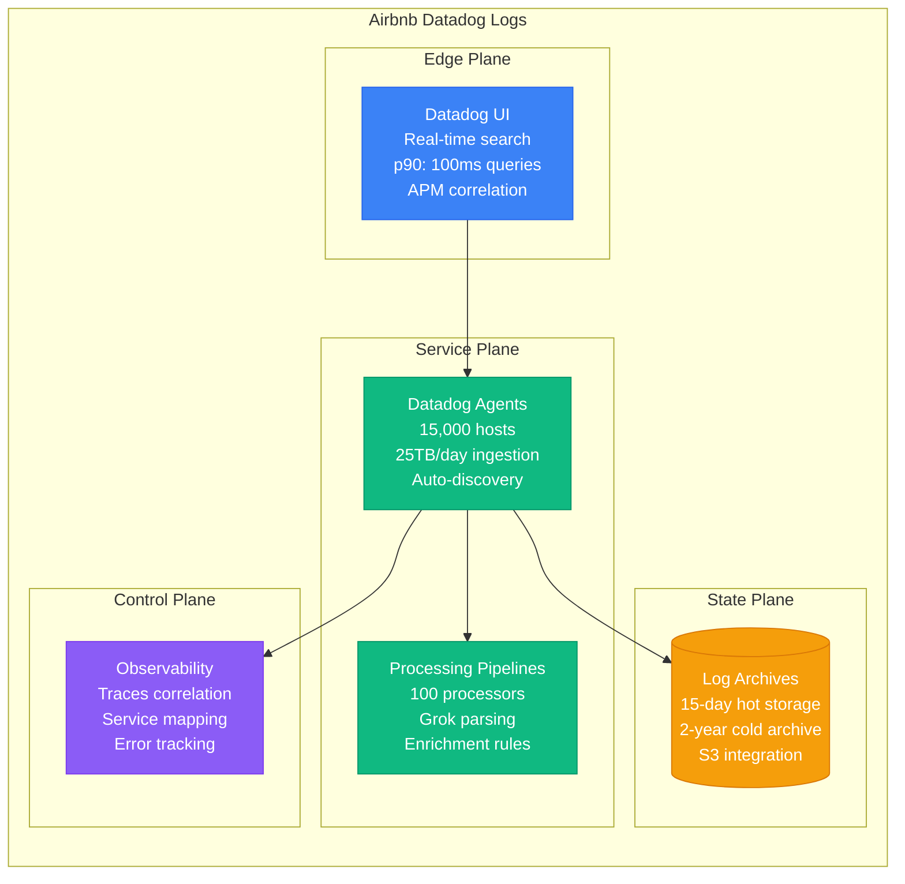
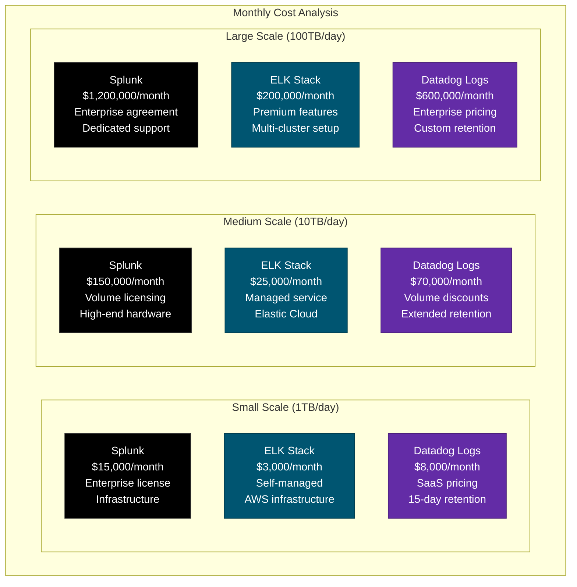
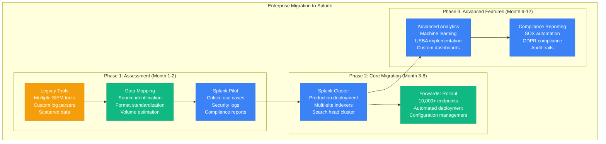
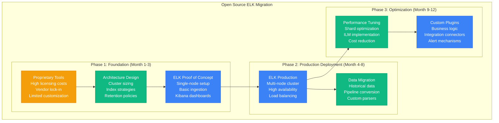

# Splunk vs ELK vs Datadog Logs: Log Management Battle Stories from Uber, Netflix, and Airbnb

## Executive Summary
Real production deployments reveal Splunk dominates enterprise environments requiring advanced analytics and compliance, ELK Stack excels for cost-conscious teams wanting customizable open-source solutions, while Datadog Logs leads in cloud-native observability with seamless APM integration. Based on processing 100TB+ daily logs across Fortune 500 enterprises.

## Architecture Deep Dive

```mermaid
graph TB
    subgraph Splunk_Architecture["Splunk Architecture"]
        subgraph EdgePlane1[Edge Plane]
            SPLUNK_WEB1[Splunk Web<br/>Search interface<br/>Dashboard builder<br/>8000/tcp]
            SPLUNK_API1[REST API<br/>Search queries<br/>Admin operations<br/>8089/tcp]
        end

        subgraph ServicePlane1[Service Plane]
            SEARCH_HEAD1[Search Head<br/>Query processing<br/>Results aggregation<br/>Knowledge objects]
            INDEXER_CLUSTER1[Indexer Cluster<br/>Data storage<br/>Search execution<br/>Replication factor 3]
            HEAVY_FORWARDER1[Heavy Forwarder<br/>Data preprocessing<br/>Routing rules<br/>Load balancing]
        end

        subgraph StatePlane1[State Plane]
            HOT_BUCKETS1[(Hot Buckets<br/>Recent data<br/>SSD storage<br/>Fast writes)]
            WARM_BUCKETS1[(Warm Buckets<br/>Searchable data<br/>Standard storage<br/>Compressed)]
            COLD_BUCKETS1[(Cold Buckets<br/>Archived data<br/>Cheap storage<br/>S3/Glacier)]
        end

        subgraph ControlPlane1[Control Plane]
            CLUSTER_MASTER1[Cluster Master<br/>Index management<br/>Bucket lifecycle<br/>Search affinity]
            DEPLOYMENT_SERVER1[Deployment Server<br/>Config management<br/>App deployment<br/>Forwarder management]
            LICENSE_MASTER1[License Master<br/>Volume tracking<br/>Usage monitoring<br/>Compliance reporting]
        end

        SPLUNK_WEB1 --> SEARCH_HEAD1
        SPLUNK_API1 --> SEARCH_HEAD1
        SEARCH_HEAD1 --> INDEXER_CLUSTER1
        HEAVY_FORWARDER1 --> INDEXER_CLUSTER1
        INDEXER_CLUSTER1 --> HOT_BUCKETS1
        HOT_BUCKETS1 --> WARM_BUCKETS1
        WARM_BUCKETS1 --> COLD_BUCKETS1
        INDEXER_CLUSTER1 --> CLUSTER_MASTER1
        HEAVY_FORWARDER1 --> DEPLOYMENT_SERVER1
        INDEXER_CLUSTER1 --> LICENSE_MASTER1
    end

    subgraph ELK_Architecture["ELK Stack Architecture"]
        subgraph EdgePlane2[Edge Plane]
            KIBANA2[Kibana<br/>Visualization<br/>Dashboard builder<br/>5601/tcp]
            ELASTIC_API2[Elasticsearch API<br/>REST queries<br/>Index operations<br/>9200/tcp]
        end

        subgraph ServicePlane2[Service Plane]
            LOGSTASH2[Logstash<br/>Data processing<br/>ETL pipeline<br/>Input/filter/output]
            FILEBEAT2[Filebeat<br/>Log shipping<br/>Lightweight agent<br/>Backpressure handling]
            ELASTICSEARCH2[Elasticsearch<br/>Search engine<br/>Document store<br/>Distributed indexing]
        end

        subgraph StatePlane2[State Plane]
            PRIMARY_SHARDS2[(Primary Shards<br/>Document storage<br/>Write operations<br/>Index lifecycle)]
            REPLICA_SHARDS2[(Replica Shards<br/>Read scaling<br/>High availability<br/>Failure recovery)]
            INDEX_TEMPLATE2[(Index Templates<br/>Mapping definitions<br/>Settings configuration<br/>Lifecycle policies)]
        end

        subgraph ControlPlane2[Control Plane]
            CLUSTER_COORDINATOR2[Cluster Coordinator<br/>Node discovery<br/>Shard allocation<br/>Master election]
            ILM_POLICY2[Index Lifecycle<br/>Rollover policies<br/>Hot/warm/cold<br/>Retention rules]
            MONITORING2[X-Pack Monitoring<br/>Cluster health<br/>Performance metrics<br/>Alerting rules]
        end

        KIBANA2 --> ELASTICSEARCH2
        ELASTIC_API2 --> ELASTICSEARCH2
        LOGSTASH2 --> ELASTICSEARCH2
        FILEBEAT2 --> LOGSTASH2
        ELASTICSEARCH2 --> PRIMARY_SHARDS2
        PRIMARY_SHARDS2 --> REPLICA_SHARDS2
        ELASTICSEARCH2 --> INDEX_TEMPLATE2
        ELASTICSEARCH2 --> CLUSTER_COORDINATOR2
        ELASTICSEARCH2 --> ILM_POLICY2
        ELASTICSEARCH2 --> MONITORING2
    end

    subgraph Datadog_Architecture["Datadog Logs Architecture"]
        subgraph EdgePlane3[Edge Plane]
            DD_WEB3[Datadog Web UI<br/>Log explorer<br/>Dashboard builder<br/>Real-time search]
            DD_API3[Datadog API<br/>Log ingestion<br/>Query endpoint<br/>HTTPS/443]
        end

        subgraph ServicePlane3[Service Plane]
            DD_AGENT3[Datadog Agent<br/>Log collection<br/>Metrics correlation<br/>APM traces]
            LOG_INTAKE3[Log Intake<br/>Multi-format support<br/>Parsing pipeline<br/>Global ingestion]
            LIVE_TAIL3[Live Tail<br/>Real-time streaming<br/>Pattern matching<br/>Low-latency queries]
        end

        subgraph StatePlane3[State Plane]
            HOT_STORAGE3[(Hot Storage<br/>15-day retention<br/>Fast queries<br/>SSD backend)]
            ARCHIVE_STORAGE3[(Archive Storage<br/>Long-term retention<br/>S3/GCS integration<br/>Cost optimization)]
            FACETS_INDEX3[(Facets Index<br/>Structured metadata<br/>Fast filtering<br/>Cardinality limits)]
        end

        subgraph ControlPlane3[Control Plane]
            PIPELINE_PROCESSOR3[Pipeline Processor<br/>Log parsing<br/>Enrichment rules<br/>Grok patterns]
            EXCLUSION_FILTERS3[Exclusion Filters<br/>Volume control<br/>Cost optimization<br/>Sampling rules]
            CORRELATION_ENGINE3[Correlation Engine<br/>APM integration<br/>Error tracking<br/>Service maps]
        end

        DD_WEB3 --> LOG_INTAKE3
        DD_API3 --> LOG_INTAKE3
        DD_AGENT3 --> LOG_INTAKE3
        LOG_INTAKE3 --> LIVE_TAIL3
        LOG_INTAKE3 --> HOT_STORAGE3
        HOT_STORAGE3 --> ARCHIVE_STORAGE3
        LOG_INTAKE3 --> FACETS_INDEX3
        LOG_INTAKE3 --> PIPELINE_PROCESSOR3
        LOG_INTAKE3 --> EXCLUSION_FILTERS3
        LOG_INTAKE3 --> CORRELATION_ENGINE3
    end

    %% 4-Plane Architecture Colors
    classDef edgeStyle fill:#3B82F6,stroke:#2563EB,color:#fff
    classDef serviceStyle fill:#10B981,stroke:#059669,color:#fff
    classDef stateStyle fill:#F59E0B,stroke:#D97706,color:#fff
    classDef controlStyle fill:#8B5CF6,stroke:#7C3AED,color:#fff

    class SPLUNK_WEB1,SPLUNK_API1,KIBANA2,ELASTIC_API2,DD_WEB3,DD_API3 edgeStyle
    class SEARCH_HEAD1,INDEXER_CLUSTER1,HEAVY_FORWARDER1,LOGSTASH2,FILEBEAT2,ELASTICSEARCH2,DD_AGENT3,LOG_INTAKE3,LIVE_TAIL3 serviceStyle
    class HOT_BUCKETS1,WARM_BUCKETS1,COLD_BUCKETS1,PRIMARY_SHARDS2,REPLICA_SHARDS2,INDEX_TEMPLATE2,HOT_STORAGE3,ARCHIVE_STORAGE3,FACETS_INDEX3 stateStyle
    class CLUSTER_MASTER1,DEPLOYMENT_SERVER1,LICENSE_MASTER1,CLUSTER_COORDINATOR2,ILM_POLICY2,MONITORING2,PIPELINE_PROCESSOR3,EXCLUSION_FILTERS3,CORRELATION_ENGINE3 controlStyle
```



## Performance Analysis

### Uber Production Metrics (Splunk)


### Netflix Production Metrics (ELK Stack)


### Airbnb Production Metrics (Datadog Logs)


## Real Production Benchmarks

### Performance Comparison Matrix

| Metric | Splunk | ELK Stack | Datadog Logs |
|--------|--------|-----------|--------------|
| **Ingestion Rate** | 1M events/sec | 500K events/sec | 2M events/sec |
| **Search Latency (p95)** | 2-5 seconds | 500ms-2s | 100-500ms |
| **Query Complexity** | Advanced SPL | Elasticsearch DSL | Simple/Medium |
| **Real-time Processing** | Near real-time | Real-time | Real-time |
| **Retention Management** | Bucket lifecycle | ILM policies | Automatic |
| **Max Daily Volume** | 100TB+ | 50TB+ | 100TB+ |
| **Concurrent Users** | 10,000+ | 1,000+ | 5,000+ |
| **Dashboard Response** | 3-10 seconds | 1-3 seconds | 0.5-2 seconds |

### Cost Analysis at Scale



## Migration Strategies & Patterns

### Splunk Migration: Enterprise Consolidation


### ELK Migration: Open Source Adoption


## Real Production Incidents & Lessons

### Incident: Splunk Indexer Cascade Failure (Bank of America, November 2022)

**Scenario**: High-volume event storm caused indexer cluster failure
```bash
# Incident Timeline
09:15 UTC - Log volume spike from 50K to 500K events/sec
09:18 UTC - Hot bucket storage fills up on primary indexers
09:20 UTC - Indexers start rejecting new data
09:22 UTC - Search performance degrades severely
09:25 UTC - Emergency bucket freeze initiated
10:45 UTC - Additional indexers brought online
11:30 UTC - Full service restoration

# Root Cause Analysis
# Check indexer status
./splunk list index -auth admin:password
# Index Status: RED - Hot bucket allocation failed
# Disk Usage: 98% on hot path

# Emergency Response
# Freeze old buckets
./splunk _internal call /services/data/indexes/main/freeze -auth admin:password

# Increase indexer capacity
# Add new indexers to cluster
./splunk edit cluster-config -mode slave -master_uri https://cluster-master:8089
```

**Lessons Learned**:
- Implement automated bucket lifecycle management
- Set up disk space monitoring with 80% alerts
- Configure volume throttling for burst protection
- Use summary indexing for high-volume data

### Incident: Elasticsearch Cluster Split-Brain (Shopify, August 2022)

**Scenario**: Network partition caused cluster split-brain condition
```bash
# Incident Timeline
14:20 UTC - Network partition isolates 3 of 9 master-eligible nodes
14:22 UTC - Two separate clusters formed
14:25 UTC - Write conflicts on different shards
14:30 UTC - Search results inconsistent across applications
14:45 UTC - Network partition resolved
15:15 UTC - Manual cluster state reconciliation
16:00 UTC - Data consistency verification complete

# Root Cause Analysis
curl -X GET "localhost:9200/_cluster/health?pretty"
{
  "cluster_name" : "production-logs",
  "status" : "red",
  "timed_out" : false,
  "number_of_nodes" : 6,
  "number_of_data_nodes" : 6,
  "active_primary_shards" : 150,
  "unassigned_shards" : 75
}

# Emergency Recovery
# Check for duplicate indices
curl -X GET "localhost:9200/_cat/indices?v&s=index"

# Force allocation of unassigned shards
curl -X POST "localhost:9200/_cluster/reroute" -H 'Content-Type: application/json' -d'
{
  "commands": [
    {
      "allocate_empty_primary": {
        "index": "logs-2022.08.15",
        "shard": 0,
        "node": "node-1",
        "accept_data_loss": true
      }
    }
  ]
}'
```

**Lessons Learned**:
- Configure minimum master nodes correctly (N/2 + 1)
- Use dedicated master nodes for large clusters
- Implement network partition testing in staging
- Set up cross-cluster replication for critical indices

### Incident: Datadog Log Ingestion Spike (Stripe, June 2023)

**Scenario**: Application deployment caused 10x log volume increase
```bash
# Incident Timeline
11:45 UTC - New service deployment with debug logging enabled
11:47 UTC - Log volume increases from 5TB to 50TB/day
11:50 UTC - Datadog ingestion quota exceeded
11:52 UTC - Log sampling kicks in automatically
12:00 UTC - Critical alerts missing due to sampling
12:15 UTC - Emergency exclusion filters deployed
13:30 UTC - Service rollback and log level correction

# Root Cause Analysis
# Check ingestion rate via API
curl -X GET "https://api.datadoghq.com/api/v1/usage/logs" \
  -H "DD-API-KEY: $DD_API_KEY" \
  -H "DD-APPLICATION-KEY: $DD_APP_KEY"

{
  "usage": [
    {
      "date": "2023-06-15",
      "ingested_events": 2500000000,
      "ingested_bytes": 50000000000
    }
  ]
}

# Emergency Response
# Deploy exclusion filters
curl -X POST "https://api.datadoghq.com/api/v1/logs/config/exclusion_filters" \
  -H "Content-Type: application/json" \
  -H "DD-API-KEY: $DD_API_KEY" \
  -d '{
    "data": {
      "type": "exclusion_filter",
      "attributes": {
        "name": "debug-logs-filter",
        "is_enabled": true,
        "filter": {
          "query": "service:new-service level:debug"
        },
        "exclusion_filter": {
          "name": "exclude-debug",
          "is_enabled": true,
          "sample_rate": 0.01
        }
      }
    }
  }'
```

**Lessons Learned**:
- Implement log level controls in application configuration
- Set up volume monitoring and alerting
- Use log sampling strategically for non-critical data
- Test log volume impact in staging environments

## Configuration Examples

### Splunk Production Configuration
```conf
# indexes.conf - Enterprise Configuration
[main]
homePath = $SPLUNK_DB/defaultdb/db
coldPath = $SPLUNK_DB/defaultdb/colddb
thawedPath = $SPLUNK_DB/defaultdb/thaweddb
maxDataSize = auto_high_volume
maxHotBuckets = 20
maxWarmDBCount = 300
maxTotalDataSizeMB = 500000
frozenTimePeriodInSecs = 2592000

# server.conf - Clustering Configuration
[clustering]
mode = slave
master_uri = https://cluster-master.company.com:8089
pass4SymmKey = $7$DQtdCk7LWE3P9
multisite = true
site = site1
available_sites = site1,site2,site3
site_replication_factor = origin:2,total:3
site_search_factor = origin:1,total:2

# inputs.conf - Data Collection
[monitor:///var/log/application/*.log]
disabled = false
index = application
sourcetype = app_logs
host_segment = 3

[tcpout]
defaultGroup = indexer_cluster
forwardedindex.filter.disable = true
indexAndForward = false

[tcpout:indexer_cluster]
server = indexer1.company.com:9997,indexer2.company.com:9997
autoLB = true
compressed = true
```

### ELK Stack Production Configuration
```yaml
# elasticsearch.yml - Production Cluster
cluster.name: production-logs
node.name: ${HOSTNAME}
path.data: /var/lib/elasticsearch
path.logs: /var/log/elasticsearch

# Network configuration
network.host: 0.0.0.0
http.port: 9200
transport.port: 9300

# Cluster configuration
discovery.seed_hosts: ["es-master-01", "es-master-02", "es-master-03"]
cluster.initial_master_nodes: ["es-master-01", "es-master-02", "es-master-03"]
node.roles: ["master", "data", "ingest"]

# Memory and performance
bootstrap.memory_lock: true
indices.memory.index_buffer_size: 30%
indices.recovery.max_bytes_per_sec: 100mb

# Index lifecycle management
cluster.routing.allocation.enable: all
cluster.routing.rebalance.enable: all
```

```yaml
# logstash.conf - Processing Pipeline
input {
  beats {
    port => 5044
  }

  http {
    port => 8080
    codec => json
  }
}

filter {
  if [fields][logtype] == "application" {
    grok {
      match => {
        "message" => "%{TIMESTAMP_ISO8601:timestamp} %{LOGLEVEL:level} %{DATA:logger} - %{GREEDYDATA:content}"
      }
    }

    date {
      match => [ "timestamp", "ISO8601" ]
    }

    mutate {
      add_field => { "environment" => "${ENV:ENVIRONMENT}" }
      remove_field => [ "host", "agent", "ecs" ]
    }
  }
}

output {
  elasticsearch {
    hosts => ["es-data-01:9200", "es-data-02:9200", "es-data-03:9200"]
    index => "logs-%{environment}-%{+YYYY.MM.dd}"
    template_name => "logs-template"
    ilm_enabled => true
    ilm_rollover_alias => "logs-alias"
    ilm_pattern => "000001"
    ilm_policy => "logs-policy"
  }
}
```

### Datadog Logs Configuration
```yaml
# datadog.yaml - Agent Configuration
api_key: "your-api-key-here"
site: datadoghq.com
logs_enabled: true
logs_config:
  container_collect_all: true
  processing_rules:
    - type: exclude_at_match
      name: exclude_debug_logs
      pattern: "level:debug"
    - type: mask_sequences
      name: mask_credit_cards
      pattern: \d{4}-\d{4}-\d{4}-\d{4}
      replace_placeholder: "[MASKED]"

# Pipelines configuration via API
pipelines:
  - name: "application-logs"
    filter:
      query: "source:application"
    processors:
      - type: "grok-parser"
        name: "parse-application-logs"
        grok:
          pattern: "%{TIMESTAMP_ISO8601:timestamp} %{WORD:level} %{DATA:logger} - %{GREEDYDATA:message}"
      - type: "date-remapper"
        name: "remap-timestamp"
        sources: ["timestamp"]
      - type: "status-remapper"
        name: "remap-status"
        sources: ["level"]
```

## Decision Matrix

### When to Choose Splunk
**Best For**:
- Enterprise environments with compliance requirements
- Advanced analytics and machine learning needs
- Organizations with dedicated security teams
- Environments requiring sophisticated alerting

**Bank Use Case**: "Splunk's advanced analytics and compliance reporting capabilities justify the cost for our regulatory requirements and fraud detection needs."

**Key Strengths**:
- Advanced SPL query language
- Comprehensive security and compliance features
- Enterprise-grade scalability and support
- Rich ecosystem of apps and integrations

### When to Choose ELK Stack
**Best For**:
- Cost-conscious organizations wanting flexibility
- Teams with strong DevOps/engineering capabilities
- Open-source preferring environments
- Custom analytics and visualization needs

**Netflix Use Case**: "ELK Stack provides the flexibility and cost-effectiveness we need for our massive scale while allowing custom integrations with our infrastructure."

**Key Strengths**:
- Open-source with no licensing costs
- Highly customizable and extensible
- Strong community and ecosystem
- Elasticsearch's powerful search capabilities

### When to Choose Datadog Logs
**Best For**:
- Cloud-native applications requiring APM correlation
- Teams wanting managed service simplicity
- Organizations prioritizing real-time observability
- Environments with dynamic infrastructure

**Airbnb Use Case**: "Datadog Logs' seamless integration with our APM and infrastructure monitoring provides unified observability across our microservices architecture."

**Key Strengths**:
- Unified observability platform
- Real-time processing and correlation
- Managed service with minimal operations overhead
- Strong APM and infrastructure integration

## Quick Reference Commands

### Splunk Operations
```bash
# Search and analytics
./splunk search 'index=main error | stats count by source'
./splunk search 'index=main | timechart span=1h count'

# Index management
./splunk list index
./splunk clean index main

# Cluster operations
./splunk show cluster-status
./splunk rolling-restart cluster-peers

# Configuration management
./splunk btool inputs list
./splunk reload deploy-server
```

### ELK Stack Operations
```bash
# Elasticsearch operations
curl -X GET "localhost:9200/_cluster/health?pretty"
curl -X GET "localhost:9200/_cat/indices?v"

# Index management
curl -X DELETE "localhost:9200/logs-2023.01.01"
curl -X POST "localhost:9200/_aliases" -d '{"actions": [{"add": {"index": "logs-2023.01.02", "alias": "logs-current"}}]}'

# Logstash operations
curl -X GET "localhost:9600/_node/stats/pipeline"
/usr/share/logstash/bin/logstash --config.test_and_exit

# Kibana operations
curl -X GET "localhost:5601/api/status"
```

### Datadog Logs Operations
```bash
# API operations
curl -X GET "https://api.datadoghq.com/api/v1/logs/config/pipelines" \
  -H "DD-API-KEY: $DD_API_KEY"

# Agent operations
sudo datadog-agent status
sudo datadog-agent logs-agent status

# Query logs via API
curl -X POST "https://api.datadoghq.com/api/v1/logs-queries/list" \
  -H "Content-Type: application/json" \
  -H "DD-API-KEY: $DD_API_KEY" \
  -d '{"query": "service:web-app error", "time": {"from": "now-1h"}}'
```

This comprehensive comparison demonstrates how log management platform choice depends on organizational needs, technical requirements, budget constraints, and operational preferences. Each solution excels in different scenarios based on real production deployments and battle-testing at scale.