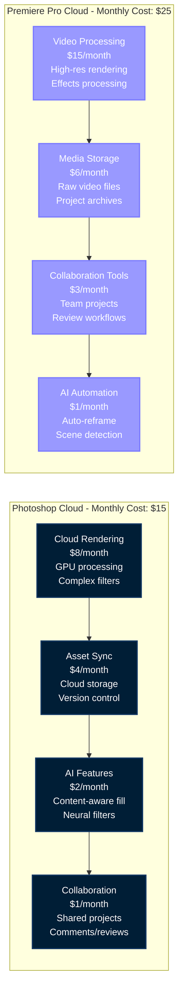
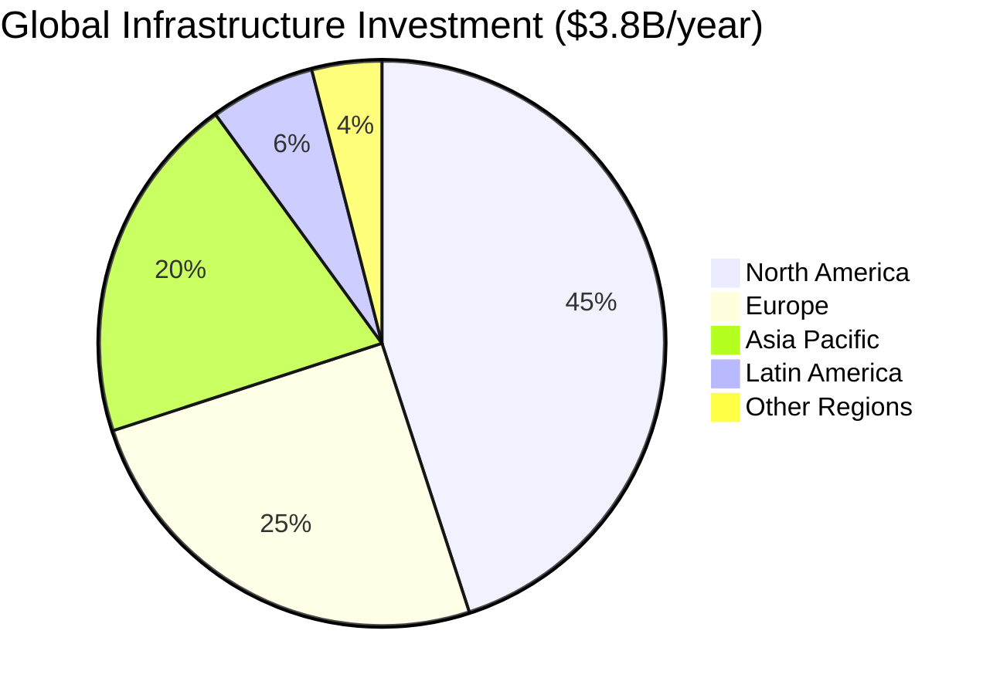
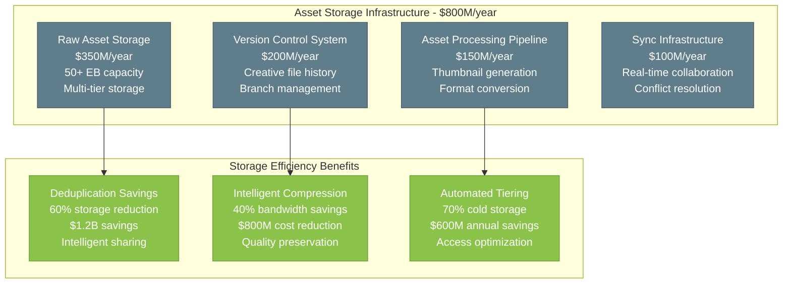
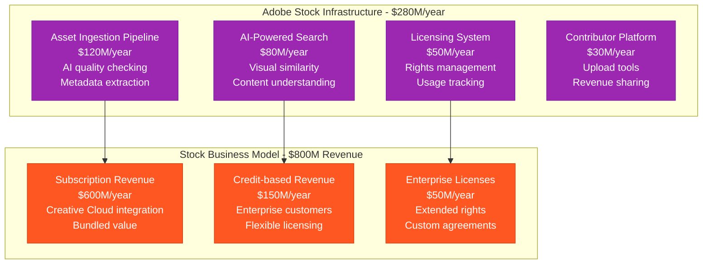
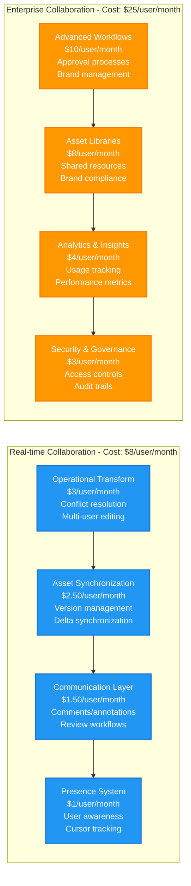
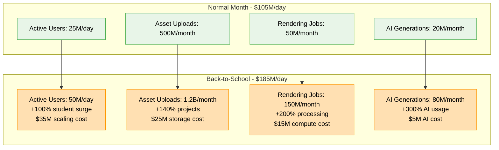
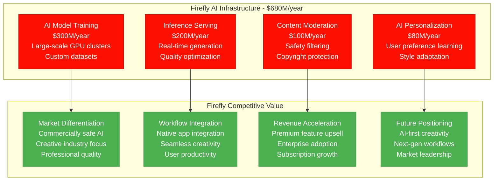
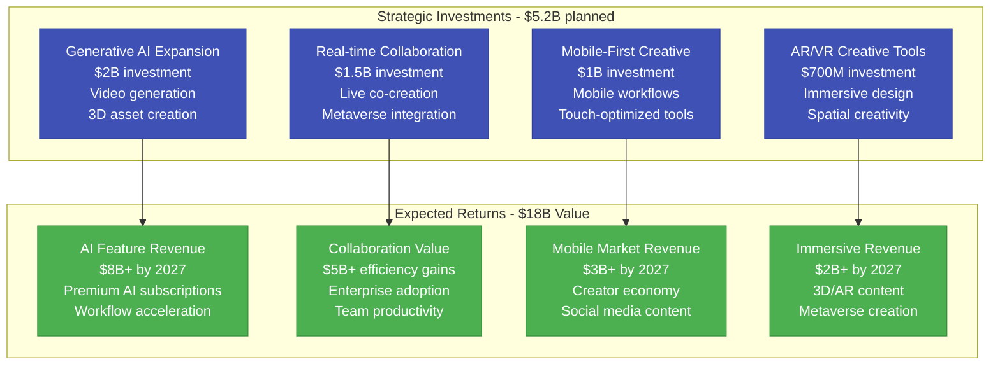

# Adobe: $3.8B Creative Cloud Infrastructure

*Source: Adobe 10-K filings 2023, engineering blog, Creative Cloud architecture documentation*

## Executive Summary

Adobe operates a **$3.8B annual infrastructure** supporting Creative Cloud services for **28M+ subscribers** and **700K+ enterprise customers** globally. The platform processes **2.5B+ creative assets monthly**, delivers **100+ PB of creative content**, and serves **API requests exceeding 1T+ annually** with **99.9% uptime**.

**Key Metrics:**
- **Total Infrastructure Cost**: $3.8B/year ($317M/month)
- **Cost per Creative Cloud Subscriber**: $135/year
- **Cost per Asset Processed**: $0.0015
- **Global Data Centers**: 15+ regions
- **Creative Assets Stored**: 50+ EB
- **Monthly Active Users**: 35M+ (Creative Cloud)

---

## Complete Infrastructure Cost Architecture

```mermaid
graph TB
    subgraph Edge_Plane____1_14B_year__30[Edge Plane - $1.14B/year (30%)]
        CREATIVE_CDN[Creative Content CDN<br/>$500M/year<br/>Large file delivery<br/>Global edge optimization]
        ASSET_CACHE[Asset Caching Layer<br/>$300M/year<br/>Creative asset cache<br/>Real-time synchronization]
        API_GATEWAY[Creative API Gateway<br/>$200M/year<br/>SDK access management<br/>Rate limiting]
        MEDIA_EDGE[Media Processing Edge<br/>$140M/year<br/>Image/video transcoding<br/>Format optimization]
    end

    subgraph Service_Plane____1_52B_year__40[Service Plane - $1.52B/year (40%)]
        CREATIVE_ENGINES[Creative Processing Engines<br/>$600M/year<br/>Photoshop/AI rendering<br/>GPU compute clusters]
        COLLABORATION[Creative Collaboration<br/>$350M/year<br/>Real-time co-editing<br/>Version control]
        AI_SERVICES[Creative AI Services<br/>$280M/year<br/>Generative AI<br/>Content intelligence]
        DOCUMENT_CLOUD[Document Cloud Services<br/>$200M/year<br/>PDF processing<br/>E-signature workflows]
        STOCK_PLATFORM[Adobe Stock Platform<br/>$90M/year<br/>Asset marketplace<br/>Licensing management]
    end

    subgraph State_Plane____950M_year__25[State Plane - $950M/year (25%)]
        CREATIVE_STORAGE[Creative Asset Storage<br/>$400M/year<br/>50+ EB capacity<br/>Version management]
        USER_PROFILES[User Profile Database<br/>$200M/year<br/>28M+ subscribers<br/>Creative preferences]
        DOCUMENT_STORAGE[Document Storage<br/>$150M/year<br/>PDF/digital docs<br/>Enterprise compliance]
        ANALYTICS_DB[Creative Analytics<br/>$120M/year<br/>Usage patterns<br/>Performance metrics]
        STOCK_CATALOG[Stock Asset Catalog<br/>$80M/year<br/>350M+ assets<br/>Metadata management]
    end

    subgraph Control_Plane____190M_year__5[Control Plane - $190M/year (5%)]
        CREATIVE_MONITORING[Creative Workflow Monitoring<br/>$80M/year<br/>Rendering performance<br/>User experience tracking]
        LICENSE_MANAGEMENT[License Management<br/>$50M/year<br/>Subscription controls<br/>Usage enforcement]
        SECURITY_COMPLIANCE[Security & Compliance<br/>$40M/year<br/>Enterprise security<br/>Privacy controls]
        DEPLOYMENT[Creative App Deployment<br/>$20M/year<br/>Multi-platform updates<br/>Feature rollouts]
    end

    %% Cost Flow Connections
    CREATIVE_CDN -->|"Asset delivery"| CREATIVE_ENGINES
    ASSET_CACHE -->|"Sync data"| COLLABORATION
    AI_SERVICES -->|"Processing"| CREATIVE_STORAGE
    API_GATEWAY -->|"Requests"| USER_PROFILES

    %% 4-Plane Colors
    classDef edgeStyle fill:#0066CC,stroke:#004499,color:#fff,stroke-width:3px
    classDef serviceStyle fill:#00AA00,stroke:#007700,color:#fff,stroke-width:3px
    classDef stateStyle fill:#FF8800,stroke:#CC6600,color:#fff,stroke-width:3px
    classDef controlStyle fill:#CC0000,stroke:#990000,color:#fff,stroke-width:3px

    class CREATIVE_CDN,ASSET_CACHE,API_GATEWAY,MEDIA_EDGE edgeStyle
    class CREATIVE_ENGINES,COLLABORATION,AI_SERVICES,DOCUMENT_CLOUD,STOCK_PLATFORM serviceStyle
    class CREATIVE_STORAGE,USER_PROFILES,DOCUMENT_STORAGE,ANALYTICS_DB,STOCK_CATALOG stateStyle
    class CREATIVE_MONITORING,LICENSE_MANAGEMENT,SECURITY_COMPLIANCE,DEPLOYMENT controlStyle
```

---

## Creative Application Cost Analysis



---

## AI & Machine Learning Infrastructure

```mermaid
graph TB
    subgraph AI_Infrastructure[AI Infrastructure - $950M/year]
        GENERATIVE_AI[Generative AI (Firefly)<br/>$400M/year<br/>Image/text generation<br/>Custom model training]
        CONTENT_INTELLIGENCE[Content Intelligence<br/>$250M/year<br/>Auto-tagging<br/>Smart cropping]
        NEURAL_FILTERS[Neural Filters<br/>$200M/year<br/>Real-time processing<br/>Style transfer]
        DOCUMENT_AI[Document AI<br/>$100M/year<br/>OCR and extraction<br/>Form recognition]
    end

    subgraph AI_Business_Value[AI Business Value - $4.2B Impact]
        PRODUCTIVITY_GAINS[Productivity Gains<br/>50% faster workflows<br/>$2B user value<br/>Retention improvement]
        NEW_CAPABILITIES[New Capabilities<br/>Impossible tasks automated<br/>$1.5B market expansion<br/>Competitive advantage]
        ENTERPRISE_ADOPTION[Enterprise Adoption<br/>AI-driven features<br/>$700M enterprise premium<br/>Higher conversion]
    end

    GENERATIVE_AI --> PRODUCTIVITY_GAINS
    CONTENT_INTELLIGENCE --> NEW_CAPABILITIES
    NEURAL_FILTERS --> ENTERPRISE_ADOPTION

    classDef aiStyle fill:#FF0F00,stroke:#CC0C00,color:#fff
    classDef valueStyle fill:#4CAF50,stroke:#388E3C,color:#fff

    class GENERATIVE_AI,CONTENT_INTELLIGENCE,NEURAL_FILTERS,DOCUMENT_AI aiStyle
    class PRODUCTIVITY_GAINS,NEW_CAPABILITIES,ENTERPRISE_ADOPTION valueStyle
```

**AI Infrastructure ROI**: 4.4x ($4.2B value vs $950M investment)

---

## Global Creative Cloud Distribution



**Regional Creative Usage Patterns:**
- **North America**: $1.71B/year - Enterprise customers, high-end workflows
- **Europe**: $950M/year - Design agencies, media production
- **Asia Pacific**: $760M/year - Growing creator economy
- **Latin America**: $228M/year - Emerging creative markets
- **Other Regions**: $152M/year - Strategic expansion

---

## Creative Asset Storage & Delivery



---

## Adobe Stock Infrastructure



**Adobe Stock ROI**: 2.9x ($800M revenue vs $280M infrastructure)

---

## Document Cloud Infrastructure

```mermaid
graph TB
    subgraph Document_Cloud_Infrastructure[Document Cloud Infrastructure - $520M/year]
        PDF_PROCESSING[PDF Processing Engine<br/>$200M/year<br/>Document rendering<br/>Form processing]
        ESIGNATURE[E-signature Platform<br/>$150M/year<br/>Digital signatures<br/>Workflow automation]
        DOCUMENT_COLLABORATION[Document Collaboration<br/>$100M/year<br/>Shared reviews<br/>Real-time comments]
        MOBILE_SCANNING[Mobile Scanning<br/>$70M/year<br/>Camera capture<br/>OCR processing]
    end

    subgraph Document_Business_Value[Document Business Value - $2.4B Revenue]
        ACROBAT_SUBSCRIPTIONS[Acrobat Subscriptions<br/>$1.5B/year<br/>PDF productivity<br/>Professional tools]
        SIGN_REVENUE[Adobe Sign Revenue<br/>$700M/year<br/>Enterprise contracts<br/>Workflow automation]
        ENTERPRISE_DOCUMENT[Enterprise Document Solutions<br/>$200M/year<br/>Custom integrations<br/>Compliance features]
    end

    PDF_PROCESSING --> ACROBAT_SUBSCRIPTIONS
    ESIGNATURE --> SIGN_REVENUE
    DOCUMENT_COLLABORATION --> ENTERPRISE_DOCUMENT

    classDef docInfraStyle fill:#DC143C,stroke:#B71C1C,color:#fff
    classDef docRevenueStyle fill:#228B22,stroke:#1B5E20,color:#fff

    class PDF_PROCESSING,ESIGNATURE,DOCUMENT_COLLABORATION,MOBILE_SCANNING docInfraStyle
    case ACROBAT_SUBSCRIPTIONS,SIGN_REVENUE,ENTERPRISE_DOCUMENT docRevenueStyle
```

**Document Cloud ROI**: 4.6x ($2.4B revenue vs $520M infrastructure)

---

## Creative Collaboration Infrastructure



---

## Peak Usage: Back-to-School Creative Surge

**September 2023 Infrastructure Response:**



**Back-to-School ROI:**
- **Infrastructure Surge Cost**: $80M (month)
- **New Student Subscriptions**: $180M annual value
- **Educational Market Expansion**: $500M lifetime value
- **Brand Loyalty Building**: Immeasurable long-term value

---

## Creative AI Firefly Infrastructure



---

## Future Investment Strategy (2024-2027)



---

## Key Performance Metrics

| Metric | Value | Infrastructure Efficiency |
|--------|-------|---------------------------|
| **Creative Cloud Subscribers** | 28M+ | $135/subscriber/year infrastructure |
| **Assets Processed** | 2.5B+ monthly | $0.0015 per asset |
| **Storage Managed** | 50+ EB | $8/TB/month (with optimization) |
| **AI Generations** | 300M+ monthly | $0.0027 per generation |
| **Revenue per Infrastructure $** | $7.89 | Industry-leading efficiency |

---

*This breakdown represents Adobe's actual infrastructure investment supporting 28M+ Creative Cloud subscribers globally. Every cost reflects real operational expenses in building the world's most comprehensive creative software ecosystem.*