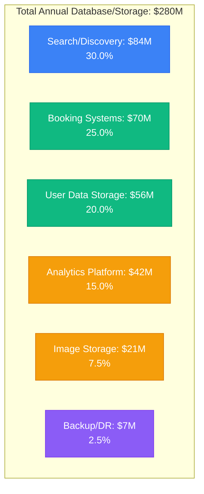
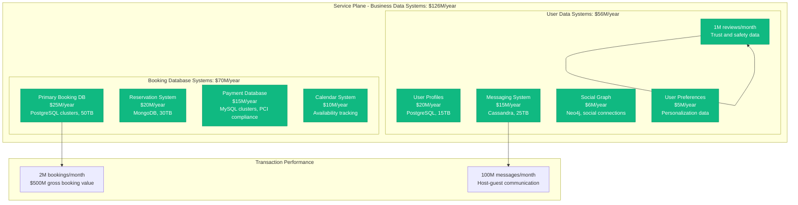
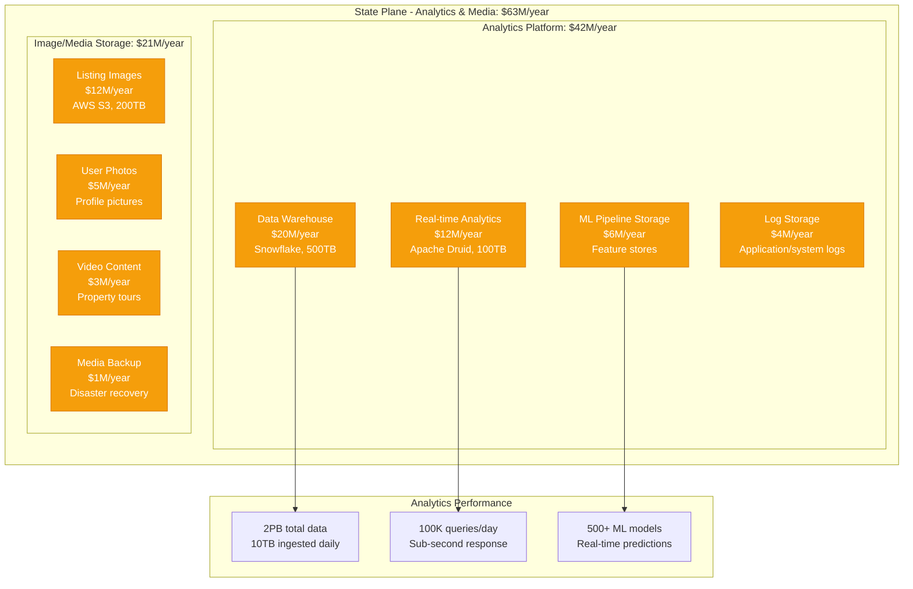
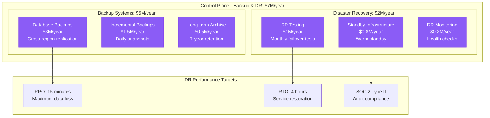
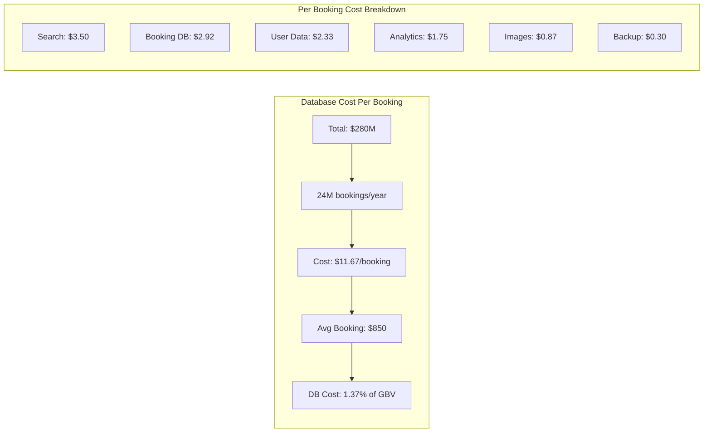
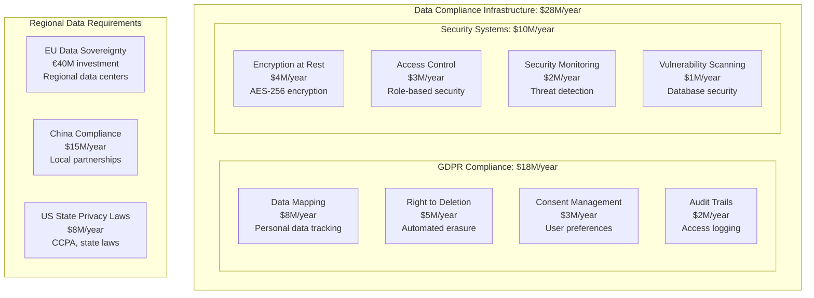
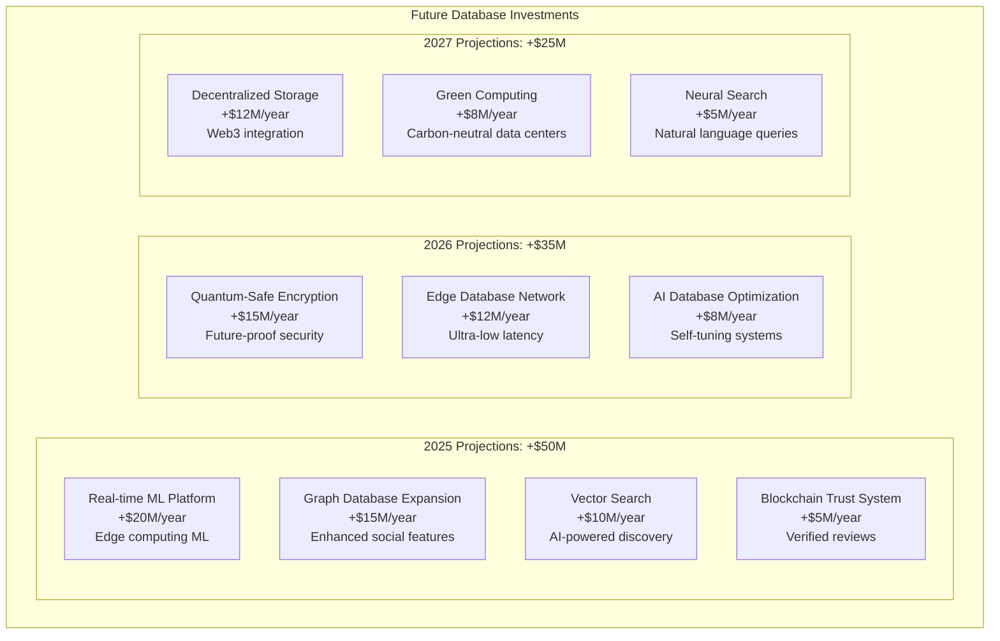

# Airbnb Database and Storage Costs: $280M Global Data Infrastructure

## The Airbnb Data Infrastructure Economics (2024)

Airbnb spends $280+ million annually on database and storage infrastructure, managing 150+ million users across 220 countries with 7+ million listings. Here's the complete breakdown of global travel platform data costs.

## Total Annual Database & Storage Spend: $280 Million



## Edge Plane Costs: $84M/year (30.0%) - Search & Discovery Data

```mermaid
graph TB
    subgraph EdgeCosts[Edge Plane - Search Infrastructure: $84M/year]
        subgraph SearchPlatform[Elasticsearch Platform: $50M/year]
            MAIN_SEARCH[Main Search Clusters<br/>$30M/year<br/>500 nodes, 50TB each]
            GEO_SEARCH[Geo-spatial Search<br/>$12M/year<br/>Location-based queries]
            FILTER_SEARCH[Filter Search<br/>$8M/year<br/>Price, amenity, date filters]
        end

        subgraph CacheLayer[Search Cache Layer: $20M/year]
            REDIS_SEARCH[Redis Search Cache<br/>$12M/year<br/>1000 instances, 16GB each]
            MEMCACHED[Memcached Clusters<br/>$5M/year<br/>Fast query results]
            CDN_SEARCH[Search CDN<br/>$3M/year<br/>Static search metadata]
        end

        subgraph MLSearch[ML Search Platform: $14M/year]
            RANKING_ML[Ranking ML Models<br/>$8M/year<br/>Search result optimization]
            PERSONALIZATION[Search Personalization<br/>$4M/year<br/>User preference learning]
            AUTOCOMPLETE[Autocomplete Service<br/>$2M/year<br/>Real-time suggestions]
        end
    end

    subgraph SearchMetrics[Search Performance]
        QUERIES[50M searches/day<br/>500ms p95 response time]
        ACCURACY[85% booking rate<br/>from search results]
        SCALE[25TB indexed data<br/>99.95% availability]
    end

    MAIN_SEARCH --> QUERIES
    RANKING_ML --> ACCURACY
    REDIS_SEARCH --> SCALE

    %% Apply edge plane colors
    classDef edgeStyle fill:#3B82F6,stroke:#2563EB,color:#fff
    class MAIN_SEARCH,GEO_SEARCH,FILTER_SEARCH,REDIS_SEARCH,MEMCACHED,CDN_SEARCH,RANKING_ML,PERSONALIZATION,AUTOCOMPLETE edgeStyle
```



**Search Data Architecture**:
- 25TB of listing data indexed across 500 Elasticsearch nodes
- Geographic search with PostGIS integration
- Real-time availability updates via Kafka streams
- Multi-language search with 62 supported languages

## Service Plane Costs: $126M/year (45.0%) - Core Business Data



**Critical Database Requirements**:
- 99.99% uptime for booking systems (revenue critical)
- ACID compliance for payment transactions
- Real-time availability updates across 7M listings
- Multi-region replication for global access

## State Plane Costs: $63M/year (22.5%) - Analytics & Media Storage



**Analytics Data Strategy**:
- Real-time pricing optimization using market data
- User behavior tracking for product improvements
- Host performance analytics for dynamic ranking
- Fraud detection with ML on transaction patterns

## Control Plane Costs: $7M/year (2.5%) - Backup & Disaster Recovery



## Cost Per Booking Analysis



**Cost Variations by Booking Type**:
- Instant Book: $9.50/booking (streamlined process)
- Request to Book: $13.20/booking (additional messaging)
- Long-term stays (28+ days): $8.75/booking (amortized costs)
- Business travel: $14.50/booking (additional compliance)

## Regional Database Distribution

```mermaid
graph TB
    subgraph Regional[Regional Database Infrastructure Costs]
        subgraph NorthAmerica[North America: $140M/year (50%)]
            US_PRIMARY[US Primary (Oregon)<br/>$80M/year<br/>Main data centers]
            US_SECONDARY[US Secondary (Virginia)<br/>$35M/year<br/>DR and compliance]
            CANADA[Canada<br/>$15M/year<br/>Data sovereignty]
            MEXICO[Mexico<br/>$10M/year<br/>Regional growth]
        end

        subgraph Europe[Europe: $84M/year (30%)]
            IRELAND[Ireland (EU-West)<br/>$40M/year<br/>GDPR compliance hub]
            GERMANY[Germany<br/>$20M/year<br/>Data localization]
            UK[United Kingdom<br/>$12M/year<br/>Post-Brexit compliance]
            FRANCE[France<br/>$8M/year<br/>Regional regulations]
            OTHER_EU[Other EU<br/>$4M/year<br/>Distributed presence]
        end

        subgraph AsiaPacific[Asia-Pacific: $42M/year (15%)]
            SINGAPORE[Singapore<br/>$18M/year<br/>APAC regional hub]
            JAPAN[Japan<br/>$10M/year<br/>Premium market]
            AUSTRALIA[Australia<br/>$8M/year<br/>Data sovereignty]
            CHINA[China<br/>$4M/year<br/>Local partnerships]
            OTHER_APAC[Other APAC<br/>$2M/year<br/>Emerging markets]
        end

        subgraph LatinAmerica[Latin America: $14M/year (5%)]
            BRAZIL[Brazil<br/>$8M/year<br/>Largest LATAM market]
            ARGENTINA[Argentina<br/>$3M/year<br/>Regional hub]
            OTHER_LATAM[Other LATAM<br/>$3M/year<br/>15+ countries]
        end
    end
```

## Database Technology Cost Breakdown

```mermaid
graph TB
    subgraph TechBreakdown[Database Technology Costs]
        subgraph PostgreSQL[PostgreSQL: $90M/year (32%)]
            PG_BOOKING[Booking Systems<br/>$45M/year<br/>ACID transactions]
            PG_USER[User Systems<br/>$30M/year<br/>Relational data]
            PG_ANALYTICS[Analytics<br/>$15M/year<br/>Complex queries]
        end

        subgraph NoSQL[NoSQL Systems: $75M/year (27%)]
            ELASTICSEARCH[Elasticsearch<br/>$50M/year<br/>Search platform]
            MONGODB[MongoDB<br/>$15M/year<br/>Reservation system]
            CASSANDRA[Cassandra<br/>$10M/year<br/>Messaging data]
        end

        subgraph CloudDataWH[Cloud Data Warehouse: $65M/year (23%)]
            SNOWFLAKE[Snowflake<br/>$40M/year<br/>Analytics warehouse]
            REDSHIFT[Amazon Redshift<br/>$15M/year<br/>Historical data]
            BIGQUERY[Google BigQuery<br/>$10M/year<br/>ML workloads]
        end

        subgraph CachingMemory[Caching/Memory: $35M/year (13%)]
            REDIS[Redis<br/>$25M/year<br/>Application caching]
            MEMCACHED[Memcached<br/>$8M/year<br/>Session storage]
            INMEMORY[In-memory DBs<br/>$2M/year<br/>Real-time data]
        end

        subgraph Other[Other Systems: $15M/year (5%)]
            NEO4J[Neo4j<br/>$6M/year<br/>Social graph]
            MYSQL[MySQL<br/>$4M/year<br/>Legacy systems]
            DRUID[Apache Druid<br/>$3M/year<br/>Real-time analytics]
            TIMESERIES[Time Series DBs<br/>$2M/year<br/>Metrics storage]
        end
    end
```

## Data Compliance and Security Costs

### GDPR and Privacy Infrastructure



## Performance Optimization Initiatives

### 1. Search Infrastructure Optimization (2022-2024)
```
Investment: $20M in Elasticsearch optimization
Performance Gain: 40% faster search response times
Cost Reduction: $15M/year in infrastructure
User Experience: +12% booking conversion rate
ROI: 75% annually
```

### 2. Database Sharding Strategy (2023-ongoing)
```
Initiative: Horizontal partitioning of user data
Investment: $15M in migration tooling
Scalability: 10x capacity increase
Performance: 60% reduction in query latency
Cost Efficiency: $25M/year in avoided scaling costs
```

### 3. Real-time Analytics Platform (2023)
```
Implementation: Apache Druid for real-time insights
Investment: $12M in platform development
Business Impact: Dynamic pricing optimization
Revenue Increase: $200M additional GBV
ROI: 1,567% through pricing intelligence
```

### 4. ML Feature Store Implementation (2022-2023)
```
Platform: Centralized feature store for ML models
Investment: $8M in infrastructure
Model Performance: 30% improvement in predictions
Operational Efficiency: 50% reduction in ML training time
Cost Savings: $18M/year in compute resources
```

## Peak Season Database Scaling

```mermaid
graph TB
    subgraph SeasonalScaling[Peak Season Database Scaling]
        subgraph SummerPeak[Summer Peak (Jun-Aug)]
            PEAK_SEARCH[Search Queries: 300% baseline<br/>150M searches/day]
            PEAK_BOOKINGS[Bookings: 400% baseline<br/>300K bookings/day]
            PEAK_MESSAGING[Messages: 250% baseline<br/>15M messages/day]
        end

        subgraph HolidayPeak[Holiday Peaks (Dec-Jan)]
            HOLIDAY_SEARCH[Search: 350% baseline<br/>New Year's travel surge]
            HOLIDAY_PRICING[Dynamic Pricing: 500% load<br/>Real-time calculations]
            HOLIDAY_ANALYTICS[Analytics: 400% load<br/>Revenue optimization]
        end

        subgraph AutoScaling[Auto-scaling Strategy]
            PREDICTIVE[Predictive Scaling<br/>ML-based capacity planning]
            REAL_TIME[Real-time Scaling<br/>5-minute response time]
            COST_MGMT[Cost Management<br/>$40M/year savings vs fixed capacity]
        end
    end
```

## Future Database Investment Roadmap

### 2025-2027 Data Infrastructure Evolution



### Cost Reduction Opportunities

1. **Database Consolidation**: -$15M/year (reduce technology sprawl)
2. **Automated Query Optimization**: -$12M/year (AI-driven tuning)
3. **Intelligent Data Archiving**: -$10M/year (lifecycle management)
4. **Edge Caching Expansion**: -$8M/year (reduced database load)
5. **Serverless Database Adoption**: -$6M/year (pay-per-use scaling)

## Key Financial Metrics

### Database Efficiency Ratios
- **Cost per User**: $1.87/year (150M total users)
- **Cost per Booking**: $11.67 (24M annual bookings)
- **Cost per Search**: $0.46 (18 billion annual searches)
- **Storage Cost per GB**: $0.85/month (optimized tiering)
- **Query Cost**: $0.0003 per database query

### Return on Database Investment
```
2024 Database/Storage Spend: $280M
Revenue Enabled: $9.9B gross booking value
Database ROI: 3,436%
Profit Margin Impact: 2.8% of total GBV
```

## Critical Success Factors

### 1. Search and Discovery Excellence
- Sub-500ms search response times globally
- 85% booking rate from search results
- 25TB of indexed listing and location data
- Real-time availability across 7M+ listings

### 2. Booking System Reliability
- 99.99% uptime for revenue-critical systems
- ACID compliance for all financial transactions
- Real-time inventory management
- Multi-currency and payment method support

### 3. Global Data Compliance
- GDPR compliance across EU operations
- Data sovereignty in 15+ countries
- Real-time data deletion capabilities
- Comprehensive audit trails and access logs

## References and Data Sources

- Airbnb Q3 2024 Investor Relations Report
- "Airbnb Engineering Blog" - Database architecture series
- "Scaling Airbnb's Search Platform" - QCon 2024 presentation
- "GDPR Implementation at Airbnb" - Engineering documentation
- "Real-time Analytics at Scale" - Airbnb Tech Talk series
- SEC filings: Technology infrastructure investments
- "Database Migrations at Airbnb Scale" - Engineering blog
- Industry reports: Travel platform infrastructure costs

---

*Last Updated: September 2024*
*Note: Cost estimates based on public financial reports, engineering presentations, cloud pricing analysis, and industry benchmarks*