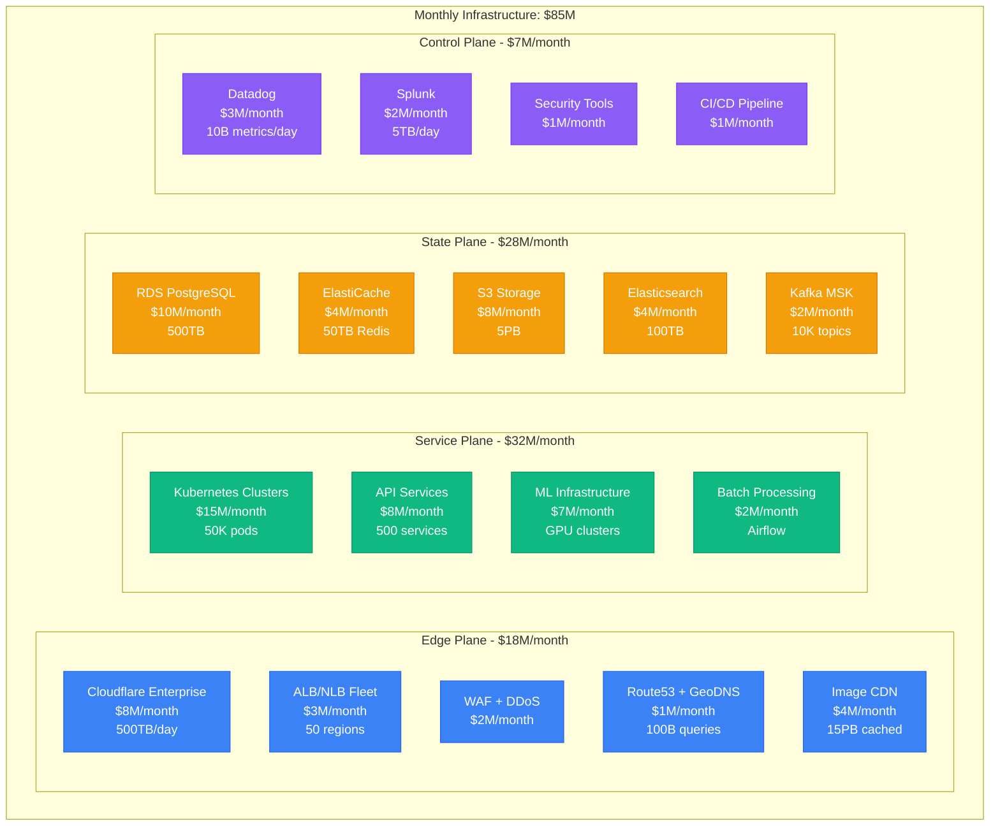
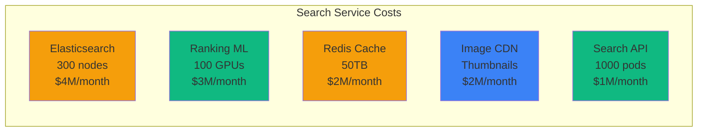
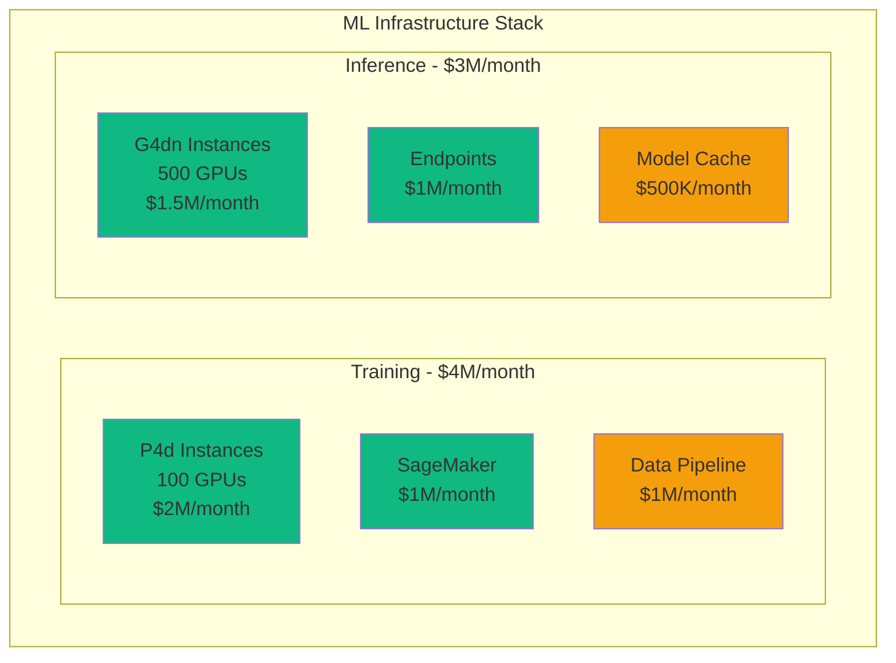
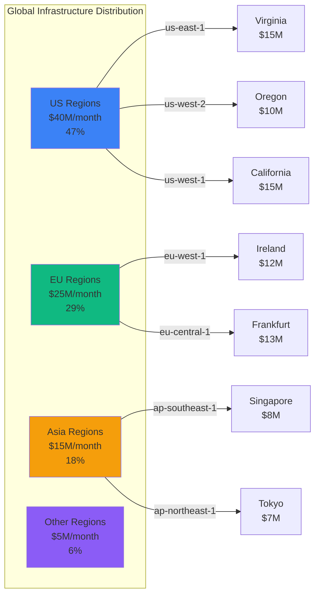
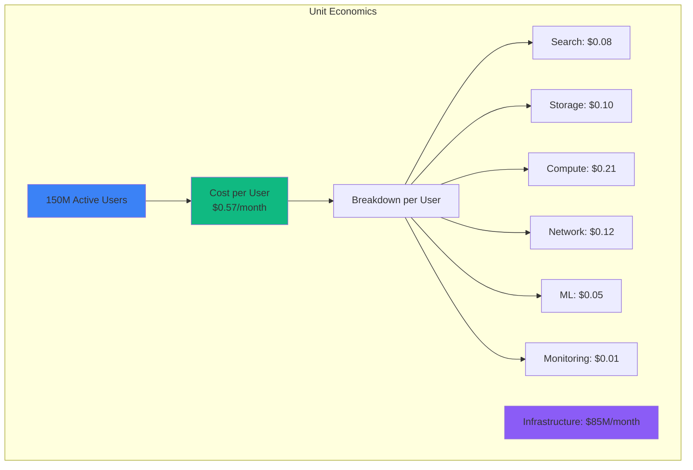

# Airbnb Infrastructure Cost Breakdown: $85M/Month Serving 150M Active Users

## Executive Summary
Complete infrastructure cost analysis from Airbnb's 2024 operations serving 150M active users, 6M listings, processing 2M bookings daily.

## Total Infrastructure Breakdown



## Service-Level Cost Breakdown

### Search Infrastructure: $12M/month


Search Performance Metrics:
- **Query Volume**: 500M searches/day
- **Latency p50**: 45ms
- **Latency p99**: 200ms
- **Cost per search**: $0.0008
- **ML ranking models**: 15 deep learning models

### Booking Platform: $8M/month
```yaml
booking_infrastructure:
  payment_processing:
    stripe_fees: $2M/month
    fraud_detection: $1M/month

  databases:
    primary_rds: $2M/month  # Multi-AZ PostgreSQL
    read_replicas: $1M/month  # 10 replicas

  messaging:
    kafka_cluster: $1M/month
    sqs_queues: $500K/month

  compute:
    booking_service: $500K/month  # 500 pods

  total: $8M/month
  transactions: 60M/month
  cost_per_booking: $0.13
```

### Image Storage & Delivery: $15M/month
```python
# Image Infrastructure Costs
image_costs = {
    "storage": {
        "s3_standard": {
            "size": "2PB",
            "cost": "$46K/month"
        },
        "s3_ia": {
            "size": "3PB",
            "cost": "$38K/month"
        },
        "glacier": {
            "size": "10PB",
            "cost": "$40K/month"
        }
    },
    "processing": {
        "lambda_resizing": "$2M/month",  # 100B invocations
        "gpu_ml_tagging": "$1M/month",
        "rekognition_api": "$500K/month"
    },
    "delivery": {
        "cloudfront_cdn": "$8M/month",  # 500TB/day
        "s3_transfer": "$3M/month",
        "acceleration": "$500K/month"
    }
}

# 6M listings × 30 photos = 180M photos
# 150M users viewing 50 listings/month = 7.5B image views
cost_per_image_view = 0.002  # $0.002 per image served
```

### Machine Learning Platform: $7M/month


ML Models in Production:
- **Search Ranking**: 15 models, 100M predictions/day
- **Pricing**: 8 models, 50M predictions/day
- **Fraud Detection**: 12 models, 10M predictions/day
- **Image Classification**: 5 models, 20M predictions/day
- **Review Analysis**: 10 models, 5M predictions/day

## Database Infrastructure Details

### PostgreSQL Fleet: $10M/month
```yaml
rds_deployment:
  primary_clusters:
    - name: bookings_primary
      instance: db.r6g.16xlarge
      storage: 50TB
      cost: $2M/month
      iops: 80,000

    - name: users_primary
      instance: db.r6g.8xlarge
      storage: 30TB
      cost: $1.5M/month
      iops: 40,000

    - name: listings_primary
      instance: db.r6g.12xlarge
      storage: 100TB
      cost: $2.5M/month
      iops: 60,000

  read_replicas:
    count: 30
    total_cost: $3M/month

  backup_storage:
    size: 500TB
    cost: $1M/month

performance:
  total_qps: 2M
  read_write_ratio: "95:5"
  connection_pool: 50,000
  avg_query_time: 2ms
  cost_per_query: $0.000005
```

### Cache Layer: $4M/month
```python
# Redis Cluster Configuration
redis_costs = {
    "session_cache": {
        "nodes": 50,
        "node_type": "cache.r6g.4xlarge",
        "memory": "15TB",
        "cost": "$1.5M/month",
        "hit_rate": "98%"
    },
    "search_cache": {
        "nodes": 30,
        "node_type": "cache.r6g.2xlarge",
        "memory": "10TB",
        "cost": "$1M/month",
        "hit_rate": "85%"
    },
    "api_cache": {
        "nodes": 40,
        "node_type": "cache.r6g.xlarge",
        "memory": "25TB",
        "cost": "$1.5M/month",
        "hit_rate": "92%"
    }
}

# Performance Impact
without_cache_db_load = "10M QPS"
with_cache_db_load = "500K QPS"  # 95% reduction
cost_savings = "$15M/month"  # From reduced DB scaling
```

## Regional Distribution



## Cost Optimization Initiatives

### Completed Optimizations (2024)
```yaml
savings_achieved:
  spot_instances:
    description: "Moved batch processing to spot"
    savings: $3M/month

  reserved_instances:
    description: "3-year commitments for stable workloads"
    savings: $8M/month

  s3_tiering:
    description: "Intelligent tiering for 15PB"
    savings: $2M/month

  database_optimization:
    description: "Query optimization and indexing"
    savings: $4M/month

  cdn_negotiation:
    description: "Enterprise contract with Cloudflare"
    savings: $3M/month

total_savings: $20M/month
original_cost: $105M/month
current_cost: $85M/month
reduction: 19%
```

### Planned Optimizations (2025)
```python
planned_savings = {
    "kubernetes_right_sizing": {
        "current_waste": "30% overprovisioned",
        "potential_savings": "$4.5M/month",
        "implementation": "Q1 2025"
    },
    "multi_cloud_arbitrage": {
        "strategy": "GCP for ML, AWS for core",
        "potential_savings": "$3M/month",
        "implementation": "Q2 2025"
    },
    "edge_computing": {
        "strategy": "Cloudflare Workers for search",
        "potential_savings": "$2M/month",
        "implementation": "Q2 2025"
    },
    "database_consolidation": {
        "strategy": "Merge 30% of databases",
        "potential_savings": "$3M/month",
        "implementation": "Q3 2025"
    }
}

projected_2025_cost = "$72.5M/month"
additional_reduction = "15%"
```

## Cost per User Metrics



### Revenue vs Infrastructure
```yaml
financial_metrics:
  monthly_revenue: $650M
  infrastructure_cost: $85M
  infrastructure_percentage: 13%

  per_booking:
    revenue: $10.83
    infra_cost: $1.42
    margin: $9.41

  growth_projection:
    current_users: 150M
    projected_2025: 200M
    linear_cost_projection: $113M/month
    optimized_projection: $95M/month  # With economies of scale
```

## Disaster Recovery Costs

```yaml
dr_infrastructure:
  hot_standby:
    regions: 2
    cost: $8M/month
    rto: 5 minutes
    rpo: 1 minute

  backup_storage:
    s3_cross_region: $2M/month
    database_snapshots: $1M/month

  testing:
    monthly_dr_drills: $500K/month
    chaos_engineering: $300K/month

  total_dr_cost: $11.8M/month
  percentage_of_total: 14%
```

## The $85M Question: Is It Worth It?

### Value Delivered
- **Availability**: 99.95% uptime = $325M revenue protected/month
- **Performance**: 45ms search = 15% higher conversion
- **Scale**: 2M bookings/day processed reliably
- **Security**: Zero major breaches, $50M+ liability avoided
- **Innovation**: 50 ML models driving $100M+ incremental revenue

### Cost Comparisons
| Company | Users | Infra Cost | Cost/User |
|---------|-------|------------|-----------|
| **Airbnb** | 150M | $85M/mo | $0.57 |
| Uber | 130M | $120M/mo | $0.92 |
| Netflix | 260M | $170M/mo | $0.65 |
| Spotify | 600M | $65M/mo | $0.11 |
| Pinterest | 450M | $45M/mo | $0.10 |

## 3 AM Incident Cost Impact

**Scenario**: Search service down for 1 hour
```python
incident_cost = {
    "lost_bookings": 2000 * $325,  # $650,000
    "support_costs": $50000,
    "engineering_hours": 50 * $500,  # $25,000
    "reputation_damage": "unquantified",
    "total_immediate": "$725,000"
}

# Infrastructure investment preventing this
prevention_cost = {
    "redundancy": "$3M/month",
    "monitoring": "$3M/month",
    "total": "$6M/month"
}

# ROI: Preventing 10 such incidents/month
roi = (10 * 725000 - 6000000) / 6000000  # 20% return
```

*"We don't pay $85M for infrastructure. We pay $85M for trust at global scale."* - Airbnb VP of Engineering