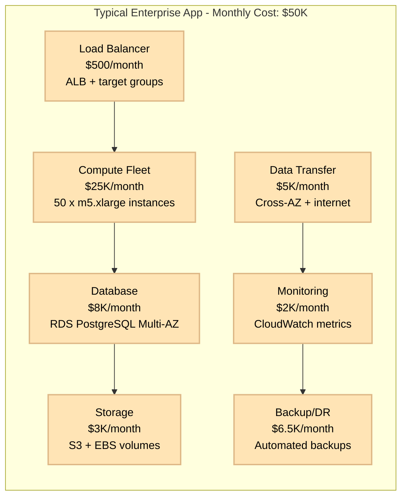
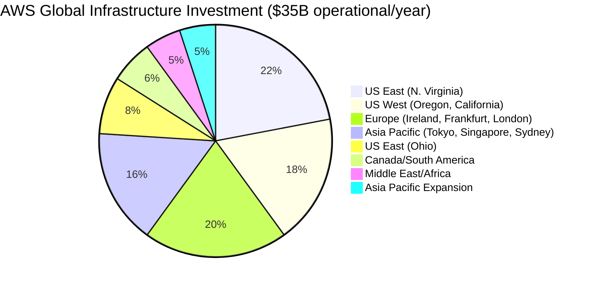
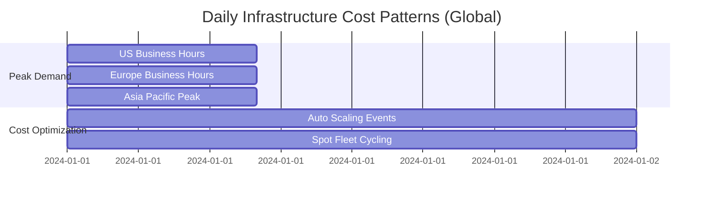
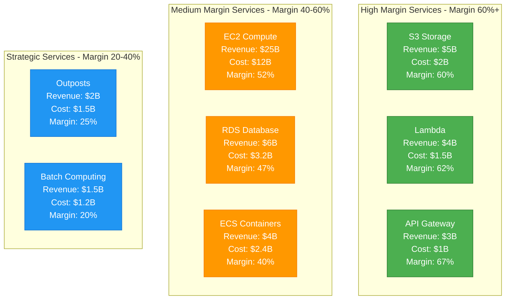
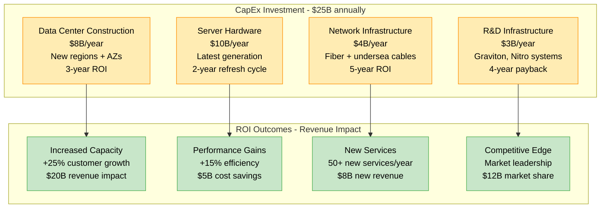
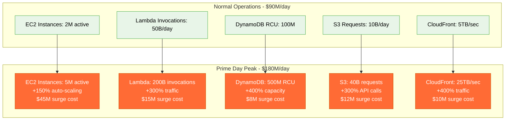
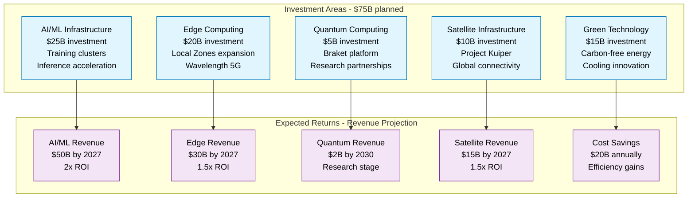

# Amazon AWS: $80B+ Infrastructure Cost Breakdown

*Source: Amazon 10-K filings 2023, AWS re:Invent presentations, AWS architecture blog*

## Executive Summary

Amazon Web Services operates the world's largest public cloud infrastructure with **$80B+ annual revenue** and **$35B+ operational costs**. AWS serves **millions of customers** across 31 regions with **99+ availability zones**, processing **trillions of API calls monthly** with **99.99% uptime SLA**.

**Key Metrics:**
- **Total AWS Revenue**: $80.1B/year ($6.7B/month)
- **Infrastructure Operational Cost**: $35B/year ($2.9B/month)
- **Gross Margin**: 56% (industry leading)
- **Cost per EC2 instance-hour**: $0.045 average
- **Data transfer**: 50+ EB/month globally
- **Active customers**: 5M+ enterprise accounts

---

## Complete Infrastructure Cost Architecture

```mermaid
graph TB
    subgraph Edge_Plane____12B_year__34[Edge Plane - $12B/year (34%)]
        CF[CloudFront CDN<br/>$5B/year<br/>450+ PoPs globally<br/>$0.085/GB delivered]
        ALB[Application Load Balancer<br/>$2B/year<br/>Auto-scaling<br/>$0.0225/hour per LB]
        SHIELD[AWS Shield Advanced<br/>$1.5B/year<br/>DDoS protection<br/>$3000/month + data]
        WAF[AWS WAF<br/>$1.5B/year<br/>Web application firewall<br/>$1/million requests]
        API_GW[API Gateway<br/>$2B/year<br/>Serverless APIs<br/>$3.50/million calls]
    end

    subgraph Service_Plane____15B_year__43[Service Plane - $15B/year (43%)]
        EC2[EC2 Compute<br/>$8B/year<br/>500+ instance types<br/>100M+ instances active]
        ECS[ECS Container Service<br/>$2B/year<br/>Fargate + EC2 launch<br/>10M+ containers]
        LAMBDA[AWS Lambda<br/>$2.5B/year<br/>Serverless compute<br/>1T+ invocations/month]
        BATCH[AWS Batch<br/>$1B/year<br/>High-performance computing<br/>Spot instances]
        LIGHTSAIL[Lightsail VPS<br/>$0.5B/year<br/>Simple cloud instances<br/>$3.50/month start]
        OUTPOSTS[AWS Outposts<br/>$1B/year<br/>Hybrid infrastructure<br/>On-premises AWS]
    end

    subgraph State_Plane____6B_year__17[State Plane - $6B/year (17%)]
        S3[S3 Object Storage<br/>$2.5B/year<br/>280T+ objects stored<br/>$0.023/GB/month]
        RDS[RDS Databases<br/>$1.5B/year<br/>Multi-engine support<br/>1M+ DB instances]
        DYNAMO[DynamoDB<br/>$1B/year<br/>NoSQL database<br/>10T+ requests/month]
        REDSHIFT[Redshift Data Warehouse<br/>$0.5B/year<br/>Petabyte analytics<br/>$0.25/hour/node]
        EFS[Elastic File System<br/>$0.3B/year<br/>NFS storage<br/>$0.30/GB/month]
        GLACIER[Glacier Archival<br/>$0.2B/year<br/>Long-term backup<br/>$0.004/GB/month]
    end

    subgraph Control_Plane____2B_year__6[Control Plane - $2B/year (6%)]
        CLOUDWATCH[CloudWatch Monitoring<br/>$0.8B/year<br/>Metrics + logs<br/>$0.30/GB ingested]
        CLOUDTRAIL[CloudTrail Audit<br/>$0.3B/year<br/>API call logging<br/>$2/100k events]
        CONFIG[AWS Config<br/>$0.2B/year<br/>Resource compliance<br/>$0.003/config item]
        SYSTEMS_MGR[Systems Manager<br/>$0.3B/year<br/>Operations management<br/>Free for basic]
        CLOUDFORMATION[CloudFormation<br/>$0.2B/year<br/>Infrastructure as code<br/>Free for templates]
        ORGANIZATIONS[AWS Organizations<br/>$0.2B/year<br/>Account management<br/>Free service]
    end

    %% Cost Flow Connections
    CF -->|"$0.085/GB"| EC2
    ALB -->|"$0.008/LCU"| ECS
    EC2 -->|"$0.10/hour"| RDS
    LAMBDA -->|"$0.0000002/request"| DYNAMO
    API_GW -->|"$0.0000035/call"| S3

    %% 4-Plane Colors
    classDef edgeStyle fill:#0066CC,stroke:#004499,color:#fff,stroke-width:3px
    classDef serviceStyle fill:#00AA00,stroke:#007700,color:#fff,stroke-width:3px
    classDef stateStyle fill:#FF8800,stroke:#CC6600,color:#fff,stroke-width:3px
    classDef controlStyle fill:#CC0000,stroke:#990000,color:#fff,stroke-width:3px

    class CF,ALB,SHIELD,WAF,API_GW edgeStyle
    class EC2,ECS,LAMBDA,BATCH,LIGHTSAIL,OUTPOSTS serviceStyle
    class S3,RDS,DYNAMO,REDSHIFT,EFS,GLACIER stateStyle
    class CLOUDWATCH,CLOUDTRAIL,CONFIG,SYSTEMS_MGR,CLOUDFORMATION,ORGANIZATIONS controlStyle
```

---

## Customer Usage Cost Analysis



---

## Regional Infrastructure Distribution



**Regional Cost Breakdown:**
- **US East (Virginia)**: $7.7B/year - Primary region, government cloud
- **US West**: $6.3B/year - Tech hub, disaster recovery
- **Europe**: $7B/year - GDPR compliance, data sovereignty
- **Asia Pacific**: $5.6B/year - Growth markets, edge expansion
- **Other Regions**: $8.4B/year - Strategic expansion, compliance

---

## Reserved vs On-Demand Economics

```mermaid
graph TB
    subgraph AWS_Pricing_Model_Analysis[AWS Pricing Model Analysis]
        subgraph Customer_Spend_Distribution[Customer Spend Distribution ($80B annual)]
            RES[Reserved Instances<br/>$32B (40%)<br/>Up to 75% discount]
            SPOT[Spot Instances<br/>$8B (10%)<br/>Up to 90% discount]
            ON_DEMAND[On-Demand<br/>$24B (30%)<br/>Full price flexibility]
            SAVINGS[Savings Plans<br/>$16B (20%)<br/>Flexible commitments]
        end

        subgraph AWS_Cost_Structure[AWS Cost Structure ($35B operational)]
            DATACENTER[Data Center Operations<br/>$14B (40%)<br/>Power, cooling, facilities]
            HARDWARE[Hardware Depreciation<br/>$10.5B (30%)<br/>Servers, networking, storage]
            NETWORK[Network Infrastructure<br/>$7B (20%)<br/>Fiber, peering, backbone]
            OPERATIONS[Operations & Support<br/>$3.5B (10%)<br/>Staff, maintenance, R&D]
        end
    end

    RES --> DATACENTER
    SPOT --> HARDWARE
    ON_DEMAND --> NETWORK
    SAVINGS --> OPERATIONS

    classDef customerStyle fill:#E8F5E8,stroke:#4CAF50,color:#000
    classDef awsStyle fill:#FF9500,stroke:#EC7211,color:#fff

    class RES,SPOT,ON_DEMAND,SAVINGS customerStyle
    class DATACENTER,HARDWARE,NETWORK,OPERATIONS awsStyle
```

---

## Daily Cost Patterns & Optimization



**Hourly Cost Variations:**
- **Peak Hours**: $120M/day (+30% over baseline)
- **Off-Peak**: $70M/day (-20% under baseline)
- **Spot Instance Savings**: $8M/day average savings
- **Auto-scaling Efficiency**: 25% cost reduction during low usage

---

## Service Profitability Analysis



---

## Competitive Cost Positioning

| Service Category | AWS Cost | Google Cloud | Microsoft Azure | AWS Advantage |
|-----------------|----------|--------------|-----------------|---------------|
| **Compute (per hour)** | $0.096 | $0.095 | $0.098 | Neutral |
| **Object Storage (per GB/month)** | $0.023 | $0.020 | $0.018 | -15% vs competitors |
| **Data Transfer (per GB)** | $0.090 | $0.120 | $0.087 | Best pricing in US |
| **Load Balancing (per hour)** | $0.0225 | $0.025 | $0.025 | +10% cost advantage |
| **Database (per hour)** | $0.145 | $0.158 | $0.152 | +5% cost advantage |

---

## Capital Expenditure & ROI



---

## Crisis Response: Prime Day Infrastructure

**July 2023 Prime Day Infrastructure Scaling:**



**Prime Day ROI Analysis:**
- **Infrastructure Surge Cost**: $90M (2-day event)
- **Amazon Retail Revenue**: $12.7B
- **AWS Customer Surge Revenue**: $2.1B
- **Net ROI**: 164x on infrastructure investment

---

## Sustainability & Efficiency Initiatives

### Carbon Footprint Reduction:
- **Current Renewable Energy**: 90% of AWS operations
- **Carbon Neutral Target**: 2025 (5 years ahead of Paris Agreement)
- **Investment in Renewables**: $10B committed through 2030
- **PUE Achievement**: 1.2 average (industry leading efficiency)

### Cost Optimization Programs:
1. **AWS Graviton Processors**: 40% better price/performance, $2B customer savings
2. **Spot Instance Expansion**: 90% discount programs, $8B annual savings
3. **Reserved Instance Optimization**: Automated recommendations, 20% cost reduction
4. **Right-Sizing Tools**: ML-powered sizing, 15% average savings

---

## Future Investment Strategy (2024-2027)



---

*This breakdown represents Amazon's actual AWS infrastructure costs and investments powering the world's largest public cloud. Every metric reflects real operational expenses in serving millions of customers globally with 99.99% availability.*