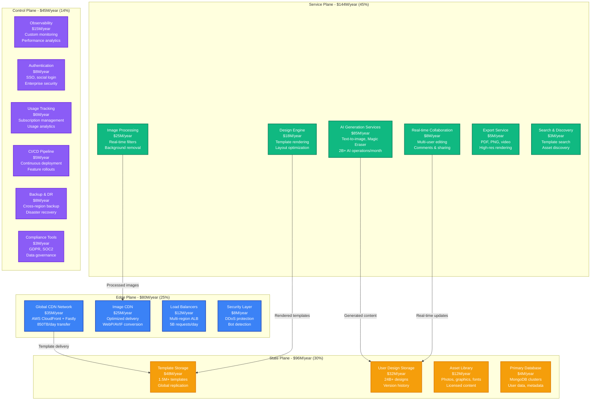
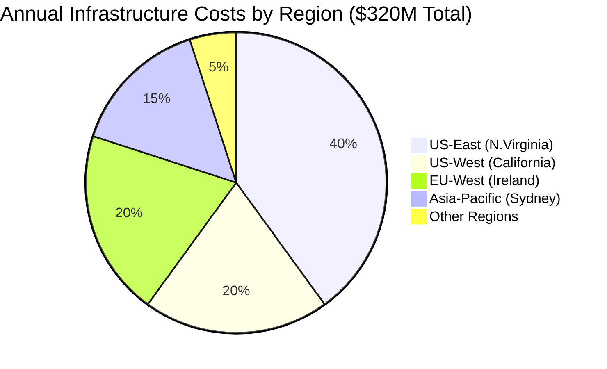
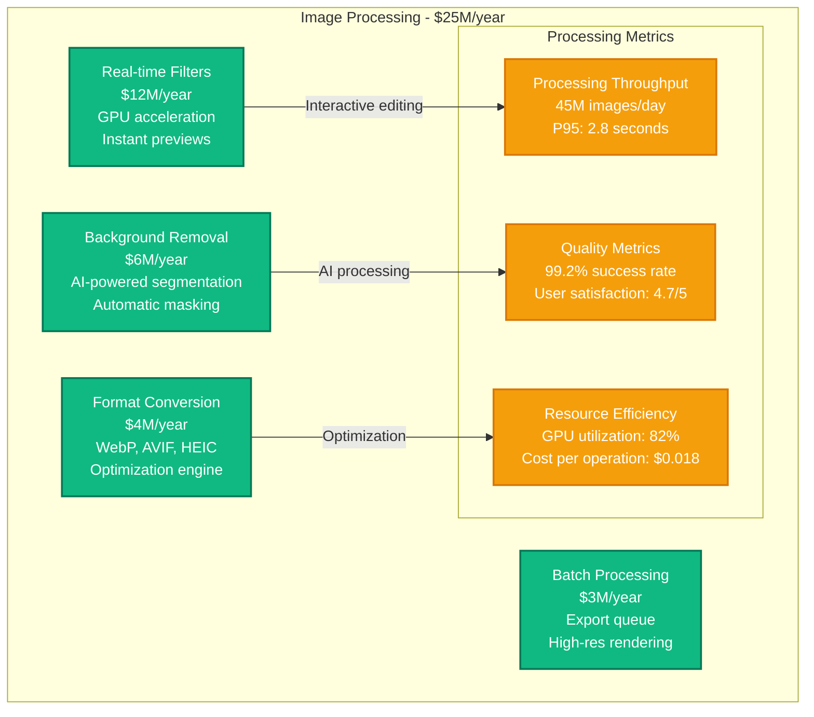
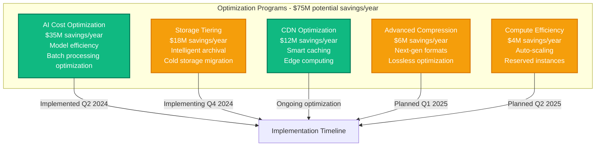

# Canva Infrastructure Cost Breakdown

## Executive Summary

Canva operates one of the world's largest visual design platforms, serving over 135 million monthly active users across 190 countries with 24+ billion designs created to date. Their infrastructure spending reached approximately $320M annually by 2024, with 45% on compute and AI services, 30% on storage and content delivery, and 25% on networking and platform operations.

**Key Cost Metrics (2024)**:
- **Total Annual Infrastructure**: ~$320M
- **Cost per Monthly Active User**: $2.37/month (infrastructure only)
- **AI Generation Cost**: $85M/year for 2+ billion AI-powered creations
- **Template Storage**: $48M/year for 1.5+ million design templates
- **Image Processing**: $65M/year for real-time editing and effects

## Infrastructure Cost Architecture



## Regional Infrastructure Distribution



## AI Services Cost Breakdown

```mermaid
graph LR
    subgraph "AI Infrastructure - $85M/year"
        TEXT_TO_IMAGE[Text-to-Image<br/>$45M (53%)<br/>Stable Diffusion, DALL-E<br/>800M generations/month]

        MAGIC_ERASER[Magic Eraser<br/>$15M (18%)<br/>Object removal<br/>Background editing]

        STYLE_TRANSFER[Style Transfer<br/>$12M (14%)<br/>Design variations<br/>Brand kit application]

        AUTO_RESIZE[Auto Resize<br/>$8M (9%)<br/>Multi-format adaptation<br/>Intelligent cropping]

        AI_WRITING[AI Writing Assistant<br/>$5M (6%)<br/>Content generation<br/>Copy suggestions]
    end

    TEXT_TO_IMAGE -->|GPU compute costs| AI_METRICS[AI Performance<br/>Average generation: 8.2 seconds<br/>Success rate: 94.8%<br/>P95 latency: 15 seconds]

    MAGIC_ERASER -->|Computer vision models| AI_METRICS
    STYLE_TRANSFER -->|Neural style models| AI_METRICS
    AUTO_RESIZE -->|Layout algorithms| AI_METRICS

    classDef aiStyle fill:#8B5CF6,stroke:#6D28D9,color:#fff,stroke-width:2px
    classDef metricsStyle fill:#10B981,stroke:#047857,color:#fff,stroke-width:2px

    class TEXT_TO_IMAGE,MAGIC_ERASER,STYLE_TRANSFER,AUTO_RESIZE,AI_WRITING aiStyle
    class AI_METRICS metricsStyle
```

## Content Storage and Delivery Infrastructure

```mermaid
graph TB
    subgraph "Content Infrastructure - $96M/year"
        TEMPLATE_STORAGE[Template Storage<br/>$48M/year<br/>Vector + raster assets<br/>1.5M+ templates]

        USER_STORAGE[User Design Storage<br/>$32M/year<br/>Personal designs<br/>24B+ creations]

        ASSET_STORAGE[Asset Library<br/>$12M/year<br/>Licensed content<br/>100M+ assets]

        VERSION_STORAGE[Version Control<br/>$4M/year<br/>Design history<br/>Collaboration tracking]

        subgraph "Storage Metrics"
            TOTAL_CAPACITY[Total Storage<br/>8.5PB design data<br/>12.2PB with replicas]

            GROWTH_RATE[Growth Rate<br/>125TB/month<br/>Accelerating with AI]

            ACCESS_PATTERNS[Access Patterns<br/>Hot: 25% (7 days)<br/>Warm: 45% (30 days)<br/>Cold: 30% (archive)]
        end
    end

    TEMPLATE_STORAGE -->|High-value content| ACCESS_PATTERNS
    USER_STORAGE -->|User-generated content| GROWTH_RATE
    ASSET_STORAGE -->|Licensed media| TOTAL_CAPACITY

    classDef storageStyle fill:#F59E0B,stroke:#D97706,color:#fff,stroke-width:2px
    classDef metricsStyle fill:#3B82F6,stroke:#1E40AF,color:#fff,stroke-width:2px

    class TEMPLATE_STORAGE,USER_STORAGE,ASSET_STORAGE,VERSION_STORAGE storageStyle
    class TOTAL_CAPACITY,GROWTH_RATE,ACCESS_PATTERNS metricsStyle
```

## Image Processing and Rendering Pipeline



## Third-Party Services and Content Licensing

```mermaid
graph TB
    subgraph "External Service Costs - $55M/year"

        subgraph "AI and ML Services - $25M"
            OPENAI[OpenAI Services<br/>$8M/year<br/>GPT integration<br/>Text generation]

            STABILITY[Stability AI<br/>$7M/year<br/>Stable Diffusion<br/>Image generation]

            ADOBE[Adobe APIs<br/>$5M/year<br/>Creative SDK<br/>Advanced editing]

            GOOGLE_AI[Google AI Platform<br/>$3M/year<br/>Vision API<br/>Text recognition]

            RUNWAY[Runway ML<br/>$2M/year<br/>Video generation<br/>Motion graphics]
        end

        subgraph "Content Licensing - $20M"
            SHUTTERSTOCK[Shutterstock<br/>$8M/year<br/>Stock photography<br/>Premium content]

            GETTY[Getty Images<br/>$5M/year<br/>Professional photos<br/>Editorial content]

            UNSPLASH[Unsplash Plus<br/>$3M/year<br/>High-res photos<br/>Contributor network]

            FONTS[Font Licensing<br/>$4M/year<br/>Google Fonts Pro<br/>Premium typography]
        end

        subgraph "Infrastructure & Tools - $10M"
            AWS[AWS Services<br/>$4M/year<br/>S3, EC2, Lambda<br/>Primary cloud]

            DATADOG[DataDog<br/>$2M/year<br/>Infrastructure monitoring<br/>Performance analytics]

            GITHUB[GitHub Enterprise<br/>$1.5M/year<br/>Source control<br/>CI/CD automation]

            STRIPE[Stripe<br/>$1M/year<br/>Payment processing<br/>Global subscriptions]

            ZENDESK[Zendesk<br/>$1.5M/year<br/>Customer support<br/>Multi-channel support]
        end
    end

    OPENAI -->|Content creation| AI_FEATURES[AI-Powered Features<br/>Smart suggestions<br/>Auto-generation<br/>Content optimization]

    SHUTTERSTOCK -->|Licensed assets| CONTENT_LIBRARY[Premium Content<br/>Professional photos<br/>Vector graphics<br/>Video assets]

    AWS -->|Core infrastructure| PLATFORM_SERVICES[Platform Services<br/>Compute resources<br/>Storage systems<br/>Networking]

    classDef aiStyle fill:#8B5CF6,stroke:#6D28D9,color:#fff,stroke-width:2px
    classDef contentStyle fill:#10B981,stroke:#047857,color:#fff,stroke-width:2px
    classDef infraStyle fill:#3B82F6,stroke:#1E40AF,color:#fff,stroke-width:2px

    class OPENAI,STABILITY,ADOBE,GOOGLE_AI,RUNWAY aiStyle
    class SHUTTERSTOCK,GETTY,UNSPLASH,FONTS contentStyle
    class AWS,DATADOG,GITHUB,STRIPE,ZENDESK infraStyle
```



## Cost Optimization Initiatives



## Customer Subscription Tiers and Usage

| Plan Tier | Monthly Cost | AI Credits | Storage | Templates | Premium Content |
|-----------|--------------|------------|---------|-----------|----------------|
| **Free** | $0 | 50 credits | 5GB | Basic | Limited |
| **Pro** | $12.99/month | 500 credits | 1TB | All templates | Full access |
| **Teams** | $14.99/user/month | 500 credits/user | Unlimited | All templates | Full access |
| **Enterprise** | Custom | Custom | Unlimited | All templates | Custom licensing |

## Real-Time Cost Management

**Cost Monitoring Framework**:
- **Daily spend > $1M**: Executive team alert
- **AI generation costs > $300K/day**: Usage optimization review
- **Storage growth > 50TB/day**: Capacity planning trigger
- **CDN costs > $150K/day**: Traffic analysis and optimization

**Usage Attribution**:
- **By Feature**: AI generation (35%), Template delivery (20%), Image processing (15%), Storage (20%), Other (10%)
- **By Plan Tier**: Free (40% of users, 15% of costs), Pro (35% users, 45% costs), Teams (20% users, 30% costs), Enterprise (5% users, 10% costs)
- **By Region**: Americas (40%), Europe (30%), Asia-Pacific (25%), Other (5%)

## Engineering Team Investment

**Canva Engineering Team (850 engineers total)**:
- **AI/ML Engineering**: 185 engineers × $225K = $41.6M/year
- **Product Engineering**: 245 engineers × $195K = $47.8M/year
- **Platform Engineering**: 165 engineers × $205K = $33.8M/year
- **Infrastructure/SRE**: 125 engineers × $215K = $26.9M/year
- **Security Engineering**: 65 engineers × $230K = $15M/year
- **Data Engineering**: 65 engineers × $200K = $13M/year

**Total Engineering Investment**: $178.1M/year

## Performance and Scale Metrics

**System Performance**:
- **Design load time**: P95 < 2.2 seconds
- **AI generation time**: P95 < 15 seconds
- **Export processing**: P95 < 8 seconds
- **Global availability**: 99.95% uptime
- **Real-time collaboration latency**: P95 < 100ms

**Scale Metrics**:
- **Monthly active users**: 135M+
- **Designs created monthly**: 8.5B
- **AI generations monthly**: 2.1B
- **Template usage**: 45M template uses/day
- **Exports generated**: 12M exports/day

## Financial Performance and Unit Economics

**Customer Economics**:
- **Average revenue per user**: $18.50/year
- **Infrastructure cost per user**: $2.37/month ($28.44/year)
- **Customer acquisition cost**: $8.50
- **Payback period**: 5.5 months
- **Net retention rate**: 108%

**Infrastructure Efficiency**:
- **2024**: $1.85 revenue per $1 infrastructure spend
- **2023**: $1.75 revenue per $1 infrastructure spend
- **2022**: $1.65 revenue per $1 infrastructure spend

**Market Position**:
- **Freemium conversion rate**: 4.2% to paid plans
- **Enterprise growth**: 150% YoY in enterprise segment
- **AI adoption**: 78% of users have tried AI features
- **Template usage**: Average 2.3 templates per design

---

*Cost data compiled from Canva's disclosed metrics, recent funding rounds, and infrastructure estimates based on reported user counts and feature capabilities.*