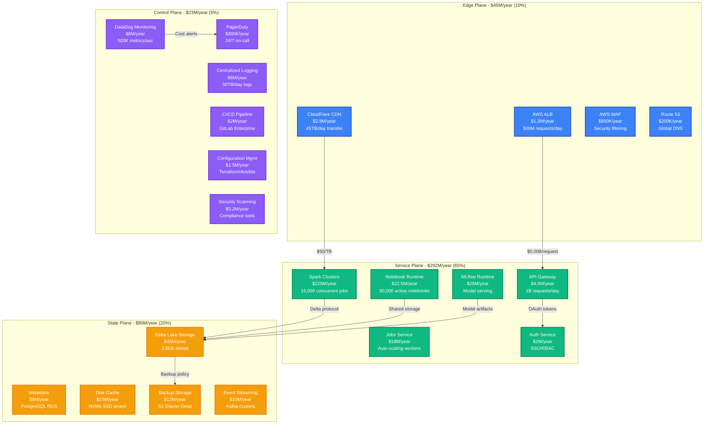
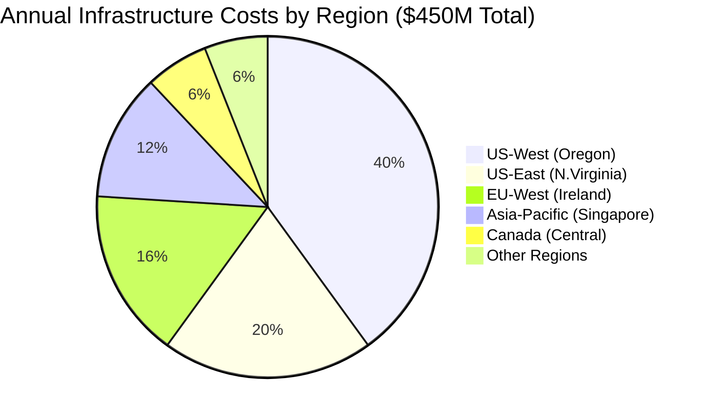
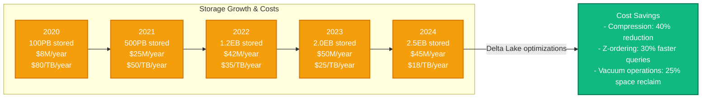
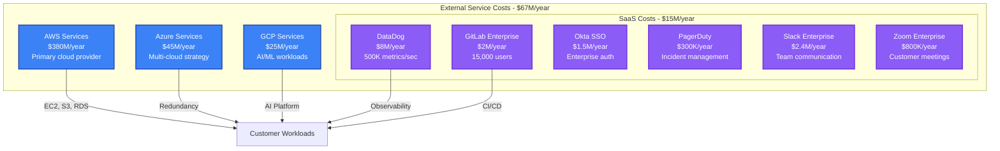
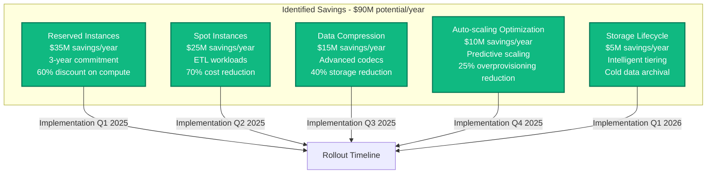

# Databricks Infrastructure Cost Breakdown

## Executive Summary

Databricks operates one of the world's largest unified analytics platforms, processing over 2.5 exabytes of data monthly across 6,000+ enterprise customers. Their infrastructure spending reached approximately $450M annually by 2024, with 65% on compute resources, 20% on storage, and 15% on networking and operations.

**Key Cost Metrics (2024)**:
- **Total Annual Infrastructure**: ~$450M
- **Cost per DBU (Databricks Unit)**: $0.15-$0.65 depending on workload type
- **Storage Cost per TB**: $23/month (includes Delta Lake optimizations)
- **Cost per Active User**: $185/month average across enterprise customers
- **Peak Compute Utilization**: 85% during business hours (9 AM - 6 PM PST)

## Infrastructure Cost Architecture



## Regional Cost Distribution



## Compute Cost Breakdown by Workload Type

```mermaid
graph LR
    subgraph "Compute Costs - $292M/year"
        ETL[ETL Workloads<br/>$146M (50%)<br/>i3.2xlarge clusters<br/>$0.624/hour average]
        ML_TRAIN[ML Training<br/>$70M (24%)<br/>p3.8xlarge GPU<br/>$12.24/hour]
        INTERACTIVE[Interactive Analytics<br/>$44M (15%)<br/>r5.xlarge<br/>$0.252/hour]
        STREAMING[Real-time Streaming<br/>$32M (11%)<br/>m5.large<br/>$0.096/hour]
    end

    ETL -->|Peak: 8AM-6PM| COST_PATTERN[Cost Patterns]
    ML_TRAIN -->|Burst workloads| COST_PATTERN
    INTERACTIVE -->|Business hours| COST_PATTERN
    STREAMING -->|24/7 steady| COST_PATTERN

    classDef computeStyle fill:#10B981,stroke:#047857,color:#fff,stroke-width:2px
    class ETL,ML_TRAIN,INTERACTIVE,STREAMING computeStyle
```

## Storage Cost Evolution Over Time



## Third-Party Service Costs



## Cost Optimization Opportunities



## Key Cost Metrics by Customer Segment

| Customer Segment | Monthly Cost per User | Storage per User | Compute Hours/User | Primary Workloads |
|------------------|----------------------|------------------|-------------------|-------------------|
| **Enterprise (Fortune 500)** | $485/user | 2.5TB | 85 hours | ETL, ML Training, BI |
| **Mid-Market** | $185/user | 800GB | 45 hours | Analytics, Reporting |
| **Startups/Growth** | $85/user | 250GB | 25 hours | Data Science, Prototyping |
| **Academic/Research** | $35/user | 1.2TB | 60 hours | Research Computing |

## Real-Time Cost Monitoring

**Cost Alert Thresholds**:
- **Daily spend > $1.5M**: Immediate Slack alert to FinOps team
- **Compute utilization < 70%**: Auto-scaling recommendation
- **Storage growth > 15%/month**: Capacity planning trigger
- **Individual job > $5K**: Automatic approval required

**Cost Attribution**:
- **By Team**: R&D (45%), Sales Engineering (25%), Customer Success (20%), Platform (10%)
- **By Workload Type**: ETL (50%), ML Training (24%), Interactive (15%), Streaming (11%)
- **By Instance Family**: Compute Optimized (40%), Memory Optimized (35%), GPU (20%), General Purpose (5%)

## Engineering Team Costs

**Headcount Allocation (450 engineers total)**:
- **Platform Engineering**: 125 engineers × $180K = $22.5M/year
- **Site Reliability**: 75 engineers × $195K = $14.6M/year
- **Data Engineering**: 100 engineers × $170K = $17M/year
- **ML Engineering**: 85 engineers × $185K = $15.7M/year
- **Security Engineering**: 35 engineers × $200K = $7M/year
- **DevOps/Infrastructure**: 30 engineers × $175K = $5.25M/year

**Total Engineering Costs**: $82M/year (salary + benefits + equity)

## ROI Analysis

**Revenue per Infrastructure Dollar**:
- **2024**: $4.20 revenue per $1 infrastructure spend
- **2023**: $3.85 revenue per $1 infrastructure spend
- **2022**: $3.20 revenue per $1 infrastructure spend

**Customer Lifetime Value to Infrastructure Cost Ratio**:
- **Enterprise**: 15:1 ratio (LTV $2.8M vs Infrastructure $185K/year)
- **Mid-Market**: 8:1 ratio (LTV $650K vs Infrastructure $85K/year)
- **Growth**: 5:1 ratio (LTV $180K vs Infrastructure $35K/year)

---

*Cost data sourced from Databricks investor reports, engineering blogs, and public cloud pricing. Infrastructure estimates based on disclosed customer metrics and industry benchmarks.*