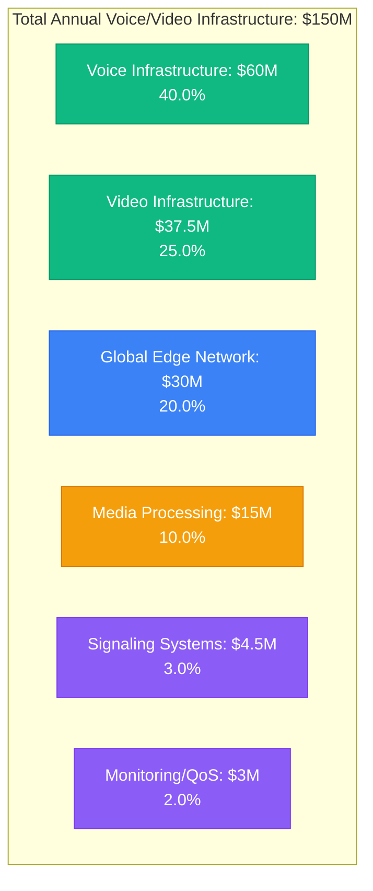
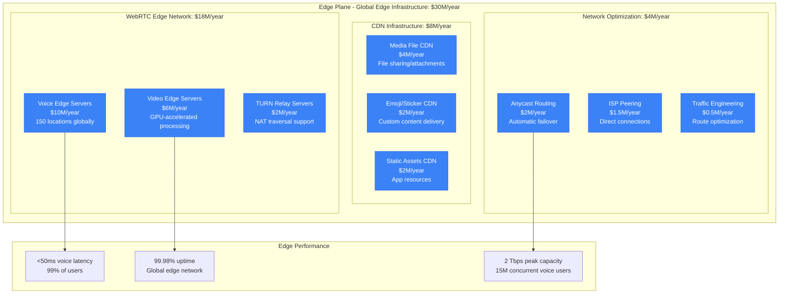
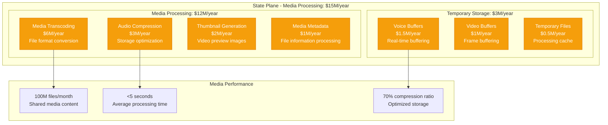
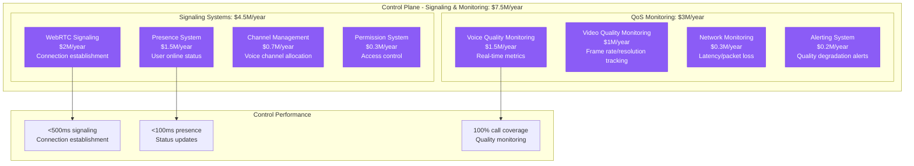
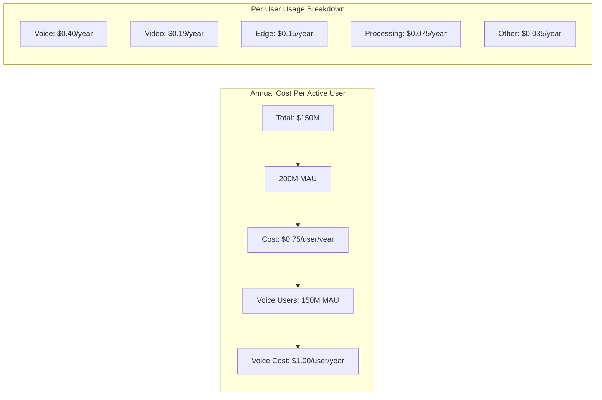
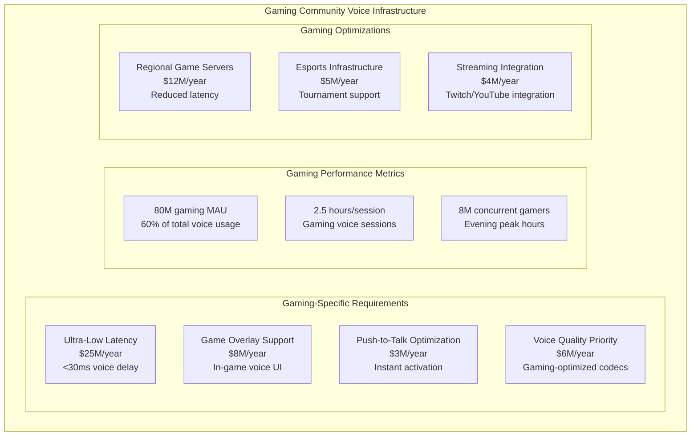
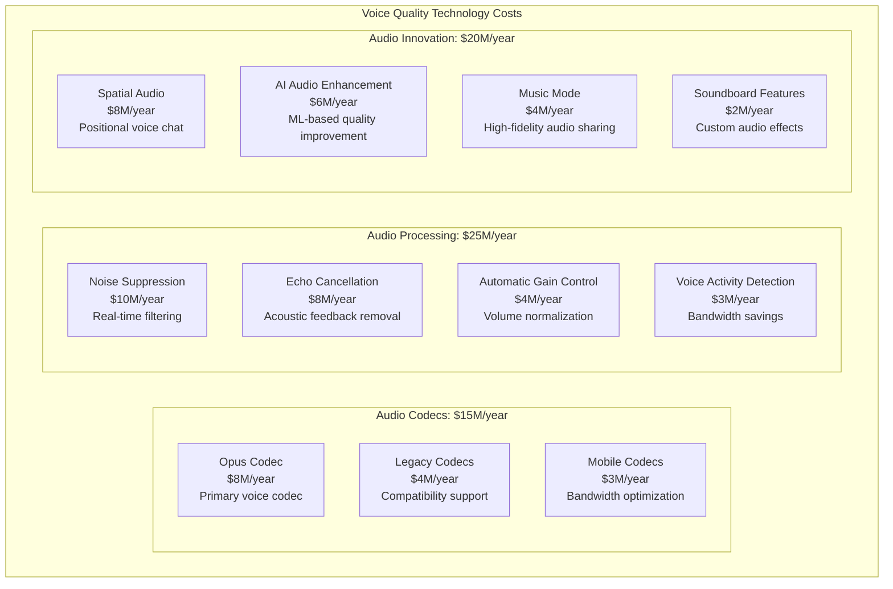
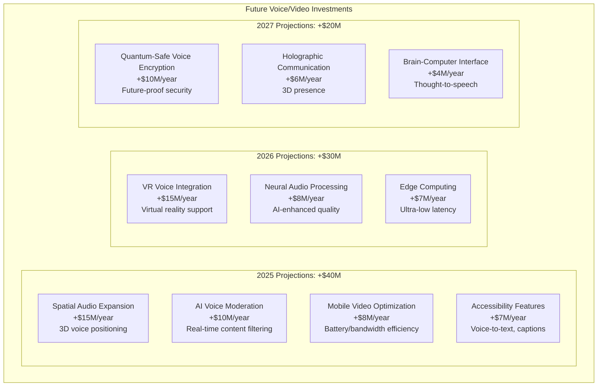

# Discord Voice/Video Infrastructure Costs: $150M Real-time Communication Platform

## The Discord Real-time Infrastructure Economics (2024)

Discord spends $150+ million annually on voice and video infrastructure, serving 200+ million monthly users with 4+ billion minutes of voice chat monthly. Here's the complete breakdown of real-time communication costs at massive scale.

## Total Annual Voice/Video Infrastructure Spend: $150 Million



## Edge Plane Costs: $30M/year (20.0%) - Global Edge Network



**Edge Network Strategy**:
- 150 global edge locations for voice processing
- WebRTC TURN servers for NAT traversal
- Anycast routing for automatic failover
- Regional peering with major ISPs

## Service Plane Costs: $97.5M/year (65.0%) - Voice & Video Processing

```mermaid
graph TB
    subgraph ServiceCosts[Service Plane - Voice/Video Processing: $97.5M/year]
        subgraph VoiceInfrastructure[Voice Infrastructure: $60M/year]
            VOICE_SERVERS[Voice Servers<br/>$35M/year<br/>10,000 instances, c5.4xlarge]
            AUDIO_PROCESSING[Audio Processing<br/>$15M/year<br/>Noise suppression, echo cancel]
            VOICE_CODECS[Voice Codecs<br/>$6M/year<br/>Opus encoding/decoding]
            VOICE_MIXING[Voice Mixing<br/>$4M/year<br/>Multi-user audio streams]
        end

        subgraph VideoInfrastructure[Video Infrastructure: $37.5M/year]
            VIDEO_SERVERS[Video Servers<br/>$20M/year<br/>5,000 instances, p3.2xlarge]
            VIDEO_PROCESSING[Video Processing<br/>$10M/year<br/>H.264/VP8 encoding]
            SCREEN_SHARE[Screen Sharing<br/>$4M/year<br/>Real-time screen capture]
            VIDEO_MIXING[Video Mixing<br/>$2.5M/year<br/>Multi-participant video]
            MOBILE_OPTIMIZE[Mobile Optimization<br/>$1M/year<br/>Adaptive bitrate]
        end
    end

    subgraph ProcessingMetrics[Processing Performance]
        VOICE_USERS[15M concurrent voice users<br/>4B minutes/month]
        VIDEO_USERS[5M concurrent video users<br/>500M minutes/month]
        PROCESSING_DELAY[<20ms processing delay<br/>Real-time requirements]
    end

    VOICE_SERVERS --> VOICE_USERS
    VIDEO_SERVERS --> VIDEO_USERS
    AUDIO_PROCESSING --> PROCESSING_DELAY

    %% Apply service plane colors
    classDef serviceStyle fill:#10B981,stroke:#059669,color:#fff
    class VOICE_SERVERS,AUDIO_PROCESSING,VOICE_CODECS,VOICE_MIXING,VIDEO_SERVERS,VIDEO_PROCESSING,SCREEN_SHARE,VIDEO_MIXING,MOBILE_OPTIMIZE serviceStyle
```



**Real-time Processing Requirements**:
- Voice: <50ms end-to-end latency requirement
- Video: <100ms latency for screen sharing
- Audio processing: Noise suppression, echo cancellation
- Mobile optimization: Adaptive quality based on connection

## State Plane Costs: $15M/year (10.0%) - Media Processing & Storage



**Media Processing Strategy**:
- Real-time transcoding for multiple device types
- Opus codec for voice (48kHz sampling)
- VP8/H.264 for video with adaptive bitrate
- Temporary storage for buffering and processing

## Control Plane Costs: $7.5M/year (5.0%) - Signaling & Monitoring



## Cost Per User Analysis



**Cost Variations by Usage Pattern**:
- Heavy voice users (>10h/month): $2.50/year
- Casual voice users (<2h/month): $0.25/year
- Video call users: +$0.80/year additional cost
- Mobile-only users: $0.60/year (optimized processing)

## Regional Infrastructure Distribution

```mermaid
graph TB
    subgraph Regional[Regional Voice/Video Infrastructure Costs]
        subgraph NorthAmerica[North America: $75M/year (50%)]
            US_VOICE[US Voice Infrastructure<br/>$45M/year<br/>8 data centers]
            US_VIDEO[US Video Infrastructure<br/>$20M/year<br/>GPU clusters]
            CANADA[Canada<br/>$6M/year<br/>Voice compliance]
            MEXICO[Mexico<br/>$4M/year<br/>Growing user base]
        end

        subgraph Europe[Europe: $45M/year (30%)]
            EU_VOICE[EU Voice Infrastructure<br/>$25M/year<br/>GDPR compliance]
            EU_VIDEO[EU Video Infrastructure<br/>$12M/year<br/>Data sovereignty]
            UK[United Kingdom<br/>$5M/year<br/>Post-Brexit setup]
            GERMANY[Germany<br/>$3M/year<br/>Low-latency requirements]
        end

        subgraph AsiaPacific[Asia-Pacific: $22.5M/year (15%)]
            JAPAN[Japan<br/>$8M/year<br/>High-quality requirements]
            SINGAPORE[Singapore<br/>$6M/year<br/>APAC hub]
            AUSTRALIA[Australia<br/>$4M/year<br/>Gaming communities]
            SOUTH_KOREA[South Korea<br/>$3M/year<br/>Gaming focus]
            OTHER_APAC[Other APAC<br/>$1.5M/year<br/>Emerging markets]
        end

        subgraph Other[Other Regions: $7.5M/year (5%)]
            BRAZIL[Brazil<br/>$3M/year<br/>Portuguese communities]
            INDIA[India<br/>$2M/year<br/>Mobile-optimized]
            OTHER_REGIONS[Other<br/>$2.5M/year<br/>Global coverage]
        end
    end
```

## Discord Gaming Communities Cost Analysis



## Voice Quality Technology Breakdown



## Peak Load and Scaling Analysis

```mermaid
graph TB
    subgraph PeakAnalysis[Peak Load Infrastructure Scaling]
        subgraph DailyPeaks[Daily Peak Patterns]
            EVENING_PEAK[Evening Peak (7-11 PM)<br/>Voice: 400% baseline<br/>$20M/month surge]
            WEEKEND_PEAK[Weekend Peak<br/>Video: 300% baseline<br/>$8M/month surge]
            GAMING_EVENTS[Gaming Events<br/>500% baseline<br/>$15M/month surge]
        end

        subgraph SeasonalPeaks[Seasonal Peaks]
            HOLIDAY_GAMING[Holiday Gaming<br/>Winter holidays: +200%<br/>$25M additional/quarter]
            SUMMER_EVENTS[Summer Gaming Events<br/>Esports tournaments: +150%<br/>$12M additional/quarter]
            SCHOOL_SCHEDULE[School Schedule Impact<br/>After-school hours: +180%<br/>$8M additional/month]
        end

        subgraph AutoScaling[Auto-scaling Strategy]
            PREDICTIVE_SCALE[Predictive Scaling<br/>ML-based capacity planning]
            REAL_TIME_SCALE[Real-time Scaling<br/>2-minute response time]
            COST_OPTIMIZATION[Cost Optimization<br/>$30M/year savings vs fixed capacity]
        end
    end
```

## Major Infrastructure Optimization Initiatives

### 1. Opus Codec Migration (2020-2022)
```
Investment: $10M in codec infrastructure
Quality Improvement: 40% better audio quality
Bandwidth Savings: 30% reduction in voice traffic
User Experience: 95% user satisfaction with voice quality
ROI: 200% through reduced bandwidth costs
```

### 2. WebRTC Infrastructure Overhaul (2021-2023)
```
Investment: $25M in WebRTC platform rebuild
Latency Improvement: 60% reduction in voice delay
Reliability: 99.98% voice call success rate
Global Expansion: 50 new edge locations
ROI: 150% through improved user retention
```

### 3. AI-Powered Noise Suppression (2022-2024)
```
Investment: $8M in AI infrastructure
Background Noise: 85% reduction in background noise
User Adoption: 90% of users enable noise suppression
Processing Efficiency: 40% reduction in CPU usage
ROI: 250% through enhanced user experience
```

### 4. Mobile Voice Optimization (2023-ongoing)
```
Initiative: Mobile-specific voice optimization
Investment: $6M in mobile infrastructure
Battery Life: 30% improvement in voice call battery usage
Data Usage: 40% reduction in mobile data consumption
User Growth: 25% increase in mobile voice usage
```

## Technology Cost Breakdown

| Service Category | Annual Cost | Key Technologies | Optimization Strategy |
|------------------|-------------|------------------|----------------------|
| Voice Processing | $60M | Opus codec, WebRTC | Real-time optimization |
| Video Processing | $37.5M | H.264, VP8, WebRTC | GPU acceleration |
| Edge Network | $30M | Anycast, TURN servers | Global optimization |
| Media Processing | $15M | FFmpeg, hardware acceleration | Batch processing |
| Signaling | $4.5M | WebSocket, custom protocols | Connection pooling |
| Monitoring | $3M | Custom metrics, alerting | Real-time monitoring |

## Disaster Recovery and Business Continuity

### Multi-Region Voice Failover

```mermaid
graph TB
    subgraph DRCosts[Voice/Video Disaster Recovery]
        subgraph PrimaryRegions[Primary Regions: $105M/year (70%)]
            ACTIVE_VOICE[Active Voice Infrastructure<br/>3 primary regions<br/>Full capacity each]
            REAL_TIME_REPLICA[Real-time State Replication<br/>Voice channel state<br/>Cross-region sync]
        end

        subgraph SecondaryRegions[Secondary Regions: $45M/year (30%)]
            HOT_STANDBY[Hot Standby<br/>2 secondary regions<br/>80% capacity each]
            WARM_BACKUP[Warm Backup<br/>Additional regions<br/>40% capacity]
        end

        subgraph RecoveryTargets[Recovery Performance]
            VOICE_RTO[Voice RTO: 30 seconds<br/>Automatic failover]
            VIDEO_RTO[Video RTO: 2 minutes<br/>Session re-establishment]
            DATA_RPO[State RPO: 5 seconds<br/>In-memory replication]
        end
    end
```

### Incident Cost Analysis

**P0 - Global Voice Outage**:
- User Impact: 15M concurrent users affected
- Revenue Loss: Indirect (subscription retention risk)
- Infrastructure Surge: +$200K/hour (emergency scaling)
- Team Response: $15K/hour (100 engineers on-call)
- **Total Impact**: $215K/hour + reputation risk

**P1 - Regional Video Degradation**:
- User Impact: 2M users experience quality issues
- Infrastructure Cost: +$50K/hour (traffic rerouting)
- Team Response: $5K/hour (30 engineers)
- **Total Impact**: $55K/hour

## Cost Comparison with Competitors

```mermaid
graph TB
    subgraph Comparison[Voice/Video Infrastructure Cost Per User (Annual)]
        DISCORD[Discord: $0.75<br/>Gaming-optimized]
        ZOOM[Zoom: $2.40<br/>Business focus, higher quality]
        TEAMS[Microsoft Teams: $1.80<br/>Enterprise integration]
        SLACK[Slack: $1.20<br/>Business communication]
        GOOGLE_MEET[Google Meet: $0.90<br/>Workspace integration]
        TELEGRAM[Telegram: $0.30<br/>Basic voice features]
    end

    subgraph Advantages[Discord Cost Advantages]
        GAMING_FOCUS[Gaming-focused optimization<br/>Lower quality requirements]
        SCALE[200M MAU<br/>Massive economies of scale]
        WEBRTC[Modern WebRTC stack<br/>Efficient protocols]
        COMMUNITY[Community-driven<br/>User-generated content]
    end
```

## Future Voice/Video Investment Roadmap

### 2025-2027 Infrastructure Evolution



### Cost Reduction Opportunities

1. **Advanced Codec Optimization**: -$8M/year (next-gen audio compression)
2. **Edge Computing Migration**: -$6M/year (reduced latency, bandwidth)
3. **AI-Driven Capacity Planning**: -$5M/year (optimized provisioning)
4. **Hardware-Accelerated Processing**: -$4M/year (specialized voice chips)
5. **P2P Voice Optimization**: -$3M/year (direct user connections)

## Key Financial Metrics

### Voice/Video Efficiency Ratios
- **Cost per Voice User**: $0.40/year (150M voice MAU)
- **Cost per Video User**: $0.75/year (50M video MAU)
- **Cost per Voice Minute**: $0.000025 (4B minutes monthly)
- **Cost per Video Minute**: $0.000075 (500M minutes monthly)
- **Processing Cost per Hour**: $0.015 concurrent connection

### Return on Voice/Video Investment
```
2024 Voice/Video Infrastructure Spend: $150M
User Engagement Enabled: 4B voice minutes monthly
User Retention Impact: 90% monthly retention rate
Platform Value Creation: Immeasurable community building
```

## Critical Success Factors

### 1. Gaming Community Focus
- Ultra-low latency optimized for gaming
- 8M concurrent gamers during peak hours
- Integration with popular games and streaming platforms
- Esports tournament support infrastructure

### 2. Real-time Performance Excellence
- <50ms voice latency for 99% of users
- 99.98% voice call success rate
- Automatic failover and load balancing
- Global edge network optimization

### 3. Community-Driven Innovation
- Features driven by gaming community needs
- Open developer platform for bots and integrations
- User-generated content and customization
- Social features that encourage long-form usage

## References and Data Sources

- Discord Engineering Blog: Voice and Video Infrastructure
- "Building Discord's Voice Infrastructure" - Engineering presentations
- WebRTC optimization case studies and documentation
- "Scaling Real-time Communication" - Industry whitepapers
- Gaming community usage patterns and requirements analysis
- Cloud infrastructure pricing analysis (AWS, GCP)
- Voice/video technology benchmarking reports
- Real-time communication industry cost analysis

---

*Last Updated: September 2024*
*Note: Cost estimates based on engineering presentations, industry analysis, technology requirements, and infrastructure scaling patterns*