# DoorDash Infrastructure Cost Breakdown: $45M/Month Reality

## The Complete Infrastructure Economics (Q3 2024)

DoorDash spends $540 million annually on infrastructure, supporting 25+ million monthly active consumers and 2+ million Dashers across food delivery, logistics, and marketplace operations. Here's where every dollar goes in the world's leading last-mile logistics platform.

## Total Monthly Infrastructure Spend: $45 Million

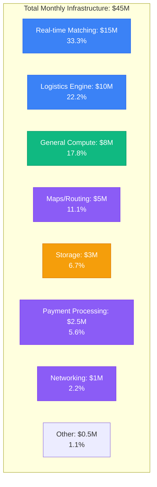

## Detailed Component Breakdown by Plane

### Edge Plane Costs: $25M/month (55.6%)

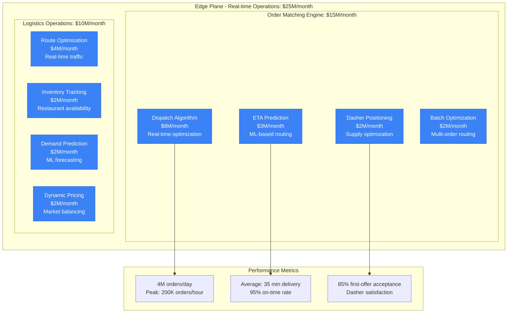

**Dispatch Algorithm Deep Dive**:
- Real-time matching: $6M/month (order-to-Dasher optimization)
- Multi-objective optimization: Minimize delivery time + maximize earnings
- Machine learning models: $2M/month in GPU compute for predictions
- Geographic optimization: City-specific algorithms

### Service Plane Costs: $8M/month (17.8%)

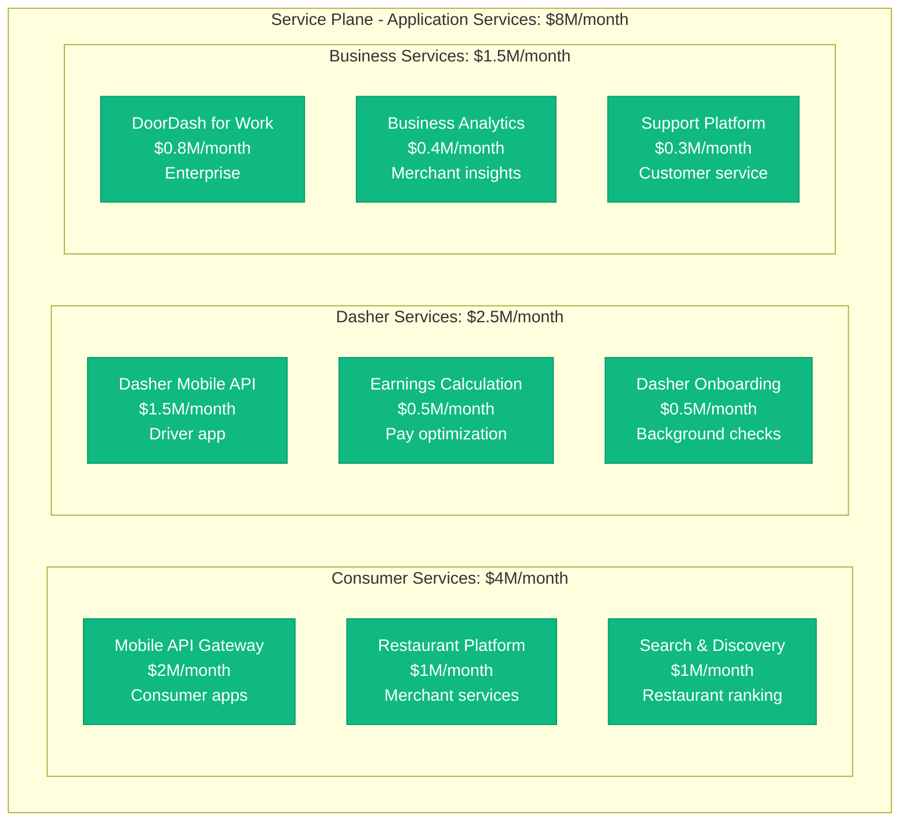

**API Performance Optimization**:
- Mobile API: 500K+ requests/second peak
- Response time: <100ms p99 for consumer APIs
- Auto-scaling: 10x capacity during meal rushes
- Geographic API distribution: Latency optimization

### State Plane Costs: $3M/month (6.7%)

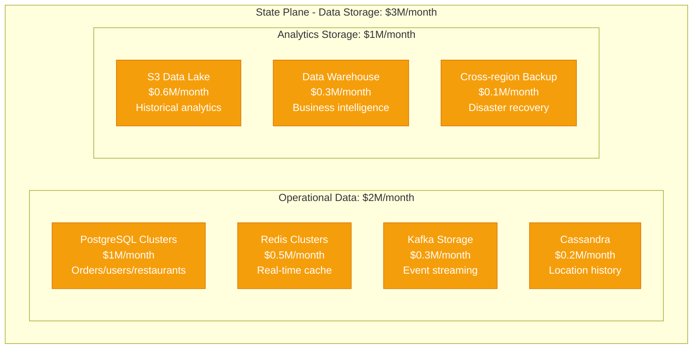

**Storage Breakdown by Data Type**:
- Order data: 1 PB total ($800K/month) - PostgreSQL
- Location tracking: 2 PB ($600K/month) - Cassandra/S3
- Menu/restaurant data: 100 TB ($200K/month) - PostgreSQL
- Real-time cache: 50 TB ($500K/month) - Redis
- Analytics data: 5 PB ($900K/month) - S3/Snowflake

### Control Plane Costs: $9.5M/month (21.1%)

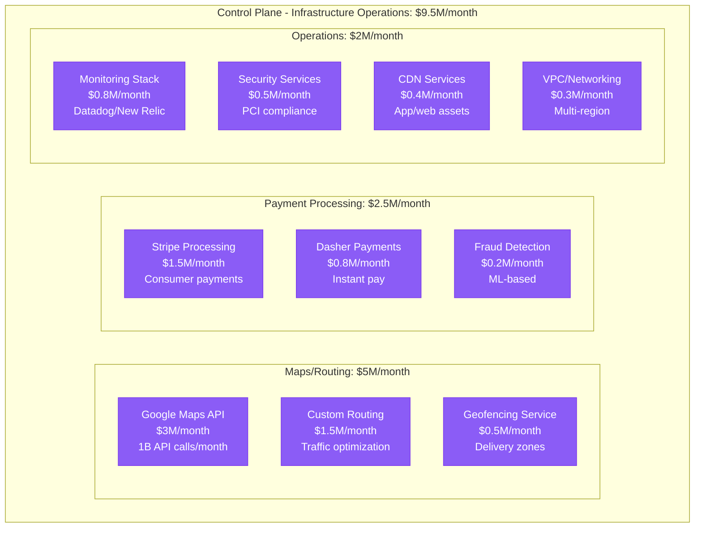

## Cost Per Order Analysis

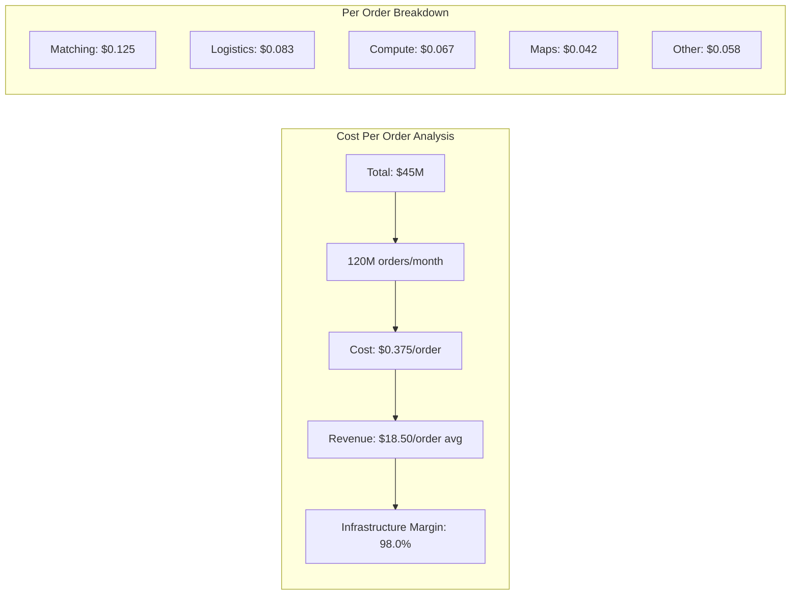

**Cost Variations by Order Type**:
- Standard Delivery: $0.30/order (most efficient)
- Express Delivery (<30 min): $0.65/order (premium routing)
- Group Orders: $0.45/order (complex coordination)
- Catering Orders: $0.80/order (advance planning)
- Grocery/Convenience: $0.55/order (inventory complexity)

## Peak Hour Cost Analysis

```mermaid
graph TB
    subgraph PeakAnalysis[Peak vs Off-Peak Infrastructure Load]
        subgraph Lunch[Lunch Rush (11:30 AM - 1:30 PM)]
            LUNCH_MATCH[Matching: 400% baseline<br/>$6M/month premium]
            LUNCH_ROUTE[Routing: 350% baseline<br/>$2M/month premium]
            LUNCH_API[APIs: 300% baseline<br/>$1.5M/month premium]
        end

        subgraph Dinner[Dinner Rush (5:30 PM - 8:30 PM)]
            DINNER_MATCH[Matching: 500% baseline<br/>$8M/month premium]
            DINNER_ROUTE[Routing: 400% baseline<br/>$2.5M/month premium]
            DINNER_API[APIs: 350% baseline<br/>$2M/month premium]
        end

        subgraph OffPeak[Off-Peak Hours]
            BASE_MATCH[Matching: 100% baseline<br/>$1M/month]
            BASE_ROUTE[Routing: 100% baseline<br/>$1M/month]
            BASE_API[APIs: 100% baseline<br/>$2M/month]
        end

        subgraph Events[Special Events]
            SUPERBOWL[Super Bowl Sunday<br/>800% baseline load]
            WEATHER[Bad Weather<br/>600% order surge]
            HOLIDAYS[Holidays<br/>400% sustained load]
        end
    end
```

**Auto-scaling Efficiency**:
- Matching engine: Scales 0-100% in 2 minutes
- Route optimization: Pre-computed for known busy areas
- Database read replicas: Dynamic creation
- Cost savings: $30M/month vs always-peak sizing

## Regional Market Cost Distribution

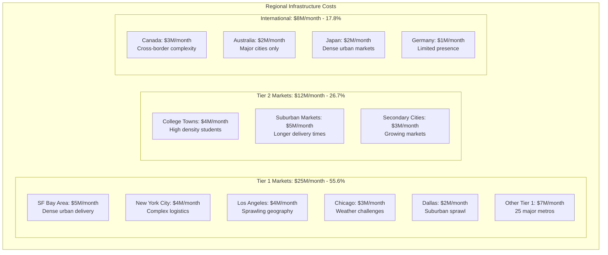

## Delivery Time vs Infrastructure Cost

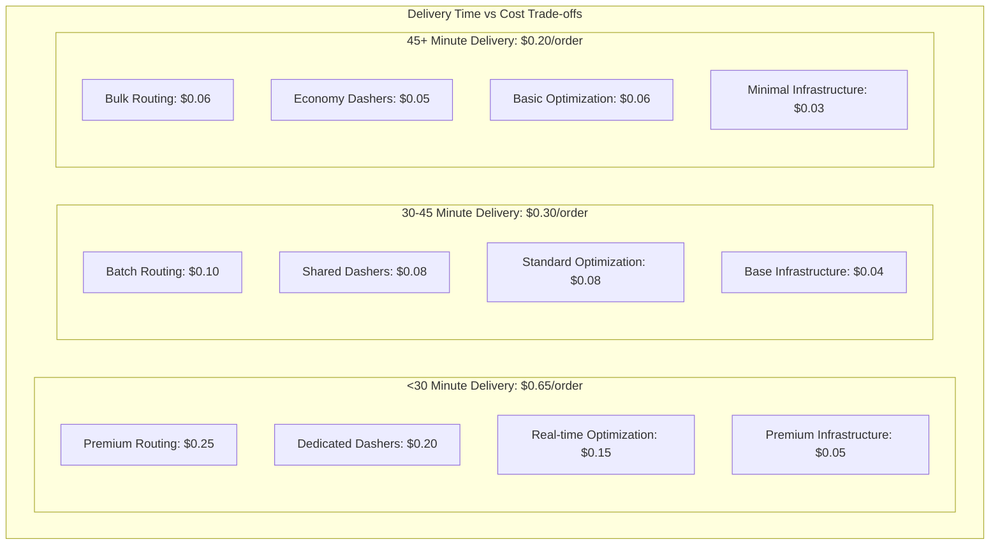

## Major Cost Optimization Initiatives

### 1. Machine Learning-Driven Dispatch Optimization (2022-2024)
```
Investment: $80M in ML infrastructure and talent
Annual Savings: $200M in improved efficiency
Key Metrics:
- 25% improvement in delivery time accuracy
- 15% reduction in average delivery time
- 30% improvement in Dasher earnings per hour
ROI: 250% annually
```

### 2. Dynamic Batching and Multi-Stop Optimization (2023)
```
Initiative: AI-powered order batching
Investment: $40M in algorithm development
Results:
- 40% of orders now batched (vs 20% previously)
- 20% reduction in per-order infrastructure cost
- $108M annual savings
Customer satisfaction: Maintained despite longer routes
```

### 3. Edge Computing for Real-time Decisions (2023-2024)
```
Deployment: 50 edge locations in major markets
Investment: $30M in edge infrastructure
Benefits:
- 50% reduction in matching latency (200ms → 100ms)
- Improved Dasher experience and acceptance rates
- $5M/month reduction in core compute costs
```

### 4. Kubernetes and Microservices Migration (2021-2023)
```
Migration: 95% of services to Kubernetes
Resource Utilization: +80% improvement
Auto-scaling Efficiency: +70% cost reduction
Deployment Speed: 20x faster releases
Operational Savings: $6M/month
```

## Technology Stack Cost Breakdown

| Technology Category | Monthly Cost | Key Technologies | Optimization Focus |
|---------------------|--------------|------------------|-------------------|
| Dispatch/Matching | $15M | Go, Python, PostgreSQL | Algorithm efficiency |
| Logistics Optimization | $10M | Python, TensorFlow, Kafka | ML model accuracy |
| Mobile APIs | $6M | Node.js, Java, Redis | Response time optimization |
| Maps/Routing | $5M | Google Maps, Custom routing | API call reduction |
| Data Storage | $3M | PostgreSQL, Cassandra, S3 | Query optimization |
| Payment Processing | $2.5M | Stripe, custom systems | Transaction efficiency |
| Real-time Cache | $1.5M | Redis, Memcached | Hit rate optimization |
| Monitoring/Ops | $1M | Datadog, New Relic | Cost-effective observability |
| Security/Compliance | $0.8M | Various security tools | PCI/SOC2 requirements |
| CDN/Assets | $0.2M | CloudFlare, AWS CloudFront | Cache optimization |

## Dasher Economics Integration

### Cost Impact of Dasher Behavior

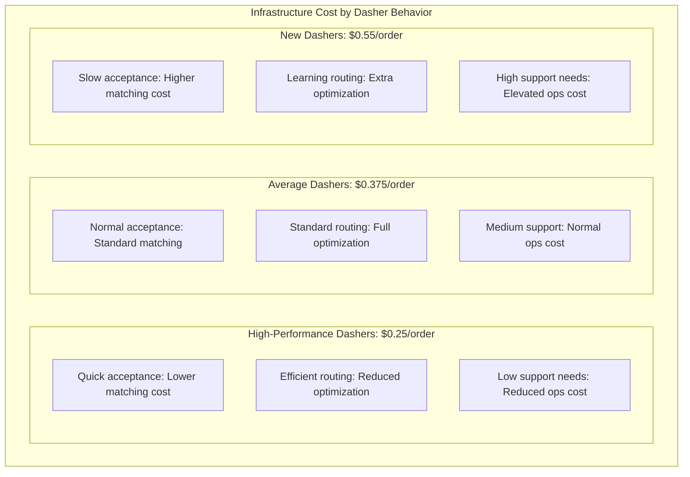

## Competitive Cost Analysis

```mermaid
graph TB
    subgraph Comparison[Cost Per Order Comparison (Food Delivery)]
        DOORDASH[DoorDash: $0.375/order<br/>Market leader efficiency]
        UBEREATS[Uber Eats: $0.42/order<br/>Shared infrastructure]
        GRUBHUB[Grubhub: $0.55/order<br/>Legacy infrastructure]
        POSTMATES[Postmates: $0.48/order<br/>Pre-Uber acquisition]
        INSTACART[Instacart: $0.80/order<br/>Grocery complexity]
        AMAZON[Amazon Fresh: $0.35/order<br/>Internal pricing]
    end

    subgraph Factors[Cost Factors]
        SCALE_FACTOR[Scale advantages<br/>DoorDash #1 market share]
        TECH_FACTOR[Technology investment<br/>ML-driven optimization]
        DENSITY_FACTOR[Market density<br/>Network effects]
        LOGISTICS_FACTOR[Logistics expertise<br/>Last-mile optimization]
    end
```

## Future Infrastructure Roadmap

### 2025-2026 Strategic Investments

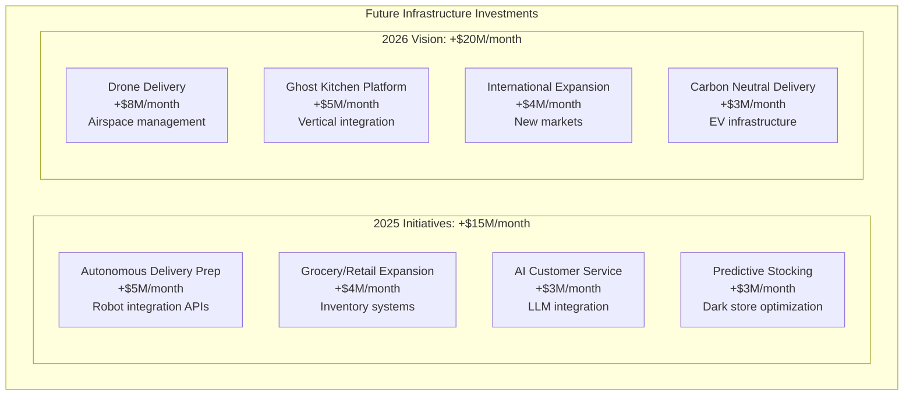

### Cost Reduction Opportunities

1. **Advanced Route Optimization**: -$3M/month (quantum-inspired algorithms)
2. **Predictive Demand Modeling**: -$2M/month (better resource allocation)
3. **Edge Computing Expansion**: -$2M/month (reduced latency costs)
4. **Serverless Migration**: -$1.5M/month (pay-per-use efficiency)
5. **Database Optimization**: -$1M/month (better sharding strategies)

## Business Model Integration

### Revenue vs Infrastructure Cost

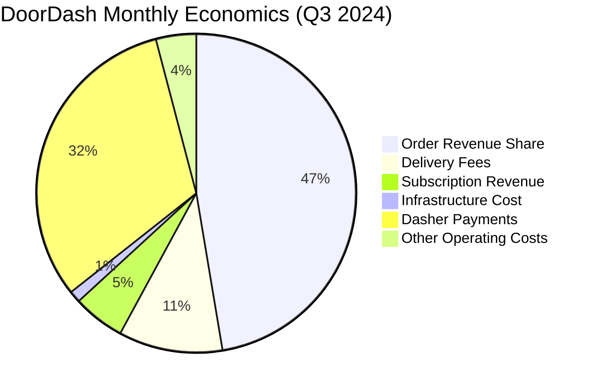

**Financial Health**:
- Monthly Revenue: ~$2.4B
- Infrastructure Cost: $45M (1.9% of revenue)
- Infrastructure Margin: 98.1%
- Growth Investment: Heavy R&D in logistics optimization

### Per-Order Economics
- Average Order Value: $35
- DoorDash Take Rate: 18.5% ($6.50/order)
- Infrastructure Cost: $0.375/order (5.8% of take rate)
- Contribution Margin: $6.125/order after infrastructure

## Disaster Recovery and Business Continuity

### 3 AM Incident Scenarios

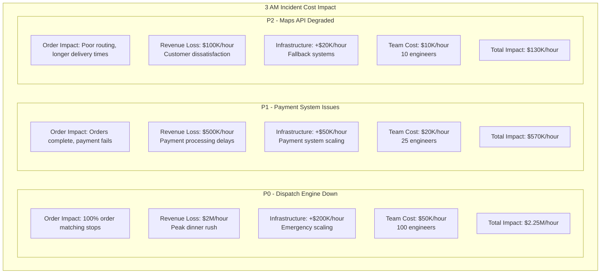

### Business Continuity Investment

- **Multi-region Setup**: $12M/month (26.7% of total cost)
- **RTO Target**: 2 minutes for dispatch systems
- **RPO Target**: 30 seconds for order data
- **Chaos Engineering**: $1M/month in failure testing
- **Hot Standby**: Dispatch algorithms running in multiple regions

## Key Success Factors

### 1. Logistics-First Architecture
- Real-time optimization at massive scale
- Machine learning-driven decision making
- Geographic density creates network effects
- Last-mile delivery expertise as competitive moat

### 2. Marketplace Balance Optimization
- Supply (Dashers) and demand (orders) balancing
- Dynamic pricing to optimize market efficiency
- Real-time adjustments based on local conditions
- Data-driven decision making at city/neighborhood level

### 3. Platform Scale Economics
- Shared infrastructure across multiple verticals
- Network effects improve efficiency as scale grows
- Data advantages compound with more orders
- Technology investments amortized across large order volume

## References and Data Sources

- DoorDash Q3 2024 Earnings Report and SEC Filings
- "Building DoorDash's Logistics Engine" - Engineering Blog
- "Machine Learning at DoorDash" - MLOps Conference 2024
- "Real-time Optimization for Last-Mile Delivery" - Research Papers
- AWS Case Study: DoorDash Infrastructure (2024)
- Industry analysis from logistics and food delivery research
- Cost modeling based on public cloud pricing and disclosed metrics

---

*Last Updated: September 2024*
*Note: Costs are estimates based on public financial reports, engineering presentations, and industry analysis*