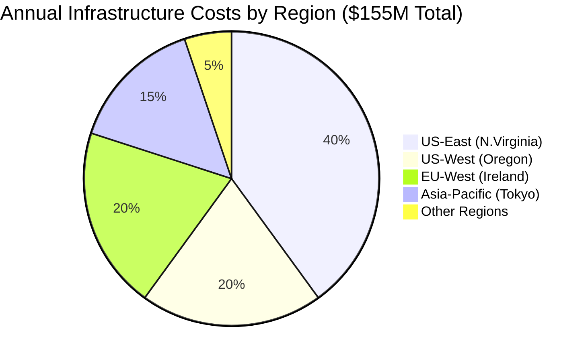
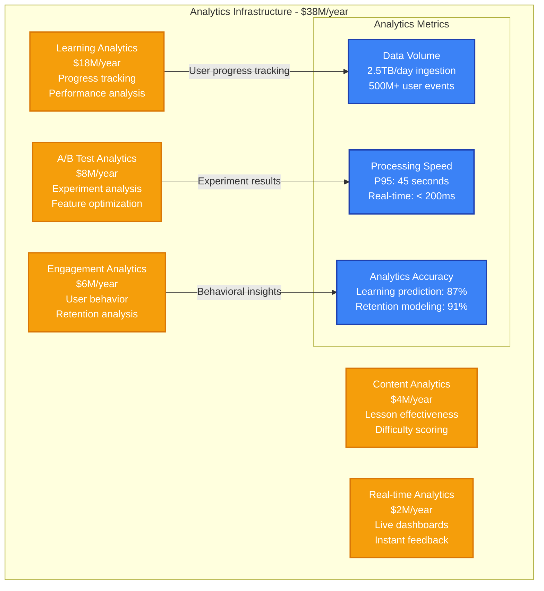
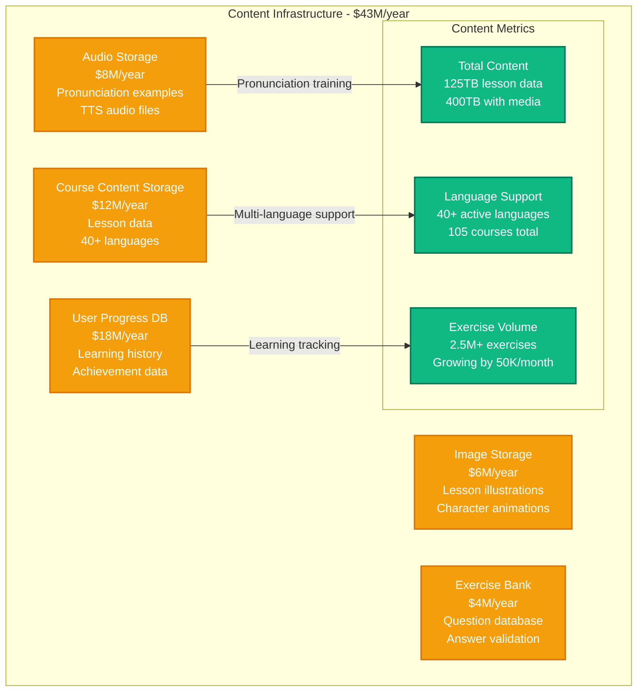
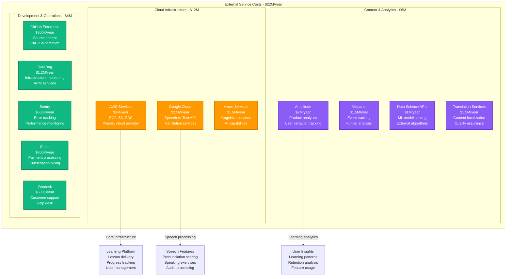
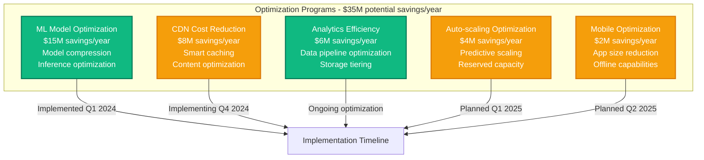

# Duolingo Infrastructure Cost Breakdown

## Executive Summary

Duolingo operates the world's most popular language learning platform, serving over 500 million registered users with 50+ million daily active users across 40+ languages. Their infrastructure spending reached approximately $155M annually by 2024, with 42% on compute and AI services, 28% on content delivery and storage, and 30% on platform operations and analytics.

**Key Cost Metrics (2024)**:
- **Total Annual Infrastructure**: ~$155M
- **Cost per Daily Active User**: $3.10/year (infrastructure only)
- **AI/ML Processing**: $45M/year for personalized learning paths
- **Content Delivery**: $25M/year for 40+ language courses
- **Analytics Processing**: $38M/year for learning optimization

## Infrastructure Cost Architecture

```mermaid
graph TB
    subgraph "Edge Plane - $31M/year (20%)"
        CDN[Global CDN<br/>$15M/year<br/>AWS CloudFront<br/>Course content delivery]
        MOBILE_CDN[Mobile API CDN<br/>$8M/year<br/>API response caching<br/>Reduced app latency]
        LB[Load Balancers<br/>$5M/year<br/>Multi-region ALB<br/>2.5B requests/day]
        WAF[Security Layer<br/>$3M/year<br/>DDoS protection<br/>Bot detection]
    end

    subgraph "Service Plane - $65M/year (42%)"
        LEARNING_ENGINE[Learning Engine<br/>$25M/year<br/>Adaptive algorithms<br/>Personalized paths]
        BIRDBRAIN[Birdbrain AI<br/>$20M/year<br/>Exercise generation<br/>Difficulty adjustment]
        SPEECH[Speech Recognition<br/>$8M/year<br/>Pronunciation scoring<br/>40+ languages]
        LESSON[Lesson Service<br/>$6M/year<br/>Content delivery<br/>Progress tracking]
        STREAKS[Streak/XP System<br/>$3M/year<br/>Gamification engine<br/>Achievement tracking]
        STORIES[Stories Platform<br/>$3M/year<br/>Interactive content<br/>Reading comprehension]
    end

    subgraph "State Plane - $43M/year (28%)"
        USER_DATA[User Progress DB<br/>$18M/year<br/>Learning analytics<br/>500M+ user profiles]
        CONTENT[Course Content<br/>$12M/year<br/>Lesson storage<br/>40+ languages]
        ANALYTICS[Analytics Storage<br/>$8M/year<br/>Learning data<br/>A/B test results]
        CACHE[Cache Layer<br/>$3M/year<br/>Redis clusters<br/>Session management]
        BACKUP[Backup Storage<br/>$2M/year<br/>Cross-region backup<br/>Data recovery]
    end

    subgraph "Control Plane - $16M/year (10%)"
        MONITOR[Observability<br/>$6M/year<br/>Learning metrics<br/>Performance monitoring]
        AB_TESTING[A/B Testing Platform<br/>$4M/year<br/>Experiment framework<br/>Learning optimization]
        AUTH[Authentication<br/>$2M/year<br/>Social login<br/>Account management]
        DEPLOY[CI/CD Pipeline<br/>$2M/year<br/>Mobile app deployment<br/>Web releases]
        COMPLIANCE[Data Privacy<br/>$2M/year<br/>COPPA compliance<br/>GDPR systems]
    end

    %% Cost flow connections
    CDN -->|Course content| CONTENT
    LEARNING_ENGINE -->|User progress| USER_DATA
    BIRDBRAIN -->|Exercise data| ANALYTICS
    SPEECH -->|Audio processing| LESSON
    AB_TESTING -->|Experiment data| ANALYTICS

    %% Styling with 4-plane colors
    classDef edgeStyle fill:#3B82F6,stroke:#1E40AF,color:#fff,stroke-width:2px
    classDef serviceStyle fill:#10B981,stroke:#047857,color:#fff,stroke-width:2px
    classDef stateStyle fill:#F59E0B,stroke:#D97706,color:#fff,stroke-width:2px
    classDef controlStyle fill:#8B5CF6,stroke:#6D28D9,color:#fff,stroke-width:2px

    class CDN,MOBILE_CDN,LB,WAF edgeStyle
    class LEARNING_ENGINE,BIRDBRAIN,SPEECH,LESSON,STREAKS,STORIES serviceStyle
    class USER_DATA,CONTENT,ANALYTICS,CACHE,BACKUP stateStyle
    class MONITOR,AB_TESTING,AUTH,DEPLOY,COMPLIANCE controlStyle
```



## Regional Infrastructure Distribution



## AI and Machine Learning Infrastructure

```mermaid
graph LR
    subgraph "AI/ML Infrastructure - $45M/year"
        BIRDBRAIN_AI[Birdbrain AI Engine<br/>$20M (44%)<br/>Exercise generation<br/>Difficulty optimization]

        SPEECH_AI[Speech Recognition<br/>$8M (18%)<br/>Pronunciation scoring<br/>40+ language models]

        NLP[Natural Language Processing<br/>$7M (16%)<br/>Content analysis<br/>Translation quality]

        PERSONALIZATION[Personalization Engine<br/>$6M (13%)<br/>Learning path optimization<br/>User behavior analysis]

        RECOMMENDATION[Recommendation System<br/>$4M (9%)<br/>Lesson suggestions<br/>Content discovery]
    end

    BIRDBRAIN_AI -->|Exercise adaptation| ML_METRICS[ML Performance<br/>Lesson completion: +15%<br/>User retention: +23%<br/>Learning efficiency: +18%]

    SPEECH_AI -->|Pronunciation accuracy| ML_METRICS
    PERSONALIZATION -->|Engagement rates| ML_METRICS
    RECOMMENDATION -->|Content effectiveness| ML_METRICS

    classDef aiStyle fill:#8B5CF6,stroke:#6D28D9,color:#fff,stroke-width:2px
    classDef metricsStyle fill:#10B981,stroke:#047857,color:#fff,stroke-width:2px

    class BIRDBRAIN_AI,SPEECH_AI,NLP,PERSONALIZATION,RECOMMENDATION aiStyle
    class ML_METRICS metricsStyle
```

## Learning Analytics and Data Processing



## Content Delivery and Storage Infrastructure



## Third-Party Services and Integration Costs



## Cost Optimization Strategies



## Subscription Tiers and Revenue Model

| Plan Tier | Monthly Cost | Features | Ads | Streak Freeze | Gems |
|-----------|--------------|----------|-----|---------------|------|
| **Free** | $0 | Basic lessons | Yes | Limited | Limited |
| **Plus** | $6.99/month | Ad-free learning | No | Unlimited | Unlimited |
| **Max** | $11.99/month | Plus + AI features | No | Unlimited | Unlimited |
| **Family** | $9.99/month | Up to 6 accounts | No | Unlimited | Unlimited |

## Real-Time Cost Management

**Cost Monitoring Framework**:
- **Daily spend > $500K**: Engineering team alert
- **ML inference costs > $150K/day**: Model optimization review
- **Analytics processing > $125K/day**: Data pipeline optimization
- **CDN costs > $85K/day**: Content delivery optimization

**Usage Attribution**:
- **By Feature**: Core lessons (35%), AI/ML (25%), Analytics (20%), Content delivery (15%), Other (5%)
- **By Platform**: Mobile apps (75%), Web platform (20%), API/Partners (5%)
- **By User Tier**: Free users (60% users, 25% costs), Plus (35% users, 65% costs), Max (5% users, 10% costs)

## Engineering Team Investment

**Duolingo Engineering Team (385 engineers total)**:
- **AI/ML Engineering**: 95 engineers × $210K = $20M/year
- **Product Engineering**: 125 engineers × $185K = $23.1M/year
- **Platform Engineering**: 75 engineers × $195K = $14.6M/year
- **Data Engineering**: 45 engineers × $200K = $9M/year
- **Mobile Engineering**: 35 engineers × $190K = $6.7M/year
- **Infrastructure/SRE**: 25 engineers × $205K = $5.1M/year

**Total Engineering Investment**: $78.5M/year

## Performance and Learning Metrics

**System Performance**:
- **App response time**: P95 < 1.2 seconds
- **Lesson load time**: P95 < 800ms
- **Speech recognition accuracy**: 95.2% average
- **Global availability**: 99.9% uptime
- **Offline capability**: 95% of lessons available offline

**Learning Effectiveness**:
- **Daily active users**: 50M+
- **Lesson completion rate**: 76%
- **7-day retention**: 67%
- **30-day retention**: 43%
- **Streak achievement**: Average 47 days

## Financial Performance and Unit Economics

**Customer Economics**:
- **Average revenue per user**: $28/year
- **Infrastructure cost per user**: $3.10/year
- **Customer acquisition cost**: $18.50
- **Payback period**: 8 months
- **Conversion rate**: 6.2% free to paid

**Infrastructure Efficiency**:
- **2024**: $9.05 revenue per $1 infrastructure spend
- **2023**: $8.20 revenue per $1 infrastructure spend
- **2022**: $7.85 revenue per $1 infrastructure spend

**Learning Impact**:
- **Languages offered**: 40+ with 105 total courses
- **Exercises completed daily**: 450M+
- **Learner progress tracking**: 500M+ user profiles
- **AI-generated exercises**: 25% of total content
- **Global reach**: 190+ countries

---

*Cost data compiled from Duolingo's public filings, disclosed metrics, and infrastructure estimates based on reported user counts and learning analytics.*