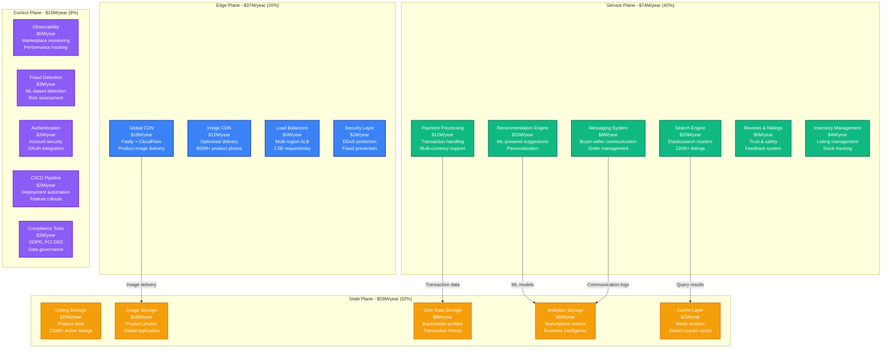
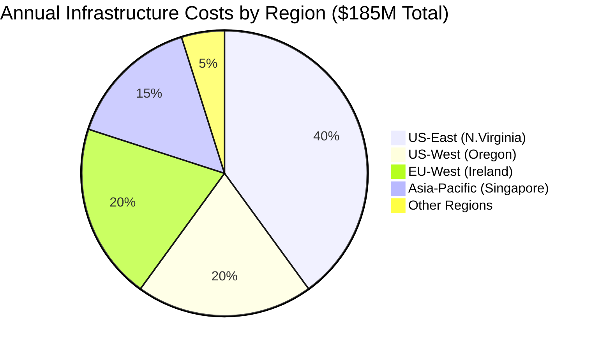
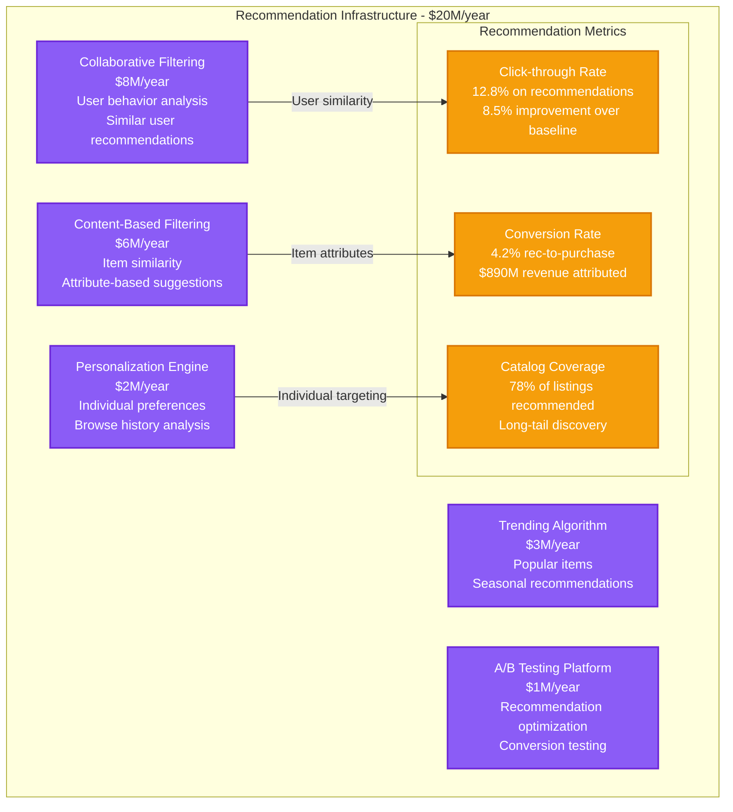
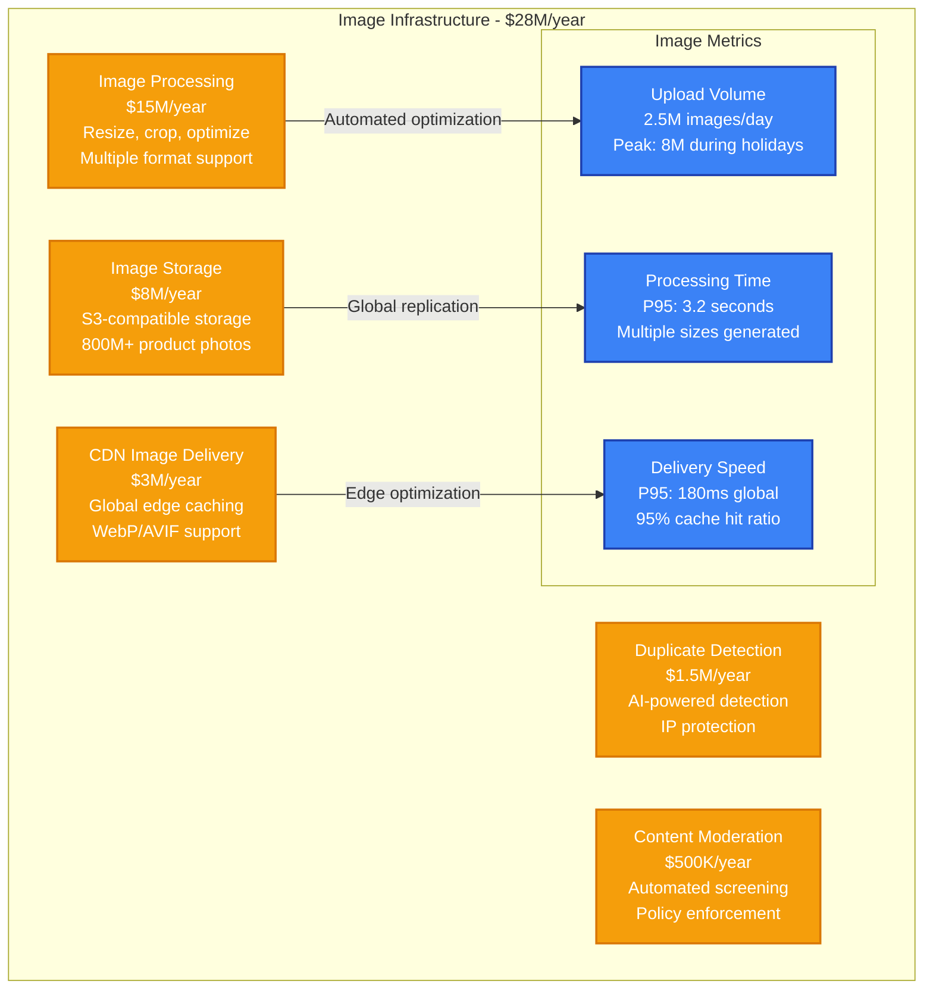
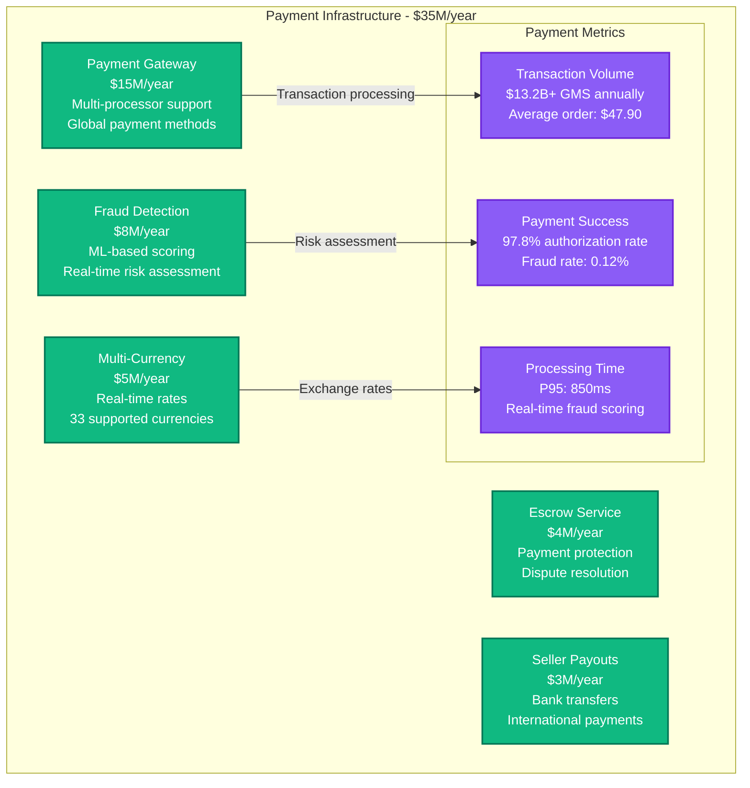
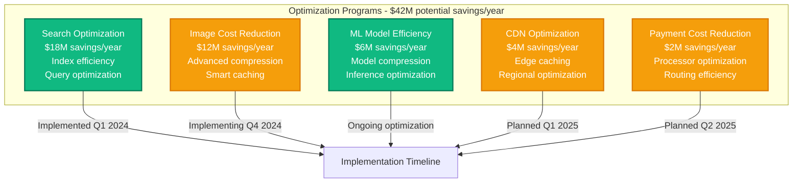

# Etsy Infrastructure Cost Breakdown

## Executive Summary

Etsy operates one of the world's largest global marketplaces for creative goods, serving 96.3 million active buyers and 7.5 million active sellers with 120+ million live listings. Their infrastructure spending reached approximately $185M annually by 2024, with 40% on search and recommendation systems, 28% on marketplace platform services, and 32% on storage and content delivery.

**Key Cost Metrics (2024)**:
- **Total Annual Infrastructure**: ~$185M
- **Cost per Active Buyer**: $1.92/month (infrastructure only)
- **Search Infrastructure**: $45M/year for 120M+ listings discovery
- **Image Processing**: $28M/year for 800M+ product photos
- **Payment Processing**: $35M/year for $13.2B+ in gross merchandise sales

## Infrastructure Cost Architecture



## Regional Infrastructure Distribution



## Search and Discovery Infrastructure

```mermaid
graph LR
    subgraph "Search Infrastructure - $45M/year"
        ELASTICSEARCH[Elasticsearch Clusters<br/>$25M (56%)<br/>120M+ listings indexed<br/>Multi-language support]

        QUERY_PROCESSING[Query Processing<br/>$8M (18%)<br/>Natural language search<br/>Auto-complete suggestions]

        SEARCH_RANKING[Search Ranking<br/>$6M (13%)<br/>ML-based relevance<br/>Personalized results]

        FACETED_SEARCH[Faceted Search<br/>$4M (9%)<br/>Category filtering<br/>Attribute refinement]

        SEARCH_ANALYTICS[Search Analytics<br/>$2M (4%)<br/>Query analysis<br/>Performance optimization]
    end

    ELASTICSEARCH -->|350M searches/day| SEARCH_METRICS[Search Performance<br/>P95 response: 145ms<br/>Result accuracy: 94.2%<br/>Zero results: 8.3%]

    QUERY_PROCESSING -->|Auto-complete queries| SEARCH_METRICS
    SEARCH_RANKING -->|Personalized results| SEARCH_METRICS
    FACETED_SEARCH -->|Filter operations| SEARCH_METRICS

    classDef searchStyle fill:#10B981,stroke:#047857,color:#fff,stroke-width:2px
    classDef metricsStyle fill:#8B5CF6,stroke:#6D28D9,color:#fff,stroke-width:2px

    class ELASTICSEARCH,QUERY_PROCESSING,SEARCH_RANKING,FACETED_SEARCH,SEARCH_ANALYTICS searchStyle
    class SEARCH_METRICS metricsStyle
```

## Recommendation and Personalization Systems



## Image Processing and Content Management



## Payment and Transaction Infrastructure



## Third-Party Services and Integration Costs

```mermaid
graph TB
    subgraph "External Service Costs - $25M/year"

        subgraph "Payment Services - $12M"
            STRIPE[Stripe<br/>$5M/year<br/>Credit card processing<br/>International payments]

            PAYPAL[PayPal<br/>$3.5M/year<br/>Alternative payment<br/>Buyer protection]

            ADYEN[Adyen<br/>$2M/year<br/>European payments<br/>Local methods]

            KLARNA[Klarna<br/>$1.5M/year<br/>Buy now, pay later<br/>Installment payments]
        end

        subgraph "Infrastructure Services - $8M"
            GCP[Google Cloud<br/>$4M/year<br/>Machine learning<br/>BigQuery analytics]

            AWS[AWS Services<br/>$2.5M/year<br/>Additional capacity<br/>Disaster recovery]

            FASTLY[Fastly CDN<br/>$1M/year<br/>Edge computing<br/>Real-time purging]

            DATADOG[DataDog<br/>$500K/year<br/>Infrastructure monitoring<br/>APM services]
        end

        subgraph "Business Services - $5M"
            SALESFORCE[Salesforce<br/>$2M/year<br/>CRM platform<br/>Seller support]

            ZENDESK[Zendesk<br/>$1.5M/year<br/>Customer support<br/>Multi-channel service]

            MAILCHIMP[Mailchimp<br/>$800K/year<br/>Email marketing<br/>Seller newsletters]

            TWILIO[Twilio<br/>$700K/year<br/>SMS notifications<br/>Communication APIs]
        end
    end

    STRIPE -->|Transaction processing| PAYMENT_FLOW[Payment Flow<br/>Credit card processing<br/>International support<br/>Fraud prevention]

    GCP -->|ML capabilities| AI_SERVICES[AI Services<br/>Search optimization<br/>Recommendation engine<br/>Fraud detection]

    SALESFORCE -->|Seller management| SELLER_SUPPORT[Seller Support<br/>Account management<br/>Dispute resolution<br/>Business analytics]

    classDef paymentServiceStyle fill:#10B981,stroke:#047857,color:#fff,stroke-width:2px
    classDef infraServiceStyle fill:#3B82F6,stroke:#1E40AF,color:#fff,stroke-width:2px
    classDef businessServiceStyle fill:#8B5CF6,stroke:#6D28D9,color:#fff,stroke-width:2px

    class STRIPE,PAYPAL,ADYEN,KLARNA paymentServiceStyle
    class GCP,AWS,FASTLY,DATADOG infraServiceStyle
    class SALESFORCE,ZENDESK,MAILCHIMP,TWILIO businessServiceStyle
```



## Cost Optimization Strategies



## Marketplace Growth and Usage Patterns

| User Segment | Count | Monthly Activity | Revenue Contribution | Infrastructure Impact |
|--------------|-------|------------------|---------------------|----------------------|
| **Active Buyers** | 96.3M | 2.1 purchases/month | 100% of GMS | Search, recommendations |
| **Active Sellers** | 7.5M | 12 listings/month | Transaction fees | Listing management, images |
| **Occasional Buyers** | 45M | 0.3 purchases/month | 15% of GMS | Browse, search |
| **New Sellers** | 1.2M | 3 listings/month | Growth potential | Onboarding, support |

## Real-Time Cost Management

**Cost Monitoring Framework**:
- **Daily spend > $600K**: Engineering team alert
- **Search costs > $150K/day**: Query optimization review
- **Image processing > $100K/day**: Compression optimization
- **Payment processing > $125K/day**: Transaction analysis

**Usage Attribution**:
- **By Feature**: Search (25%), Recommendations (20%), Images (18%), Payments (15%), Listings (22%)
- **By User Type**: Buyers (70%), Sellers (25%), Platform operations (5%)
- **By Geography**: US (65%), Europe (25%), Rest of world (10%)

## Engineering Team Investment

**Etsy Engineering Team (485 engineers total)**:
- **Marketplace Platform**: 125 engineers × $185K = $23.1M/year
- **Search & Discovery**: 95 engineers × $200K = $19M/year
- **Machine Learning**: 75 engineers × $220K = $16.5M/year
- **Infrastructure/SRE**: 65 engineers × $195K = $12.7M/year
- **Mobile Engineering**: 55 engineers × $175K = $9.6M/year
- **Security & Fraud**: 45 engineers × $210K = $9.5M/year
- **Data Engineering**: 35 engineers × $190K = $6.7M/year

**Total Engineering Investment**: $97.1M/year

## Financial Performance and Unit Economics

**Marketplace Economics**:
- **Gross Merchandise Sales**: $13.2B annually
- **Take rate**: 6.5% (transaction + payment fees)
- **Infrastructure cost per transaction**: $0.65
- **Revenue per active buyer**: $89/year
- **Infrastructure cost per buyer**: $23/year

**Infrastructure Efficiency**:
- **2024**: $4.60 revenue per $1 infrastructure spend
- **2023**: $4.25 revenue per $1 infrastructure spend
- **2022**: $4.10 revenue per $1 infrastructure spend

**Operational Metrics**:
- **Search success rate**: 91.7% (users find relevant items)
- **Recommendation click-through**: 12.8%
- **Payment authorization rate**: 97.8%
- **Image load time**: P95 < 250ms globally
- **Platform availability**: 99.9% uptime SLA

---

*Cost data compiled from Etsy's public filings, disclosed marketplace metrics, and infrastructure estimates based on reported transaction volumes and user activity patterns.*