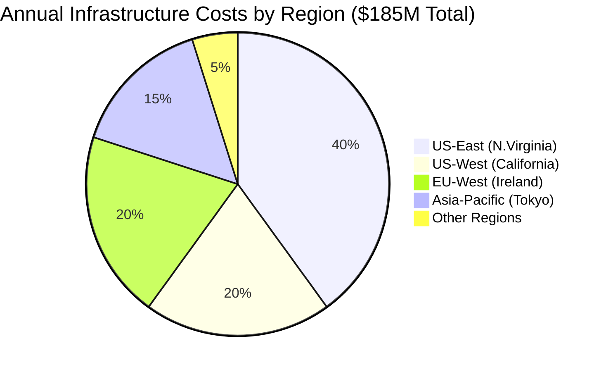
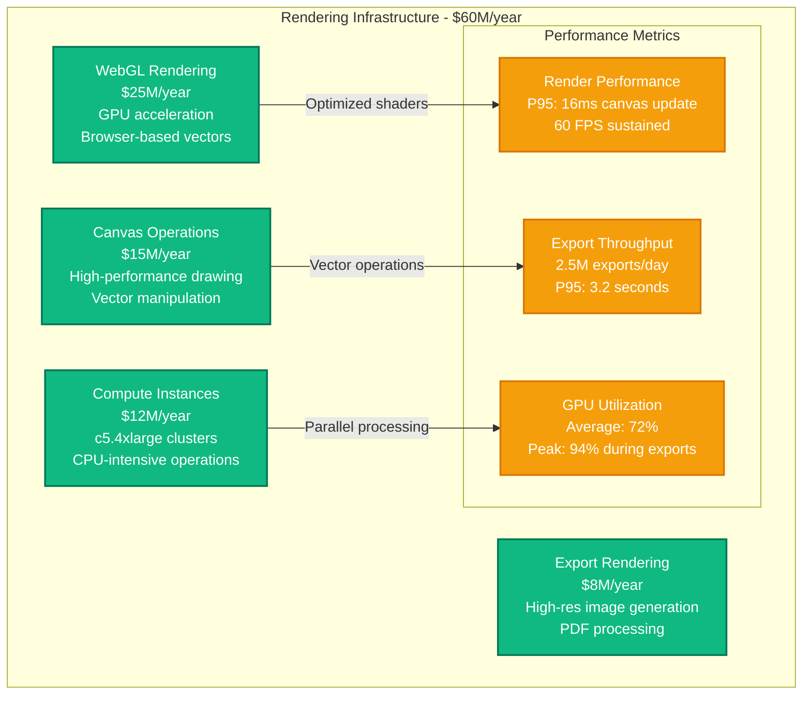
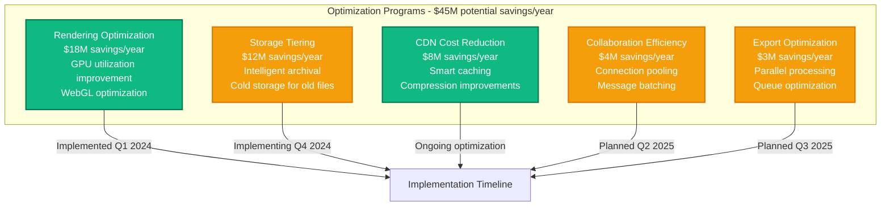

# Figma Infrastructure Cost Breakdown

## Executive Summary

Figma operates the world's leading collaborative design platform, serving over 4 million daily active users across 500,000+ organizations with real-time multiplayer editing. Their infrastructure spending reached approximately $185M annually by 2024, with 48% on compute resources, 28% on storage and content delivery, and 24% on networking and platform operations.

**Key Cost Metrics (2024)**:
- **Total Annual Infrastructure**: ~$185M
- **Cost per Daily Active User**: $46/year (infrastructure only)
- **Real-time Collaboration**: 15M+ concurrent editing sessions
- **File Storage Cost**: $52M/year for 850+ million design files
- **WebGL Rendering**: $35M/year for browser-based vector processing

## Infrastructure Cost Architecture

```mermaid
graph TB
    subgraph "Edge Plane - $44M/year (24%)"
        CDN[Global CDN<br/>$18M/year<br/>AWS CloudFront<br/>125TB/day transfer]
        EDGE_RENDER[Edge Rendering<br/>$15M/year<br/>WebGL acceleration<br/>GPU-optimized nodes]
        LB[Load Balancers<br/>$6M/year<br/>Multi-region ALB<br/>1.5B requests/day]
        WAF[Security Layer<br/>$5M/year<br/>DDoS protection<br/>Bot mitigation]
    end

    subgraph "Service Plane - $89M/year (48%)"
        COLLAB[Real-time Collaboration<br/>$35M/year<br/>WebSocket infrastructure<br/>15M concurrent sessions]
        RENDER[Rendering Engine<br/>$25M/year<br/>Vector processing<br/>Canvas operations]
        EXPORT[Export Service<br/>$12M/year<br/>PNG, SVG, PDF<br/>Image generation]
        VERSION[Version Control<br/>$8M/year<br/>File history<br/>Branch management]
        PLUGINS[Plugin Platform<br/>$6M/year<br/>Third-party integrations<br/>API processing]
        COMMENTS[Comments System<br/>$3M/year<br/>Threaded discussions<br/>Notification service]
    end

    subgraph "State Plane - $52M/year (28%)"
        FILES[File Storage<br/>$32M/year<br/>Design files<br/>850M+ files stored]
        ASSETS[Asset Storage<br/>$12M/year<br/>Images, fonts, icons<br/>Global replication]
        DATABASE[Primary Database<br/>$6M/year<br/>PostgreSQL clusters<br/>User data, metadata]
        CACHE[Cache Layer<br/>$2M/year<br/>Redis clusters<br/>Session management]
    end

    subgraph "Control Plane - $25M/year (14%)"
        MONITOR[Observability<br/>$8M/year<br/>Custom monitoring<br/>Performance tracking]
        AUTH[Authentication<br/>$5M/year<br/>SSO, SAML<br/>Enterprise security]
        DEPLOY[CI/CD Pipeline<br/>$4M/year<br/>Continuous deployment<br/>Feature flags]
        BILLING[Usage Tracking<br/>$3M/year<br/>Seat management<br/>Usage analytics]
        BACKUP[Backup Systems<br/>$5M/year<br/>Disaster recovery<br/>Point-in-time recovery]
    end

    %% Cost flow connections
    CDN -->|Asset delivery| ASSETS
    COLLAB -->|Real-time updates| FILES
    RENDER -->|Canvas operations| EDGE_RENDER
    EXPORT -->|Generated images| CDN
    VERSION -->|File snapshots| BACKUP

    %% Styling with 4-plane colors
    classDef edgeStyle fill:#3B82F6,stroke:#1E40AF,color:#fff,stroke-width:2px
    classDef serviceStyle fill:#10B981,stroke:#047857,color:#fff,stroke-width:2px
    classDef stateStyle fill:#F59E0B,stroke:#D97706,color:#fff,stroke-width:2px
    classDef controlStyle fill:#8B5CF6,stroke:#6D28D9,color:#fff,stroke-width:2px

    class CDN,EDGE_RENDER,LB,WAF edgeStyle
    class COLLAB,RENDER,EXPORT,VERSION,PLUGINS,COMMENTS serviceStyle
    class FILES,ASSETS,DATABASE,CACHE stateStyle
    class MONITOR,AUTH,DEPLOY,BILLING,BACKUP controlStyle
```



## Regional Infrastructure Distribution



## Real-Time Collaboration Infrastructure

```mermaid
graph LR
    subgraph "Collaboration Service - $35M/year"
        WEBSOCKET[WebSocket Servers<br/>$18M (51%)<br/>Persistent connections<br/>15M concurrent sessions]

        OPERATIONAL[Operational Transform<br/>$8M (23%)<br/>Conflict resolution<br/>Vector operations]

        BROADCAST[Message Broadcasting<br/>$6M (17%)<br/>Multi-user sync<br/>Real-time updates]

        PRESENCE[Presence Service<br/>$3M (9%)<br/>Cursor tracking<br/>User awareness]
    end

    WEBSOCKET -->|Average: 8 users/file| COLLAB_METRICS[Collaboration Metrics<br/>2.5B operations/day<br/>P99 latency: 35ms<br/>99.95% uptime]

    OPERATIONAL -->|Vector transformations| COLLAB_METRICS
    BROADCAST -->|Fan-out ratio: 1:7.2| COLLAB_METRICS
    PRESENCE -->|Live cursor updates| COLLAB_METRICS

    classDef collabStyle fill:#10B981,stroke:#047857,color:#fff,stroke-width:2px
    classDef metricsStyle fill:#8B5CF6,stroke:#6D28D9,color:#fff,stroke-width:2px

    class WEBSOCKET,OPERATIONAL,BROADCAST,PRESENCE collabStyle
    class COLLAB_METRICS metricsStyle
```

## Rendering and Compute Infrastructure



## File Storage and Asset Management

```mermaid
graph TB
    subgraph "Storage Infrastructure - $52M/year"
        DESIGN_FILES[Design Files<br/>$32M/year<br/>Vector data storage<br/>850M+ files]

        VERSION_STORAGE[Version History<br/>$8M/year<br/>Incremental snapshots<br/>90-day retention]

        ASSET_LIBRARY[Asset Libraries<br/>$7M/year<br/>Shared components<br/>Team assets]

        CACHE_STORAGE[Cache Storage<br/>$3M/year<br/>Rendered previews<br/>Thumbnail cache]

        BACKUP_STORAGE[Backup Storage<br/>$2M/year<br/>Cross-region backup<br/>Disaster recovery]

        subgraph "Storage Metrics"
            TOTAL_SIZE[Total Storage<br/>1.2PB design data<br/>2.8PB with backups]

            GROWTH_RATE[Growth Rate<br/>45TB/month<br/>Accelerating with AI features]

            ACCESS_PATTERN[Access Patterns<br/>Hot: 40% (30 days)<br/>Warm: 35% (90 days)<br/>Cold: 25% (archive)]
        end
    end

    DESIGN_FILES -->|Primary storage| TOTAL_SIZE
    VERSION_STORAGE -->|Historical data| GROWTH_RATE
    ASSET_LIBRARY -->|Frequently accessed| ACCESS_PATTERN

    classDef storageStyle fill:#F59E0B,stroke:#D97706,color:#fff,stroke-width:2px
    classDef metricsStyle fill:#3B82F6,stroke:#1E40AF,color:#fff,stroke-width:2px

    class DESIGN_FILES,VERSION_STORAGE,ASSET_LIBRARY,CACHE_STORAGE,BACKUP_STORAGE storageStyle
    class TOTAL_SIZE,GROWTH_RATE,ACCESS_PATTERN metricsStyle
```

## Third-Party Services and Integration Costs

```mermaid
graph TB
    subgraph "External Service Costs - $28M/year"

        subgraph "Cloud Infrastructure - $18M"
            AWS[AWS Services<br/>$12M/year<br/>EC2, S3, CloudFront<br/>Primary infrastructure]

            GCP[Google Cloud<br/>$4M/year<br/>AI/ML services<br/>Image processing]

            AZURE[Azure Services<br/>$2M/year<br/>Enterprise customers<br/>Backup regions]
        end

        subgraph "AI and Content Services - $6M"
            OPENAI[OpenAI API<br/>$2.5M/year<br/>Design assistance<br/>Content generation]

            UNSPLASH[Unsplash API<br/>$1M/year<br/>Stock photography<br/>Image library]

            FONTS[Font Services<br/>$1.5M/year<br/>Google Fonts, Adobe<br/>Typography licensing]

            TRANSLATE[Translation API<br/>$500K/year<br/>Localization<br/>International users]

            REMOVE_BG[Background Removal<br/>$500K/year<br/>Image processing<br/>AI-powered editing]
        end

        subgraph "Development & Operations - $4M"
            GITHUB[GitHub Enterprise<br/>$800K/year<br/>Source control<br/>CI/CD automation]

            DATADOG[DataDog<br/>$1.2M/year<br/>Infrastructure monitoring<br/>APM and logs]

            SENTRY[Sentry<br/>$600K/year<br/>Error tracking<br/>Performance monitoring]

            STRIPE[Stripe<br/>$800K/year<br/>Payment processing<br/>Subscription billing]

            ZENDESK[Zendesk<br/>$600K/year<br/>Customer support<br/>Ticket management]
        end
    end

    AWS -->|Primary compute| RENDER_INFRASTRUCTURE[Core Rendering<br/>WebGL processing<br/>Export generation]
    OPENAI -->|AI features| AI_CAPABILITIES[AI-Powered Design<br/>Auto-layout<br/>Content suggestions]
    GITHUB -->|Deployment automation| RENDER_INFRASTRUCTURE

    classDef cloudStyle fill:#FF9900,stroke:#CC7700,color:#fff,stroke-width:2px
    classDef aiStyle fill:#8B5CF6,stroke:#6D28D9,color:#fff,stroke-width:2px
    classDef devStyle fill:#10B981,stroke:#047857,color:#fff,stroke-width:2px

    class AWS,GCP,AZURE cloudStyle
    class OPENAI,UNSPLASH,FONTS,TRANSLATE,REMOVE_BG aiStyle
    class GITHUB,DATADOG,SENTRY,STRIPE,ZENDESK devStyle
```



## Cost Optimization Strategies



## Customer Subscription Tiers and Usage

| Plan Tier | Monthly Cost | Editor Seats | Storage | Version History | Advanced Features |
|-----------|--------------|--------------|---------|-----------------|-------------------|
| **Starter** | $0 | 2 editors | 3 projects | 30 days | Basic |
| **Professional** | $12/editor/month | Unlimited | Unlimited | Unlimited | Libraries, Plugins |
| **Organization** | $45/editor/month | Unlimited | Unlimited | Unlimited | SSO, Advanced Admin |
| **Enterprise** | $75/editor/month | Unlimited | Unlimited | Unlimited | SAML, Advanced Security |

## Real-Time Cost Management

**Cost Monitoring Framework**:
- **Daily spend > $600K**: Engineering alert
- **Rendering costs > $85K/day**: GPU optimization review
- **Storage growth > 8TB/day**: Capacity planning trigger
- **Export queue > 2 minutes**: Auto-scaling activation

**Usage Attribution**:
- **By Feature**: Real-time collaboration (35%), Rendering (25%), File storage (20%), Exports (12%), Other (8%)
- **By Plan Tier**: Professional (45%), Organization (35%), Enterprise (15%), Starter (5%)
- **By Team Size**: 2-10 users (40%), 11-50 users (35%), 50+ users (25%)

## Engineering Team Investment

**Figma Engineering Team (450 engineers total)**:
- **Product Engineering**: 135 engineers × $195K = $26.3M/year
- **Platform Engineering**: 95 engineers × $205K = $19.5M/year
- **Infrastructure/SRE**: 75 engineers × $215K = $16.1M/year
- **Security Engineering**: 35 engineers × $225K = $7.9M/year
- **AI/ML Engineering**: 45 engineers × $235K = $10.6M/year
- **Developer Tools**: 65 engineers × $185K = $12M/year

**Total Engineering Investment**: $92.4M/year

## Performance and Scale Metrics

**System Performance**:
- **Real-time collaboration latency**: P95 < 40ms
- **Canvas rendering**: 60 FPS sustained
- **File load time**: P95 < 2.5 seconds
- **Export generation**: P95 < 4 seconds
- **Global availability**: 99.9% uptime SLA

**Scale Metrics**:
- **Daily active users**: 4M+
- **Concurrent editing sessions**: 15M peak
- **Files created daily**: 2.8M new files
- **Collaboration operations**: 2.5B/day
- **Exports generated**: 2.5M/day

## Financial Performance and Unit Economics

**Customer Economics**:
- **Average revenue per user**: $285/year
- **Infrastructure cost per user**: $46/year
- **Customer acquisition cost**: $125
- **Payback period**: 12 months
- **Net retention rate**: 125%

**Infrastructure Efficiency**:
- **2024**: $6.20 revenue per $1 infrastructure spend
- **2023**: $5.80 revenue per $1 infrastructure spend
- **2022**: $5.40 revenue per $1 infrastructure spend

**Operational Excellence**:
- **Gross margin**: 84% (industry-leading for design tools)
- **Infrastructure cost as % of revenue**: 16%
- **R&D efficiency**: $1.85 revenue per $1 R&D spend
- **Support ticket resolution**: 87% within 24 hours

---

*Cost data compiled from Figma's disclosed metrics, Adobe acquisition details, and infrastructure estimates based on reported user counts and feature capabilities.*