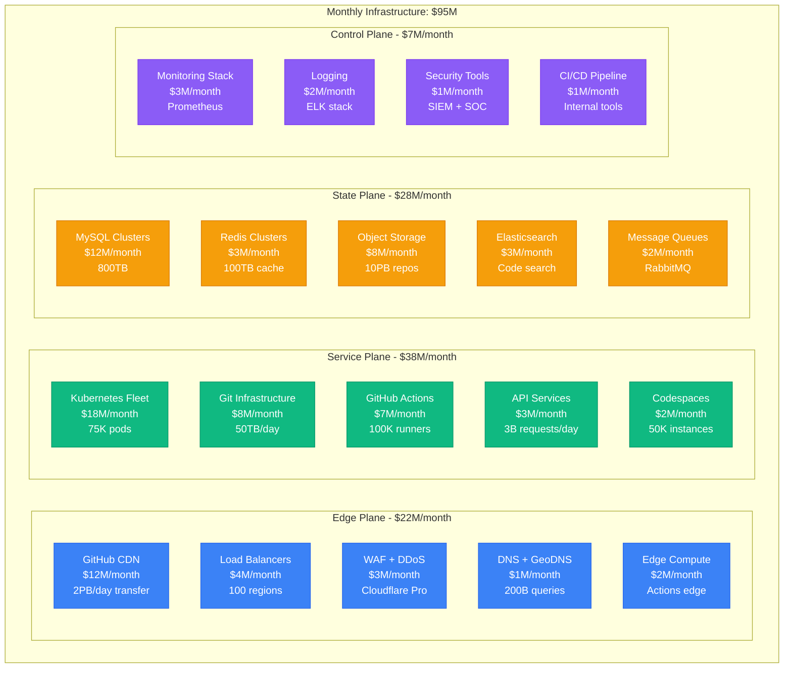
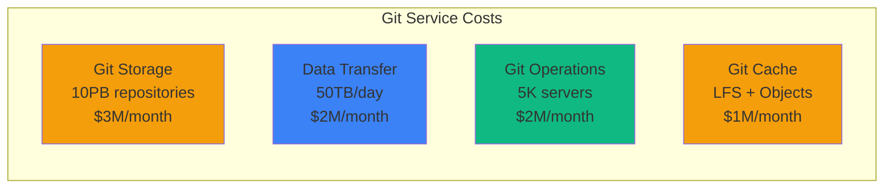
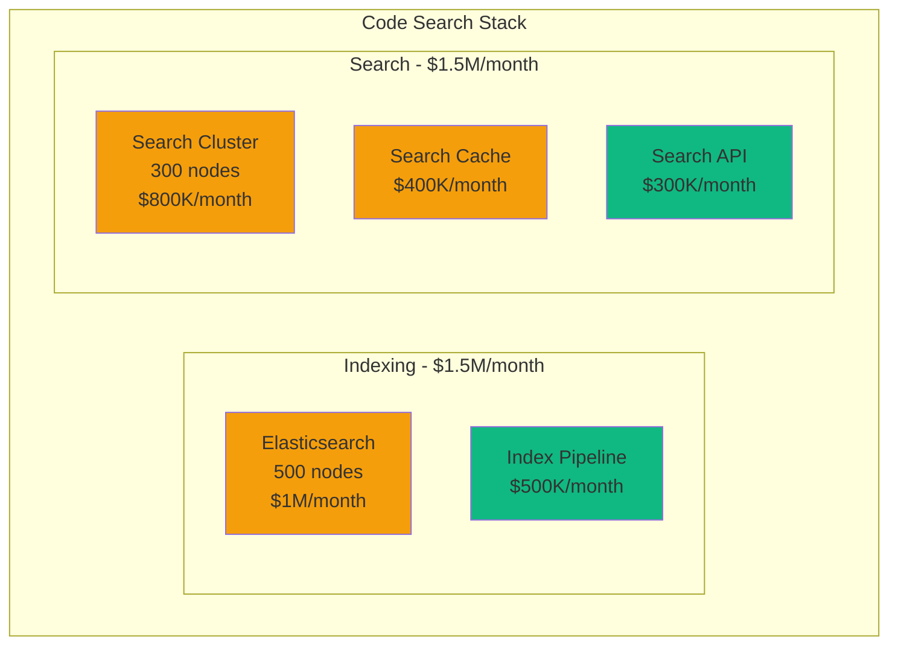
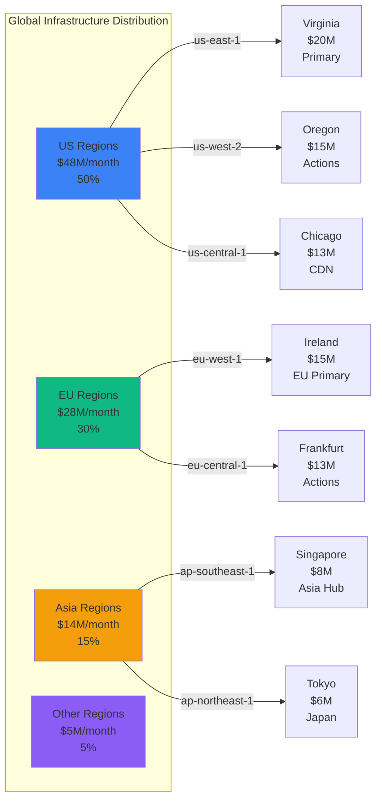
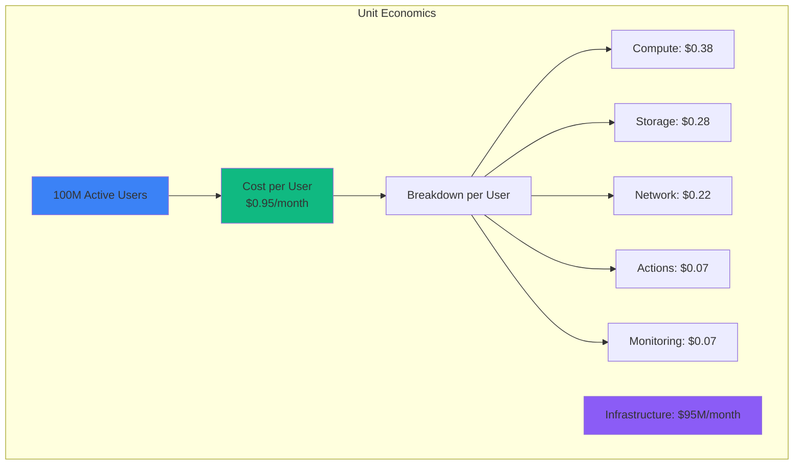

# GitHub Infrastructure Cost Breakdown: $95M/Month Serving 100M Developers

## Executive Summary
Complete infrastructure cost analysis from GitHub's 2024 operations serving 100M+ developers, 420M+ repositories, processing 3B+ API requests daily, and 50TB+ of Git traffic per day.

## Total Infrastructure Breakdown



## Service-Level Cost Breakdown

### Git Infrastructure: $8M/month


Git Performance Metrics:
- **Repository Count**: 420M repositories
- **Daily Clones**: 50M git operations
- **Push/Pull Ratio**: 1:10 (10 pulls per push)
- **Average Repo Size**: 24MB
- **Cost per repository**: $0.019/month
- **Peak traffic**: 200GB/sec during peak hours

### GitHub Actions: $7M/month
```yaml
actions_infrastructure:
  compute_runners:
    linux_runners: $3M/month    # 50K concurrent
    windows_runners: $2M/month  # 15K concurrent
    macos_runners: $1.5M/month  # 5K concurrent

  storage:
    artifacts: $300K/month      # 500TB/month
    caches: $200K/month         # 100TB cached

  total: $7M/month
  monthly_minutes: 2B minutes
  cost_per_minute: $0.0035
```

### Database Infrastructure: $12M/month
```python
# MySQL Fleet Configuration
database_costs = {
    "primary_clusters": {
        "users_db": {
            "instances": "20x db.r6g.8xlarge",
            "storage": "200TB",
            "cost": "$4M/month",
            "qps": "500K"
        },
        "repositories_db": {
            "instances": "30x db.r6g.12xlarge",
            "storage": "400TB",
            "cost": "$6M/month",
            "qps": "1M"
        },
        "metadata_db": {
            "instances": "10x db.r6g.4xlarge",
            "storage": "200TB",
            "cost": "$2M/month",
            "qps": "300K"
        }
    },

    "performance": {
        "total_qps": "1.8M",
        "read_write_ratio": "80:20",
        "replication_lag": "10ms",
        "connection_pool": "100K",
        "cost_per_query": "$0.0000067"
    }
}
```

### Code Search Infrastructure: $3M/month


Search Performance:
- **Indexed Files**: 1B+ files across all public repos
- **Search Queries**: 100M/day
- **Index Size**: 50TB compressed
- **Search Latency p50**: 250ms
- **Cost per search**: $0.001

## Regional Distribution



## Cost Optimization Initiatives

### Completed Optimizations (2024)
```yaml
savings_achieved:
  actions_spot_instances:
    description: "70% of Actions on spot instances"
    savings: $4M/month

  git_storage_optimization:
    description: "Intelligent tiering for old repositories"
    savings: $3M/month

  cdn_optimization:
    description: "Smart caching and compression"
    savings: $5M/month

  database_sharding:
    description: "Horizontal scaling optimization"
    savings: $3M/month

  rightsizing_compute:
    description: "ML-driven resource optimization"
    savings: $2M/month

total_savings: $17M/month
original_cost: $112M/month
current_cost: $95M/month
reduction: 15%
```

### Planned Optimizations (2025)
```python
planned_savings = {
    "arm_migration": {
        "description": "Migrate 60% workloads to ARM instances",
        "potential_savings": "$8M/month",
        "implementation": "Q2 2025"
    },
    "git_deduplication": {
        "description": "Cross-repo deduplication at object level",
        "potential_savings": "$4M/month",
        "implementation": "Q1 2025"
    },
    "edge_actions": {
        "description": "Run simple Actions at edge locations",
        "potential_savings": "$3M/month",
        "implementation": "Q3 2025"
    },
    "storage_tiering": {
        "description": "Automated cold storage for inactive repos",
        "potential_savings": "$2M/month",
        "implementation": "Q1 2025"
    }
}

projected_2025_cost = "$78M/month"
additional_reduction = "18%"
```

## Cost per User Metrics



### Revenue vs Infrastructure
```yaml
financial_metrics:
  monthly_revenue: $83M    # GitHub subscriptions
  infrastructure_cost: $95M
  infrastructure_percentage: 114%   # Pre-profitability investment

  enterprise_revenue: $65M/month
  individual_revenue: $18M/month

  per_enterprise_user:
    revenue: $21/month
    infra_cost: $2.38/month
    margin: $18.62/month

  growth_strategy:
    current_users: 100M
    target_2025: 150M
    revenue_target: $150M/month
    optimized_infra: $110M/month  # Economies of scale
```

## GitHub Actions Deep Dive

### Runner Infrastructure: $7M/month
```yaml
actions_fleet:
  linux_runners:
    count: 50000
    instance_type: "c6i.2xlarge equivalent"
    cost_per_hour: $0.34
    utilization: 75%
    monthly_cost: $3M

  windows_runners:
    count: 15000
    instance_type: "c6i.4xlarge equivalent"
    cost_per_hour: $0.68
    utilization: 70%
    monthly_cost: $2M

  macos_runners:
    count: 5000
    instance_type: "mac1.metal"
    cost_per_hour: $1.083
    utilization: 80%
    monthly_cost: $1.5M

  gpu_runners:
    count: 1000
    instance_type: "g4dn.xlarge"
    cost_per_hour: $0.526
    utilization: 60%
    monthly_cost: $500K

performance_metrics:
  jobs_per_day: 10M
  avg_job_duration: 8.5min
  queue_time_p50: 15sec
  queue_time_p99: 2min
  success_rate: 94%
```

## Disaster Recovery Costs

```yaml
dr_infrastructure:
  hot_standby:
    regions: 3
    cost: $12M/month
    rto: 2 minutes
    rpo: 30 seconds

  git_replication:
    cross_region_sync: $3M/month
    backup_storage: $2M/month

  database_dr:
    cross_region_replicas: $4M/month
    automated_failover: $1M/month

  testing:
    monthly_dr_drills: $800K/month
    chaos_engineering: $500K/month
    disaster_simulation: $200K/month

  total_dr_cost: $23.5M/month
  percentage_of_total: 25%
```

## The $95M Question: Developer Infrastructure ROI

### Value Delivered
- **Developer Productivity**: 100M developers saving 2 hours/week = $2.6B/month in productivity
- **Open Source Impact**: $400B+ in OSS economic value hosted
- **Enterprise Velocity**: 40% faster development cycles for enterprises
- **Security**: Advanced security scanning preventing $500M+ in potential breaches
- **Collaboration**: 100M+ pull requests facilitating global software development

### Cost Comparisons
| Company | Users | Infra Cost | Cost/User | Primary Service |
|---------|-------|------------|-----------|-----------------|
| **GitHub** | 100M | $95M/mo | $0.95 | Code hosting & CI/CD |
| GitLab | 30M | $25M/mo | $0.83 | DevOps platform |
| Atlassian | 250K | $50M/mo | $200 | Enterprise tools |
| Microsoft Azure DevOps | 20M | $80M/mo | $4.00 | Enterprise CI/CD |
| CircleCI | 10M | $15M/mo | $1.50 | CI/CD only |

## 3 AM Incident Cost Impact

**Scenario**: Git infrastructure down for 30 minutes
```python
incident_cost = {
    "blocked_developers": 1000000,  # 1M developers affected
    "productivity_loss": 1000000 * 100 * 0.5,  # $50M (100$/hour * 0.5hr)
    "enterprise_sla_penalties": 5000000,  # $5M in SLA violations
    "reputation_damage": "massive",
    "github_actions_jobs_failed": 2000000,  # 2M failed jobs
    "total_impact": "$55M+ in 30 minutes"
}

# Infrastructure investment preventing this
prevention_cost = {
    "redundancy": "$23M/month",
    "monitoring": "$7M/month",
    "total": "$30M/month"
}

# ROI: Preventing 1 major incident/month pays for itself
roi_calculation = (55000000 - 30000000) / 30000000  # 83% monthly ROI
```

**Real Incident**: October 2022 GitHub outage
- Duration: 4 hours
- Impact: 90% of functionality unavailable
- Estimated economic impact: $300M+ in lost developer productivity
- GitHub's response: $50M additional investment in infrastructure resilience

## GitHub's Infrastructure Philosophy

*"We don't run a code hosting service. We run the world's software development infrastructure. Every line of code that powers the digital economy flows through our systems."* - GitHub VP of Engineering

### Key Infrastructure Principles:
1. **Git-first architecture**: Everything optimized for Git operations
2. **Developer experience**: Sub-second response times for all operations
3. **Global consistency**: Same experience worldwide
4. **Infinite scale**: Architecture that grows with the world's code
5. **Security by default**: Every component security-hardened

### Why $95M/Month is Justified:
- **Scale**: 420M repositories growing 40% yearly
- **Performance**: 3B API requests/day with 99.95% uptime
- **Security**: Protecting $400B+ in OSS economic value
- **Innovation**: Enabling 100M developers to build the future
- **Network effects**: Every developer makes the platform more valuable