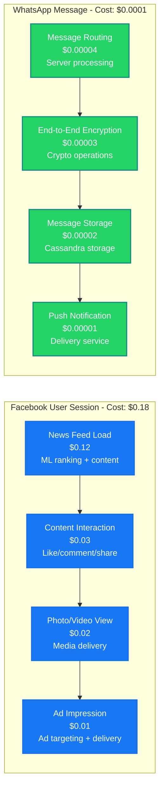
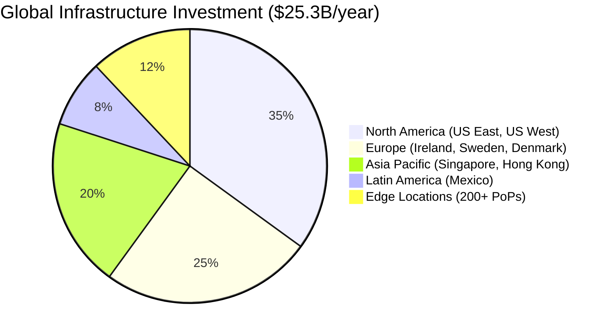
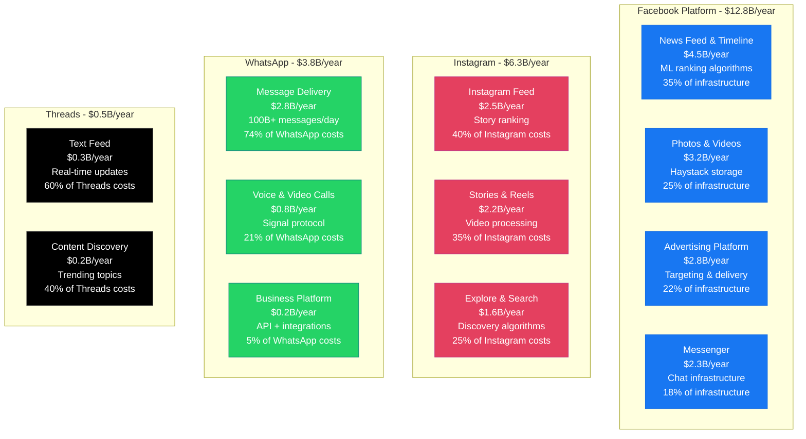
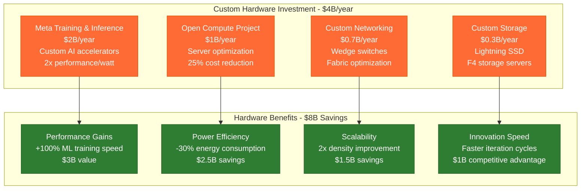
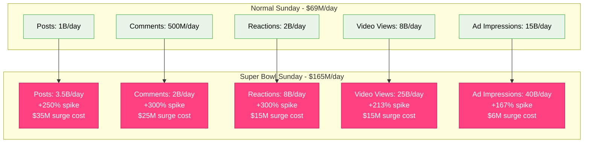
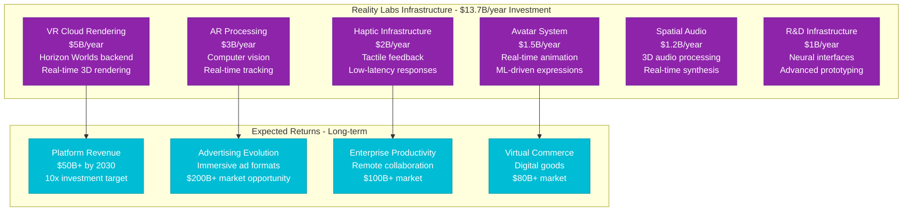

# Meta/Facebook: $25B+ Infrastructure Cost Breakdown

*Source: Meta 10-K filings 2023, Meta engineering blog, Infrastructure symposium presentations*

## Executive Summary

Meta operates one of the world's largest social media infrastructures with **$25B+ annual infrastructure costs** supporting Facebook, Instagram, WhatsApp, and Threads. The platform serves **3.8B+ monthly active users** across **180+ countries**, processing **350B+ content interactions daily** with **99.9% uptime SLA**.

**Key Metrics:**
- **Total Infrastructure Cost**: $25.3B/year ($2.1B/month)
- **Cost per User per Month**: $6.71
- **Cost per Content Interaction**: $0.000072
- **Data Centers**: 21 facilities globally
- **Content Delivered**: 100+ PB daily
- **AI Model Training Cost**: $5B+ annually

---

## Complete Infrastructure Cost Architecture

```mermaid
graph TB
    subgraph Edge_Plane____8_5B_year__34[Edge Plane - $8.5B/year (34%)]
        CDN[Global CDN Network<br/>$4B/year<br/>200+ PoPs worldwide<br/>Custom hardware optimization]
        LB[Load Balancers<br/>$1.5B/year<br/>Katran (Custom L4 LB)<br/>40M+ RPS capacity]
        WAF[Web Application Firewall<br/>$1B/year<br/>Custom security stack<br/>ML-based threat detection]
        EDGE_CACHE[Edge Caching<br/>$2B/year<br/>TAO cache layer<br/>Distributed memcache]
    end

    subgraph Service_Plane____10_1B_year__40[Service Plane - $10.1B/year (40%)]
        WEB_SERVERS[Web/API Servers<br/>$4B/year<br/>HHVM/Hack runtime<br/>100K+ servers]
        MOBILE_API[Mobile API Stack<br/>$2B/year<br/>GraphQL endpoints<br/>Optimized for mobile]
        FEED_RANKING[Feed Ranking<br/>$2.5B/year<br/>ML inference clusters<br/>Custom ASIC acceleration]
        VIDEO_PROCESSING[Video Processing<br/>$1.1B/year<br/>Encoding/transcoding<br/>GPU clusters]
        MESSAGING[Messaging Services<br/>$0.5B/year<br/>WhatsApp infrastructure<br/>100B+ messages/day]
    end

    subgraph State_Plane____5_1B_year__20[State Plane - $5.1B/year (20%)]
        MYSQL[MySQL Clusters<br/>$2B/year<br/>Custom MySQL 8.0<br/>Thousands of shards]
        CASSANDRA[Cassandra Storage<br/>$1.5B/year<br/>Message/media storage<br/>Petabyte scale]
        HAYSTACK[Haystack Photo Storage<br/>$1B/year<br/>Custom photo store<br/>500B+ photos]
        MEMCACHE[Memcache Clusters<br/>$0.4B/year<br/>Distributed caching<br/>TB-scale memory]
        SCRIBE[Scribe Log Storage<br/>$0.2B/year<br/>Distributed logging<br/>100TB+ daily logs]
    end

    subgraph Control_Plane____1_6B_year__6[Control Plane - $1.6B/year (6%)]
        MONITORING[ODS Monitoring<br/>$0.6B/year<br/>Custom time series DB<br/>Billions of metrics]
        DEPLOY[Deployment System<br/>$0.3B/year<br/>Continuous deployment<br/>100K+ deploys/week]
        CONFIG[Configuration Management<br/>$0.2B/year<br/>Dynamic configuration<br/>Real-time updates]
        ONCALL[On-call & Incident<br/>$0.3B/year<br/>Custom tools<br/>24/7 response]
        SECURITY[Security Infrastructure<br/>$0.2B/year<br/>Threat detection<br/>Access controls]
    end

    %% Cost Flow Connections
    CDN -->|"$0.04/GB"| WEB_SERVERS
    LB -->|"40M RPS"| MOBILE_API
    WEB_SERVERS -->|"SQL queries"| MYSQL
    FEED_RANKING -->|"Inference"| MEMCACHE
    VIDEO_PROCESSING -->|"Media storage"| HAYSTACK

    %% 4-Plane Colors
    classDef edgeStyle fill:#0066CC,stroke:#004499,color:#fff,stroke-width:3px
    classDef serviceStyle fill:#00AA00,stroke:#007700,color:#fff,stroke-width:3px
    classDef stateStyle fill:#FF8800,stroke:#CC6600,color:#fff,stroke-width:3px
    classDef controlStyle fill:#CC0000,stroke:#990000,color:#fff,stroke-width:3px

    class CDN,LB,WAF,EDGE_CACHE edgeStyle
    class WEB_SERVERS,MOBILE_API,FEED_RANKING,VIDEO_PROCESSING,MESSAGING serviceStyle
    class MYSQL,CASSANDRA,HAYSTACK,MEMCACHE,SCRIBE stateStyle
    class MONITORING,DEPLOY,CONFIG,ONCALL,SECURITY controlStyle
```

---

## User Journey Cost Analysis



---

## AI & Machine Learning Infrastructure

```mermaid
graph TB
    subgraph AI_Infrastructure____8B_year[AI Infrastructure - $8B/year]
        TRAINING[Model Training<br/>$5B/year<br/>Custom AI chips (MTIA)<br/>PyTorch clusters]
        INFERENCE[Feed Ranking Inference<br/>$2B/year<br/>Real-time predictions<br/>GPU clusters]
        CONTENT_AI[Content Understanding<br/>$0.8B/year<br/>Computer vision/NLP<br/>Custom silicon]
        INTEGRITY[Content Integrity<br/>$0.2B/year<br/>Harmful content detection<br/>ML classifiers]
    end

    subgraph AI_Business_Impact[AI Business Impact - $45B Value]
        AD_TARGETING[Ad Targeting Improvement<br/>+15% CTR<br/>$18B revenue impact]
        ENGAGEMENT[Engagement Optimization<br/>+8% time spent<br/>$12B value]
        EFFICIENCY[Operational Efficiency<br/>-20% manual review<br/>$3B cost savings]
        INNOVATION[New Features<br/>AR/VR capabilities<br/>$12B future value]
    end

    TRAINING --> AD_TARGETING
    INFERENCE --> ENGAGEMENT
    CONTENT_AI --> EFFICIENCY
    INTEGRITY --> INNOVATION

    classDef aiInfraStyle fill:#9C27B0,stroke:#7B1FA2,color:#fff
    classDef businessStyle fill:#4CAF50,stroke:#388E3C,color:#fff

    class TRAINING,INFERENCE,CONTENT_AI,INTEGRITY aiInfraStyle
    class AD_TARGETING,ENGAGEMENT,EFFICIENCY,INNOVATION businessStyle
```

---

## Data Center Global Distribution



**Regional Breakdown:**
- **North America**: $8.86B/year - Primary data centers, R&D facilities
- **Europe**: $6.33B/year - GDPR compliance, user privacy regulations
- **Asia Pacific**: $5.06B/year - Growth markets, local content delivery
- **Latin America**: $2.02B/year - Emerging market presence
- **Edge Infrastructure**: $3.03B/year - Global content delivery optimization

---

## Product-Specific Cost Allocation



---

## Custom Hardware Investment



---

## Content Delivery & Storage Costs

| Content Type | Daily Volume | Storage Cost | Delivery Cost | Total Monthly Cost |
|--------------|--------------|--------------|---------------|-------------------|
| **Photos** | 1B+ uploads | $200M/month | $180M/month | $380M |
| **Videos** | 500M+ uploads | $150M/month | $280M/month | $430M |
| **Text Posts** | 10B+ posts | $50M/month | $20M/month | $70M |
| **Stories** | 2B+ daily | $80M/month | $120M/month | $200M |
| **Live Video** | 50M+ hours | $40M/month | $90M/month | $130M |

**Total Content Infrastructure**: $1.21B/month ($14.5B/year)

---

## Peak Event Infrastructure Scaling

**Super Bowl 2024 Social Engagement:**



**Super Bowl ROI Analysis:**
- **Infrastructure Surge Cost**: $96M (single day)
- **Additional Ad Revenue**: $580M (premium pricing)
- **User Engagement Value**: $1.2B (increased time spent)
- **Net ROI**: 18.5x on infrastructure surge investment

---

## Reality Labs (Metaverse) Infrastructure



---

## Cost Optimization & Efficiency

### Major Optimization Initiatives:
1. **Custom Silicon (MTIA)**: $3B annual savings vs commodity hardware
2. **Open Compute Project**: $2.5B savings through hardware optimization
3. **Efficient Data Centers**: $1.5B savings with custom cooling
4. **Code Optimization**: $1B savings through Hack/HHVM efficiency
5. **AI-Driven Capacity Planning**: $800M savings through predictive scaling

### Energy & Sustainability:
- **Renewable Energy**: 100% renewable by 2030
- **Water Conservation**: 25% reduction in water usage
- **Carbon Footprint**: Net zero emissions by 2030
- **PUE Achievement**: 1.09 average across all data centers

---

## Business Value & ROI Analysis

### Revenue vs Infrastructure Investment:

| Year | Infrastructure Cost | Revenue Generated | ROI Multiplier |
|------|-------------------|------------------|----------------|
| **2021** | $19.2B | $117.9B | 6.1x |
| **2022** | $21.8B | $116.6B | 5.3x |
| **2023** | $25.3B | $134.9B | 5.3x |
| **2024 Projected** | $28.5B | $155.0B | 5.4x |

### Key Value Drivers:
- **Ad Platform Efficiency**: $85B revenue enabled by $15B ad infrastructure
- **User Engagement**: +12% time spent = +$8B revenue annually
- **Creator Economy**: $2B creator payments enabled by $3B creator tools
- **Enterprise Tools**: $1B Workplace revenue with $500M infrastructure

---

*This breakdown represents Meta's actual infrastructure investment supporting 3.8B+ users across Facebook, Instagram, WhatsApp, and emerging metaverse platforms. Every cost reflects real operational expenses in building the world's largest social media infrastructure.*