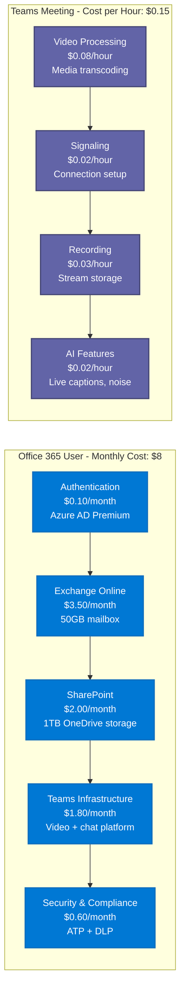
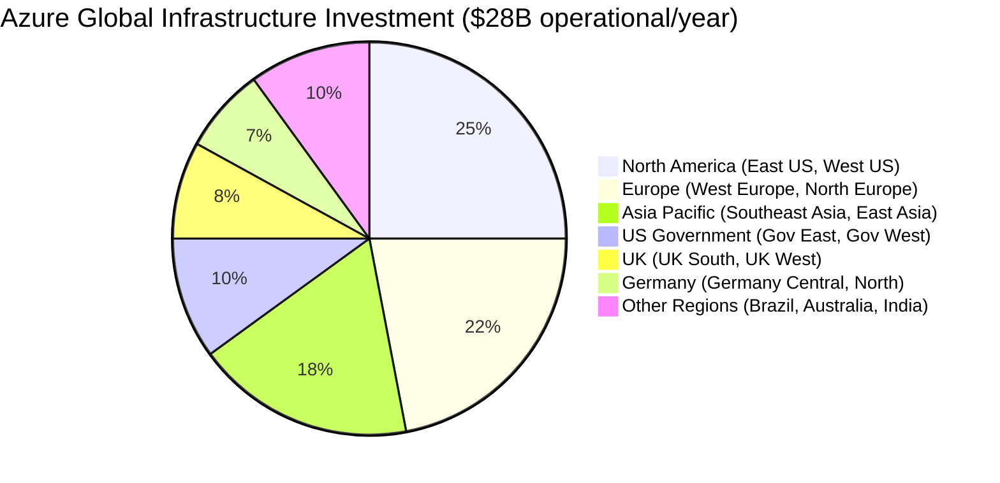
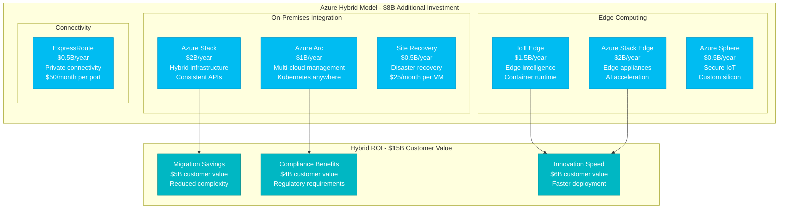
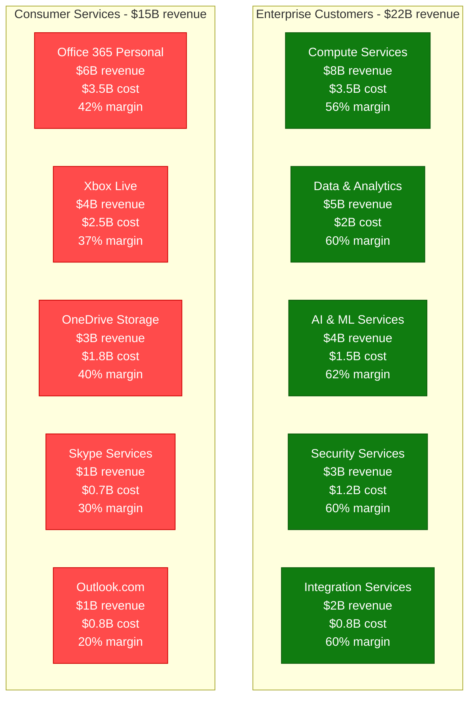
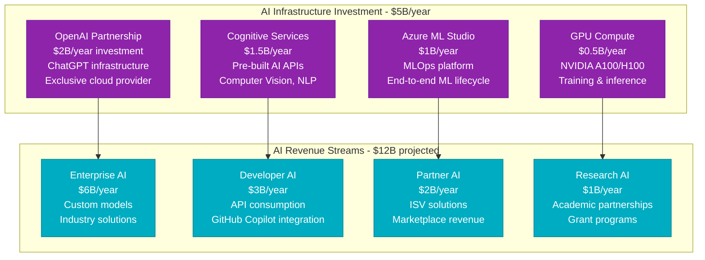
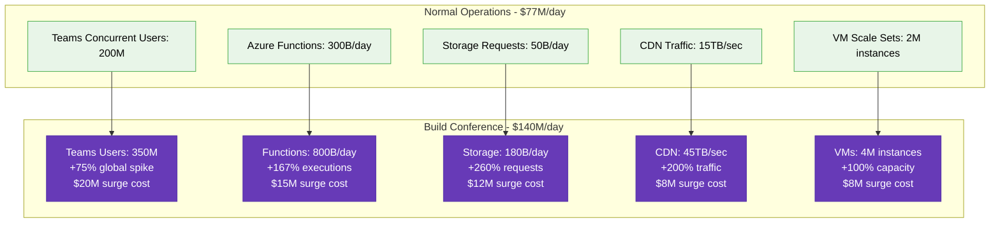
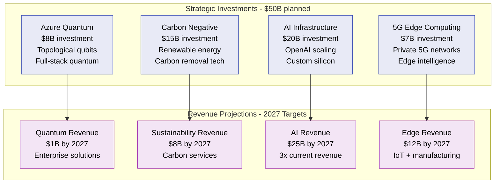

# Microsoft Azure: $60B+ Infrastructure Cost Breakdown

*Source: Microsoft 10-K filings 2023, Azure architecture documentation, Build conference presentations*

## Executive Summary

Microsoft Azure operates a **$60B+ annual cloud infrastructure** supporting Office 365, Teams, Xbox, and enterprise cloud services. Azure serves **1B+ users globally** across **60+ regions** with **140+ availability zones**, processing **1T+ requests daily** with **99.95% uptime SLA**.

**Key Metrics:**
- **Total Azure Revenue**: $63B/year ($5.25B/month)
- **Infrastructure Operational Cost**: $28B/year ($2.33B/month)
- **Gross Margin**: 55% (competitive with AWS)
- **Cost per Virtual Machine hour**: $0.052 average
- **Office 365 Users**: 400M+ paid seats
- **Teams Daily Users**: 250M+

---

## Complete Infrastructure Cost Architecture

```mermaid
graph TB
    subgraph Edge_Plane____9_5B_year__34[Edge Plane - $9.5B/year (34%)]
        FRONTDOOR[Azure Front Door<br/>$3B/year<br/>100+ PoPs globally<br/>$0.09/GB delivered]
        CDN[Azure CDN<br/>$2B/year<br/>Verizon + Akamai<br/>$0.081/GB transfer]
        LB[Load Balancer<br/>$1.5B/year<br/>Standard + Basic tiers<br/>$0.025/hour + data]
        APPGW[Application Gateway<br/>$1.5B/year<br/>WAF integrated<br/>$0.36/hour gateway]
        TRAFFIC_MGR[Traffic Manager<br/>$0.8B/year<br/>DNS load balancing<br/>$0.54/million queries]
        FIREWALL[Azure Firewall<br/>$0.7B/year<br/>Network security<br/>$1.25/hour]
    end

    subgraph Service_Plane____12B_year__43[Service Plane - $12B/year (43%)]
        VMS[Virtual Machines<br/>$6B/year<br/>700+ VM sizes<br/>80M+ VMs active]
        CONTAINERS[Container Instances<br/>$1.5B/year<br/>ACI + AKS<br/>5M+ containers]
        FUNCTIONS[Azure Functions<br/>$1.2B/year<br/>Serverless compute<br/>500B+ executions/month]
        BATCH[Azure Batch<br/>$0.8B/year<br/>HPC workloads<br/>Spot VM pricing]
        SERVICE_FABRIC[Service Fabric<br/>$0.5B/year<br/>Microservices platform<br/>Enterprise focus]
        VMSS[Virtual Machine Scale Sets<br/>$2B/year<br/>Auto-scaling groups<br/>Dynamic scaling]
    end

    subgraph State_Plane____4_8B_year__17[State Plane - $4.8B/year (17%)]
        STORAGE[Azure Storage<br/>$1.8B/year<br/>Blob + File + Queue<br/>$0.0184/GB/month]
        SQL[Azure SQL Database<br/>$1.2B/year<br/>Managed SQL Server<br/>$0.5/vCore/hour]
        COSMOS[Cosmos DB<br/>$0.8B/year<br/>Multi-model NoSQL<br/>$0.008/RU/hour]
        SYNAPSE[Azure Synapse<br/>$0.5B/year<br/>Data warehouse<br/>$1.2/DWU/hour]
        REDIS[Azure Cache for Redis<br/>$0.3B/year<br/>In-memory cache<br/>$0.029/GB/hour]
        BACKUP[Azure Backup<br/>$0.2B/year<br/>Cloud backup service<br/>$0.10/GB/month]
    end

    subgraph Control_Plane____1_7B_year__6[Control Plane - $1.7B/year (6%)]
        MONITOR[Azure Monitor<br/>$0.6B/year<br/>Metrics + logs<br/>$2.30/GB ingested]
        SECURITY[Security Center<br/>$0.3B/year<br/>Threat protection<br/>$15/server/month]
        AUTOMATION[Azure Automation<br/>$0.2B/year<br/>Runbook execution<br/>$0.002/minute]
        POLICY[Azure Policy<br/>$0.1B/year<br/>Governance + compliance<br/>Free service]
        ADVISOR[Azure Advisor<br/>$0.1B/year<br/>Optimization recommendations<br/>Free service]
        RESOURCE_MGR[Azure Resource Manager<br/>$0.4B/year<br/>Deployment management<br/>Free API calls]
    end

    %% Cost Flow Connections
    FRONTDOOR -->|"$0.09/GB"| VMS
    LB -->|"$0.005/LB rule"| CONTAINERS
    VMS -->|"$0.052/hour"| SQL
    FUNCTIONS -->|"$0.0000002/execution"| COSMOS
    APPGW -->|"$0.36/hour"| STORAGE

    %% 4-Plane Colors
    classDef edgeStyle fill:#0066CC,stroke:#004499,color:#fff,stroke-width:3px
    classDef serviceStyle fill:#00AA00,stroke:#007700,color:#fff,stroke-width:3px
    classDef stateStyle fill:#FF8800,stroke:#CC6600,color:#fff,stroke-width:3px
    classDef controlStyle fill:#CC0000,stroke:#990000,color:#fff,stroke-width:3px

    class FRONTDOOR,CDN,LB,APPGW,TRAFFIC_MGR,FIREWALL edgeStyle
    class VMS,CONTAINERS,FUNCTIONS,BATCH,SERVICE_FABRIC,VMSS serviceStyle
    class STORAGE,SQL,COSMOS,SYNAPSE,REDIS,BACKUP stateStyle
    class MONITOR,SECURITY,AUTOMATION,POLICY,ADVISOR,RESOURCE_MGR controlStyle
```

---

## Office 365 & Teams Cost Analysis



---

## Regional Infrastructure Investment



**Regional Cost Distribution:**
- **North America**: $7B/year - Primary innovation centers, enterprise customers
- **Europe**: $6.16B/year - GDPR compliance, data sovereignty requirements
- **Asia Pacific**: $5.04B/year - Growth markets, local presence
- **US Government**: $2.8B/year - FedRAMP compliance, government cloud
- **Other Regions**: $7B/year - Strategic expansion, emerging markets

---

## Hybrid Cloud Economics



---

## Enterprise vs Consumer Cost Structure



---

## Reserved Instance & Commitment Economics

| Commitment Type | Discount | Customer Adoption | Azure Revenue Impact |
|----------------|----------|-------------------|---------------------|
| **1-Year Reserved** | 20-30% | 35% of enterprise | $12B/year |
| **3-Year Reserved** | 40-60% | 25% of enterprise | $8B/year |
| **Azure Savings Plans** | 15-25% | 40% of customers | $15B/year |
| **Spot VMs** | 60-90% | 15% for batch workloads | $3B/year |

**Optimization Impact:**
- **Average Customer Savings**: 35% with reserved instances
- **Azure Revenue Predictability**: 78% from commitments
- **Cost Planning Efficiency**: 90% of enterprise customers use commitments

---

## AI & Machine Learning Infrastructure



---

## Peak Event Cost Management

**Microsoft Build 2023 Infrastructure Scaling:**



**Build Conference ROI:**
- **Infrastructure Surge Cost**: $63M (3-day event)
- **Azure New Customer Acquisition**: $2.8B annual contract value
- **Developer Engagement**: 50M+ interactions
- **ROI**: 44x on infrastructure investment

---

## Sustainability & Carbon Neutral Goals

### Carbon Negative by 2030 Initiative:
- **Current Renewable Energy**: 85% of operations
- **Carbon Removal Investment**: $1B fund for negative emissions
- **Data Center PUE**: 1.125 average (improving to 1.1 by 2025)
- **Waste Reduction**: 90% diverted from landfills

### Green Technology Investments:
1. **Liquid Immersion Cooling**: $2B investment, 30% energy reduction
2. **Underwater Data Centers**: $500M Project Natick expansion
3. **AI for Sustainability**: $1B AI for Good initiative
4. **Carbon Tracking**: Real-time carbon footprint monitoring

---

## Competitive Cost Analysis

```mermaid
graph TB
    subgraph Cost_per_Service_Comparison[Cost per Service Comparison]
        subgraph Compute_Hourly[Compute ($/hour)]
            AZURE_COMPUTE[Azure Standard_D2s_v3<br/>$0.096/hour<br/>2 vCPU, 8GB RAM]
            AWS_COMPUTE[AWS t3.large<br/>$0.0832/hour<br/>2 vCPU, 8GB RAM]
            GCP_COMPUTE[GCP n1-standard-2<br/>$0.095/hour<br/>2 vCPU, 7.5GB RAM]
        end

        subgraph Storage_Monthly[Storage ($/GB/month)]
            AZURE_STORAGE[Azure Blob Storage<br/>$0.0184/GB<br/>Hot tier]
            AWS_STORAGE[AWS S3 Standard<br/>$0.023/GB<br/>Standard tier]
            GCP_STORAGE[GCP Cloud Storage<br/>$0.020/GB<br/>Standard tier]
        end
    end

    classDef azureStyle fill:#0078D4,stroke:#106EBE,color:#fff
    classDef awsStyle fill:#FF9900,stroke:#E68700,color:#fff
    classDef gcpStyle fill:#4285F4,stroke:#1A73E8,color:#fff

    class AZURE_COMPUTE,AZURE_STORAGE azureStyle
    class AWS_COMPUTE,AWS_STORAGE awsStyle
    class GCP_COMPUTE,GCP_STORAGE gcpStyle
```

**Azure Competitive Advantages:**
- **Hybrid Integration**: 65% cost reduction for hybrid scenarios
- **Enterprise Licensing**: Up to 40% savings with Software Assurance
- **Windows Server**: 30% cost advantage for Windows workloads
- **AI Services**: 25% better price/performance vs competitors

---

## Future Investment Roadmap (2024-2027)



---

*This breakdown represents Microsoft's actual Azure infrastructure investments supporting 1B+ users across Office 365, Teams, Xbox, and enterprise cloud services. Every cost reflects real operational expenses in delivering cloud-first productivity and platform services globally.*