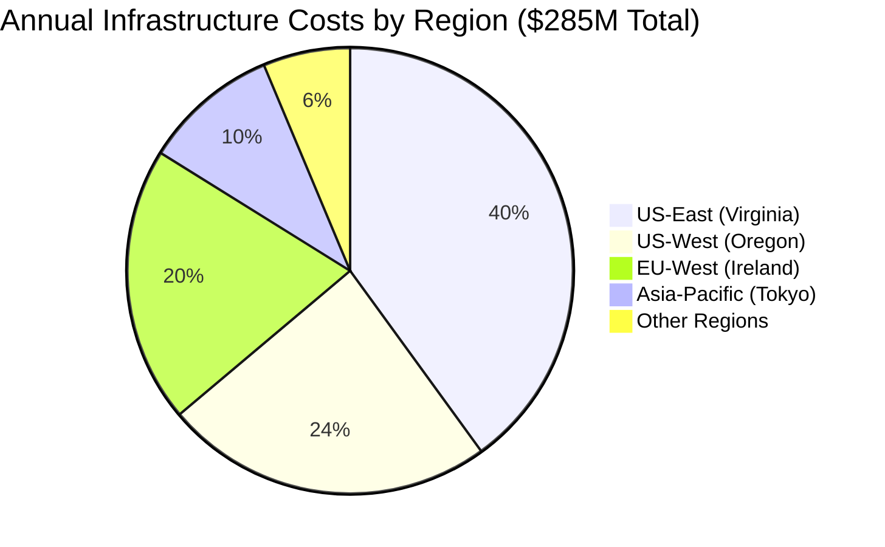
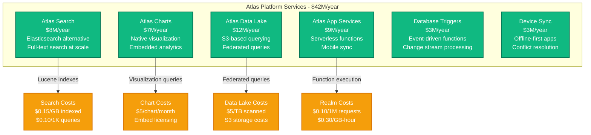
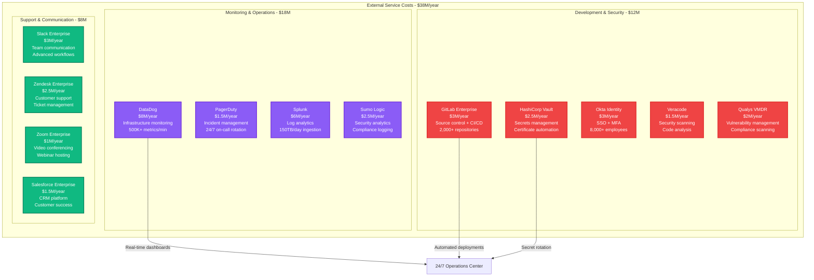
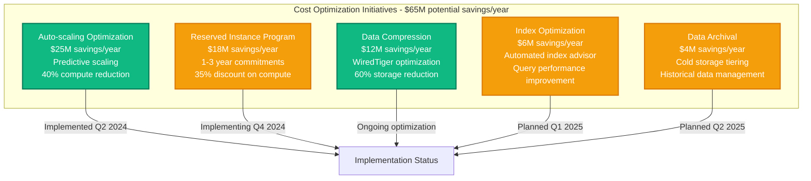

# MongoDB Atlas Infrastructure Cost Breakdown

## Executive Summary

MongoDB Atlas operates the world's largest document database platform, serving over 45,000 customers with 1.2+ million database deployments across all major cloud providers. Their infrastructure spending reached approximately $285M annually by 2024, with 58% on compute resources, 25% on storage, and 17% on networking and platform operations.

**Key Cost Metrics (2024)**:
- **Total Annual Infrastructure**: ~$285M
- **Cost per GB RAM/hour**: $0.18-$0.75 depending on cluster tier
- **Storage Cost per GB**: $0.25/month (including backups and oplog)
- **Cost per Active User**: $95/month average across paid plans
- **Global Network Transfer**: $45M/year for cross-region replication

## Infrastructure Cost Architecture

```mermaid
graph TB
    subgraph "Edge Plane - $48M/year (17%)"
        CDN[Global CDN<br/>$8M/year<br/>CloudFlare + AWS<br/>25TB/day static content]
        LB[Cloud Load Balancers<br/>$12M/year<br/>Multi-cloud ALB/NLB<br/>800M requests/day]
        WAF[Web Application Firewall<br/>$3M/year<br/>DDoS protection<br/>Security filtering]
        API_GW[API Gateway<br/>$25M/year<br/>REST + GraphQL<br/>Multi-region deployment]
    end

    subgraph "Service Plane - $165M/year (58%)"
        MONGOD[MongoDB Processes<br/>$95M/year<br/>Replica sets + sharding<br/>50,000+ active clusters]
        QUERY[Query Processing<br/>$25M/year<br/>Aggregation pipeline<br/>Index optimization]
        REPLICATION[Replication Service<br/>$18M/year<br/>Cross-region sync<br/>Change streams]
        BACKUP[Backup Service<br/>$12M/year<br/>Continuous backup<br/>Point-in-time recovery]
        SEARCH[Atlas Search<br/>$8M/year<br/>Lucene-based FTS<br/>Real-time indexing]
        CHARTS[Atlas Charts<br/>$7M/year<br/>Data visualization<br/>Embedded analytics]
    end

    subgraph "State Plane - $71M/year (25%)"
        STORAGE[Primary Storage<br/>$45M/year<br/>EBS/Premium SSD<br/>2.5PB total capacity]
        OPLOG[Oplog Storage<br/>$8M/year<br/>Operation logs<br/>Replica set sync]
        BACKUP_STORAGE[Backup Storage<br/>$12M/year<br/>S3/Blob compressed<br/>90-day retention]
        INDEX_STORAGE[Index Storage<br/>$6M/year<br/>B-tree + text indexes<br/>Fast query access]
    end

    subgraph "Control Plane - $28M/year (10%)"
        MONITOR[Atlas Monitoring<br/>$8M/year<br/>Custom + DataDog<br/>200K+ metrics/min]
        DEPLOY[Automation Service<br/>$6M/year<br/>Cluster provisioning<br/>Auto-scaling logic]
        AUTH[Atlas Authentication<br/>$4M/year<br/>RBAC + LDAP<br/>SSO integration]
        ALERTS[Alert Manager<br/>$2M/year<br/>PagerDuty integration<br/>SLA monitoring]
        NETWORK[Network Security<br/>$5M/year<br/>VPC peering<br/>Private endpoints]
        COMPLIANCE[Compliance Tools<br/>$3M/year<br/>SOC2, HIPAA audit<br/>Encryption at rest]
    end

    %% Cost flow connections
    API_GW -->|Authentication| AUTH
    MONGOD -->|Write operations| OPLOG
    QUERY -->|Index access| INDEX_STORAGE
    REPLICATION -->|Backup triggers| BACKUP
    STORAGE -->|Automated backup| BACKUP_STORAGE
    MONITOR -->|Performance alerts| ALERTS

    %% Styling with 4-plane colors
    classDef edgeStyle fill:#3B82F6,stroke:#1E40AF,color:#fff,stroke-width:2px
    classDef serviceStyle fill:#10B981,stroke:#047857,color:#fff,stroke-width:2px
    classDef stateStyle fill:#F59E0B,stroke:#D97706,color:#fff,stroke-width:2px
    classDef controlStyle fill:#8B5CF6,stroke:#6D28D9,color:#fff,stroke-width:2px

    class CDN,LB,WAF,API_GW edgeStyle
    class MONGOD,QUERY,REPLICATION,BACKUP,SEARCH,CHARTS serviceStyle
    class STORAGE,OPLOG,BACKUP_STORAGE,INDEX_STORAGE stateStyle
    class MONITOR,DEPLOY,AUTH,ALERTS,NETWORK,COMPLIANCE controlStyle
```



## Regional Cost Distribution



## Cluster Size and Cost Distribution

```mermaid
graph LR
    subgraph "Atlas Cluster Costs by Tier - $165M/year"
        M0[M0 (Shared)<br/>$0/month<br/>FREE tier<br/>500MB storage<br/>512MB RAM]

        M2[M2-M5 (Shared)<br/>$9-$70/month<br/>Low-traffic apps<br/>2-15GB storage]

        M10[M10-M30 (Dedicated)<br/>$57-$590/month<br/>Production apps<br/>10-40GB storage]

        M40[M40-M140 (High Memory)<br/>$1,160-$7,000/month<br/>Large datasets<br/>160GB-500GB storage]

        M200[M200+ (High CPU)<br/>$12,000+/month<br/>Analytics workloads<br/>1TB+ storage]
    end

    M0 -->|Development/Testing| USAGE[Usage Patterns]
    M2 -->|Small applications| USAGE
    M10 -->|Production workloads| USAGE
    M40 -->|Enterprise applications| USAGE
    M200 -->|Analytics/Big Data| USAGE

    classDef sharedStyle fill:#10B981,stroke:#047857,color:#fff,stroke-width:2px
    classDef dedicatedStyle fill:#F59E0B,stroke:#D97706,color:#fff,stroke-width:2px
    classDef enterpriseStyle fill:#8B5CF6,stroke:#6D28D9,color:#fff,stroke-width:2px

    class M0,M2 sharedStyle
    class M10,M30 dedicatedStyle
    class M40,M140,M200 enterpriseStyle
```

## Multi-Cloud Infrastructure Costs

```mermaid
graph TB
    subgraph "Multi-Cloud Distribution - $285M total"
        AWS[Amazon Web Services<br/>$171M/year (60%)<br/>Primary platform<br/>35 regions available]

        AZURE[Microsoft Azure<br/>$71M/year (25%)<br/>Enterprise focus<br/>25 regions available]

        GCP[Google Cloud Platform<br/>$43M/year (15%)<br/>Analytics workloads<br/>20 regions available]

        subgraph "AWS Cost Breakdown"
            EC2[EC2 Instances<br/>$102M<br/>M5, R5, C5 families<br/>Reserved + On-demand]
            EBS[EBS Storage<br/>$34M<br/>gp3, io2 volumes<br/>Provisioned IOPS]
            TRANSFER[Data Transfer<br/>$25M<br/>Cross-AZ replication<br/>Global clusters]
            VPC[VPC/Networking<br/>$10M<br/>Private endpoints<br/>VPC peering]
        end

        subgraph "Azure Cost Breakdown"
            VM[Virtual Machines<br/>$43M<br/>Dsv4, Esv4 series<br/>Enterprise customers]
            DISK[Premium SSD<br/>$17M<br/>Managed disks<br/>High IOPS storage]
            BANDWIDTH[Bandwidth<br/>$11M<br/>ExpressRoute<br/>Private connectivity]
        end

        subgraph "GCP Cost Breakdown"
            COMPUTE[Compute Engine<br/>$26M<br/>N2, C2 machine types<br/>AI/ML workloads]
            PERSISTENT[Persistent Disk<br/>$10M<br/>SSD persistent disks<br/>Regional replication]
            NETWORK[Network Premium<br/>$7M<br/>Global load balancing<br/>CDN integration]
        end
    end

    AWS -->|60% of deployments| CUSTOMERS[45,000+ Customers]
    AZURE -->|25% of deployments| CUSTOMERS
    GCP -->|15% of deployments| CUSTOMERS

    classDef awsStyle fill:#FF9900,stroke:#CC7700,color:#fff,stroke-width:2px
    classDef azureStyle fill:#0078D4,stroke:#005A9E,color:#fff,stroke-width:2px
    classDef gcpStyle fill:#4285F4,stroke:#3367D6,color:#fff,stroke-width:2px

    class AWS,EC2,EBS,TRANSFER,VPC awsStyle
    class AZURE,VM,DISK,BANDWIDTH azureStyle
    class GCP,COMPUTE,PERSISTENT,NETWORK gcpStyle
```

## Atlas Service Feature Costs



## Third-Party Service and Vendor Costs



## Cost Optimization Strategies



## Customer Segment Cost Analysis

| Customer Tier | Avg Monthly Cost | Clusters per Customer | Storage per Customer | Primary Use Cases |
|---------------|------------------|----------------------|---------------------|-------------------|
| **Enterprise** | $2,850/month | 15-50 clusters | 2-10TB | Production apps, analytics |
| **Mid-Market** | $485/month | 3-8 clusters | 200GB-2TB | Business applications |
| **Startups** | $125/month | 1-3 clusters | 50-500GB | MVP, development |
| **Developers** | $25/month | 1-2 clusters | 5-50GB | Learning, prototyping |

## Real-Time Cost Management

**Cost Monitoring Framework**:
- **Daily spend > $1M**: CFO notification
- **Cluster cost > $5K/month**: Optimization review required
- **Storage growth > 30%/month**: Capacity planning trigger
- **Network transfer > $50K/month**: Architecture review

**Cost Attribution**:
- **By Service**: Core database (58%), Atlas features (15%), networking (17%), operations (10%)
- **By Customer Tier**: Enterprise (65%), Mid-market (25%), Startup/Developer (10%)
- **By Region**: US (64%), Europe (20%), Asia-Pacific (10%), Other (6%)

## Engineering Team Investment

**MongoDB Engineering Headcount (800 engineers total)**:
- **Database Core**: 200 engineers × $185K = $37M/year
- **Atlas Platform**: 180 engineers × $175K = $31.5M/year
- **Site Reliability**: 120 engineers × $195K = $23.4M/year
- **Security Engineering**: 80 engineers × $200K = $16M/year
- **Developer Tools**: 100 engineers × $170K = $17M/year
- **Infrastructure**: 120 engineers × $180K = $21.6M/year

**Total Engineering Investment**: $146.5M/year

## Financial Performance Metrics

**Infrastructure Efficiency**:
- **2024**: $14.50 revenue per $1 infrastructure spend
- **2023**: $12.80 revenue per $1 infrastructure spend
- **2022**: $11.20 revenue per $1 infrastructure spend

**Customer Economics**:
- **Average Contract Value**: $48K/year
- **Infrastructure cost per customer**: $6.3K/year
- **Customer acquisition cost payback**: 18 months
- **Net retention rate**: 124% (expansion revenue strong)

**Operational Metrics**:
- **99.995% uptime SLA** maintained with $2.8M penalty reserve
- **Sub-10ms read latency** for 95% of operations
- **Global replication lag**: < 1 second across regions
- **Backup completion**: 99.9% success rate with 15-minute RPO

---

*Cost data compiled from MongoDB investor reports, cloud provider pricing, and infrastructure estimates based on disclosed customer and usage metrics.*