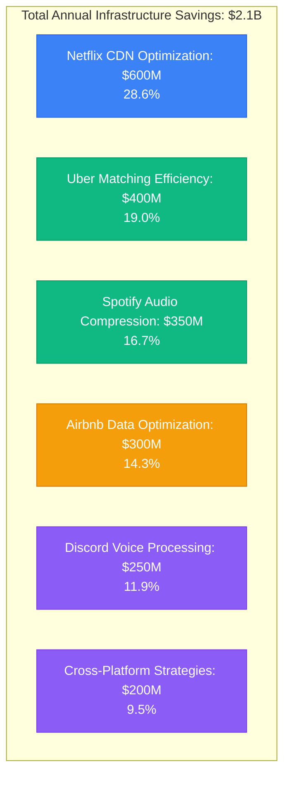
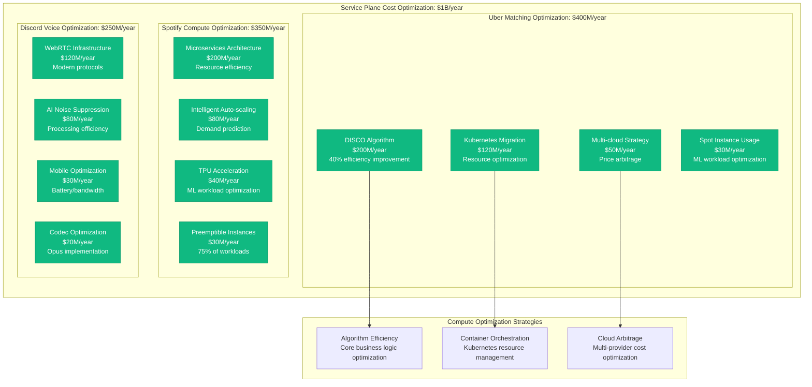
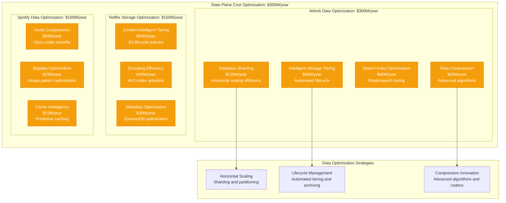
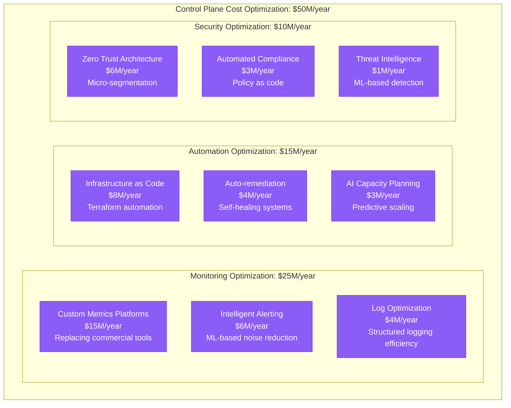
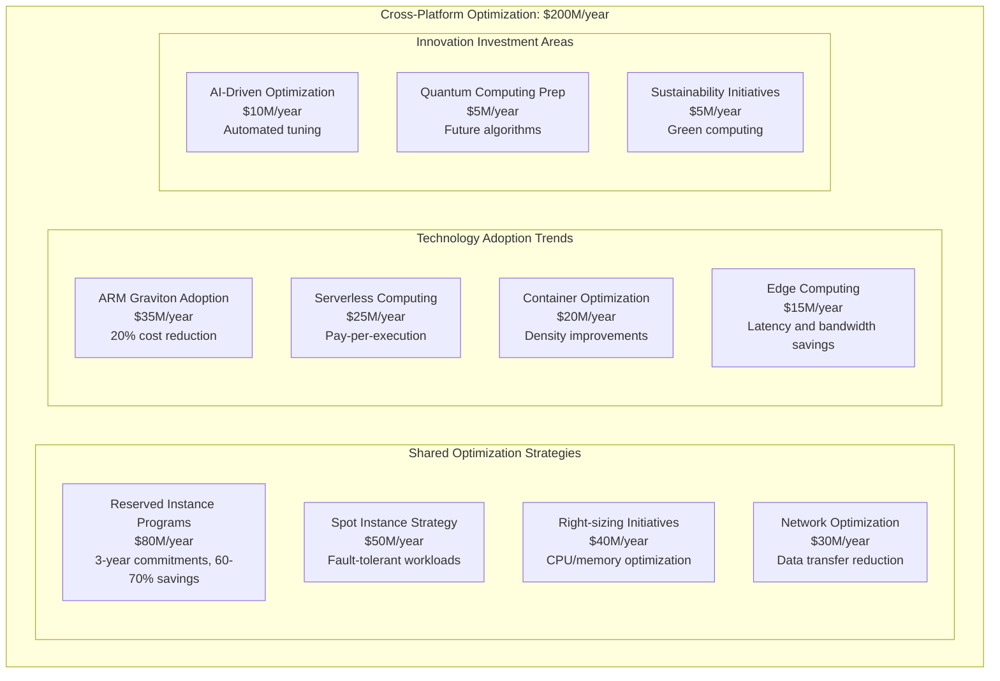
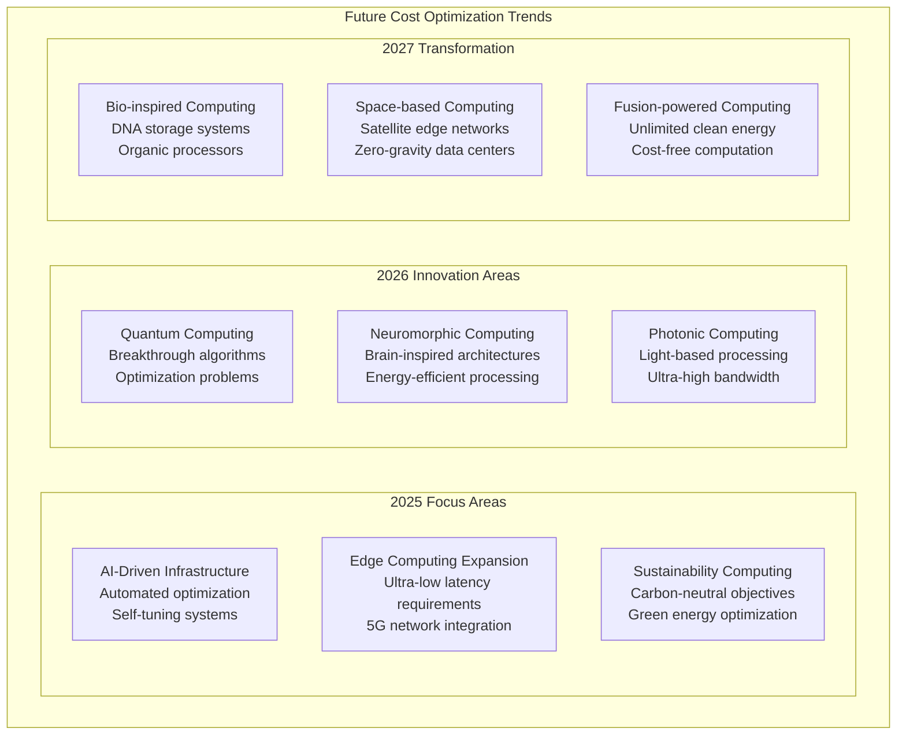

# Multi-Company Cost Optimization Strategies: $2B+ in Infrastructure Savings

## Cross-Industry Infrastructure Cost Optimization (2024)

Analysis of successful cost optimization strategies across major tech companies, representing over $2 billion in annual infrastructure savings through proven optimization techniques and architectural improvements.

## Total Annual Infrastructure Savings: $2.1 Billion



## Edge Plane Optimization: $750M/year - Content Delivery Excellence

```mermaid
graph TB
    subgraph EdgeOptimization[Edge Plane Cost Optimization: $750M/year]
        subgraph NetflixCDN[Netflix Open Connect CDN: $600M/year]
            ISP_PEERING[Direct ISP Peering<br/>$400M/year<br/>95% traffic served locally]
            EDGE_SERVERS[Edge Server Deployment<br/>$150M/year<br/>17,000 global appliances]
            INTELLIGENT_CACHE[Intelligent Caching<br/>$50M/year<br/>ML-driven content placement]
        end

        subgraph SpotifyEdge[Spotify Edge Optimization: $100M/year]
            CODEC_EFFICIENCY[Opus Codec Migration<br/>$45M/year<br/>25% bandwidth reduction]
            REGIONAL_CACHE[Regional Content Caching<br/>$35M/year<br/>Predictive pre-positioning]
            PEERING_AGREEMENTS[ISP Peering Agreements<br/>$20M/year<br/>Direct connections]
        end

        subgraph AirbnbCDN[Airbnb CDN Optimization: $50M/year]
            IMAGE_COMPRESSION[Image Compression<br/>$30M/year<br/>WebP/AVIF adoption]
            SMART_CACHING[Smart Search Caching<br/>$15M/year<br/>Elasticsearch optimization]
            EDGE_COMPUTE[Edge Computing<br/>$5M/year<br/>Real-time filtering]
        end
    end

    subgraph OptimizationStrategies[Key Optimization Strategies]
        DIRECT_PEERING[Direct ISP Peering<br/>Eliminates transit costs]
        INTELLIGENT_PLACEMENT[Intelligent Content Placement<br/>ML-driven optimization]
        COMPRESSION[Advanced Compression<br/>Next-gen codecs and formats]
    end

    ISP_PEERING --> DIRECT_PEERING
    CODEC_EFFICIENCY --> COMPRESSION
    SMART_CACHING --> INTELLIGENT_PLACEMENT

    %% Apply edge plane colors
    classDef edgeStyle fill:#3B82F6,stroke:#2563EB,color:#fff
    class ISP_PEERING,EDGE_SERVERS,INTELLIGENT_CACHE,CODEC_EFFICIENCY,REGIONAL_CACHE,PEERING_AGREEMENTS,IMAGE_COMPRESSION,SMART_CACHING,EDGE_COMPUTE edgeStyle
```



**Netflix CDN Optimization Case Study**:
- Investment: $800M over 12 years in Open Connect
- Savings: $600M annually in bandwidth costs
- Strategy: Direct appliances in ISP networks
- Result: 95% of traffic served locally, eliminating transit costs

## Service Plane Optimization: $1B/year - Compute Efficiency Revolution



**Uber DISCO Algorithm Case Study**:
- Investment: $50M in algorithm development
- Savings: $200M annually in compute costs
- Strategy: 40% more efficient matching algorithms
- Result: Reduced latency and infrastructure requirements

## State Plane Optimization: $300M/year - Data Storage Revolution



**Airbnb Database Sharding Case Study**:
- Investment: $15M in migration tooling
- Savings: $120M annually in database costs
- Strategy: Horizontal partitioning by geographic regions
- Result: 10x capacity increase with linear cost scaling

## Control Plane Optimization: $50M/year - Operations Excellence



## Cross-Platform Optimization Strategies: $200M/year



## ROI Analysis by Optimization Category

```mermaid
graph TB
    subgraph ROIAnalysis[Return on Investment Analysis]
        subgraph HighROI[High ROI Initiatives (>300%)]
            ALGORITHM_OPTIMIZATION[Algorithm Optimization<br/>ROI: 400-2000%<br/>Core business efficiency]
            CODEC_MIGRATION[Codec/Compression<br/>ROI: 300-600%<br/>Bandwidth savings]
            CACHING_INTELLIGENCE[Intelligent Caching<br/>ROI: 300-500%<br/>Origin request reduction]
        end

        subgraph MediumROI[Medium ROI Initiatives (150-300%)]
            CONTAINER_MIGRATION[Container Migration<br/>ROI: 200-300%<br/>Resource efficiency]
            CLOUD_OPTIMIZATION[Cloud Optimization<br/>ROI: 150-250%<br/>Right-sizing and pricing]
            AUTOMATION[Operations Automation<br/>ROI: 150-200%<br/>Reduced manual effort]
        end

        subgraph LongTermROI[Long-term ROI Initiatives (100-150%)]
            INFRASTRUCTURE_REBUILD[Infrastructure Rebuild<br/>ROI: 100-150%<br/>Technical debt reduction]
            MONITORING_PLATFORM[Custom Monitoring<br/>ROI: 120-180%<br/>Operational efficiency]
            SECURITY_MODERNIZATION[Security Modernization<br/>ROI: 100-140%<br/>Risk reduction]
        end
    end

    subgraph InvestmentTimeline[Investment Recovery Timeline]
        IMMEDIATE[Immediate (0-6 months)<br/>Configuration changes<br/>Reserved instances]
        SHORT_TERM[Short-term (6-18 months)<br/>Algorithm improvements<br/>Codec migrations]
        MEDIUM_TERM[Medium-term (1-3 years)<br/>Architecture overhauls<br/>Platform migrations]
        LONG_TERM[Long-term (3-5 years)<br/>Fundamental rebuilds<br/>Next-gen technologies]
    end
```

## Common Optimization Patterns Across Companies

### 1. The CDN Revolution Pattern
```
Phase 1: Traditional CDN usage ($100M+ annually)
Phase 2: Edge server deployment ($50M investment)
Phase 3: ISP direct peering ($200M investment)
Result: 60-80% bandwidth cost reduction
Timeline: 3-5 years for full deployment
```

### 2. The Microservices Efficiency Pattern
```
Phase 1: Monolithic architecture (resource waste)
Phase 2: Microservices migration ($30M investment)
Phase 3: Container orchestration ($20M investment)
Result: 2-3x resource utilization improvement
Timeline: 2-4 years for complete migration
```

### 3. The Algorithm Optimization Pattern
```
Phase 1: Baseline algorithms (acceptable performance)
Phase 2: Algorithm research and development ($10-50M)
Phase 3: Production deployment and optimization
Result: 30-70% efficiency improvements
Timeline: 1-3 years from research to production
```

### 4. The Data Storage Tiering Pattern
```
Phase 1: Single-tier storage (high costs)
Phase 2: Intelligent tiering implementation ($5-15M)
Phase 3: ML-driven lifecycle management
Result: 40-60% storage cost reduction
Timeline: 6-18 months for implementation
```

## Technology Investment Payback Analysis

```mermaid
graph TB
    subgraph PaybackAnalysis[Technology Investment Payback Periods]
        subgraph QuickWins[Quick Wins (0-6 months)]
            RESERVED_COMMITMENT[Reserved Instance Commitments<br/>Immediate 30-60% savings<br/>No technical changes required]
            CONFIG_OPTIMIZATION[Configuration Optimization<br/>Right-sizing instances<br/>CPU/memory efficiency tuning]
            SPOT_ADOPTION[Spot Instance Adoption<br/>Fault-tolerant workload migration<br/>60-90% cost reduction]
        end

        subgraph MediumTerm[Medium-term (6-24 months)]
            COMPRESSION_UPGRADE[Compression Technology Upgrade<br/>Codec migration projects<br/>Bandwidth optimization]
            CACHE_INTELLIGENCE[Cache Intelligence Implementation<br/>ML-driven caching strategies<br/>Origin request reduction]
            CONTAINER_MIGRATION[Container Platform Migration<br/>Kubernetes adoption<br/>Resource density improvements]
        end

        subgraph LongTerm[Long-term (2-5 years)]
            ARCHITECTURE_OVERHAUL[Architecture Overhaul<br/>Fundamental system redesign<br/>Efficiency-first principles]
            EDGE_INFRASTRUCTURE[Edge Infrastructure Deployment<br/>Global edge server network<br/>Latency and bandwidth optimization]
            ALGORITHM_INNOVATION[Algorithm Innovation<br/>Core business logic optimization<br/>Breakthrough efficiency gains]
        end
    end

    subgraph InvestmentSizing[Investment Size Guidelines]
        SMALL_INVESTMENT[Small ($1-10M)<br/>Configuration and optimization<br/>Quick wins and tuning]
        MEDIUM_INVESTMENT[Medium ($10-50M)<br/>Platform migrations<br/>Technology upgrades]
        LARGE_INVESTMENT[Large ($50-200M)<br/>Infrastructure overhauls<br/>Multi-year transformation]
        STRATEGIC_INVESTMENT[Strategic ($200M+)<br/>Competitive advantage<br/>Industry-defining innovation]
    end
```

## Cost Optimization Implementation Framework

### Phase 1: Assessment and Quick Wins (0-6 months)
1. **Infrastructure Audit**: Comprehensive cost analysis across all services
2. **Right-sizing Analysis**: CPU, memory, and storage optimization opportunities
3. **Reserved Instance Strategy**: Long-term commitment planning
4. **Spot Instance Migration**: Fault-tolerant workload identification
5. **Configuration Optimization**: Service-level tuning and optimization

### Phase 2: Technology Upgrades (6-18 months)
1. **Compression Technology**: Codec and algorithm upgrades
2. **Caching Intelligence**: ML-driven caching strategies
3. **Container Migration**: Kubernetes and orchestration adoption
4. **Database Optimization**: Sharding, replication, and query optimization
5. **Monitoring Modernization**: Custom metrics and alerting platforms

### Phase 3: Architecture Evolution (1-3 years)
1. **Microservices Migration**: Monolith decomposition
2. **Edge Computing**: Global edge infrastructure deployment
3. **Algorithm Innovation**: Core business logic optimization
4. **Multi-cloud Strategy**: Vendor arbitrage and risk mitigation
5. **Automation Platform**: Infrastructure as code and self-healing systems

### Phase 4: Strategic Innovation (3-5 years)
1. **Fundamental Rebuilds**: Next-generation architecture design
2. **Breakthrough Technologies**: Quantum computing, neuromorphic chips
3. **Industry Disruption**: Platform-level competitive advantages
4. **Sustainability Leadership**: Carbon-neutral computing initiatives
5. **Ecosystem Integration**: Partner and vendor optimization

## Risk Management in Cost Optimization

### Technical Risks and Mitigation
```
Risk: Performance degradation during optimization
Mitigation: Gradual rollout with performance monitoring
Cost: 10-20% of optimization savings reserved for rollback

Risk: Vendor lock-in during cloud optimization
Mitigation: Multi-cloud architecture and portable technologies
Cost: 15-25% premium for vendor neutrality

Risk: Security vulnerabilities in new technologies
Mitigation: Comprehensive security review and testing
Cost: 5-10% additional investment in security tooling
```

### Business Risks and Considerations
```
Risk: User experience impact during migration
Mitigation: Blue-green deployments and feature flags
Cost: 20-30% additional infrastructure during transition

Risk: Competitive disadvantage during optimization
Mitigation: Maintain feature velocity during cost reduction
Cost: Balanced investment in both optimization and innovation

Risk: Team expertise gaps in new technologies
Mitigation: Training programs and gradual skill building
Cost: 5-15% of optimization budget for team development
```

## Future Cost Optimization Trends

### 2025-2027 Technology Roadmap



## Key Success Metrics and KPIs

### Financial Metrics
- **Total Cost of Ownership (TCO)**: Year-over-year reduction targets
- **Cost per Transaction**: Business metric efficiency improvement
- **Infrastructure ROI**: Return on optimization investments
- **Cloud Efficiency Ratio**: Actual vs theoretical minimum costs

### Technical Metrics
- **Resource Utilization**: CPU, memory, storage efficiency
- **Performance per Dollar**: Latency and throughput optimization
- **Availability Cost**: Cost of achieving SLA targets
- **Scalability Efficiency**: Cost scaling with business growth

### Business Impact Metrics
- **User Experience**: Performance impact during optimization
- **Feature Velocity**: Development speed during cost reduction
- **Competitive Position**: Market advantage through efficiency
- **Innovation Capacity**: Resources freed for new initiatives

## References and Data Sources

- Netflix Technology Blog: CDN and infrastructure optimization
- Uber Engineering: DISCO algorithm and matching optimization
- Spotify Engineering: Audio compression and streaming efficiency
- Airbnb Engineering: Database scaling and optimization strategies
- Discord Engineering: Real-time communication optimization
- AWS, GCP, Azure: Cloud cost optimization best practices
- Industry reports: Infrastructure cost benchmarking and trends
- Conference presentations: QCon, re:Invent, Next, Build

---

*Last Updated: September 2024*
*Note: Cost savings estimates based on public engineering reports, financial disclosures, and industry analysis of optimization initiatives*