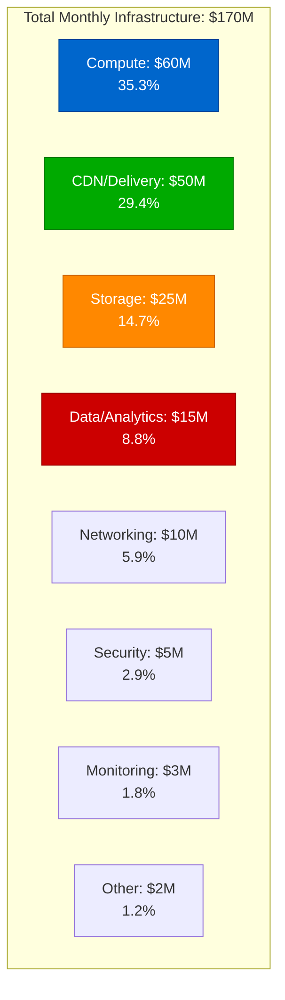
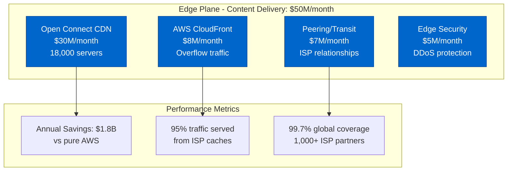
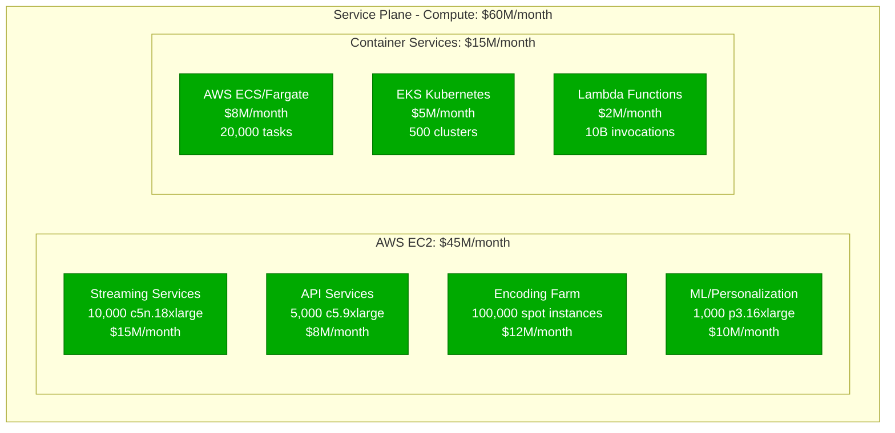
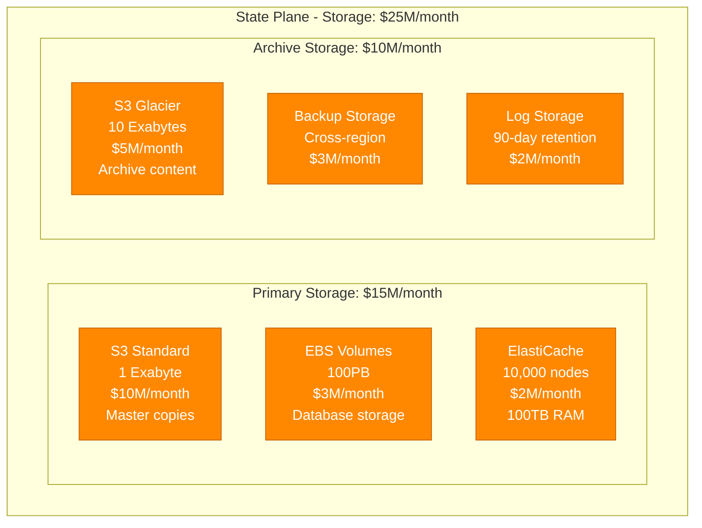
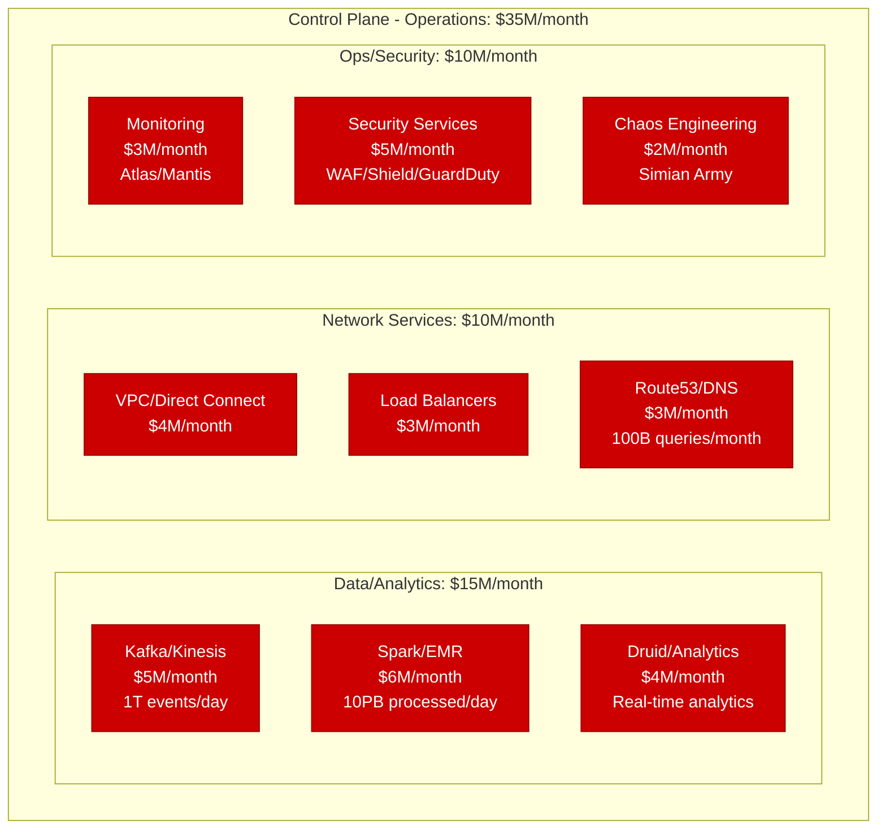
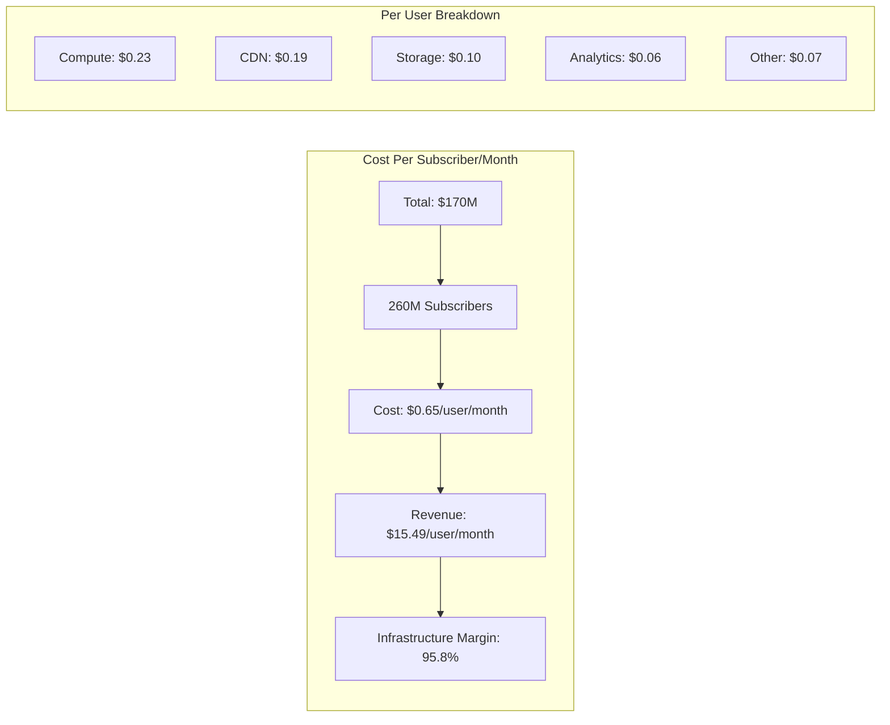
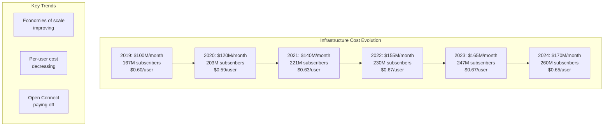
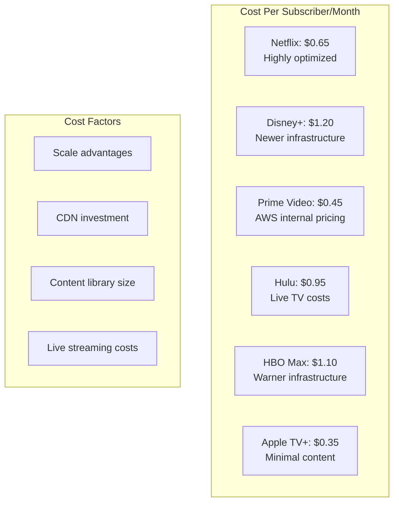
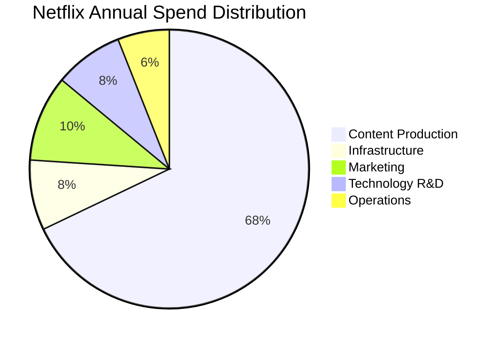

# Netflix Infrastructure Cost Breakdown: $170M/Month Reality

## The Complete Infrastructure Economics (Q3 2024)

Netflix spends $2.04 billion annually on infrastructure, serving 260M+ subscribers globally. Here's where every dollar goes.

## Total Monthly Infrastructure Spend: $170 Million



## Detailed Component Breakdown by Plane

### Edge Plane Costs: $50M/month (29.4%)



**Open Connect Breakdown**:
- Hardware refresh: $10M/month (3-year cycle)
- Colocation costs: $8M/month (data center space)
- Bandwidth/Peering: $7M/month
- Operations team: $5M/month (200 engineers)

### Service Plane Costs: $60M/month (35.3%)



**Compute Optimization Strategies**:
- Reserved Instances: 70% coverage = $18M/month savings
- Spot Instances: Encoding workloads = $8M/month savings
- Right-sizing: Continuous optimization = $3M/month savings
- Auto-scaling: 40% reduction in idle capacity

### State Plane Costs: $25M/month (14.7%)



**Storage Breakdown by Content Type**:
- Video Masters: 8 EB ($8M/month)
- Encoded Variants: 5 EB ($5M/month)
- User Data: 100 TB ($2M/month)
- ML Features: 10 PB ($3M/month)
- Logs/Metrics: 50 PB ($7M/month)

### Control Plane Costs: $35M/month (20.6%)



## Cost Per User Analysis



**Regional Cost Variations**:
- North America: $0.45/user (30% of traffic, local CDN)
- Europe: $0.55/user (GDPR compliance costs)
- Asia-Pacific: $0.75/user (less CDN coverage)
- Latin America: $0.85/user (expensive transit)

## Year-over-Year Cost Evolution



## Major Cost Optimization Initiatives

### 1. Open Connect CDN ROI Analysis
```
Investment: $500M (2011-2024)
Annual Savings: $1.8B vs AWS CloudFront
Payback Period: 3.3 months
ROI: 500% annually
Traffic Served: 95% via Open Connect
```

### 2. Encoding Optimization (2023)
```
Initiative: AV1 codec + per-title encoding
Investment: $20M in development
Savings: $30M/year in bandwidth
Reduction: 30% in bits streamed
Quality: Improved at same bitrate
```

### 3. Spot Instance Strategy
```
Workload: Video encoding
Spot Usage: 80% of encoding
Savings: $8M/month vs on-demand
Interruption Rate: <2%
Fallback: On-demand completion
```

### 4. Reserved Instance Planning
```
Coverage: 70% of baseline
Commitment: 3-year terms
Savings: $18M/month
Break-even: Month 18
Total Savings: $648M over 3 years
```

## Detailed AWS Services Breakdown

| Service | Monthly Cost | Usage | Optimization |
|---------|--------------|-------|--------------|
| EC2 | $45M | 300,000 instances | 70% Reserved |
| S3 | $15M | 11 Exabytes | Intelligent Tiering |
| CloudFront | $8M | Overflow only | 5% of traffic |
| RDS | $3M | 500 clusters | Aurora Serverless |
| DynamoDB | $2M | 100 tables | On-demand pricing |
| ElastiCache | $2M | 10,000 nodes | Reserved nodes |
| Kinesis | $3M | 100K shards | Auto-scaling |
| EMR | $6M | 50 clusters | Spot instances |
| Lambda | $2M | 10B invocations | Provisioned capacity |
| Other | $14M | Various | Continuous optimization |

## Cost Comparison with Competitors



## Future Cost Projections

### 2025 Projections
- Subscribers: 280M projected
- Infrastructure: $180M/month
- Per User: $0.64 (improving efficiency)
- New Initiatives:
  - Gaming infrastructure: +$10M/month
  - Live events: +$5M/month
  - 4K/8K expansion: +$8M/month

### Cost Reduction Opportunities
1. **ML-Optimized Encoding**: -$5M/month potential
2. **Edge Computing**: -$3M/month in compute
3. **Graviton Migration**: -$4M/month on EC2
4. **S3 Intelligent Tiering**: -$2M/month
5. **Kubernetes Optimization**: -$1M/month

## The Real Money - Content vs Infrastructure



**The Ratio**: Netflix spends 8.3x more on content than infrastructure
- Content: $17B/year ($65/user/month)
- Infrastructure: $2.04B/year ($0.65/user/month)
- Result: Infrastructure is only 4.2% of revenue

## Key Insights

### 1. The 95% Efficiency Rule
- 95% of traffic served from Open Connect
- 95% cache hit rate on popular content
- 95% of encoding on spot instances
- Result: Massive cost savings

### 2. The Per-User Economics
- Infrastructure: $0.65/user/month
- Revenue: $15.49/user/month
- Gross Margin: 95.8% on infrastructure
- Content is the real cost center

### 3. The Scale Advantage
- 260M users = negotiating power
- Custom hardware = lower costs
- Predictable usage = better planning
- Result: Best-in-class efficiency

## References

- Netflix Q3 2024 Earnings Report
- AWS Case Study: Netflix (2024)
- "Netflix Cloud Architecture" - QCon 2023
- "Open Connect Appliance Design" - Netflix Tech Blog
- AWS Pricing Calculator exports
- Industry analyst reports (Gartner, IDC)

---

*Last Updated: September 2024*
*Note: Costs are estimates based on public data and AWS list prices*