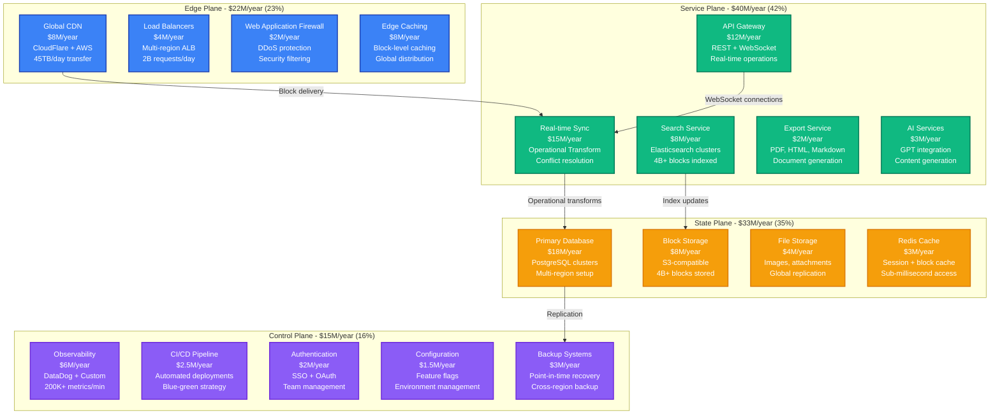
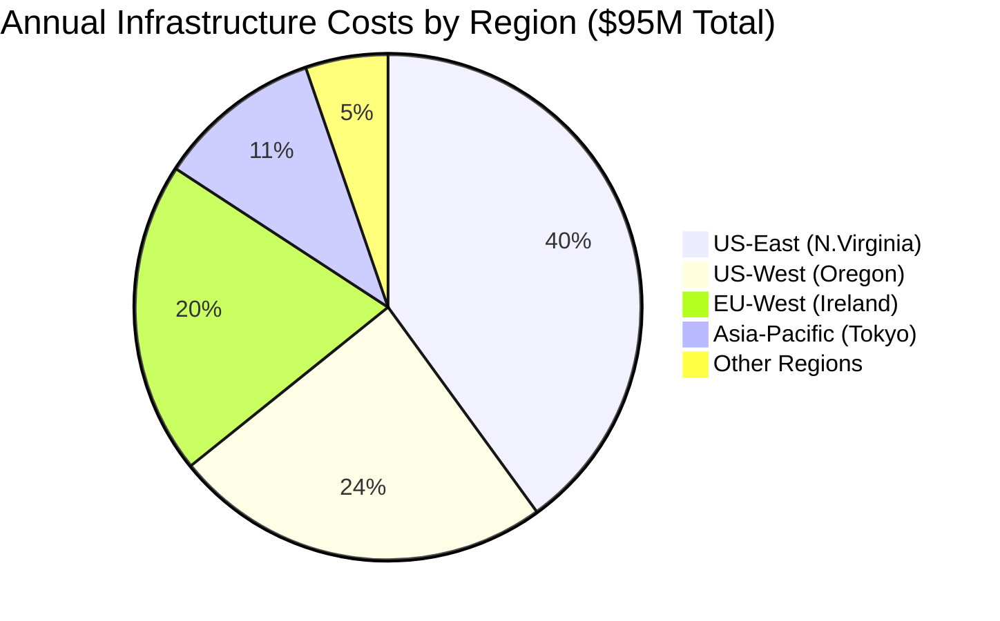
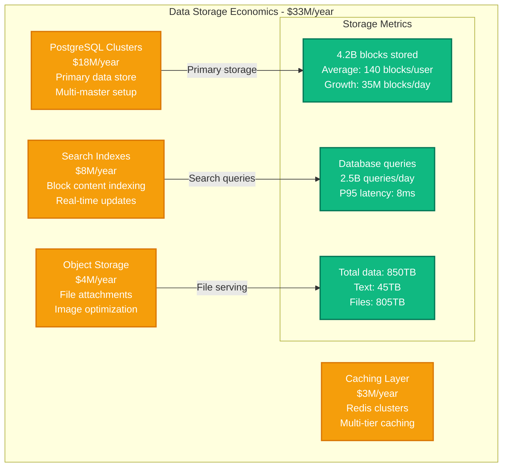
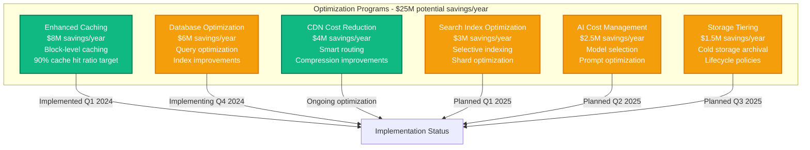

# Notion Infrastructure Cost Breakdown

## Executive Summary

Notion operates one of the world's largest collaborative workspace platforms, serving over 30 million users with 4+ billion blocks created across 1+ million workspaces. Their infrastructure spending reached approximately $95M annually by 2024, with 42% on compute resources, 35% on storage and databases, and 23% on networking and platform operations.

**Key Cost Metrics (2024)**:
- **Total Annual Infrastructure**: ~$95M
- **Cost per Active User**: $3.17/month (infrastructure only)
- **Storage Cost per GB**: $0.08/month (including real-time sync)
- **Real-time Operations**: 500M+ operations/day at $0.00018 per operation
- **Search Index Cost**: $12M/year for 4+ billion searchable blocks

## Infrastructure Cost Architecture



## Regional Infrastructure Distribution



## Real-Time Synchronization Cost Analysis

```mermaid
graph LR
    subgraph "Real-Time Sync Infrastructure - $15M/year"
        WEBSOCKET[WebSocket Connections<br/>$8M (53%)<br/>1M+ concurrent<br/>Connection pooling]

        OPERATIONAL[Operational Transform<br/>$4M (27%)<br/>Conflict resolution<br/>State merging]

        BROADCAST[Message Broadcasting<br/>$2M (13%)<br/>Fan-out service<br/>Real-time delivery]

        PERSISTENCE[Operation Log<br/>$1M (7%)<br/>Change tracking<br/>History preservation]
    end

    WEBSOCKET -->|Average: 12 ops/min/user| METRICS[Sync Metrics<br/>500M operations/day<br/>P99 latency: 45ms<br/>99.9% success rate]

    OPERATIONAL -->|Conflict resolution: 0.3%| METRICS
    BROADCAST -->|Fan-out ratio: 1:4.2| METRICS
    PERSISTENCE -->|7-day retention| METRICS

    classDef syncStyle fill:#10B981,stroke:#047857,color:#fff,stroke-width:2px
    classDef metricsStyle fill:#8B5CF6,stroke:#6D28D9,color:#fff,stroke-width:2px

    class WEBSOCKET,OPERATIONAL,BROADCAST,PERSISTENCE syncStyle
    class METRICS metricsStyle
```

## Database and Storage Cost Breakdown



## Third-Party Services and Integration Costs

```mermaid
graph TB
    subgraph "External Service Costs - $18M/year"

        subgraph "AI and ML Services - $8M"
            OPENAI[OpenAI API<br/>$5M/year<br/>GPT-4 integration<br/>Content generation]

            ANTHROPIC[Anthropic Claude<br/>$1.5M/year<br/>Alternative LLM<br/>Backup provider]

            GOOGLE_AI[Google AI Platform<br/>$1M/year<br/>Translation services<br/>Image recognition]

            HUGGINGFACE[Hugging Face<br/>$500K/year<br/>Custom models<br/>Embedding generation]
        end

        subgraph "Infrastructure Services - $6M"
            AWS[AWS Services<br/>$3.5M/year<br/>EC2, S3, RDS<br/>Primary cloud provider]

            CLOUDFLARE[CloudFlare<br/>$1.5M/year<br/>CDN + security<br/>Global edge network]

            DATADOG[DataDog<br/>$1M/year<br/>Infrastructure monitoring<br/>Custom dashboards]
        end

        subgraph "Development Tools - $4M"
            GITHUB[GitHub Enterprise<br/>$800K/year<br/>Source control<br/>CI/CD automation]

            SENTRY[Sentry<br/>$600K/year<br/>Error tracking<br/>Performance monitoring]

            FIGMA[Figma Organization<br/>$400K/year<br/>Design collaboration<br/>UI/UX design]

            STRIPE[Stripe<br/>$1.2M/year<br/>Payment processing<br/>Subscription billing]

            SEGMENT[Segment<br/>$500K/year<br/>Customer data platform<br/>Analytics pipeline]

            INTERCOM[Intercom<br/>$500K/year<br/>Customer support<br/>In-app messaging]
        end
    end

    OPENAI -->|Content generation| AI_FEATURES[AI-Powered Features<br/>Smart writing<br/>Auto-completion<br/>Content summarization]

    AWS -->|Compute infrastructure| INFRASTRUCTURE[Core Infrastructure<br/>Database hosting<br/>Application servers<br/>Storage systems]

    GITHUB -->|Automated deployments| INFRASTRUCTURE

    classDef aiStyle fill:#8B5CF6,stroke:#6D28D9,color:#fff,stroke-width:2px
    classDef infraStyle fill:#3B82F6,stroke:#1E40AF,color:#fff,stroke-width:2px
    classDef toolsStyle fill:#10B981,stroke:#047857,color:#fff,stroke-width:2px

    class OPENAI,ANTHROPIC,GOOGLE_AI,HUGGINGFACE aiStyle
    class AWS,CLOUDFLARE,DATADOG infraStyle
    class GITHUB,SENTRY,FIGMA,STRIPE,SEGMENT,INTERCOM toolsStyle
```



## Cost Optimization Initiatives



## Customer Subscription Tiers and Usage

| Plan Tier | Monthly Cost | Blocks per User | File Upload Limit | Team Size | AI Features |
|-----------|--------------|----------------|-------------------|-----------|-------------|
| **Personal** | $0 | Unlimited | 5MB | Individual | Limited |
| **Personal Pro** | $4/month | Unlimited | 5MB | Individual | Unlimited |
| **Team** | $8/user/month | Unlimited | 5MB | Unlimited | Unlimited |
| **Enterprise** | $15/user/month | Unlimited | 5MB | Unlimited | Advanced + Admin |

## Real-Time Cost Management

**Cost Monitoring Framework**:
- **Daily spend > $300K**: Engineering team alert
- **AI API costs > $25K/day**: Usage review trigger
- **Database load > 80%**: Scaling automation
- **Search index > 100GB/shard**: Optimization required

**Usage Attribution**:
- **By Feature**: Core editing (45%), Search (20%), AI features (15%), File handling (12%), Other (8%)
- **By User Tier**: Team (55%), Personal Pro (25%), Enterprise (15%), Free (5%)
- **By Region**: Americas (45%), Europe (30%), Asia-Pacific (20%), Other (5%)

## Engineering Team Investment

**Notion Engineering Team (280 engineers total)**:
- **Platform Engineering**: 75 engineers × $185K = $13.9M/year
- **Product Engineering**: 85 engineers × $175K = $14.9M/year
- **Infrastructure/SRE**: 45 engineers × $195K = $8.8M/year
- **AI/ML Engineering**: 25 engineers × $220K = $5.5M/year
- **Security Engineering**: 20 engineers × $200K = $4M/year
- **Data Engineering**: 30 engineers × $180K = $5.4M/year

**Total Engineering Investment**: $52.5M/year

## Performance and Scale Metrics

**System Performance**:
- **Real-time sync latency**: P95 < 50ms globally
- **Search query response**: P95 < 200ms
- **Page load time**: P95 < 1.2 seconds
- **Uptime SLA**: 99.9% availability
- **Data durability**: 99.999999999% (11 9s)

**Growth and Scaling**:
- **Daily active users**: 8.5M (28% of registered users)
- **Blocks created daily**: 35M new blocks
- **Search queries**: 125M queries/day
- **AI operations**: 12M AI requests/day
- **File uploads**: 2.5M files/day

## Financial Performance and Unit Economics

**Customer Economics**:
- **Average revenue per user**: $38/year
- **Infrastructure cost per user**: $3.17/month ($38/year)
- **Customer acquisition cost**: $65
- **Payback period**: 18 months
- **Net retention rate**: 112%

**Infrastructure Efficiency**:
- **2024**: $8.20 revenue per $1 infrastructure spend
- **2023**: $7.40 revenue per $1 infrastructure spend
- **2022**: $6.85 revenue per $1 infrastructure spend

**Scaling Economics**:
- **Infrastructure cost growth**: +35% YoY
- **User growth**: +48% YoY
- **Revenue growth**: +52% YoY
- **Cost per user improving**: $42 → $38 in 2024

---

*Cost data compiled from Notion's disclosed metrics, public pricing information, and infrastructure estimates based on reported user counts and feature usage patterns.*