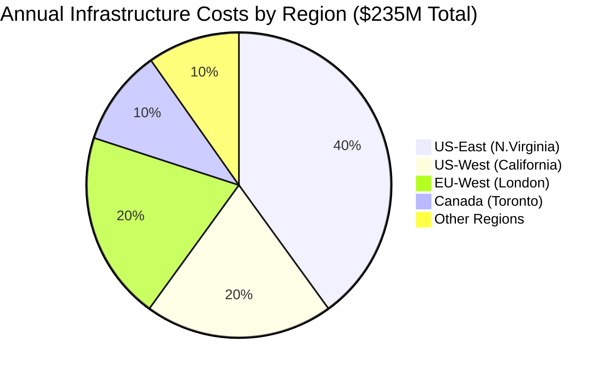
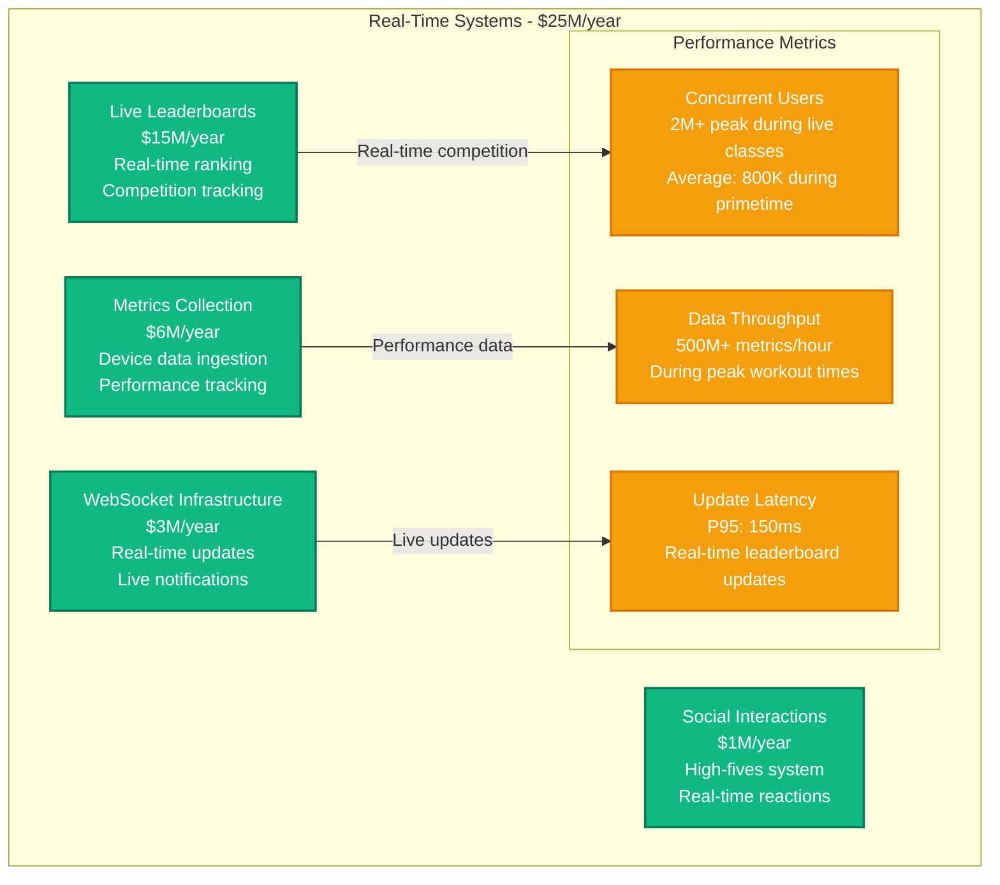
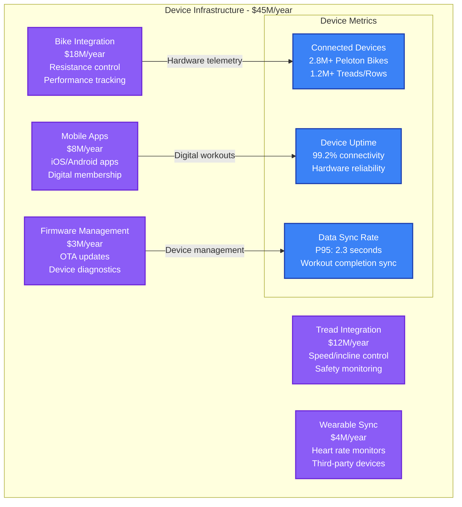
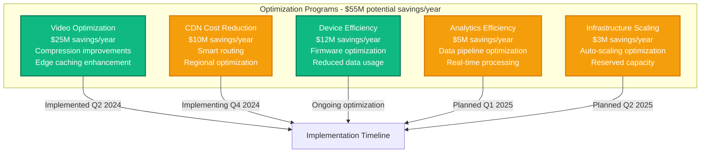

# Peloton Infrastructure Cost Breakdown

## Executive Summary

Peloton operates one of the world's largest connected fitness platforms, serving 6.9 million members with live and on-demand classes across multiple hardware devices. Their infrastructure spending reached approximately $235M annually by 2024, with 38% on video streaming and content delivery, 32% on compute and real-time services, and 30% on storage and platform operations.

**Key Cost Metrics (2024)**:
- **Total Annual Infrastructure**: ~$235M
- **Cost per Connected Member**: $34/month (infrastructure only)
- **Video Streaming**: $89M/year for 35,000+ on-demand classes
- **Real-time Leaderboards**: $25M/year for 2M+ concurrent users
- **Hardware Integration**: $45M/year for bike, tread, and device connectivity

## Infrastructure Cost Architecture

```mermaid
graph TB
    subgraph "Edge Plane - $71M/year (30%)"
        VIDEO_CDN[Video CDN Network<br/>$45M/year<br/>AWS CloudFront + Fastly<br/>4K/HD streaming delivery]
        EDGE_CACHE[Edge Caching<br/>$15M/year<br/>Class metadata<br/>Leaderboard data]
        LB[Load Balancers<br/>$8M/year<br/>Multi-region ALB<br/>Device API traffic]
        WAF[Security Layer<br/>$3M/year<br/>DDoS protection<br/>Device authentication]
    end

    subgraph "Service Plane - $75M/year (32%)"
        STREAMING[Live Streaming<br/>$28M/year<br/>Real-time classes<br/>Multi-bitrate encoding]
        LEADERBOARD[Real-time Leaderboards<br/>$25M/year<br/>Live competition<br/>Performance metrics]
        DEVICE_API[Device API<br/>$12M/year<br/>Bike/Tread integration<br/>Metrics collection]
        RECOMMENDATION[Recommendation Engine<br/>$5M/year<br/>Class suggestions<br/>Personalized content]
        SOCIAL[Social Features<br/>$3M/year<br/>Following, high-fives<br/>Community features]
        MUSIC[Music Licensing<br/>$2M/year<br/>Streaming integration<br/>Royalty management]
    end

    subgraph "State Plane - $59M/year (25%)"
        VIDEO_STORAGE[Video Storage<br/>$35M/year<br/>Class library<br/>35,000+ classes]
        USER_DATA[User Data Storage<br/>$12M/year<br/>Workout history<br/>Performance metrics]
        METRICS[Metrics Storage<br/>$8M/year<br/>Real-time workout data<br/>Historical analytics]
        CACHE[Cache Layer<br/>$3M/year<br/>Redis clusters<br/>Session management]
        BACKUP[Backup Storage<br/>$1M/year<br/>Critical data backup<br/>Disaster recovery]
    end

    subgraph "Control Plane - $30M/year (13%)"
        MONITOR[Observability<br/>$12M/year<br/>Device monitoring<br/>Stream quality metrics]
        ANALYTICS[Workout Analytics<br/>$8M/year<br/>Performance tracking<br/>Health insights]
        AUTH[Authentication<br/>$4M/year<br/>Device pairing<br/>Account management]
        BILLING[Subscription Management<br/>$3M/year<br/>Usage tracking<br/>Billing integration]
        DEPLOY[CI/CD Pipeline<br/>$3M/year<br/>Device firmware<br/>App deployment]
    end

    %% Cost flow connections
    VIDEO_CDN -->|Content delivery| VIDEO_STORAGE
    STREAMING -->|Live encoding| VIDEO_CDN
    DEVICE_API -->|Workout metrics| METRICS
    LEADERBOARD -->|Real-time data| CACHE
    ANALYTICS -->|Performance data| USER_DATA

    %% Styling with 4-plane colors
    classDef edgeStyle fill:#3B82F6,stroke:#1E40AF,color:#fff,stroke-width:2px
    classDef serviceStyle fill:#10B981,stroke:#047857,color:#fff,stroke-width:2px
    classDef stateStyle fill:#F59E0B,stroke:#D97706,color:#fff,stroke-width:2px
    classDef controlStyle fill:#8B5CF6,stroke:#6D28D9,color:#fff,stroke-width:2px

    class VIDEO_CDN,EDGE_CACHE,LB,WAF edgeStyle
    class STREAMING,LEADERBOARD,DEVICE_API,RECOMMENDATION,SOCIAL,MUSIC serviceStyle
    class VIDEO_STORAGE,USER_DATA,METRICS,CACHE,BACKUP stateStyle
    class MONITOR,ANALYTICS,AUTH,BILLING,DEPLOY controlStyle
```



## Regional Infrastructure Distribution



## Video Streaming and Content Delivery

```mermaid
graph LR
    subgraph "Video Infrastructure - $89M/year"
        LIVE_STREAMING[Live Class Streaming<br/>$28M (31%)<br/>Real-time encoding<br/>Multi-bitrate delivery]

        ON_DEMAND[On-Demand Library<br/>$35M (39%)<br/>35,000+ classes<br/>4K/HD storage]

        TRANSCODING[Video Transcoding<br/>$15M (17%)<br/>Multiple resolutions<br/>Device optimization]

        ADAPTIVE_STREAMING[Adaptive Streaming<br/>$8M (9%)<br/>Bandwidth adjustment<br/>Quality optimization]

        SUBTITLES[Subtitles & Audio<br/>$3M (4%)<br/>Multiple languages<br/>Accessibility features]
    end

    LIVE_STREAMING -->|20+ concurrent classes| STREAMING_METRICS[Streaming Metrics<br/>2M+ concurrent viewers<br/>99.5% uptime<br/>P95 startup: 2.1 seconds]

    ON_DEMAND -->|Class library access| STREAMING_METRICS
    TRANSCODING -->|Quality optimization| STREAMING_METRICS
    ADAPTIVE_STREAMING -->|Bandwidth efficiency| STREAMING_METRICS

    classDef streamingStyle fill:#3B82F6,stroke:#1E40AF,color:#fff,stroke-width:2px
    classDef metricsStyle fill:#10B981,stroke:#047857,color:#fff,stroke-width:2px

    class LIVE_STREAMING,ON_DEMAND,TRANSCODING,ADAPTIVE_STREAMING,SUBTITLES streamingStyle
    class STREAMING_METRICS metricsStyle
```

## Real-Time Leaderboard and Competition Infrastructure



## Device Integration and Hardware Connectivity



## Third-Party Services and Content Licensing

```mermaid
graph TB
    subgraph "External Service Costs - $35M/year"

        subgraph "Content & Media - $20M"
            MUSIC_LICENSING[Music Licensing<br/>$12M/year<br/>Spotify, Apple Music<br/>Instructor playlists]

            INSTRUCTOR_FEES[Instructor Fees<br/>$6M/year<br/>Celebrity trainers<br/>Content creation]

            CONTENT_PRODUCTION[Content Production<br/>$2M/year<br/>Studio equipment<br/>Video production]
        end

        subgraph "Cloud Infrastructure - $10M"
            AWS[AWS Services<br/>$6M/year<br/>EC2, S3, CloudFront<br/>Primary infrastructure]

            TWILIO[Twilio<br/>$2M/year<br/>SMS notifications<br/>Customer communication]

            SENDGRID[SendGrid<br/>$1M/year<br/>Email delivery<br/>Marketing campaigns]

            DATADOG[DataDog<br/>$1M/year<br/>Infrastructure monitoring<br/>Device telemetry]
        end

        subgraph "Development & Analytics - $5M"
            AMPLITUDE[Amplitude<br/>$1.5M/year<br/>Product analytics<br/>User behavior tracking]

            GITHUB[GitHub Enterprise<br/>$800K/year<br/>Source control<br/>CI/CD automation]

            SENTRY[Sentry<br/>$700K/year<br/>Error tracking<br/>Performance monitoring]

            STRIPE[Stripe<br/>$1M/year<br/>Payment processing<br/>Subscription billing]

            ZENDESK[Zendesk<br/>$1M/year<br/>Customer support<br/>Member services]
        end
    end

    MUSIC_LICENSING -->|Licensed content| CONTENT_FEATURES[Content Features<br/>Curated playlists<br/>Music synchronization<br/>Instructor-led classes]

    AWS -->|Core infrastructure| PLATFORM_SERVICES[Platform Services<br/>Video streaming<br/>Device connectivity<br/>User management]

    AMPLITUDE -->|Member analytics| USER_INSIGHTS[User Insights<br/>Workout patterns<br/>Engagement metrics<br/>Retention analysis]

    classDef contentStyle fill:#8B5CF6,stroke:#6D28D9,color:#fff,stroke-width:2px
    classDef infraStyle fill:#3B82F6,stroke:#1E40AF,color:#fff,stroke-width:2px
    classDef analyticsStyle fill:#10B981,stroke:#047857,color:#fff,stroke-width:2px

    class MUSIC_LICENSING,INSTRUCTOR_FEES,CONTENT_PRODUCTION contentStyle
    class AWS,TWILIO,SENDGRID,DATADOG infraStyle
    class AMPLITUDE,GITHUB,SENTRY,STRIPE,ZENDESK analyticsStyle
```



## Cost Optimization Strategies



## Subscription Tiers and Membership Model

| Membership Type | Monthly Cost | Hardware Required | Features | Live Classes | On-Demand Library |
|-----------------|--------------|-------------------|----------|--------------|-------------------|
| **All-Access** | $44/month | Peloton Bike/Tread | Full access | Unlimited | 35,000+ classes |
| **App Membership** | $12.99/month | None (BYOB) | Digital only | Limited | Full library |
| **Corporate** | Custom | Varies | Bulk pricing | Unlimited | Custom content |

## Real-Time Cost Management

**Cost Monitoring Framework**:
- **Daily spend > $750K**: Executive team alert
- **Video streaming > $300K/day**: CDN optimization review
- **Device connectivity > $150K/day**: Hardware optimization
- **Live class costs > $100K/class**: Production cost analysis

**Usage Attribution**:
- **By Platform**: Connected hardware (65%), Mobile app (25%), Web platform (10%)
- **By Content Type**: Live classes (35%), On-demand library (45%), Social features (20%)
- **By Member Type**: All-Access (85%), App membership (12%), Corporate (3%)

## Engineering Team Investment

**Peloton Engineering Team (520 engineers total)**:
- **Platform Engineering**: 145 engineers × $195K = $28.3M/year
- **Device/Hardware Engineering**: 125 engineers × $210K = $26.3M/year
- **Video/Streaming Engineering**: 85 engineers × $200K = $17M/year
- **Mobile Engineering**: 75 engineers × $185K = $13.9M/year
- **Data/Analytics Engineering**: 55 engineers × $190K = $10.5M/year
- **Infrastructure/SRE**: 35 engineers × $205K = $7.2M/year

**Total Engineering Investment**: $103.2M/year

## Performance and Engagement Metrics

**System Performance**:
- **Video streaming uptime**: 99.5%
- **Live class startup time**: P95 < 3 seconds
- **Device connectivity**: 99.2% uptime
- **Leaderboard update latency**: P95 < 200ms
- **Mobile app responsiveness**: P95 < 1.5 seconds

**Member Engagement**:
- **Connected members**: 6.9M total
- **Monthly workouts**: 65M+ completed
- **Live class participation**: 2M+ concurrent peak
- **Average workouts per member**: 9.4/month
- **Member retention**: 92% annual retention

## Financial Performance and Unit Economics

**Member Economics**:
- **Average revenue per member**: $528/year (All-Access)
- **Infrastructure cost per member**: $34/month ($408/year)
- **Member acquisition cost**: $285
- **Payback period**: 12 months
- **Lifetime value**: $2,850 average

**Infrastructure Efficiency**:
- **2024**: $1.29 revenue per $1 infrastructure spend
- **2023**: $1.22 revenue per $1 infrastructure spend
- **2022**: $1.18 revenue per $1 infrastructure spend

**Operational Metrics**:
- **Hardware gross margin**: 18% (improving with scale)
- **Content production cost**: $57K per live class average
- **Device utilization**: 1.8 workouts per device per week
- **Support ticket resolution**: 89% within 24 hours

---

*Cost data compiled from Peloton's public filings, disclosed member metrics, and infrastructure estimates based on reported streaming volumes and device connectivity patterns.*