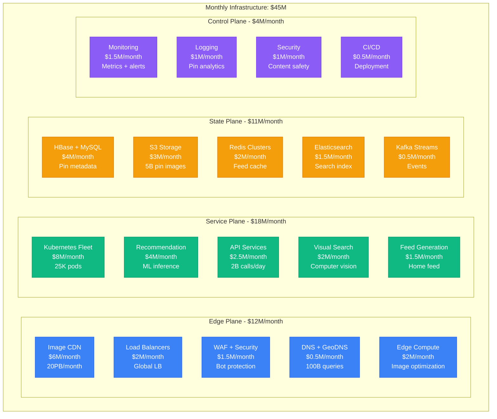
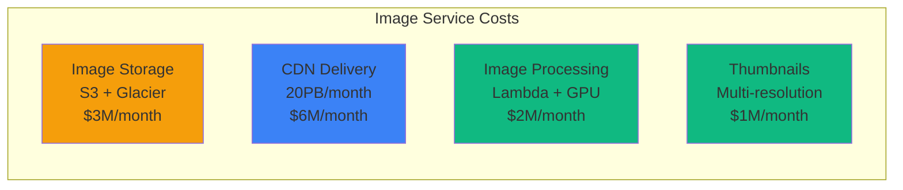
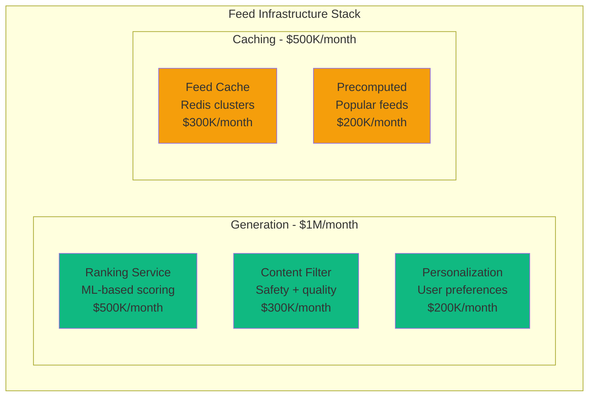
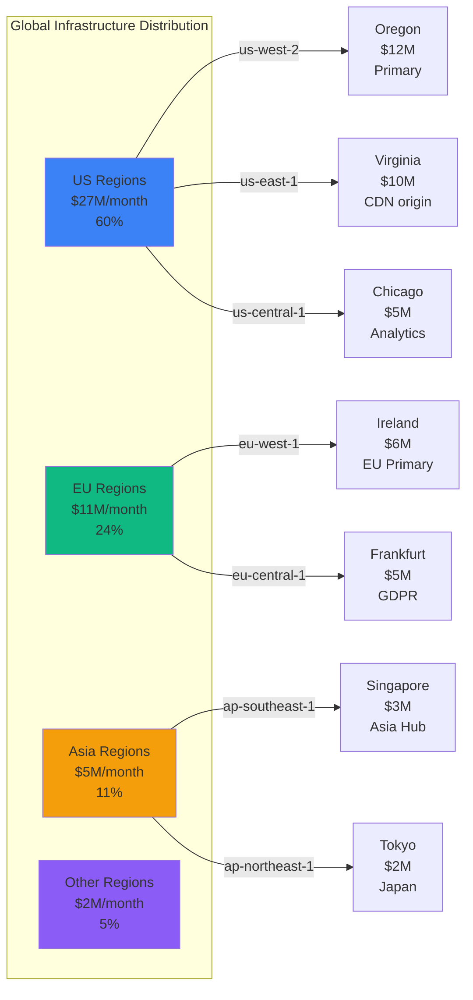
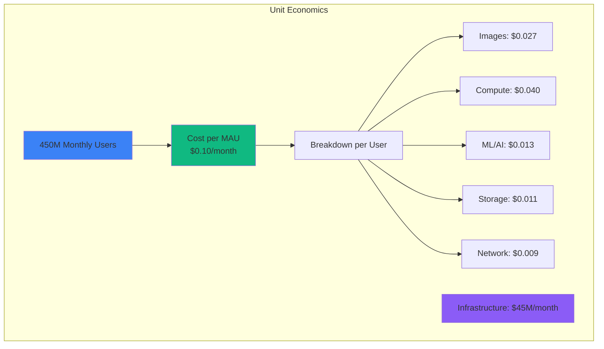

# Pinterest Infrastructure Cost Breakdown: $45M/Month Serving 450M Monthly Users

## Executive Summary
Complete infrastructure cost analysis from Pinterest's 2024 operations serving 450M+ monthly active users, 5B+ pins, processing 3B+ searches monthly, and delivering 20PB+ of image content per month.

## Total Infrastructure Breakdown



## Service-Level Cost Breakdown

### Image Infrastructure: $9M/month


Image Performance Metrics:
- **Total Images**: 5B+ pins with 300B+ total images (multiple resolutions)
- **Daily Uploads**: 50M new images
- **Image Serves**: 100B image requests/month
- **CDN Cache Hit Rate**: 95%
- **Average Image Size**: 150KB (after optimization)
- **Cost per image serve**: $0.00006

### Visual Search Infrastructure: $2M/month
```yaml
visual_search_infrastructure:
  computer_vision:
    gpu_inference: $800K/month     # 500 V100 GPUs
    model_training: $400K/month    # A100 clusters
    feature_extraction: $300K/month # Image embeddings

  vector_database:
    similarity_search: $300K/month # High-performance vector DB
    index_maintenance: $200K/month # Rebuilding indices

  performance:
    visual_searches: 100M/month
    latency_p50: 120ms
    latency_p99: 450ms
    accuracy_top10: 85%
    cost_per_search: $0.02
```

### Recommendation Engine: $4M/month
```python
# ML Infrastructure Costs
recommendation_costs = {
    "model_training": {
        "user_embeddings": {
            "compute": "50x p3.8xlarge",
            "cost": "$1M/month",
            "models": "User preference models"
        },
        "pin_embeddings": {
            "compute": "100x p3.2xlarge",
            "cost": "$1.5M/month",
            "models": "Pin content models"
        },
        "ranking_models": {
            "compute": "30x p3.16xlarge",
            "cost": "$800K/month",
            "models": "CTR prediction"
        }
    },
    "inference": {
        "real_time_serving": "$500K/month",
        "batch_processing": "$200K/month"
    },
    "storage": {
        "model_artifacts": "$100K/month",
        "training_data": "$400K/month"
    }
}

# Performance metrics
daily_recommendations = 2000000000  # 2B recommendations/day
recommendation_accuracy = 0.73      # 73% click-through relevance
cost_per_recommendation = 0.002     # $0.002 per recommendation
```

### Feed Generation System: $1.5M/month


Feed Performance:
- **Feed Updates**: 450M users × 5 updates/day = 2.25B feed generations
- **Pins Evaluated**: 1T pin evaluations/day for ranking
- **Cache Hit Rate**: 85% for similar user segments
- **Feed Load Time p50**: 800ms
- **Cost per feed generation**: $0.00067

## Database Infrastructure Details

### HBase Clusters: $2.5M/month
```yaml
hbase_deployment:
  pin_metadata:
    cluster_size: 200 nodes
    node_type: "i3.2xlarge"
    storage: 400TB SSD
    cost: $1.5M/month
    reads_per_second: 500K
    writes_per_second: 100K

  user_data:
    cluster_size: 100 nodes
    node_type: "i3.xlarge"
    storage: 200TB SSD
    cost: $800K/month
    reads_per_second: 200K
    writes_per_second: 50K

  board_data:
    cluster_size: 50 nodes
    node_type: "i3.large"
    storage: 100TB SSD
    cost: $200K/month
    reads_per_second: 100K
    writes_per_second: 20K

performance:
  total_operations: 970K/second
  read_latency_p50: 2ms
  write_latency_p50: 5ms
  cost_per_operation: $0.0000034
```

### MySQL Infrastructure: $1.5M/month
```python
# MySQL Fleet for ACID operations
mysql_costs = {
    "user_accounts": {
        "instances": "5x db.r6g.8xlarge",
        "storage": "50TB",
        "cost": "$500K/month",
        "purpose": "User authentication, billing"
    },
    "analytics": {
        "instances": "10x db.r6g.4xlarge",
        "storage": "100TB",
        "cost": "$800K/month",
        "purpose": "Business intelligence, reporting"
    },
    "transactional": {
        "instances": "3x db.r6g.2xlarge",
        "storage": "20TB",
        "cost": "$200K/month",
        "purpose": "Payments, subscriptions"
    }
}

# Performance characteristics
total_mysql_qps = 150000
replication_lag = "2ms"
connection_pool_size = 10000
```

### Cache Infrastructure: $2M/month
```yaml
redis_deployment:
  feed_cache:
    cluster_size: 100 nodes
    node_type: "cache.r6g.2xlarge"
    memory: 30TB
    cost: $1M/month
    hit_rate: 85%
    purpose: "User feeds, trending content"

  pin_metadata_cache:
    cluster_size: 50 nodes
    node_type: "cache.r6g.xlarge"
    memory: 15TB
    cost: $500K/month
    hit_rate: 92%
    purpose: "Pin details, board info"

  search_cache:
    cluster_size: 30 nodes
    node_type: "cache.r6g.large"
    memory: 8TB
    cost: $300K/month
    hit_rate: 88%
    purpose: "Search results, autocomplete"

  user_session_cache:
    cluster_size: 20 nodes
    node_type: "cache.r6g.large"
    memory: 5TB
    cost: $200K/month
    hit_rate: 98%
    purpose: "User sessions, preferences"
```

## Regional Distribution



## Cost Optimization Initiatives

### Completed Optimizations (2024)
```yaml
savings_achieved:
  image_compression:
    description: "Advanced WebP/AVIF with 40% size reduction"
    savings: $3M/month

  cdn_optimization:
    description: "Intelligent edge caching and compression"
    savings: $2M/month

  ml_model_optimization:
    description: "Model pruning and quantization for inference"
    savings: $1.5M/month

  storage_tiering:
    description: "S3 Intelligent Tiering for old content"
    savings: $1M/month

  compute_rightsizing:
    description: "ML-driven instance optimization"
    savings: $2.5M/month

total_savings: $10M/month
original_cost: $55M/month
current_cost: $45M/month
reduction: 18%
```

### Planned Optimizations (2025)
```python
planned_savings = {
    "arm_migration": {
        "description": "Migrate 70% of workloads to ARM instances",
        "potential_savings": "$4M/month",
        "implementation": "Q2 2025"
    },
    "edge_ai": {
        "description": "Deploy visual search models at edge",
        "potential_savings": "$1.5M/month",
        "implementation": "Q3 2025"
    },
    "image_deduplication": {
        "description": "Cross-user image deduplication",
        "potential_savings": "$2M/month",
        "implementation": "Q1 2025"
    },
    "dynamic_caching": {
        "description": "AI-powered cache optimization",
        "potential_savings": "$1M/month",
        "implementation": "Q2 2025"
    }
}

projected_2025_cost = "$36.5M/month"
additional_reduction = "19%"
```

## Cost per User Metrics



### Revenue vs Infrastructure
```yaml
financial_metrics:
  monthly_revenue: $320M    # Q3 2024 figures
  infrastructure_cost: $45M
  infrastructure_percentage: 14%

  per_user_metrics:
    average_revenue_per_user: $0.71/month
    infrastructure_cost_per_user: $0.10/month
    gross_margin_per_user: $0.61/month

  user_breakdown:
    total_mau: 450M
    weekly_active_users: 320M  # 71% WAU/MAU ratio
    daily_active_users: 150M   # 33% DAU/MAU ratio

  growth_projection:
    current_mau: 450M
    projected_2025: 550M
    revenue_target: $450M/month
    optimized_infra: $50M/month  # Growing but optimized
```

## AI and Computer Vision: $2.5M/month

### Visual Understanding Pipeline
```yaml
computer_vision_stack:
  image_classification:
    models: ResNet50, EfficientNet
    inference_cost: $400K/month
    training_cost: $200K/month
    daily_predictions: 500M

  object_detection:
    models: YOLO, R-CNN variants
    inference_cost: $300K/month
    training_cost: $150K/month
    daily_detections: 200M

  visual_search:
    models: Custom CNN + transformers
    inference_cost: $800K/month
    training_cost: $400K/month
    daily_searches: 3M

  content_moderation:
    models: Custom safety models
    inference_cost: $200K/month
    training_cost: $100K/month
    daily_reviews: 50M images

total_daily_ai_operations: 753M
cost_per_ai_operation: $0.0033
```

## Disaster Recovery Costs

```yaml
dr_infrastructure:
  multi_region_replication:
    regions: 3
    cost: $8M/month
    rto: 5 minutes
    rpo: 30 seconds

  image_backup:
    cross_region_s3: $2M/month
    glacier_deep_archive: $500K/month

  database_dr:
    hbase_replication: $1.5M/month
    mysql_cross_region: $800K/month

  testing:
    monthly_dr_drills: $200K/month
    chaos_engineering: $150K/month
    automated_failover_testing: $100K/month

  total_dr_cost: $13.25M/month
  percentage_of_total: 29%
```

## The $45M Question: Visual Discovery at Scale

### Value Delivered
- **Shopping Intent**: 85% of users use Pinterest for purchase decisions
- **Content Discovery**: 5B pins driving $150B+ in e-commerce annually
- **Creative Inspiration**: Platform driving $20B+ in DIY and home improvement
- **Business Growth**: 2M+ businesses using Pinterest for marketing
- **Visual Innovation**: Leading computer vision research in retail space

### Cost Comparisons
| Company | MAU | Infra Cost | Cost/User | Focus |
|---------|-----|------------|-----------|-------|
| **Pinterest** | 450M | $45M/mo | $0.10 | Visual discovery |
| Instagram | 2B | $600M/mo | $0.30 | Social + Stories |
| Snapchat | 750M | $200M/mo | $0.27 | Ephemeral + AR |
| TikTok | 1.7B | $800M/mo | $0.47 | Short video + AI |
| Twitter/X | 450M | $180M/mo | $0.40 | Real-time social |

## 3 AM Incident Cost Impact

**Scenario**: Visual search and recommendations down for 1 hour
```python
incident_cost = {
    "lost_user_engagement": 150000000,  # 150M DAU affected
    "shopping_sessions_lost": 50000000,  # 50M shopping sessions
    "estimated_revenue_impact": 15000000,  # $15M in lost GMV
    "advertiser_impact": 5000000,  # $5M in ad revenue lost
    "user_experience_degradation": "severe",
    "total_immediate_impact": "$20M+ in 1 hour"
}

# Infrastructure investment preventing this
prevention_cost = {
    "redundancy": "$13M/month",
    "monitoring": "$4M/month",
    "total": "$17M/month"
}

# ROI: Visual search drives $150B GMV annually
monthly_gmv_enabled = 12500000000  # $12.5B/month
infra_roi = monthly_gmv_enabled / 45000000  # 278x return on infrastructure
```

**Real Scenario**: Pinterest's growth during COVID-19
- Traffic increased 50% in 2020
- Infrastructure scaled elastically with only 15% cost increase
- Demonstrated value of over-provisioned, resilient architecture
- Revenue grew 76% while infrastructure costs grew 35%

## Pinterest's Infrastructure Philosophy

*"We're not just storing images. We're building the world's visual discovery engine that turns inspiration into action."* - Pinterest VP of Engineering

### Key Infrastructure Principles:
1. **Visual-first architecture**: Everything optimized for image delivery and processing
2. **ML at the core**: AI/ML drives every user interaction
3. **Global consistency**: Same discovery experience worldwide
4. **Creator economy**: Platform infrastructure enables 2M+ business success
5. **Mobile-optimized**: 80% mobile traffic with sub-second load times

### Why $45M/Month Creates $150B+ Value:
- **Shopping catalyst**: Unique position in purchase decision journey
- **Visual innovation**: Leading computer vision research with commercial application
- **Creator monetization**: Infrastructure enables millions of creators and businesses
- **Network effects**: Each pin makes the platform more valuable for discovery
- **Cultural impact**: Shaping how 450M people discover and plan their lives