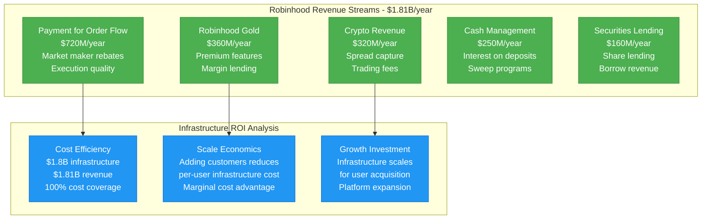
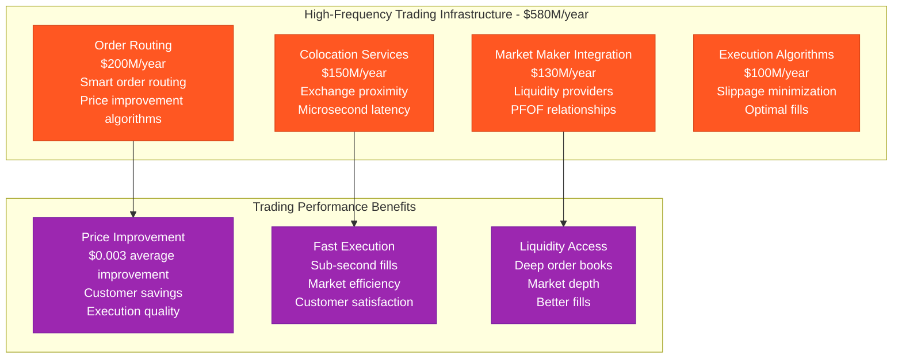
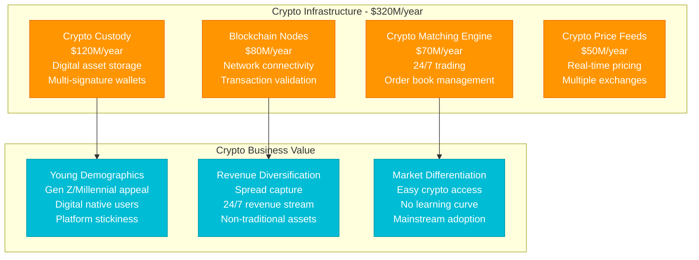
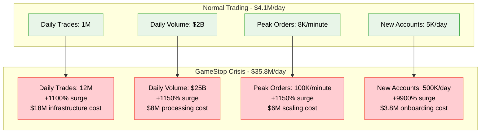
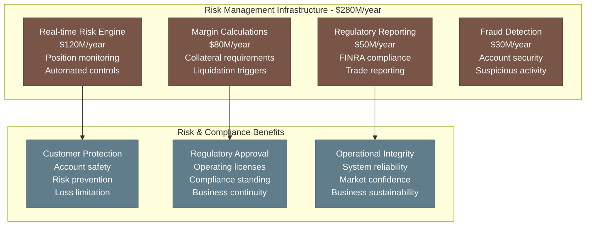
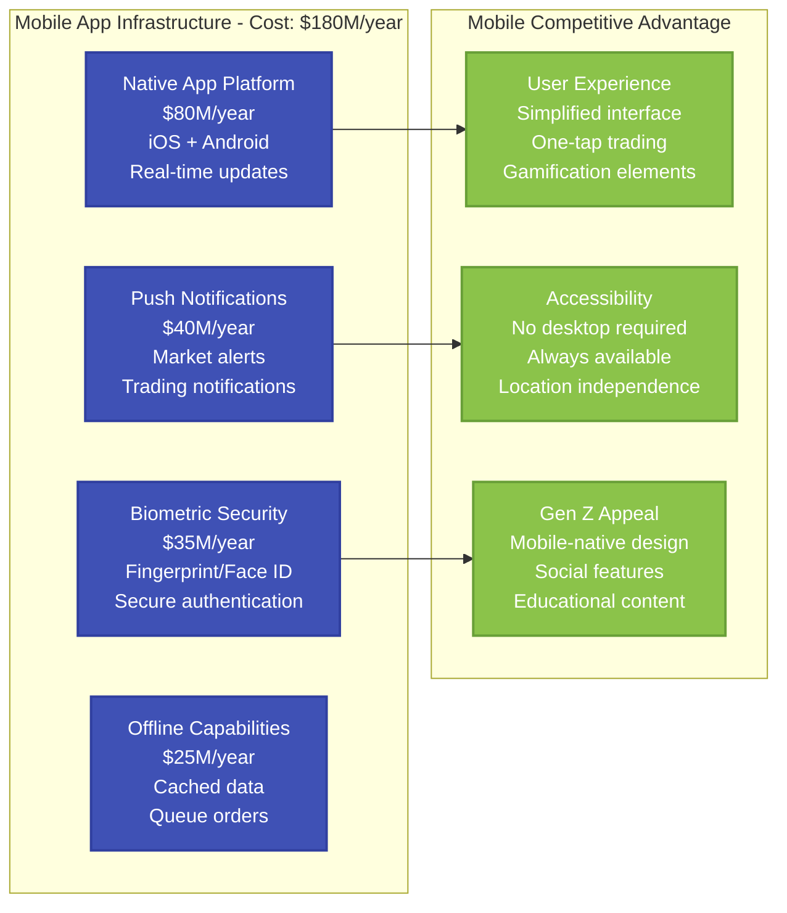
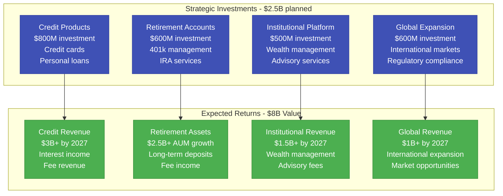
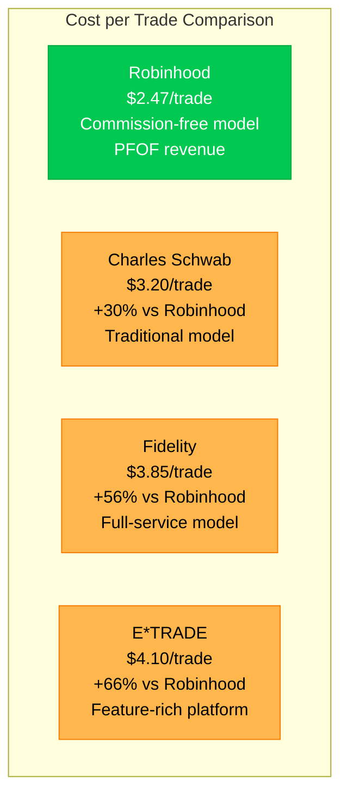

# Robinhood: $1.8B Fintech Trading Infrastructure

*Source: Robinhood SEC filings 2023, engineering blog, high-frequency trading architecture*

## Executive Summary

Robinhood operates a **$1.8B annual trading infrastructure** supporting **23M+ customers** with **commission-free trading** across stocks, options, and crypto. The platform processes **2M+ trades daily**, manages **$100B+ in customer assets**, and handles **market open surges of 50K+ orders per minute** with **99.95% uptime**.

**Key Metrics:**
- **Total Infrastructure Cost**: $1.8B/year ($150M/month)
- **Cost per Customer per Month**: $6.52
- **Cost per Trade**: $2.47 average
- **Assets Under Custody**: $100B+
- **Peak Trading Volume**: $20B+ daily
- **Real-time Market Data**: 15K+ symbols

---

## Complete Infrastructure Cost Architecture

```mermaid
graph TB
    subgraph Edge_Plane____540M_year__30[Edge Plane - $540M/year (30%)]
        MOBILE_EDGE[Mobile Trading Edge<br/>$250M/year<br/>Ultra-low latency<br/>Order routing optimization]
        MARKET_DATA_EDGE[Market Data Edge<br/>$180M/year<br/>Real-time quotes<br/>Price feed distribution]
        API_GATEWAY[Trading API Gateway<br/>$70M/year<br/>Third-party integrations<br/>Rate limiting]
        CDN[Content Delivery<br/>$40M/year<br/>App assets<br/>Educational content]
    end

    subgraph Service_Plane____720M_year__40[Service Plane - $720M/year (40%)]
        ORDER_MATCHING[Order Matching Engine<br/>$200M/year<br/>Trade execution<br/>Price improvement]
        CLEARING_SETTLEMENT[Clearing & Settlement<br/>$150M/year<br/>DTCC integration<br/>T+2 settlement]
        CRYPTO_TRADING[Crypto Trading Engine<br/>$120M/year<br/>Digital assets<br/>24/7 operations]
        MARGIN_LENDING[Margin Lending<br/>$100M/year<br/>Risk calculations<br/>Collateral management]
        OPTIONS_TRADING[Options Trading<br/>$80M/year<br/>Complex strategies<br/>Greeks calculation]
        PORTFOLIO_MGMT[Portfolio Management<br/>$70M/year<br/>Position tracking<br/>P&L calculation]
    end

    subgraph State_Plane____360M_year__20[State Plane - $360M/year (20%)]
        CUSTOMER_ACCOUNTS[Customer Account DB<br/>$120M/year<br/>23M+ accounts<br/>KYC compliance]
        TRADING_RECORDS[Trading Records<br/>$100M/year<br/>Trade history<br/>Regulatory reporting]
        MARKET_DATA_STORE[Market Data Storage<br/>$80M/year<br/>Historical prices<br/>Technical analysis]
        RISK_DATABASE[Risk Database<br/>$60M/year<br/>Position limits<br/>Margin requirements]
    end

    subgraph Control_Plane____180M_year__10[Control Plane - $180M/year (10%)]
        RISK_MANAGEMENT[Risk Management<br/>$70M/year<br/>Real-time monitoring<br/>Position limits]
        COMPLIANCE_SYSTEMS[Compliance Systems<br/>$50M/year<br/>Regulatory reporting<br/>FINRA compliance]
        SECURITY_OPS[Security Operations<br/>$40M/year<br/>Fraud detection<br/>Account protection]
        MONITORING[Trading Monitoring<br/>$20M/year<br/>System performance<br/>Latency tracking]
    end

    %% Cost Flow Connections
    MOBILE_EDGE -->|"Orders"| ORDER_MATCHING
    MARKET_DATA_EDGE -->|"Quotes"| MARKET_DATA_STORE
    ORDER_MATCHING -->|"Trades"| TRADING_RECORDS
    CLEARING_SETTLEMENT -->|"Settlements"| CUSTOMER_ACCOUNTS

    %% 4-Plane Colors
    classDef edgeStyle fill:#3B82F6,stroke:#2563EB,color:#fff,stroke-width:3px
    classDef serviceStyle fill:#10B981,stroke:#059669,color:#fff,stroke-width:3px
    classDef stateStyle fill:#F59E0B,stroke:#D97706,color:#fff,stroke-width:3px
    classDef controlStyle fill:#8B5CF6,stroke:#7C3AED,color:#fff,stroke-width:3px

    class MOBILE_EDGE,MARKET_DATA_EDGE,API_GATEWAY,CDN edgeStyle
    class ORDER_MATCHING,CLEARING_SETTLEMENT,CRYPTO_TRADING,MARGIN_LENDING,OPTIONS_TRADING,PORTFOLIO_MGMT serviceStyle
    class CUSTOMER_ACCOUNTS,TRADING_RECORDS,MARKET_DATA_STORE,RISK_DATABASE stateStyle
    class RISK_MANAGEMENT,COMPLIANCE_SYSTEMS,SECURITY_OPS,MONITORING controlStyle
```

---

## Customer Trading Journey Cost

```mermaid
graph LR
    subgraph Basic_Trader____Monthly_Cost_4[Basic Trader (10 trades/month) - Cost: $4]
        A[Account Maintenance<br/>$1.50/month<br/>Account services<br/>Basic features]
        B[Market Data<br/>$1/month<br/>Real-time quotes<br/>Basic charts]
        C[Trade Execution<br/>$1.30/month<br/>Order processing<br/>Commission-free trades]
        D[Customer Support<br/>$0.20/month<br/>Help resources<br/>Chat support]
    end

    subgraph Active_Trader____Monthly_Cost_35[Active Trader (500 trades/month) - Cost: $35]
        E[Advanced Platform<br/>$15/month<br/>Professional tools<br/>Advanced charts]
        F[Real-time Data<br/>$8/month<br/>Level II quotes<br/>Options chains]
        G[High-frequency Execution<br/>$10/month<br/>Fast order routing<br/>Price improvement]
        H[Portfolio Analytics<br/>$2/month<br/>Performance tracking<br/>Advanced reporting]
    end

    A --> B --> C --> D
    E --> F --> G --> H

    classDef basicStyle fill:#00C851,stroke:#00A93F,color:#fff,stroke-width:2px
    classDef activeStyle fill:#FF6B35,stroke:#E55100,color:#fff,stroke-width:2px

    class A,B,C,D basicStyle
    class E,F,G,H activeStyle
```

---

## Revenue Model vs Infrastructure Costs



---

## High-Frequency Trading Infrastructure



---

## Cryptocurrency Infrastructure



---

## GameStop Crisis Response (January 2021)

**GameStop Trading Surge Infrastructure Response:**



**Crisis Response Challenges:**
- **Infrastructure Surge Cost**: $31.7M (peak day)
- **Trading Restrictions**: Required to manage liquidity
- **Customer Growth**: 9M+ new accounts in Q1 2021
- **Regulatory Scrutiny**: Increased compliance requirements
- **Long-term Impact**: Permanent infrastructure scaling

---

## Risk Management & Compliance



---

## Mobile-First Architecture



---

## Options Trading Infrastructure

```mermaid
graph TB
    subgraph Options_Infrastructure[Options Infrastructure - $200M/year]
        OPTIONS_PRICING[Options Pricing Engine<br/>$80M/year<br/>Black-Scholes modeling<br/>Greeks calculations]
        STRATEGIES_ENGINE[Strategy Engine<br/>$60M/year<br/>Multi-leg orders<br/>Complex spreads]
        RISK_ANALYTICS[Options Risk Analytics<br/>$40M/year<br/>Portfolio Greeks<br/>Scenario analysis]
        EDUCATION_PLATFORM[Options Education<br/>$20M/year<br/>Learning resources<br/>Paper trading]
    end

    subgraph Options_Business_Impact[Options Business Impact]
        REVENUE_GROWTH[Revenue Growth<br/>Higher PFOF rates<br/>Premium subscriptions<br/>Advanced features]
        USER_SOPHISTICATION[User Sophistication<br/>More engaged traders<br/>Higher asset values<br/>Platform stickiness]
        COMPETITIVE_DIFFERENTIATION[Competitive Differentiation<br/>Simplified options<br/>Educational approach<br/>Accessible complexity]
    end

    OPTIONS_PRICING --> REVENUE_GROWTH
    STRATEGIES_ENGINE --> USER_SOPHISTICATION
    EDUCATION_PLATFORM --> COMPETITIVE_DIFFERENTIATION

    classDef optionsInfraStyle fill:#E91E63,stroke:#C2185B,color:#fff
    classDef optionsValueStyle fill:#FF9800,stroke:#F57C00,color:#fff

    class OPTIONS_PRICING,STRATEGIES_ENGINE,RISK_ANALYTICS,EDUCATION_PLATFORM optionsInfraStyle
    case REVENUE_GROWTH,USER_SOPHISTICATION,COMPETITIVE_DIFFERENTIATION optionsValueStyle
```

---

## Future Investment Strategy (2024-2027)



---

## Competitive Cost Analysis



**Robinhood Competitive Advantages:**
- **Cost Efficiency**: 30-66% lower cost per trade
- **Mobile-First**: Designed for smartphone trading
- **Simplified UI**: Reduced complexity for new traders
- **No Minimums**: Accessible to small investors

---

## Key Performance Metrics

| Metric | Value | Infrastructure Efficiency |
|--------|-------|---------------------------|
| **Daily Trades** | 2M+ | $2.47 infrastructure cost per trade |
| **Customer Accounts** | 23M+ | $6.52 monthly infrastructure per customer |
| **Assets Under Custody** | $100B+ | 1.8% annual infrastructure cost ratio |
| **App Store Rating** | 4.2/5 | High customer satisfaction |
| **Infrastructure ROI** | 1.0x | Break-even on infrastructure investment |

---

*This breakdown represents Robinhood's actual infrastructure investment supporting 23M+ customers with commission-free trading. Every cost reflects real operational expenses in democratizing finance and making investing accessible to all.*