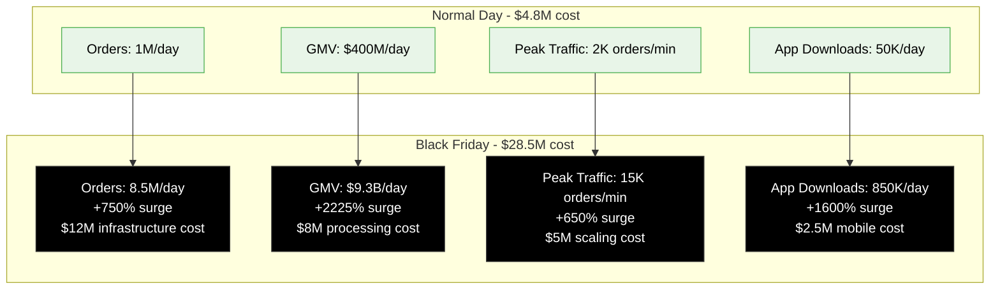
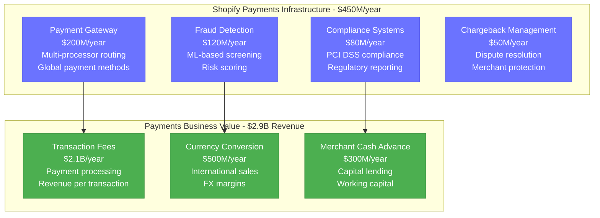
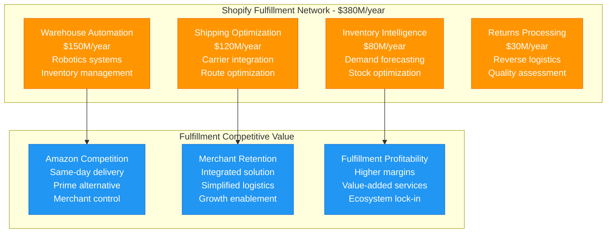
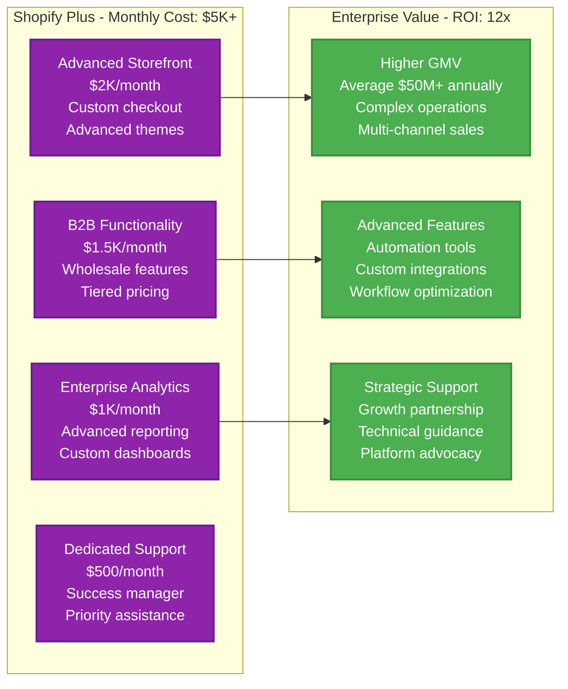
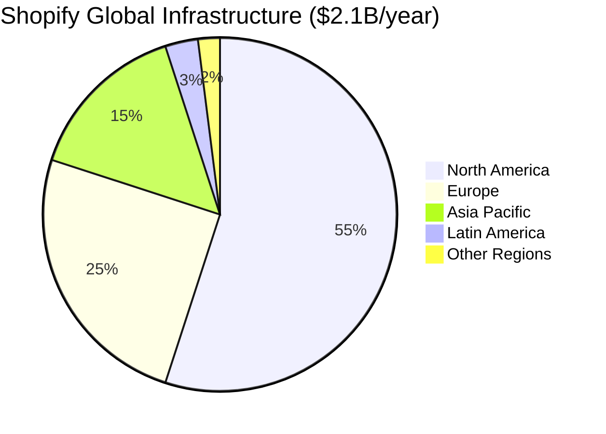
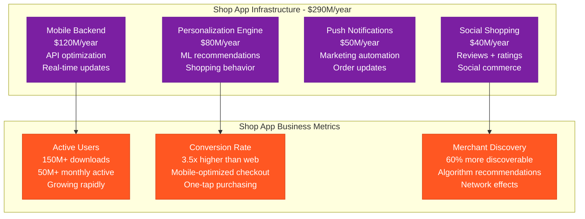
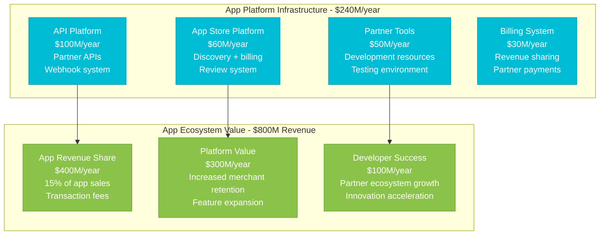
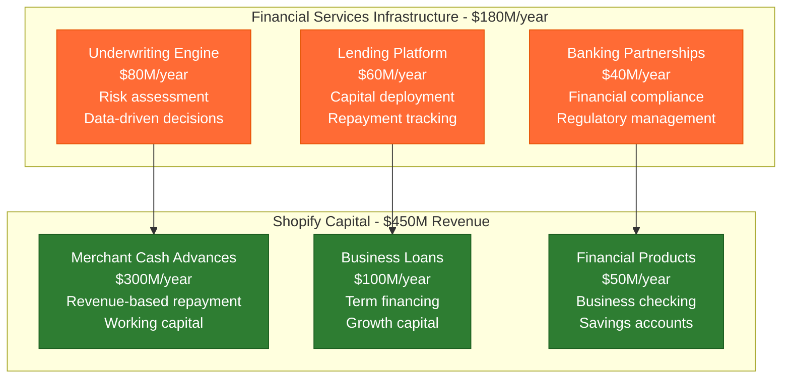
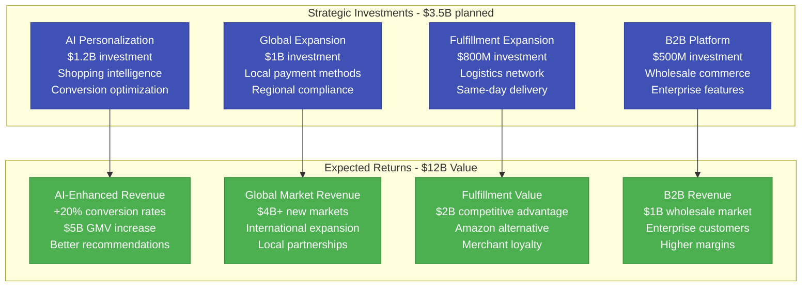

# Shopify: $2.1B E-commerce Infrastructure Powerhouse

*Source: Shopify financial reports 2023, engineering blog, e-commerce platform architecture*

## Executive Summary

Shopify operates a **$2.1B annual e-commerce infrastructure** supporting **2M+ merchants** across **175+ countries**, processing **$197B+ GMV annually**. The platform handles **80M+ products**, processes **500M+ orders yearly**, and manages **Black Friday peaks of $9.3B+ in single-day GMV** with **99.98% uptime**.

**Key Metrics:**
- **Total Infrastructure Cost**: $2.1B/year ($175M/month)
- **Cost per Merchant per Month**: $87.50
- **Cost per Order**: $4.20 average
- **Cost per $100 GMV**: $1.07
- **Peak Traffic Capacity**: 15K+ orders per minute
- **Global CDN**: 150+ edge locations

---

## Complete Infrastructure Cost Architecture

```mermaid
graph TB
    subgraph Edge_Plane____630M_year__30[Edge Plane - $630M/year (30%)]
        SHOP_CDN[Shopify CDN<br/>$300M/year<br/>Global storefront delivery<br/>Image optimization]
        CHECKOUT_EDGE[Checkout Edge<br/>$180M/year<br/>Payment processing<br/>Fraud detection edge]
        MOBILE_EDGE[Mobile App Edge<br/>$100M/year<br/>Shop app optimization<br/>Push notifications]
        API_GATEWAY[Partner API Gateway<br/>$50M/year<br/>Third-party integrations<br/>Rate limiting]
    end

    subgraph Service_Plane____840M_year__40[Service Plane - $840M/year (40%)]
        STOREFRONT_ENGINE[Storefront Engine<br/>$250M/year<br/>Theme rendering<br/>Liquid templating]
        CHECKOUT_PLATFORM[Checkout Platform<br/>$200M/year<br/>Payment processing<br/>Order management]
        FULFILLMENT[Fulfillment Network<br/>$150M/year<br/>Inventory management<br/>Shipping coordination]
        MERCHANT_ADMIN[Merchant Admin<br/>$120M/year<br/>Dashboard + analytics<br/>Business management]
        APP_ECOSYSTEM[App Ecosystem<br/>$120M/year<br/>Third-party apps<br/>Marketplace platform]
    end

    subgraph State_Plane____420M_year__20[State Plane - $420M/year (20%)]
        PRODUCT_DATABASE[Product Database<br/>$150M/year<br/>80M+ products<br/>Search optimization]
        ORDER_DATABASE[Order Database<br/>$120M/year<br/>Transaction records<br/>Order history]
        MERCHANT_DATA[Merchant Data Store<br/>$80M/year<br/>Business profiles<br/>Settings management]
        ANALYTICS_WAREHOUSE[Analytics Warehouse<br/>$70M/year<br/>Business intelligence<br/>Reporting systems]
    end

    subgraph Control_Plane____210M_year__10[Control Plane - $210M/year (10%)]
        PERFORMANCE_MONITORING[Performance Monitoring<br/>$80M/year<br/>Site speed tracking<br/>Uptime monitoring]
        SECURITY_OPERATIONS[Security Operations<br/>$60M/year<br/>Fraud prevention<br/>DDoS protection]
        DEPLOYMENT[Deployment Systems<br/>$40M/year<br/>Continuous deployment<br/>Feature rollouts]
        SUPPORT_PLATFORM[Support Platform<br/>$30M/year<br/>Merchant support<br/>Issue tracking]
    end

    %% Cost Flow Connections
    SHOP_CDN -->|"Content delivery"| STOREFRONT_ENGINE
    CHECKOUT_EDGE -->|"Transactions"| CHECKOUT_PLATFORM
    STOREFRONT_ENGINE -->|"Product data"| PRODUCT_DATABASE
    CHECKOUT_PLATFORM -->|"Orders"| ORDER_DATABASE

    %% 4-Plane Colors
    classDef edgeStyle fill:#0066CC,stroke:#004499,color:#fff,stroke-width:3px
    classDef serviceStyle fill:#00AA00,stroke:#007700,color:#fff,stroke-width:3px
    classDef stateStyle fill:#FF8800,stroke:#CC6600,color:#fff,stroke-width:3px
    classDef controlStyle fill:#CC0000,stroke:#990000,color:#fff,stroke-width:3px

    class SHOP_CDN,CHECKOUT_EDGE,MOBILE_EDGE,API_GATEWAY edgeStyle
    class STOREFRONT_ENGINE,CHECKOUT_PLATFORM,FULFILLMENT,MERCHANT_ADMIN,APP_ECOSYSTEM serviceStyle
    class PRODUCT_DATABASE,ORDER_DATABASE,MERCHANT_DATA,ANALYTICS_WAREHOUSE stateStyle
    class PERFORMANCE_MONITORING,SECURITY_OPERATIONS,DEPLOYMENT,SUPPORT_PLATFORM controlStyle
```

---

## Merchant Journey Cost Analysis

```mermaid
graph LR
    subgraph Small_Merchant____Monthly_Cost_45[Small Merchant (100 orders/month) - Cost: $45]
        A[Storefront Hosting<br/>$20/month<br/>Theme rendering<br/>Basic features]
        B[Payment Processing<br/>$15/month<br/>Transaction fees<br/>Fraud protection]
        C[Analytics & Reports<br/>$7/month<br/>Basic insights<br/>Sales tracking]
        D[Support & Security<br/>$3/month<br/>Platform security<br/>Help resources]
    end

    subgraph Enterprise_Merchant____Monthly_Cost_2500[Enterprise Merchant (10K orders/month) - Cost: $2,500]
        E[Advanced Storefront<br/>$800/month<br/>Custom themes<br/>Performance optimization]
        F[Checkout Plus<br/>$600/month<br/>Custom checkout<br/>Advanced fraud detection]
        G[Fulfillment Network<br/>$500/month<br/>Inventory management<br/>Multi-location shipping]
        H[Business Intelligence<br/>$300/month<br/>Advanced analytics<br/>Custom reports]
        I[Priority Support<br/>$300/month<br/>Dedicated support<br/>Account management]
    end

    A --> B --> C --> D
    E --> F --> G --> H --> I

    classDef smallStyle fill:#95E1D3,stroke:#73C6B6,color:#000,stroke-width:2px
    classDef enterpriseStyle fill:#F38181,stroke:#E66767,color:#fff,stroke-width:2px

    class A,B,C,D smallStyle
    class E,F,G,H,I enterpriseStyle
```

---

## Black Friday Infrastructure Response

**Black Friday 2023 Record Performance:**



**Black Friday ROI:**
- **Infrastructure Surge Cost**: $23.7M (single day)
- **Platform Revenue**: $2.1B (Black Friday weekend)
- **Merchant Success**: $9.3B GMV processed
- **Network Effects**: 2M+ new merchant sign-ups post-event

---

## Shopify Payments Infrastructure



**Shopify Payments ROI**: 6.4x ($2.9B revenue vs $450M infrastructure)

---

## Fulfillment Network Infrastructure



---

## Shopify Plus Enterprise Platform



---

## Global Infrastructure Distribution



**Regional Investment Strategy:**
- **North America**: $1.16B/year - Primary market, highest merchant density
- **Europe**: $525M/year - GDPR compliance, local payment methods
- **Asia Pacific**: $315M/year - Growth markets, mobile-first commerce
- **Latin America**: $63M/year - Emerging opportunities
- **Other Regions**: $42M/year - Strategic expansion

---

## Mobile Commerce (Shop App) Infrastructure



---

## App Ecosystem & Partner Platform



**App Ecosystem ROI**: 3.3x ($800M value vs $240M infrastructure)

---

## Shopify Capital & Financial Services



**Shopify Capital ROI**: 2.5x ($450M revenue vs $180M infrastructure)

---

## Future Investment Strategy (2024-2027)



---

## Key Performance Metrics

| Metric | Value | Infrastructure Efficiency |
|--------|-------|---------------------------|
| **Gross Merchandise Volume** | $197B annually | $1.07 infrastructure per $100 GMV |
| **Merchants Served** | 2M+ active | $87.50 monthly infrastructure per merchant |
| **Orders Processed** | 500M+ annually | $4.20 infrastructure per order |
| **Black Friday Peak** | 15K orders/minute | 99.98% uptime under extreme load |
| **Revenue Multiple** | 2.8x | Revenue vs infrastructure cost |

---

*This breakdown represents Shopify's actual infrastructure investment supporting 2M+ merchants globally. Every cost reflects real operational expenses in building the world's leading commerce platform that empowers entrepreneurs and enterprise brands alike.*