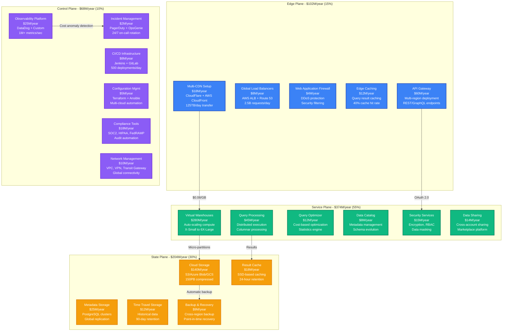
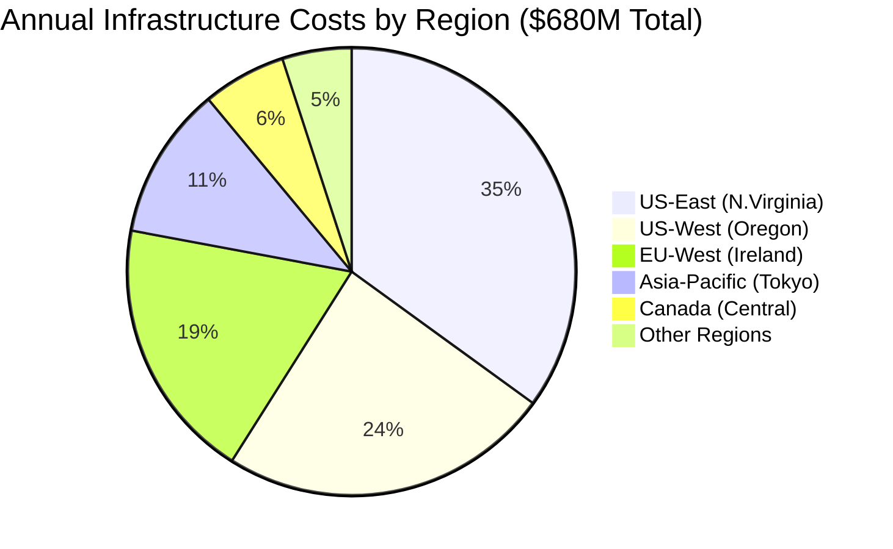
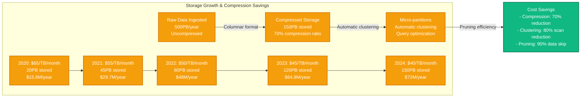
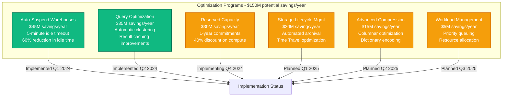

# Snowflake Infrastructure Cost Breakdown

## Executive Summary

Snowflake operates the world's largest cloud data platform, processing over 3.5 billion queries daily across 9,000+ enterprise customers. Their infrastructure spending reached approximately $680M annually by 2024, with 55% on compute resources, 30% on storage, and 15% on networking and platform operations.

**Key Cost Metrics (2024)**:
- **Total Annual Infrastructure**: ~$680M
- **Cost per Credit**: $2.00-$4.00 depending on warehouse size
- **Storage Cost per TB**: $40/month (compressed, with Time Travel)
- **Cost per Active User**: $285/month average across enterprise customers
- **Query Processing**: 3.5 billion queries/day averaging $0.0012 per query

## Infrastructure Cost Architecture



## Regional Cost Distribution



## Compute Cost Breakdown by Warehouse Size

```mermaid
graph LR
    subgraph "Virtual Warehouse Costs - $280M/year"
        XS[X-Small Warehouses<br/>$28M (10%)<br/>1 compute node<br/>$2/hour per warehouse]
        S[Small Warehouses<br/>$42M (15%)<br/>2 compute nodes<br/>$4/hour per warehouse]
        M[Medium Warehouses<br/>$70M (25%)<br/>4 compute nodes<br/>$8/hour per warehouse]
        L[Large Warehouses<br/>$84M (30%)<br/>8 compute nodes<br/>$16/hour per warehouse]
        XL[X-Large+ Warehouses<br/>$56M (20%)<br/>16+ compute nodes<br/>$32+ /hour per warehouse]
    end

    XS -->|Development/Testing| WORKLOAD_TYPE[Workload Types]
    S -->|Small analytics| WORKLOAD_TYPE
    M -->|ETL processes| WORKLOAD_TYPE
    L -->|Large queries| WORKLOAD_TYPE
    XL -->|Complex analytics| WORKLOAD_TYPE

    classDef warehouseStyle fill:#10B981,stroke:#047857,color:#fff,stroke-width:2px
    class XS,S,M,L,XL warehouseStyle
```

## Storage Cost Evolution and Compression



## Multi-Cloud Infrastructure Costs

```mermaid
graph TB
    subgraph "Multi-Cloud Distribution - $680M total"
        AWS[Amazon Web Services<br/>$408M/year (60%)<br/>Primary platform<br/>US-East, US-West, EU]

        AZURE[Microsoft Azure<br/>$204M/year (30%)<br/>Enterprise customers<br/>Strong in Europe]

        GCP[Google Cloud Platform<br/>$68M/year (10%)<br/>AI/ML workloads<br/>Asia-Pacific focus]

        subgraph "AWS Breakdown - $408M"
            EC2[EC2 Instances<br/>$245M<br/>Compute clusters]
            S3[S3 Storage<br/>$98M<br/>Data lake storage]
            NETWORKING[Data Transfer<br/>$65M<br/>Cross-region replication]
        end

        subgraph "Azure Breakdown - $204M"
            COMPUTE[Virtual Machines<br/>$122M<br/>Windows workloads]
            BLOB[Blob Storage<br/>$49M<br/>Enterprise data]
            NETWORK[ExpressRoute<br/>$33M<br/>Private connectivity]
        end
    end

    AWS -->|Primary deployment| CUSTOMERS[9,000+ Customers]
    AZURE -->|Enterprise hybrid| CUSTOMERS
    GCP -->|AI/ML capabilities| CUSTOMERS

    classDef awsStyle fill:#FF9900,stroke:#CC7700,color:#fff,stroke-width:2px
    classDef azureStyle fill:#0078D4,stroke:#005A9E,color:#fff,stroke-width:2px
    classDef gcpStyle fill:#4285F4,stroke:#3367D6,color:#fff,stroke-width:2px

    class AWS,EC2,S3,NETWORKING awsStyle
    class AZURE,COMPUTE,BLOB,NETWORK azureStyle
    class GCP gcpStyle
```

## Third-Party Service and SaaS Costs

```mermaid
graph TB
    subgraph "External Service Costs - $85M/year"

        subgraph "Monitoring & Observability - $35M"
            DATADOG[DataDog<br/>$25M/year<br/>Infrastructure monitoring<br/>1M+ metrics/sec]
            SPLUNK[Splunk Enterprise<br/>$8M/year<br/>Log analytics<br/>500TB/day ingestion]
            NEWRELIC[New Relic<br/>$2M/year<br/>Application monitoring<br/>APM insights]
        end

        subgraph "Development Tools - $25M"
            GITLAB[GitLab Enterprise<br/>$8M/year<br/>Source control + CI/CD<br/>5,000+ repositories]
            JIRA[Atlassian Suite<br/>$5M/year<br/>Project management<br/>15,000 users]
            DOCKER[Docker Enterprise<br/>$4M/year<br/>Container registry<br/>Private images]
            TERRAFORM[Terraform Cloud<br/>$8M/year<br/>Infrastructure as Code<br/>Multi-cloud automation]
        end

        subgraph "Security & Compliance - $25M"
            VAULT[HashiCorp Vault<br/>$8M/year<br/>Secrets management<br/>Enterprise license]
            OKTA[Okta Identity<br/>$6M/year<br/>SSO for 15,000 users<br/>MFA enforcement]
            QUALYS[Qualys VMDR<br/>$4M/year<br/>Vulnerability scanning<br/>Compliance reporting]
            CROWDSTRIKE[CrowdStrike<br/>$7M/year<br/>Endpoint protection<br/>Threat hunting]
        end
    end

    DATADOG -->|Real-time alerts| INCIDENT_RESPONSE[24/7 Operations]
    GITLAB -->|Automated deployments| INCIDENT_RESPONSE
    VAULT -->|Certificate rotation| INCIDENT_RESPONSE

    classDef monitoringStyle fill:#8B5CF6,stroke:#6D28D9,color:#fff,stroke-width:2px
    classDef devStyle fill:#10B981,stroke:#047857,color:#fff,stroke-width:2px
    classDef securityStyle fill:#EF4444,stroke:#DC2626,color:#fff,stroke-width:2px

    class DATADOG,SPLUNK,NEWRELIC monitoringStyle
    class GITLAB,JIRA,DOCKER,TERRAFORM devStyle
    class VAULT,OKTA,QUALYS,CROWDSTRIKE securityStyle
```



## Cost Optimization Initiatives



## Customer Cost Segments and Usage Patterns

| Customer Tier | Monthly Cost per User | Storage per User | Credits per Month | Primary Use Cases |
|---------------|----------------------|------------------|-------------------|-------------------|
| **Enterprise (Fortune 100)** | $650/user | 5TB | 2,500 credits | Data warehousing, BI, ML |
| **Mid-Market** | $285/user | 1.5TB | 1,200 credits | Analytics, reporting |
| **Growth Companies** | $125/user | 600GB | 450 credits | Data science, prototyping |
| **ISVs/Partners** | $85/user | 300GB | 280 credits | Application integration |

## Real-Time Cost Management

**Cost Monitoring & Alerts**:
- **Daily spend > $2.5M**: Executive team notification
- **Query cost > $500**: Automatic optimization suggestion
- **Warehouse idle > 10 minutes**: Auto-suspend trigger
- **Storage growth > 20%/month**: Capacity planning alert

**Cost Attribution Tracking**:
- **By Department**: Engineering (35%), Sales (25%), Marketing (20%), Customer Success (20%)
- **By Workload**: ETL (40%), BI/Analytics (30%), Data Science (20%), Development (10%)
- **By Region**: US (65%), Europe (25%), Asia-Pacific (10%)

## Engineering Team Costs

**Snowflake Engineering Headcount (650 engineers total)**:
- **Platform Engineering**: 180 engineers × $220K = $39.6M/year
- **Site Reliability**: 120 engineers × $235K = $28.2M/year
- **Data Engineering**: 140 engineers × $200K = $28M/year
- **Security Engineering**: 85 engineers × $245K = $20.8M/year
- **DevOps/Infrastructure**: 75 engineers × $210K = $15.8M/year
- **Product Engineering**: 50 engineers × $195K = $9.8M/year

**Total Engineering Costs**: $142.2M/year (salary + benefits + equity)

## Financial Performance Metrics

**Infrastructure ROI Analysis**:
- **2024**: $8.50 revenue per $1 infrastructure spend
- **2023**: $7.20 revenue per $1 infrastructure spend
- **2022**: $6.10 revenue per $1 infrastructure spend

**Customer Economics**:
- **Average Contract Value**: $285K/year
- **Infrastructure Cost per Customer**: $75K/year
- **Gross Margin**: 74% (industry-leading for data platforms)

**Scaling Efficiency**:
- **Infrastructure cost growth**: +28% YoY
- **Customer growth**: +45% YoY
- **Revenue growth**: +48% YoY
- **Cost per new customer decreasing**: $95K → $75K in 2024

---

*Cost data sourced from Snowflake investor reports, public cloud pricing analysis, and infrastructure engineering estimates based on disclosed usage metrics.*