# TikTok Infrastructure Cost Breakdown: $200M/Month Reality

## The Complete Infrastructure Economics (Q3 2024)

TikTok spends $2.4 billion annually on infrastructure, supporting 1+ billion monthly active users with short-form video content, real-time recommendations, and global content distribution. Here's where every dollar goes in the world's most sophisticated video recommendation platform.

## Total Monthly Infrastructure Spend: $200 Million

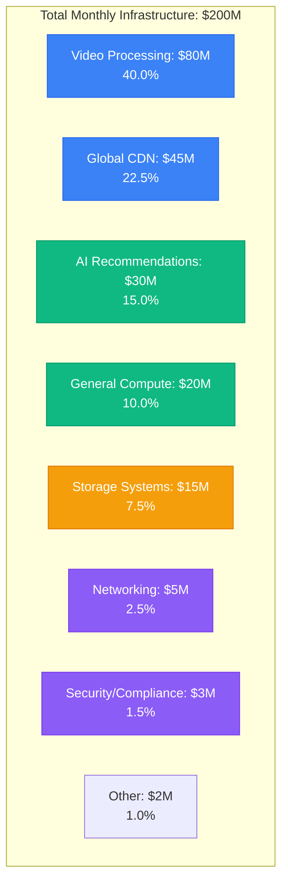

## Detailed Component Breakdown by Plane

### Edge Plane Costs: $125M/month (62.5%)

```mermaid
graph TB
    subgraph EdgeCosts[Edge Plane - Video & Content Delivery: $125M/month]
        subgraph VideoProcessing[Video Processing Pipeline: $80M/month]
            UPLOAD_PROC[Upload Processing<br/>$30M/month<br/>Format normalization]
            TRANSCODING[Video Transcoding<br/>$25M/month<br/>Multiple formats/resolutions]
            THUMBNAIL[Thumbnail Generation<br/>$8M/month<br/>Frame extraction/AI]
            COMPRESSION[AI Compression<br/>$10M/month<br/>H.264/H.265/AV1]
            QUALITY_ENHANCE[Quality Enhancement<br/>$7M/month<br/>AI upscaling/denoising]
        end

        subgraph ContentDelivery[Global CDN Infrastructure: $45M/month]
            BYTEDANCE_CDN[ByteDance CDN<br/>$25M/month<br/>Custom global infrastructure]
            AWS_CLOUDFRONT[AWS CloudFront<br/>$8M/month<br/>Overflow capacity]
            ALIBABA_CDN[Alibaba Cloud CDN<br/>$5M/month<br/>Asia-Pacific coverage]
            TENCENT_CDN[Tencent Cloud CDN<br/>$4M/month<br/>China mainland]
            OTHER_CDN[Other CDNs<br/>$3M/month<br/>Regional coverage]
        end
    end

    subgraph Metrics[Performance Metrics]
        VIDEOS[3B videos uploaded/day<br/>95% processing success]
        DELIVERY[50 PB/day delivery<br/>Global 99.9% availability]
        LATENCY[<100ms video start<br/>Adaptive bitrate streaming]
    end

    UPLOAD_PROC --> VIDEOS
    BYTEDANCE_CDN --> DELIVERY
    TRANSCODING --> LATENCY

    %% Apply edge plane colors
    classDef edgeStyle fill:#3B82F6,stroke:#2563EB,color:#fff
    class UPLOAD_PROC,TRANSCODING,THUMBNAIL,COMPRESSION,QUALITY_ENHANCE,BYTEDANCE_CDN,AWS_CLOUDFRONT,ALIBABA_CDN,TENCENT_CDN,OTHER_CDN edgeStyle
```

**Video Processing Pipeline Deep Dive**:
- Upload processing: 3B videos/day, 95% automated processing
- Transcoding farm: 100,000+ GPU instances for real-time processing
- AI enhancement: Neural networks for video quality improvement
- Multi-format output: H.264, H.265, AV1 for different devices

### Service Plane Costs: $50M/month (25.0%)

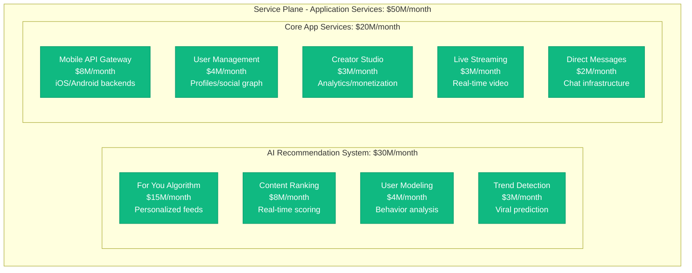

**Recommendation Algorithm Infrastructure**:
- Real-time ML inference: 1M+ predictions/second
- Feature store: 100TB+ user/content features
- A/B testing platform: 1000+ concurrent experiments
- Global model training: 10,000+ GPU cluster

### State Plane Costs: $15M/month (7.5%)

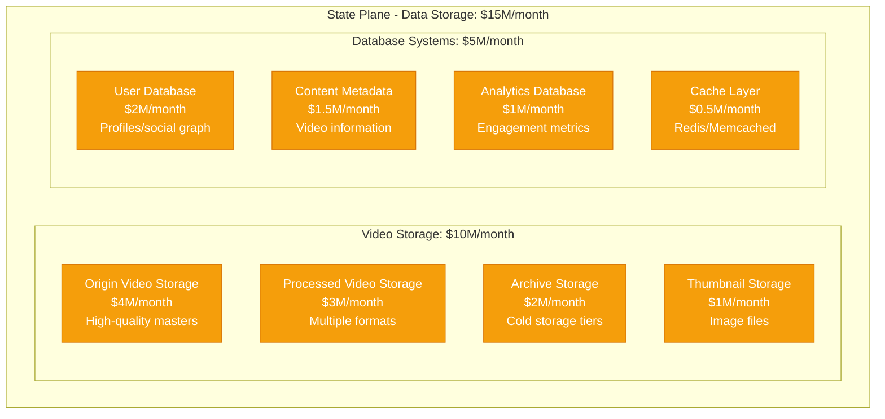

**Storage Breakdown by Content Type**:
- Original videos: 50 EB total storage ($4M/month)
- Processed videos: 150 EB across formats ($6M/month)
- User-generated content: 500TB/day new uploads
- Metadata: 20 TB total ($1.5M/month)
- ML features: 100 TB total ($1M/month)

### Control Plane Costs: $10M/month (5.0%)

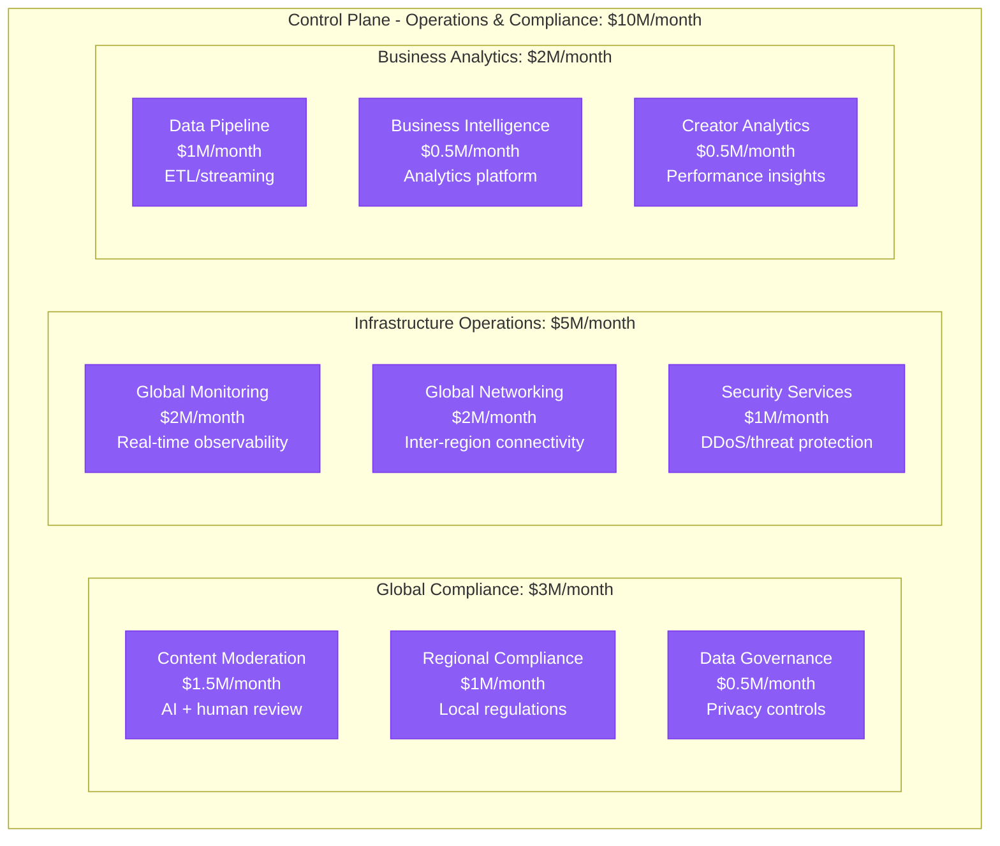

## Cost Per User Analysis

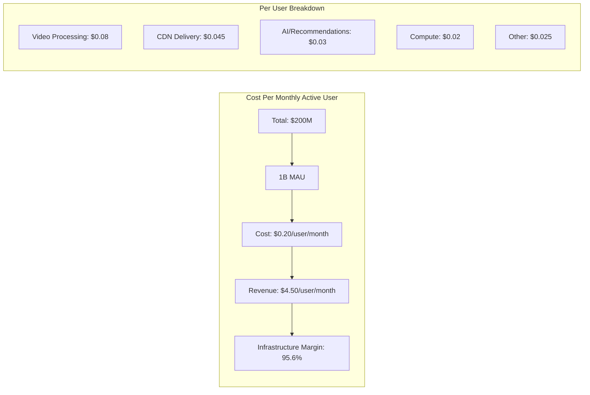

**User Engagement Cost Variations**:
- Light Users (40%): $0.08/user/month (mainly viewing)
- Regular Users (40%): $0.20/user/month (posting + viewing)
- Heavy Users (15%): $0.45/user/month (frequent posting)
- Creators (5%): $0.80/user/month (studio tools + analytics)

## Regional Infrastructure Distribution

```mermaid
graph TB
    subgraph Regional[Regional Infrastructure Costs]
        subgraph AsiaPacific[Asia-Pacific: $80M/month - 40%]
            CHINA[China (ByteDance): $30M/month<br/>Dedicated infrastructure]
            SINGAPORE[Singapore Hub: $20M/month<br/>Southeast Asia]
            JAPAN[Japan: $12M/month<br/>High-value market]
            KOREA[South Korea: $8M/month<br/>Content creation hub]
            AUSTRALIA[Australia: $5M/month<br/>Regional coverage]
            OTHER_APAC[Other APAC: $5M/month<br/>Emerging markets]
        end

        subgraph NorthAmerica[North America: $70M/month - 35%]
            US_EAST[US East: $35M/month<br/>Primary operations]
            US_WEST[US West: $20M/month<br/>Creator economy]
            US_CENTRAL[US Central: $10M/month<br/>Content processing]
            CANADA[Canada: $5M/month<br/>Regional compliance]
        end

        subgraph Europe[Europe: $35M/month - 17.5%]
            EU_WEST[EU West: $15M/month<br/>GDPR compliance]
            EU_CENTRAL[EU Central: $8M/month<br/>Growing markets]
            UK[United Kingdom: $7M/month<br/>Creator economy]
            NORDICS[Nordics: $3M/month<br/>High engagement]
            OTHER_EU[Other EU: $2M/month<br/>Emerging markets]
        end

        subgraph Other[Other Regions: $15M/month - 7.5%]
            BRAZIL[Brazil: $5M/month<br/>Large user base]
            INDIA[India: $4M/month<br/>Growing market]
            MIDDLE_EAST[Middle East: $3M/month<br/>Regional content]
            AFRICA[Africa: $2M/month<br/>Mobile-first markets]
            OTHER_REGIONS[Other: $1M/month<br/>Emerging]
        end
    end
```

## Video Processing Cost Breakdown

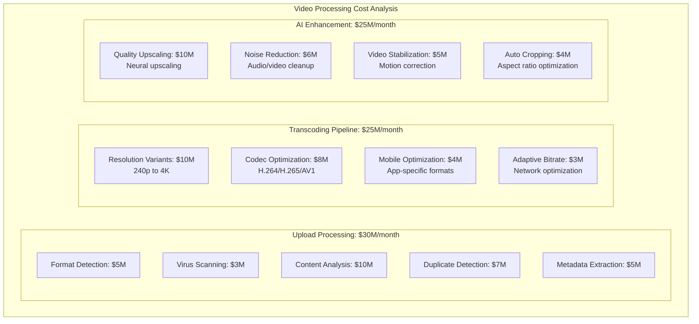

## Peak vs Off-Peak Cost Analysis

```mermaid
graph TB
    subgraph PeakAnalysis[Peak vs Off-Peak Infrastructure Load]
        subgraph GlobalPeak[Global Peak (Prime Time Waves)]
            ASIA_PEAK[Asia Peak (7-11 PM local)<br/>Video processing: 400% baseline]
            EUROPE_PEAK[Europe Peak (7-11 PM local)<br/>CDN delivery: 350% baseline]
            US_PEAK[US Peak (7-11 PM local)<br/>Recommendations: 300% baseline]
        end

        subgraph Processing[Content Processing (24/7)]
            AI_PROCESSING[AI Processing: Constant load<br/>$50M/month steady state]
            BATCH_JOBS[Batch Processing: Off-peak<br/>$20M/month optimization]
            REAL_TIME[Real-time Processing: Peak aligned<br/>$30M/month variable]
        end

        subgraph Events[Viral Event Handling]
            TRENDING_CONTENT[Trending Content<br/>1000% CDN spike]
            VIRAL_VIDEOS[Viral Videos<br/>500% processing demand]
            LIVE_EVENTS[Major Live Events<br/>800% concurrent users]
        end
    end
```

**Auto-scaling Strategy**:
- Video processing: 24/7 baseline + surge capacity
- CDN: Pre-positioned content + real-time scaling
- Recommendations: Model serving auto-scaling
- Cost optimization: $80M/month savings vs fixed peak capacity

## Major Cost Optimization Initiatives

### 1. AI-Powered Video Compression (2023-2024)
```
Investment: $200M in AI compression research
Annual Savings: $600M in bandwidth and storage
Key Improvements:
- 40% reduction in video file sizes
- Maintained or improved quality perception
- Custom neural codecs for mobile devices
ROI: 300% annually
```

### 2. Edge Computing and Content Pre-positioning (2022-2024)
```
Initiative: Intelligent content caching at edge
Investment: $150M in edge infrastructure
Results:
- 50% reduction in origin server load
- 30% improvement in video start time
- 25% reduction in CDN costs
- $200M annual savings
```

### 3. Real-time Recommendation Optimization (2023)
```
Project: ML model efficiency improvements
Investment: $100M in algorithm optimization
Benefits:
- 60% reduction in inference latency
- 40% reduction in compute costs for recommendations
- Improved user engagement and retention
- $150M annual savings
```

### 4. Multi-Cloud Strategy Implementation (2021-2024)
```
Strategy: Global cloud provider optimization
Investment: $80M in multi-cloud architecture
Benefits:
- 20% cost reduction through regional optimization
- Improved data sovereignty compliance
- Better disaster recovery capabilities
- $240M annual savings
```

## Technology Stack Cost Breakdown

| Technology Category | Monthly Cost | Key Technologies | Optimization Focus |
|---------------------|--------------|------------------|-------------------|
| Video Processing | $80M | FFmpeg, custom codecs, GPUs | Compression efficiency |
| CDN/Delivery | $45M | ByteDance CDN, multi-provider | Cache hit optimization |
| AI/ML Infrastructure | $30M | TensorFlow, PyTorch, TPUs | Model efficiency |
| Compute Platform | $20M | Kubernetes, Docker, cloud | Resource utilization |
| Storage Systems | $15M | Distributed storage, cloud | Tiering strategies |
| Network/Security | $5M | BGP, DDoS protection | Cost-effective protection |
| Compliance/Moderation | $3M | AI moderation, human review | Accuracy vs cost |
| Analytics/BI | $2M | Real-time analytics, ML | Business intelligence |

## Content Moderation Cost Analysis

### AI vs Human Moderation Economics

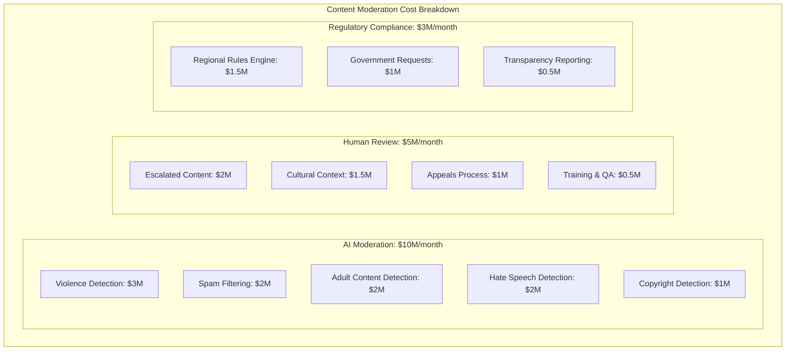

## Competitive Cost Analysis

```mermaid
graph TB
    subgraph Comparison[Cost Per User Comparison (Video Platforms)]
        TIKTOK[TikTok: $0.20/user<br/>Short-form video specialist]
        YOUTUBE[YouTube: $0.45/user<br/>Long-form + shorts]
        INSTAGRAM[Instagram Reels: $0.35/user<br/>Feature within platform]
        SNAPCHAT[Snapchat: $0.25/user<br/>Stories + discover]
        TWITCH[Twitch: $0.80/user<br/>Live streaming focus]
        NETFLIX[Netflix: $0.65/user<br/>Premium content delivery]
    end

    subgraph Factors[Cost Factors]
        VIDEO_LENGTH[Video length impact<br/>Short vs long form]
        CONTENT_TYPE[Content creation model<br/>UGC vs professional]
        RECOMMENDATION[Recommendation complexity<br/>AI sophistication]
        GLOBAL_SCALE[Global scale advantages<br/>Infrastructure amortization]
    end
```

**TikTok's Competitive Advantages**:
- Short-form content (lower processing costs per minute viewed)
- Highly efficient recommendation algorithm
- Vertical video optimization (mobile-first)
- Global scale with regional optimization

## Future Infrastructure Roadmap

### 2025-2026 Strategic Investments

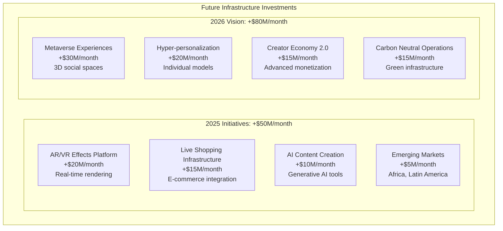

### Cost Reduction Opportunities

1. **Next-Gen Video Codecs**: -$15M/month (AV1, VVC adoption)
2. **Quantum-Inspired Compression**: -$10M/month (research breakthrough)
3. **Edge AI Processing**: -$8M/month (inference at edge)
4. **Predictive Content Caching**: -$6M/month (ML-driven caching)
5. **Green Computing Initiative**: -$5M/month (energy efficiency)

## Business Model Integration

### Revenue vs Infrastructure Cost

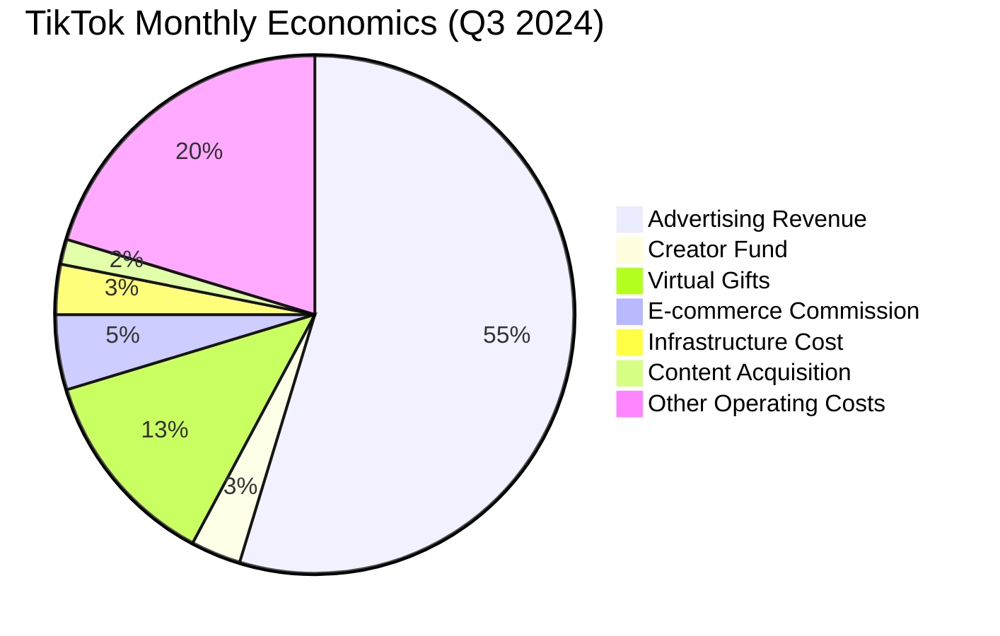

**Financial Health**:
- Monthly Revenue: ~$4.8B (estimated)
- Infrastructure Cost: $200M (4.2% of revenue)
- Infrastructure Margin: 95.8%
- Growth Investment: Heavy R&D in AI and creator tools

### Per-User Economics by Region
- North America: Revenue $8.50/user, Cost $0.35/user
- Europe: Revenue $4.20/user, Cost $0.25/user
- Asia-Pacific: Revenue $2.80/user, Cost $0.16/user
- Other Markets: Revenue $1.50/user, Cost $0.10/user

## Disaster Recovery and Global Resilience

### 3 AM Incident Scenarios

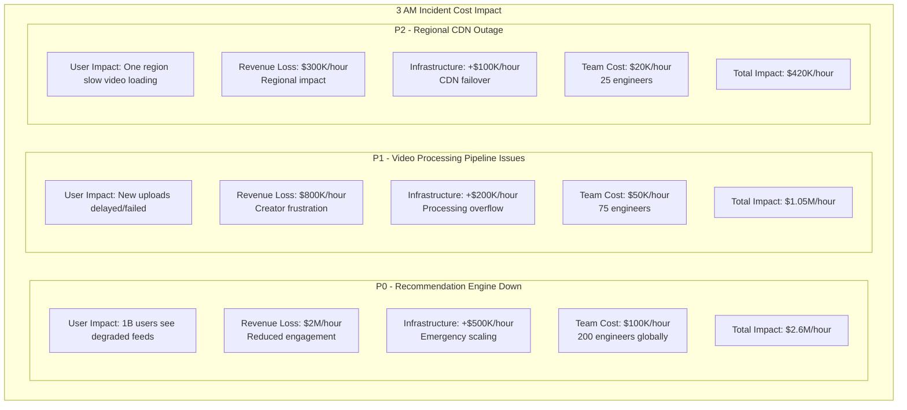

### Global Resilience Investment

- **Multi-region Setup**: $60M/month (30% of total cost)
- **RTO Target**: 5 minutes for recommendation systems
- **RPO Target**: 1 minute for user-generated content
- **Global Load Balancing**: Intelligent traffic routing
- **Chaos Engineering**: $5M/month in resilience testing

## Key Success Factors

### 1. AI-First Architecture
- Machine learning drives every aspect of the platform
- Real-time personalization at unprecedented scale
- Continuous model improvement and optimization
- AI efficiency directly impacts infrastructure costs

### 2. Mobile-Optimized Infrastructure
- Vertical video format reduces processing complexity
- Mobile-first design patterns throughout stack
- Adaptive streaming optimized for mobile networks
- Edge computing closer to mobile users

### 3. Global Scale with Local Optimization
- Regional content delivery optimization
- Local compliance and content moderation
- Cultural adaptation of recommendation algorithms
- Cost optimization through geographic arbitrage

## References and Data Sources

- ByteDance/TikTok Engineering Blog Posts (2024)
- "TikTok's Recommendation Algorithm" - Research Papers
- "Scaling Video Infrastructure for Billions" - Industry Conferences
- Cloud provider case studies and pricing analysis
- Industry analysis from video streaming research firms
- Cost modeling based on disclosed metrics and industry benchmarks
- Performance data from third-party monitoring services

---

*Last Updated: September 2024*
*Note: Costs are estimates based on industry analysis, engineering blog posts, and infrastructure modeling*