# Twitter/X: Infrastructure Cost Transformation

*Source: Twitter SEC filings 2021-2022, Elon Musk statements, X engineering blog posts*

## Executive Summary

Twitter/X underwent a dramatic infrastructure transformation from **$5.1B/year pre-acquisition** to **$1.5B/year post-acquisition** operational costs. The platform serves **550M+ monthly active users** with **500M+ daily tweets**, achieving **90% cost reduction** while maintaining **99.9% uptime** through aggressive optimization.

**Key Metrics:**
- **Pre-Acquisition Cost**: $5.1B/year ($425M/month)
- **Post-Acquisition Cost**: $1.5B/year ($125M/month)
- **Cost per User**: Reduced from $10.2/year to $2.73/year
- **Cost per Tweet**: Reduced from $0.028 to $0.008
- **Infrastructure Headcount**: Reduced from 7,500 to 1,500 engineers
- **Data Center Footprint**: Reduced by 60%

---

## Infrastructure Cost Transformation

```mermaid
graph TB
    subgraph Pre_Acquisition_2022____5_1B_year[Pre-Acquisition 2022 - $5.1B/year]
        subgraph Edge_Old[Edge Plane - $1.8B/year (35%)]
            OLD_CDN[Multi-CDN Strategy<br/>$800M/year<br/>Fastly + CloudFlare<br/>High redundancy]
            OLD_LB[Load Balancers<br/>$400M/year<br/>Over-provisioned<br/>Multiple vendors]
            OLD_CACHE[Caching Layer<br/>$600M/year<br/>Redis clusters<br/>High replication]
        end

        subgraph Service_Old[Service Plane - $2.3B/year (45%)]
            OLD_COMPUTE[Compute Fleet<br/>$1.5B/year<br/>AWS + GCP + On-prem<br/>Over-provisioned]
            OLD_API[API Services<br/>$500M/year<br/>Ruby on Rails<br/>Monolithic architecture]
            OLD_ML[ML Infrastructure<br/>$300M/year<br/>Recommendation algorithms<br/>Complex pipelines]
        end

        subgraph State_Old[State Plane - $0.8B/year (16%)]
            OLD_DB[Database Clusters<br/>$400M/year<br/>MySQL + Manhattan<br/>High replication]
            OLD_SEARCH[Search Infrastructure<br/>$250M/year<br/>Elasticsearch clusters<br/>Real-time indexing]
            OLD_STORAGE[Media Storage<br/>$150M/year<br/>Photo/video storage<br/>Multiple tiers]
        end

        subgraph Control_Old[Control Plane - $0.2B/year (4%)]
            OLD_MONITORING[Monitoring Stack<br/>$120M/year<br/>Multiple tools<br/>Complex dashboards]
            OLD_DEPLOY[Deployment<br/>$80M/year<br/>Complex CI/CD<br/>Multiple environments]
        end
    end

    subgraph Post_Acquisition_2024____1_5B_year[Post-Acquisition 2024 - $1.5B/year]
        subgraph Edge_New[Edge Plane - $450M/year (30%)]
            NEW_CDN[Single CDN<br/>$200M/year<br/>CloudFlare only<br/>Simplified setup]
            NEW_LB[Right-sized LBs<br/>$100M/year<br/>AWS ALB only<br/>Auto-scaling]
            NEW_CACHE[Optimized Cache<br/>$150M/year<br/>Redis minimal<br/>Single replica]
        end

        subgraph Service_New[Service Plane - $750M/year (50%)]
            NEW_COMPUTE[Optimized Compute<br/>$400M/year<br/>AWS only<br/>Spot instances]
            NEW_API[Streamlined APIs<br/>$200M/year<br/>Simplified endpoints<br/>Performance focus]
            NEW_ML[Essential ML<br/>$150M/year<br/>Core algorithms only<br/>Simplified stack]
        end

        subgraph State_New[State Plane - $225M/year (15%)]
            NEW_DB[Simplified DBs<br/>$120M/year<br/>MySQL only<br/>Reduced replicas]
            NEW_SEARCH[Basic Search<br/>$75M/year<br/>Essential indexing<br/>Simplified queries]
            NEW_STORAGE[Efficient Storage<br/>$30M/year<br/>S3 tiering<br/>Aggressive compression]
        end

        subgraph Control_New[Control Plane - $75M/year (5%)]
            NEW_MONITORING[Essential Monitoring<br/>$45M/year<br/>CloudWatch only<br/>Core metrics]
            NEW_DEPLOY[Simple Deploy<br/>$30M/year<br/>Basic CI/CD<br/>Single environment]
        end
    end

    %% Transformation arrows
    OLD_CDN -.->|"-75%"| NEW_CDN
    OLD_COMPUTE -.->|"-73%"| NEW_COMPUTE
    OLD_DB -.->|"-70%"| NEW_DB
    OLD_MONITORING -.->|"-63%"| NEW_MONITORING

    classDef oldStyle fill:#FF6B6B,stroke:#FF5252,color:#fff,stroke-width:2px
    classDef newStyle fill:#4ECDC4,stroke:#26A69A,color:#fff,stroke-width:2px
    classDef arrowStyle stroke:#FFD700,stroke-width:3px

    class OLD_CDN,OLD_LB,OLD_CACHE,OLD_COMPUTE,OLD_API,OLD_ML,OLD_DB,OLD_SEARCH,OLD_STORAGE,OLD_MONITORING,OLD_DEPLOY oldStyle
    class NEW_CDN,NEW_LB,NEW_CACHE,NEW_COMPUTE,NEW_API,NEW_ML,NEW_DB,NEW_SEARCH,NEW_STORAGE,NEW_MONITORING,NEW_DEPLOY newStyle
```

---

## Cost Reduction by Category


---

## Performance Impact Analysis


---

## Headcount vs Infrastructure Efficiency

```mermaid
graph TB
    subgraph Headcount_Reduction[Headcount Reduction Impact]
        subgraph Pre_Acquisition[Pre-Acquisition (7,500 engineers)]
            OLD_RATIO[Engineer per $1M Infrastructure<br/>1.47 engineers<br/>High management overhead]
            OLD_PRODUCTIVITY[Infrastructure per Engineer<br/>$680K managed<br/>Complex systems]
            OLD_COMPLEXITY[System Complexity<br/>High<br/>Multiple vendors/tools]
        end

        subgraph Post_Acquisition[Post-Acquisition (1,500 engineers)]
            NEW_RATIO[Engineer per $1M Infrastructure<br/>1.0 engineer<br/>Lean operations]
            NEW_PRODUCTIVITY[Infrastructure per Engineer<br/>$1M managed<br/>Simplified systems]
            NEW_COMPLEXITY[System Complexity<br/>Medium<br/>Consolidated vendors]
        end
    end

    subgraph Automation_Investment[Automation Investment - $200M]
        AUTO1[Infrastructure Automation<br/>$100M investment<br/>Terraform + Ansible<br/>80% automated deployment]
        AUTO2[Monitoring Automation<br/>$50M investment<br/>Self-healing systems<br/>60% issue auto-resolution]
        AUTO3[Scaling Automation<br/>$50M investment<br/>Predictive scaling<br/>40% cost optimization]
    end

    OLD_RATIO --> NEW_RATIO
    OLD_PRODUCTIVITY --> NEW_PRODUCTIVITY
    AUTO1 --> NEW_PRODUCTIVITY
    AUTO2 --> NEW_COMPLEXITY
    AUTO3 --> NEW_RATIO

    classDef oldHeadcountStyle fill:#FF8A80,stroke:#F44336,color:#000
    classDef newHeadcountStyle fill:#A5D6A7,stroke:#4CAF50,color:#000
    classDef automationStyle fill:#90CAF9,stroke:#2196F3,color:#000

    class OLD_RATIO,OLD_PRODUCTIVITY,OLD_COMPLEXITY oldHeadcountStyle
    class NEW_RATIO,NEW_PRODUCTIVITY,NEW_COMPLEXITY newHeadcountStyle
    class AUTO1,AUTO2,AUTO3 automationStyle
```

---

## Revenue vs Cost Optimization

| Metric | Pre-Acquisition 2022 | Post-Acquisition 2024 | Change |
|--------|----------------------|------------------------|--------|
| **Monthly Active Users** | 450M | 550M | +22% |
| **Daily Tweets** | 500M | 500M | 0% |
| **Revenue per User/Year** | $6.20 | $4.50 | -27% |
| **Infrastructure Cost/User/Year** | $10.20 | $2.73 | -73% |
| **Operating Margin** | -15% | +35% | +50pp |
| **Cash Burn Rate** | $5B/year | Break-even | +$5B improvement |

---

## Crisis Response: 2024 Election Traffic

**November 2024 Election Day Infrastructure:**


**Election Day Efficiency:**
- **Infrastructure Surge Cost**: $8.4M (single day)
- **Revenue from Increased Engagement**: $45M (premium ads)
- **Cost Efficiency**: 90% better than previous election cycles
- **Uptime Achievement**: 99.95% during peak traffic

---

## Vendor Consolidation Strategy


**Major Vendor Decisions:**
- **Cloud Strategy**: 100% AWS (eliminated GCP, on-premise)
- **CDN**: 100% CloudFlare (eliminated Fastly, others)
- **Monitoring**: CloudWatch + minimal third-party
- **Database**: MySQL consolidation (eliminated Manhattan, Cassandra)
- **Search**: Simplified Elasticsearch (reduced complexity)

**Annual Savings from Consolidation**: $1.2B

---

## Feature vs Infrastructure Trade-offs

```mermaid
graph TB
    subgraph Features_Eliminated____200M_savings[Features Eliminated - $200M savings]
        SPACES[Twitter Spaces<br/>$50M/year saved<br/>Audio infrastructure<br/>Low engagement]
        FLEETS[Fleets (Deprecated)<br/>$30M/year saved<br/>Story-like content<br/>Poor adoption]
        ADVANCED_SEARCH[Advanced Search<br/>$40M/year saved<br/>Complex algorithms<br/>Limited usage]
        MULTIPLE_TIMELINES[Multiple Timelines<br/>$80M/year saved<br/>Complex ML models<br/>User confusion]
    end

    subgraph Features_Retained____Core_Focus[Features Retained - Core Focus]
        TWEETS[Core Tweeting<br/>Essential function<br/>Optimized performance]
        REPLIES[Replies & Threads<br/>High engagement<br/>Simplified rendering]
        BASIC_SEARCH[Basic Search<br/>Essential function<br/>Simplified algorithms]
        NOTIFICATIONS[Notifications<br/>User retention<br/>Optimized delivery]
    end

    classDef eliminatedStyle fill:#FFCDD2,stroke:#F44336,color:#000
    classDef retainedStyle fill:#C8E6C9,stroke:#4CAF50,color:#000

    class SPACES,FLEETS,ADVANCED_SEARCH,MULTIPLE_TIMELINES eliminatedStyle
    class TWEETS,REPLIES,BASIC_SEARCH,NOTIFICATIONS retainedStyle
```

---

## X Premium Revenue vs Infrastructure

```mermaid
graph TB
    subgraph X_Premium_Economics[X Premium Economics]
        subgraph Premium_Revenue[Premium Revenue - $180M/year]
            SUBSCRIPTIONS[Subscriptions<br/>$120M/year<br/>$8/month × 1.25M users<br/>Growing user base]
            VERIFICATION[Verification<br/>$60M/year<br/>Blue check monetization<br/>Identity services]
        end

        subgraph Premium_Costs[Premium Costs - $45M/year]
            INFRASTRUCTURE[Additional Infrastructure<br/>$30M/year<br/>Enhanced features<br/>Higher limits]
            SUPPORT[Premium Support<br/>$15M/year<br/>Dedicated teams<br/>Faster response]
        end
    end

    subgraph Premium_ROI[Premium ROI Analysis]
        NET_PROFIT[Net Profit: $135M/year<br/>75% margin<br/>Highly profitable segment]
        GROWTH_POTENTIAL[Growth Potential<br/>Target: 10M users by 2025<br/>$960M revenue potential]
    end

    SUBSCRIPTIONS --> NET_PROFIT
    VERIFICATION --> GROWTH_POTENTIAL

    classDef revenueStyle fill:#4CAF50,stroke:#388E3C,color:#fff
    classDef costStyle fill:#FF9800,stroke:#F57C00,color:#fff
    classDef roiStyle fill:#2196F3,stroke:#1976D2,color:#fff

    class SUBSCRIPTIONS,VERIFICATION revenueStyle
    class INFRASTRUCTURE,SUPPORT costStyle
    class NET_PROFIT,GROWTH_POTENTIAL roiStyle
```



---

## Future Optimization Roadmap


---

## Lessons Learned: Infrastructure Efficiency

### Key Success Factors:
1. **Vendor Consolidation**: Single cloud provider strategy saved $1.2B annually
2. **Feature Focus**: Eliminating unused features saved $200M annually
3. **Redundancy Right-sizing**: Balanced availability vs cost optimization
4. **Automation Investment**: $200M automation investment saving $800M annually
5. **Lean Engineering**: Higher productivity with smaller, focused teams

### Risk Management:
- **Uptime Trade-off**: 0.05% availability reduction acceptable for 70% cost savings
- **Performance Impact**: Minimal user-facing performance degradation
- **Scalability Concerns**: Maintained ability to handle traffic spikes
- **Innovation Speed**: Faster iteration with simplified infrastructure

---

*This transformation represents one of the most aggressive infrastructure optimizations in tech history, achieving 70% cost reduction while maintaining service quality and improving operational efficiency.*