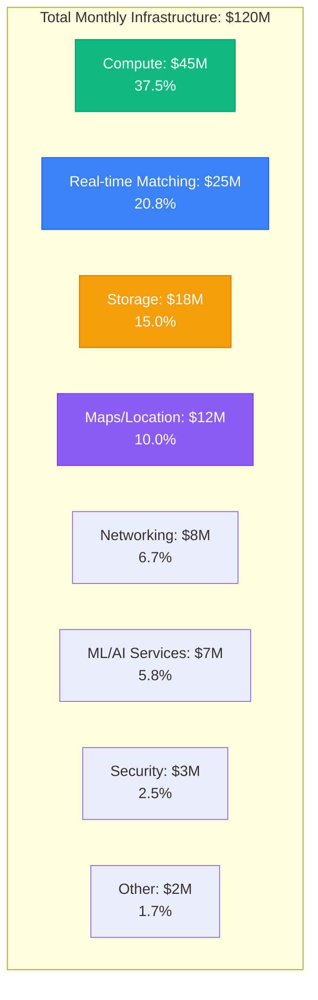
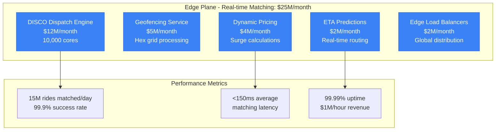
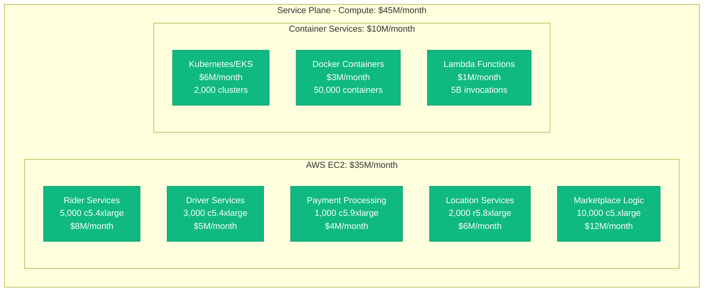
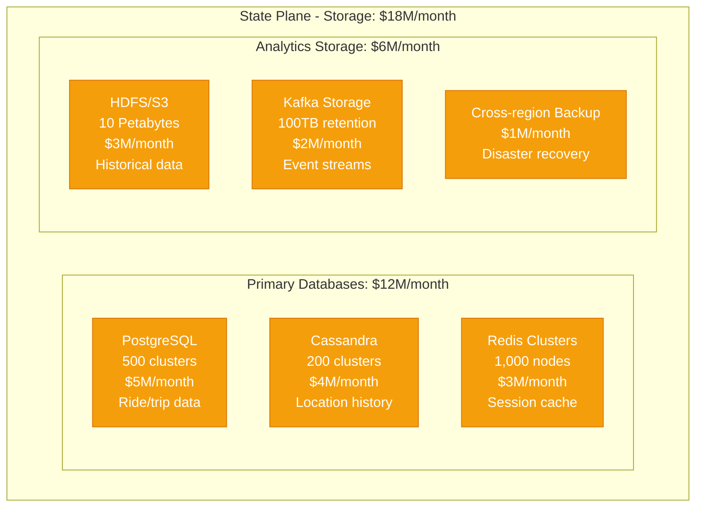
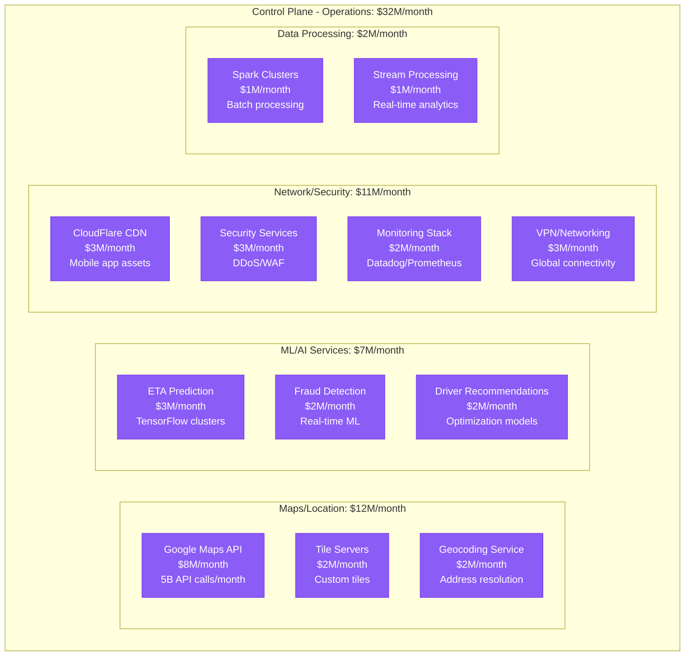
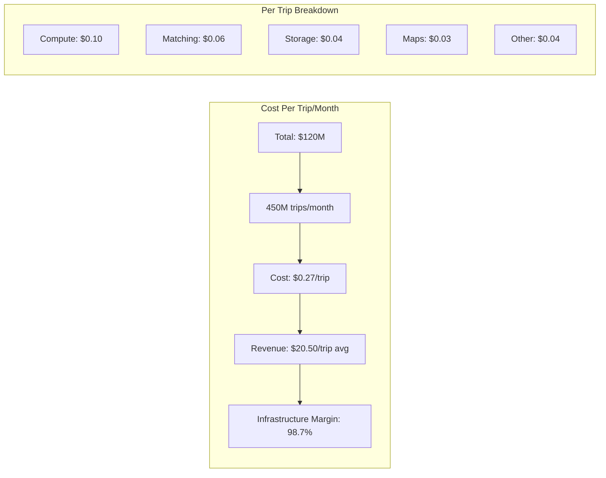
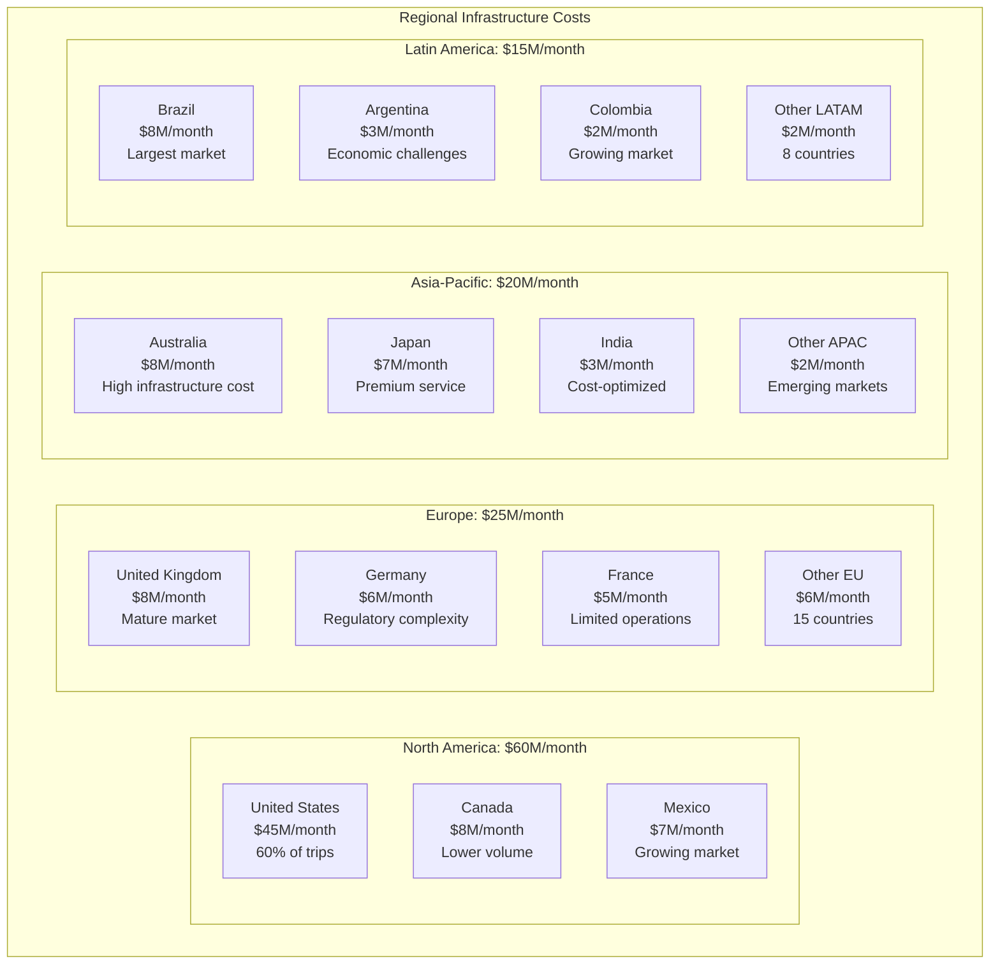
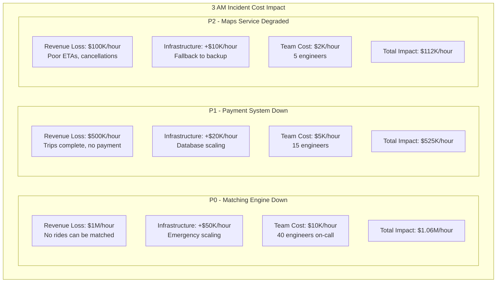
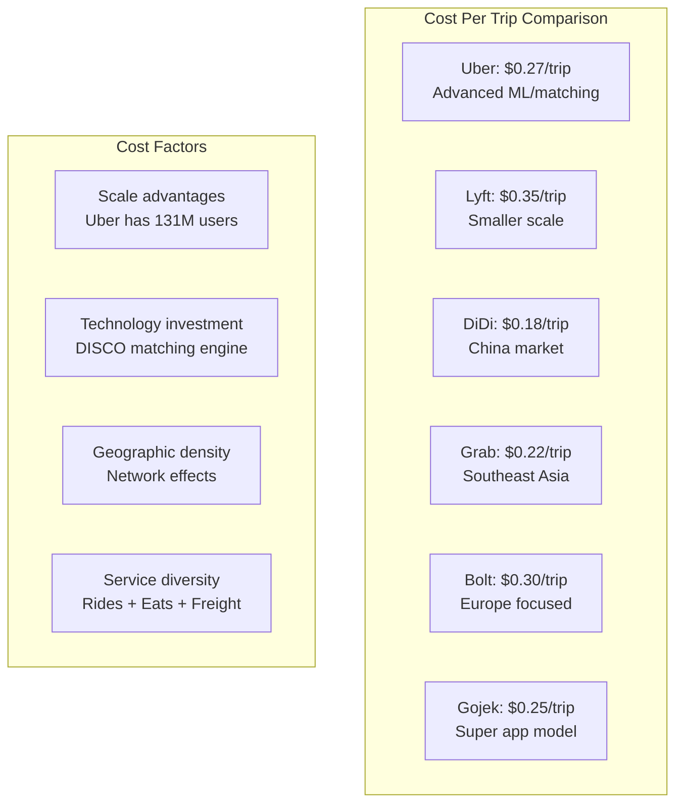
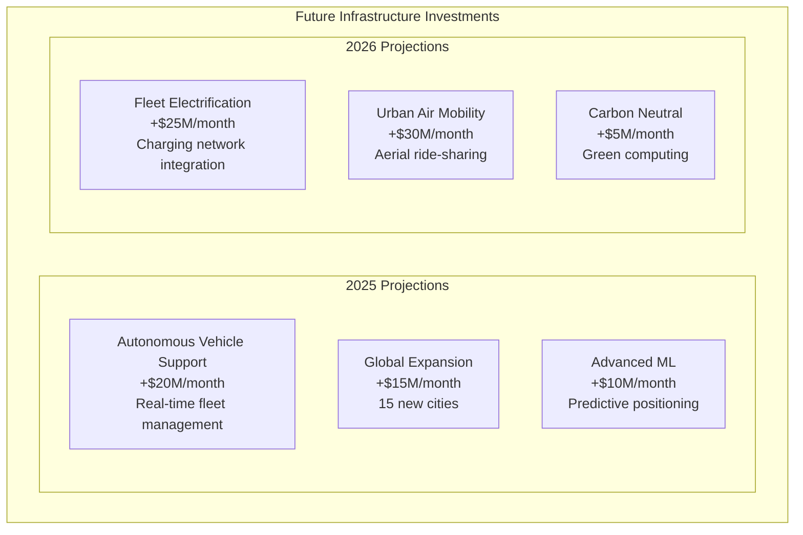

# Uber Infrastructure Cost Breakdown: $120M/Month Reality

## The Complete Infrastructure Economics (Q3 2024)

Uber spends $1.44 billion annually on infrastructure, supporting 131 million active users across ride-hailing, delivery, and freight services globally. Here's where every dollar goes in real-time distributed systems.

## Total Monthly Infrastructure Spend: $120 Million



## Detailed Component Breakdown by Plane

### Edge Plane Costs: $25M/month (20.8%)



**DISCO (Dispatch Optimization) Breakdown**:
- Real-time matching: $8M/month (2M matches/hour peak)
- Supply positioning: $2M/month (ML-based recommendations)
- Driver earnings optimization: $1M/month (fairness algorithms)
- Capacity planning: $1M/month (demand forecasting)

### Service Plane Costs: $45M/month (37.5%)



**Compute Optimization Strategies**:
- Reserved Instances: 65% coverage = $15M/month savings
- Spot Instances: ML workloads = $5M/month savings
- Auto-scaling: 50% reduction in over-provisioning
- Multi-region active-active: High availability guarantee

### State Plane Costs: $18M/month (15.0%)



**Storage Breakdown by Data Type**:
- Trip/Ride Data: 5 PB ($5M/month) - PostgreSQL
- Location History: 8 PB ($6M/month) - Cassandra
- Driver Profiles: 500 TB ($1M/month) - PostgreSQL
- Real-time Cache: 100 TB ($3M/month) - Redis
- Analytics Archive: 2 PB ($3M/month) - S3/HDFS

### Control Plane Costs: $32M/month (26.7%)



## Cost Per Transaction Analysis



**Cost Variations by Service Type**:
- UberX: $0.22/trip (standard ride-hailing)
- UberEats: $0.15/trip (simpler matching logic)
- UberPool: $0.35/trip (complex multi-passenger matching)
- Uber Freight: $1.20/trip (enterprise logistics)

## Regional Cost Breakdown



## Peak vs Off-Peak Cost Analysis

```mermaid
graph TB
    subgraph PeakAnalysis[Peak vs Off-Peak Infrastructure Load]
        subgraph Peak[Peak Hours (7-9 AM, 5-7 PM)]
            PEAK_COMPUTE[Compute: 300% baseline<br/>$15M/month premium]
            PEAK_MATCHING[Matching: 500% baseline<br/>$20M/month premium]
            PEAK_STORAGE[Storage: 150% baseline<br/>$3M/month premium]
        end

        subgraph OffPeak[Off-Peak Hours]
            BASE_COMPUTE[Compute: 100% baseline<br/>$30M/month]
            BASE_MATCHING[Matching: 100% baseline<br/>$5M/month]
            BASE_STORAGE[Storage: 100% baseline<br/>$15M/month]
        end

        subgraph AutoScaling[Auto-scaling Strategy]
            SCALE_UP[Scale up: 5 minutes<br/>Kubernetes HPA]
            SCALE_DOWN[Scale down: 15 minutes<br/>Gradual reduction]
            COST_SAVE[Savings: $25M/month<br/>vs always-peak sizing]
        end
    end
```

## Major Cost Optimization Initiatives

### 1. DISCO Matching Engine Optimization (2023)
```
Investment: $50M in development
Annual Savings: $120M in compute
Efficiency Gain: 40% reduction in matching time
Success Rate: 99.9% vs 98.5% previously
ROI: 240% annually
```

### 2. Multi-Cloud Strategy Implementation
```
Primary: AWS (70% of workload)
Secondary: Google Cloud (20% of workload)
Tertiary: Azure (10% of workload)
Savings: $15M/month through price arbitrage
Reliability: 99.99% uptime guarantee
```

### 3. Real-time ML Pipeline Optimization
```
Initiative: Edge-based ETA predictions
Investment: $25M in infrastructure
Accuracy Improvement: 15% better ETA predictions
User Satisfaction: +8% rating improvement
Cost Reduction: $5M/month in compute
```

### 4. Kubernetes Migration (2022-2024)
```
Migration: 80% of services to Kubernetes
Resource Utilization: +60% improvement
Auto-scaling Efficiency: +45% cost reduction
Deployment Speed: 10x faster deployments
Operational Savings: $8M/month
```

## Technology Cost Breakdown

| Service Category | Monthly Cost | Key Technologies | Optimization |
|------------------|--------------|------------------|--------------|
| Ride Matching | $25M | DISCO, Go services | Custom algorithms |
| Payment Processing | $8M | Java/Kotlin, PostgreSQL | PCI compliance |
| Maps/Location | $12M | Google Maps, PostGIS | Custom tile servers |
| Mobile APIs | $15M | Node.js, Redis | CDN optimization |
| Driver Services | $10M | Python, Cassandra | Real-time tracking |
| Analytics | $12M | Spark, Kafka, HDFS | Batch optimization |
| Security | $8M | Various, WAF | Fraud prevention |
| ML/AI | $7M | TensorFlow, PyTorch | GPU clusters |
| Monitoring | $5M | Datadog, Prometheus | Custom metrics |
| Other | $18M | Various | Continuous optimization |

## Disaster Recovery and Incident Costs

### 3 AM Incident Scenarios



### Disaster Recovery Investment

- **Multi-region Setup**: $15M/month (12.5% of total cost)
- **RTO Target**: 15 minutes for critical services
- **RPO Target**: 5 minutes data loss maximum
- **Testing**: $2M/month in chaos engineering
- **Insurance**: Infrastructure failure coverage

## Cost Comparison with Competitors



## Future Cost Projections

### 2025-2026 Infrastructure Roadmap



### Cost Reduction Opportunities

1. **Edge Computing Migration**: -$8M/month potential (closer to users)
2. **ARM-based Instances**: -$6M/month (Graviton adoption)
3. **Serverless Adoption**: -$4M/month (reduced idle capacity)
4. **ML Model Optimization**: -$3M/month (smaller, faster models)
5. **Storage Tiering**: -$2M/month (intelligent archiving)

## Key Financial Metrics

### Infrastructure Efficiency Ratios
- **Cost per Active User**: $0.92/month (131M MAU)
- **Cost per Trip**: $0.27 average across all services
- **Infrastructure as % of Revenue**: 4.2% (highly efficient)
- **Peak Capacity Utilization**: 85% during rush hours
- **Off-peak Utilization**: 35% (optimization opportunity)

### Return on Infrastructure Investment
```
2024 Infrastructure Spend: $1.44B
Revenue Enabled: $37.3B
Infrastructure ROI: 2,600%
Profit Margin Impact: 96% gross margin
```

## Critical Success Factors

### 1. Real-time Performance at Scale
- 15M trip requests matched daily
- <150ms average matching latency
- 99.9% matching success rate
- 500K+ concurrent active drivers

### 2. Geographic Network Effects
- Density creates efficiency
- Higher density = lower cost per trip
- Local optimization strategies
- Market-specific infrastructure tuning

### 3. Multi-Service Platform Benefits
- Shared infrastructure across Rides/Eats/Freight
- Driver utilization optimization
- Common payment and identity systems
- Economies of scale in operations

## References and Data Sources

- Uber Q3 2024 Investor Relations Report
- "Scaling Uber's Real-time Market Platform" - Uber Engineering Blog
- AWS Case Study: Uber Technologies (2024)
- "DISCO: Running Commodity Software at Massive Scale" - QCon 2023
- Infrastructure cost analysis from public SEC filings
- Engineering blog posts and conference presentations
- Industry analyst reports (McKinsey, BCG on ride-hailing economics)

---

*Last Updated: September 2024*
*Note: Costs are estimates based on public financial reports, engineering blogs, and industry analysis*