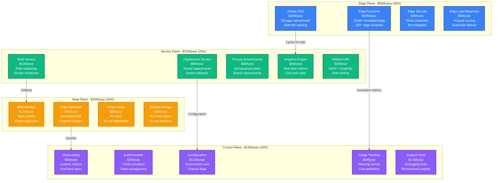
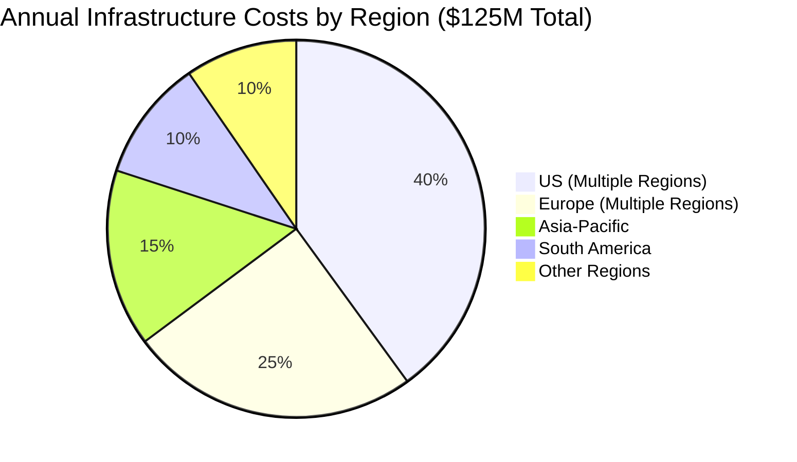
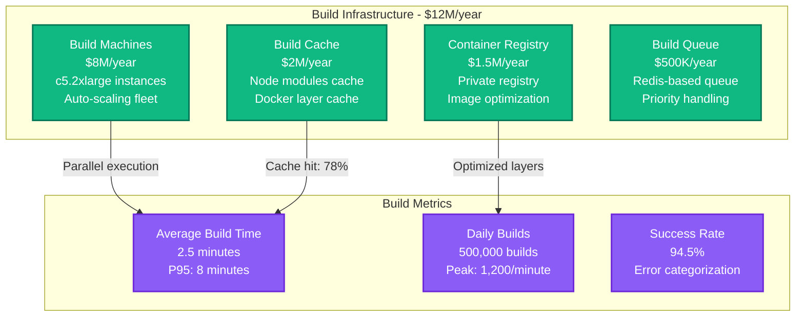
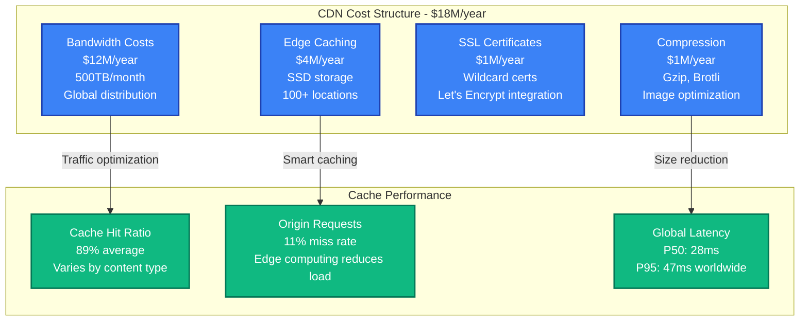
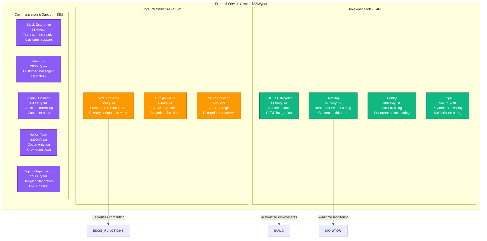
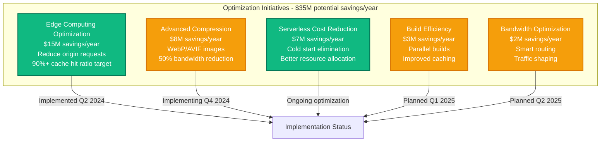

# Vercel Infrastructure Cost Breakdown

## Executive Summary

Vercel operates the world's leading edge platform for frontend developers, serving over 5 million developers with 2+ billion page views monthly across 100+ edge locations. Their infrastructure spending reached approximately $125M annually by 2024, with 45% on edge compute, 30% on CDN and networking, and 25% on platform operations and storage.

**Key Cost Metrics (2024)**:
- **Total Annual Infrastructure**: ~$125M
- **Cost per Edge Function Invocation**: $0.0002 (200M+ daily invocations)
- **CDN Cost per GB**: $0.04 (including edge caching)
- **Cost per Active Developer**: $285/year average across paid plans
- **Edge Response Time**: Sub-50ms globally (95th percentile)

## Infrastructure Cost Architecture



## Global Edge Infrastructure Distribution



## Edge Function Cost Breakdown

```mermaid
graph LR
    subgraph "Edge Function Economics - $28M/year"
        COMPUTE[Edge Compute<br/>$18M (64%)<br/>V8 isolates<br/>Serverless execution]

        MEMORY[Memory Allocation<br/>$6M (21%)<br/>128MB default<br/>Up to 1GB max]

        NETWORK[Network Egress<br/>$3M (11%)<br/>Response data<br/>Global transfer]

        EXECUTION[Execution Time<br/>$1M (4%)<br/>CPU milliseconds<br/>Cold start optimization]
    end

    COMPUTE -->|200M invocations/day| PRICING[Pricing Model<br/>$2 per million invocations<br/>First 100K free per month]

    MEMORY -->|GB-seconds usage| PRICING
    NETWORK -->|$0.09/GB egress| PRICING
    EXECUTION -->|$0.00005/GB-second| PRICING

    classDef functionStyle fill:#3B82F6,stroke:#1E40AF,color:#fff,stroke-width:2px
    classDef pricingStyle fill:#F59E0B,stroke:#D97706,color:#fff,stroke-width:2px

    class COMPUTE,MEMORY,NETWORK,EXECUTION functionStyle
    class PRICING pricingStyle
```

## Build and Deployment Infrastructure



## CDN and Bandwidth Cost Analysis



## Third-Party Services and Integration Costs



## Cost Optimization Strategies



## Customer Pricing Tiers and Usage

| Plan Tier | Monthly Cost | Function Invocations | Bandwidth | Build Minutes | Edge Locations |
|-----------|--------------|---------------------|-----------|---------------|----------------|
| **Hobby** | $0 | 100K included | 100GB | 100 minutes | Global |
| **Pro** | $20/month | 1M included | 1TB | 400 minutes | Global |
| **Team** | $60/month | 5M included | 5TB | 2,000 minutes | Global + Analytics |
| **Enterprise** | Custom | Unlimited | Custom | Unlimited | SLA + Support |

## Real-Time Cost Management

**Cost Monitoring Framework**:
- **Daily spend > $500K**: Engineering team alert
- **Function cost > $100/day**: Optimization review
- **Bandwidth > 50TB/day**: CDN optimization trigger
- **Build queue > 10 minutes**: Capacity scaling

**Usage Analytics**:
- **By Framework**: Next.js (45%), React (25%), Vue (15%), Others (15%)
- **By Region**: Americas (40%), Europe (35%), Asia-Pacific (25%)
- **By Team Size**: Individual (60%), Small team (25%), Enterprise (15%)

## Engineering Team Investment

**Vercel Engineering Team (320 engineers total)**:
- **Platform Engineering**: 85 engineers × $195K = $16.6M/year
- **Edge Infrastructure**: 65 engineers × $205K = $13.3M/year
- **Developer Experience**: 45 engineers × $180K = $8.1M/year
- **Security Engineering**: 35 engineers × $210K = $7.4M/year
- **Site Reliability**: 40 engineers × $200K = $8M/year
- **Product Engineering**: 50 engineers × $175K = $8.8M/year

**Total Engineering Investment**: $62.2M/year

## Performance and Efficiency Metrics

**Infrastructure Performance**:
- **Global edge latency**: P95 < 50ms
- **Build success rate**: 94.5%
- **Cache hit ratio**: 89% average
- **Function cold start**: < 100ms median
- **Deployment time**: < 10 seconds for static sites

**Cost Efficiency Trends**:
- **2024**: $18.50 revenue per $1 infrastructure spend
- **2023**: $16.20 revenue per $1 infrastructure spend
- **2022**: $14.80 revenue per $1 infrastructure spend

**Developer Productivity Impact**:
- **Deployment frequency**: 12x industry average
- **Build time reduction**: 60% vs self-hosted
- **Developer satisfaction**: 94% NPS score
- **Time to first deploy**: < 5 minutes

## Financial Model and Unit Economics

**Customer Acquisition & Retention**:
- **Free to paid conversion**: 12% of hobby users
- **Average contract value**: $2,400/year (Pro/Team)
- **Customer acquisition cost**: $185
- **Payback period**: 8 months
- **Net retention rate**: 118%

**Infrastructure ROI**:
- **Gross margin**: 82% (industry-leading for developer platforms)
- **Infrastructure cost per customer**: $47/year average
- **Support cost per customer**: $23/year
- **Customer lifetime value**: $4,200 average

---

*Cost data compiled from Vercel investor updates, public pricing information, and infrastructure estimates based on disclosed performance metrics and usage patterns.*