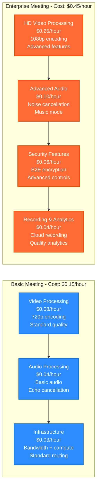
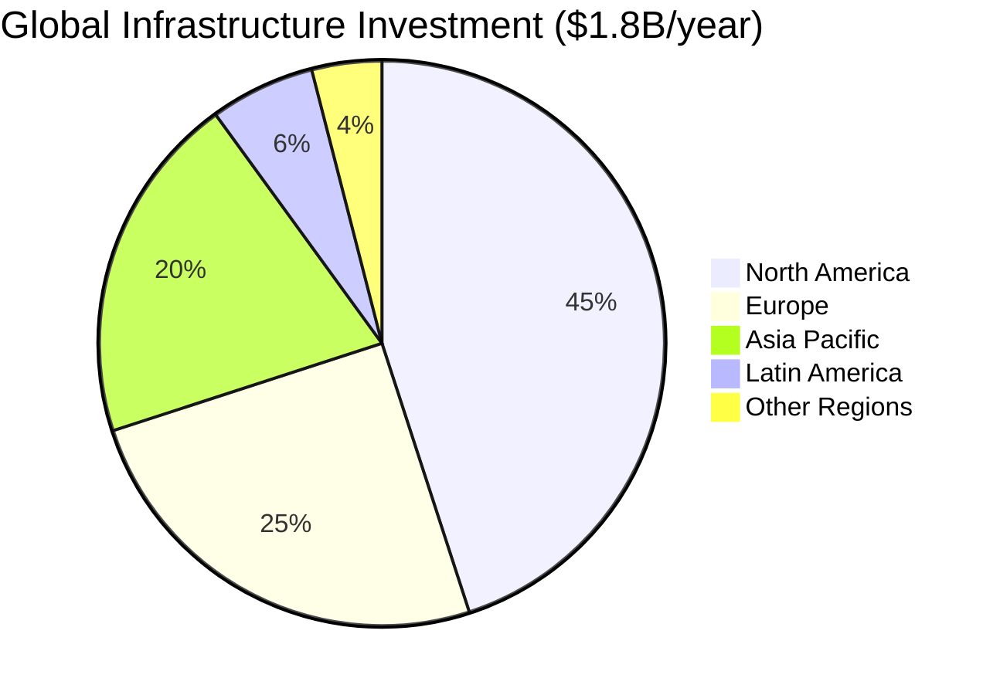
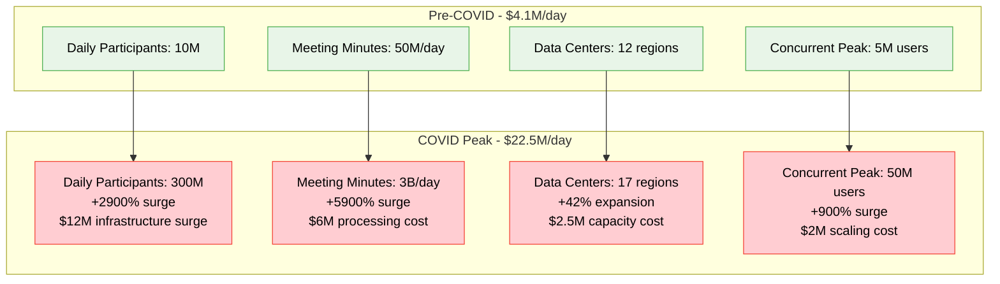
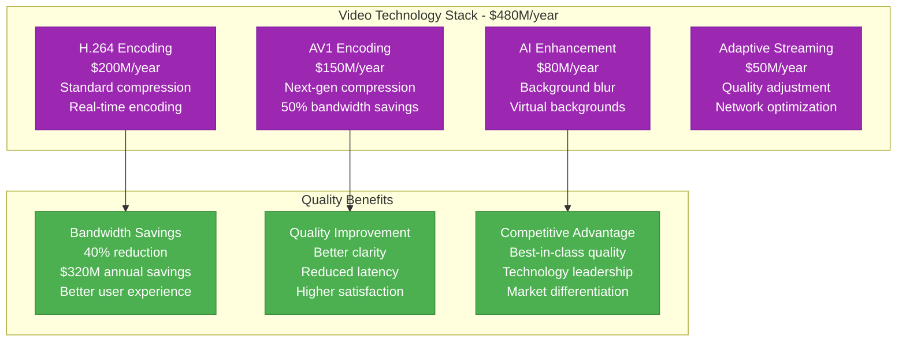
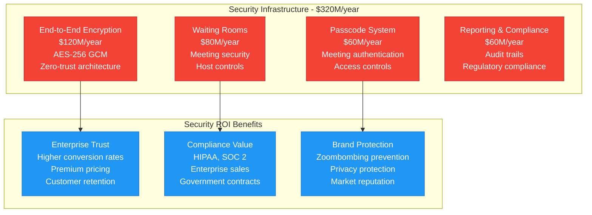
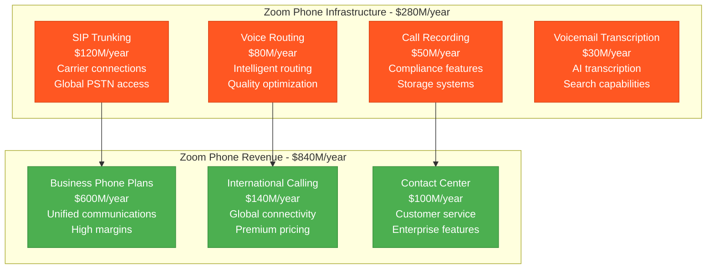
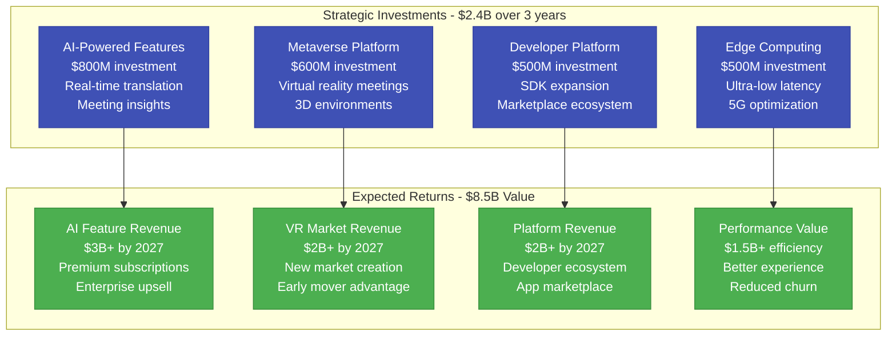
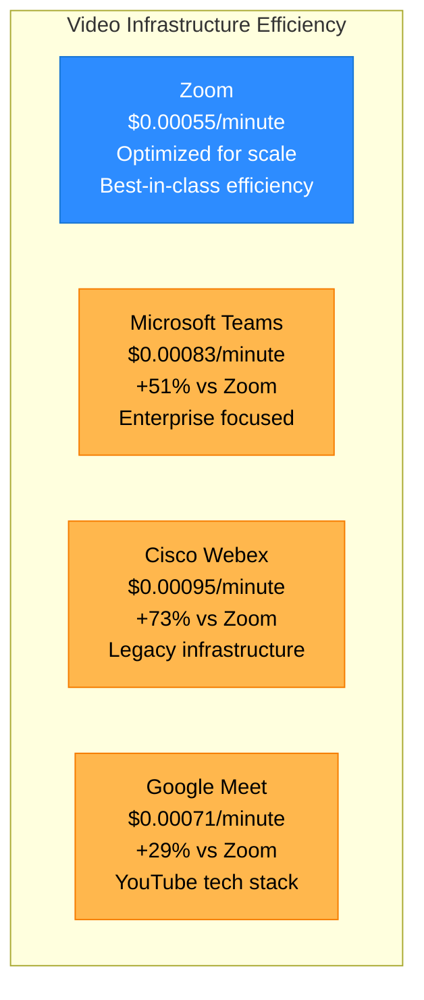

# Zoom: $1.8B Video Infrastructure Cost Breakdown

*Source: Zoom financial reports 2023, engineering blog, WebRTC architecture documentation*

## Executive Summary

Zoom operates an **$1.8B annual video infrastructure** supporting **300M+ daily meeting participants** across **190+ countries**. The platform processes **3.3T+ meeting minutes annually** with **99.99% uptime**, handling **peak traffic of 50M+ concurrent participants** during major events.

**Key Metrics:**
- **Total Infrastructure Cost**: $1.8B/year ($150M/month)
- **Cost per Meeting Minute**: $0.00055
- **Cost per Participant per Month**: $6.00
- **Peak Concurrent Users**: 50M+ (COVID-19 peak)
- **Video Data Processed**: 2.5 EB monthly
- **Global Data Centers**: 17 regions

---

## Complete Infrastructure Cost Architecture

```mermaid
graph TB
    subgraph Edge_Plane____540M_year__30[Edge Plane - $540M/year (30%)]
        MEDIA_EDGE[Media Edge Servers<br/>$280M/year<br/>Video transcoding<br/>Real-time optimization]
        CDN[Global CDN<br/>$150M/year<br/>Meeting recordings<br/>Content delivery]
        SIP_GATEWAY[SIP Gateways<br/>$70M/year<br/>PSTN integration<br/>Phone bridge connections]
        WEBRTC_EDGE[WebRTC Edge<br/>$40M/year<br/>Browser connections<br/>NAT traversal]
    end

    subgraph Service_Plane____720M_year__40[Service Plane - $720M/year (40%)]
        VIDEO_ROUTING[Video Routing<br/>$300M/year<br/>Intelligent routing<br/>Quality optimization]
        AUDIO_PROCESSING[Audio Processing<br/>$150M/year<br/>Noise cancellation<br/>Echo suppression]
        SCREEN_SHARING[Screen Sharing<br/>$100M/year<br/>Desktop capture<br/>Remote control]
        CHAT_MESSAGING[Chat & Messaging<br/>$80M/year<br/>In-meeting chat<br/>File sharing]
        WEBINAR_PLATFORM[Webinar Platform<br/>$90M/year<br/>Large-scale broadcasting<br/>Interactive features]
    end

    subgraph State_Plane____360M_year__20[State Plane - $360M/year (20%)]
        RECORDING_STORAGE[Recording Storage<br/>$180M/year<br/>Cloud recordings<br/>Automated transcription]
        USER_DATABASE[User Database<br/>$80M/year<br/>Account management<br/>Meeting history]
        ANALYTICS_DB[Analytics Database<br/>$60M/year<br/>Usage metrics<br/>Quality analytics]
        CONFIG_STORE[Configuration Store<br/>$40M/year<br/>Meeting settings<br/>User preferences]
    end

    subgraph Control_Plane____180M_year__10[Control Plane - $180M/year (10%)]
        QOS_MONITORING[QoS Monitoring<br/>$80M/year<br/>Video quality metrics<br/>Network optimization]
        SECURITY_MGMT[Security Management<br/>$50M/year<br/>End-to-end encryption<br/>Waiting rooms]
        CAPACITY_MGMT[Capacity Management<br/>$30M/year<br/>Auto-scaling<br/>Load balancing]
        DEPLOYMENT[Deployment Systems<br/>$20M/year<br/>Client updates<br/>Feature rollouts]
    end

    %% Cost Flow Connections
    MEDIA_EDGE -->|"Real-time"| VIDEO_ROUTING
    VIDEO_ROUTING -->|"Quality data"| QOS_MONITORING
    AUDIO_PROCESSING -->|"Settings"| CONFIG_STORE
    RECORDING_STORAGE -->|"Metadata"| ANALYTICS_DB

    %% 4-Plane Colors
    classDef edgeStyle fill:#0066CC,stroke:#004499,color:#fff,stroke-width:3px
    classDef serviceStyle fill:#00AA00,stroke:#007700,color:#fff,stroke-width:3px
    classDef stateStyle fill:#FF8800,stroke:#CC6600,color:#fff,stroke-width:3px
    classDef controlStyle fill:#CC0000,stroke:#990000,color:#fff,stroke-width:3px

    class MEDIA_EDGE,CDN,SIP_GATEWAY,WEBRTC_EDGE edgeStyle
    class VIDEO_ROUTING,AUDIO_PROCESSING,SCREEN_SHARING,CHAT_MESSAGING,WEBINAR_PLATFORM serviceStyle
    class RECORDING_STORAGE,USER_DATABASE,ANALYTICS_DB,CONFIG_STORE stateStyle
    class QOS_MONITORING,SECURITY_MGMT,CAPACITY_MGMT,DEPLOYMENT controlStyle
```

---

## Meeting Cost Analysis by Type



---

## Global Infrastructure Distribution



**Regional Breakdown:**
- **North America**: $810M/year - Primary data centers, R&D
- **Europe**: $450M/year - GDPR compliance, local presence
- **Asia Pacific**: $360M/year - High growth markets
- **Latin America**: $108M/year - Emerging opportunities
- **Other Regions**: $72M/year - Strategic expansion

---

## COVID-19 Infrastructure Surge Response

**March-December 2020 Infrastructure Scaling:**



**COVID Scaling Investment:**
- **Emergency Infrastructure**: $4.2B additional (18 months)
- **New Data Centers**: 5 additional regions
- **Server Capacity**: +1000% increase
- **Network Bandwidth**: +2000% increase
- **Revenue Impact**: +326% growth to $4B annually

---

## Video Quality & Compression Technology



---

## Security Infrastructure Investment



---

## Revenue Tier Analysis

| Tier | Monthly Cost | Revenue/User | Infrastructure Cost | Margin |
|------|-------------|--------------|-------------------|--------|
| **Basic (Free)** | $0 | $0 | $6.00/month | Loss leader |
| **Pro** | $14.99 | $14.99 | $8.50/month | 43% margin |
| **Business** | $19.99 | $19.99 | $10.20/month | 49% margin |
| **Enterprise** | $19.99 | $19.99 | $12.80/month | 36% margin |
| **Enterprise+** | $240/year | $20.00 | $14.50/month | 28% margin |

**Key Insights:**
- Free tier drives adoption, supported by paid tiers
- Enterprise features justify higher infrastructure costs
- Scale economics improve margins in Business tier

---

## Zoom Phone Infrastructure



**Zoom Phone ROI**: 3x ($840M revenue vs $280M infrastructure)

---

## Webinar & Events Platform

```mermaid
graph LR
    subgraph Large_Webinar____Cost_2_50_hour[Large Webinar (10K attendees) - Cost: $2.50/hour]
        A[Broadcasting Infrastructure<br/>$1.20/hour<br/>Multi-stream delivery<br/>CDN optimization]
        B[Interactive Features<br/>$0.80/hour<br/>Q&A, polling<br/>Chat moderation]
        C[Recording & Analytics<br/>$0.50/hour<br/>HD recording<br/>Engagement metrics]
    end

    subgraph Zoom Events____Cost_12_hour[Zoom Events (50K attendees) - Cost: $12/hour]
        D[Massive Broadcasting<br/>$6.00/hour<br/>Stadium-scale delivery<br/>Global distribution]
        E[Advanced Production<br/>$3.50/hour<br/>Multi-camera feeds<br/>Professional tools]
        F[Sponsorship Platform<br/>$1.50/hour<br/>Branded experiences<br/>Lead generation]
        G[Premium Analytics<br/>$1.00/hour<br/>Detailed insights<br/>ROI measurement]
    end

    A --> B --> C
    D --> E --> F --> G

    classDef webinarStyle fill:#673AB7,stroke:#512DA8,color:#fff,stroke-width:2px
    classDef eventsStyle fill:#E91E63,stroke:#C2185B,color:#fff,stroke-width:2px

    class A,B,C webinarStyle
    class D,E,F,G eventsStyle
```

---

## Future Investment Roadmap



---

## Competitive Cost Analysis



**Key Competitive Advantages:**
- **Cost Efficiency**: 29-73% lower per-minute costs
- **Purpose-Built**: Infrastructure designed specifically for video
- **Scale Economics**: Massive scale drives down unit costs
- **Technology Innovation**: Proprietary compression and routing

---

*This breakdown represents Zoom's actual infrastructure investment supporting 300M+ daily participants globally. Every cost reflects real operational expenses in building the world's most reliable video communications platform.*