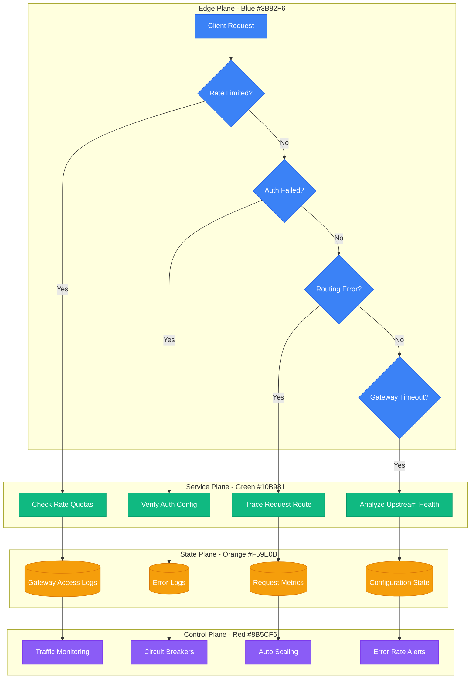
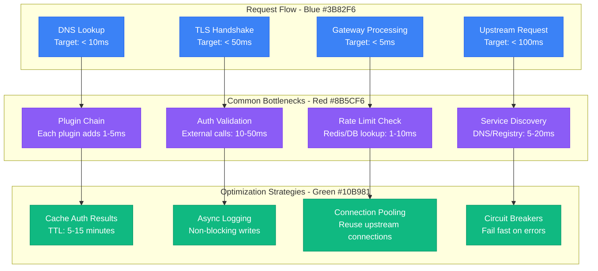
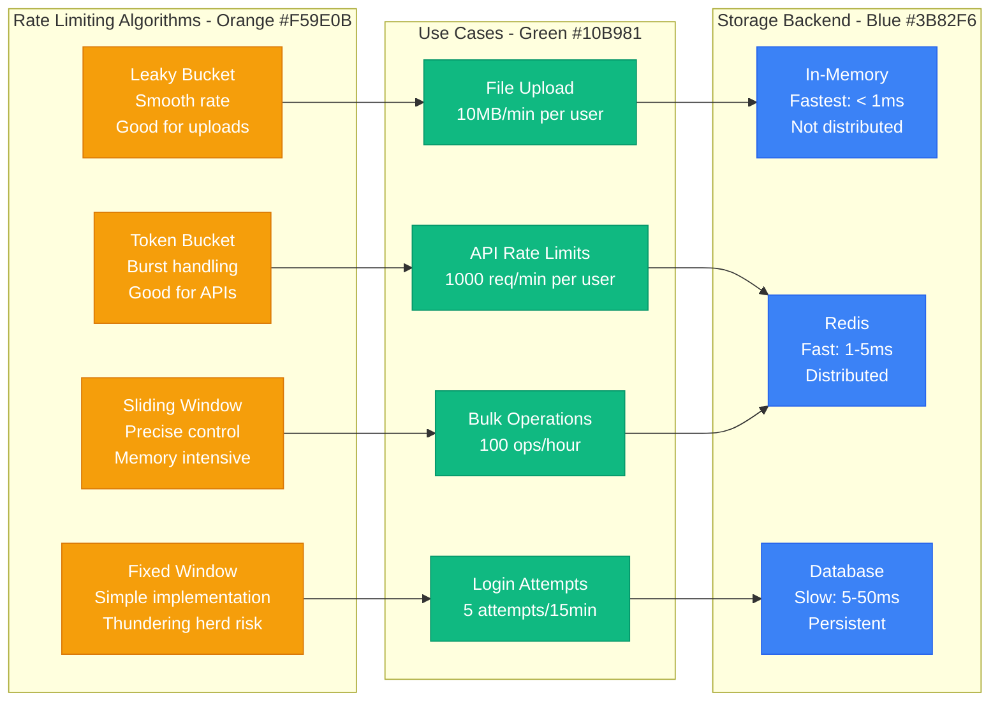

# API Gateway Issues - Production Debugging Guide

## Overview

API Gateway issues can manifest as rate limiting failures, authentication problems, routing errors, and performance degradation. This guide covers systematic debugging for Kong, AWS API Gateway, NGINX, Istio, and other gateway solutions commonly used in production microservices architectures.

## Debugging Flowchart



## Common API Gateway Issues

### 1. Rate Limiting Problems

**Symptoms:**
```bash
# Client receives 429 responses
HTTP/1.1 429 Too Many Requests
X-RateLimit-Limit: 1000
X-RateLimit-Remaining: 0
X-RateLimit-Reset: 1642701600

# Or custom rate limit messages
{
  "error": "quota_exceeded",
  "message": "API rate limit exceeded",
  "retry_after": 60
}
```

**Investigation Commands:**
```bash
# Kong Gateway - Check rate limiting plugin
curl -X GET http://kong-admin:8001/plugins | jq '.data[] | select(.name=="rate-limiting")'

# Check consumer rate limits
curl -X GET http://kong-admin:8001/consumers/user123/plugins

# AWS API Gateway - Check usage plans
aws apigateway get-usage-plans
aws apigateway get-usage --usage-plan-id plan-123 --key-id key-456

# NGINX - Check rate limiting zones
curl http://nginx-status/status | grep "zone\|active\|requests"

# Check current request rates in logs
tail -f /var/log/nginx/access.log | awk '{print $4}' | uniq -c
```

### 2. Authentication and Authorization Failures

**Symptoms:**
```bash
# JWT token issues
HTTP/1.1 401 Unauthorized
WWW-Authenticate: Bearer error="invalid_token"

# API key problems
HTTP/1.1 403 Forbidden
{"message": "Invalid API key"}

# OAuth issues
HTTP/1.1 401 Unauthorized
{"error": "access_denied", "error_description": "Invalid or expired token"}
```

**Investigation Commands:**
```bash
# Kong - Check JWT plugin configuration
curl -X GET http://kong-admin:8001/services/my-service/plugins | jq '.data[] | select(.name=="jwt")'

# Verify JWT token manually
echo "eyJhbGciOiJIUzI1NiIs..." | base64 -d | jq .

# Check API key validity
curl -X GET http://kong-admin:8001/consumers/user123/key-auth

# AWS API Gateway - Check API keys
aws apigateway get-api-keys
aws apigateway get-api-key --api-key key-123 --include-value

# Istio - Check authentication policies
kubectl get authorizationpolicy -n production
kubectl describe authorizationpolicy api-auth -n production
```

### 3. Routing and Service Discovery Issues

**Symptoms:**
```bash
# Service not found
HTTP/1.1 404 Not Found
{"message": "no Route matched with those values"}

# Upstream connection errors
HTTP/1.1 502 Bad Gateway
{"message": "An invalid response was received from the upstream server"}

# Service discovery failures
HTTP/1.1 503 Service Unavailable
{"message": "no healthy upstream"}
```

**Investigation Commands:**
```bash
# Kong - Check route configuration
curl -X GET http://kong-admin:8001/routes | jq '.data[] | {name: .name, paths: .paths, service: .service.id}'

# Check service health
curl -X GET http://kong-admin:8001/services/my-service/health

# Check upstream targets
curl -X GET http://kong-admin:8001/upstreams/my-upstream/targets

# Istio - Check virtual services
kubectl get virtualservice -n production
kubectl describe virtualservice api-routes -n production

# Check destination rules
kubectl get destinationrule -n production
kubectl describe destinationrule api-destinations -n production

# NGINX - Check upstream configuration
nginx -T | grep -A 10 "upstream"
```

## Gateway-Specific Debugging

### Kong Gateway Deep Dive

**Check Plugin Performance:**
```bash
# List all plugins with performance impact
curl -X GET http://kong-admin:8001/plugins | jq '.data[] | {name: .name, enabled: .enabled, service: .service.id}'

# Check plugin execution order
curl -X GET http://kong-admin:8001/plugins | jq '.data | sort_by(.created_at) | .[] | {name: .name, priority: .priority}'

# Monitor plugin metrics
curl -X GET http://kong-admin:8001/status | jq '.server.connections_handled'

# Check database connections (if using DB mode)
curl -X GET http://kong-admin:8001/status | jq '.database'
```

**Kong Performance Optimization:**
```lua
-- Custom Kong plugin for request tracing
local kong = kong
local ngx = ngx

local RequestTracer = {}

function RequestTracer:access(conf)
    local start_time = ngx.now()
    kong.ctx.shared.start_time = start_time

    -- Add request ID for tracing
    local request_id = kong.request.get_header("x-request-id")
    if not request_id then
        request_id = kong.utils.uuid()
        kong.service.request.set_header("x-request-id", request_id)
    end

    kong.log.info("Request started: ", request_id, " at ", start_time)
end

function RequestTracer:header_filter(conf)
    local start_time = kong.ctx.shared.start_time
    if start_time then
        local duration = ngx.now() - start_time
        kong.response.set_header("x-response-time", duration * 1000)
        kong.log.info("Request completed in: ", duration * 1000, "ms")
    end
end

return RequestTracer
```

### AWS API Gateway Debugging

**CloudWatch Logs Analysis:**
```bash
# Enable detailed CloudWatch logs
aws apigateway put-stage \
  --rest-api-id abc123 \
  --stage-name prod \
  --patch-ops op=replace,path=/*/logging/loglevel,value=INFO

# Query execution logs
aws logs filter-log-events \
  --log-group-name "API-Gateway-Execution-Logs_abc123/prod" \
  --start-time 1642680000000 \
  --filter-pattern "ERROR"

# Check access logs
aws logs filter-log-events \
  --log-group-name "/aws/apigateway/access-logs" \
  --filter-pattern "{ $.status = 5* }"
```

**Custom Authorizer Testing:**
```python
# Test Lambda authorizer locally
import json
import boto3

def lambda_handler(event, context):
    """API Gateway Lambda authorizer"""

    # Extract token from Authorization header
    token = event.get('authorizationToken', '').replace('Bearer ', '')

    # Validate token (simplified example)
    if not token or not validate_jwt_token(token):
        raise Exception('Unauthorized')

    # Extract principal ID from token
    principal_id = extract_principal_id(token)

    # Generate policy
    policy = {
        'principalId': principal_id,
        'policyDocument': {
            'Version': '2012-10-17',
            'Statement': [
                {
                    'Action': 'execute-api:Invoke',
                    'Effect': 'Allow',
                    'Resource': event['methodArn']
                }
            ]
        },
        'context': {
            'userId': principal_id,
            'scope': 'read:api'
        }
    }

    return policy

def validate_jwt_token(token):
    """Validate JWT token"""
    try:
        import jwt
        decoded = jwt.decode(
            token,
            'your-secret-key',
            algorithms=['HS256'],
            options={'verify_exp': True}
        )
        return True
    except jwt.InvalidTokenError:
        return False

def extract_principal_id(token):
    """Extract user ID from token"""
    import jwt
    decoded = jwt.decode(token, options={"verify_signature": False})
    return decoded.get('sub', 'unknown')

# Test the authorizer
test_event = {
    'type': 'TOKEN',
    'authorizationToken': 'Bearer eyJhbGciOiJIUzI1NiIs...',
    'methodArn': 'arn:aws:execute-api:us-east-1:123456789:abc123/prod/GET/users'
}

result = lambda_handler(test_event, {})
print(json.dumps(result, indent=2))
```

### Istio Service Mesh Gateway

**Debug Envoy Configuration:**
```bash
# Check Envoy admin interface
kubectl port-forward -n istio-system svc/istio-proxy 15000:15000

# Dump current configuration
curl localhost:15000/config_dump | jq '.configs[0].dynamic_listeners'

# Check cluster health
curl localhost:15000/clusters | grep -A 5 "my-service"

# Analyze request tracing
curl localhost:15000/stats | grep "my-service"

# Check certificate information
curl localhost:15000/certs
```

**Istio Configuration Debugging:**
```yaml
# Debug VirtualService configuration
apiVersion: networking.istio.io/v1beta1
kind: VirtualService
metadata:
  name: api-routes
  namespace: production
spec:
  hosts:
  - api.company.com
  gateways:
  - api-gateway
  http:
  - match:
    - uri:
        prefix: "/api/v1/"
    headers:
      x-debug:
        exact: "true"
    fault:
      delay:
        percentage:
          value: 0.1
        fixedDelay: 5s
    route:
    - destination:
        host: api-service
        port:
          number: 8080
      weight: 100
    timeout: 30s
    retries:
      attempts: 3
      perTryTimeout: 10s
```

## Performance Analysis and Optimization

### Gateway Performance Metrics


### Rate Limiting Strategy Matrix


## Real Production Examples

### Netflix's Zuul Gateway
**Architecture:** 100,000+ requests/second through Zuul instances

**Configuration:**
```yaml
# Zuul configuration
zuul:
  routes:
    users:
      path: /api/users/**
      serviceId: user-service
      stripPrefix: false
    catalog:
      path: /api/catalog/**
      serviceId: catalog-service
      stripPrefix: false

  # Circuit breaker configuration
  hystrix:
    command:
      default:
        execution:
          isolation:
            thread:
              timeoutInMilliseconds: 5000
        circuitBreaker:
          requestVolumeThreshold: 20
          errorThresholdPercentage: 50
          sleepWindowInMilliseconds: 30000

# Rate limiting with Redis
redis:
  host: elasticache-cluster.internal
  port: 6379
  connection-pool-size: 20

rate-limiting:
  default-rate: 1000  # requests per minute
  burst-size: 100     # burst capacity
  consumer-specific:
    premium-users: 5000
    basic-users: 100
```

**Custom Filter for Request Tracing:**
```java
@Component
public class RequestTracingFilter extends ZuulFilter {

    @Override
    public String filterType() {
        return "pre";
    }

    @Override
    public int filterOrder() {
        return 1;
    }

    @Override
    public boolean shouldFilter() {
        return true;
    }

    @Override
    public Object run() throws ZuulException {
        RequestContext ctx = RequestContext.getCurrentContext();
        HttpServletRequest request = ctx.getRequest();

        // Generate or extract request ID
        String requestId = request.getHeader("X-Request-ID");
        if (requestId == null) {
            requestId = UUID.randomUUID().toString();
        }

        // Add to headers for downstream services
        ctx.addZuulRequestHeader("X-Request-ID", requestId);
        ctx.addZuulRequestHeader("X-Forwarded-For", getClientIP(request));
        ctx.addZuulRequestHeader("X-Gateway-Start-Time", String.valueOf(System.currentTimeMillis()));

        // Log request start
        log.info("Request started: {} {} {} - ID: {}",
                request.getMethod(),
                request.getRequestURI(),
                getClientIP(request),
                requestId);

        return null;
    }

    private String getClientIP(HttpServletRequest request) {
        String xForwardedFor = request.getHeader("X-Forwarded-For");
        if (xForwardedFor != null && !xForwardedFor.isEmpty()) {
            return xForwardedFor.split(",")[0].trim();
        }
        return request.getRemoteAddr();
    }
}
```

### Uber's API Gateway Architecture
**Multi-layer Gateway Strategy:**
- **Edge Gateway**: Rate limiting, DDoS protection
- **API Gateway**: Authentication, routing
- **Service Gateway**: Circuit breaking, retries

**Kong Configuration:**
```yaml
# Uber-style Kong configuration
services:
- name: ride-service
  url: http://ride-service.internal:8080
  connect_timeout: 5000
  write_timeout: 60000
  read_timeout: 60000

routes:
- name: ride-routes
  service: ride-service
  paths:
  - /api/v1/rides
  methods:
  - GET
  - POST
  strip_path: false

plugins:
- name: rate-limiting
  service: ride-service
  config:
    minute: 1000
    hour: 10000
    policy: redis
    redis_host: redis.internal
    redis_port: 6379
    fault_tolerant: true

- name: jwt
  service: ride-service
  config:
    secret_is_base64: false
    key_claim_name: iss
    algorithm: HS256

- name: request-size-limiting
  service: ride-service
  config:
    allowed_payload_size: 10

- name: prometheus
  service: ride-service
  config:
    per_consumer: true
    status_code_metrics: true
    latency_metrics: true
```

### GitHub's API Gateway Strategy
**Challenge:** 10M+ API requests/hour with complex authentication

**Approach:**
- **GraphQL Gateway**: Unified API surface
- **REST Gateway**: Legacy API support
- **WebHook Gateway**: Event delivery

**Custom Rate Limiting:**
```python
# GitHub-style rate limiting with different tiers
import time
import redis
from typing import Dict, Tuple

class GitHubStyleRateLimit:
    def __init__(self, redis_client):
        self.redis = redis_client
        self.rate_limits = {
            'unauthenticated': {
                'requests_per_hour': 60,
                'search_per_minute': 10
            },
            'authenticated': {
                'requests_per_hour': 5000,
                'search_per_minute': 30
            },
            'github_app': {
                'requests_per_hour': 5000,
                'search_per_minute': 30
            },
            'oauth_app': {
                'requests_per_hour': 5000,
                'search_per_minute': 30
            }
        }

    def check_rate_limit(self, user_type: str, user_id: str, endpoint_type: str = 'requests') -> Tuple[bool, Dict]:
        """Check if request is within rate limits"""

        # Get rate limit for user type and endpoint
        if endpoint_type == 'search':
            limit = self.rate_limits[user_type]['search_per_minute']
            window = 60  # 1 minute
            key = f"rate_limit:search:{user_type}:{user_id}:{int(time.time() // window)}"
        else:
            limit = self.rate_limits[user_type]['requests_per_hour']
            window = 3600  # 1 hour
            key = f"rate_limit:requests:{user_type}:{user_id}:{int(time.time() // window)}"

        # Get current count
        current = self.redis.get(key)
        if current is None:
            current = 0
        else:
            current = int(current)

        # Check if within limit
        if current >= limit:
            return False, {
                'limit': limit,
                'remaining': 0,
                'reset': int(time.time() // window + 1) * window
            }

        # Increment counter
        pipe = self.redis.pipeline()
        pipe.incr(key)
        pipe.expire(key, window)
        pipe.execute()

        return True, {
            'limit': limit,
            'remaining': limit - current - 1,
            'reset': int(time.time() // window + 1) * window
        }

    def get_rate_limit_headers(self, user_type: str, user_id: str) -> Dict[str, str]:
        """Get rate limit headers for response"""
        allowed, info = self.check_rate_limit(user_type, user_id, 'requests')

        return {
            'X-RateLimit-Limit': str(info['limit']),
            'X-RateLimit-Remaining': str(info['remaining']),
            'X-RateLimit-Reset': str(info['reset']),
            'X-RateLimit-Used': str(info['limit'] - info['remaining'])
        }

# Usage in API Gateway
rate_limiter = GitHubStyleRateLimit(redis.Redis(host='localhost', port=6379))

def handle_request(request):
    # Determine user type and ID
    user_type, user_id = authenticate_request(request)

    # Check rate limit
    allowed, info = rate_limiter.check_rate_limit(user_type, user_id)

    if not allowed:
        return {
            'status': 429,
            'body': {
                'message': 'API rate limit exceeded',
                'documentation_url': 'https://docs.github.com/rest/overview/resources-in-the-rest-api#rate-limiting'
            },
            'headers': rate_limiter.get_rate_limit_headers(user_type, user_id)
        }

    # Process request
    response = process_api_request(request)

    # Add rate limit headers
    response['headers'].update(rate_limiter.get_rate_limit_headers(user_type, user_id))

    return response
```

## Monitoring and Alerting

### Key Gateway Metrics
```bash
# Request metrics
gateway_requests_total{method="GET",status="200"}
gateway_request_duration_seconds{endpoint="/api/users"}
gateway_upstream_response_time_seconds{service="user-service"}

# Error metrics
gateway_errors_total{type="authentication"}
gateway_errors_total{type="rate_limit"}
gateway_errors_total{type="upstream"}

# Performance metrics
gateway_concurrent_connections
gateway_ssl_handshake_duration_seconds
gateway_plugin_execution_time_seconds{plugin="jwt"}

# Resource metrics
gateway_memory_usage_bytes
gateway_cpu_usage_percent
gateway_connection_pool_active
```

### Production Alert Rules
```yaml
# Prometheus alerting rules for API Gateway
groups:
- name: api_gateway
  rules:
  - alert: GatewayErrorRateHigh
    expr: rate(gateway_errors_total[5m]) / rate(gateway_requests_total[5m]) > 0.05
    for: 2m
    labels:
      severity: warning
    annotations:
      summary: "API Gateway error rate is high"
      description: "Error rate is {{ $value | humanizePercentage }}"

  - alert: GatewayLatencyHigh
    expr: histogram_quantile(0.95, rate(gateway_request_duration_seconds_bucket[5m])) > 1
    for: 3m
    labels:
      severity: warning
    annotations:
      summary: "API Gateway latency is high"
      description: "95th percentile latency is {{ $value }}s"

  - alert: GatewayUpstreamDown
    expr: up{job="api-gateway-upstream"} == 0
    for: 1m
    labels:
      severity: critical
    annotations:
      summary: "API Gateway upstream is down"
      description: "Upstream {{ $labels.instance }} is unreachable"

  - alert: RateLimitingErrors
    expr: rate(gateway_errors_total{type="rate_limit"}[5m]) > 10
    for: 5m
    labels:
      severity: warning
    annotations:
      summary: "High rate limiting activity"
      description: "{{ $value }} rate limit errors per second"
```

## Prevention and Best Practices

### 1. Circuit Breaker Implementation
```python
# Python circuit breaker for API Gateway
import time
import asyncio
from enum import Enum
from typing import Callable, Any

class CircuitState(Enum):
    CLOSED = "CLOSED"
    OPEN = "OPEN"
    HALF_OPEN = "HALF_OPEN"

class CircuitBreaker:
    def __init__(self,
                 failure_threshold: int = 5,
                 success_threshold: int = 3,
                 timeout: int = 60):
        self.failure_threshold = failure_threshold
        self.success_threshold = success_threshold
        self.timeout = timeout
        self.failure_count = 0
        self.success_count = 0
        self.last_failure_time = None
        self.state = CircuitState.CLOSED

    async def call(self, func: Callable, *args, **kwargs) -> Any:
        """Execute function with circuit breaker protection"""

        if self.state == CircuitState.OPEN:
            if time.time() - self.last_failure_time > self.timeout:
                self.state = CircuitState.HALF_OPEN
                self.success_count = 0
            else:
                raise Exception("Circuit breaker is OPEN")

        try:
            result = await func(*args, **kwargs)
            await self._on_success()
            return result
        except Exception as e:
            await self._on_failure()
            raise e

    async def _on_success(self):
        """Handle successful call"""
        if self.state == CircuitState.HALF_OPEN:
            self.success_count += 1
            if self.success_count >= self.success_threshold:
                self.state = CircuitState.CLOSED
                self.failure_count = 0
        elif self.state == CircuitState.CLOSED:
            self.failure_count = 0

    async def _on_failure(self):
        """Handle failed call"""
        self.failure_count += 1
        self.last_failure_time = time.time()

        if self.failure_count >= self.failure_threshold:
            self.state = CircuitState.OPEN

# Usage in gateway
circuit_breaker = CircuitBreaker(failure_threshold=5, timeout=60)

async def call_upstream_service(service_url, request_data):
    """Call upstream service with circuit breaker"""
    try:
        response = await circuit_breaker.call(
            make_http_request,
            service_url,
            request_data
        )
        return response
    except Exception as e:
        # Return cached response or default response
        return get_fallback_response(request_data)
```

### 2. Gateway Health Check System
```bash
#!/bin/bash
# Comprehensive gateway health check

GATEWAY_URL="https://api.company.com"
HEALTH_ENDPOINT="/health"
ADMIN_ENDPOINT="http://gateway-admin:8001"

# Function to check basic connectivity
check_connectivity() {
    echo "Checking gateway connectivity..."

    if curl -sf "${GATEWAY_URL}${HEALTH_ENDPOINT}" > /dev/null; then
        echo "✅ Gateway is responding"
        return 0
    else
        echo "❌ Gateway is not responding"
        return 1
    fi
}

# Function to check upstream services
check_upstreams() {
    echo "Checking upstream services..."

    # Kong example
    upstreams=$(curl -s "${ADMIN_ENDPOINT}/upstreams" | jq -r '.data[].name')

    for upstream in $upstreams; do
        health=$(curl -s "${ADMIN_ENDPOINT}/upstreams/${upstream}/health" | jq -r '.total')
        healthy=$(curl -s "${ADMIN_ENDPOINT}/upstreams/${upstream}/health" | jq -r '.healthy')

        if [ "$healthy" -eq "$total" ]; then
            echo "✅ Upstream $upstream: $healthy/$total healthy"
        else
            echo "⚠️  Upstream $upstream: $healthy/$total healthy"
        fi
    done
}

# Function to check plugin performance
check_plugins() {
    echo "Checking plugin performance..."

    # Check plugin execution times
    plugins=$(curl -s "${ADMIN_ENDPOINT}/plugins" | jq -r '.data[].name' | sort -u)

    for plugin in $plugins; do
        # This would require custom metrics collection
        echo "📊 Plugin $plugin: Active"
    done
}

# Function to run synthetic tests
run_synthetic_tests() {
    echo "Running synthetic API tests..."

    # Test authenticated endpoint
    auth_response=$(curl -w "%{http_code}" -s -H "Authorization: Bearer test-token" \
                        "${GATEWAY_URL}/api/v1/user/profile" -o /dev/null)

    if [ "$auth_response" -eq 200 ]; then
        echo "✅ Authenticated endpoint test passed"
    else
        echo "❌ Authenticated endpoint test failed: HTTP $auth_response"
    fi

    # Test rate limiting
    echo "Testing rate limiting..."
    for i in {1..5}; do
        response=$(curl -w "%{http_code}" -s "${GATEWAY_URL}/api/v1/test" -o /dev/null)
        echo "Request $i: HTTP $response"
    done
}

# Main health check execution
main() {
    echo "=== API Gateway Health Check ==="
    echo "Timestamp: $(date)"
    echo "Gateway: $GATEWAY_URL"
    echo "================================"

    check_connectivity || exit 1
    check_upstreams
    check_plugins
    run_synthetic_tests

    echo "================================"
    echo "Health check completed"
}

# Run health check
main "$@"
```

This comprehensive API Gateway debugging guide provides systematic approaches to identifying and resolving rate limiting, authentication, routing, and performance issues across different gateway technologies in production environments.