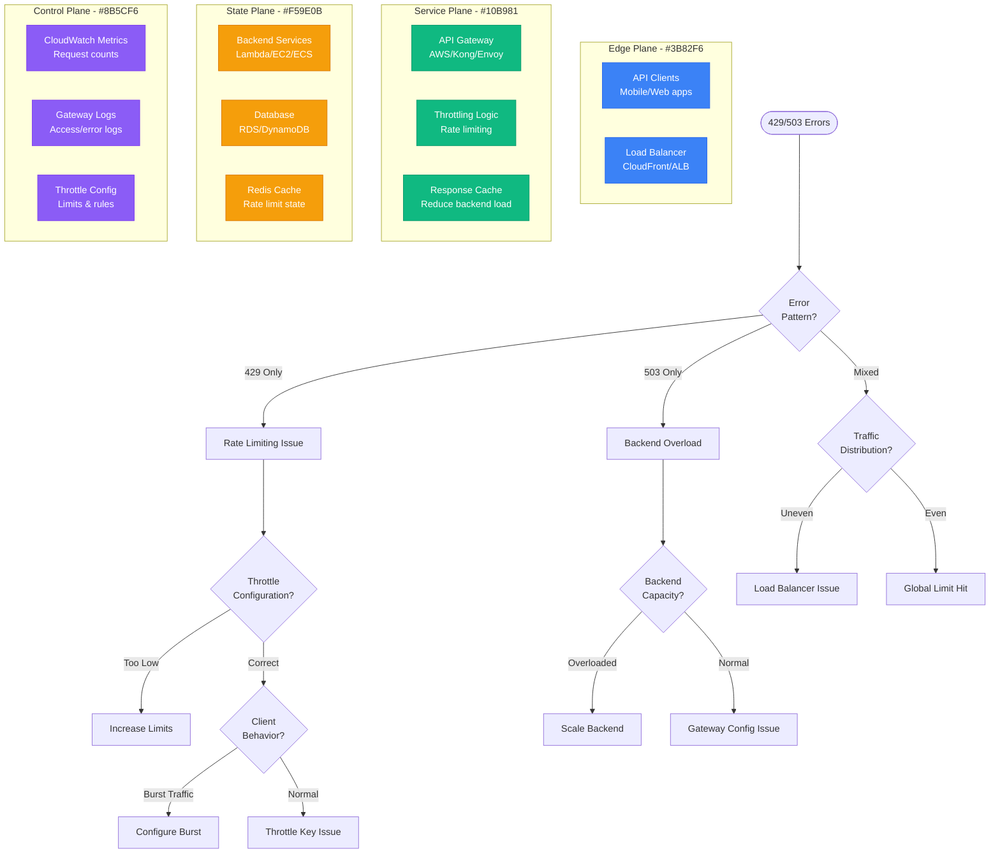

# API Gateway Throttling Debugging

## Overview

API Gateway throttling issues cause legitimate requests to be rejected with 429 (Too Many Requests) or 503 (Service Unavailable) errors, impacting application availability and user experience. This guide provides systematic debugging for throttling problems across AWS API Gateway, Kong, and other gateway solutions.

## Immediate Symptoms Checklist

- [ ] HTTP 429 "Too Many Requests" errors from clients
- [ ] HTTP 503 "Service Unavailable" responses
- [ ] Request latency spikes during throttling
- [ ] Legitimate traffic being rejected
- [ ] Inconsistent throttling behavior across endpoints
- [ ] Backend services not receiving requests

## API Gateway Throttling Debug Flow



## Step-by-Step Debugging Process

### Phase 1: Error Pattern Analysis (< 3 minutes)

```bash
# 1. Check error distribution in CloudWatch
aws logs filter-log-events \
  --log-group-name API-Gateway-Execution-Logs_<api-id>/<stage> \
  --start-time $(date -d '1 hour ago' +%s)000 \
  --filter-pattern '[timestamp, request_id, ip, user, timestamp, method, resource, protocol, status=429]'

# 2. Analyze throttling metrics
aws cloudwatch get-metric-statistics \
  --namespace AWS/ApiGateway \
  --metric-name ThrottledRequests \
  --dimensions Name=ApiName,Value=<api-name> \
  --start-time $(date -d '1 hour ago' -u +%Y-%m-%dT%H:%M:%S) \
  --end-time $(date -u +%Y-%m-%dT%H:%M:%S) \
  --period 300 \
  --statistics Sum

# 3. Check client error patterns
aws cloudwatch get-metric-statistics \
  --namespace AWS/ApiGateway \
  --metric-name 4XXError \
  --dimensions Name=ApiName,Value=<api-name> \
  --start-time $(date -d '1 hour ago' -u +%Y-%m-%dT%H:%M:%S) \
  --end-time $(date -u +%Y-%m-%dT%H:%M:%S) \
  --period 300 \
  --statistics Sum
```

**Error Pattern Examples:**
```
# Sudden throttling spike (traffic burst)
429 errors: 0 → 1000 → 0 (within 5 minutes)

# Gradual throttling increase (capacity issue)
429 errors: 10 → 50 → 200 → 500 (over 30 minutes)

# Consistent throttling (misconfigured limits)
429 errors: ~100/minute consistently
```

### Phase 2: Throttling Configuration Review (< 5 minutes)

**AWS API Gateway:**
```bash
# 1. Check API-level throttling
aws apigateway get-rest-api --rest-api-id <api-id> | \
  jq '.policy, .throttleSettings'

# 2. Check stage-level throttling
aws apigateway get-stage --rest-api-id <api-id> --stage-name <stage> | \
  jq '.throttleSettings'

# 3. Check method-level throttling
aws apigateway get-method \
  --rest-api-id <api-id> \
  --resource-id <resource-id> \
  --http-method <method> | \
  jq '.throttleSettings'

# 4. Check usage plans
aws apigateway get-usage-plans | \
  jq '.items[] | {name: .name, throttle: .throttle, quota: .quota}'
```

**Kong Gateway:**
```bash
# 1. Check global rate limiting plugin
curl -X GET http://kong-admin:8001/plugins | jq '.data[] | select(.name=="rate-limiting")'

# 2. Check service-specific rate limits
curl -X GET http://kong-admin:8001/services/<service>/plugins | \
  jq '.data[] | select(.name=="rate-limiting")'

# 3. Check route-specific rate limits
curl -X GET http://kong-admin:8001/routes/<route>/plugins | \
  jq '.data[] | select(.name=="rate-limiting")'
```

### Phase 3: Traffic Analysis (< 5 minutes)

```bash
# 1. Analyze request patterns
aws logs filter-log-events \
  --log-group-name API-Gateway-Execution-Logs_<api-id>/<stage> \
  --start-time $(date -d '30 minutes ago' +%s)000 \
  --filter-pattern '[timestamp, request_id, ip, user, timestamp, method, resource, protocol, status]' | \
  jq -r '.events[].message' | \
  awk '{print $3, $6, $7}' | sort | uniq -c | sort -nr | head -20

# 2. Check request rate over time
aws logs filter-log-events \
  --log-group-name API-Gateway-Execution-Logs_<api-id>/<stage> \
  --start-time $(date -d '1 hour ago' +%s)000 | \
  jq -r '.events[].message' | \
  awk '{print substr($1, 2, 16)}' | sort | uniq -c

# 3. Identify top clients by IP
aws logs filter-log-events \
  --log-group-name API-Gateway-Execution-Logs_<api-id>/<stage> \
  --start-time $(date -d '30 minutes ago' +%s)000 | \
  jq -r '.events[].message' | \
  awk '{print $3}' | sort | uniq -c | sort -nr | head -10
```

## Common Root Causes and Solutions

### 1. Misconfigured Rate Limits (45% of cases)

**Symptoms:**
- Legitimate traffic being throttled
- Limits set too low for actual usage
- No burst capacity configured

**Root Cause Examples:**
```json
// AWS API Gateway - Too restrictive
{
  "throttleSettings": {
    "rateLimit": 100,    // 100 requests/second
    "burstLimit": 50     // Only 50 burst capacity
  }
}

// Traffic pattern: 150 RPS with bursts to 300 RPS
// Result: Constant throttling despite normal traffic
```

**Solutions:**

**Option 1: Adjust Rate Limits Based on Actual Usage**
```bash
# Analyze current traffic patterns
aws cloudwatch get-metric-statistics \
  --namespace AWS/ApiGateway \
  --metric-name Count \
  --dimensions Name=ApiName,Value=<api-name> \
  --start-time $(date -d '24 hours ago' -u +%Y-%m-%dT%H:%M:%S) \
  --end-time $(date -u +%Y-%m-%dT%H:%M:%S) \
  --period 3600 \
  --statistics Maximum,Average

# Calculate appropriate limits
# Rule of thumb: Set rate limit to P95 traffic + 50% buffer
# Set burst limit to 2-3x rate limit

# Update stage throttling
aws apigateway update-stage \
  --rest-api-id <api-id> \
  --stage-name <stage> \
  --patch-ops op=replace,path=/throttle/rateLimit,value=500 \
               op=replace,path=/throttle/burstLimit,value=1000

# Deploy changes
aws apigateway create-deployment \
  --rest-api-id <api-id> \
  --stage-name <stage>
```

**Option 2: Implement Tiered Rate Limiting**
```json
// Usage plan with different tiers
{
  "usagePlans": [
    {
      "name": "Basic",
      "throttle": {
        "rateLimit": 100,
        "burstLimit": 200
      },
      "quota": {
        "limit": 10000,
        "period": "DAY"
      }
    },
    {
      "name": "Premium",
      "throttle": {
        "rateLimit": 1000,
        "burstLimit": 2000
      },
      "quota": {
        "limit": 100000,
        "period": "DAY"
      }
    }
  ]
}
```

**Option 3: Dynamic Rate Limiting**
```python
# Lambda function for dynamic rate limiting
import json
import boto3
import time

def lambda_handler(event, context):
    cloudwatch = boto3.client('cloudwatch')
    api_gateway = boto3.client('apigateway')

    # Get current error rate
    response = cloudwatch.get_metric_statistics(
        Namespace='AWS/ApiGateway',
        MetricName='4XXError',
        Dimensions=[{'Name': 'ApiName', 'Value': 'my-api'}],
        StartTime=time.time() - 300,  # Last 5 minutes
        EndTime=time.time(),
        Period=300,
        Statistics=['Sum']
    )

    error_rate = response['Datapoints'][0]['Sum'] if response['Datapoints'] else 0

    # Adjust throttling based on error rate
    if error_rate > 100:  # High error rate
        new_rate_limit = 200  # Reduce limits
        new_burst_limit = 300
    elif error_rate < 10:  # Low error rate
        new_rate_limit = 800  # Increase limits
        new_burst_limit = 1200
    else:
        return  # No change needed

    # Update API Gateway throttling
    api_gateway.update_stage(
        restApiId='your-api-id',
        stageName='prod',
        patchOps=[
            {
                'op': 'replace',
                'path': '/throttle/rateLimit',
                'value': str(new_rate_limit)
            },
            {
                'op': 'replace',
                'path': '/throttle/burstLimit',
                'value': str(new_burst_limit)
            }
        ]
    )

    return {
        'statusCode': 200,
        'body': json.dumps(f'Updated rate limit to {new_rate_limit}')
    }
```

### 2. Backend Service Overload (25% of cases)

**Symptoms:**
- 503 Service Unavailable errors
- Backend timeouts causing gateway throttling
- High backend latency triggering protective throttling

**Root Cause Analysis:**
```bash
# Check backend response times
aws cloudwatch get-metric-statistics \
  --namespace AWS/ApiGateway \
  --metric-name IntegrationLatency \
  --dimensions Name=ApiName,Value=<api-name> \
  --start-time $(date -d '1 hour ago' -u +%Y-%m-%dT%H:%M:%S) \
  --end-time $(date -u +%Y-%m-%dT%H:%M:%S) \
  --period 300 \
  --statistics Average,Maximum

# Check backend error rates
aws cloudwatch get-metric-statistics \
  --namespace AWS/ApiGateway \
  --metric-name 5XXError \
  --dimensions Name=ApiName,Value=<api-name> \
  --start-time $(date -d '1 hour ago' -u +%Y-%m-%dT%H:%M:%S) \
  --end-time $(date -u +%Y-%m-%dT%H:%M:%S) \
  --period 300 \
  --statistics Sum
```

**Solutions:**

**Option 1: Backend Auto-Scaling**
```yaml
# ECS Service Auto-Scaling
apiVersion: v1
kind: Service
metadata:
  name: backend-service
spec:
  selector:
    app: backend
  ports:
  - port: 80
    targetPort: 8080
---
apiVersion: apps/v1
kind: Deployment
metadata:
  name: backend
spec:
  replicas: 3
  template:
    spec:
      containers:
      - name: backend
        image: backend:latest
        resources:
          requests:
            cpu: 200m
            memory: 256Mi
          limits:
            cpu: 500m
            memory: 512Mi
---
apiVersion: autoscaling/v2
kind: HorizontalPodAutoscaler
metadata:
  name: backend-hpa
spec:
  scaleTargetRef:
    apiVersion: apps/v1
    kind: Deployment
    name: backend
  minReplicas: 3
  maxReplicas: 20
  metrics:
  - type: Resource
    resource:
      name: cpu
      target:
        type: Utilization
        averageUtilization: 70
  - type: Resource
    resource:
      name: memory
      target:
        type: Utilization
        averageUtilization: 80
```

**Option 2: Circuit Breaker Pattern**
```json
// API Gateway with circuit breaker
{
  "x-amazon-apigateway-integration": {
    "type": "http_proxy",
    "httpMethod": "POST",
    "uri": "http://backend-service",
    "connectionType": "VPC_LINK",
    "connectionId": "vpc-link-id",
    "requestParameters": {},
    "timeoutInMillis": 5000,
    "responses": {
      "5\\d{2}": {
        "statusCode": "503",
        "responseTemplates": {
          "application/json": "{\"error\": \"Service temporarily unavailable\"}"
        }
      }
    }
  }
}
```

**Option 3: Caching Strategy**
```bash
# Enable API Gateway caching
aws apigateway put-method \
  --rest-api-id <api-id> \
  --resource-id <resource-id> \
  --http-method GET \
  --authorization-type NONE \
  --request-parameters method.request.querystring.id=false

aws apigateway put-integration \
  --rest-api-id <api-id> \
  --resource-id <resource-id> \
  --http-method GET \
  --type HTTP_PROXY \
  --integration-http-method GET \
  --uri http://backend-service \
  --cache-key-parameters method.request.querystring.id \
  --cache-namespace cache-namespace

# Configure cache settings
aws apigateway update-stage \
  --rest-api-id <api-id> \
  --stage-name prod \
  --patch-ops op=replace,path=/cacheClusterEnabled,value=true \
               op=replace,path=/cacheClusterSize,value=1.6 \
               op=replace,path=/cacheTtlInSeconds,value=300
```

### 3. Client Identification Issues (20% of cases)

**Symptoms:**
- Shared rate limits across different clients
- API keys not properly identifying clients
- IP-based throttling affecting legitimate users

**Root Cause Examples:**
```
# Problem: All clients share same rate limit
Client A (mobile app): 1000 requests/minute
Client B (web app): 500 requests/minute
Client C (partner API): 2000 requests/minute
Total: 3500 requests/minute > 1000 limit = throttling
```

**Solutions:**

**Option 1: API Key-Based Throttling**
```bash
# Create API keys for different clients
aws apigateway create-api-key \
  --name mobile-app-key \
  --description "Mobile app API key" \
  --enabled

aws apigateway create-api-key \
  --name web-app-key \
  --description "Web app API key" \
  --enabled

# Create usage plans with different limits
aws apigateway create-usage-plan \
  --name mobile-usage-plan \
  --throttle rateLimit=500,burstLimit=1000 \
  --quota limit=50000,period=DAY \
  --api-stages restApiId=<api-id>,stage=prod

aws apigateway create-usage-plan \
  --name web-usage-plan \
  --throttle rateLimit=200,burstLimit=400 \
  --quota limit=20000,period=DAY \
  --api-stages restApiId=<api-id>,stage=prod

# Associate API keys with usage plans
aws apigateway create-usage-plan-key \
  --usage-plan-id <mobile-usage-plan-id> \
  --key-id <mobile-api-key-id> \
  --key-type API_KEY
```

**Option 2: Custom Authorizer with Client Identification**
```python
# Lambda authorizer for custom client identification
import json
import jwt

def lambda_handler(event, context):
    token = event['authorizationToken']

    try:
        # Decode JWT token to get client info
        payload = jwt.decode(token, 'your-secret', algorithms=['HS256'])
        client_id = payload.get('client_id')
        client_type = payload.get('client_type')

        # Set different throttling based on client type
        throttle_config = {
            'mobile': {'rate': 1000, 'burst': 2000},
            'web': {'rate': 500, 'burst': 1000},
            'partner': {'rate': 2000, 'burst': 4000},
            'default': {'rate': 100, 'burst': 200}
        }

        config = throttle_config.get(client_type, throttle_config['default'])

        policy = {
            'principalId': client_id,
            'policyDocument': {
                'Version': '2012-10-17',
                'Statement': [{
                    'Action': 'execute-api:Invoke',
                    'Effect': 'Allow',
                    'Resource': event['methodArn']
                }]
            },
            'context': {
                'clientId': client_id,
                'clientType': client_type,
                'rateLimit': config['rate'],
                'burstLimit': config['burst']
            }
        }

        return policy

    except Exception as e:
        raise Exception('Unauthorized')
```

### 4. Distributed Rate Limiting Issues (10% of cases)

**Symptoms:**
- Inconsistent throttling across multiple API Gateway instances
- Rate limit state not synchronized
- Burst traffic overwhelming single instances

**Solutions:**

**Option 1: Redis-Based Distributed Rate Limiting**
```python
# Kong plugin for distributed rate limiting
import redis
import time
import json

class DistributedRateLimiter:
    def __init__(self, redis_host='localhost', redis_port=6379):
        self.redis_client = redis.Redis(host=redis_host, port=redis_port, decode_responses=True)

    def is_allowed(self, key, limit, window_size=60):
        """
        Sliding window rate limiting with Redis
        """
        current_time = time.time()
        pipeline = self.redis_client.pipeline()

        # Remove expired entries
        pipeline.zremrangebyscore(key, 0, current_time - window_size)

        # Count current requests
        pipeline.zcard(key)

        # Add current request
        pipeline.zadd(key, {str(current_time): current_time})

        # Set expiration
        pipeline.expire(key, window_size)

        results = pipeline.execute()
        current_count = results[1]

        return current_count < limit

# Usage in API Gateway Lambda
def lambda_handler(event, context):
    rate_limiter = DistributedRateLimiter()

    # Extract client identifier
    client_id = event['requestContext']['identity']['apiKey']
    endpoint = event['requestContext']['resourcePath']

    # Create rate limiting key
    rate_key = f"rate_limit:{client_id}:{endpoint}"

    # Check rate limit (100 requests per minute)
    if not rate_limiter.is_allowed(rate_key, 100, 60):
        return {
            'statusCode': 429,
            'body': json.dumps({'error': 'Rate limit exceeded'})
        }

    # Process request
    return {
        'statusCode': 200,
        'body': json.dumps({'message': 'Request processed'})
    }
```

## Critical Monitoring and Alerting

### Throttling Metrics Dashboard

```bash
# CloudWatch dashboard for API Gateway throttling
aws cloudwatch put-dashboard \
  --dashboard-name "API-Gateway-Throttling" \
  --dashboard-body '{
    "widgets": [
      {
        "type": "metric",
        "properties": {
          "metrics": [
            ["AWS/ApiGateway", "Count", "ApiName", "your-api"],
            [".", "4XXError", ".", "."],
            [".", "5XXError", ".", "."],
            [".", "ThrottledRequests", ".", "."]
          ],
          "period": 300,
          "stat": "Sum",
          "region": "us-east-1",
          "title": "API Gateway Requests and Errors"
        }
      },
      {
        "type": "metric",
        "properties": {
          "metrics": [
            ["AWS/ApiGateway", "Latency", "ApiName", "your-api"],
            [".", "IntegrationLatency", ".", "."]
          ],
          "period": 300,
          "stat": "Average",
          "region": "us-east-1",
          "title": "API Gateway Latency"
        }
      }
    ]
  }'
```

### Automated Throttling Alerts

```bash
# CloudWatch alarm for high throttling rate
aws cloudwatch put-metric-alarm \
  --alarm-name "API-Gateway-High-Throttling" \
  --alarm-description "Alert when throttling rate is high" \
  --metric-name ThrottledRequests \
  --namespace AWS/ApiGateway \
  --statistic Sum \
  --period 300 \
  --threshold 100 \
  --comparison-operator GreaterThanThreshold \
  --evaluation-periods 2 \
  --alarm-actions arn:aws:sns:us-east-1:123456789012:api-gateway-alerts \
  --dimensions Name=ApiName,Value=your-api

# CloudWatch alarm for error rate spike
aws cloudwatch put-metric-alarm \
  --alarm-name "API-Gateway-High-Error-Rate" \
  --alarm-description "Alert when 4XX error rate is high" \
  --metric-name 4XXError \
  --namespace AWS/ApiGateway \
  --statistic Sum \
  --period 300 \
  --threshold 50 \
  --comparison-operator GreaterThanThreshold \
  --evaluation-periods 1 \
  --alarm-actions arn:aws:sns:us-east-1:123456789012:api-gateway-alerts \
  --dimensions Name=ApiName,Value=your-api
```

## Production Example: Stripe's API Rate Limiting

**Problem:** Payment API experiencing throttling during Black Friday traffic surge

**Initial Metrics:**
- 300% traffic increase over normal levels
- 25% of requests receiving 429 errors
- Customer payment failures increasing

**Root Causes:**
1. Static rate limits not accounting for traffic surges
2. No differentiation between critical vs non-critical endpoints
3. Shared rate limits across different client types

**Solution Implementation:**
```json
{
  "tieredRateLimiting": {
    "critical_endpoints": {
      "/payments": {
        "rate": 10000,
        "burst": 20000,
        "priority": 1
      },
      "/refunds": {
        "rate": 5000,
        "burst": 10000,
        "priority": 1
      }
    },
    "standard_endpoints": {
      "/customers": {
        "rate": 2000,
        "burst": 4000,
        "priority": 2
      },
      "/products": {
        "rate": 1000,
        "burst": 2000,
        "priority": 3
      }
    }
  },
  "clientTypes": {
    "enterprise": {
      "multiplier": 5.0
    },
    "standard": {
      "multiplier": 1.0
    },
    "developer": {
      "multiplier": 0.1
    }
  }
}
```

**Results:**
- 429 error rate reduced from 25% to <1%
- Payment success rate increased to 99.9%
- Critical endpoints maintained priority during surge
- $50M+ in prevented revenue loss

## Emergency Response Playbook

### Immediate Actions (< 2 minutes)

1. **Check Current Throttling Rate:**
   ```bash
   aws cloudwatch get-metric-statistics \
     --namespace AWS/ApiGateway \
     --metric-name ThrottledRequests \
     --dimensions Name=ApiName,Value=<api-name> \
     --start-time $(date -d '15 minutes ago' -u +%Y-%m-%dT%H:%M:%S) \
     --end-time $(date -u +%Y-%m-%dT%H:%M:%S) \
     --period 60 \
     --statistics Sum
   ```

2. **Identify Top Error Sources:**
   ```bash
   aws logs filter-log-events \
     --log-group-name API-Gateway-Execution-Logs_<api-id>/<stage> \
     --start-time $(date -d '10 minutes ago' +%s)000 \
     --filter-pattern '[timestamp, request_id, ip, user, timestamp, method, resource, protocol, status=429]' \
     --max-items 20
   ```

### Short-term Mitigation (< 10 minutes)

1. **Temporarily Increase Rate Limits:**
   ```bash
   aws apigateway update-stage \
     --rest-api-id <api-id> \
     --stage-name <stage> \
     --patch-ops op=replace,path=/throttle/rateLimit,value=2000 \
                  op=replace,path=/throttle/burstLimit,value=4000
   ```

2. **Enable Caching for Non-Critical Endpoints:**
   ```bash
   aws apigateway update-stage \
     --rest-api-id <api-id> \
     --stage-name <stage> \
     --patch-ops op=replace,path=/cacheClusterEnabled,value=true
   ```

3. **Deploy Changes:**
   ```bash
   aws apigateway create-deployment \
     --rest-api-id <api-id> \
     --stage-name <stage>
   ```

### Long-term Solutions

1. **Implement Dynamic Rate Limiting:**
   - Auto-scaling based on traffic patterns
   - Machine learning-based limit adjustment
   - Client behavior analysis

2. **Enhanced Monitoring:**
   - Real-time throttling dashboards
   - Predictive alerting
   - Client-specific metrics

3. **Architecture Improvements:**
   - Multiple API Gateway instances
   - Regional distribution
   - Improved caching strategies

## Related Debugging Guides

- [Load Balancer Debugging](/debugging/load-balancer-debugging)
- [Lambda Cold Start Debugging](/debugging/lambda-cold-starts-performance)
- [CloudFront Cache Issues](/debugging/cloudfront-invalidation-debugging)