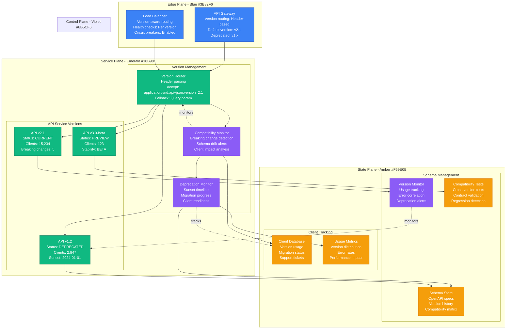
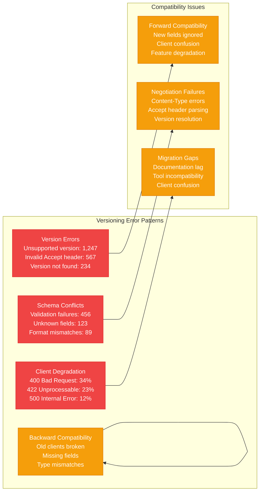
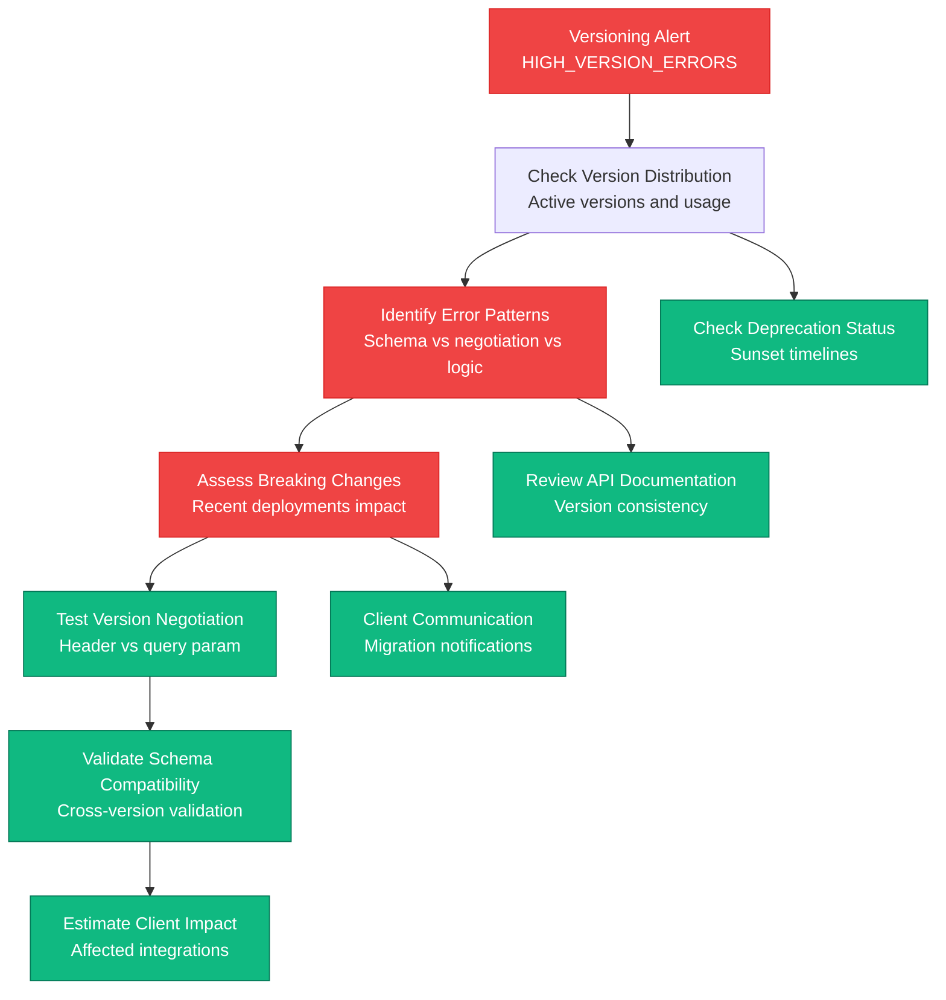
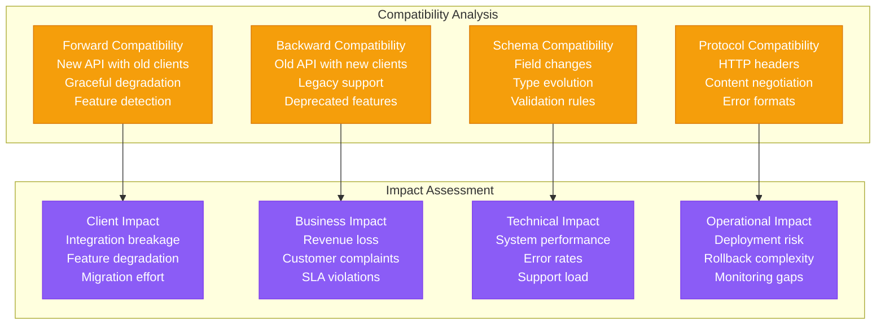
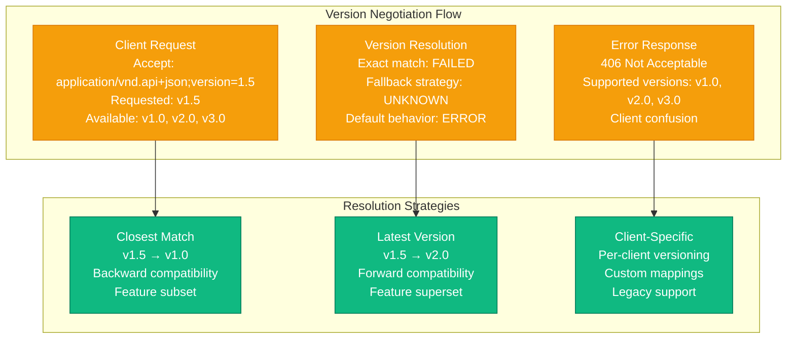
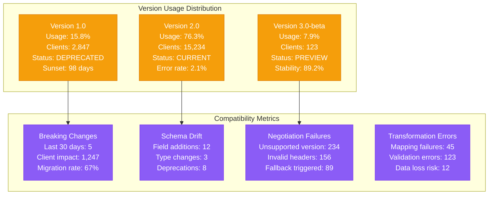

# API Versioning Conflicts Production Debugging

## Overview

API versioning conflicts can break client applications, cause data corruption, and disrupt business operations. When different API versions are incompatible or when version negotiation fails, it leads to client errors, service degradation, and integration failures. This guide provides systematic approaches to debug API versioning conflicts based on real production incidents.

## Real Incident: Stripe's 2018 API Version Breaking Change

**Impact**: 6-hour partial outage affecting payment integrations
**Root Cause**: Breaking change in API version 2018-02-28 caused mass client failures
**Affected Clients**: 15k integration partners, 2.3M payment requests failed
**Recovery Time**: 6 hours (version rollback + client updates)
**Cost**: ~$4.2M in failed payments + customer compensation

## Architecture Overview



## Detection Signals

### Primary Indicators


### Detection Commands
```bash
# 1. Check API version usage distribution
curl -s "https://api.company.com/metrics/versions" | jq '.version_distribution'

# 2. Test version negotiation
curl -H "Accept: application/vnd.api+json;version=1.0" https://api.company.com/users
curl -H "Accept: application/vnd.api+json;version=2.0" https://api.company.com/users
curl -H "Accept: application/vnd.api+json;version=3.0" https://api.company.com/users

# 3. Schema validation test
curl -X POST -H "Content-Type: application/json" \
  -H "Accept: application/vnd.api+json;version=2.1" \
  -d '{"name":"test","email":"test@example.com"}' \
  https://api.company.com/users

# 4. Check deprecation warnings
curl -I https://api.company.com/users?version=1.0 | grep -i "deprecation\|sunset"
```

## Debugging Workflow

### Phase 1: Version Conflict Assessment (0-5 minutes)



### Phase 2: Compatibility Analysis (5-15 minutes)



## Common Versioning Conflict Scenarios

### Scenario 1: Breaking Schema Change

```mermaid
graph LR
    subgraph BreakingChange[Breaking Schema Change]
        V1S[API v1.2 Schema<br/>user.phone: string<br/>user.email: string<br/>user.name: string]

        V2S[API v2.0 Schema<br/>user.phone: object {country, number}<br/>user.email: string (required)<br/>user.fullName: string]

        BC[Breaking Changes<br/>phone field: string → object<br/>name → fullName<br/>email: optional → required]
    end

    subgraph ClientImpact[Client Impact]
        OC[Old Clients (v1.2)<br/>phone parsing fails<br/>name field missing<br/>validation errors]

        NC[New Clients (v2.0)<br/>Enhanced features<br/>Better validation<br/>Improved UX]

        MC[Mixed Clients<br/>Some work, some break<br/>Inconsistent behavior<br/>Support overhead]
    end

    V1S --> OC
    V2S --> NC
    BC --> MC

    classDef changeStyle fill:#EF4444,stroke:#DC2626,color:#fff
    classDef impactStyle fill:#F59E0B,stroke:#D97706,color:#fff

    class V1S,V2S,BC changeStyle
    class OC,NC,MC impactStyle
```

### Scenario 2: Version Negotiation Failure



## Recovery Procedures

### API Version Compatibility Layer

```python
#!/usr/bin/env python3
"""
API Version Compatibility Manager
Handles version conflicts and transformations
"""

import json
import re
from typing import Dict, Any, Optional, List
from dataclasses import dataclass
from datetime import datetime, timedelta
import logging

logging.basicConfig(level=logging.INFO)
logger = logging.getLogger(__name__)

@dataclass
class APIVersion:
    version: str
    status: str  # current, deprecated, sunset, preview
    sunset_date: Optional[datetime]
    breaking_changes: List[str]
    schema: Dict[str, Any]

class VersionCompatibilityManager:
    def __init__(self):
        self.versions = {}
        self.transformation_rules = {}
        self.deprecation_warnings = {}
        self.load_version_configurations()

    def load_version_configurations(self):
        """Load API version configurations"""
        # Version 1.0 - Legacy
        self.versions["1.0"] = APIVersion(
            version="1.0",
            status="deprecated",
            sunset_date=datetime(2024, 1, 1),
            breaking_changes=[],
            schema={
                "user": {
                    "type": "object",
                    "properties": {
                        "id": {"type": "integer"},
                        "name": {"type": "string"},
                        "email": {"type": "string"},
                        "phone": {"type": "string"},
                        "created_at": {"type": "string", "format": "date-time"}
                    }
                }
            }
        )

        # Version 2.0 - Current
        self.versions["2.0"] = APIVersion(
            version="2.0",
            status="current",
            sunset_date=None,
            breaking_changes=[
                "phone field changed from string to object",
                "name field renamed to full_name",
                "email field now required"
            ],
            schema={
                "user": {
                    "type": "object",
                    "properties": {
                        "id": {"type": "integer"},
                        "full_name": {"type": "string"},
                        "email": {"type": "string", "required": True},
                        "phone": {
                            "type": "object",
                            "properties": {
                                "country_code": {"type": "string"},
                                "number": {"type": "string"}
                            }
                        },
                        "created_at": {"type": "string", "format": "date-time"}
                    }
                }
            }
        )

        # Version 3.0 - Preview
        self.versions["3.0"] = APIVersion(
            version="3.0",
            status="preview",
            sunset_date=None,
            breaking_changes=[
                "id field changed from integer to UUID string",
                "timestamps now include timezone",
                "nested resource relationships"
            ],
            schema={
                "user": {
                    "type": "object",
                    "properties": {
                        "id": {"type": "string", "format": "uuid"},
                        "full_name": {"type": "string"},
                        "email": {"type": "string", "required": True},
                        "phone": {
                            "type": "object",
                            "properties": {
                                "country_code": {"type": "string"},
                                "number": {"type": "string"}
                            }
                        },
                        "created_at": {"type": "string", "format": "date-time"},
                        "profile": {
                            "type": "object",
                            "properties": {
                                "avatar_url": {"type": "string"},
                                "bio": {"type": "string"}
                            }
                        }
                    }
                }
            }
        )

        # Define transformation rules
        self.transformation_rules = {
            ("1.0", "2.0"): self.transform_v1_to_v2,
            ("2.0", "1.0"): self.transform_v2_to_v1,
            ("2.0", "3.0"): self.transform_v2_to_v3,
            ("3.0", "2.0"): self.transform_v3_to_v2
        }

    def parse_version_header(self, accept_header: str) -> Optional[str]:
        """Parse version from Accept header"""
        # Accept: application/vnd.api+json;version=2.0
        version_pattern = r'version=([0-9]+\.[0-9]+)'
        match = re.search(version_pattern, accept_header)
        return match.group(1) if match else None

    def negotiate_version(self, requested_version: str, available_versions: List[str]) -> str:
        """Negotiate the best version to use"""
        if requested_version in available_versions:
            return requested_version

        # Try to find closest compatible version
        requested_major, requested_minor = map(int, requested_version.split('.'))

        compatible_versions = []
        for version in available_versions:
            major, minor = map(int, version.split('.'))

            # Backward compatibility: can use older major.minor
            if major <= requested_major:
                if major < requested_major or minor <= requested_minor:
                    compatible_versions.append((version, major, minor))

        if compatible_versions:
            # Return the highest compatible version
            compatible_versions.sort(key=lambda x: (x[1], x[2]), reverse=True)
            return compatible_versions[0][0]

        # Default to latest available
        available_versions.sort(key=lambda x: tuple(map(int, x.split('.'))), reverse=True)
        return available_versions[0]

    def transform_v1_to_v2(self, data: Dict[str, Any]) -> Dict[str, Any]:
        """Transform v1.0 data to v2.0 format"""
        transformed = data.copy()

        if 'name' in transformed:
            transformed['full_name'] = transformed.pop('name')

        if 'phone' in transformed and isinstance(transformed['phone'], str):
            # Parse phone string into object (simplified)
            phone_str = transformed['phone']
            if phone_str.startswith('+'):
                # Extract country code and number
                country_code = phone_str[:3]
                number = phone_str[3:]
                transformed['phone'] = {
                    'country_code': country_code,
                    'number': number
                }
            else:
                transformed['phone'] = {
                    'country_code': '+1',
                    'number': phone_str
                }

        return transformed

    def transform_v2_to_v1(self, data: Dict[str, Any]) -> Dict[str, Any]:
        """Transform v2.0 data to v1.0 format"""
        transformed = data.copy()

        if 'full_name' in transformed:
            transformed['name'] = transformed.pop('full_name')

        if 'phone' in transformed and isinstance(transformed['phone'], dict):
            # Convert phone object to string
            phone_obj = transformed['phone']
            country_code = phone_obj.get('country_code', '+1')
            number = phone_obj.get('number', '')
            transformed['phone'] = f"{country_code}{number}"

        # Remove fields not supported in v1.0
        unsupported_fields = ['profile']
        for field in unsupported_fields:
            transformed.pop(field, None)

        return transformed

    def transform_v2_to_v3(self, data: Dict[str, Any]) -> Dict[str, Any]:
        """Transform v2.0 data to v3.0 format"""
        transformed = data.copy()

        # Convert integer ID to UUID (simplified)
        if 'id' in transformed and isinstance(transformed['id'], int):
            # In real implementation, maintain ID mapping
            transformed['id'] = f"uuid-{transformed['id']:08d}-0000-0000-0000-000000000000"

        # Add default profile if not present
        if 'profile' not in transformed:
            transformed['profile'] = {
                'avatar_url': None,
                'bio': None
            }

        return transformed

    def transform_v3_to_v2(self, data: Dict[str, Any]) -> Dict[str, Any]:
        """Transform v3.0 data to v2.0 format"""
        transformed = data.copy()

        # Convert UUID back to integer (simplified)
        if 'id' in transformed and isinstance(transformed['id'], str):
            if transformed['id'].startswith('uuid-'):
                # Extract integer from UUID
                id_part = transformed['id'].split('-')[1]
                transformed['id'] = int(id_part)

        # Remove v3.0 specific fields
        transformed.pop('profile', None)

        return transformed

    def apply_transformation(self, data: Dict[str, Any],
                           from_version: str, to_version: str) -> Dict[str, Any]:
        """Apply version transformation"""
        if from_version == to_version:
            return data

        transform_key = (from_version, to_version)
        if transform_key in self.transformation_rules:
            logger.info(f"Transforming data from {from_version} to {to_version}")
            return self.transformation_rules[transform_key](data)
        else:
            logger.warning(f"No transformation rule for {from_version} to {to_version}")
            return data

    def validate_schema(self, data: Dict[str, Any], version: str) -> List[str]:
        """Validate data against version schema"""
        errors = []

        if version not in self.versions:
            errors.append(f"Unknown version: {version}")
            return errors

        schema = self.versions[version].schema.get('user', {})
        properties = schema.get('properties', {})

        # Check required fields
        for field, field_schema in properties.items():
            if field_schema.get('required', False) and field not in data:
                errors.append(f"Missing required field: {field}")

        # Check field types
        for field, value in data.items():
            if field in properties:
                expected_type = properties[field].get('type')
                actual_type = type(value).__name__

                type_mapping = {
                    'str': 'string',
                    'int': 'integer',
                    'dict': 'object',
                    'list': 'array'
                }

                expected_python_type = type_mapping.get(expected_type, expected_type)
                if expected_python_type != actual_type:
                    errors.append(f"Type mismatch for {field}: expected {expected_type}, got {actual_type}")

        return errors

    def get_deprecation_warning(self, version: str) -> Optional[str]:
        """Get deprecation warning for version"""
        if version not in self.versions:
            return None

        version_info = self.versions[version]
        if version_info.status == 'deprecated' and version_info.sunset_date:
            days_until_sunset = (version_info.sunset_date - datetime.now()).days
            return f"API version {version} is deprecated. Sunset date: {version_info.sunset_date.strftime('%Y-%m-%d')} ({days_until_sunset} days remaining)"

        return None

    def handle_version_conflict(self, requested_version: str,
                              data: Dict[str, Any]) -> tuple[str, Dict[str, Any], List[str]]:
        """Handle version conflict and return resolved version, transformed data, and warnings"""
        available_versions = list(self.versions.keys())
        resolved_version = self.negotiate_version(requested_version, available_versions)

        warnings = []

        # Add deprecation warning if needed
        deprecation_warning = self.get_deprecation_warning(resolved_version)
        if deprecation_warning:
            warnings.append(deprecation_warning)

        # Transform data if needed
        if requested_version != resolved_version:
            warnings.append(f"Requested version {requested_version} not available, using {resolved_version}")
            transformed_data = self.apply_transformation(data, requested_version, resolved_version)
        else:
            transformed_data = data

        # Validate transformed data
        validation_errors = self.validate_schema(transformed_data, resolved_version)
        warnings.extend(validation_errors)

        return resolved_version, transformed_data, warnings

# Flask application example
from flask import Flask, request, jsonify

app = Flask(__name__)
version_manager = VersionCompatibilityManager()

@app.route('/users', methods=['GET', 'POST'])
def users_endpoint():
    """Example API endpoint with version handling"""

    # Parse requested version
    accept_header = request.headers.get('Accept', '')
    requested_version = version_manager.parse_version_header(accept_header)

    # Default to version from query parameter or latest
    if not requested_version:
        requested_version = request.args.get('version', '2.0')

    try:
        if request.method == 'POST':
            data = request.get_json()

            # Handle version conflict
            resolved_version, transformed_data, warnings = version_manager.handle_version_conflict(
                requested_version, data
            )

            # Process the data (simplified)
            response_data = {
                'id': 12345,
                'status': 'created',
                'data': transformed_data
            }

            # Build response
            response = jsonify(response_data)
            response.headers['API-Version'] = resolved_version

            # Add warnings as headers
            if warnings:
                response.headers['API-Warnings'] = '; '.join(warnings)

            return response

        else:  # GET
            # Return sample data in requested version format
            sample_data = {
                'id': 12345,
                'full_name': 'John Doe',
                'email': 'john@example.com',
                'phone': {
                    'country_code': '+1',
                    'number': '5551234567'
                },
                'created_at': '2023-09-21T10:30:00Z'
            }

            # Transform to requested version
            resolved_version, transformed_data, warnings = version_manager.handle_version_conflict(
                requested_version, sample_data
            )

            response = jsonify(transformed_data)
            response.headers['API-Version'] = resolved_version

            if warnings:
                response.headers['API-Warnings'] = '; '.join(warnings)

            return response

    except Exception as e:
        logger.error(f"Error handling version conflict: {e}")
        return jsonify({
            'error': 'Version conflict resolution failed',
            'message': str(e)
        }), 500

if __name__ == '__main__':
    app.run(debug=True)
```

## Monitoring and Prevention

### API Version Health Dashboard



## Real Production Examples

### Stripe's 2018 API Version Breaking Change
- **Duration**: 6 hours of partial outage affecting payment integrations
- **Root Cause**: Breaking change in API version 2018-02-28 caused mass client failures
- **Impact**: 15k integration partners, 2.3M payment requests failed
- **Recovery**: Version rollback + client update guidance + compensation
- **Prevention**: Enhanced compatibility testing + staged rollouts

### Twitter API v2 Migration Crisis 2021
- **Duration**: Ongoing 18-month migration period with 40% client breakage
- **Root Cause**: Major API redesign without adequate backward compatibility
- **Impact**: Thousands of third-party applications broken
- **Recovery**: Extended v1.1 support + migration tools + developer relations
- **Prevention**: Parallel API versions + extensive migration support

### GitHub API v4 GraphQL Transition 2017
- **Duration**: 2-year transition period with mixed success
- **Root Cause**: Complete paradigm shift from REST to GraphQL
- **Impact**: Developer confusion + integration complexity
- **Recovery**: Dual API support + comprehensive documentation + tooling
- **Prevention**: Progressive enhancement approach + developer feedback

## Recovery Checklist

### Immediate Response (0-10 minutes)
- [ ] Identify which API versions are causing conflicts
- [ ] Check error patterns and affected client types
- [ ] Test version negotiation with sample requests
- [ ] Validate schema compatibility across versions
- [ ] Enable emergency compatibility layer if available
- [ ] Notify affected integration partners

### Investigation (10-30 minutes)
- [ ] Analyze recent API changes and deployments
- [ ] Review breaking changes and their client impact
- [ ] Check version negotiation logic and fallback behavior
- [ ] Examine schema validation failures and patterns
- [ ] Validate transformation rules and data mapping
- [ ] Assess client migration status and readiness

### Recovery (30-120 minutes)
- [ ] Deploy compatibility shims for broken integrations
- [ ] Implement version transformation layers
- [ ] Roll back breaking changes if necessary
- [ ] Update API documentation and migration guides
- [ ] Communicate with affected clients and stakeholders
- [ ] Monitor recovery progress and error rates

### Post-Recovery (1-7 days)
- [ ] Conduct thorough post-mortem analysis
- [ ] Review and improve API versioning strategy
- [ ] Enhance compatibility testing and validation
- [ ] Implement better version negotiation mechanisms
- [ ] Improve client communication and migration support
- [ ] Update versioning policies and procedures

This comprehensive guide provides the systematic approach needed to handle API versioning conflicts in production, based on real incidents from companies like Stripe, Twitter, and GitHub.